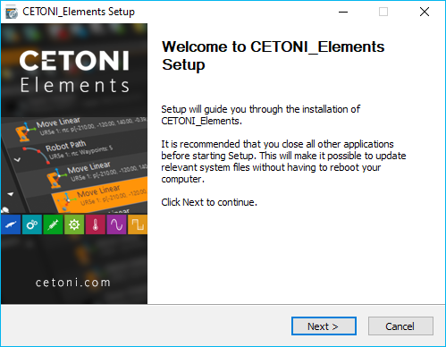

Installation
============

Installation der Software
-------------------------

.. admonition:: Wichtig
   :class: note

   Auf dem Steuerungs-PC sollten keine         
   weiteren rechenintensiven Anwendungen ausgeführt werden  
   um zeitkritische Steuerungsvorgänge der Software nicht   
   zu beeinträchtigen.     

.. admonition:: Wichtig
   :class: note

   Installieren Sie die Software +             
   Gerätetreiber bevor Sie Ihr Gerät über USB mit dem PC    
   verbinden.     

.. admonition:: Achtung
   :class: caution

   Gefahr von Fehlfunktion / Datenverlust      
   durch Standby- / Ruhemodus. Schalten Sie die Aktivierung 
   des Standby- / Ruhemodus an Ihrem PC oder Notebook aus   
   um eine Fehlfunktion des Hardware Treibers zu vermeiden. 

.. admonition:: Achtung
   :class: caution

   Gefahr von Fehlfunktion / Datenverlust     
   durch Energiesparoption. Betreiben Sie Ihren PC oder    
   Notebook stets im Netzbetrieb und deaktivieren Sie das  
   selektive USB-Energiesparen, um eine Fehlfunktion des   
   Hardware Treibers zu vermeiden.          

Zur Installation der Software legen Sie die CETONI Elements CD-ROM in
ihr CD/DVD Laufwerk oder stecken Sie den CETONI Elements USB-Stick in
einen freien USB-Anschluss. Starten Sie anschließend die Datei
*CETONI_Elements_Setup.exe* von der CD / dem USB-Stick. Der
Installationsassistent führt Sie anschließend durch die Installation der
Software und der Hardware Treiber.

.. admonition:: Wichtig
   :class: note

   Unter Windows müssen Sie mit               
   Administratorrechten angemeldet sein, um die            
   Installation der Hardware-Treiber durchführen zu        
   können.                     

Der Installationsassistent wird Sie nun durch die Installation der
Software führen.

Während der
Installation werden die Hardware Gerätetreiber installiert. Dieser
Schritt ist nur notwendig, wenn die Treiber auf Ihrem Rechner noch nicht
installiert wurden. Sind die Hardwaretreiber bereits installiert,
deaktivieren Sie bitte die Treiber Komponenten (siehe Abbildung unten).

.. image:: Pictures/10000201000001F300000184538F02512CCA7AB6.png

Minimale Systemanforderungen
-------------------------------------------------------------------------------

Um die Software nutzen zu können, sollte Ihr Rechner die folgenden
Systemvoraussetzungen erfüllen:

-  PC mit Intel Core i3 (oder besser) - min. 1.3 GHz (Die meisten
   Prozessoren, die 2015 und später produziert wurden, sollten gut mit
   der Software funktionieren)
-  mindestens 8 GB Arbeitsspeicher (empfohlen 16 GByte)
-  freie Festplattenkapazität von ca. 400 MByte
-  mindestens 2 freie USB (1.1 oder 2.0) Schnittstellen
-  Betriebssystem Windows 10 64-Bit (Windows 7 und Windows 8 können
   funktionieren, werden aber nicht getestet)
-  Monitor Auflösung: 1920 x 1080 (HD) oder höher
-  Maus mit Mausrad

Der Standby- oder Ruhemodus in Windows muss beim Betrieb der Software
deaktiviert werden, da die Aktivierung des Standby- / Ruhemodus zu
Fehlfunktionen des Hardware-Gerätetreibers führen kann.

.. admonition:: Achtung
   :class: caution

   Gefahr von Fehlfunktion / Datenverlust     
   durch Standby- / Ruhemodus. Schalten Sie die            
   Aktivierung des Standby- / Ruhemodus an Ihrem PC oder   
   Notebook aus, um eine Fehlfunktion des Hardware         
   Treibers zu vermeiden.      

Deaktivieren Sie bitte in den Energioptionen das selektive Energiesparen
für USB-Anschlüsse, um Verbindungsabbrüche zum Gerät zu vermeiden:

//.. image:: Pictures/10000201000001B2000001D8E9B73119A885DCC9.png

.. admonition:: Achtung
   :class: caution

   Gefahr von Fehlfunktion / Datenverlust     
   durch Energiesparoption. Betreiben Sie Ihren PC oder    
   Notebook stets im Netzbetrieb und deaktivieren Sie das  
   selektive USB-Energiesparen, um eine Fehlfunktion des   
   Hardware Treibers zu vermeiden.          

USB Gerätetreiber installieren
------------------------------

Die USB Gerätetreiber werden für die USB Verbindung zu Ihrem Gerät
benötigt. Wenn Sie ihr Gerät das erste Mal über USB mit Ihrem PC
verbinden, oder das Gerät später an einem anderen USB Steckplatz
anschließen, startet automatisch der Hardware-Assistent von Windows, der
ein neues USB-Gerät erkennt und die benötigten Treiber dafür
installiert, wenn Sie die CETONI Elements Software vorher bereits von CD
oder USB-Stick installiert haben.

.. admonition:: Wichtig
   :class: note

   Je nach verwendeter Windows Version kann   
   der Installationsvorgang der Gerätetreiber leicht       
   variieren.            

.. admonition:: Achtung
   :class: caution

   Gefahr von Datenverlust durch              
   unkontrollierte Ausschaltvorgänge! Beenden Sie stets    
   zuerst die Software CETONI Elements, bevor Sie Ihr      
   Gerät ausschalten! Nur dann werden alle Einstellungen   
   korrekt gespeichert, und Konfigurationsdaten gehen      
   nicht verloren.  

