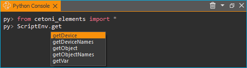
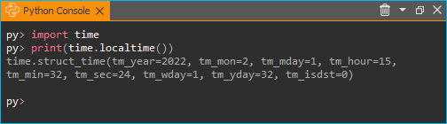
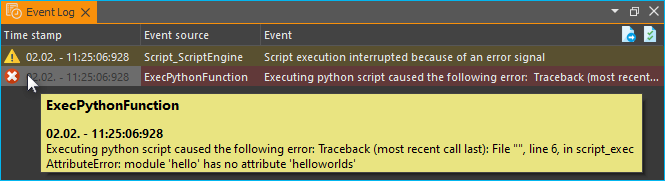

Python Add-on
=============

.. image:: Pictures/python_header.svg

Einführung in Python Add-on
------------------------------

.. admonition:: Achtung
   :class: caution

   Das CETONI Elements Python Add-on ermöglicht Ihnen die Steuerung und 
   Automatisierung von Prozessen mit der Skriptsprache Python. Überprüfen Sie 
   die erstellten Skripte/Programme sowie die Parametereingaben, bevor Sie diese 
   zum ersten Mal ausführen! CETONI übernimmt keine Haftung für direkte und/oder 
   indirekte Schäden an Ihrem System oder externen Hard- und Softwarekomponenten, 
   die durch die von Ihnen erstellten Skripte/Programme oder durch die Verwendung 
   von Parametern, die für Ihre spezifische Anwendung nicht geeignet oder 
   ungünstig sind, entstehen.

Das Python-Add-on ermöglicht es Ihnen, Python-Code in CETONI Elements-Skripten 
über eine entsprechende Skriptfunktion auszuführen. Es bietet somit eine einfache 
Möglichkeit, die Skriptsprache Python in Ihre CETONI Elements Skripte einzubinden.

Der eingebettete Python-Interpreter bietet die gleiche Funktionalität wie die 
Ausführung von Python-Skripten über den Befehl :command:`python`. D.h. wenn Sie 
Bibliotheken über :command:`pip` für die vom Add-On verwendete Python-Version 
installieren, stehen die Funktionen dieser Python-Bibliotheken auch in CETONI 
Elements zur Verfügung.

Dadurch ergeben sich viele zusätzliche Möglichkeiten, wie z. B. der Zugriff auf 
und das Parsen von Dateien, der Zugriff auf Datenbanken, die 
TCP/IP-Netzwerkkommunikation über Python-Sockets oder die Nutzung komplexer, 
in Python implementierter Analysefunktionen.

Installation
------------

Das Python Add-on ist nicht im Standard Installationspaket enthalten,
sondern muss als Add-on zusätzlich installiert werden. Die Versionen des
Python Add-ons und der installierten CETONI Elements Software sollten
übereinstimmen. Wenn Sie z.B. das Python Add-on mit der Versionsnummer
**20220126** installieren möchten, sollte die CETONI Elements Software mit
der Versionsnummer **20220126** installiert sein.

.. admonition:: Wichtig
   :class: note

   Die Versionsnummer der CETONI Elements      
   Software und des Python Add-ons sollten übereinstimmen.  
   Die Versionsnummer des Python Add-ons darf niemals       
   größer sein als die der CETONI Elements Software. Je     
   weiter die Versionsnummern auseinander liegen, um so     
   größer ist das Risiko von Fehlfunktionen.   

Starten Sie zur Installation die Datei :file:`CETONI_Elements_Python_64bit_Setup.exe`. 
Der Installationsassistent führt Sie anschließend durch die Installation der Software.

.. image:: Pictures/10000201000001F300000184E6B4E02B1D179B7A.png

Zur Verwendung des Python Add-ons muss auf Ihrem Rechner eine
passende Python 64-bit Version installiert sein. Im Installationsschritt
*Choose Components* können Sie die benötigte Version sehen (hier z.B.
Python 3.8) und diese ggf. zur Installation auswählen, falls diese noch
nicht auf Ihrem Rechner vorhanden ist.

.. image:: Pictures/10000201000001F300000184EEFA5602FDC005BD.png

.. admonition:: Wichtig
   :class: note

   Unter Windows müssen Sie mit                
   Administratorrechten angemeldet sein, um das Add-on      
   installieren zu können, da es für alle Anwender          
   installiert wird.    

.. admonition:: Wichtig
   :class: note

   Die installierte Python Version **muss** der Version entsprechen, die im Installer      
   angegeben ist. Das Plugin wird mit anderen Versionen     
   nicht korrekt funktionieren.        

Python Console
--------------

Übersicht
~~~~~~~~~

Das Python Add-on verfügt über eine Python Konsole, mit der Sie ähnlich
wie mit der Standard Python Konsole Python Code interaktiv eingeben und
ausführen können. Sie können die Python Konsole über das Hauptmenü
einblenden (:menuselection:`Window --> Show View --> Scripting --> Python Console`):

.. image:: Pictures/10000201000001EB00000073BDF3384E8179E4AB.png

In der Python Konsole können Sie Kommandos ausprobieren,
den Zugriff auf Objekte testen und und sie hilft Ihnen bei der
Fehlersuche. Wenn Funktionsaufrufe in der Konsole funktionieren, dann
können Sie diese auch in Ihrem Script verwenden.

Kontextmenü
~~~~~~~~~~~

Das Kontextmenü der Python Konsole enthält die üblichen Befehle zur
Textbearbeitung

Um den Inhalt der Konsole zu löschen, wählen im Kontextmenü
den Punkt :guilabel:`Clear` :guinum:`❶` oder klicken Sie in der Titelzeile auf das
Mülleimer Symbol :guinum:`❷`.

.. admonition:: Achtung
   :class: caution

   **Gefahr von Fehlfunktion / Datenverlust !**   
                                                                    
   Verwenden Sie die Python Console nicht in einem         
   laufenden Versuch, Prozess oder während des normalen    
   Betriebs oder produktiven Einsatzes. Fehleingaben oder  
   der Zugriff auf Ressourcen kann unter Umständen zum     
   Absturz der Software führen. 

Code-Vervollständigung
~~~~~~~~~~~~~~~~~~~~~~

Die Python Konsole unterstützt Sie bei der Eingabe durch eine einfache
Code-Vervollständigung. D.h., wenn Sie Module importiert haben, dann
unterstützt Sie die Code-Vervollständigung bei der Eingabe durch
passende Vorschläge, wie Sie es auch aus anderen Code-Editoren gewohnt
sind.

Im Beispiel oben wurden alle Funktionen aus dem Modul
*cetoni_elements* importiert. Nach der Eingabe von :code:`ScriptEnv.get`
werden passende Funktionen für das Objekt :code:`ScriptEnv` angezeigt, die mit
:code:`get` beginnen.

Fehlermeldungen
~~~~~~~~~~~~~~~

Fehler, die bei der Ausführung von Code in der Python Konsole auftreten,
aber auch Fehler die bei der Ausführung von Python Code in der Python
Scriptfunktion auftreten, werden Ihnen in der Python Konsole als roter
Text angezeigt.

.. image:: Pictures/10000201000001EF00000062B50A9A0A013ADF8C.png

Python Module
---------------

Standard Module importieren
~~~~~~~~~~~~~~~~~~~~~~~~~~~

Das Plugin verwendet eine Standard Python Installation und hat somit
Zugriff auf alle Standardmodule von Python oder auf andere Module, die
via :file:`pip` installiert wurden. Sie können ein Modul wie gewohnt mittels
:code:`import` Anweisung importieren. Im folgenden Beispiel wird das :file:`time`
Modul importiert und verwendet:

Eigene Module importieren
~~~~~~~~~~~~~~~~~~~~~~~~~~~~

Wenn Sie eigene Module verwenden, die Sie zusammen mit Ihrem Projekt
weitergeben oder ausliefern wollen, dann können Sie diese in den
Unterordner :file:`Scripts/Python` ihres aktuellen Projekts speichern. Dieses
Verzeichnis wird von der Software zum :code:`sys.path` des Python Interpreters
hinzugefügt. Wenn Sie z.B. im Projekt *PythonDev* arbeiten, dann wäre
der absolute Pfad zu diesem Verzeichnis:

.. centered::
   :file:`C:/Users/Public/Documents/QmixElements/Projects/PythonDev/Scripts/Python`

Wenn Sie in der Python Konsole das Modul :code:`sys` importieren, dann können
Sie via :code:`sys.path` sehen, dass sich das o.g. Verzeichnis im Importpfad
befindet.

.. image:: Pictures/100002010000025D00000083173EACC09611440F.png

Zum Test der Importfunktionalität erstellen Sie in dem o.g.
Ordner die Datei :file:`hello.py` mit folgendem Inhalt:

.. code-block:: python

   def helloworld():
      print("hello world")

Sie können dieses Modul nun importieren und die Funktion :code:`helloworld`
verwenden:

.. image:: Pictures/100002010000021E0000007B7A4EF3D62F1DF696.png

Zugriff auf Applikationsobjekte
------------------------------------------

Das Modul cetoni_elements
~~~~~~~~~~~~~~~~~~~~~~~~~

Die Software fügt dem Python-Interpreter ein Modul :code:`cetoni_elements`
hinzu, das für den Zugriff auf Applikationsobjekte verwendet werden
kann. Nach dem import des Moduls über :code:`from cetoni_elements import *`
können Sie auf diese Objekte zugreifen. Das :ref:`ScriptEnv`-Objekt ist das zentrale 
Objekt für den Zugriff auf verfügbare Geräte und Anwendungsobjekte.

.. note:: 
   Siehe :ref:`Python-API<API-Verweis>` für eine detaillierte Beschreibung des ScriptEnv-Objekts.

Das folgende Bild zeigt, wie man das Modul :code:`cetoni_elements` importiert und 
dann die Funktion :code:`help()` des Objekts `ScriptEnv`_ aufruft:

.. image:: Pictures/10000201000001F100000088C0C4A7C7C9B93CC8.png

Eigenschaften und Methoden von Objekten anzeigen.
~~~~~~~~~~~~~~~~~~~~~~~~~~~~~~~~~~~~~~~~~~~~~~~~~~~~~~~~~~~~

Mit der Python Funktion :code:`dir(object)` können Sie sich alle Methoden und
Eigenschaften von Applikationsobjekten anzeigen lassen. Damit können Sie
sich z.B. alle Funktionen und Eigenschaften des :code:`ScriptEnv` Objekts
anzeigen lassen.

.. image:: Pictures/10000201000002260000007A3CE2023C617A29C5.png

Alternativ verfügen alle Applikationsobjekte auch über eine
:code:`help()` Funktion, die eine übersichtlichere Anzeige der Eigenschaften
und Methoden eines Objekts ermöglicht. In der Abbildung unten ist der
Aufruf von :code:`ScriptEnv.help()` zu sehen. In der Konsole werden Ihnen die
Eigenschaften (:code:`Properties` :guinum:`❶`) und Methoden (:code:`Slots` :guinum:`❷`) des
:code:`ScriptEnv` Objekts angezeigt:

.. image:: Pictures/10000201000002260000011A8780E1969FECAAC9.png
   :width: 14.557cm

.. tip:: 
   Verwenden Sie die :code:`dir(object)` und die       
   :code:`Object.help()` Funktionen, um sich einen Überblick     
   über die Methoden und Eigenschaften eines bestimmten    
   Objekts zu verschaffen.      

Geräte-Objekte verwenden
~~~~~~~~~~~~~~~~~~~~~~~~

Über die Funktion :code:`ScriptEnv.getDevice()` können Sie auf Geräteobjekte
zugreifen. Um eine Übersicht der verfügbaren Gerätenamen zu erhalten,
können Sie die Funktion :code:`ScriptEnv.getDeviceNames()` aufrufen.

.. image:: Pictures/1000020100000240000000AEB0E9BCC2CF19CA4A.png

Die Code-Vervollständigung unterstützt Sie bei der Eingabe
eines Gerätenamens, indem sie Ihnen eine Liste passender Namen anzeigt
(siehe Abbildung oben). Wenn Sie die Funktion :code:`getDevice()` aufrufen,
ohne eine Zuweisung an eine Variable, dann können Sie in der Konsole
sehen, ob der Aufruf erfolgreich war:

.. code-block:: shell

   py> ScriptEnv.getDevice("Nemesys_S_1")
   CNemesys4Pump (QtLabb::CNemesys4Pump at: 0x000002402DDCBF20)

Um auf ein Gerät zugreifen zu können, weisen Sie das Ergebnis des
Aufrufs von :code:`getDevice()` einer Variable zu. Im folgenden Beispiel
weisen wir der Variable :code:`pump` das Geräteobjekt für die erste Nemesys S
Pumpe zu:

.. code-block:: shell

   py> pump = ScriptEnv.getDevice("Nemesys_S_1")

Nun können Sie sich mit Hilfe der :code:`dir(pump)` und der :code:`pump.help()`
Funktionen einen Überblick über die verfügbaren Methoden und Funktionen
des Pumpen Objekts verschaffen.

.. tip:: 
   Verwenden Sie die :code:`dir(object)` und die       
   :code:`Object.help()` Funktionen, um sich einen Überblick     
   über die Methoden und Eigenschaften von Geräteobjekten  
   zu verschaffen.  

.. admonition:: Wichtig
   :class: note

   Der Zugriff auf Geräteeigenschaften und    
   -methoden oder die Anzeige der Hilfe via                
   :code:`Object.help()` ist bei vielen Geräten nur möglich,    
   wenn die Anwendung zu den Geräten verbunden ist.  

.. admonition:: Achtung
   :class: caution
   
   **Gefahr von Fehlfunktion / Datenverlust !**  
                                                                    
   Über Gerätefunktionen haben Sie ggf. Zugriff auf        
   Funktionen die in der grafischen Oberfläche nicht zur   
   Verfügung stehen. Testen Sie Funktionen stets außerhalb 
   laufender Prozesse und nicht während eines produktiven  
   Einsatzes. Fehleingaben oder der Zugriff auf            
   Ressourcen, Methoden oder Eigenschaften kann unter      
   Umständen zu Fehlfunktionen oder zum Absturz der        
   Software führen.  

Wenn Sie mit dem Geräte verbunden sind, können Sie nun über die
Gerätefunktionen auf das Gerät zugreifen. So können Sie z.B. bei der
Pumpe einen Refill Vorgang auslösen:

.. code-block:: shell

   py> pump.refillSyringe()

oder den Pumpvorgang stoppen:

.. code-block:: shell

   py> pump.stopPumping()

Der folgende Code zeigt, wie Sie das :code:`cetoni_elements` Modul
importieren, sich über das :code:`ScriptEnv` Objekt das Geräteobjekt für die
Nemesys S Pumpe besorgen und dann einen Entleervorgang der Spritze
starten:

.. code-block:: shell

   py> from cetoni_elements import
   py> pump = ScriptEnv.getDevice("Nemesys_S_1")
   py> pump.emptySyringe()

Applikationsobjekte verwenden
~~~~~~~~~~~~~~~~~~~~~~~~~~~~~

Ähnlich wie bei Geräteobjekten, können Sie auch auf Applikationsobjekte,
die keine Geräte sind zugreifen. Verwenden Sie dafür die beiden
Funktionen :code:`ScriptEnv.getObject()` und :code:`criptEnv.getObjectNames()`.

Der folgende Code zeigt, wie Sie das :code:`cetoni_elements` Modul
importieren, sich über das :code:`ScriptEnv` Objekt das Applikationsobjekt des
grafischen Loggers besorgen und anschließend das Logging starten:

.. code-block:: shell

   py> from cetoni_elements import *
   py> plot = ScriptEnv.getObject("ProcessDataGraph")
   py> plot.startLogging()

.. tip:: 
   Verwenden Sie die :code:`dir(object)` und die       
   :code:`Object.help()` Funktionen, um sich einen Überblick     
   über die Methoden und Eigenschaften von                 
   Applikationsobjekten zu verschaffen. 

.. admonition:: Achtung
   :class: caution
   
   **Gefahr von Fehlfunktion / Datenverlust !**   
                                                                    
   Über die Funktionen der Applikationsobjekte haben Sie   
   ggf. Zugriff auf Funktionen die in der grafischen       
   Oberfläche nicht zur Verfügung stehen. Testen Sie       
   Funktionen stets außerhalb laufender Prozesse und nicht 
   während eines produktiven Einsatzes. Fehleingaben oder  
   der Zugriff auf Ressourcen, Methoden oder Eigenschaften 
   kann unter Umständen zu Fehlfunktionen oder zum Absturz 
   der Software führen.     

Python Scriptfunktionen - Execute Python Code
---------------------------------------------

Übersicht
~~~~~~~~~

.. image:: Pictures/1000139A00000B6A00000B5A63C99382F8AF9D57.svg
   :align: left
   :width: 60px

Das Python Plugin fügt dem Script-Pool die Scriptfuktion
:code:`Execute Python Code` hinzu, die in der Kategorie :guilabel:`Core Functions` 
des :guilabel:`Script Pool` zur Verfügung steht:

.. image:: Pictures/1000020100000109000001120A8A8A9BB7B494E7.png

Diese Funktion ermöglicht die Ausführung von Python Code im
Scriptsystem der Anwendung. Wenn Sie die Funktion in Ihr Script
einfügen, sehen Sie im Konfigurationsbereich das initiale Python Script.
Dieses Script enthält die beiden Funktionen :code:`script_exec()` und
:code:`script_abort()` :

.. code-block:: python

   # Implement your script logic in this function
   # Avoid blocking function calls
   def script_exec():
      return

   # Implement your clean up code here in case of script stop
   # Stop pending actions, clean up resources
   # Keep execution time of this function short and do not use
   # any blocking function calls
   def script_abort():
      return

Bei der Ausführung des Scripts wird dieses vom Python
Interpreter als eigenes Modul geladen und dann die Funktion
:code:`script_exec()` ausgeführt. D.h. diese Funktion ist die Hauptfunktion
des Scripts und die Logik sollte dort implementiert werden.

.. tip:: 
   Alle Möglichkeiten auf Geräteobjekte und      
   Applikationsobjekte zuzugreifen, die in der Python      
   Konsole der Anwendung zur Verfügung stehen, können auch 
   in der Scriptfunktion verwendet werden.  

Der Python Interpreter kann stets nur ein Python Script gleichzeitig
ausführen. Eine parallele Ausführung ist nicht möglich. Wenn Sie Python
Scripte in parallelen Sequenzen verwenden, dann werden die Scripte
hintereinander ausgeführt, d.h. ein paralleler Ausführungszweig
blockiert solange, bis die Ausführung eines Scriptes in einem anderen
Zweig abgeschlossen ist. Dies ist ein weiterer Grund dafür, dass Sie die
Ausführungszeit der Scripte so kurz wie möglich halten sollten.
Verwenden Sie nicht blockierende Python Scripte mit kurzen
Ausführungszeiten, so ist auch eine „quasi parallele“ Ausführung in
parallelen Sequenzen möglich.

.. admonition:: Wichtig
   :class: note

   Eine parallele Ausführung mehrerer Python  
   Funktionen ist nicht möglich. Werden Python Scripte in  
   parallelen Sequenzen verwendet, so werden diese         
   nacheinander ausgeführt.  

Python Script Editor
~~~~~~~~~~~~~~~~~~~~

Die Python Script Funktion verfügt über einen Python Code Editor, der
Sie beim Schreiben von Python Code unterstützt.

Der Editor verfügt über

-  Syntax Highlighting für Python Code :guinum:`❶`
-  eine einfache Code Vervollständigung
-  Code Folding :guinum:`❷`
-  Zeilennummern :guinum:`❸`
-  Undo / Redo Funktionalität :guinum:`❹`

Einige Funktionen des Editors stehen über das Kontextmenü zur Verfügung,
andere Funktionen sind über Tastenkürzel verfügbar. Hier einige der
Funktionen:

.. list-table::
   :widths: 50 50
   :header-rows: 1

   * - Aktion
     - Tastaturkürzel
   * - Schriftgröße vergrößern
     - :kbd:`Ctrl` + :kbd:`+`
   * - Schriftgröße verkleinern
     - :kbd:`Ctrl` + :kbd:`-`
   * - Schriftgröße auf Standard zurücksetzen
     - :kbd:`Ctrl` + :kbd:`0`
   * - Ausgewählten Codeblock einrücken
     - :kbd:`Tab`
   * - Ausgewählten Codeblock ausrücken
     - :kbd:`Shift` + :kbd:`Tab`
   * - Undo
     - :kbd:`Ctrl` + :kbd:`Z` oder Kontextmenü
   * - Redo
     - :kbd:`Ctrl` + :kbd:`Y` oder Kontextmenü

.. admonition:: Wichtig
   :class: note

   Das Editieren des Python Quelltextes ist   
   nur möglich, wenn das Script nicht läuft. Sobald das    
   Script gestartet wurde ist das Editieren des            
   Quelltextes gesperrt. Im Falle eines Fehlers müssen Sie 
   das Script über die *Terminate Script* Schaltfläche     
   beenden, bevor Sie den Python Code editieren können.

Den Scriptabbruch handeln - script_abort()
~~~~~~~~~~~~~~~~~~~~~~~~~~~~~~~~~~~~~~~~~~

Wenn das laufende Script über die :guilabel:`Terminate Script` Schaltfläche des
Script Editors (siehe Abbildung unten) abgebrochen wird, dann wird die
Ausführung von :code:`script_exec()` unterbrochen und die Funktion
:code:`script_abort()` wird ausgeführt:

.. image:: Pictures/10000201000001950000009E1928E5F4B3BBCE66.png

Im Fall eines solchen Abbruchs sehen Sie in der Python
Konsole eine entsprechende Fehlermeldung:

.. image:: Pictures/10000201000001F60000006B04A15868149985AC.png

Wenn Sie auf den Abbruch des Scripts reagieren möchten, z.B.
um Ressourcen freizugeben oder um den Anwender zu informieren, dann
können Sie dies in der :code:`script_abort()` Funktion tun. Wenn Sie in der
:code:`script_abort()` Funktion auf Daten oder Objekte (z.B. File Handels,
Sockets o.ä) zugreifen möchten, die Sie in der :code:`script_exec()` Funktion
verwendet haben, so können Sie dies über globale Variablen tun. Das
folgende Script zeigt ein entsprechendes Beispiel. In der
:code:`script_abort()` Funktion wird die Anzahl der Schleifendurchläufe
ausgegeben, die bis zum Abbruch des Scripts durchlaufen wurden. Beide
Funktionen greifen dafür auf die globale Variable :code:`counter` zu:

.. code-block:: python

   import time

   counter = None

   def script_exec():
      global counter
      for i in range(1000):
         counter = i
         print(i)
         time.sleep(1)
      return

   def script_abort():
      global counter
      print("script_abort() after ", counter, " loops")
      return

Implementierung der Funktionslogik in script_exec()
~~~~~~~~~~~~~~~~~~~~~~~~~~~~~~~~~~~~~~~~~~~~~~~~~~~

Bei der Implementierung des Scriptes in :code:`script_exec()` sollten Sie
darauf achten, keine blockierenden Funktionen oder blockierendes Warten
zu verwenden. Der Python Interpreter kann über die :guilabel:`Terminate Script`
Schaltfläche nur **nach** der Ausführung des aktuellen Python
Statements unterbrochen werden. Sollte das aktuelle Statement ein
blockierender Funktionsaufruf sein, z.B. :code:`time.wait(10)`, kann der
Interpreter erst nach 10 Sekunden unterbrochen werden wenn der *wait*
Aufruf beendet wurde. Versehen Sie deshalb blockierende Funktionsaufrufe
immer mit einem Timeout.

.. admonition:: Wichtig
   :class: note

   Verwenden Sie keine blockierenden          
   Funktionsaufrufe um einen Abbruch der Skriptausführung  
   nicht zu blockieren. Versehen Sie blockierende          
   Funktionsaufrufe stets mit einem Timeout.  

Im folgenden Beispiel ist der Aufruf von :code:`socket.recv()` in Zeile 8
blockierend. D.h. der Aufruf kehrt erst zurück, wenn Daten empfangen
wurden. Solange keine Daten empfangen werden, blockiert die Funktion und
das Script kann nicht sauber abgebrochen werden:

.. code-block:: python

   import socket

   def script_exec():
      HOST = '127.0.0.1'  # The server's hostname or IP address
      PORT = 65432        # The port used by the server
      with socket.socket(socket.AF_INET, socket.SOCK_STREAM) as s:
         s.connect((HOST, PORT))
         data = s.recv(2048)
      return

Um dieses Problem zu beheben sollte der Aufruf von :code:`socket.recv()` mit
einem Timeout versehen werden. Dies wurde im folgenden Beispiel mit
Hilfe der Funktion :code:`socket.settimeout()` umgesetzt:

.. code-block:: python

   import socket

   def script_exec():
      HOST = '127.0.0.1'  # The server's hostname or IP address
      PORT = 65432        # The port used by the server
      with socket.socket(socket.AF_INET, socket.SOCK_STREAM) as s:
         s.connect((HOST, PORT))
         s.settimeout(0.5)
         try:
            data = s.recv(2048)
         except socket.timeout as err:
            print(err)
      return

Fehler bei Scriptausführung
~~~~~~~~~~~~~~~~~~~~~~~~~~~

Wenn während der Ausführung eines Scripts Fehler auftreten, werden Ihnen
diese im :guilabel:`Event Log` und in der Python-Konsole :guilabel:`Python console` 
angezeigt. Wenn Sie im
Event Log die Maus über die Fehlermeldung bewegen, sehen Sie ein
Hinweisfenster mit den Details:

In der Python Konsole wird Ihnen die Fehlermeldung als roter
Fehlertext angezeigt:

In der Fehlermeldung erhalten Sie auch die Information, in
welcher Zeile des Scripts ein Fehler aufgetreten ist. Das hilft Ihnen,
im Script-Editor den Fehler zu finden und zu beheben.

.. admonition:: Wichtig
   :class: note

   Das Editieren des Python Quelltextes ist   
   nur möglich, wenn das Script nicht läuft. Sobald das    
   Script gestartet wurde ist das Editieren des            
   Quelltextes gesperrt. Im Falle eines Fehlers müssen Sie 
   das Script über die :guilabel:`Terminate Script` Schaltfläche     
   beenden, bevor Sie den Python Code editieren können.   

Eigene Module verwenden
~~~~~~~~~~~~~~~~~~~~~~~

Wenn Ihr Script eine sehr komplexe und umfangreiche Logik enthält,
können Sie den Code ggf. in ein externes Modul auslagern und über die
Importfunktionalität einbinden (siehe Abschnitt `Eigene Module
verwenden`_). Sie können
dann aus :code:`script_exec()` heraus die Funktionen des importierten Moduls
aufrufen.

Im folgenden Beispiel importieren wir unser eigenes Modul :file:`hello` und
rufen daraus die Funktion :code:`helloworld()` auf.

.. code-block:: python

   import hello

   def script_exec():
      hello.helloworld()
      return

Dies Ausgabe des Scripts erscheint sowohl im Event Log:

.. image:: Pictures/100002010000018E0000004E45BDDA2F2CB1A1E9.png

als auch in der Python Konsole:

.. image:: Pictures/1000020100000157000000475414DB3324BBC74A.png
 
Wenn Sie das Modul bereits importiert haben und danach noch
Änderungen am externen Modul durchführen, dann sind diese Änderungen in
Ihrem Python Script in der Anwendung nicht verfügbar. Dies ist das
normale Verhalten des Python Interpreters – wenn ein Modul einmal
importiert wurde, dann wird es nicht erneut importiert. Fügen Sie
testweise Ihrem eigenen :file:`hello` Modul die Funktion :code:`hellouniverse()`
hinzu:

.. code-block:: python

   def hellouniverse():
      print("hello universe")

Bei der Ausführung erhalten Sie die Information, dass die Funktion
:code:`hellouniverse` nicht verfügbar ist.

Um zu verhindern, dass Sie nach der Änderung des externen Moduls die
Anwendung neu starten müssen, um das Modul erneut zu importieren, können
Sie in Ihrem Script mit der :code:`reload()` Funktion aus dem Modul
:file:`importlib` explizit ein Reload anfordern. Ändern Sie dafür Ihr Python
Script in der Anwendung wie folgt ab:

.. code-block:: python

   import hello
   from importlib import reload

   def script_exec():
      reload(hello) # trigger explicit reload of hello module
      hello.helloworld()
      hello.hellouniverse()
      return

Das Script wird nun korrekt ausgeführt.

.. tip::
   Verwenden Sie die :code:`importlib.reload()`       
   Funktion, wenn Sie Änderungen an externen Modulen       
   durchführen, nachdem Sie diese bereits via import in    
   Ihr Python Script in der Anwendung importiert haben.

Zugriff auf Scriptvariablen
~~~~~~~~~~~~~~~~~~~~~~~~~~~

Um die Ergebnisse von Berechnungen im Python Code an das laufende Script
übergeben zu können oder auf Werte aus dem Script reagieren zu können,
ist der Zugriff auf Scriptvariablen möglich. Dazu importieren Sie das
Modul :file:`cetoni_elements` (siehe Abschnitt `Das Modul cetoni_elements`_).

Wenn Sie das Modul importiert haben, können Sie über die Funktionen
:code:`ScriptEnv.getVar()`, :code:`ScriptEnv.setVar()` und
:code:`ScriptEnv.setVars()` auf Scriptvariablen zugreifen. Das folgende
Beispiel zeigt, wie die Scriptvariable :code:`$Flow` gelesen, um 2
inkrementiert und dann der berechnete Wert wieder in der Scriptvariablen
gespeichert wird:

.. code-block:: python

   from cetoni_elements import *

   def script_exec():
      flow = ScriptEnv.getVar("$Flow")
      print(flow)
      flow = flow + 2;
      ScriptEnv.setVar("$Flow", flow)
      print(flow)
      return

.. admonition:: Wichtig
   :class: note

   Beachten Sie, das Scripvariablen auch im   
   Python Script immer mit einem Dollarzeichen beginnen -  
   :code:`$VarName`.  

Mit Hilfe von Scriptvariablen kann auch auf Geräte zugegriffen werden.
Scriptvariablen können Gerätereferenzen speichern. Durch das Lesen der
Gerätereferenz und der Zuweisung an eine Python Variable kann auf das
Geräteobjekt zugegriffen werden. Im folgenden Beispiel enthält die
Scriptvariable :code:`$Pump1` eine Gerätereferenz der Pumpe *Nemesys_S_1*, die
der Variablen in der *Create Variable* Funktion zugewiesen wurde. Die
Gerätereferenz wird aus der Variable gelesen und der Python Variable
:code:`pump` zugewiesen. Nun kann über die :code:`pump` Variable auf
Gerätefunktionen zugegriffen werden. In diesem Beispiel wird die Spritze
via :code:`pump.emptySyringe()` entleert:

.. code-block:: python

   from cetoni_elements import *

   def script_exec():
      pump = ScriptEnv.getVar("$Pump1")
      print(pump)
      pump.emptySyringe()
      return

Im Python Code ist es auch möglich Listen zu erzeugen, und diese in
einer Variablen zu speichern. Das folgende Beispiel erzeugt eine Liste
aus 4 Werten und speichert diese in der Scriptvariable :code:`$Positions`:

.. code-block:: python

   from cetoni_elements import *

   def script_exec():
      ScriptEnv.setVar("$Positions", [0, 3.5, 12, 7])
      return

Statt einfacher Werte können auch Listen von Geräten erzeugt und in
Variablen gespeichert werden. Im folgenden Beispiel wird eine Liste
erzeugt, welche die beiden Digitalen Eingänge der ersten *Nemesys S*-Pumpe
enthält. Diese Liste wird in der Scriptvariable :code:`$DigitalInputs`
gespeichert.

.. code-block:: python

   from cetoni_elements import *

   def script_exec():
      di1 = ScriptEnv.getDevice("Nemesys_S_1_DigIN1")
      di2 = ScriptEnv.getDevice("Nemesys_S_1_DigIN2")
      ScriptEnv.setVar("$DigitalInputs", [di1, di2])
      return

Beispielscripte
---------------

Barcode Scanner
~~~~~~~~~~~~~~~

Das folgende Beispielscript zeigt, wie die Kamera Unterstützung von
CETONI Elements verwendet werden kann, um mit Hilfe des
`pyzbar <https://pypi.org/project/pyzbar/>`__ Moduls einen Barcode
Scanner zu implementieren:

.. code-block:: python
   :linenos:

   from pyzbar import pyzbar
   import time
   import qimage2ndarray
   from cetoni_elements import *

   # Main script function
   def script_exec():
      barcode = None
      camera = ScriptEnv.getObject('Qmix_CAM_1')
      qimage = camera.capturedPreviewImage()
      frame = qimage2ndarray.rgb_view(qimage)
      barcodes = pyzbar.decode(frame)
      for b in barcodes:
         barcode = b.data.decode('utf-8')
         break

      # output
      if barcode is not None:
         ScriptEnv.setVar('$Barcode', barcode)
      else:
         ScriptEnv.setVar('$Barcode', 0)
      return

Durch den Import des Moduls :file:`cetoni_elements` kann auf die Kamera
zugegriffen und ein Bild aufgenommen werden:

.. code-block:: python

   camera = ScriptEnv.getObject('Qmix_CAM_1')
   qimage = camera.capturedPreviewImage()

Das Modul `qimage2ndarrays <https://pypi.org/project/qimage2ndarray/>`__
hilft uns dabei, das aufgenommene Bild im Format :code:`QImage` in ein
:code:`numpy.ndarray` zu konvertieren, welches vom 
`pyzbar <https://pypi.org/project/pyzbar/>`__ Modul verwendet wird.

.. code-block:: python

   frame = qimage2ndarray.rgb_view(qimage)

Nun können wir das `pyzbar <https://pypi.org/project/pyzbar/>`__ Modul
verwenden um den Barcode zu decodieren:

.. code-block:: python

   barcodes = pyzbar.decode(frame)
   for b in barcodes:
      barcode = b.data.decode('utf-8')
      break

Im letzten Schritt wird der Barcode mit der Funktion
:code:`ScriptEnv.setVar()` in der Scriptvariable :code:`$Barcode` gespeichert, damit
er im Script zur Verfügung steht und ausgewertet werden kann.

.. code-block:: python

   if barcode is not None:
      ScriptEnv.setVar('$Barcode', barcode)
   else:
      ScriptEnv.setVar('$Barcode', 0)
   return

API-Referenz
------------

ScriptEnv
~~~~~~~~~~

Das :code:`ScriptEnv`-Objekt ist das zentrale Objekt für den Zugriff auf 
verfügbare Geräte und Anwendungsobjekte.

.. doxygenclass:: Python::CScriptEnvAccess
    :project: python
    :path: ../doxygen/xml
    :members:
    :members-only:
    :membergroups: scripting