Einführung CETONI Elements Software
===================================

Erster Start
------------

Beim ersten Start der Software wird die Auslieferungskonfiguration ohne
Plugins geladen. D.h. die Software lädt nur ihr Kern-System aber keine
gerätespezifischen Plugins. Dies erkennen Sie daran, dass Ihnen von der
Software der Startbildschirm angezeigt wird (Abbildung unten).

Um mit der Software
ihre Geräte ansteuern zu können, müssen Sie eine Gerätekonfiguration
installieren und laden. Eine Gerätekonfiguration ist eine Sammlung von
Konfigurationsdateien, welche die Konfiguration aller Geräte und Module
beschreiben, die zusammen ein komplexes System oder Gerät bilden. Im
Startbildschirm sehen Sie alle Möglichkeiten, eine entsprechende
Gerätekonfiguration zu laden:

.. admonition:: Wichtig
   :class: note

   Die Auslieferungskonfiguration mit dem      
   Startbildschirm wird auch nach einem Softwareabsturz     
   oder nach einem Update der Software geladen und          
   angezeigt.      

Wenn Sie die Anwendung im Demonstrationsmodus starten
möchten, z.B. bei Präsentationen, zum ausprobieren und testen oder
wenn Sie im Moment keine Geräte haben, dann klicken Sie die
Schaltfläche :guilabel:`Start Demo` an. 

Lizenzschlüssel
---------------

Lizenzen aktivieren
~~~~~~~~~~~~~~~~~~~

Direkt nach der Erstinstallation der Software, verfügen Sie über eine
aktive Demo-Lizenz. Um sich Ihre installierten Lizenzen anzeigen zu
lassen, wählen Sie im Hauptmenü den Punkt
:menuselection:`Help --> Show License Information`.

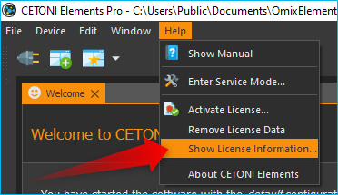

Mit der Demo-Lizenz können Sie Gerätekonfigurationen mit simulierten
Geräten erstellen und alle Funktionen der Software testen.

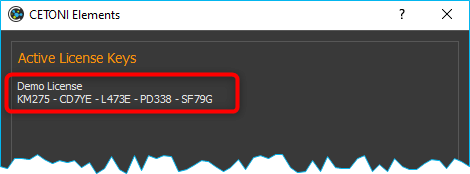

Um die Software zur Steuerung Ihrer Geräte verwenden zu
können, müssen Sie den Lizenzcode den Sie erhalten haben in der Software
registrieren. Wählen Sie dafür im Hauptmenü den Punkt 
:menuselection:`Help --> Activate License`.

Geben Sie in dem Dialog Ihren Lizenzcode ein und klicken Sie
anschließend auf die Schaltfläche Activate. Wenn Sie den Lizenzschlüssel
korrekt eingegeben haben, wird Ihnen die Aktivierung der Lizenz
bestätigt und nach dem Neustart der Software können Sie mit der
aktivierten Lizenz arbeiten:

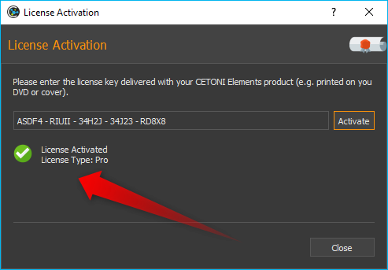

Wenn Sie Ihre Lizenz upgraden oder zusätzliche Lizenzen für
weitere Add-ons aktivieren möchten, können Sie genau wie oben
beschrieben vorgehen.

Übersicht der aktivierten Lizenzen
~~~~~~~~~~~~~~~~~~~~~~~~~~~~~~~~~~

Über die Menüpunkt :menuselection:`Help --> Show License Information` 
Information im Hauptmenü der
Anwendung, können Sie sich eine Übersicht der aktuellen Lizenzen
anzeigen lassen:

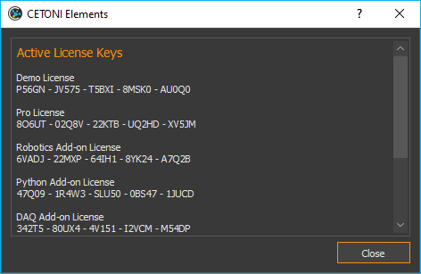

Lizenzen entfernen
~~~~~~~~~~~~~~~~~~

Wenn Sie alle Lizenzen entfernen möchten, wählen Sie im Hauptmenü den
Menüpunkt :menuselection:`Help --> Remove License Data` Data. 
Es lassen sich keine einzelnen
Lizenzen entfernen sondern nur alle Lizenzen gemeinsam. Nach dem
Entfernen der Lizenzen arbeiten Sie wieder mit einer Demo Lizenz.

Gerätekonfiguration
-------------------
Um mit der Software ihre Geräte ansteuern zu können, müssen Sie eine 
Gerätekonfiguration installieren und laden. Eine Gerätekonfiguration 
ist eine Sammlung von Konfigurationsdateien, welche die Konfiguration 
aller Geräte und Module beschreiben, die zusammen ein komplexes System 
oder Gerät bilden. Im Startbildschirm sehen Sie alle Möglichkeiten, 
eine entsprechende Gerätekonfiguration zu laden:

Gerätekonfiguration erstellen  
~~~~~~~~~~~~~~~~~~~~~~~~~~~~~~

Über die Schaltfläche :guilabel:`Create Configuration` können Sie neue
Gerätekonfigurationen erstellen. Um einzelne Geräte oder komplette
Systeme bestehend aus mehreren Einzelgeräten in CETONI Elements zu
benutzen, müssen Sie eine Gerätekonfiguration erstellen. Hierfür
verwenden Sie den :ref:`Device Configurator<Creating Device Configurations>`,
welcher in CETONI Elements
integriert ist.

|

Gerätekonfiguration öffnen 
~~~~~~~~~~~~~~~~~~~~~~~~~~~~~~

Mit dieser Schaltfläche können Sie eine vorhandene Gerätekonfiguration laden, die zuvor auf Ihrem System installiert wurde.

Gerätekonfiguration importieren
~~~~~~~~~~~~~~~~~~~~~~~~~~~~~~

Für die meisten Geräte und Module können Sie
Gerätekonfigurationen mit dem Gerätekonfigurator selbst erstellen. Wenn
Sie Geräte haben, die vom Gerätekonfigurator noch nicht unterstützt
werden oder wenn Sie Geräte verwenden, die von CETONI vorkonfiguriert
werden müssen finden Sie die Gerätekonfiguration auf dem
Installationsdatenträger (CD oder USB-Stick) den Sie zusammen mit Ihrem
Gerät erhalten haben.

Um eine vorhandene Gerätekonfiguration zu importieren, führen Sie die
folgenden Schritte durch:

.. admonition:: Tipp
   :class: tip

   Wenn Sie eine Konfiguration mit dem           
   Gerätekonfigurator erstellen, wird diese automatisch    
   installiert und Sie brauchen die folgenden Schritte     
   nicht durchzuführen.     

.. rst-class:: steps

#. Wählen Sie im Hauptmenü den Menüpunkt :menuselection:`Device --> Import Configuration`.

    .. image:: ./Pictures/10000000000001310000010F1E67A086173830FE.png

#. Wählen Sie nun, ob
   Sie einen Ordner mit einer Gerätekonfiguration importieren möchten
   (:guilabel:`Import Folder`) oder eine komprimierte Konfigurationsdatei
   (:guilabel:`Import .qcf File`). Auf der Installations-CD, die Sie mit ihrem
   Gerät erhalten haben, sind die Gerätekonfigurationen in Ordnern
   abgelegt. Wählen Sie deshalb den Punkt :guilabel:`Import Folder`.

    .. image:: ./Pictures/1000000000000214000000A60483FD84C031337D.png

#. In dem Verzeichnisdialog, der nun angezeigt wird, wählen Sie das
   Verzeichnis :file:`DeviceConfiguration` auf der Installations-CD oder ein
   anderes Verzeichnis, dass eine gültige Gerätekonfiguration enthält.

     .. image:: ./Pictures/10000201000002810000018F6EE2B3E17DBB7FD1.png
    
#. Geben Sie nun noch einen kurzen eindeutigen Namen für die
   Konfiguration ein, unter dem diese auf ihrem Rechner gespeichert
   werden soll.

     .. image:: ./Pictures/10000000000001B00000009EB2ADDF0AD16AE80B.png
      :alt: Abbildung 1.3: Konfigurationsnamen vergeben

#. Bestätigen Sie den Neustart der Anwendung.

     .. image:: ./Pictures/100000000000020900000097955C208F8F030D3B.png
      :alt: Abbildung 1.4: Anwendung neu starten

Nach diesen Schritten sollte die Software nun mit der gewählten Konfiguration 
geladen werden.

.. admonition:: Wichtig
   :class: note

   Beim Import werden Gerätekonfigurationen stets in das aktuelle Projekt importiert.

Gerätekonfiguration exportieren
~~~~~~~~~~~~~~~~~~~~~~~~~~~~~~~~

Sie können Gerätekonfigurationen auch exportieren, z.B. wenn Sie eine
Konfiguration an Mitarbeiter weitergeben möchten oder im Support-Fall,
wenn Sie eine Gerätekonfiguration an CETONI senden möchten. Um eine
Gerätekonfiguration zu exportieren, wählen Sie im Hauptmenü den
Punkt :menuselection:`Device --> Export Configuration`.

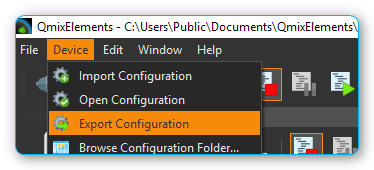

Gerätekonfigurationen werden als komprimierte :file:`*.qcf` Dateien exportiert.

Grundlagen CETONI Elements
----------------------------

Einführung
~~~~~~~~~~~~

Die CETONI Elements Software ist eine Plugin-basierte, modulare
Softwarelösung für die Steuerung verschiedenster Geräte im Bereich der
Laborautomatisierung. Die Software besteht aus einem Kern, der die
grundlegenden Funktionen und Dienste, wie z.B. das Anwendungsfenster,
das Ereignisprotokoll oder die Werkzeugleiste, zur Verfügung stellt.

Dieses Grundsystem wird durch geräte- bzw. applikationsspezifische
Softwaremodule, die Plugins, erweitert. Dadurch wird es möglich, je nach
Gerätekonfiguration, eine passende Softwarelösung zur Verfügung zu
stellen und das in einer einheitlichen Oberfläche.

Bedienungsanleitung anzeigen
~~~~~~~~~~~~~~~~~~~~~~~~~~~~~~

Die Bedienungsanleitung der Software können Sie sich über den
Menüpunkt :menuselection:`Help --> Show PDF Manual` im Hauptmenü der 
Anwendung anzeigen lassen.

.. admonition:: Wichtig
   :class: note

   Zur Anzeige der Bedienungsanleitung muss eine PDF-Betrachtungssoftware 
   installiert sein. 

Softwareversion anzeigen
~~~~~~~~~~~~~~~~~~~~~~~~~~

Unter Umständen, z.B. im Servicefall, kann es notwendig sein, die
Version der installierten Software zu ermitteln. Wählen Sie hierfür im
Hauptmenü den Punkt :menuselection:`Help --> About CETONI Elements`. Es wird nun
ein Fenster eingeblendet (siehe Abbildung unten), in dem die
Versionsnummer der Software angezeigt wird.

.. image:: ./Pictures/100000000000023E0000011C5BF7D6D89E212C48.png

Übersicht CETONI Elements Hauptfenster
----------------------------------------

Das Anwendungsfenster der CETONI Elements Software besteht im
Wesentlichen aus den folgenden Komponenten:

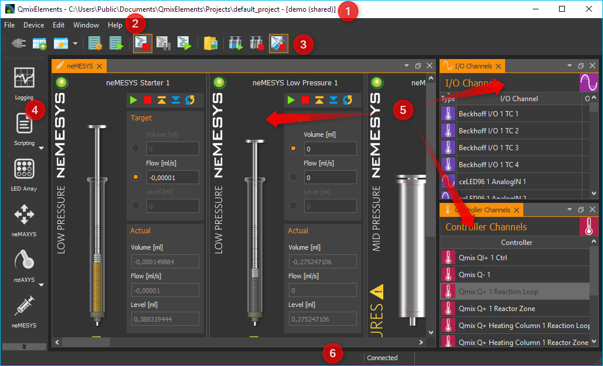

.. rst-class:: guinums

1.  Titelleiste
2.  Hauptmenü
3.  Werkzeugleisten (frei positionierbar, kann ausgeblendet werden)
4.  Seitenleiste der Arbeitsbereiche (frei positionierbar, kann
   ausgeblendet werden)
5.  Die einzelnen Views (Ansichten), die frei in der Oberfläche
   verschoben werden können
6.  Statuszeile

Titelleiste
-----------

In der Titelleiste wird Ihnen der Name der Anwendung, der aktuelle
Projektpfad und der Name der aktuell geladenen Gerätekonfiguration
angezeigt. Das folgende Beispiel verdeutlicht dies etwas genauer.
Enthält die Titelleiste z.B. den folgenden Text:

:code:`CETONI Elements – C:\Users\Public\\Documents\CETONI Elements\Projects\default_project [demo (shared)]`

dann können Sie daraus die folgenden Informationen entnehmen:

-  **Name der Anwendung**: CETONI Elements
-  **aktueller Projektpfad:** :file:`C:\\Users\\Public\\Documents\\CETONI Elements\\Projects\\default_project`
-  **Gerätekonfiguration:** demo (shared)

Views (Ansichten)
-----------------

Einführung
~~~~~~~~~~

Die *Views* sind Fenster, die die Anzeige- und Steuerlemente für eine ganz
bestimmte Aufgabe oder ein bestimmtes Gerät beinhalten. So gibt es z.B.
*Views* für den grafischen Logger, die Anzeige von I/O Kanälen oder für
den Script Editor.

Alle Views können innerhalb des Hauptfensters via Drag & Drop frei
verschoben werden. Alle Views können ein- und ausgeblendet werden und
die Views können auch via Drag & Drop aus dem Hauptfenster herausgelöst
werden, um sie auf einen anderen Bildschirm zu verschieben. Damit können
Sie die Oberfläche der CETONI Elements Software optimal an Ihre
Anforderungen und Ihre Anwendung anpassen und sich so eine individuelle
grafische Oberfläche konfigurieren.

Views einblenden
~~~~~~~~~~~~~~~~

Wenn Sie die Software starten, kann es sein, dass nicht alle Views
eingeblendet sind. Um einen View einzublenden, wählen Sie im Hauptmenü
den Punkt :menuselection:`Window --> Show View`. Sie sehen dann ein Menü mit allen Views,
die in der Anwendung zur Verfügung stehen. Klicken Sie einfach den
entsprechenden Menüpunkt an, um den View einzublenden (siehe Abbildung
unten).

Bei verschiedenen
Geräten kann es sein, dass für jedes Gerät ein eigener View existiert
(z.B. für Kameras). In diesem Fall sind die Views im View-Menü in einer
Gruppe zusammengefasst und können einzeln eingeblendet werden.

Alternativ können Sie auch
einige Views über die :guilabel:`Seitenleiste` einblenden, ohne dafür erst das
Hauptmenü öffnen zu müssen.

Views verschieben
~~~~~~~~~~~~~~~~~

Um einen View zu verschieben, müssen Sie ihn zuerst aus seiner
bisherigen Position lösen. Dafür gibt es verschiedene Möglichkeiten. Die
erste Möglichkeit ist Drag & Drop. Klicken Sie dafür mit der linken
Maustaste in den Reiter des Views :guinum:`❶` und ziehen Sie den View einfach
mit gedrückter Maustaste aus seiner Position heraus :guinum:`❷`. Solange Sie
die Maustaste nicht loslassen, können Sie den View frei verschieben
(siehe Abbildung unten).

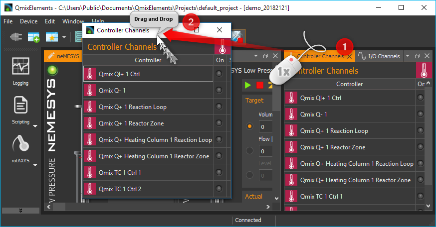

Alternativ können Sie
den View auch durch einen Doppelklick auf den Reiter aus seiner Position
herauslösen. Die dritte Möglichkeit ist das Kontextmenü des Views.
Klicken Sie dafür mit der rechten Maustaste in den Karteireiter und
wählen Sie aus dem Kontextmenü den Punkt :guilabel:`Detach`.

Wenn
Sie den View aus seiner Position herausgelöst haben, wird der View in
einem eigenen Fenster angezeigt. Dieses Fenster können Sie nun wie jedes
andere Fenster des Betriebssystems vergrößern, verkleinern, maximieren
oder auf einen anderen Bildschirm verschieben.

Views andocken
~~~~~~~~~~~~~~

Sie können Views, oder Gruppen von Views, die ein eigenes Fenster haben,
via Drag & Drop in das Hauptfenster oder ein beliebige anderes
View-Fenster andocken. Dafür ziehen Sie das Fenster des Views einfach
über das Zielfenster, in das der View / die View-Gruppe angedockt werden
soll. In dem Zielfenster werden Ihnen dann Symbole angezeigt – die
*Drop-Targets*. Diese Zielmarkierungen kennzeichnen die Bereiche, in denen
das Fenster eingefügt werden kann. Wenn Ihr Zielfenster nur einen View
enthält, sehen Sie nur 5 Drop-Targets.

Wenn Sie den Mauszeiger über
ein *Drop-Target* bewegen, während Sie ein Fenster verschieben, dann wird
Ihnen über einen farbigen Rahmen (*Drop Preview*) angezeigt, an welche
Position (*Dock Area*) der View eingefügt werden würde.

Wenn Sie nun die Maustaste über der Zielmarkierung loslassen, wird das
das Fenster an der durch das Drop-Preview gekennzeichneten Position
eingefügt.

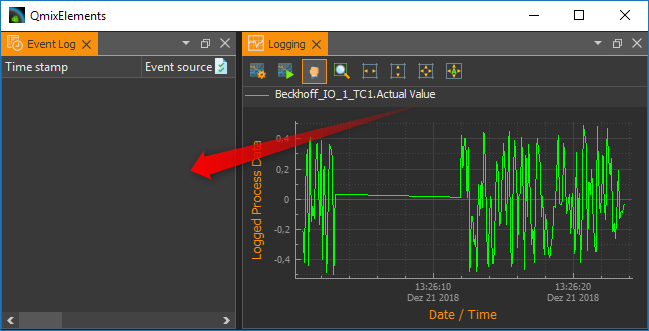

Wenn Sie als
Drop-Target das Symbol in der Mitte des Fensters wählen, dann wird der
neue View als ein zusätzlicher Karteireiter auf der Position des dort
vorhandenen Views eingefügt.

Wenn Sie das Ihr View über ein Fenster
ziehen, welches bereits mehrere Views enthält, dann werden Ihnen
zusätzliche Drop-Target Markierungen angezeigt. D.h., Sie haben dann
zusätzliche Möglichkeiten für das Andocken des View-Fensters. In der
Abbildung unten können Sie dies sehen. Es gibt die äußeren Drop-Targets
:guinum:`❶`, die Sie bereits aus der Beschreibung oben kennen. Zusätzlich gibt
es noch fünf weitere Drop-Targets, die in Form eines Kreuzes angezeigt
werden :guinum:`❷`.

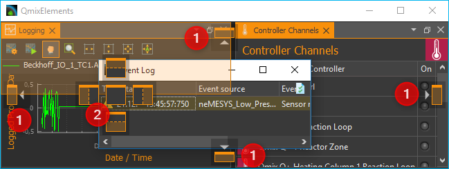

Bewegen Sie das Fenster bei
gedrückter Maustaste über die einzelnen Markierungen das Drop-Preview zu
sehen und um ein Gefühl dafür zu bekommen, welche Möglichkeiten zum
Andocken eines Fensters existieren.

Wenn Sie ein View als zusätzlichen Karteireiter andocken möchten, können
Sie den Mauspfeil entweder über das mittlere Drop-Target Symbol
:guinum:`❶` bewegen (siehe Abbildung unten) oder über die Titelleiste eines
bereits angedockten Views :guinum:`❷`.

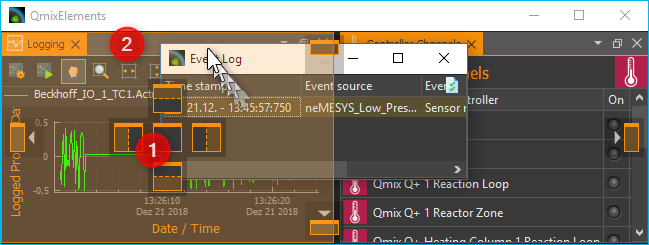

View-Gruppen verschieben
~~~~~~~~~~~~~~~~~~~~~~~~~~~~~~~~~~~~~~~~~~~~~~~~~~~~~~~~~~~~~~~~~~~~~~~~~~~~~~~~~~~~~~

Es können nicht nur einzelne Views verschoben werden sondern auch
komplette View-Gruppen in denen mehrere Views als Karteireiter enthalten
sind. Zum Verschieben einer kompletten View-Gruppe klicken Sie nicht auf
den Karteireiter des Views sondern in die Titelleiste der Gruppe (siehe
Abbildung unten). Sie können nun die komplette Gruppe via Drag & Drop
aus der aktuellen Position herauslösen und verschieben.

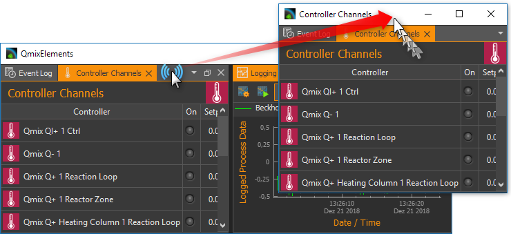

Alternativ können Sie eine
View-Gruppe auch herauslösen durch einen Doppelklick in die Titelleiste
:guinum:`❶` der Gruppe, über den Menüpunkt :guilabel:`Detach Area` :guinum:`❷` im
Kontextmenü oder durch Anklicken der :guilabel:`Detach` Schaltfläche in der
Titelleiste :guinum:`❸`.

Eine View-Gruppe oder ein Fester
mit mehreren Views können Sie genau so andocken wie ein Fenster mit nur
einem View.

Views und View-Gruppen schließen
~~~~~~~~~~~~~~~~~~~~~~~~~~~~~~~~

Einen einzelnen View können Sie entweder über die Schließen-Schaltfläche
:guinum:`❶` im aktiven Karteireiter schließen oder über den Menüpunkt
:guilabel:`Close` :guinum:`❷` im Kontextmenü eines Karteireiters.

Eine View-Gruppe kann mit der
Schließen-Schaltfläche :guinum:`❶` in der Titelleiste der Gruppe oder mit dem
Menüpunkt :guilabel:`Close Area` :guinum:`❷` im Kontextmenü der View-Gruppe geschlossen
werden.

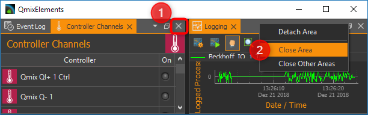

Nützliches bei der Arbeit mit Views
~~~~~~~~~~~~~~~~~~~~~~~~~~~~~~~~~~~~~~~~~~~~~~~~~~~~~~~~~~~~~~~~~~~~~~~~~~~~

Wenn Sie View-Gruppen mit sehr vielen Views haben, kann es sein, dass
durch die Anzahl der Karteireiter und durch die dann verkürzt
dargestellten Beschriftungen eine Navigation zwischen den einzelnen
Views der Gruppe schwierig ist. In diesem Fall können Sie über die
entsprechende Schaltfläche in der Titelleiste der View-Gruppe ein Menü
mit allen Views der Gruppe aufrufen und darüber den entsprechenden View
wählen.

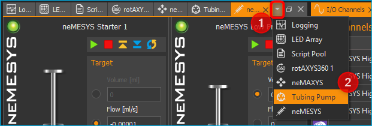

Wenn Sie in einer
View-Gruppe schnell „aufräumen“ möchten, können Sie über das Kontextmenü
alle Views außer den gerade aktiven View schließen. Wählen Sie dafür im
Kontextmenü des aktiven Karteireiters den Punkt :guilabel:`Close Others`.

Wenn Sie
in einem Fenster, z.B. im Hauptfenster der Anwendung, schnell
„aufräumen“ möchten, können Sie über das Kontextmenü einer View-Gruppe
alle anderen Gruppen schließen. Wählen Sie dafür aus dem Kontextmenü der
View-Gruppe den Menüpunkt :guilabel:`Close Other Areas`.

Perspektiven
------------

Einführung in die Arbeit mit Perspektiven
~~~~~~~~~~~~~~~~~~~~~~~~~~~~~~~~~~~~~~~~~

Unterschiedliche Aufgaben, unterschiedliche Geräte oder auch
unterschiedliche Anwender erfordern eine unterschiedliche Anordnung von
Views. Über das Verschieben der einzelnen Views können Sie die
Oberfläche optimal an Ihre Anforderungen, an Ihre Art zu arbeiten oder
an Ihre PC-Hardware anpassen.

Wenn Sie für eine bestimmte Aufgabe die perfekte Anordnung der Views
gefunden haben, können Sie diese Anordnung unter einem eignen Namen
speichern. Diese gespeicherte Anordnung wird in der Software als
Perspektive (*Perspective*) bezeichnet. Haben Sie mehrere Perspektiven
angelegt, können Sie durch einen einzigen Mausklick die komplette
Oberfläche der Anwendung Umbauen und an eine neue Aufgabe oder
Anforderung anpassen.

Sie können eine Perspektive über die entsprechende Schaltfläche in der
Werkzeugleiste aktivieren.

Wenn Sie auf die Schaltfläche klicken, wird die Standard
Perspektive (Default) geladen. Wenn Sie auf den Pfeil neben der
Schaltfläche klicken :guinum:`❶` (siehe Abbildung unten), öffnen Sie das Menü
zur Auswahl einer vorher angelegten Perspektive :guinum:`❷`.

Wenn Sie eine
Perspektive anklicken, werden die Views in der Oberfläche so angeordnet
wie zum Zeitpunkt der Erstellung dieser Perspektive. Alternativ können
Sie auf die Perspektiven auf über das Hauptmenü zugreifen. Wählen Sie
dafür den Menüpunkt :menuselection:`Window --> Perspective`.

.. admonition:: Tipp
   :class: tip

   Wenn Sie bei der Anordnung der Views einmal   
   die Übersicht verloren haben oder mit der Anordnung neu 
   beginnen möchten, rufen Sie über die Perspektive        
   Schaltfläche in der Werkzeugleiste einfach die Standard 
   Perspektive (:guilabel:`Default`) auf.   

Perspektiven anlegen
~~~~~~~~~~~~~~~~~~~~

Um eine Perspektive anzulegen, klicken Sie in der
Werkzeugleiste auf die Schaltfläche :guilabel:`Create Perspective`. Geben Sie dann
in dem Eingabedialog einen eindeutigen Namen für diese Perspektive ein
und klicken Sie :guilabel:`OK`.

Die neue Perspektive ist nun im Perspektiv-Menü verfügbar.

Perspektiven löschen
~~~~~~~~~~~~~~~~~~~~

Um Perspektiven zu löschen, wählen Sie im Perspektivemenü den Menüpunkt
:guilabel:`Manage Perspectives`.

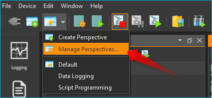
 
Es wird nun ein Dialog mit
einer Liste aller Perspektiven angezeigt. In der Liste (:guinum:`❶`) können Sie
nun ähnlich wie im Dateiexplorer einzelne oder mehrere Perspektiven
auswählen. Mit Hilf der :kbd:`Shift`-Taste können Sie mehrere
zusammenhängende Einträge auswählen. Mit Hilfe der :kbd:`Ctrl`-Taste können
Sie mehrere Einträge hintereinander anklicken und damit auswählen.

Wenn Sie dann die Schaltfläche
:guilabel:`Remove` (:guinum:`❷`) klicken, werden alle ausgewählten Perspektiven gelöscht.

Seitenleiste
------------

Die Seitenleiste ermöglicht Ihnen das schnelle Einblenden verschiedener
Views. Einige Schaltflächen blenden einen bestimmten View direkt ein.
Andere Schaltflächen ermöglichen das Einblenden mehrerer Views und
zeigen dafür ein Menü an (siehe Abbildung unten).

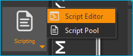

.. admonition:: Tipp
   :class: tip

   Die Seitenleiste, und auch alle               
   Werkzeugleisten, können frei in den Randbereichen des   
   Hauptfensters positioniert und angeordnet werden. Wenn  
   Sie mit der rechten Maustaste in eine Werkzeugleiste    
   klicken, sehen Sie ein Menü zum Ein- und Ausblenden der 
   Werkzeugleisten.   

Ereignisprotokoll
-----------------

Im Ereignisprotokoll werden wichtige Ereignisse angezeigt. Dazu gehören
Hinweise, Warnmeldungen und Fehlermeldungen. Der View mit dem
Ereignisprotokoll wird automatisch eingeblendet, wenn ein Ereignis in
das Protokoll geschrieben wird.

.. image:: ./Pictures/100002010000026700000079181DA868FE965CCF.png
   :alt: Abbildung 1.31: Ereignisprotokoll

.. image:: ./Pictures/100004F9000034EB000034EB95984B664DF6577B.svg
   :width: 60
   :align: left

Sie können das
Ereignisprotokoll durch drücken der Schaltfläche :guilabel:`Clear Event Log` in
der rechten oberen Bildschirmecke (siehe Abbildung) löschen.

|

.. image:: ./Pictures/10000F570000350500003505D59CCCB32AAEA5EE.svg
   :width: 60
   :align: left

Durch Klicken der Schaltfläche :guilabel:`Export To File` können Sie
den Inhalt des Ereignisprotokolls in eine Textdatei exportieren. Nachdem
Sie einen Dateinamen vergeben haben, wird die Datei gespeichert und Sie
können Sie in einem beliebigen Texteditor öffnen.

Möchten Sie das Ereignisprotokoll manuell einblenden, wählen Sie im
Hauptmenü der Anwendung den Punkt :menuselection:`Window --> Show View --> Event Log`.

Das Ereignisprotokoll listet
die einzelnen Ereignisse in zeitlicher Abfolge auf. Das neueste Ereignis
steht dabei immer an erster Stelle. Dies wir auch an den Zeitstempeln in
der ersten Spalte deutlich.

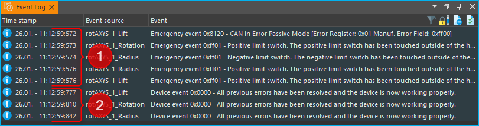

Beim Verbinden zur Gerätehardware, kann es vorkommen, dass im
Ereignisprotokoll Gerätefehler empfangen und angezeigt werden (siehe
oben). Diese Fehler können Sie ignorieren und löschen, wenn im
Ereignisprotokoll eine aktuellere Nachricht von der gleichen
Ereignisquelle (vom gleichen Gerät) vorhanden ist, in der die
Fehlerfreiheit des Gerätes gemeldet wird (Beispiel in Abbildung unten).

In dem Beispiel (Abbildung oben) melden alle 3 Achsen der rotAXYS
Probenhandlers einen Fehler (:guinum:`❶`). Die aktuellsten obersten drei Meldungen (:guinum:`❷`)
zeigen aber, das kein Fehler mehr vorhanden ist und das Gerät fehlerfrei
arbeitet.

Statuszeile
-----------

In der Statuszeile werden Statusinformationen, wie z.B. der
Verbindungsstatus zum Gerät, angezeigt.

Verbindung zum Gerät herstellen
-------------------------------

In der Werkzeugleiste finden Sie die Schaltfläche :guilabel:`Connect to device` 
mit einem Steckersymbol (siehe Abbildung unten). Drücken Sie
diese Schaltfläche, um eine Verbindung zum Gerät herzustellen.

.. admonition:: Wichtig
   :class: note

   Um eine Verbindung zum Gerät herzustellen, 
   muss das Gerät über USB mit dem PC verbunden und die    
   Spannungsversorgung für das Gerät aktiv sein.   

Arbeiten mit Projekten
------------------------

Einführung
~~~~~~~~~~~~

Wenn Sie mit der CETONI Elements Software arbeiten, dann arbeiten Sie
stets in einem bestimmten CETONI Elements Projekt. In einem Projekt
werden alle projektspezifischen Daten, wie z.B. die
aktuelle Gerätekonfiguration, anwenderspezifische Gerätenamen,
Spritzen- und Schlauchkonfigurationen, Skalierungsfaktoren, Flussraten,
SI-Einheiten und vieles mehr gespeichert. D.h., wenn Sie ein Projekt
laden, werden alle anwenderspezifischen Einstellungen geladen. So können
Sie einfach zwischen verschiedenen Projekten wechseln, oder Projekte mit
anderen Mitarbeitern teilen.

Das aktuelle Projekt, in dem Sie arbeiten, wird Ihnen stets in
der `Titelleiste`_ angezeigt. Wenn Sie
im Hauptmenü den Menüpunkt :menuselection:`File --> Browse Project Folder` wählen, wird
das aktuelle Projekt im Dateiexplorer geöffnet.

Im Dateiexplorer sehen Sie alle projektspezifischen Daten des Projektes.
Jedes Projekt hat eine feste Struktur von Dateien und
Unterverzeichnissen. In der Datei :file:`projectsettings.ini` werden alle
projektspezifischen Einstellungen gespeichert. Zusätzlich finden Sie im
Projektverzeichnis die folgenden Unterverzeichnisse:*

-  :file:`Configurations` – in diesem Verzeichnis werden alle
   Gerätekonfigurationen gespeichert, die Sie importieren oder mit dem
   Gerätekonfigurator anlegen.
-  :file:`Data` – in dieses Verzeichnis können die Plugins Daten ablegen, die
   nicht in der Settings Datei gespeichert werden können.
-  :file:`Log` – dient zum Speichern von Log-Dateien\ wie z.B. von CSV-Dateien
   wie sie vom CSV-Logger erzeugt werden.
-  :file:`Pictures` – speichert alle Bilddateien, die im Projekt
   aufgenommen werden (z.B. durch Scriptfunktionen oder vom
   Kamera-Plugin).
-  :file:`Scripts` – alle Scriptdateien, die Sie in dem Projekt erstellen,
   sollten Sie in dieses Verzeichnis speichern.
-  :file:`Videos` – Videodateien, die vom Kamera-Plugin erzeugt werden,
   sollten in dieses Verzeichnis gespeichert werden.

Ein neues Projekt erstellen
~~~~~~~~~~~~~~~~~~~~~~~~~~~~~

Wählen Sie im Hauptmenü den Punkt :menuselection:`File --> New Project` um ein neues
Projekt zu erstellen.

In dem Dialog, der Ihnen
dann angezeigt wird, können Sie das neue Projekt konfigurieren. Vergeben
Sie als erstes einen eindeutigen Projektnamen :guinum:`❶` . Wählen Sie
dann, ob Sie die Einstellungen des aktuellen Projektes in das neue
Projekt kopieren möchten (:guilabel:`Copy current project settings`) oder ob Sie
mit einem leeren Projekt starten wollen (:guilabel:`Create empty project`) :guinum:`❷`.

Wählen Sie dann den Ort aus, in dem das Projektverzeichnis erzeugt
werden soll. Standardmäßig, wenn :guilabel:`Use default location` :guinum:`❸` aktiv
ist, wird das Projekt im Projektverzeichnis des CETONI Elements
Datenordners erstellt. Wenn Sie den Speicherort selbst wählen möchten,
z.B. um das Projekt auf einem externen Datenträger zu speichern,
entfernen Sie das Häkchen :guinum:`❸` und wählen Sie durch Anklicken
der :guilabel:`Browse`-Schaltfläche :guinum:`❹` einen Speicherort aus.

Schließen Sie die Erstellung des neuen Projektes durch
Anklicken von :guilabel:`OK` :guinum:`❺` ab.

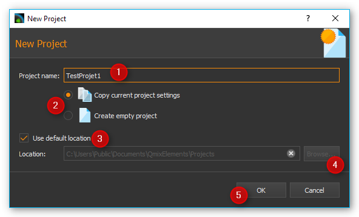

.. admonition:: Wichtig
   :class: note

   Speichern Sie Projektdaten, wie z.B.       
   Scripte, Bilder, Log-Dateien wenn möglich immer im      
   Projektverzeichnis oder in den entsprechenden           
   Unterverzeichnissen ab. Nur so ist sichergestellt, dass 
   beim Projektexport alle wichtigen Daten exportiert oder 
   gesichert werden.     

Ein vorhandenes Projekt öffnen
~~~~~~~~~~~~~~~~~~~~~~~~~~~~~~~~

Wählen Sie zum Öffnen eines vorhandenen Projektes im Hauptmenü den
Menüpunkt :menuselection:`File --> Open Project` .

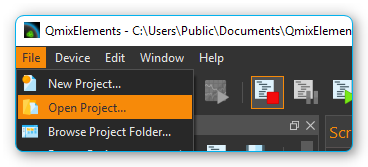

In dem Dialog der Ihnen
nun angezeigt wird, können Sie über die Auswahlbox :guinum:`❶` ein Projekt
aus dem Standard-Projektverzeichnis auswählen. Sie können dafür auch den
Projektnamen in die Auswahlbox eintippen. Die Auswahlbox unterstützt Sie
bei der Eingabe durch die Einblendung von entsprechenden Projekten. Wenn
Ihr Projekt nicht im Standardverzeichnis gespeichert ist, klicken Sie auf
die Browse-Schaltfläche :guinum:`❷`. Sie können dann mit einem
Verzeichnisauswahldialog das gewünschte Projektverzeichnis (z.B. auf
einem externen Datenträger) auswählen.

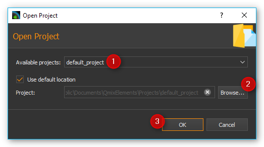

Öffnen
Sie das neue Projekt dann durch Anklicken von :guilabel:`OK` :guinum:`❸`.

Das aktuelle Projekt exportieren
~~~~~~~~~~~~~~~~~~~~~~~~~~~~~~~~~~

Wenn Sie Ihr Projekt archivieren möchten oder an einen anderen Anwender
weitergeben möchten, können Sie das schnell und einfach durch den Export
eines Projektes realisieren. Beim Projektexport werden alle Daten eines
Projektes, die sich im Projektverzeichnis befinden und die Sie zum
Export auswählen, in eine komprimierte Projektdatei (:file:`.qpr`)
gespeichert.

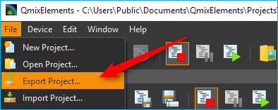

Um ein Projekt zu exportieren, müssen Sie zuerst das Projekt in der
Software öffnen. Wählen Sie nun aus dem Hauptmenü der Anwendung den
Punkt :menuselection:`File --> Export Project`.

In dem Export Dialog der Ihnen angezeigt wird, können Sie nun
auswählen, welche Verzeichnisse des Projekts exportiert werden
sollen :guinum:`❶`.

Klicken Sie die Schaltflächen :guilabel:`Select All` :guinum:`❷` oder
:guilabel:`Select None` :guinum:`❸` an, 
 um alle Elemente oder kein Element auszuwählen.
 
.. admonition:: Wichtig
   :class: note

   Der Export von Verzeichnissen mit großen   
   Datenmengen, wie z.B. Pictures und Videos, führt zu     
   großen Projektdateien und längeren Zeiten für den       
   Export eines Projektes. Exportieren Sie solche          
   Verzeichnisse nur, wenn es für die Weitergabe der Daten 
   notwendig ist.  

Während des Exports erhalten Sie durch das Ereignis-Protokoll
(*Event-Log*) :guinum:`❶`, das *Progress-Fenster* :guinum:`❷` und in der Statuszeile
:guinum:`❸` Informationen zum aktuellen Stand des Exports.

Sie können den Export
jederzeit durch Anklicken der :guilabel:`Cancel`-Schaltfläche :guinum:`❹` abbrechen.

Projekte importieren
~~~~~~~~~~~~~~~~~~~~~~

Mit der Importfunktion können Sie Projektdateien (:file:`*.qpr`) in die
Software importieren. Wählen Sie dafür im Hauptmenü den Menüpunkt 
:menuselection:`File --> Import Project`.

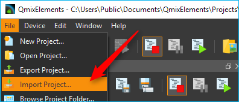

In dem Dateiauswahldialog,
der Ihnen nun angezeigt wird, wählen Sie die Projektdatei (:file:`*.qpr`) aus,
die Sie importieren möchten. Danach wird Ihnen ein Dialog angezeigt, in
dem Sie den Namen eingeben, unter dem das importierte Projekt im
Projektverzeichnis gespeichert werden soll.

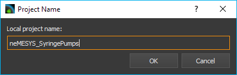

.. admonition:: Wichtig
   :class: note

   Vergeben Sie einen eindeutigen             
   Projektnamen. Wenn Sie einen Namen verwenden für den    
   bereits ein Projekt im Projektverzeichnis vorhanden     
   ist, dann ist ein Import nicht möglich.    

Wie beim Export so erhalten Sie auch beim Projektimport durch das
Ereignis-Protokoll (*Event-Log*) :guinum:`❶`, das *Progress-Fenster* :guinum:`❷` und in
der Statuszeile :guinum:`❸` Informationen zum aktuellen Stand des Imports.

Sie können den Import
jederzeit durch Anklicken der :guilabel:`Cancel`-Schaltfläche :guinum:`❹` abbrechen. Nach
dem erfolgreichen Import des Projektes, bietet Ihnen die Software an,
das importierte Projekt zu laden.

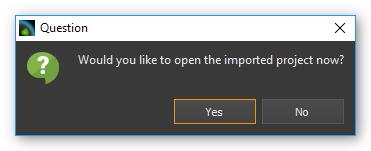

Klicken Sie auf :guilabel:`Yes` um die Software mit dem importierten
Projekt neu zu starten.

Globale Einstellungen
---------------------

Einstellungsdialog öffnen
~~~~~~~~~~~~~~~~~~~~~~~~~

Über den Menüpunkt :menuselection:`Edit --> Settings` im Hauptmenü der Anwendung können
Sie den Konfigurationsdialog für die globalen Applikationseinstellungen
aufrufen.

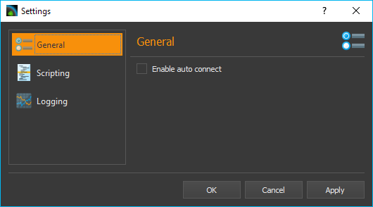

Hier finden Sie auf der linken Seite
die unterschiedlichen Einstellungskategorien. Wählen Sie dort eine
Kategorie aus, für die Sie die globalen Einstellungen konfigurieren
möchten. Auf der rechten Seite sehen Sie dann die Einstellungen, die Sie
für die gewählte Kategorie konfigurieren können.

Klicken Sie auf :guilabel:`Apply` um die Änderungen zu übernehmen oder auf :guilabel:`OK` um
die Änderungen zu übernehmen und den Dialog zu schließen.

Allgemeine Einstellungen
~~~~~~~~~~~~~~~~~~~~~~~~

Auto Connect
^^^^^^^^^^^^

Wenn diese Option aktiviert ist, verbindet sich CETONI Elements
automatisch zu den angeschlossenen Geräten. Wenn Sie CETONI Elements.exe
in den *Autostart* von Windows eintragen, können Sie nach Einschalten des
Rechners die CETONI Elements Software vollautomatisch starten und eine
Verbindung zum Gerät herstellen, ohne dass ein Anwendereingriff
notwendig ist.

Farbe und Stil personalisieren
------------------------------

Über den Menüpunkt :menuselection:`Edit --> Settings` im Hauptmenü der Anwendung öffnen
Sie den Konfigurationsdialog der Anwendung. Dort finden Sie im Bereich
*Color & Style* :guinum:`❶` die Einstellungen zur Anpassung des Designs der
grafischen Oberfläche.

.. image:: ./Pictures/10000201000002890000017285BB5129C447B7B6.png

Sie können Sie Akzentfarbe anpassen, indem Sie aus der
Palette von vordefinierten Farben :guinum:`❷` eine Farbe auswählen oder indem
Sie über die Schaltfläche :guilabel:`Custom Color` (:guinum:`❸``) eine eigene Farbe
definieren.

.. admonition:: Wichtig
   :class: note

   Die Anpassung der grafischen Oberfläche    
   nach einer Änderung blockiert die Anwendung für eine    
   kurze Zeit. Sie sollten diese Anpassungen deshalb nicht 
   durchführen, wenn Sie mit Geräten arbeiten oder eine    
   kritische Steuerungsanwendung / -script aktiv ist.      

Über die Auswahlbox :guilabel:`Color Theme` können Sie das komplette Farb-Design
der Anwendung zwischen verschiedenen Themes umschalten. So können Sie
z.B. zwischen einem Light Theme und einem Dark Theme wechseln um die
Anwendung an Ihre Wünsche oder an die Corporate Identity Ihrer Firma
anzupassen. Die folgenden beiden Screenshots zeigen Beispiele einer
angepassten Oberfläche:

Beispiel 1: Dunkles Design mit alternativer Akzentfarbe

.. image:: ./Pictures/1000020100000430000002BBC33448126A09A2D3.png

Beispiel 2: Helles Design mit blauer Akzentfarbe

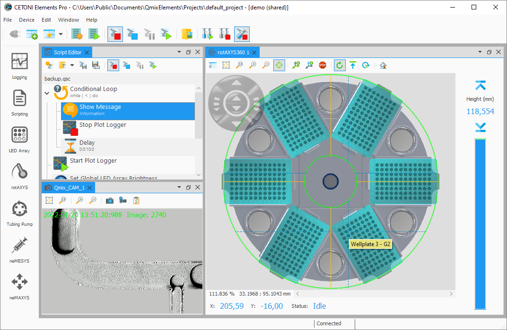

Zugriff auf die Bedienoberfläche einschränken
---------------------------------------------

Einführung
~~~~~~~~~~

Die Software bietet Ihnen die Möglichkeit, mit Hilfe des
*UI-Access-Managers* den Zugriff auf Bedienelemente in der Software
einzuschränken. D.h., Sie können konfigurieren, welche Elemente der
Anwendung für Anwender ausgeblendet werden sollen. Dies kann z.B.
erwünscht sein, wenn Sie ein Script geschrieben haben für andere
Anwender oder Mitarbeiter. Wenn Sie sicherstellen wollen, dass die
Geräte nur über das Script bedient werden und nicht manuell „am Script
vorbei“, können Sie Teile der Oberfläche ausblenden.

Zugriff auf die Oberfläche konfigurieren
~~~~~~~~~~~~~~~~~~~~~~~~~~~~~~~~~~~~~~~~

Um den Zugriff auf die Softwareoberfläche zu konfigurieren, wählen Sie
im Hauptmenü den Punkt :menuselection:`Edit --> Configure UI Access`.

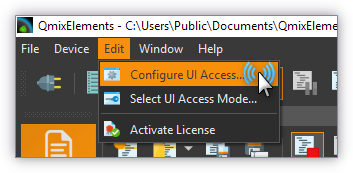

Der Konfigurationsdialog für den UI Zugriff wird Ihnen angezeigt. In der
ersten Spalte :guinum:`❶` sehen Sie die Elemente der Bedienoberfläche, die
Sie aus- und einblenden können. In den einzelnen Gruppen (z.B.
Workbenches) sind die Elemente alphabetisch sortiert.

In der zweiten Spalte :guinum:`❷` sehen Sie die Konfiguration des Standard-Modus.
Dieser Modus ist immer aktiv, wenn die Software neu gestartet wird. D.h.
dieser Modus ist der Modus den jeder Anwender ohne spezielle
Berechtigungen sieht. Für jedes Element können Sie hier auswählen, ob es
in der Oberfläche sichtbar oder ausgeblendet ist. So können Sie einfach
Bedienelemente vor normalen Anwendern verbergen.

Die dritte Spalte :guinum:`❸` enthält die Konfiguration der Oberfläche für
den zugangsgeschützten Modus. Dieser Modus ist durch ein Passwort
geschützt. D.h. Sie können diesen Modus durch Eingabe des Passworts
aufrufen, und damit vorher ausgeblendete Bedienelemente einblenden.

.. admonition:: Wichtig
   :class: note

   In der Konfiguration für den geschützten      
   Bereich sollten Sie alle Bedienelemente auf sichtbar    
   setzen um ggf. Zugriff darauf zu haben. 

Das Passwort für den geschützten Bereich können Sie festlegen, indem Sie
in die entsprechende Zelle der dritten Spalte doppelt klicken und das
Passwort eingeben.

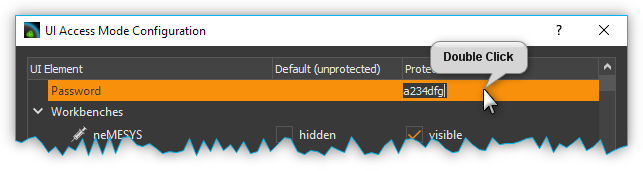

Wenn Sie die
Konfiguration fertiggestellt haben, klicken Sie auf die Schaltfläche
:guilabel:`OK` um den Dialog zu schließen und die Konfiguration zu speichern.

.. admonition:: Wichtig
   :class: note

   Die Konfiguration wird im aktuellen        
   Projekt abgespeichert. D.h. die Konfiguration der       
   Oberfläche ist projektspezifisch und nicht global. 

Modus für den UI-Zugriff auswählen
~~~~~~~~~~~~~~~~~~~~~~~~~~~~~~~~~~

Nach dem Start der Anwendung ist immer der Standard-Modus aktiv. D.h. es
wird die Oberfläche mit der Konfiguration angezeigt, die Sie für den
Standard Modus konfiguriert haben. Um den geschützten Modus aufzurufen,
wählen Sie im Hauptmenü den Punkt :menuselection:`Edit --> Select UI Access Mode`.

Die Oberfläche
wird sofort nach der Auswahl entsprechend der Konfiguration angepasst.
Wenn Sie den geschützten Modus wieder verlassen möchten, rufen Sie den
Auswahldialog erneut auf und wählen dann die Standardkonfiguration aus.
