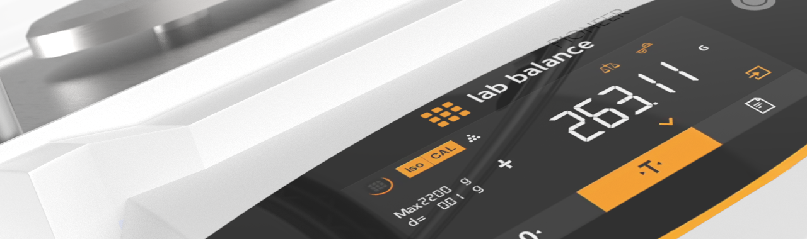
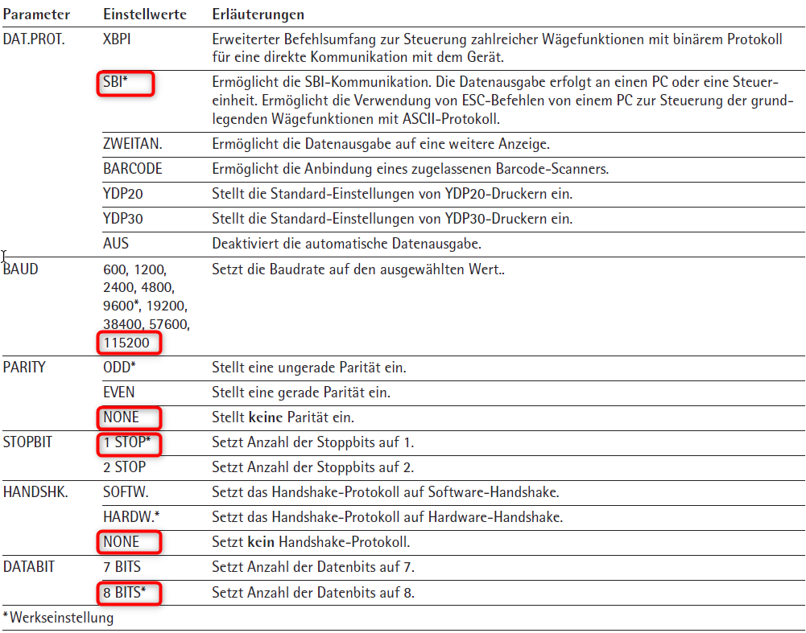
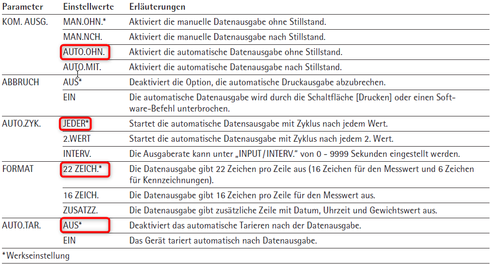
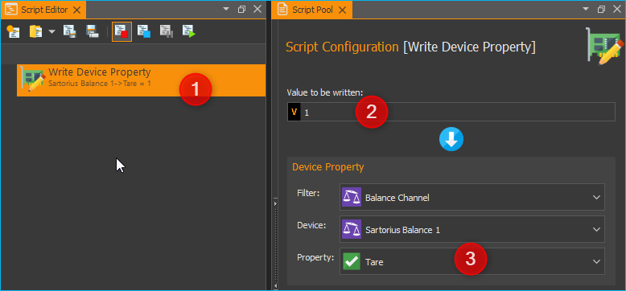

Waagen Plugin
=============

Einführung
----------

Dieses Plugin dient zur Einbindung von externen Waagen in die Software.
Folgende Geräte werden im Moment unterstützt:

============ ===================================
Hersteller   Unterstützte Geräte
============ ===================================
Sartorius    Entris, ED-, GK- and und GW-Waagen
============ ===================================

Konfiguration von Sartorius Waagen
----------------------------------

Damit die Waage optimal mit der Software arbeitet, stellen
Sie am Geräte bitte die folgenden Parameter ein:

Menü „GERAET“ / „RS232“
^^^^^^^^^^^^^^^^^^^^^^^

Aktivieren Sie im Menü *GERAET / RS232* die rot markierten Werte:

Menü „GERAET“ / „USB“
^^^^^^^^^^^^^^^^^^^^^

Aktivieren Sie im Menü *GERAET / USB* die rot markierten Werte:

Menü „DAT.AUSG“ / „KOMM.SBI“
^^^^^^^^^^^^^^^^^^^^^^^^^^^^

Aktivieren Sie im Menü *DAT.AUSG / KOMM.SBI* die rot markierten Werte:

Hinzufügen der Waage zu einer CETONI Elements Gerätekonfiguration
-----------------------------------------------------------------

Fügen Sie im *Gerätekonfigurator* einfach eine Waage mittels Drag & Drop
oder Doppelklick der aktuellen Gerätekonfiguration hinzu :guinum:`❶`. Speichern
Sie dann die Gerätekonfiguration :guinum:`❷` und aktivieren Sie diese durch
anklicken der Schaltfläche :guilabel:`Activate Configuration` :guinum:`❸`.

.. image:: Pictures/1000020100000327000001CE56CDCFBB84CBB896.png

Bedienung
---------

Anzeige / Lesen der Werte
~~~~~~~~~~~~~~~~~~~~~~~~~

Für jede Waage, die der Gerätekonfiguration hinzugefügt wurde, wird in
der Liste der I/O Kanäle ein analoger Eingangskanal angezeigt. Im Bild
unten ist das der Kanal :guilabel:`Sartorius Balance 1`.

.. image:: Pictures/1000020100000193000000C89CA159222396D53F.png

Dieser analoge Kanal zeigt in der Spalte *Value* den aktuellen Wert an,
der von der Waage gemessen wird. Wie jeder andere analoge Kanal, kann
auch dieser Kanal im grafischen Logger oder CSV Logger hinzugefügt
werden oder im Script gelesen werden.

Waage tarieren
~~~~~~~~~~~~~~

Um die Waage zu tarieren, klicken Sie mit der rechten Maustaste auf den
Kanal :guinum:`❶` und wählen dann im Kontextmenü den Punkt :menuselection:`Tare balance` :guinum:`❷`.

.. image:: Pictures/10000201000001DA000000CA6CD29A54C4B5F66A.png

Das Tarieren der Waage kann auch in einem Script ausgeführt werden.
Fügen Sie dafür die Scriptfunktion :guilabel:`Device Functions --> Write Device Property` :guinum:`❶` 
dem Script hinzu. Konfigurieren Sie diese Funktion nun so,
dass der Wert 1 :guinum:`❷` in das Property :code:`Tare` :guinum:`❸` des Waagenkanals
geschrieben wird (siehe Abbildung unten)

