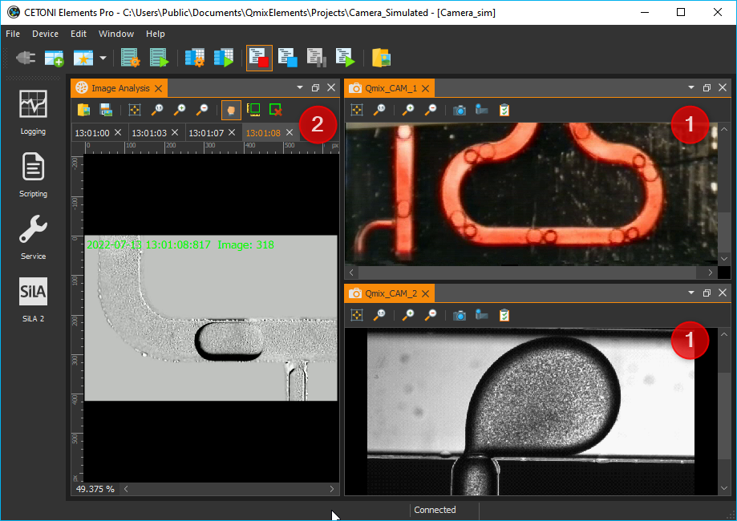
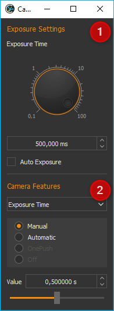
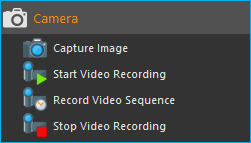

Kamera Plugin
=============

Einführung
----------

Das Kamera Plugin ermöglicht die Einbindung unterschiedlichster
digitaler Kameras in die Software. Das Plugin unterstützt u.a. Firewire
1394 Kameras (DCAM Standard), verschiedene USB-Kameras und alle Standard
Windows DirectShow Kameras.

Die Abbildung oben
zeigt eine typische Arbeitsumgebung bestehend aus dem :ref:`View <views>` 
in einem Werkzeugfenster :guinum:`❶` und dem :ref:`Image Analysis View <image analysis plugin>` 
:guinum:`❷` im zentralen Arbeitsbereich der Anwendung zur Anzeige aufgenommener Bilder.

Kamera-Livebild
---------------

Übersicht
~~~~~~~~~

Das Kamera-Livebild wird in einem
:ref:`View <Views (Ansichten)>` angezeigt. D.h., das Kamera-Livebild können Sie durch
Anklicken und Ziehen der Titelleiste vollständig aus dem Hauptfenster
der Applikation herauslösen und so z.B. auf einem zweiten Monitor
platzieren und dort maximieren. So haben Sie stets das volle Kamerabild
im Blick und können auf dem anderen Monitor in der Software bequem alle
Einstellungen ändern.

.. image:: Pictures/live_image_overview.png

.. rst-class:: guinums

1. Werkzeugleiste
2. Kamera-Livebild

Sie können die Livebildansicht für ein bestimmtes Kameragerät über den Hauptmenüpunkt 
:menuselection:`Window --> Show View --> Camera --> DeviceName` aufrufen.

Werkzeugleiste
~~~~~~~~~~~~~~

Ihnen stehen verschiedene Werkzeuge zur Verfügung um die Anzeige des
Kamerabildes oder Kameraeinstellungen zu verändern. Diese Werkzeuge sind
über die Werkzeugleiste am oberen Fensterrand erreichbar.

Folgende Schaltflächen sind in der Werkzeugleiste enthalten:

+-----------+---------------------------------------------------------+
| |image15| | Bild in Fenster einpassen – Skaliert das Bild so, dass  |
|           | es vollständig in die Anzeige passt                     |
+-----------+---------------------------------------------------------+
| |image16| | Digitale Vergrößerung erhöhen                           |
+-----------+---------------------------------------------------------+
| |image17| | Digitale Vergrößerung erhöhen                           |
+-----------+---------------------------------------------------------+
| |image18| | Digitale Vergrößerung verringern                        |
+-----------+---------------------------------------------------------+
| |image19| | Bild aufnehmen                                          |
+-----------+---------------------------------------------------------+
| |image20| | Video aufnehmen                                         |
+-----------+---------------------------------------------------------+
| |image21| | Dialog zur Konfiguration der Kameraparameter öffnen     |
+-----------+---------------------------------------------------------+

Vergrößerung einstellen
~~~~~~~~~~~~~~~~~~~~~~~

Die digitale Vergrößerung können Sie auf 3 verschiedene Arten
einstellen:

-  **Werkzeugleiste** – klicken Sie auf die Schaltflächen in der
   Werkzeugleiste um die Vergrößerung in festen Stufen zu ändern
-  **Kontextmenü** – klicken Sie mit der rechten Maustaste in das Kamerabild
   und wählen Sie dann die entsprechenden Menüpunkte im angezeigten
   Kontextmenü, um die Vergrößerung zu verändern
-  **Mausrad** – ändern Sie die Vergrößerung stufenlos mit dem Mausrad

========= ========= ===============================================
|image23| |image17| Vergrößerungsfaktor erhöhen (hineinzoomen)
|image24| |image18| Vergrößerungsfaktor verringern (heraus zoomen)
========= ========= ===============================================

Manuelle Bildaufnahme
~~~~~~~~~~~~~~~~~~~~~

.. image:: Pictures/camera.svg
   :width: 60
   :align: left

Um das aktuelle Kamerabild aufzunehmen, klicken Sie das
Symbol *Capture Image* in der Werkzeugleiste an. Das aktuelle Kamerabild wird 
dann im Bildbetrachter der Software
gespeichert und kann dort von Ihnen weiter verarbeitet werden.

|

Manuelle Videoaufnahme
~~~~~~~~~~~~~~~~~~~~~~

Wenn Sie das aktuelle Kamera-Livebild als Video aufnehmen möchten,
drücken Sie einfach die Schaltfläche :guilabel:`Record Video`. Die
Videoaufzeichnung bleibt so lange aktiv, bis Sie diese durch erneutes
Anklicken der Schaltfläche :guilabel:`Record Video` stoppen.

========= ==========================
|image20| Videoaufzeichnung inaktiv
|image22| Videoaufzeichnung aktiv
========= ==========================

Über die Ereignisanzeige (:ref:`Event Log <event log>`) der Anwendung erhalten Sie
Statusinformationen zur Aufzeichnung und zum Dateinamen unter dem die
Videodatei gespeichert wurde.

Der Dateiname
jeder Videodatei wird mit einem Zeitstempel des Starts der Aufzeichnung
versehen. D.h. der Start der Aufzeichnung der Videodatei
:file:`Camera_Recording_20220711_104731.avi` war am 11.07.2022 um 10:47
Uhr.

.. admonition:: Wichtig
   :class: note

   Zur Aufzeichnung der Videos wird der       
   XVID-CoDec verwendet. Wenn Sie die Datei mit Ihrem      
   Mediaplayer abspielen möchten, sollte dieser CoDec      
   unterstützt werden oder auf Ihrem System installiert    
   sein. 

Kamera Einstellungen
--------------------

Einführung
~~~~~~~~~~

Die Qualität eines aufgenommenen Bildes wird beeinflusst durch eine an
das Beobachtungsobjekt angepasste Beleuchtung und die richtige
Einstellung der Kamera-Parameter. Im Folgenden geben wir Ihnen einen
Überblick über die wichtigsten Kamera-Parameter die mit der Software
verändert werden können.

Das Fenster zur Einstellung der Kameraparameter öffnen  
Sie über die Schaltfläche *Camera Settings* in der      
Werkzeugleiste des Kamera-Livebildes. 

|

.. rst-class:: guinums

1. **Exposure Settings** - zum Festlegen der Belichtungseinstellungen
2. **Camera Features** - zum Anpassen der allgemeinen Kameraeinstellungen

.. admonition:: Wichtig
   :class: note

   Je nach verwendetem Kameratyp (Direct      
   Show, USB oder Firewire) oder Kameramodell kann sich    
   die Darstellung des Camera Settings Dialogs mehr oder   
   weniger stark unterscheiden.  

.. admonition:: Wichtig
   :class: note

   Einige Kameras werden nicht durch den      
   Camera Settings Dialog unterstützt und blenden zur      
   Konfiguration ggf. ihr eigenes kameraspezifisches       
   Konfigurationsfenster ein.  

Belichtungsparameter einstellen
~~~~~~~~~~~~~~~~~~~~~~~~~~~~~~~

Im Bereich :guilabel:`Exposure Settings` legen Sie die Belichtungszeit des CCD in
der Kamera fest. Die Belichtungszeit kann manuell oder automatisch
eingestellt werden. Wenn die automatische Einstellung aktiv ist (*Auto
Exposure*), wird der Verschlusszeit automatisch an die Helligkeit des
Beobachtungsobjektes angepasst.

Kamera-Features einstellen
~~~~~~~~~~~~~~~~~~~~~~~~~~

Im Bereich :guilabel:`Camera Features` können Sie alle Einstellungen der in Ihrem
System eingebauten Kamera verändern. Die Kamera-Features und deren
Wertebereiche können je nach verwendetem Kameratyp variieren.

Wenn ein Kamera-Feature einen automatischen Modus
unterstützt, so können Sie zwischen manuellem und automatischem Modus
umschalten :guinum:`❶`. Im manuellen Modus können Sie dann Wert über den
Schieberegler oder das Werteingabefeld manuell einstellen :guinum:`❷`.

.. admonition:: Wichtig
   :class: note

   Je nach verwendetem Kameratyp können sich  
   die Einstellmöglichkeiten und Anzahl der                
   konfigurierbaren Kamerafeatures unterscheiden.    

Kamera Script-Funktionen
------------------------

Einführung
~~~~~~~~~~

Das Kamera-Plugin enthält verschiedene Script-Funktionen zur
Aufzeichnung von Videos und Einzelbildern.

Einzelbildaufnahme – *Capture Image*
~~~~~~~~~~~~~~~~~~~~~~~~~~~~~~~~~~~~~~

.. image:: Pictures/camera.svg
   :width: 60
   :align: left

Mit dieser Funktion können Sie ein Einzelbild des aktuellen
Kamerabildes aufnehmen, und auf einem Datenträger speichern :guinum:`❶`. Im
Konfigurationsbereich der Funktion :guilabel:`Image File` :guinum:`❷` geben Sie 
dafür den Dateipfad und den Namen der Bilddatei an.
Anschließend können Sie festlegen, ob die Kameraparameter vor der
Aufnahme unverändert gelassen werden (:guinum:`❷` :guilabel:`Keep Camera Settings`) oder ob
die Kameraparameter auf vorher gespeicherten Werte eingestellt werden (:guinum:`❸` 
:guilabel:`Change Camera Settings`). 

.. figure:: Pictures/1000000000000203000000F6E0EBC144.png
   :alt: Capture Image Konfiguration

Die aktuellen Kameraparameter können durch
Drücken der Schaltfläche in :guilabel:`Capture current settings` als Parameter in
der Funktion gespeichert werden, um sie dann vor der Bildaufnahme wieder
in die Kamera schreiben zu können. Damit können Sie z.B.
unterschiedliche Objekte mit völlig verschiedenen Kameraeinstellungen
aufnehmen.

.. admonition:: Tipp
   :class: tip

   Durch die Dateiendung der Bilddatei (:file:`.png` oder 
   :file:`.jpg`) können Sie das entsprechende Bildformat auswählen. 

Bei jeder Aufnahme wird ein Zeitstempel an den Dateinamen angehängt.
D.h. Wenn Sie z.B. als Dateinamen :file:`Photo.jpg` konfiguriert haben, wird
auf dem Datenträger dann z.B. die Datei :file:`Photo_20120921_154502.jpg` nach dem 
Syntax **Name_YYYYMMDD_hhmmss.jpg** gespeichert.

.. admonition:: Tipp
   :class: tip

   Sie können in festen zeitlichen Intervallen   
   Bilder von einem Objekt aufnehmen, um daraus mit dem    
   :ref:`Video Builder <video builder plugin>` später einen Zeitrafferfilm zu     
   erstellen.  

Videoaufzeichnung starten – *Start Video Recording*
~~~~~~~~~~~~~~~~~~~~~~~~~~~~~~~~~~~~~~~~~~~~~~~~~~~

.. image:: Pictures/videocamera_run.svg
   :width: 60
   :align: left

Mit dieser Funktion starten Sie die Aufzeichnung des
Kamera-Livebildes in eine Videodatei. Die Aufzeichnung ist so lange
aktiv, bis sie mit der Funktion :ref:`Videoaufzeichnung beenden <videoaufzeichnung_beenden>`
gestoppt wird. Die Videoaufzeichnung wird automatisch gestoppt, wenn die
Skriptausführung endet.

Im Konfigurationsbereich konfigurieren Sie alle Parameter für die
Videoaufzeichnung. Im Feld :guilabel:`Recording Session Name` :guinum:`❶` vergeben Sie
einen eindeutigen Namen für diese Aufnahmesitzung. Dieser Name wird
benötigt, um die Sitzung später mit der Funktion 
:ref:`Videoaufzeichnung beenden <videoaufzeichnung_beenden>` stoppen zu können.

Video-Einstellungen konfigurieren
^^^^^^^^^^^^^^^^^^^^^^^^^^^^^^^^^^^

Im Bereich :guilabel:`Video Settings` konfigurieren Sie nun alle
Video-Einstellungen. Klicken Sie die Schaltfläche mit dem
Ordnersymbol :guinum:`❷` an, um einen Dateinamen und Speicherort für die
Videodatei im Feld :guilabel:`Video Filename` zu wählen.

.. admonition:: Wichtig
   :class: note

   Bei jeder Aufnahme wird ein Zeitstempel an 
   den Dateinamen angehängt. D.h. Wenn Sie z.B. als        
   Dateinamen :file:`Video.avi` konfigurieren, wird auf dem        
   Datenträger die Datei :file:`Video_20130522_154502.avi`         
   gespeichert.   

Durch Anklicken von :guilabel:`Extended Settings` :guinum:`❸` können Sie weitere
Einstellungen einblenden. Im Feld :guilabel:`Recording Frames per Second` stellen
Sie die Anzahl der Bilder ein, die pro Sekunde aufgezeichnet werden
sollen. Um später eine Echtzeitdarstellung zu erhalten, sollten Sie die
aktuelle Kamera-Bildrate verwenden.

.. admonition:: Tipp
   :class: tip

   Wenn Sie die Funktion neu erstellen, wird im  
   Feld :guilabel:`Recording Frames per Second` stets die aktuelle 
   Kamera-Bildrate eingetragen.   

Wenn Sie langsamere Prozesse beobachten möchten, können Sie auch eine
kleinere Bildrate für die Aufzeichnung wählen. Wenn Sie das Eingabefeld
:guilabel:`Recording Seconds per frame` aktivieren, können Sie sehr langsame
Aufzeichnungsraten wählen (mehreren Sekunden oder Minuten pro Bild).

Dieser Modus eignet sich zur Erstellung von Zeitrafferaufnahmen von sehr
langsamen Vorgängen. So können Sie z.B. über mehrere Tage, aller 30
Minuten ein Bild aufnehmen, und diese Aufnahmen dann in einem Film mit
einer Bildrate von 24 Bildern pro Sekunde abspielen.

Im Feld :guilabel:`Playback Frame Rate (fps)` stellen Sie die Bildrate ein, mit
der der Film später im Mediaplayer wiedergegeben wird. Im Bereich
Videoproduktion oder Kinofilm ist eine Bildrate von 24 Bildern pro
Sekunde Standard. Wenn Sie den Film in Echtzeit, d.h. mit seiner realen
Aufnahmegeschwindigkeit wiedergeben wollen, sollten Sie hier eine
Bildrate wählen, die der Aufzeichnungsbildrate entspricht.

Kamera-Einstellungen konfigurieren
^^^^^^^^^^^^^^^^^^^^^^^^^^^^^^^^^^

Klicken Sie auf den Karteireiter :guilabel:`Camera Setup` :guinum:`❶` um die Bedienelemente
zur Einstellung der Kamera-Parameter anzuzeigen.:

.. image:: Pictures/10000000000001E1000000B61082E57D.png
   :alt: Konfiguration Kameraparameter für Start Video Recording

Hier können Sie festlegen, ob die Kameraparameter vor der
Aufnahme unverändert gelassen werden :guinum:`❷` :guilabel:`Keep Camera Settings` oder ob
die Kameraparameter auf vorher gespeicherten Werte eingestellt werden :guinum:`❸` 
:guilabel:`Change Camera Settings`.

Die aktuellen Kameraparameter können durch Drücken der Schaltfläche in
:guilabel:`Capture current settings` als Parameter in der Funktion gespeichert
werden, um sie dann vor der Bildaufnahme wieder in die Kamera schreiben
zu können. Damit können Sie z.B. unterschiedliche Objekte mit völlig
verschiedenen Kameraeinstellungen aufnehmen.

Videosequenz aufnehmen – *Record Video Sequence*
~~~~~~~~~~~~~~~~~~~~~~~~~~~~~~~~~~~~~~~~~~~~~~~~

.. image:: Pictures/videocamera_clock.svg
   :width: 60
   :align: left 

Verwenden Sie diese Funktion, um eine Videosequenz mit einer
festgelegten Dauer aufzuzeichnen. In der Skriptfunktion konfigurieren
Sie die gewünschte Aufnahmedauer, und die Aufnahme endet automatisch,
nach dem Ablauf der Aufnahmezeit.

Alle Videoeinstellungen und Kameraeinstellungen dieser Skript-Funktion
sind identisch mit den Einstellungen der Funktion :ref:`Videoaufzeichnung starten <videoaufzeichnung starten – *start video recording*>`.
Zusätzlich können Sie bei dieser Funktion aber noch die Aufnahmedauer
einstellen.

Wählen Sie
dafür den Karteireiter :guilabel:`Rec. Duration` :guinum:`❶`. Nun können Sie die
Aufnahmedauer sekundengenau einstellen :guinum:`❷`. Mit dem Auswahlfeld :guilabel:`Run to completion` 
:guinum:`❸` legen Sie fest, wann die Funktion beendet ist und die
nächste Skriptfunktion ausgeführt wird:

-  **Auswahlfeld aktiv** - die nächste wird Funktion erst ausgeführt, wenn
   die Aufnahme abgeschlossen ist
-  **Auswahlfeld inaktiv** - die Aufnahme wird gestartet und dann sofort die
   Skriptausführung mit der nächsten Funktion fortgesetzt.

.. admonition:: Tipp
   :class: tip

   Die Aufnahme einer Videosequenz kann          
   jederzeit durch den Aufruf der Funktion Stop Video      
   Recording beendet werden. 

.. _videoaufzeichnung_beenden:

Videoaufzeichnung beenden – *Stop Video Recording*
~~~~~~~~~~~~~~~~~~~~~~~~~~~~~~~~~~~~~~~~~~~~~~~~~~

.. image:: Pictures/videocamera_stop.svg
   :width: 60
   :align: left

Eine laufende Videoaufnahme die mit den Funktionen 
:ref:`Videoaufzeichnung starten <videoaufzeichnung starten – *start video recording*>`
oder :ref:`Videosequenz aufnehmen <videosequenz aufnehmen – *record video sequence*>`
gestartet wurde, kann mit dieser Funktion jederzeit beendet werden.
Geben Sie dafür im Eingabefeld :guilabel:`Recording Session` einfach den Namen der
Aufnahmesitzung ein, die Sie beenden möchten.

.. |image15| image:: Pictures/fit_to_size.svg
   :width: 60
.. |image16| image:: Pictures/view_1_1.svg
   :width: 60

.. |image19| image:: Pictures/camera.svg
   :width: 60

.. |image22| image:: Pictures/videocamera_record.svg
   :width: 60
.. |image23| image:: Pictures/mouse_scroll_up.png
   :width: 80
.. |image24| image:: Pictures/mouse_scroll_down.png
   :width: 80