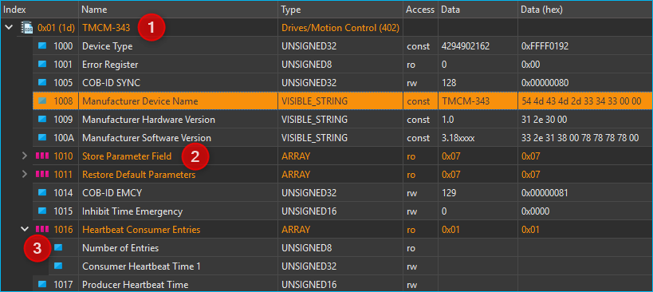
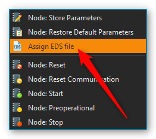
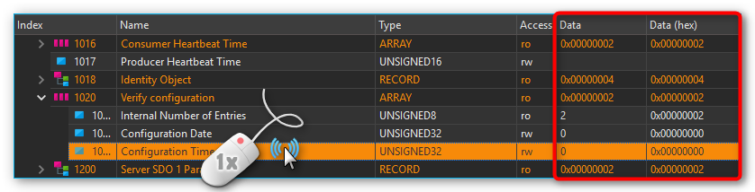
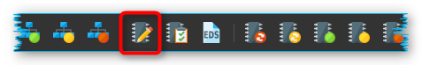
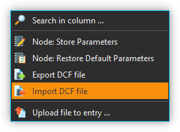
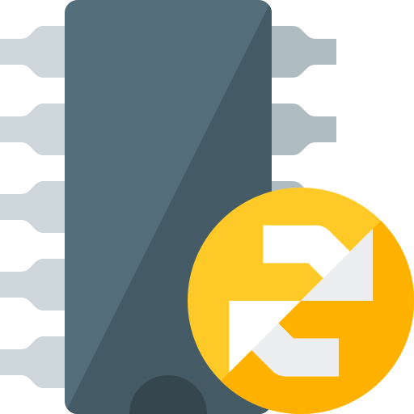
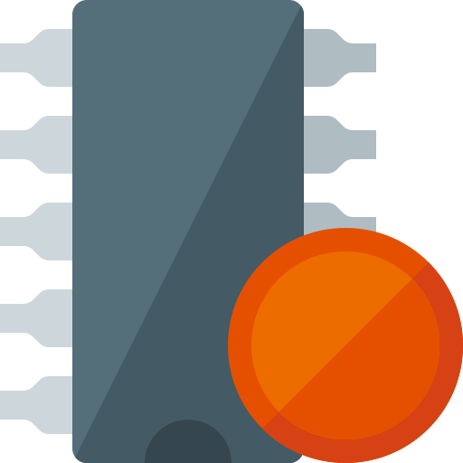
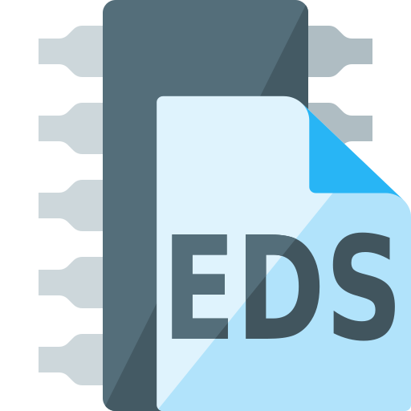

.. include:: ../include/colors.rst

CANopen Tools Plugin
====================

Einführung
----------

Dieses Plugin enthält Werkzeuge zum Zugriff und zur Konfiguration von
`CANopen <https://en.wikipedia.org/wiki/CANopen>`_ Geräten. 
CANopen ist eine standardisierte Anwendung für
verteilte industrielle Automatisierungslösungen auf der Basis von CAN.
CANopen wurde ursprünglich für die Steuerung von Maschinennetzwerken
entwickelt. Heute wird CANopen in vielen Bereichen, wie z.B.
Medizintechnik, Fahrzeugbau, Schifffahrt und öffentlichen
Transportmitteln, eingesetzt.

Basis der `CANopen Profilfamilie <https://www.can-cia.org/can-knowledge/canopen/canopen-profiles/>`_ 
ist ein Kommunikationsprofil
(*Communication Profile for Industrial Systems DS-301*), welches die
Kommunikationsmechanismen und deren Beschreibung spezifiziert. Die
verschiedenen in der Automatisierungstechnik verwendeten Gerätetypen
(z.B. Antriebe, Bediengeräte, Regler) werden in Geräteprofilen
beschrieben. In diesen Geräteprofilen werden sowohl Funktionalität als
auch Parameter von Standardgeräten des jeweiligen Typs festgelegt. Diese
standardisierten Profile sind die Grundlage für einen einheitlichen
Zugriff auf die CANopen-Geräte über den `CAN-Bus <https://en.wikipedia.org/wiki/CAN_bus>`_. 
Dies ermöglicht eine
weitgehende Unabhängigkeit von einem bestimmten Hersteller.

CANopen Tools Projekt öffnen
---------------------------------

Um den CANopen Tools Workbench zu öffnen, laden Sie das CETONI Elements Projekt
:file:`canopentools`. Klicken Sie dafür im Hauptmenü der Anwendung auf den
Menüpunkt :menuselection:`File --> Open Project`. Im Projektdialog wählen
Sie dann das Projekt :file:`canopentools`. 

.. image:: Pictures/open_canopentools_project.png

Die Anwendung startet dann neu und
sie sollten danach den CANopen Tools Workbench sehen:

.. image:: Pictures/10000201000003F10000027E5D603ADD6876B968.png
   :alt: CANopen Tools Workbench

Den :ref:`View <Views (Ansichten)>` des *CANopen
Tools* Plugin können Sie durch Drücken der Schaltfläche :guilabel:`CANopen Tools` 
:guinum:`❶` in der Seitenleiste einblenden. In der Werkzeugleiste :guinum:`❷` finden Sie
wichtige Funktionen zum Zugriff auf Geräte im Netzwerk.

Den Hauptbereich des CANopen Tools Workbench bilden der `Objektverzeichnis-Editor`_
(Object Dictionary Editor) :guinum:`❸` zum Lesen und Schreiben einzelner Einträge
im Objektverzeichnis.

Zusätzlich können Sie die Nachrichten auf dem CAN-Bus in Echtzeit mit
dem `CAN Bus Trace Fenster`_ :guinum:`❹`.
überwachen.

Werkzeugleiste
--------------

+-----------+---------------------------------------------------------+
| |image33| | Netzwerkscan - sucht nach allen angeschlossenen Geräten |
+-----------+---------------------------------------------------------+
| |image34| | Reset aller Geräte durchführen                          |
+-----------+---------------------------------------------------------+
| |image35| | Reset der Kommunikationsparameter aller Geräte          |
+-----------+---------------------------------------------------------+
| |image36| | Prozessdatenkommunikation aller Geräte starten          |
+-----------+---------------------------------------------------------+
| |image37| | Alle Geräte in den Zustand Pre-operational versetzen.   |
+-----------+---------------------------------------------------------+
| |image38| | Kommunikation aller Geräte stoppen                      |
+-----------+---------------------------------------------------------+
| |image39| | Parameter des ausgewählten Gerätes (Knotens) in         |
|           | nichtflüchtigen Gerätespeicher sichern                  |
+-----------+---------------------------------------------------------+
| |image40| | Alle Parameter des ausgewählten Gerätes auf             |
|           | Standard-Werte zurücksetzen                             |
+-----------+---------------------------------------------------------+
| |image41| | EDS Datei (*Electronical Data Sheet*) dem ausgewählten  |
|           | Gerät zuweisen                                          |
+-----------+---------------------------------------------------------+
| |image42| | Parameter des ausgewählten CANopen Knotens in eine      |
|           | DCF-Datei exportieren                                   |
+-----------+---------------------------------------------------------+
| |image43| | DCF-Datei in den ausgewählten CANopen Knoten            |
|           | importieren                                             |
+-----------+---------------------------------------------------------+
| |image44| | Reset des ausgewählten Gerätes                          |
+-----------+---------------------------------------------------------+
| |image45| | Reset der Kommunikationsparameter des ausgewählten      |
|           | Gerätes                                                 |
+-----------+---------------------------------------------------------+
| |image46| | Prozessdatenkommunikation des ausgewählten Gerätes      |
|           | starten                                                 |
+-----------+---------------------------------------------------------+
| |image47| | Ausgewähltes Geräte in den Zustand Pre-operational      |
|           | versetzen.                                              |
+-----------+---------------------------------------------------------+
| |image48| | Kommunikation des ausgewählten Gerätes stoppen          |
+-----------+---------------------------------------------------------+

Objektverzeichnis-Editor
------------------------

Was ist ein CANopen Objektverzeichnis?
~~~~~~~~~~~~~~~~~~~~~~~~~~~~~~~~~~~~~~~~

Das `Objektverzeichnis <https://www.can-cia.org/can-knowledge/canopen/device-architecture/>`_ 
ist das zentrale Element des CANopen-Standards.
Hier wird die komplette Gerätefunktionalität eines CANopen-Gerätes
beschrieben. Jeder CANopen-Knoten implementiert ein lokales
Objektverzeichnis. Es ist im Wesentlichen eine Gruppierung von Objekten
die über das Netzwerk zugänglich sind in einer geordneten,
vordefinierten Art und Weise.

Jedes Objekt in diesem Verzeichnis wird über einen 16-Bit-Index und
einen 8-Bit-Subindex adressiert. Über die Einträge des
Objektverzeichnisses werden die „Anwendungsobjekte“ eines Gerätes, wie
z.B. Ein- und Ausgangssignale, Geräteparameter, Gerätefunktionen oder
Netzwerkvariablen, in standardisierter Form über das Netzwerk zugänglich
gemacht.

============ ==========================================================
Index        Objekt
============ ==========================================================
0000h        Reserviert
0001h-009Fh  Datentypen
00A0h-0FFFh  Reserviert
1000h-1FFFh  Bereich für Kommunikationsprofil DS-301
2000h-5FFFh  Herstellerspezifischer Bereich
6000h-9FFFh  Standardisierter Bereich des implementierten Geräteprofils
A000h-FFFFh  Reserviert
============ ==========================================================

Einfache Variablen können direkt mit dem 16-Bit Index angesprochen
werden. Im Falle von Datenstrukturen oder Arrays adressiert der Index
die gesamte Datenstruktur. Der zusätzliche 8-Bit Subindex erlaubt den
Zugriff auf einzelne Elemente einer Datenstruktur oder eines Arrays.

===== ======== ========== =================
Index Subindex Datentyp   Name
===== ======== ========== =================
1000h 0        UNSIGNED32 Device Type
1001h 0        UNSIGNED8  Error Register
1018h          RECORD     Identity Object
\     0        UNSIGNED8  Number of entries
\     1        UNSIGNED32 Vendor Id
\     2        UNSIGNED32 Product Code
\     3        UNSIGNED32 Revision Number
\     4        UNSIGNED32 Serial Number
===== ======== ========== =================

Das Objektverzeichnis ist in zwei Bereiche unterteilt. Der erste Bereich
enthält Angaben über das Gerät, wie Geräteidentifikation,
Herstellername, etc. sowie Kommunikationsparameter. Der zweite Teil
beschreibt die spezifische Gerätefunktionalität.

Übersicht über der Objektverzeichnis-Editor
~~~~~~~~~~~~~~~~~~~~~~~~~~~~~~~~~~~~~~~~~~~~~

Im Objektverzeichnis-Editor haben Sie Zugriff auf die
Objektverzeichnisse aller angeschlossener Knoten.

Die Darstellung ist eine baumartige Struktur mit 3 Ebenen. In der Ebene :guinum:`❶` finden 
Sie alle Geräte, die bei einem Netzwerkscan erkannt wurden. Wenn Sie einen Geräte-Knoten
aufklappen, sehen Sie in der Ebene :guinum:`❷` das komplette Objektverzeichnis des
Knotens mit allen seinen Objektverzeichnis-Einträgen. Auf einfache
Variablen können Sie direkt in dieser Ebene über den *Index* zugreifen.
Komplexe Datenstrukturen oder Arrays besitzen zusätzlich eine Ebene :guinum:`❸`.
Hier können Sie auf die einzelnen Elemente eines Arrays oder einer
Datenstruktur über den *Subindex* zugreifen. Einträge von
Datenstrukturen die Untereinträge besitzen, sind in der Darstellung
farblich hervorgehoben :guinum:`❷`.

Die folgende Übersicht zeigt Ihnen noch einmal die Struktur:

.. rst-class:: inlineimg

- |image59| Geräte am CAN-Bus (Ebene 1)

   - |image60| Einfache Elemente mit direktem Indexzugriff (Ebene 2) 
   - |image61| Array-Elemente - aufklappen, um auf die einzelnen Elemente zuzugreifen
   - |image62| Datenstruktur - aufklappen, um auf die einzelnen Elemente zuzugreifen

      - |image63| Einzelne Elemente von Arrays oder Datenstrukturen (Ebene 3)

Gerätenamen vergeben
~~~~~~~~~~~~~~~~~~~~

Nach einem Netzwerkscan werden alle Geräte nur durch Ihre Knotennummer
(Spalte *Index*) eindeutig identifiziert. Sie können in der Spalte
*Name* eine eigene Bezeichnung für einen Knoten vergeben, um diesen
leichter zu identifizieren.

.. image:: Pictures/10000201000002430000008CAEB681CF8B2460C8.png
   :alt: Gerätenamen vergeben

Klicken Sie dafür mit der linken
Maustaste doppelt in die Zelle *Name* des Knotens und geben Sie einen
Namen ein.

Elektronisches Datenblatt (EDS) zuweisen
~~~~~~~~~~~~~~~~~~~~~~~~~~~~~~~~~~~~~~~~

Die Objektverzeichnisse unterschiedlicher Knoten enthalten
unterschiedliche Einträge. Nach einem Netzwerkscan werden Ihnen
lediglich die Standard-Einträge, die im CANopen Standard DS301
spezifiziert sind, angezeigt. Alle geräteprofilspezifischen oder
herstellerspezifischen Einträge fehlen. Um auf diese Einträge zugreifen
zu können, benötigen Sie eine `EDS-Datei <https://www.can-cia.org/can-knowledge/canopen/cia306/>`_
(Electronical Data Sheet) für Ihr Gerät.

Ob einem Gerät bereits eine EDS-Datei zugewiesen wurde, erkennen Sie am
Symbol des Gerätes in der *Index*-Spalte.

========= =======================================================
|image64| CAN Knoten ohne EDS-Datei
|image65| CAN Knoten, dem bereits eine EDS Datei zugewiesen wurde
========= =======================================================

Wenn Sie wissen möchten, welche EDS-Datei einem Knoten zugewiesen wurde,
dann bewegen Sie den Mauspfeil einfach über den Knoten und warten, bis
der Hilfetext eingeblendet wird. Hier sehen Sie den kompletten Dateipfad
der zugewiesenen EDS-Datei.

.. image:: Pictures/10000201000002460000009092C1BD824565BA70.png

Um eine EDS-Datei zuzuweisen, wählen Sie zuerst das Gerät im
Objektverzeichnis-Editor durch Anklicken aus. Drücken Sie dann in der
Werkzeugleiste die Schaltfläche *Assign EDS File*.

.. image:: Pictures/10000000000001DD0000004ABC7E3EDD2B1DE699.png

Alternativ können Sie auch durch Drücken der rechten
Maustaste das Kontextmenü des Objektverzeichnis-Editor aufrufen und aus
dem Kontextmenü den Menüpunkt *Assign EDS File* wählen.

Nach dem Zuweisen der EDS-Datei können Sie auf alle Geräteparameter zugreifen.

.. admonition:: Wichtig
   :class: note

   Konfigurationsparameter wie Gerätenamen    
   oder zugewiesene EDS-Dateien werden automatisch in den  
   Projekteinstellungen des aktuellen Projekts gespeichert 
   und bei einem Neustart der Anwendung oder beim Laden    
   eines Projektes wiederhergestellt.  

.. tip:: 
   Erstellen Sie unterschiedliche Projekte       
   (::menuselection:`File --> Save Project`) um schnell zwischen             
   unterschiedlichen Netzwerkkonfigurationen zu wechseln.

Objektverzeichnis-Einträge lesen / schreiben
~~~~~~~~~~~~~~~~~~~~~~~~~~~~~~~~~~~~~~~~~~~~

Sobald Sie im Objektverzeichnis einen Eintrag anklicken, wird der
entsprechende Eintrag vom Gerät gelesen und der Inhalt der Spalten
*Data* und *Data (hex)* mit dem gelesenen Wert gefüllt.

Um Geräteparameter zu schreiben, klicken Sie einfach mit der linken
Maustaste doppelt in die *Data* oder *Data (hex)* Spalte des
Objektverzeichniseintrages, den Sie ändern möchten.

.. image:: Pictures/1000000000000388000000AAA88021E5B7A3CBCD.png
   :alt: Objektverzeichniseinträge schreiben

Nach dem Doppelklick können Sie den Wert der Zelle ändern. Sobald Sie die
Enter-Taste drücken oder mit der Maus in eine andere Zelle klicken, wird
der Wert übernommen und zum Gerät übertragen.

.. tip:: 
   Sie können nur Objektverzeichniseinträge      
   schreiben, deren Zugriffstyp (Spalte *Access*) read /   
   write (**rw**) oder write only (**wo**) ist.

.. admonition:: Wichtig
   :class: note

   So lange Sie die geänderten Daten nicht    
   durch die Funktion **Save Parameters** in den           
   nichtflüchtigen Gerätespeicher gespeichert haben, gehen 
   alle Parameteränderungen nach dem Ausschalten oder bei  
   einem Gerätereset verloren.    

Geräteparameter dauerhaft speichern / wiederherstellen
~~~~~~~~~~~~~~~~~~~~~~~~~~~~~~~~~~~~~~~~~~~~~~~~~~~~~~

Wenn Sie Objektverzeichniseinträge geschrieben haben, gehen die
Änderungen beim Ausschalten des Gerätes oder bei einem Gerätereset
verloren. Um die Geräteparameter dauerhaft in den nichtflüchtigen
Gerätespeicher zu schreiben, müssen Sie nach dem Schreiben der
Objektverzeichniseinträge noch die Schaltfläche :guilabel:`Node: Store Parameters`
in der Werkzeugleiste anklicken (siehe Abbildung unten).

Wenn Sie die Default-Geräteparameter (Werkseinstellungen)
eines Gerätes wiederherstellen möchten, klicken Sie in der
Werkzeugleiste die Schaltfläche :guilabel:`Node: Restore Default Parameters`.

.. image:: Pictures/10000000000001DD0000004A09AD8BC5DCC8D0EF.png

Alle Parameteränderungen, die Sie in dem Gerät gespeichert
haben gehen dann verloren und werden mit den Default-Parametern
überschrieben.

Geräteparameter in DCF-Datei exportieren
~~~~~~~~~~~~~~~~~~~~~~~~~~~~~~~~~~~~~~~~

Sie können die vollständige Konfiguration eines CANopen-Knotens in ein
standardisiertes Dateiformat als `DCF-Datei <https://www.can-cia.org/can-knowledge/canopen/cia306/>`_ 
(**D**\ evice **C**\ onfiguration **F**\ ile) exportieren.

.. admonition:: Wichtig
   :class: note

   Eine DCF-Datei ist eine EDS-Datei mit den  
   aktuellen Werten jedes Objektes. D.h. der DCF-Export    
   kann nur bei Knoten mit zugewiesener EDS-Datei          
   durchgeführt werden. 

Um den Parameterexport zu starten, klicken Sie einfach mit der rechten
Maustaste auf den Knoten oder auf einen Objektverzeichniseintrag des
Knotens und wählen Sie dann im Kontextmenü den Menüpunkt :menuselection:`Export DCF file`.

.. image:: Pictures/1000020100000106000000C0C1223F79FCB7FCF2.png

Geräteparameter aus DCF-Datei importieren
~~~~~~~~~~~~~~~~~~~~~~~~~~~~~~~~~~~~~~~~~

Sie können die vollständige Konfiguration eines CANopen-Knotens aus
einer DCF-Datei importieren.

.. admonition:: Wichtig
   :class: note

   Eine DCF-Datei ist eine EDS-Datei mit den  
   aktuellen Werten jedes Objektes. D.h. der DCF-Import    
   kann nur bei Knoten mit zugewiesener EDS-Datei          
   durchgeführt werden.  

Um den Parameterimport zu starten, klicken Sie einfach mit der rechten
Maustaste auf den Knoten oder auf einen Objektverzeichniseintrag des
Knotens und wählen Sie dann im Kontextmenü den Menüpunkt :menuselection:`Import DCF file`.

.. image:: Pictures/10001B6B000034EB000034EB8D4C652549A28ECB.svg
   :width: 60
   :align: left

Nach dem Import sind die importierten Parameter noch nicht dauerhaft im
nichtflüchtigen Speicher des Gerätes gespeichert. D.h. Sie müssen die
Parameter explizit durch den Menüpunkt :menuselection:`Node: Store Parameters`
speichern.

|

CAN Bus Trace Fenster
---------------------

Mit dem *CAN Bus Trace* können Sie die Nachrichten auf dem CAN-Bus in
Echtzeit überwachen und aufzeichnen.

.. image:: Pictures/10000201000003370000015C27C8F8D8952F685B.png

Das Trace-Fenster besteht im Wesentlichen aus der Werkzeugleiste :guinum:`❶` und
der Liste mit den aufgezeichneten Nachrichten :guinum:`❷`.

Werkzeugleiste
~~~~~~~~~~~~~~

+------------+--------------------------------------------------------+
| |image99|  | Startet die Aufzeichnung von CAN-Nachrichten           |
+------------+--------------------------------------------------------+
| |image100| | Stoppt die Aufzeichnung von CAN-Nachrichten            |
+------------+--------------------------------------------------------+
| |image101| | Löscht alle aufgezeichneten Nachrichten aus der        |
|            | Trace-Liste                                            |
+------------+--------------------------------------------------------+
| |image102| | Aktiviert die Aufzeichnung der Nachrichten aller       |
|            | CAN-Knoten                                             |
+------------+--------------------------------------------------------+
| |image103| | Nur die Nachrichten das aktuell ausgewählten Knotens   |
|            | werden aufgezeichnet                                   |
+------------+--------------------------------------------------------+
| |image104| | Aktiviert / deaktiviert das automatische Scrolling zur |
|            | zuletzt aufgezeichneten Nachricht                      |
+------------+--------------------------------------------------------+

Die Trace-Liste
~~~~~~~~~~~~~~~

In der Trace-Liste werden alle Nachrichten in chronologischer
Reihenfolge angezeigt, d.h. ältere Nachrichten sind weiter oben und
aktuellere Nachrichten weiter unten in der Liste. Der letzte Eintrag der
Liste ist stets die zuletzt aufgezeichnete Nachricht.

.. image:: Pictures/1000136300003505000035059A1E128BEDC9DA3F.svg
   :width: 60
   :align: left 

Wenn das automatische Scrolling aktiviert ist, wird die
Anzeige stets zur zuletzt aufgezeichneten Nachricht gescrollt. Wenn Sie
während der Aufzeichnung ältere Nachrichten anschauen wollen, sollten
Sie das automatische Scrolling deaktivieren.

|

Die unterschiedlichen Arten von CANopen Nachrichten werden Ihnen in der
Liste unterschiedlich eingefärbt dargestellt um die Übersichtlichkeit zu
erhöhen. Folgende Farben werden verwendet:

- **Nicht eingefärbt** -  PDO Nachrichten
- :blue-bg:`Blau` - Netzwerk Management Nachrichten (NMT), Bootup Nachrichten   
  und Nachrichten zur Knotenüberwachung (Heartbeat & Node Guarding)  
- :yellow-bg:`Gelb` – SDO Nachrichten 
- :red-bg:`Rot` – Emergency Nachrichten

Bei der Aufzeichnung können Sie umschalten, ob Sie die Nachrichten aller
Knoten aufzeichnen möchten oder nur die Nachrichten eines einzelnen
Knotens. Wenn Sie Umschalten auf die Aufzeichnung der Nachrichten eines
einzelnen Knotens, dann werden nur noch die Nachrichten des Knotens
aufgezeichnet, der bei der Umschaltung auf diesen Modus im
`Objektverzeichnis-Editor`_ ausgewählt war.

Um die Nachrichten eines anderen Knotens aufzuzeichnen, müssen Sie den
anderen Knoten im Objektverzeichnis Editor auswählen. Anschließend
aktivieren Sie wieder die Aufzeichnung für alle Knoten und danach wieder
die Aufzeichnung eines einzelnen Knotens.

CANopen Script-Funktionen 
--------------------------

Das CANopen Tools Plugin liefert für das Scripting System Funktionen zum
Lesen und Schreiben von Objektverzeichniseinträgen angeschlossener
CANopen Geräte. Die entsprechenden Funktionen finden Sie in der
Kategorie :guilabel:`Device Functions`:

.. image:: Pictures/1000020100000158000000A89A88261993F414C4.png

Objektverzeichnis lesen – *Read Object Dictionary* 
~~~~~~~~~~~~~~~~~~~~~~~~~~~~~~~~~~~~~~~~~~~~~~~~~~~~~~~~~~~~~~~

.. image:: Pictures/1000194B000034EB000034EB7B47A75A95214109.svg
   :width: 60
   :align: left 

Mit dieser Funktion können Sie einen
Objektverzeichniseintrag lesen und den gelesenen Wert in eine
Scriptvariable speichern. Über :guilabel:`Mode` :guinum:`❶` wählen Sie aus, ob Sie zum
Zugriff auf das Gerät die CANopen Knotennummer (*Node ID*) verwenden
wollen oder ob Sie über den Gerätenamen auf das Gerät zugreifen.

.. image:: Pictures/100002010000021D000000FC3DE66CAEE52F71AE.png

Haben Sie bei Mode *Node ID* gewählt, dann tragen Sie im Feld :guilabel:`Mode`
:guilabel:`Node ID` :guinum:`❷` die Knotennummer des CANopen Gerätes ein. Bei 
:guilabel:`Entry` :guinum:`❸` wählen Sie den
Objektverzeichniseintrag aus, der gelesen werden soll. Dieser besteht
aus :guilabel:`Index` (hexadezimal) und :guilabel:`Sub Index` 
(dezimal). Danach wählen Sie bei :guinum:`❹`
noch den Datentyp des Eintrags aus. Im Variablenfeld :guinum:`❺` tragen Sie dann
abschließend noch den Namen der Variablen ein, in die der gelesene Wert
gespeichert werden soll.

Wenn Sie bei *Mode* die Option *Device* :guinum:`❶` ausgewählt haben (Abbildung
unten), klicken Sie auf das Lupensymbol :guinum:`❷` um ein Gerät auszuwählen:

.. image:: Pictures/10000201000001FB000000A207E3BD4716596321.png

Objektverzeichnis schreiben – *Write Object Dictionary* 
~~~~~~~~~~~~~~~~~~~~~~~~~~~~~~~~~~~~~~~~~~~~~~~~~~~~~~~~~

.. image:: Pictures/10001885000034EB000034EB8534DB3671A1C482.svg
   :width: 60
   :align: left  

Mit dieser Funktion können Sie einen Wert in einen
Objektverzeichniseintrag eines CANopen Gerätes schreiben. Im Feld :guilabel:`Data to be written` 
:guinum:`❶` tragen Sie den Wert ein, der in den
Objektverzeichniseintrag geschrieben werden soll. Alternativ können Sie
auch den Namen einer `Scriptvariablen<variablen>` eintragen, um deren Wert in das
Objektverzeichnis zu schreiben.

.. image:: Pictures/1000020100000207000001078D8A2AF6A68DB053.png

Im Bereich *Object Dictionary Entry* legen Sie fest, welcher
Objektverzeichniseintrag von welchem Gerät geschrieben werden soll.
Details dazu finden Sie in der Dokumentation zur Scriptfunktion
:ref:`Objektverzeichnis lesen <objektverzeichnis lesen – *read object dictionary*>`.

.. |image33| image:: Pictures/1000150E000035050000350594A875715FADE294.svg
   :width: 40
.. |image34| image:: Pictures/100012610000350500003505BCF7B72461155234.svg
   :width: 40
.. |image35| image:: Pictures/100012660000350500003505DB65F60DB8329879.svg
   :width: 40
.. |image36| image:: Pictures/100010E600003505000035057D287A43AE7472D7.svg
   :width: 40
.. |image37| image:: Pictures/100010F00000350500003505F5CCF637DE7D15B4.svg
   :width: 40
.. |image38| image:: Pictures/100010E1000034EB000034EB9EBC95DF32459AF8.svg
   :width: 40
.. |image39| image:: Pictures/10001B6B000034EB000034EB8D4C652549A28ECB.svg
   :width: 40

.. |image41| image:: Pictures/10001990000035050000350519F690A013C6BEF6.svg
   :width: 40
.. |image42| image:: Pictures/10001EBA000034EB000034EB3A385D10D739FC42.svg
   :width: 40
.. |image43| image:: Pictures/10001F1B000034EB000034EBD79291B8EDC18AC9.svg
   :width: 40
.. |image44| image:: Pictures/10001846000034EB000034EBA26385F38A84C549.svg
   :width: 40

.. |image46| image:: Pictures/100016D1000034EB000034EBEBCBF530A6A7D8A7.svg
   :width: 40
.. |image47| image:: Pictures/100016DB000034EB000034EB072BFCC6FB2C238F.svg
   :width: 40

.. |image59| image:: Pictures/10000AEE0000350500003505351DF4AC685E4450.svg
   :width: 40
.. |image60| image:: Pictures/100009DD0000350500003505F40444FA1F9BD3DA.svg
   :width: 40
.. |image61| image:: Pictures/10001145000035050000350500F571401453069D.svg
   :width: 40
.. |image62| image:: Pictures/100010CF000035050000350588239DF046B48BCB.svg
   :width: 40
.. |image63| image:: Pictures/100009DD0000350500003505F40444FA1F9BD3DA.svg
   :width: 40

.. |image64| image:: Pictures/10000AEE0000350500003505351DF4AC685E4450.svg
   :width: 40

.. |image102| image:: Pictures/10000D98000035050000350597A6ECFBA56F6C31.svg
   :width: 40
.. |image103| image:: Pictures/10000EF100003505000035058713F26C15E80080.svg
   :width: 40
.. |image104| image:: Pictures/1000136300003505000035059A1E128BEDC9DA3F.svg
   :width: 40