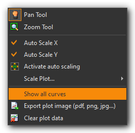
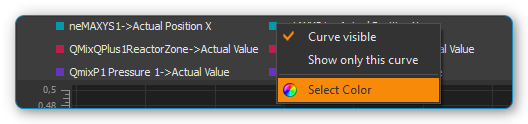

DAQ-Add-on
==========

Installation
------------

Das DAQ Add-on ist nicht im Standard Installationspaket enthalten,
sondern muss als Addon zusätzlich installiert werden. Die Versionen von
DAQ Add-on und installierter Software sollten übereinstimmen. Wenn Sie
z.B. das DAQ Add-on mit der Versionsnummer 20190721 installieren
möchten, sollte die CETONI Elements Software mit der Versionsnummer
20190721 installiert sein.

.. admonition:: Wichtig
   :class: note

   Die Versionsnummer der CETONI Elements      
   Software und des DAQ Plugins sollten übereinstimmen. 

Bitte schließen Sie vor der Installation alle anderen Programme.

.. admonition:: Wichtig
   :class: note

   Installieren Sie das DAQ Plugin +           
   Gerätetreiber, bevor Sie Ihre DAQ Geräte erstmalig über  
   USB mit dem PC verbinden.   

Starten Sie zur Installation die Datei
:file:`CETONI_Elements_DAQ_Setup_64bit.exe`. Der
Installationsassistent führt Sie anschließend durch die Installation der
Software- und Hardware-Treiber.

.. admonition:: Wichtig
   :class: note

   Unter Windows müssen Sie mit                
   Administratorrechten angemeldet sein, um die             
   Installation der Hardware-Treiber durchführen zu können. 

Einführung
----------

Das DAQ-Plugin dient der Aufzeichnung und Auswertung von Daten, welche
mit hoher Messrate erfasst wurden (> 1000 Samples pro Sekunde). Es
werden Geräte unterstützt, die hohe Datenerfassungsraten erlauben (z.B.
National Instruments USB 600x Multifunktions-I/O-Geräte). Das
Mess-Plugin unterstützt aber auch Geräte mit niedriger
Datenerfassungsrate. Die Daten werden gleichzeitig in ein
Prozessdatendiagramm und in eine CSV-Datei geloggt. Eine separate
Konfiguration ist nicht erforderlich. Zur Anzeige des Mess-Diagramms
klicken Sie in der Seitenleiste auf die Schaltfläche :guilabel:`DAQ` :guinum:`❶` (siehe
Abbildung unten).

In der Abbildung oben sehen Sie die wichtigsten Bedienelemente:

.. rst-class:: guinums

#. **DAQ-Schaltflächen** – Hiermit blenden Sie das
   Prozessdaten-Diagramm, sowie die Workbench für die Ergebnisanalyse
   der Mustererkennung ein. Ersteres wird im Abschnitt `Diagramm Navigation und Bedienung`_ 
   näher erläutert, letzteres im Abschnitt `Ergebnisanalyse für die
   Mustererkennung`_.
#. **Zeichenfläche** – Hier sehen Sie die Kurven aller Prozessdaten die
   von dem Diagramm aufgezeichnet werden.
#. **Legende** – Die Legende enthält die Bezeichnung aller Kurven die im
   Diagramm aufgezeichnet werden mit der entsprechenden Farbe. Über die
   Legende können Kurven selektiv ein- / und ausgeblendet werden.
#. **Werkzeugleiste** – Hier finden Sie Schaltflächen zur Konfiguration
   der Datenaufzeichnung, zum Starten und Stoppen der Aufzeichnung und
   zur Navigation innerhalb der Darstellung.

Werkzeugleiste
--------------

+-----------+---------------------------------------------------------+
| |image34| | Öffnet den Konfigurationsdialog zur Konfiguration der   |
|           | Datenerfassung                                          |
+-----------+---------------------------------------------------------+
| |image35| | Startet / stoppt die Datenaufzeichnung                  |
+-----------+---------------------------------------------------------+
| |image36| | Handwerkzeug zum Verschieben des aktuellen Ausschnitts  |
|           | der im Diagramm angezeigt wird                          |
+-----------+---------------------------------------------------------+
| |image37| | Vergrößerungsrahmen aufziehen zum gezielten Vergrößern  |
|           | bestimmter Bereiche                                     |
+-----------+---------------------------------------------------------+
| |image38| | Passt die Skalierung der X-Achse so an, dass alle       |
|           | Messwerte auf den Bildschirm passen                     |
+-----------+---------------------------------------------------------+
| |image39| | Passt die Skalierung der Y-Achse so an, dass alle       |
|           | Messwerte auf den Bildschirm passen                     |
+-----------+---------------------------------------------------------+
| |image40| | Passt die Skalierung der X-Achse und Y-Achse so an,     |
|           | dass alle Messwerte auf den Bildschirm passen           |
+-----------+---------------------------------------------------------+
| |image41| | Aktiviert die automatische Skalierung – solange         |
|           | Messewerte aufgezeichnet werden, wird die Skalierung    |
|           | der X- und Y-Achse automatisch so angepasst, dass alle  |
|           | Messwerte auf den Bildschirm passen.                    |
+-----------+---------------------------------------------------------+
| |image42| | Alle Kurven anzeigen. Wenn Kurven ausgeblendet sind,    |
|           | werden diese wieder eingeblendet.                       |
+-----------+---------------------------------------------------------+
| |image43| | Löscht alle Daten aus dem Diagramm                      |
+-----------+---------------------------------------------------------+
| |image44| | Skalierung umschalten. Damit schalten Sie die           |
|           | Skalierung der X-Achse zwischen absolutem               |
|           | Zeit-/Datumsstempel und relativer Zeit in Sekunden und  |
|           | Millisekunden seit Start der Aufzeichnung um.           |
+-----------+---------------------------------------------------------+
| |image45| | Exportiert ein Bild des der aktuell dargestellten       |
|           | Ausschnitts                                             |
+-----------+---------------------------------------------------------+

Konfigurationsdialog
--------------------

Übersicht Konfigurationsdialog
~~~~~~~~~~~~~~~~~~~~~~~~~~~~~~

Klicken Sie in der Werkzeugleiste auf die Schaltfläche
:guilabel:`Configure data acquisition`, um den Konfigurationsdialog (unten) zu
öffnen.

|

Der Konfigurationsdialog besteht im Wesentlichen aus den folgenden Bereichen:

.. rst-class:: guinums

#. **Geräteliste (Device List)** – die Geräteliste enthält alle Geräte
   von denen Prozessdaten aufgezeichnet werden können. Mit der
   Filterauswahl über der Geräteliste, können Sie diese nach einem
   bestimmten Gerätetyp (z.B. Ventile) filtern.
#. **DAQ Channels** – hier sehen Sie in tabellarischer Form alle Kurven
   die vom Diagramm aufgezeichnet werden.
#. **DAQ Configuration** – in diesem Bereich können Sie die Sample-Rate
   anpassen und den Pfad der CSV-Log-Datei angeben, die gleichzeitig zu
   dem graphischen Diagramm geschrieben wird.

Übersicht Tabelle DAQ Channels
~~~~~~~~~~~~~~~~~~~~~~~~~~~~~~

Die Tabelle :guilabel:`DAQ Channels` zeigt in
tabellarischer Form die konfigurierten Datenerfassungskanäle. Jede Zeile
in der Tabelle entspricht genau einer Kurve in der grafischen
Darstellung. Folgende Spalten sind vorhanden:

-  **Channel** – zeigt die Kanalnummer des entsprechenden Kanals
-  **Device** – enthält den Gerätenamen des Gerätes, von dem ein
   bestimmter Gerätewert aufgezeichnet werden soll und das Geräteicon
-  **Property** – dies ist der Name der Geräteeigenschaft / des
   Prozessdatenwertes, der aufgezeichnet wird. Den Typ der
   Geräteeigenschaft (numerischer oder boolescher Wert) können Sie an
   dem Typ-Icon einfach erkennen.

   ========= ================
   |image47| Numerischer Wert
   |image48| Boolescher Wert
   |image49| Text
   ========= ================

-  **Label** – hier können Sie eine eigene Bezeichnung des Kanals
   festlegen. Diese Bezeichnung erscheint dann in der Legende des
   Graphen.

Zum Hinzufügen von Kanälen führen Sie einfach folgende Schritte durch.

Datenaufzeichnung konfigurieren.
--------------------------------

:step:`Schritt 1- Kanäle hinzufügen`

Um einen Kanal hinzuzufügen, verwenden Sie die Tabelle :guilabel:`Logger Channels`. 
Ziehen Sie dazu den entsprechenden Eintrag aus der :guilabel:`Device List` 
per Drag-&-Drop (Ziehen und Ablegen) in die Tabelle :guilabel:`Logger Channels`. Der neue Kanal wird 
an der Stelle hinzugefügt, an der Sie die Maustaste loslassen (siehe Abbildung oben).

.. tip:: 
   Um die Geräteauswahl zu erleichtern, können   
   Sie die Geräteliste nach Gerätetyp filtern.  

:step:`Schritt 2- Geräteeigenschaft auswählen`

Wählen Sie nun im Bereich der Diagrammkurven :guilabel:`DAQ Channels` die
Geräteeigenschaft (*Property*) aus, die Sie aufzeichnen möchten. Klicken
Sie dafür doppelt in die :guilabel:`Property` Spalte des Gerätes, welches Sie
konfigurieren möchten. Nach dem Doppelklick wird Ihnen ein Auswahlfeld
angezeigt, aus dem Sie die Geräteeigenschaft auswählen können (siehe
Abbildung unten).

:step:`Schritt 3 – Kanalbeschriftung festlegen`

In der Spalte :guilabel:`Label` können Sie für jeden Kanal eine eigene
Beschriftung vergeben. Diese Beschriftung wird später dann in der
Legende des Graphen als Beschriftung der Kurve angezeigt.

Klicken Sie zum Ändern der
Beschriftung doppelt in die Tabellenzelle (siehe Abbildung oben) und
geben Sie dann die neue Bezeichnung ein.

.. admonition:: Wichtig
   :class: note

   Bei der Auswahl einer anderen              
   Geräteeigenschaft wird automatisch eine neue            
   Kanalbezeichnung vergeben. D.h. Sie sollten die         
   Kanalbezeichnung erst nach der Auswahl der              
   Geräteeigenschaft festlegen. 

Kanäle löschen
~~~~~~~~~~~~~~

Um einen oder mehrere Kanäle zu löschen, markieren Sie zuerst die Kanäle
mit der Maus. Sie können dann die Kanäle löschen, indem Sie entweder die
:kbd:`Entfernen`-Taste drücken oder mit der rechten Maustaste das Kontextmenü
aufrufen und den Menüpunkt :menuselection:`Delete Selection` auswählen.

|image56| |image57|

Sie können alle Kanäle des Loggers gleichzeitig löschen, indem Sie im
Kontextmenü den Punkt *Clear Logger* auswählen.

:step:`Schritt 4 – Sample Rate festlegen`

Im Feld :guilabel:`Sample Rate (Hz)` können Sie die Frequenz angeben, mit der
Messwerte im Plot und in der Log-Datei aufgezeichnet werden. Die
maximale Sample Rate hängt von der Messfrequenz ab, die mit der
verwendeten Hardware möglich ist.

.. admonition:: Wichtig
   :class: note

   Wählen Sie die Samplerate stets nur so     
   groß wie nötig. Bei hohen Sampleraten entstehen sehr    
   viele Daten. Das Zeichnen von großen Datenmengen        
   benötigt mehr Rechnerleistung und kann ggf. die         
   Bedienbarkeit der Anwendung verlangsamen.  

.. admonition:: Wichtig
   :class: note

   Verwenden Sie zur Datenaufzeichnung über   
   mehrere Tage eine niedrige Samplerate oder verwenden    
   Sie stattdessen den grafischen Logger.  

Die Konfiguration wird beim Beenden der Anwendung gespeichert und beim
erneuten Start wieder geladen.

:step:`Schritt 5 – Log-Datei konfigurieren`

In diesem Bereich können Sie den Namen der CSV.Log-Dateiangeben :guinum:`❶`, in
die, zusätzlich zum graphischen Logger, alle aufgezeichneten Messwerte
geschrieben werden. Außerdem können Sie das Trennzeichen angeben, mit
dem die Werte der einzelnen Kanäle in der Log-Datei voneinander getrennt
werden :guinum:`❷`.

Datenerfassung starten / stoppen
----------------------------------

Über die entsprechende Schaltfläche in der Werkzeugleiste
können Sie die Datenaufzeichnung starten und stoppen.

|

Diagramm Navigation und Bedienung
---------------------------------

Übersicht
~~~~~~~~~

Das DAQ-Plug-in bietet eine Reihe von Möglichkeiten zur Anpassung der Datendarstellung. 
Dazu gehören die Größenänderung von Teilen einer Kurve und das Ein- und Ausblenden 
einzelner Kurven. Das Diagramm besteht aus einem Plotbereich :guinum:`❶` sowie 
einer X-Achse (Zeit) :guinum:`❸` und einer Y-Achse (Prozessdaten) :guinum:`❹`.

Die Zeitachse zeigt Datum und Uhrzeit als absolute Werte an. Die Prozessdatenachse 
zeigt die jeweiligen Messdaten; sie ist einheitenlos, da sie potentiell eine 
Vielzahl von sehr unterschiedlichen Werten und Maßeinheiten repräsentiert.

Wenn Sie mit der rechten Maustaste in die Zeichenfläche klicken, wird
ein Kontextmenü :guinum:`❷` mit zusätzlichen Funktionen angezeigt.

Ausschnitt verschieben
~~~~~~~~~~~~~~~~~~~~~~

.. image:: ./Pictures/100005C7000035050000350518807CBDF5FF2BAE.svg
   :width: 60
   :align: left

Mit dem Verschiebewerkzeug (*Pan Tool*) können Sie bequem den
Ausschnitt verschieben, der im Diagramm angezeigt wird. Aktivieren Sie
das Werkzeug durch anklicken der Schaltfläche. Klicken Sie nun in die
Zeichenfläche und bewegen Sie die Maus mit gedrückter Maustaste um den
Ausschnitt zu verschieben.

.. admonition:: Wichtig
   :class: note

   Das Verschieben des Ausschnittes bewirkt   
   eine Deaktivierung der automatischen Skalierung.   

Werte einer Kurve anzeigen
~~~~~~~~~~~~~~~~~~~~~~~~~~

Wenn das Verschiebewerkzeug (*Pan Tool*) aktiv ist, können Sie den
Mauszeiger über eine Kurve bewegen, um sich den Wert an der betreffenden
Position anzeigen zu lassen.

Vergrößerung mit Mausrad einstellen
~~~~~~~~~~~~~~~~~~~~~~~~~~~~~~~~~~~~

Durch drehen des Mausrades können Sie die Vergrößerung der Anzeige
erhöhen (hinein zoomen) oder verringern (heraus zoomen).

========= ==============================================
|image69| Vergrößerungsfaktor erhöhen (hinein zoomen)
|image70| Vergrößerungsfaktor verringern (heraus zoomen)
========= ==============================================

Ausschnittvergrößerung mit Vergrößerungsrahmen wählen
~~~~~~~~~~~~~~~~~~~~~~~~~~~~~~~~~~~~~~~~~~~~~~~~~~~~~

.. image:: ./Pictures/1000100A000034EB000034EBFC7CEEC6D6B20A4B.svg
   :width: 60
   :align: left 

Mit dem Vergrößerungswerkzeug (*Zoom Tool*) können Sie
gezielt einen Ausschnitt auswählen, den Sie vergrößert darstellen
möchten. Gehen Sie dafür wie folgt vor (siehe Abbildung unten):

.. rst-class:: guinums

#. Klicken Sie mit der linken Maustaste in die Zeichenfläche um die
   erste Ecke des Vergrößerungsrahmens festzulegen.
#. Ziehen Sie nun mit gedrückter Maustaste ein Vergrößerungsrahmen auf
   die gewünschte Größe.
#. Sobald Sie die Maustaste loslassen, wird der gewählte Ausschnitt auf
   die aktuelle Größe der Anzeige skaliert.

.. image:: ./Pictures/10000000000001FA0000015E46DAC1CBDA6E2854.png
   :alt: Vergrößerungsrahmen aufziehen

Anzeige passend / automatisch skalieren
~~~~~~~~~~~~~~~~~~~~~~~~~~~~~~~~~~~~~~~~

Die Werkzeugleiste und das Kontextmenü enthalten verschiedene Tools um
die Anzeige automatisch so anzupassen, dass alle Daten im sichtbaren
Bereich liegen.

Folgende Möglichkeiten der Anpassung sind vorhanden:

+-----------+---------------------------------------------------------+
| |image80| | Passt die Skalierung der X-Achse so an, dass alle       |
|           | Messwerte auf den Bildschirm passen                     |
+-----------+---------------------------------------------------------+
| |image81| | Passt die Skalierung der Y-Achse so an, dass alle       |
|           | Messwerte auf den Bildschirm passen                     |
+-----------+---------------------------------------------------------+
| |image82| | Passt die Skalierung der X-Achse und Y-Achse so an,     |
|           | dass alle Messwerte auf den Bildschirm passen           |
+-----------+---------------------------------------------------------+
| |image83| | Aktiviert die automatische Skalierung – solange         |
|           | Messwerte aufgezeichnet werden, wird die Skalierung der |
|           | X- und Y-Achse automatisch so angepasst, dass alle      |
|           | Messwerte auf den Bildschirm passen.                    |
+-----------+---------------------------------------------------------+

Die automatische Skalierung können Sie auch über das Kontextmenü
getrennt für X- und Y-Achse aktivieren:

.. image:: ./Pictures/1000000000000109000001040CF9729CD97C9A4D.png
   :alt: Automatische Skalierung für X- und Y-Achse

.. admonition:: Wichtig
   :class: note

   Die Änderung der Vergrößerung oder das     
   Verschieben des Ausschnittes bewirken eine              
   Deaktivierung der automatischen Skalierung.   

Kurven ein- und ausblenden
~~~~~~~~~~~~~~~~~~~~~~~~~~

Um die Skalierung und Sichtbarkeit zu verbessern, können Sie einzelne Kurven ein- 
oder ausblenden. Klicken Sie dazu mit der rechten Maustaste auf das gewünschte 
Element in der Plotlegende und wählen Sie die gewünschte Funktion, um entweder 
nur die entsprechende Kurve auszublenden :menuselection:`Hide Curve` oder alle 
anderen außer der entsprechenden Kurve :menuselection:`Show only this curve`, wie 
in der Abbildung unten dargestellt.

.. image:: ./Pictures/10000000000001A40000005CD26CCB4A8D0DF1F9.png
   :alt: Kontextmenü Legendeneintrag

Wenn Sie alle ausgeblendeten Kurven wieder einblenden möchten,
aktivieren Sie in der Zeichenfläche das Kontextmenü mit der rechten
Maustaste und wählen Sie dann den Menüpunkt :menuselection:`Show all curves` (siehe
Abbildung unten).

Kurvenfarbe ändern
~~~~~~~~~~~~~~~~~~~~

Um eine andere Kurvenfarbe zu wählen, klicken Sie mit der rechten
Maustaste auf einen Eintrag in der Legende. Wählen Sie im Kontextmenü den Menüpunkt 
:menuselection:`Select Color` (siehe Abbildung unten).

Es wird Ihnen nun ein Farbauswahldialog
angezeigt, in dem Sie eine beliebige Kurvenfarbe auswählen können.

Diagramm-Bild exportieren
~~~~~~~~~~~~~~~~~~~~~~~~~~~

.. image:: ./Pictures/10001855000034EB000034EBA6C6DA993124AA4C.svg
   :width: 60
   :align: left

Über den Menüeintrag :menuselection:`Export plot image` im Kontextmenü
können Sie ein Bild des aktuellen Diagramms exportieren. In dem Dateidialog der 
nun eingeblendet wird, wählen Sie zuerst ihr
Zielverzeichnis aus.

.. image:: ./Pictures/100002010000010C000000E1260A96B6F1A86108.png
   :alt: Diagramm Bildexport Dateidialog

Anschließend geben Sie
den Dateinamen der Bilddatei ein :guinum:`❶`. Dann wählen Sie in dem Auswahlfeld
den Dateityp :guinum:`❷` der Bilddatei aus. Die Exportfunktion unterstützt sowohl
Bilddateien (:file:`png, jpg...`) als auch skalierbare Vektorgrafiken 
(:file:`.pdf, svg...`). Wählen Sie das für Sie passende Bildformat aus.

Klicken Sie zum Abschluss auf :guilabel:`Save`:guinum:`❸`, um den Export zu starten.

Diagrammdaten löschen
~~~~~~~~~~~~~~~~~~~~~

.. image:: ./Pictures/100019CB000035050000350509AD2B23340F765E.svg
   :width: 60
   :align: left

Klicken Sie im Kontextmenü auf den Eintrag :menuselection:`Clear plot data`
um alle aufgezeichneten Daten zu löschen und mit einem leeren Diagramm
die Aufzeichnung neu zu beginnen.

.. image:: ./Pictures/100002010000010D000000D1835EC0ADB6A09475.png
   :alt: Menüpunkt Clear plot data im Kontext-Menü

Skalierung der X-Achse umschalten
~~~~~~~~~~~~~~~~~~~~~~~~~~~~~~~~~~~

.. image:: ./Pictures/100018130000350500003505CADD59D81E3150FD.svg
   :width: 60
   :align: left

Sie können die Skalierung der X-Achse zwischen zwei
verschiedenen Modi umschalten. Standardmäßig zeigt die X-Achse einen
absoluten Zeit- / Datumsstempel an.

.. image:: ./Pictures/100002010000022B0000006E35B772A9B9B293D2.png
   :alt: Plot-Zeitachse mit absolutem Zeit-/Datumstempel

Sie können die X-Achse aber auch auf die Anzeige der relativen Zeit in
Sekunden und Millisekunden umschalten. D.h. der Zeitpunkt t\ :sub:`0`
markiert hier den Zeitpunkt an dem die Aufzeichnung gestartet wurde .

Um die Achse
umzuschalten, klicken Sie mit der rechten Maustaste in das Diagramm und
wählen Sie dann aus dem Kontextmenü den Punkt :menuselection:`Toggle X-axis scale`.

Script Funktionen
-----------------

Die Datenerfassung des DAQ Plugins kann über das QmixElements
Scriptsystem gestartet und gestoppt werden, um die Aufnahme von Daten zu
automatisieren oder mit anderen Prozessen zu synchronisieren. Die
entsprechenden Funktionen finden Sie in der :guilabel:`DAQ` Kategorie der
verfügbaren Scriptfunktionen.

Start Plot Logger
~~~~~~~~~~~~~~~~~~

Mit dieser Funktion starten Sie die Datenerfassung mit den
aktuell konfigurierten Einstellungen und Kanälen. Der Inhalt des
Diagramms wird dabei nicht gelöscht.

|

Stop Plot Logger
~~~~~~~~~~~~~~~~~

Diese Funktion stoppt die Aufzeichnung der Daten.

|

Einlesen von Log-Dateien
------------------------

Das DAQ-Addon bietet die Möglichkeit, aufgezeichnete Log-Dateien noch
einmal in den Plot einzulesen. Das Tool zum Einlesen einer Log-Datei ist
dabei in der Lage zusammengehörige Log-Dateien einer
Langzeitaufzeichnung zu erkennen und alle zusammengehörigen Log-Dateien
in chronologischer Reihenfolge einzulesen. Bei großen Datenmengen werden
einzelne Datenpunkte ausgelassen, sodass maximal eine Million
Datenpunkte pro Log-Kurve im Plot angezeigt werden.

.. admonition:: Wichtig
   :class: note

   Das Einlese-Tool erkennt zusammengehörige  
   Log-Dateien und liest diese in chronologischer          
   Reihenfolge ein.   

.. admonition:: Wichtig
   :class: note

   Es werden maximal eine Million Datenpunkte 
   pro Log-Kurve im Plot angezeigt. 

Um eine einzelne Log-Datei oder eine Serie von Log-Dateien einzulesen,
gehen Sie bitte wie folgt vor.

.. rst-class:: steps

#. Wählen Sie aus der Werkzeugleiste das Tool zum Einlesen von
   Log-Dateien.

#. Wählen Sie eine beliebige Datei aus der Log-Dateien-Serie aus, die
   Sie einlesen möchten. Im dargestellten Beispiel erkennt das Tool
   anhand der Dateinummerierungen, dass die Log-Dateien
   zusammengehören.

   .. image:: ./Pictures/1000020100000278000001D0E39D30D1CC066F05.png

#. Anschließend werden die Log-Dateien eingelesen. Im
   *Progress*-Fenster wird der Fortschritt des Einlesevorgangs
   angezeigt. Während des Einlesens können Sie mit der Software
   weiterarbeiten.

   .. image:: ./Pictures/10000201000002FC00000282E7401BFC642FC493.png

#. Nach Beendigung des Einlesevorgangs werden die Log-Kurven mit Angabe des
   Dateinamens im graphischen Plot angezeigt.

   .. image:: ./Pictures/100002010000025C00000201E71E54E4AEA77F6D.png

Mustererkennung
---------------

Das DAQ-Addon bietet die Möglichkeit, Plot-Kurven nach Mustern zu
durchsuchen und diese im graphischen Plot zu kennzeichnen.

Konfigurieren und Ausführen der Mustererkennung
~~~~~~~~~~~~~~~~~~~~~~~~~~~~~~~~~~~~~~~~~~~~~~~

Im folgenden einfachen Beispiel wird die Mustererkennung anhand der
Erkennung von Rechtecksignalen erläutert.

.. rst-class:: steps

#. Gegeben ist eine Plot-Kurve, welche Rechtecksignale mit einer Breite
   zwischen 5 und 8 Sekunden, sowie einem Spitzenwert von 5V enthält.

   .. image:: ./Pictures/10000201000004EF000001D3F48FD363154B3642.png

#. Um die Mustererkennung zu konfigurieren, klicken Sie mit der rechten
   Maustaste auf die Kurve , die sie untersuchen möchten, :guinum:`❶` und wählen
   :menuselection:`Configure Pattern Scan` :guinum:`❷`.

   .. image:: ./Pictures/10000201000002BC0000019435E84DFC0044B4A8.png

#. In dem Dialog, der sich anschließend öffnet, müssen Sie zunächst einen
   neuen Pattern Scanner erstellen. Klicken Sie hierzu auf die
   Schaltfläche :guilabel:`Add New Time Value Pattern Scanner` :guinum:`❶`. Anschließend
   können Sie dem Pattern Scanner einen aussagekräftigen Namen geben :guinum:`❷`.
   Im Beispiel wird *Rectangle Pattern Scanner* gewählt. Mit der
   Schaltfläche :guinum:`❸` löschen Sie den selektierten Pattern Scanner und mit
   :guinum:`❹` können sie alle Pattern Scanner löschen.

   .. image:: ./Pictures/100002010000023C0000025250C7943D7A04C238.png

#. Während der Mustererkennung wird ein Report-File erzeugt. Dieses enthält die
   Messwerte um den Median des erkannten Musters. Wieviele Werte um den
   Median im Report-File enthalten sein sollen, können Sie über das
   Eingabefeld :guilabel:`Number of Median Values` :guinum:`❶` konfigurieren. Möchten Sie,
   dass alle Messwerte innerhalb des erkannten Musters im Report-File
   angegeben werden, wählen sie das Kontrollkästchen :guilabel:`Use All` :guinum:`❷`.

   .. image:: ./Pictures/10000201000002240000013BA4342E81413037EB.png

#. Im nächsten Schritt konfigurieren Sie die
   Muster, die durch den Pattern Scanner erkannt werden sollen. Hierzu
   müssen Sie den Pattern Scanner :guinum:`❶` auswählen, dessen Muster Sie
   konfigurieren wollen. Ein neues Muster können Sie dann über die
   Schaltfläche :guilabel:`Create Item` erzeugen :guinum:`❷`. Dem erzeugten Muster können
   Sie nun einen aussagekräftigen Namen geben :guinum:`❸`.

   .. image:: ./Pictures/100002010000023C00000252E671EDC37054DC8E.png

#. Im nächsten Schritt muss das
   zu erkennende Muster beschrieben werden. Da Rechtecksignale mit
   einer Dauer von 5 – 8 Sekunden und eine Höhe von 5V erkannt werden
   sollen, wird ein Abschnitt mit einer minimalen Dauer von 5 Sekunden
   und einer maximalen Dauer von 8 Sekunden, sowie einem minimalen Wert
   von 4,8 und einem maximalen Wert von 5,2 erstellt. Der Wertebereich
   wird zwischen 4,8 und 5,2 gewählt, um ein gewisses Rauschen des
   Messsignals zu tolerieren. Tragen Sie hierzu in die erste
   Musterzeile, die automatisch erzeugt wurde, die genannten Werte ein.

   .. image:: ./Pictures/10000201000002270000012D0A91CE9C8E182551.png

#. Anschließend muss das Ende des Rechteckmusters erkannt werden. Das Messsignal
   muss für eine gewisse Zeit wieder auf ca. 0V zurückgehen. Es wird
   somit ein neuer Abschnitt mit einer Dauer von 0,2 bis 0,5 Sekunden,
   in dem sich das Messsignal zwischen -0,2 und +0,2 aufhalten muss,
   eingefügt. Klicken Sie hierzu die Stelle an, nach welcher der neue
   Abschnitt eingefügt werden soll :guinum:`❶`, und klicken Sie dann auf :guilabel:`Add Item` 
   :guinum:`❷`. Tragen Sie anschließend die genannten Werte in die
   neu erzeugte Zeile.

   .. image:: ./Pictures/10000201000002310000012F01CDDA082C5126D6.png

   .. tip::
      Ein einzelner Pattern-Scanner kann mehrere Muster erkennen. Wiederholen Sie 
      die Schritte **5** – **7**, um ihrem Pattern Scanner ein weiteres Muster     
      hinzuzufügen.  

#. Im vorletzten Schritt können Sie noch einen Dateipfad angeben, an
   dem das Report-File abgelegt wird. Klicken Sie hierzu auf die
   Schaltfläche :guilabel:`Report File` und geben Sie im sich darauf öffnenden
   Dateidialog den Dateipfad und -namen an. Klicken Sie abschließend
   auf die Schaltfläche :guilabel:`OK`, um die Konfiguration des Pattern-Scanners
   abzuschließen.

   .. admonition:: Wichtig
      :class: note

      Die Einstellungen der Mustererkennung für 
      eine Plot-Kurve werden gespeichert. Wird die           
      Plot-Kurve erneut geladen, wird ihr der entsprechende  
      Pattern-Scanner automatisch zugeordnet.  

#. Im letzten Schritt führen Sie die Mustererkennung aus. Klicken Sie
   hierzu auf die Schaltfläche :guilabel:`Run Pattern Scan` :guinum:`❶`. Die Anfangs- :guinum:`❷`
   und Endpunkte :guinum:`❸` der erkannten Muster werden daraufhin im Plot
   markiert. Eine Meldung :guinum:`❹` zeigt Ihnen an, wieviele Muster in den
   untersuchten Plot-Kurven erkannt wurden. Außerdem wird das
   Report-File geschrieben.

   .. image:: ./Pictures/10000201000004E40000026C5BCC6D58152989B2.png

Verwendung eines existierenden Pattern-Scanners
~~~~~~~~~~~~~~~~~~~~~~~~~~~~~~~~~~~~~~~~~~~~~~~~

Einen Pattern-Scanner, den Sie einmal konfiguriert haben, können Sie
einer Vielzahl an anderen Plot-Kurven zuordnen. Gehen Sie hierzu wie
folgt vor:

.. rst-class:: steps

#. Klicken Sie mit der rechten Maustaste auf die Kurve die Sie
   untersuchen möchten und wählen Sie :guilabel:`Configure Pattern Scan`.

   .. image:: ./Pictures/10000201000002BC0000019435E84DFC0044B4A8.png

#. Im sich daraufhin öffnenden Dialog wählen Sie den Pattern-Scanner,
   den Sie verwenden möchten und klicken anschließend auf :guilabel:`OK`.

   .. image:: ./Pictures/100002010000023C00000252776076AF95048BA6.png

Aktivieren / Deaktivieren der Mustererkennung für eine Plot-Kurve
~~~~~~~~~~~~~~~~~~~~~~~~~~~~~~~~~~~~~~~~~~~~~~~~~~~~~~~~~~~~~~~~~~

Um die Mustererkennung für eine Plot-Kurve zu aktivieren oder zu
deaktivieren, klicken sie mit der rechten Maustaste auf die Plot-Kurve :guinum:`❶`
und wählen Sie :menuselection:`Enable / Disable Pattern Scan` :guinum:`❷`.

Ergebnisanalyse für die Mustererkennung
~~~~~~~~~~~~~~~~~~~~~~~~~~~~~~~~~~~~~~~~~

Übersicht
^^^^^^^^^

Mittels der Ergebnisanalyse für die Mustererkennung können Sie die
einzelnen Resultate einer Mustererkennung innerhalb einer Messwertkurve
miteinander vergleichen. Die einzelnen Resultate werden in einem
separaten Analyse-Plot übereinandergelegt. Hierdurch können Sie
beurteilen, wie sie sich im Verlauf der Messung verändert haben. Zur
Ergebnisanalyse der Mustererkennung gelangen Sie über die Schaltfläche
:guilabel:`Pattern Analysis` :guinum:`❶` in der Gruppe :guilabel:`DAQ` (siehe Abbildung unten).

.. rst-class:: guinums

#. **Pattern-Analysis-Schaltfläche** – Über diese Schaltfläche gelangen
   Sie zur Ergebnisanalyse der Mustererkennung.
#. **Diagramm** – Im Diagramm werden die Messwerte eines jeden einzelnen
   Resultats der Mustererkennung übereinander dargestellt. Hier können
   Sie die einzelnen Resultate miteinander vergleichen.
#. **Legende** – Die Legende enthält die Bezeichnung aller Kurven die im
   Diagramm mit der entsprechenden Farbe dargestellt werden. Die
   Kurvenbezeichnung enthält den relativen Zeitpunkt an dem das Resultat
   in der ursprünglichen Messkurve aufgetreten ist.
#. **Werkzeugleiste** – Hier finden Sie Schaltflächen zur Navigation
   innerhalb der Darstellung, sowie zur Auswahl der Plot-Kurve im
   Prozessdatendiagramm, deren Mustererkennungsresultate in der
   Ergebnisanalyse dargestellt werden sollen. Die Bedienelemente der
   Navigation arbeiten genauso wie die Bedienelemente im
   Prozessdatendiagramm (siehe Abschnitt `Diagramm Navigation und Bedienung`_) und
   werden daher nicht noch einmal erläutert.

Durchführung einer Ergebnisanalyse
^^^^^^^^^^^^^^^^^^^^^^^^^^^^^^^^^^

In Abschnitt `Konfigurieren und Ausführen der Mustererkennung`_
wird die Durchführung einer Mustererkennung beschrieben. Angenommen nach
der Durchführung einer Mustererkennung liegen zwei Plot-Kurven mit
Resultaten vor (siehe Abbildung unten).

.. rst-class:: steps

#. Im ersten Schritt wählen Sie aus der :guilabel:`DAQ`-Gruppe die Schaltfläche
   :guilabel:`Pattern Analysis` um zur Ergebnisanalyse zu gelangen.

   .. image:: ./Pictures/10000201000001CA0000011B98CA543B7F823990.png

#. Im zweiten Schritt wählen Sie aus dem Drop-Down-Feld in der Werkzeugleiste die
   Plot-Kurve aus, deren Ergebnisse Sie dargestellt haben möchten. Im
   dargestellten Beispiel wird „Channel 2 Extinction“ gewählt

   .. image:: ./Pictures/10000201000002D2000000AAF371EF2EC38EC678.png

#. Im Diagramm werden nun die einzelnen Ergebnisse der Mustererkennung für
   „Channel 2 Extinction“ dargestellt. Bei dieser Plot-Kurve wurden
   zwei Übereinstimmungen mit dem konfigurierten Muster festgestellt.
   Man erkennt, dass beide Resultate die gleiche Amplitude aufweisen.
   Das Resultat, welches nach 30,7 Sekunden aufgetreten ist, dauert
   jedoch um ca. 1,6 Sekunden länger als das Resultat, welches nach
   12,9 Sekunden aufgetreten ist.

   .. image:: ./Pictures/10000201000003B700000297B9603A75211E898D.png

.. |image36| image:: ./Pictures/100005C7000035050000350518807CBDF5FF2BAE.svg
   :width: 60
.. |image37| image:: ./Pictures/1000100A000034EB000034EBFC7CEEC6D6B20A4B.svg
   :width: 60
.. |image38| image:: ./Pictures/10000AAD0000350500003505B065E97D3266EBF3.svg
   :width: 60
.. |image39| image:: ./Pictures/10000AA70000350500003505B68BB28A6EC24106.svg
   :width: 60
.. |image40| image:: ./Pictures/10000D410000350500003505737D2F8FEABFA448.svg
   :width: 60
.. |image41| image:: ./Pictures/10001744000034EB000034EBD90F77816321BB6E.svg
   :width: 60
.. |image42| image:: ./Pictures/1000032600003505000035052A2D87EA9B64D7C0.svg
   :width: 60
.. |image43| image:: ./Pictures/100019CB000035050000350509AD2B23340F765E.svg
   :width: 60
.. |image44| image:: ./Pictures/100018130000350500003505CADD59D81E3150FD.svg
   :width: 60
.. |image45| image:: ./Pictures/10001855000034EB000034EBA6C6DA993124AA4C.svg
   :width: 60

.. |image47| image:: ./Pictures/100004EA000035050000350581CFD983D12D425F.svg
   :width: 40
.. |image48| image:: ./Pictures/1000034B000035050000350585C9BEED447C4FB8.svg
   :width: 40
.. |image49| image:: ./Pictures/10000B740000350500003505221106A05ED7DC85.svg
   :width: 40

.. |image56| image:: ./Pictures/100000000000012100000091DA9FF37806721579.png
.. |image57| image:: ./Pictures/10000000000001220000008F22C1F8D0316FE153.png

.. |image69| image:: ./Pictures/10000000000001EC000002E9E123686A038FFB99.png
   :width: 80
.. |image70| image:: ./Pictures/10000000000001EC000002E9C869BC0EE323BD20.png
   :width: 80

.. |image80| image:: ./Pictures/10000AAD0000350500003505B065E97D3266EBF3.svg
   :width: 60
.. |image81| image:: ./Pictures/10000AA70000350500003505B68BB28A6EC24106.svg
   :width: 60
.. |image82| image:: ./Pictures/10000D410000350500003505737D2F8FEABFA448.svg
   :width: 60
.. |image83| image:: ./Pictures/10001744000034EB000034EBD90F77816321BB6E.svg
   :width: 60