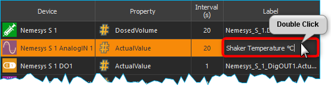
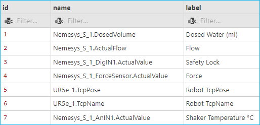
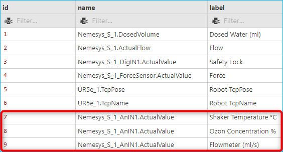

Datenbank Add-on
===================

Das Datenbank-Add-on bietet Unterstützung für SQL-Datenbanken. Es ermöglicht Ihnen, 
Prozessdaten über den SQL Data Logger in einer SQL-Datenbank zu protokollieren 
und unterstützt Sie bei der Erstellung und Ausführung von SQL-Abfragen.

SQL-Datenbank-Logger
--------------------------------

Der SQL-Datenbanklogger ermöglicht die Protokollierung von Prozessdaten in einer 
SQL-Datenbank. Der Logger ist nicht für die Aufzeichnung von Prozessdaten mit 
sehr hohen Abtastraten gedacht, sondern für die Aufzeichnung wichtiger Prozessdaten 
über einen längeren Zeitraum zur Dokumentation von Experimenten oder 
automatisierten Prozessen im Labor.

.. admonition:: Important
   :class: note

   Der SQL-Datenbanklogger unterstützt verschiedene Datenbanken wie SQLite, MySQL 
   oder PostgreSQL. Er wurde mit SQLite- und MySQL-Datenbanken getestet.

Dialog zur Konfiguration des SQL-Loggers
~~~~~~~~~~~~~~~~~~~~~~~~~~~~~~~~~~~~~~~~~

.. image:: Pictures/toolbar_sql_logger_buttons.png
   
Wenn das Datenbank Add-on geladen wurde, zeigt die Symbolleiste zwei zusätzliche 
Schaltflächen für die Konfiguration des SQL-Datenbankloggers :guinum:`❶` und zum 
Starten/Stoppen der Datenaufzeichnung :guinum:`❷`.

.. image:: Pictures/sql_log_config.svg
   :width: 60
   :align: left

Klicken Sie auf die Schaltfläche :guilabel:`Configure SQL Logger`, um den 
Konfigurationsdialog zu öffnen. Der folgende Konfigurationsdialog wird angezeigt:

Der Konfigurationsdialog enthält die folgenden Elemente:

.. rst-class:: guinums

#. **Geräteliste (Device List)** - die Geräteliste enthält alle Geräte von denen 
   Prozessdaten aufgezeichnet werden können. Mit der Filterauswahl über der 
   Geräteliste, können Sie diese nach einem bestimmten Gerätetyp (z.B. Ventile) 
   filtern.
#. **Logger-Kanäle** - hier sehen Sie in tabellarischer Form alle Kanäle die 
   vom Logger aufgezeichnet werden.
#. **Datenbankverbindung konfigurieren** - ermöglicht es dem Benutzer, 
   die Datenbankeinstellungen wie Datenbankserver und Port zu konfigurieren.

Die Tabelle :guilabel:`Logger Channels` zeigt die Konfiguration des Loggers.

Die Tabelle enthält die folgenden Spalten:

-  **Device** - enthält den Gerätenamen des Gerätes, von dem ein
   bestimmter Gerätewert aufgezeichnet werden soll und das Geräteicon
-  **Property** - dies ist der Name der Geräteeigenschaft / des
   Prozessdatenwertes, der aufgezeichnet wird. Den Typ der
   Geräteeigenschaft (numerischer oder boolescher Wert) können Sie an
   dem Typ-Icon einfach erkennen.

   ============== ============================================
   |numeric_prop| Numerischer Wert
   |boolean_prop| Boolescher Wert
   |text_prop|    Textwert
   |array_prop|   Datenarray
   |struct_prop|  Datenstruktur
   ============== ============================================

- **Intervall (s)** - das Messintervall in Sekunden. Das minimale Intervall
  beträgt 1 Sekunde.
-  **Label** - hier können Sie eine eigene Bezeichnung des Kanals
   festlegen.

Datenbank-Einstellungen
~~~~~~~~~~~~~~~~~~~~~~~~

Um die Datenbankeinstellungen zu konfigurieren, klicken Sie im Konfigurationsdialog 
auf die Schaltfläche :guilabel:`Configure Database Connection`.

Der Datenbank-Logger verwendet zunächst eine SQLite-Datenbank im aktuellen 
Projektordner für die Protokollierung. Die Standard-SQLite-Datenbankdatei befindet 
sich in:

.. code-block:: bash

   C:/Users/Public/Documents/QmixElements/Projects/MyProject/Log/ProcessDataDbLog.sqlite

Mit den folgenden Schritten können Sie die Datenbankdatei leicht finden:

- Wählen Sie im Hauptmenü der Anwendung den Menüpunkt :menuselection:`File --> Browse Project Folder`
- der Projektordner wird im Windows-Dateiexplorer geöffnet 
- Öffnen Sie nun den Ordner **Log**.
- innerhalb des Ordners **Log** sollte die Datei :file:`ProcessDataDbLog.sqlite` 
  zu finden sein

Wenn Sie die Datenbankkonfiguration zum ersten Mal öffnen, sollten Sie diese 
Standardkonfiguration sehen:

.. image:: Pictures/default_db_settings.png

Sobald Sie auf die Schaltfläche :guilabel:`Check Connection` :guinum:`❶` klicken, 
sollten Sie das grüne Häkchen :guinum:`❷` sehen. Wenn Sie diese 
Standardeinstellungen wiederherstellen möchten, klicken Sie einfach auf die 
Schaltfläche :guilabel:`Restore default settings` :guinum:`❸`.

Wenn Sie mit einer **SQLite** Datenbank arbeiten, müssen Sie nur den Dateinamen 
der Datenbank auswählen. Wenn Sie einen anderen Datenbanktreiber verwenden, müssen 
Sie zusätzliche Datenbankeinstellungen vornehmen. Die folgende Abbildung zeigt 
die Konfigurationseinstellungen für eine **MySQL**-Datenbank:

.. image:: Pictures/mysql_db_settings.png

Die folgenden Felder müssen ausgefüllt werden:

- **Database Driver**: der Datenbanktreiber, der zu Ihrer Datenbank passt
- **Server Hostname oder IP**: der Hostname oder die IP-Adresse des Servers, 
  auf dem die Datenbank läuft. In diesem Beispiel läuft die MySQL-Datenbank lokal 
  und wir verwenden localhost
- **Port**: die Portnummer des Servers für die Verbindung zur Datenbank. In 
  diesem Beispiel verwenden wir localhost als Hostname, daher ist der Port nicht 
  von Bedeutung
- **Database Name**: Name der Datenbank, die für die Datenprotokollierung 
  verwendet werden soll
- **User Name**: Datenbankbenutzer, der für den Datenbankzugriff verwendet 
  werden soll
- **Password**: Passwort für die Verbindung zur Datenbank

Sobald Sie alle Felder korrekt ausgefüllt haben, wird die Schaltfläche 
:guilabel:`Check Connection` aktiviert. Klicken Sie auf diese Schaltfläche, um 
Ihre Datenbankverbindung zu überprüfen. Wenn diese Prüfung erfolgreich war, 
können Sie auf :guilabel:`OK` klicken, um die Einstellungen zu übernehmen.

.. admonition:: Wichtig
   :class: note

   Die Schaltfläche :guilabel:`Verbindung prüfen` wird nur aktiviert, wenn Sie 
   in allen erforderlichen Feldern Werte eingegeben haben. Die Schaltfläche 
   :guilabel:`OK` wird aktiviert, sobald Sie Ihre Datenbankverbindung erfolgreich 
   geprüft haben.

SQL Logger Configuration
~~~~~~~~~~~~~~~~~~~~~~~~~~~~~~~~

:step:`Schritt 1- Kanäle hinzufügen`

Ziehen Sie das Gerät, für das Sie die Daten protokollieren möchten, per 
Drag-and-Drop aus der :guilabel:`Device List` :guinum:`❶` in die 
:guilabel:`Logger Channels` :guinum:`❷` Liste. Der neue Kanal wird an der 
gewünschten Position in die Liste eingefügt (siehe Abbildung unten).

.. tip::
   Um die Geräteauswahl zu vereinfachen, kann die Geräteliste nach dem Gerätetyp 
   gefiltert werden.

:step:`Schritt 2 - Geräteeigenschaft auswählen`

In der Liste :guilabel:`Logger Channels` müssen Sie nun die Eigenschaft des 
Gerätes auswählen, das Sie aufzeichnen möchten. Doppelklicken Sie dazu in das 
entsprechende Feld in der Spalte :guilabel:`Property` und wählen Sie die 
Geräteeigenschaft aus der sich öffnenden Liste aus (siehe Abbildung unten).

.. _konfigurieren_des_probenintervalls:

:step:`Schritt 3 - Konfigurieren des Aufzeichnungsintervalls`

Sie können für jeden einzelnen Loggerkanal ein eignes Intervall zu Datenaufzeichnung 
einstellen. 
Das minimale Intervall beträgt 1 Sekunde. Um das Log-Intervall zu konfigurieren, 
klicken Sie doppelt in das entsprechende Feld in der Spalte :guilabel:`Interval (s)` 
und geben danach die Intervallzei (Sekunden) ein.

.. image:: Pictures/log_interval_config.png

.. admonition:: Wichtig
   :class: note

   Wählen Sie ein Intervall, das so groß wie möglich und so klein wie 
   nötig ist, um die Menge der aufzuzeichnenden und in der Datenbank zu 
   speichernden Daten zu minimieren.  

:step:`Schritt 4 - Kanalbezeichnung festlegen`

In der Spalte :guilabel:`Label` können Sie die Bezeichnung für jeden Kanal 
anpassen. Sie können diese Spalte verwenden, um zusätzliche Informationen, einen 
aussagekräftigen Namen oder eine SI-Einheitenkennung hinzuzufügen.

Dazu doppelklicken Sie in die entsprechende Tabellenzelle innerhalb der Spalte 
:guilabel:`Label` und geben den Labeltext ein.

.. admonition:: Wichtig
   :class: note

   Wenn Sie eine neue Geräteeigenschaft auswählen, wird automatisch eine neue 
   Kanalbezeichnung zugewiesen. Das heißt, Sie sollten die Kanalbezeichnung erst 
   dann ändern, wenn Sie die richtige Geräteeigenschaft ausgewählt haben.

Die Geräteeigenschaft und die Bezeichnung sind separate Spalten in der SQL-Tabelle.

Löschen von Kanälen
^^^^^^^^^^^^^^^^^^^^

Markieren Sie die gewünschten Kanäle mit der Maus, um einen oder mehrere Kanäle 
aus der Liste zu löschen, und verwenden Sie dann entweder die Taste :kbd:`Entf` 
oder den Eintrag :menuselection:`Delecte Selection` im Kontextmenü der rechten 
Maustaste:

|delete_key| |delete_menu|

Um die gesamte Kanalliste zu löschen, verwenden Sie den Kontextmenüpunkt 
:menuselection:`Clear Logger`.

Datenbank-Schema
~~~~~~~~~~~~~~~~~~

Der SQL-Logger verwendet zum Speichern seiner Daten das folgende Datenbankschema:

.. image:: Pictures/eer_diagram.svg
   :width: 600px

Das Schema besteht aus zwei Tabellen. Die erste Tabelle ist die 
:code:`tbl_process_data` für die Speicherung von Prozessdateninformationen. 
Der folgende Code wird zur Erstellung dieser Tabelle verwendet:

.. code-block:: sql

   CREATE TABLE IF NOT EXISTS `process_data` (
      `id` INTEGER NOT NULL PRIMARY KEY AUTO_INCREMENT,
      `name` varchar(64) NOT NULL,
      `label` varchar(64)
   );

In der Spalte :code:`Name` werden die Prozessdatenbezeichner gespeichert, die 
aus dem Gerätenamen und der ausgewählten Eigenschaft gebildet werden. In der 
Spalte :code:`Label` wird der Wert gespeichert, der in der Spalte Label der 
Tabelle :guilabel:`Logger Channels` eingegeben wurde. Die folgende Abbildung 
zeigt die eingegebenen Werte in der Tabelle *Logger Channels*:

.. image:: Pictures/logger_channels_table_example.png

Diese Konfiguration führt zu den folgenden Einträgen in der Tabelle 
:code:`process_data` (Screenshot VS-Code SQLTools):

Einträge werden niemals aus der Tabelle :code:`process_data` entfernt. Wenn 
ein Eintrag fehlt, wird er hinzugefügt. Wird die Bezeichnung eines Kanals in der 
Tabelle :guilabel:`Logger Channels` geändert, kann dies zu einem neuen Eintrag 
in der Tabelle :code:`process_data` führen. Das folgende Beispielbild zeigt 
dies:

Der analoge Eingang **Nemesys_S_1_AnIN1** Property **ActualValue** 
(Prozessdatenbezeichner :code:`Nemesys_S_1_AnIN1.ActualValue`) wurde verwendet, 
um verschiedene physikalische Größen in verschiedenen Experimenten zu erfassen: 

- die Temperatur einer Schüttlereinheit in °C
- die Ozonkonzentration in %
- und der Wert eines Durchflussmessers in ml/s

Dies zeigt, dass eine Änderung des Wertes :code:`Label` zu unterschiedlichen 
Datenbankeinträgen führt.

Die zweite Tabelle ist die :code:`data_log`, in der die aktuellen Werte aus 
den Geräteeigenschaften gespeichert werden. Diese Tabelle wird mit dem folgenden 
SQL-Code erstellt:

.. code-block:: sql

   CREATE TABLE `data_log` (
      `id` INTEGER NOT NULL PRIMARY KEY AUTO_INCREMENT,
      `log_datetime` DATETIME NOT NULL,
      `process_data_id` int NOT NULL,
      `value` double NULL,
      `value_str` TEXT
      FOREIGN KEY (process_data_id) REFERENCES `process_data` (`id`)
   );

   CREATE INDEX `idx_data_log_process_data_id` ON `data_log` (`process_data_id` ASC);

   CREATE INDEX `idx_data_log_log_datetime` ON `data_log` (`log_datetime` ASC);

Der Code erstellt das folgende Tabellenlayout:

.. image:: Pictures/mysql_tbl_data_log.png

- **log_datetime**: speichert das Datum und die Uhrzeit, zu der der Wert 
  protokolliert wurde
- **process_data_id**: ist ein Fremdschlüssel in der Tabelle 
  :code:`process_data` zur Identifizierung der protokollierten Prozessdaten
- **value**: der tatsächlich protokollierte Wert, wenn es sich um einen numerischen
  oder boolschen Wert handelt
- **value_str**: ein String des protokollierten Wertes - damit können auch
  nicht-numerische Werte wie z.B. Text, Datenarrays, Datenstrukturen oder
  beliebige andere Datentypen aufgezeichnet werden.

Sie können die SQL-Abfragesprache verwenden, um die protokollierten Daten zu 
erhalten, die Sie benötigen. Die folgende Beispiel-SQL-Anweisung zeigt, wie alle 
protokollierten Werte aus den mit **Flowmeter (ml/s)** gekennzeichneten 
Prozessdaten abgerufen werden können:

.. code-block:: sql

   SELECT b.log_datetime, a.name, a.label, b.value 
   FROM data_log AS b 
   INNER JOIN process_data as a ON (b.process_data_id=a.id)  
   WHERE a.label LIKE '%Flowmeter%'

Dies ist die Tabelle, die sich aus der angegebenen SQL-Anweisung ergibt:

.. image:: Pictures/mysql_tbl_log_data_query.png

Skript-Funktionen
------------------

Um die Datenprotokollierung zu automatisieren oder die Datenprotokollierung mit 
anderen Prozessen zu synchronisieren, kann der SQL-Datenbanklogger mit 
Skriptfunktionen gestartet und gestoppt werden. Die entsprechenden Funktionen 
sind in der Kategorie :guilabel:`Logging` in der Liste der verfügbaren 
Skriptfunktionen zu finden.

.. image:: Pictures/sql_logger_script_functions.png

SQL Logger starten - *Start SQL Logger*
~~~~~~~~~~~~~~~~~~~~~~~~~~~~~~~~~~~~~~~~~~

.. image:: Pictures/sql_log_start.svg
   :width: 60
   :align: left

Diese Funktion dient dazu, den SQL-Logger mit den aktuell konfigurierten 
Einstellungen und Kanälen zu starten.

|

SQL-Logger beenden - *Stop SQL Logger*
~~~~~~~~~~~~~~~~~~~~~~~~~~~~~~~~~~~~~~~~

Diese Funktion beendet das Logging in die SQL-Datenbank.

|

SQL-Datenprotokollierung triggern - *Trigger SQL Data Logging*
~~~~~~~~~~~~~~~~~~~~~~~~~~~~~~~~~~~~~~~~~~~~~~~~~~~~~~~~~~~~~~~~

Diese Funktion löst die sofortige Aufzeichnung aller Kanäle des SQL-Loggers aus. 
Normalerweise werden die Daten mit dem konfigurierten 
:ref:`Intervall<konfigurieren_des_probenintervalls>` aufgezeichnet. 
Wenn Sie die sofortige Protokollierung aller Kanäle erzwingen möchten, z.B. wenn 
Sie den aktuellen Zustand aller Kanäle erfassen möchten, wenn ein bestimmtes 
Ereignis eintritt, dann können Sie diese Funktion verwenden.

JavaScript-Datenbankzugriff
--------------------------------

Das Datenbank Add-on bietet JavaScript Funktionen, um auf SQL-Datenbanken von 
:ref:`JavaScript<Verwendung von JavaScript>` aus zuzugreifen. Wenn Sie den Befehl 
:code:`help()` in der JavaScript-Konsole eingeben, sollten Sie die 
Datenbankobjekte wie `QSqlDatabase`_ oder `QSqlQuery`_ sehen.

.. image:: Pictures/database_help.png

Beispiel 1 - SQLite-Datenbankabfrage
~~~~~~~~~~~~~~~~~~~~~~~~~~~~~~~~~~~~~

Der folgende Beispielcode zeigt, wie man die Datenbankobjekte in einer 
JavaScript-Funktion verwendet, um eine SQL-Abfrage für eine SQLite-Datenbank 
auszuführen:

.. code-block:: javascript

   function main() {
      db = new QSqlDatabase();
      db.createConnection("QSQLITE", "JsScript");
      path = ScriptEnv.projectPath(ScriptEnv.LocationLog) + "/ProcessDataDbLog.sqlite";
      db.setDatabaseName(path);
      db.open();
      q = db.createQuery();
      result = q.exec("SELECT * FROM tbl_process_dat");
      if (!result) {
         throw new Error(q.lastError());
      }
      while (q.next()) {
         print(q.recordValues());
      }
   }

Beispiel 2 - SQLite-Datenbankschema erstellen
~~~~~~~~~~~~~~~~~~~~~~~~~~~~~~~~~~~~~~~~~~~~~~

Das folgende Beispiel zeigt, wie man das folgende Datenbankschema in einer 
SQLite-Datenbank mit Hilfe von JavaScript-Code erstellt:

.. image:: Pictures/create_schema_javascript.svg
   :width: 100%

.. code-block:: javascript

   function createSchema() {
   db = new QSqlDatabase();  
   if (!db.createConnection("QSQLITE", "JsConsole")) {
      throw new Error(db.lastError);
   }
   db.setDatabaseName("C:/temp/test3.sqlite");
   if (!db.open()) {
      throw new Error(db.lastError());
   }
   q = db.createQuery();
   result = q.exec("CREATE TABLE IF NOT EXISTS substance ( " + 
      "id INTEGER NOT NULL PRIMARY KEY AUTOINCREMENT, " +
      "name TEXT, " + 
      "description TEXT)");
   if (!result) {
      throw new Error(q.lastError());
   }
   
   result = q.exec("CREATE TABLE IF NOT EXISTS method (" + 
      "id INTEGER NOT NULL PRIMARY KEY AUTOINCREMENT, " + 
      "name TEXT)");
   if (!result) {
      throw new Error(q.lastError());
   }
   
   result = q.exec("CREATE TABLE IF NOT EXISTS experiment (" + 
      "id INTEGER NOT NULL PRIMARY KEY AUTOINCREMENT, " +
      "substance_id INTEGER, " + 
      "method_id INTEGER, " +
      "FOREIGN KEY (substance_id) REFERENCES substance (id), " + 
      "FOREIGN KEY (method_id) REFERENCES method (id))");
   if (!result) {
      throw new Error(q.lastError());
   }
   
      result = q.exec("CREATE TABLE IF NOT EXISTS experiment_log (" + 
      "id INTEGER NOT NULL PRIMARY KEY AUTOINCREMENT, " + 
      "log_datatime TIMESTAMP, " + 
      "event TEXT, " + 
      "experiment_id INTEGER, " + 
      "FOREIGN KEY (experiment_id) REFERENCES experiment (id))");
   if (!result) {
      throw new Error(q.lastError());
   }
   
      result = q.exec("CREATE TABLE IF NOT EXISTS ms_measurement (" + 
      "id INTEGER NOT NULL PRIMARY KEY AUTOINCREMENT, " + 
      "data_file_path TEXT, " + 
      "FOREIGN KEY (id) REFERENCES experiment_log (id))");
   if (!result) {
      throw new Error(q.lastError());
   }
   
   return "";
   }

JavaScript-API-Referenz
----------------------------------

QSqlDatabase
~~~~~~~~~~~~~~~~~~~~~~

.. doxygenclass:: DbPlugin::CScriptQSqlDatabase
    :project: python
    :path: ../doxygen/xml
    :members:
    :undoc-members:

QSqlQuery
~~~~~~~~~~~~~~~~~~~~~~

.. doxygenclass:: DbPlugin::CScriptQSqlQuery
    :project: python
    :path: ../doxygen/xml
    :members:
    :undoc-members:

.. |numeric_prop| image:: Pictures/numeric_property.svg
   :width: 40

.. |text_prop| image:: Pictures/text_property.svg
   :width: 40

.. |boolean_prop| image:: Pictures/boolean_property.svg
   :width: 40

.. |array_prop| image:: Pictures/array_property.svg
   :width: 40

.. |struct_prop| image:: Pictures/structure_property.svg
   :width: 40

.. |delete_key| image:: Pictures/delete_channel_key.png

.. |delete_menu| image:: Pictures/delete_channel_menu.png
