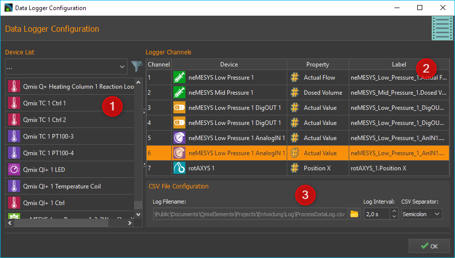
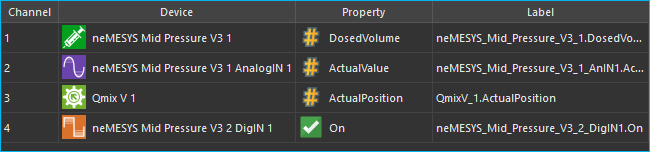
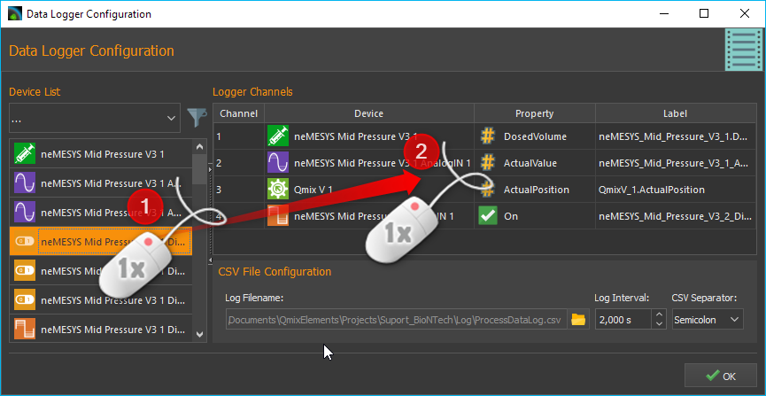
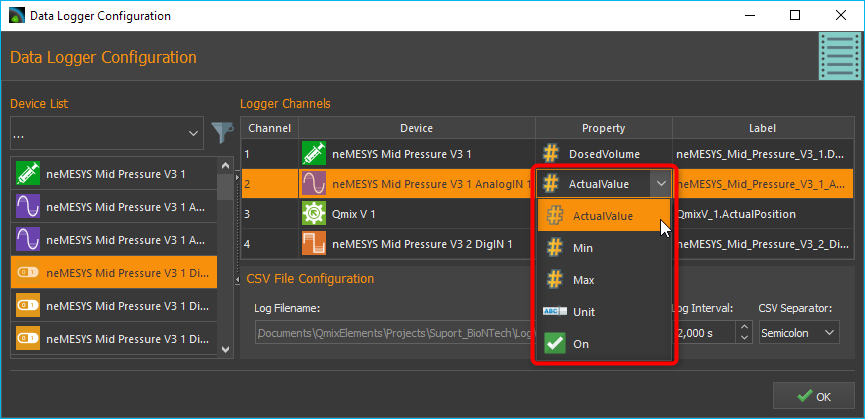
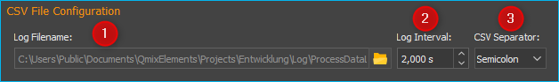
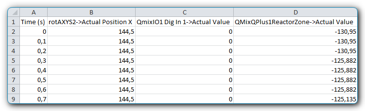
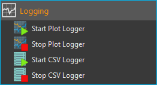

CSV-Datenlogger
===============

Einführung
----------

Mit dem Datalogger-Plugin erhalten Sie ein leistungsfähiges Werkzeug zur
Aufzeichnung beliebiger Prozessdaten von beliebigen Geräten in eine
CSV-Datei. Das Dateiformat CSV steht für englisch *Comma-separated
values* (seltener *Character-separated values*) und beschreibt den
Aufbau einer Textdatei zur Speicherung oder zum Austausch einfach
strukturierter Daten. Die Dateinamenserweiterung lautet *csv*.

.. admonition:: Tipp
   :class: tip

   CSV-Dateien können, wenn Sie das richtige      
   Trennzeichen und das richtige Dezimalzeichen verwenden,  
   ohne Probleme im Tabellenkalkulationsprogramm Microsoft  
   Excel geöffnet und weiterverarbeitet werden.    

Konfigurationsdialog
--------------------

Konfigurationsdialog aufrufen
~~~~~~~~~~~~~~~~~~~~~~~~~~~~~

Wenn das Datalogger-Plugin geladen wurde, sind in der Werkzeugleiste zwei
zusätzliche Schaltflächen für die Konfiguration der Datenprotokollierung
:guinum:`❶` und zum Start / Stopp der Aufzeichnung :guinum:`❷` vorhanden.

Übersicht Konfigurationsdialog
~~~~~~~~~~~~~~~~~~~~~~~~~~~~~~

Sobald die Konfiguration der Datenaufzeichnung aktiviert wurde, wird der 
folgende Konfigurationsdialog angezeigt:

Der
Konfigurationsdialog zur Datenprotokollierung besteht im Wesentlichen
aus den folgenden Bereichen:

.. rst-class:: guinums

1. **Geräteliste (Device List)** – die Geräteliste enthält alle Geräte
   von denen Prozessdaten aufgezeichnet werden können. Mit der
   Filterauswahl über der Geräteliste, können Sie diese nach einem
   bestimmten Gerätetyp (z.B. Ventile) filtern.
2. **Logger Channels** – hier sehen Sie in tabellarischer Form alle
   Kanäle die vom Logger aufgezeichnet werden.
3. **CSV File Configuration** – in diesem Bereich können Sie verschiedene
   Einstellungen zur Aufzeichnung der CSV-Datei konfigurieren.

Übersicht Tabelle Logger-Channels
~~~~~~~~~~~~~~~~~~~~~~~~~~~~~~~~~

Die Tabelle :guilabel:`Logger Channels` zeigt in tabellarischer Form die
Konfiguration des Prozessdatenloggers. Jede Zeile in der Tabelle
entspricht genau einer Spalte in der CSV-Dateien die aufgezeichnet wird.
Folgende Spalten sind vorhanden:

-  **Channel** – zeigt die Kanalnummer des entsprechenden Kanals
-  **Device** – enthält den Gerätenamen des Gerätes, von dem ein
   bestimmter Gerätewert aufgezeichnet werden soll und das Geräteicon
-  **Property** – dies ist der Name der Geräteeigenschaft / des
   Prozessdatenwertes, der aufgezeichnet wird. Den Typ der
   Geräteeigenschaft (numerischer oder boolescher Wert) können Sie an
   dem Typ-Icon einfach erkennen.

   ======== ================
   |image5| Numerischer Wert
   |image6| Boolescher Wert
   |image7| Text
   ======== ================

-  **Label** – hier können Sie eine eigene Bezeichnung des Kanals
   festlegen. Diese Bezeichnung erscheint dann in der CSV-Datei in der
   Kopfzeile über der Spalte mit den Prozessdaten.

Zum Hinzufügen eines Prozessdatenkanals zum Logger, führen Sie einfach
folgende Schritte durch.

Datenprotokollierung konfigurieren
-----------------------------------

:step:`Schritt 1 - Kanäle hinzufügen`

Ziehen Sie aus
der Geräteliste :guilabel:`Device List` das Gerät, von dem Sie Prozessdaten aufzeichnen möchten,
via Drag & Drop (Ziehen und Ablegen) in die Kanalliste :guilabel:`Logger Channels`. Der neue Kanal
wird in der Zeile eingefügt, an der sie die Maustaste loslassen (siehe
Abbildung unten).

.. admonition:: Tipp
   :class: tip

   Um die Geräteauswahl zu erleichtern, können    
   Sie die Geräteliste nach Gerätetyp filtern. 

:step:`Schritt 2 - Geräteeigenschaft auswählen`

Wählen Sie nun im Bereich der Logger-Kanäle :guilabel:`Logger Channels` die
Geräteeigenschaft aus (*Property*), die Sie aufzeichnen möchten. Klicken
Sie dafür doppelt in die :guilabel:`Property`-Spalte des Gerätes, welches Sie
konfigurieren möchten. Nach dem Doppelklick wird Ihnen ein Auswahlfeld
angezeigt, aus dem Sie die Geräteeigenschaft auswählen können (siehe
Abbildung unten).

:step:`Schritt 3 - Kanalbeschreibung`

In der Spalte :guilabel:`Label` können Sie für jeden Kanal eine eigene
Beschriftung vergeben. Diese Beschriftung wird später dann in der
CSV-Datei in der Kopfzeile in der Spalte des entsprechenden Kanals
erscheinen.

.. image:: Pictures/10000201000002670000009030B373AFA6AF1077.png
   :alt: Kanalbeschriftung ändern

Klicken Sie zum Ändern der
Beschriftung doppelt in die Tabellenzelle (siehe Abbildung oben) und
geben Sie dann die neue Bezeichnung ein.

.. admonition:: Wichtig
   :class: note

   Bei der Auswahl einer anderen              
   Geräteeigenschaft wird automatisch eine neue            
   Kanalbezeichnung vergeben. D.h. Sie sollten die         
   Kanalbezeichnung erst nach der Auswahl der              
   Geräteeigenschaft festlegen.   

Kanäle löschen
~~~~~~~~~~~~~~

Um einen oder mehrere Kanäle zu löschen, markieren Sie zuerst die Kanäle
mit der Maus. Sie können dann die Kanäle löschen, indem Sie entweder die
:kbd:`Delete`-Taste drücken oder mit der rechten Maustaste das Kontextmenü
aufrufen und den Menüpunkt :menuselection:`Delecte Selection` auswählen.

|image14| |image15|

Sie können alle Kanäle des Loggers gleichzeitig löschen, indem Sie im
Kontextmenü den Punkt :menuselection:`Clear Logger` auswählen.

:step:`Schritt 4 – CSV Eigenschaften konfigurieren`

Im Bereich :guilabel:`CSV File Configuration` können Sie globale Eigenschaften 
des CSV Loggers und zum
Format der Aufzeichnung konfigurieren (siehe Abbildung unten).

Dateinamen und Ordner wählen
^^^^^^^^^^^^^^^^^^^^^^^^^^^^

Mit dem Parameter :guilabel:`Log Filename` :guinum:`❶` können Sie den Dateinamen der
Protokolldatei festlegen. Klicken Sie dafür auf die Schaltfläche mit dem
Ordnersymbol und wählen Sie dann in dem Dateidialog den Zielordner und
den Dateinamen aus.

.. image:: Pictures/100000000000028F000001D742CE00F60CA536D2.png
   :alt: Dateinamen und Ordner der Protokolldatei wählen

Aufzeichnungsintervall festlegen
^^^^^^^^^^^^^^^^^^^^^^^^^^^^^^^^^^

Im Feld :guilabel:`Log Interval` :guinum:`❷` können Sie das Intervall für die Aufzeichnung
eines CSV-Datensatzes mit den Werten aller Kanäle festlegen. Die Einheit
für das Intervall sind Sekunden und Sie können das Intervall mit einer
Auflösung von 0,1 Sekunden festlegen.

.. admonition:: Wichtig
   :class: note

   Wählen Sie das Intervall so groß wie       
   möglich und so klein wie nötig um die Menge der         
   aufzuzeichnenden Daten so gering wie möglich zu halten. 

Datenfeld-Trennzeichen festlegen
^^^^^^^^^^^^^^^^^^^^^^^^^^^^^^^^

Mit dem Auswahlfeld :guilabel:`CSV Separator` :guinum:`❸` können Sie das Trennzeichen
auswählen, dass zur Trennung der einzelnen Datenfelder (Spalten)
verwendet werden soll. Je nach Applikation, die Sie zur Auswertung der
Daten verwenden, kann es notwendig sein, ein bestimmtes Trennzeichen
auszuwählen.

.. admonition:: Tipp
   :class: tip

   Um die CSV Log-Dateien optimal in Microsoft   
   Excel importieren zu können, sollten Sie als            
   Trennzeichen ein Semikolon verwenden.  

.. admonition:: Wichtig
   :class: note

   Alle Konfigurationseinstellungen des       
   Prozessdatenloggers werden beim Verlassen des           
   Konfigurationsdialogs gespeichert und sind auch nach    
   einem erneuten Start der Anwendung vorhanden.   

Protokollierung starten / stoppen
---------------------------------

.. image:: Pictures/1000106B000034EB000034EBCD48AF0AC896EFC6.svg
   :width: 60
   :height: 60
   :align: left

Über die entsprechende Schaltfläche in der Werkzeugleiste
können Sie die Datenaufzeichnung starten und stoppen.

Beim Start der Aufzeichnung wird eine neue Protokolldatei erstellt. An
den Dateinamen der Protokolldatei wird ein Zeitstempel mit dem Datum und
der Uhrzeit zum Zeitpunkt der Erstellung der Datei angehängt (Syntax: :file:`_YYYYMMDD_hhmmss`). D.h wenn
Sie z.B. den Dateinamen :file:`ProcessDataLog.csv` konfigurieren, wird beim
Starten der Aufzeichnung z.B. eine Datei mit dem Namen
:file:`ProcessDataLog_20121105_103209.csv` angelegt. D.h. Die Datei wurde am
5.11.2012 um 10:32 Uhr und 9 Sekunden angelegt.

So wird bei jedem erneuten Start der Aufzeichnung eine neue
Protokolldatei mit einem eindeutigen Zeitstempel angelegt.

Format der Aufzeichnung
-----------------------

Die aufgezeichneten CSV-Dateien sind wir folgt aufgebaut:

-  Die CSV-Dateien besteht aus einer Reihe von Datensätzen (Zeilen) die
   durch einen Zeilenumbruch getrennt sind.
-  Jeder Datensatz besteht aus einer Reihe von Datenfeldern (Spalten)
   die durch ein Trennzeichen (z.B. Semikolon) getrennt sind.
-  Die erste Spalte enthält stets einen relativen Zeitstempel des
   Zeitpunktes an dem der betreffende Datensatz (Zeile) aufgezeichnet
   wurde.
-  Die erste Zeile enthält die Kanalbezeichnung die vom Anwender
   konfiguriert wurde.

Wenn Sie zur Auswertung den absoluten Zeitstempel der Aufzeichnung eines
Datensatzes benötigen, können Sie sich diesen Zeitpunkt sehr einfach
ausrechnen (z.B. in einer extra Spalte der Tabellenkalkulation). Der
absolute Zeitpunkt t\ :sub:`0` ist in dem Dateinamen der Log-Datei
enthalten. D.h. Sie können die absoluten Zeitpunkte stets durch Addition
von t\ :sub:`0` und dem relativen Zeitstempel in der ersten Spalte eines
Datensatzes berechnen.

.. admonition:: Tipp
   :class: tip

   Der absolute Zeitpunkt t0 der Aufzeichnung    
   einer CSV Log-Datei ist im Dateinamen enthalten.   

Script Funktionen
-----------------

Der CSV-Datenlogger kann über das Scriptsystem der Software gestartet
und gestoppt werden, um die Aufnahme von Daten zu automatisieren oder
mit anderen Prozessen zu synchronisieren. Die entsprechenden Funktionen
finden Sie in der :guilabel:`Logging`-Kategorie der verfügbaren Scriptfunktionen.

Funktion Start CSV Logger
~~~~~~~~~~~~~~~~~~~~~~~~~~~

.. image:: Pictures/1000106B000034EB000034EBCD48AF0AC896EFC6.svg
   :width: 60
   :height: 60
   :align: left

Mit dieser Funktion starten Sie den CSV-Logger mit den
aktuell konfigurierten Einstellungen und Kanälen. Eine neue Log-Datei
wird mit aktuellem Zeitstempel angelegt.

|

Funktion Stop CSV Logger
~~~~~~~~~~~~~~~~~~~~~~~~

Diese Funktion stoppt das aktuelle Logging und schließt die
geöffnete Log-Datei.

.. |image5| image:: Pictures/100004EA000035050000350581CFD983D12D425F.svg
   :width: 40
.. |image6| image:: Pictures/1000034B000035050000350585C9BEED447C4FB8.svg
   :width: 40
.. |image7| image:: Pictures/10000B740000350500003505221106A05ED7DC85.svg
   :width: 40

.. |image14| image:: Pictures/100000000000012100000091D7BFE42C03BA6ECE.png
.. |image15| image:: Pictures/10000000000001220000008F424E5926A933056B.png   