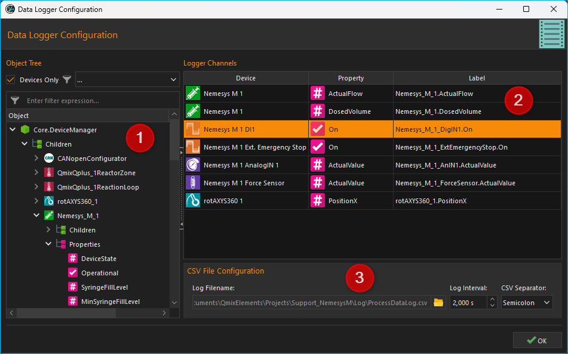

CSV-Datenlogger
===============

Einführung
----------

Mit dem Datalogger-Plugin erhalten Sie ein leistungsfähiges Werkzeug zur
Aufzeichnung beliebiger Prozessdaten von beliebigen Geräten in eine
CSV-Datei. Das Dateiformat CSV steht für englisch *Comma-separated
values* (seltener *Character-separated values*) und beschreibt den
Aufbau einer Textdatei zur Speicherung oder zum Austausch einfach
strukturierter Daten. Die Dateinamenserweiterung lautet *csv*.

.. admonition:: Tipp
   :class: tip

   CSV-Dateien können, wenn Sie das richtige      
   Trennzeichen und das richtige Dezimalzeichen verwenden,  
   ohne Probleme im Tabellenkalkulationsprogramm Microsoft  
   Excel geöffnet und weiterverarbeitet werden.    

Konfigurationsdialog
--------------------

Konfigurationsdialog aufrufen
~~~~~~~~~~~~~~~~~~~~~~~~~~~~~

.. image:: Pictures/10000201000001B600000043E638CC3BBADD620A.png
   :alt: Werkzeugleiste Datenprotokollierung

Wenn das Datalogger-Plugin geladen wurde, sind in der Werkzeugleiste zwei
zusätzliche Schaltflächen für die Konfiguration der Datenprotokollierung
:guinum:`❶` und zum Start / Stopp der Aufzeichnung :guinum:`❷` vorhanden.

Übersicht Konfigurationsdialog
~~~~~~~~~~~~~~~~~~~~~~~~~~~~~~

Sobald die Konfiguration der Datenaufzeichnung aktiviert wurde, wird der 
folgende Konfigurationsdialog angezeigt:

Der
Konfigurationsdialog zur Datenprotokollierung besteht im Wesentlichen
aus den folgenden Bereichen:

.. rst-class:: guinums

1. **Objektbaum (Object Tree)** - Der Objektbaum enthält einen Baum aller
   Objekte und deren Eigenschaften, die in der Applikation vorhanden sind.
   Mit verschiedenen Filtern können Sie den Objektbaum nach bestimmten Objekten
   filtern. Standardmäßig werden nur Geräte und Geräteeigenschaften angezeigt.
   
2. **Logger Channels** - hier sehen Sie in tabellarischer Form alle
   Kanäle die vom Logger aufgezeichnet werden.

3. **CSV File Configuration** - in diesem Bereich können Sie verschiedene
   Einstellungen zur Aufzeichnung der CSV-Datei konfigurieren.

Der Objektbaum
~~~~~~~~~~~~~~~~~~~~~~~~~~~~~~~~~

Im Objektbaum finden Sie eine hierarchische Auflistung aller Objekte (z.B. Geräte) 
und deren Kindobjekte (wie z.B. untergeordnete Geräte):

.. image:: ../../img/datalogger/object_tree.png

.. rst-class:: guinums

1. **Objekt** - Ein Objekt kann z.B. ein Gerät (hier **Nemesys_M_1**) oder
   ein anderes Anwendungsobjekt sein. In jedem Objekt finden Sie nach dem
   Aufklappen in der nächsten Ebene die beiden Elemente **Children** und
   **Properties**.

2. **Children** - Das Children Element gruppiert alle Kindobjekte des 
   übergeordneten Objektes. In unserem Beispiel sind dies alle Objekte,
   bzw. Geräte, die dem Gerät **Nemesys_M_1** untergeordnet sind bzw. zu
   diesem Gerät gehören.

3. **Properties** - Das Properties Element gruppiert alle Eigenschaften des 
   übergeordneten Objektes. In unserem Beispiel sind dies alle Eigenschaften
   des Gerätes **Nemesys_M_1**, welche im Logger aufgezeichnet werden können.

4. **Untergeordnetes Objekt** - In der **Children** Gruppe sind alle untergeordneten
   Objekte zu finden. Beim Beispiel **Nemesys_M_1** sind dies z.B. die
   digitalen und analogen Ein- und Ausgänge des Gerätes, wie z.B.
   **Nemesys_M_1_DigOUT1**. Diese Objekte können wiederum aufgeklappt werden,
   um deren Kindobjekte und Eigenschaften anzuzeigen.

5. **Eigenschaft** - In der **Properties** Gruppe finden sie alle Eigenschaften 
   des übergeordneten Objektes. Beim Beispiel **Nemesys_M_1** sind dies z.B.
   die Eigenschaften **SyringeFillLevel** oder **ActualFlow**. Diese
   Eigenschaften können Sie einfach per Drag & Drop in die Kanalliste ziehen,
   um deren Werte aufzuzeichnen.

Objektbaum filtern
~~~~~~~~~~~~~~~~~~~~~~~~~~~~~~~~~

Über dem Objektbaum finden Sie verschiedene Filter, mit denen Sie den Objektbaum
nach bestimmten Kriterien filtern können. Standardmäßig ist die Checkbox 
:guilabel:`Devices Only` :guinum:`❶` aktiviert. D.h. im Objektbaum werden nur
Geräte, die vom internen Gerätemanager (:guilabel:`Core.DeviceManager`) verwaltet
werden angezeigt. Wenn Sie diese Checkbox deaktivieren, werden Ihnen im
Objektbaum weitere Anwendungsobjekte angezeigt.

Ist die Checkbox :guilabel:`Devices Only`:guinum:`❶` aktiviert, wird Ihnen
eine Auswahlbox :guinum:`❷` angezeigt, mit der Sie den Gerätebaum nach einem
bestimmten Gerätetyp filtern können. In der Abbildung unten wurde z.B. nach
Spritzenpumpen gefiltert:

.. image:: ../../img/datalogger/object_tree_filter.png

Zusätzlich finden Sie direkt über dem Objektbaum ein Eingabefeld :guinum:`❸`,
mit dem Sie den Objektbaum nach einem bestimmten Begriff, z.B. einem
Gerätenamen oder eine Geräteeigenschaft, filtern können. In der Abbildung unten
wurde z.B. nach der Geräteeigenschaft **ActualFlow** gefiltert. D.h.,
es werden nur Objekte oder Geräte mit dieser Eigenschaft im Objektbaum
angezeigt:

.. image:: ../../img/datalogger/object_tree_filter_text.png

Liste der Logger-Kanäle
~~~~~~~~~~~~~~~~~~~~~~~~~~~~~~~~~

.. image:: ../../img/datalogger/logger_channels_view.png

Die Kanalliste :guilabel:`Logger Channels` zeigt in tabellarischer Form die
Konfiguration des Loggers. Jede Zeile in der Tabelle
entspricht genau einer Spalte in der CSV-Dateien die aufgezeichnet wird.
Folgende Spalten sind vorhanden:

-  **Object** - enthält den Namen des Objektes, von dem der Wert einer
   bestimmten Eigenschaft (Property) aufgezeichnet werden soll und das Icon des
   Objekts.
-  **Property** - dies ist der Name der Objekteigenschaft / des
   Prozessdatenwertes, der aufgezeichnet wird. Den Typ der
   Eigenschaft (numerischer oder boolescher Wert) können Sie an
   dem Typ-Icon einfach erkennen.

   ============ =================
   |icon-num|   Numerischer Wert
   |icon-bool|  Boolescher Wert
   |icon-text|  Text
   ============ =================

-  **Label** - hier können Sie eine eigene Bezeichnung des Kanals
   festlegen. Diese Bezeichnung erscheint dann in der CSV-Datei in der
   Kopfzeile über der Spalte mit den Prozessdaten.

Zum Hinzufügen eines Kanals zum Logger, führen Sie einfach
folgende Schritte durch:

Datenaufzeichnung konfigurieren
-----------------------------------

Kanäle hinzufügen
~~~~~~~~~~~~~~~~~~~~

:step:`Schritt 1 - Kanäle hinzufügen`

Ziehen Sie aus dem Objektbaum :guilabel:`Object Tree` die Objekteigenschaft,
welche Sie aufzeichnen möchten, per Drag & Drop in die Kanalliste 
:guilabel:`Logger Channels`. Der neue Kanal wird in der Zeile eingefügt, an 
der sie die Maustaste loslassen (siehe Abbildung unten).

.. image:: ../../img/datalogger/csv_logger_drag_and_drop.png

.. admonition:: Tipp
   :class: tip

   Um die Auswahl einer Objekteigenschaft (Property) zu erleichtern, können Sie den 
   Objektbaum nach verschiedenen Kriterien filtern.

:step:`Schritt 2 - Kanalbeschriftung festlegen`

In der Spalte :guilabel:`Label` können Sie für jeden Kanal eine eigene
Beschriftung vergeben. Diese Beschriftung wird später dann in der
CSV-Datei in der Kopfzeile in der Spalte des entsprechenden Kanals
erscheinen.

.. image:: ../../img/datalogger/log_channel_label.png
   :alt: Kanalbeschriftung ändern

Klicken Sie zum Ändern der
Beschriftung doppelt in die Tabellenzelle (siehe Abbildung oben) und
geben Sie dann die neue Bezeichnung ein.

Kanäle löschen
~~~~~~~~~~~~~~

Um einen oder mehrere Kanäle zu löschen, markieren Sie zuerst die Kanäle
mit der Maus. Sie können dann die Kanäle löschen, indem Sie entweder die
:kbd:`Delete`-Taste drücken oder mit der rechten Maustaste das Kontextmenü
aufrufen und den Menüpunkt :menuselection:`Delecte Selection` auswählen.

|image14| |image15|

Sie können alle Kanäle des Loggers gleichzeitig löschen, indem Sie im
Kontextmenü den Punkt :menuselection:`Clear Logger` auswählen.

CSV Eigenschaften konfigurieren
~~~~~~~~~~~~~~~~~~~~~~~~~~~~~~~~~~~~~~~~~~

Im Bereich :guilabel:`CSV File Configuration` können Sie globale Eigenschaften 
des CSV Loggers und zum
Format der Aufzeichnung konfigurieren (siehe Abbildung unten).

.. image:: Pictures/10000201000002740000005D7814BAB01380FB40.png
   :alt: CSV Eigenschaften konfigurieren

Dateinamen und Ordner wählen
^^^^^^^^^^^^^^^^^^^^^^^^^^^^

Mit dem Parameter :guilabel:`Log Filename` :guinum:`❶` können Sie den Dateinamen der
Protokolldatei festlegen. Klicken Sie dafür auf die Schaltfläche mit dem
Ordnersymbol und wählen Sie dann in dem Dateidialog den Zielordner und
den Dateinamen aus.

.. image:: Pictures/100000000000028F000001D742CE00F60CA536D2.png
   :alt: Dateinamen und Ordner der Protokolldatei wählen

Aufzeichnungsintervall festlegen
^^^^^^^^^^^^^^^^^^^^^^^^^^^^^^^^^^

Im Feld :guilabel:`Log Interval` :guinum:`❷` können Sie das Intervall für die Aufzeichnung
eines CSV-Datensatzes mit den Werten aller Kanäle festlegen. Die Einheit
für das Intervall sind Sekunden und Sie können das Intervall mit einer
Auflösung von 0,1 Sekunden festlegen.

.. admonition:: Wichtig
   :class: note

   Wählen Sie das Intervall so groß wie       
   möglich und so klein wie nötig um die Menge der         
   aufzuzeichnenden Daten so gering wie möglich zu halten. 

Datenfeld-Trennzeichen festlegen
^^^^^^^^^^^^^^^^^^^^^^^^^^^^^^^^

Mit dem Auswahlfeld :guilabel:`CSV Separator` :guinum:`❸` können Sie das Trennzeichen
auswählen, dass zur Trennung der einzelnen Datenfelder (Spalten)
verwendet werden soll. Je nach Applikation, die Sie zur Auswertung der
Daten verwenden, kann es notwendig sein, ein bestimmtes Trennzeichen
auszuwählen.

.. admonition:: Tipp
   :class: tip

   Um die CSV Log-Dateien optimal in Microsoft   
   Excel importieren zu können, sollten Sie als            
   Trennzeichen ein Semikolon verwenden.  

.. admonition:: Wichtig
   :class: note

   Alle Konfigurationseinstellungen des       
   Prozessdatenloggers werden beim Verlassen des           
   Konfigurationsdialogs gespeichert und sind auch nach    
   einem erneuten Start der Anwendung vorhanden.   

Protokollierung starten / stoppen
---------------------------------

Über die entsprechende Schaltfläche in der Werkzeugleiste
können Sie die Datenaufzeichnung starten und stoppen.

Beim Start der Aufzeichnung wird eine neue Protokolldatei erstellt. An
den Dateinamen der Protokolldatei wird ein Zeitstempel mit dem Datum und
der Uhrzeit zum Zeitpunkt der Erstellung der Datei angehängt (Syntax: :file:`_YYYYMMDD_hhmmss`). D.h wenn
Sie z.B. den Dateinamen :file:`ProcessDataLog.csv` konfigurieren, wird beim
Starten der Aufzeichnung z.B. eine Datei mit dem Namen
:file:`ProcessDataLog_20121105_103209.csv` angelegt. D.h. Die Datei wurde am
5.11.2012 um 10:32 Uhr und 9 Sekunden angelegt.

So wird bei jedem erneuten Start der Aufzeichnung eine neue
Protokolldatei mit einem eindeutigen Zeitstempel angelegt.

Format der Aufzeichnung
-----------------------

Die aufgezeichneten CSV-Dateien sind wir folgt aufgebaut:

-  Die CSV-Dateien besteht aus einer Reihe von Datensätzen (Zeilen) die
   durch einen Zeilenumbruch getrennt sind.
-  Jeder Datensatz besteht aus einer Reihe von Datenfeldern (Spalten)
   die durch ein Trennzeichen (z.B. Semikolon) getrennt sind.
-  Die erste Spalte enthält stets einen relativen Zeitstempel des
   Zeitpunktes an dem der betreffende Datensatz (Zeile) aufgezeichnet
   wurde.
-  Die erste Zeile enthält die Kanalbezeichnung die vom Anwender
   konfiguriert wurde.

.. image:: Pictures/10000000000002EF000000E6889ECE76397F99EB.png
   :alt: CSV Log-Datei nach dem Öffnen in Microsoft Excel

Wenn Sie zur Auswertung den absoluten Zeitstempel der Aufzeichnung eines
Datensatzes benötigen, können Sie sich diesen Zeitpunkt sehr einfach
ausrechnen (z.B. in einer extra Spalte der Tabellenkalkulation). Der
absolute Zeitpunkt t\ :sub:`0` ist in dem Dateinamen der Log-Datei
enthalten. D.h. Sie können die absoluten Zeitpunkte stets durch Addition
von t\ :sub:`0` und dem relativen Zeitstempel in der ersten Spalte eines
Datensatzes berechnen.

.. admonition:: Tipp
   :class: tip

   Der absolute Zeitpunkt t0 der Aufzeichnung    
   einer CSV Log-Datei ist im Dateinamen enthalten.   

Script Funktionen
-----------------

Der CSV-Datenlogger kann über das Scriptsystem der Software gestartet
und gestoppt werden, um die Aufnahme von Daten zu automatisieren oder
mit anderen Prozessen zu synchronisieren. Die entsprechenden Funktionen
finden Sie in der :guilabel:`Logging`-Kategorie der verfügbaren Scriptfunktionen.

.. image:: Pictures/10000201000001060000008EE8252D88C2E8FBC7.png
   :alt: Logger Script Funktionen

Funktion Start CSV Logger
~~~~~~~~~~~~~~~~~~~~~~~~~~~

Mit dieser Funktion starten Sie den CSV-Logger mit den
aktuell konfigurierten Einstellungen und Kanälen. Eine neue Log-Datei
wird mit aktuellem Zeitstempel angelegt.

|

Funktion Stop CSV Logger
~~~~~~~~~~~~~~~~~~~~~~~~

.. image:: Pictures/1000101A000034EB000034EB2614684FE9CC8E2D.svg
   :width: 60
   :height: 60
   :align: left

Diese Funktion stoppt das aktuelle Logging und schließt die
geöffnete Log-Datei.

.. |image14| image:: Pictures/100000000000012100000091D7BFE42C03BA6ECE.png
.. |image15| image:: Pictures/10000000000001220000008F424E5926A933056B.png  

.. |icon-bool| image:: ../../img/datalogger/property_bool.svg
   :width: 40
.. |icon-text| image:: ../../img/datalogger/property_text.svg
   :width: 40