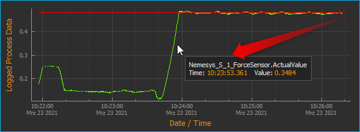
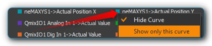
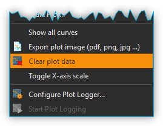

Prozessdaten-Diagramm
=====================

Einführung
----------

Neben der Datenaufzeichnung in CSV-Dateien können Sie mit dem
Datalogger-Plugin Prozessdaten in Diagrammen aufzeichnen und damit in
Echtzeit die zeitliche Veränderung dieser Prozessdaten grafisch
visualisieren. Zur Anzeige der Prozessdaten-Diagramme klicken Sie in der
Seitenleiste auf die Schaltfläche :guilabel:`Logging` :guinum:`❶` (siehe Abbildung unten)
oder blenden den Logging View über das Hauptmenü ein (::menuselection:`Window --> ShowView --> Logging`) 
:guinum:`❷`.

.. image:: Pictures/10000201000002AB000001ABF50BD6283D944D83.png

In der Abbildung oben sehen Sie die wichtigsten
Bedienelemente:

.. rst-class:: guinums

1. **Logging-Schaltfläche** – Hiermit blenden Sie das
   Prozessdaten-Diagramm ein.
2. **View Menü** - damit kann das Prozessdaten Diagramm ebenfalls ein-
   und ausgeblendet werden
3. **Zeichenfläche** – Hier sehen Sie die Kurven aller Prozessdaten die
   von dem Diagramm aufgezeichnet werden.
4. **Legende** – Die Legende enthält die Bezeichnung aller Kurven die im
   Diagramm aufgezeichnet werden mit der entsprechenden Farbe. Über die
   Legende können Kurven selektiv ein- / und ausgeblendet werden.
5. **Werkzeugleiste** – Hier finden Sie Schaltflächen zur Konfiguration
   der Datenaufzeichnung, zum Starten und Stoppen der Aufzeichnung und
   zur Navigation innerhalb der Darstellung.

Werkzeugleiste
--------------

+-----------+---------------------------------------------------------+
| |image32| | Öffnet den Konfigurationsdialog zur Konfiguration des   |
|           | grafischen Prozessdatenloggers                          |
+-----------+---------------------------------------------------------+
| |image33| | Startet / stoppt die Aufzeichnung von Prozessdaten      |
+-----------+---------------------------------------------------------+
| |image34| | Handwerkzeug zum Verschieben des aktuellen Ausschnitts  |
|           | der im Diagramm angezeigt wird                          |
+-----------+---------------------------------------------------------+
| |image35| | Vergrößerungsrahmen aufziehen zum gezielten Vergrößern  |
|           | bestimmter Bereiche                                     |
+-----------+---------------------------------------------------------+
| |image36| | Passt die Skalierung der X-Achse so an, dass alle       |
|           | Messwerte auf den Bildschirm passen                     |
+-----------+---------------------------------------------------------+
| |image37| | Passt die Skalierung der Y-Achse so an, dass alle       |
|           | Messwerte auf den Bildschirm passen                     |
+-----------+---------------------------------------------------------+
| |image38| | Passt die Skalierung der X-Achse und Y-Achse so an,     |
|           | dass alle Messwerte auf den Bildschirm passen           |
+-----------+---------------------------------------------------------+
| |image39| | Aktiviert die automatische Skalierung – solange         |
|           | Messewerte aufgezeichnet werden, wird die Skalierung    |
|           | der X- und Y-Achse automatisch so angepasst, dass alle  |
|           | Messwerte auf den Bildschirm passen.                    |
+-----------+---------------------------------------------------------+
| |image40| | Alle Kurven anzeigen. Wenn Kurven ausgeblendet sind,    |
|           | werden diese wieder eingeblendet.                       |
+-----------+---------------------------------------------------------+
| |image41| | Löscht alle Daten aus dem Diagramm                      |
+-----------+---------------------------------------------------------+
| |image42| | Skalierung umschalten. Damit schalten Sie die           |
|           | Skalierung der X-Achse zwischen absolutem               |
|           | Zeit-/Datumsstempel und relativer Zeit in Sekunden und  |
|           | Millisekunden seit Start der Aufzeichnung um.           |
+-----------+---------------------------------------------------------+
| |image43| | Exportiert ein Bild des der aktuell dargestellten       |
|           | Ausschnitts                                             |
+-----------+---------------------------------------------------------+
| |image44| | Exportiert alle Daten des Plots als CSV-Datei           |
+-----------+---------------------------------------------------------+
| |image45| | Speichert die Plotdaten in eine Datei, die später       |
|           | wieder geladen werden kann                              |
+-----------+---------------------------------------------------------+
| |image46| | Lädt Plotdaten, die vorher gespeichert wurden.          |
+-----------+---------------------------------------------------------+

Konfigurationsdialog
--------------------

Übersicht Konfigurationsdialog
~~~~~~~~~~~~~~~~~~~~~~~~~~~~~~

.. image:: Pictures/10002F2F000034EB000034EBDBA40A7FF6EF8292.svg
   :width: 60
   :height: 60
   :align: left

Klicken Sie in der Werkzeugleiste auf die Schaltfläche
:guilabel:`Configure process data graph`, um den Konfigurationsdialog (unten) zu
öffnen. Der Konfigurationsdialog besteht im Wesentlichen aus den folgenden
Bereichen:

.. image:: Pictures/10000201000002CE00000188B83774EAD7E16B4A.png
   :alt: Konfigurationsdialog grafischer Datenlogger

.. rst-class:: guinums

1. **Geräteliste (Device List)** – die Geräteliste enthält alle Geräte
   von denen Prozessdaten aufgezeichnet werden können. Mit der
   Filterauswahl über der Geräteliste, können Sie diese nach einem
   bestimmten Gerätetyp (z.B. Ventile) filtern.
2. **Plot Curves** – hier sehen Sie in tabellarischer Form alle Kurven
   die vom Diagramm aufgezeichnet werden.
3. **Logger Configuration** – in diesem Bereich können Sie verschiedene
   Einstellungen zur Aufzeichnung der Daten konfigurieren.

Übersicht Tabelle Diagrammkurven
~~~~~~~~~~~~~~~~~~~~~~~~~~~~~~~~

.. image:: Pictures/100002010000028A000000981427A41273C77599.png

Die Tabelle *Plot Curves* zeigt in tabellarischer Form die
Konfiguration des grafischen Loggers. Jede Zeile in der Tabelle
entspricht genau einer Kurve in der grafischen Darstellung. Folgende
Spalten sind vorhanden:

-  **Channel** – zeigt die Kanalnummer des entsprechenden Kanals
-  **Device** – enthält den Gerätenamen des Gerätes, von dem ein
   bestimmter Gerätewert aufgezeichnet werden soll und das Geräteicon
-  **Property** – dies ist der Name der Geräteeigenschaft / des
   Prozessdatenwertes, der aufgezeichnet wird. Den Typ der
   Geräteeigenschaft (numerischer oder boolescher Wert) können Sie an
   dem Typ-Icon einfach erkennen.

   ========= ================
   |image49| Numerischer Wert
   |image50| Boolescher Wert
   |image51| Text
   ========= ================

-  **Label** – hier können Sie eine eigene Bezeichnung des Kanals
   festlegen. Diese Bezeichnung erscheint dann in der Legende des
   Graphen.

Zum Hinzufügen eines Prozessdatenkanals zum Logger, führen Sie einfach
folgende Schritte durch.

Datenaufzeichnung konfigurieren
--------------------------------

:step:`Schritt 1 - Kanäle hinzufügen`

.. image:: Pictures/1000020100000361000001BF969DF3B35F4C3EBA.png
   :alt: Diagrammkurven via Drag & Drop hinzufügen

Um einen Kanal hinzuzufügen, müssen Sie zunächst das entsprechende Gerät in die 
*Geräteliste* der *Plot Logger Konfiguration* aufnehmen. 
Verschieben Sie dazu das entsprechende Element aus der Geräteliste per Drag-&-Drop 
(Ziehen und Ablegen) in die Tabelle :guilabel:`Plot Curves`. 
Der neue Kanal wird an der Stelle hinzugefügt, an der Sie die Maustaste loslassen 
(siehe Abbildung unten).

.. admonition:: Tipp
   :class: tip

   Um die Geräteauswahl zu erleichtern, können   
   Sie die Geräteliste nach Gerätetyp filtern. 
   

:step:`Schritt 2 - Geräteeigenschaft auswählen`

Wählen Sie nun im Bereich der Diagrammkurven :guilabel:`Plot Curves` die
Geräteeigenschaft :guilabel:`Property` aus, die Sie aufzeichnen möchten. Klicken
Sie dafür doppelt in die :guilabel:`Property`-Spalte des Gerätes, welches Sie
konfigurieren möchten. Nach dem Doppelklick wird Ihnen ein Auswahlfeld
angezeigt, aus dem Sie die Geräteeigenschaft auswählen können (siehe
Abbildung unten).

.. image:: Pictures/1000020100000361000001A36B73334ECCAE6878.png
   :alt: Geräteeigenschaft zum Aufzeichnen auswählen

:step:`Schritt 3 – Kanalbeschriftung festlegen`

In der Spalte :guilabel:`Label` können Sie für jeden Kanal eine eigene
Beschriftung vergeben. Diese Beschriftung wird später dann in der
Legende des Graphen als Beschriftung der Kurve angezeigt. Klicken Sie zum Ändern der
Beschriftung doppelt in die Tabellenzelle (siehe Abbildung oben) und
geben Sie dann die neue Bezeichnung ein.

.. image:: Pictures/1000020100000267000000901D707E009D7DE34A.png
   :alt: Kanalbeschriftung ändern

.. admonition:: Wichtig
   :class: note

   Bei der Auswahl einer anderen              
   Geräteeigenschaft wird automatisch eine neue            
   Kanalbezeichnung vergeben. D.h. Sie sollten die         
   Kanalbezeichnung erst nach der Auswahl der              
   Geräteeigenschaft festlegen.   

Kanäle löschen
~~~~~~~~~~~~~~

Um einen oder mehrere Kanäle zu löschen, markieren Sie zuerst die Kanäle
mit der Maus. Sie können dann die Kanäle löschen, indem Sie entweder die
:kbd:`Delete`-Taste drücken oder mit der rechten Maustaste das Kontextmenü
aufrufen und den Menüpunkt :menuselection:`Delete Selection` auswählen.

|image58| |image59|

Sie können alle Kanäle des Loggers gleichzeitig löschen, indem Sie im
Kontextmenü den Punkt :menuselection:`Clear Logger` auswählen.

:step:`Schritt 4 – Aufzeichnungsintervall festlegen`

.. image:: Pictures/100000000000016D00000079FAA9B0F9A29F6352.png
   :alt: Logger konfigurieren

Im Feld :guilabel:`Log Interval` können Sie im Abschnitt :guilabel:`Logger Configuration` 
das Intervall festlegen, in dem neue
Messwerte aufgezeichnet werden sollen. Sie können das Intervall mit
einer Auflösung von 0,1 Sekunden festlegen.

.. admonition:: Wichtig
   :class: note

   Wählen Sie das Intervall so groß wie       
   möglich und so klein wie nötig um die Menge der         
   aufzuzeichnenden Daten so gering wie möglich zu halten. 

Die Konfiguration wird beim Beenden der Anwendung gespeichert und beim
erneuten Start wieder geladen.

Datenaufzeichnung starten / stoppen
-----------------------------------

.. image:: Pictures/10001A4C000034EB000034EBE789A979D3788852.svg
   :width: 60
   :height: 60
   :align: left

Über die entsprechende Schaltfläche in der Werkzeugleiste
können Sie die Datenaufzeichnung starten und stoppen.

|

Diagramm Navigation und Bedienung
---------------------------------

Übersicht
~~~~~~~~~

Das Diagramm bietet Ihnen verschiedene Möglichkeiten die Darstellung
anzupassen, bestimmte Bereiche vergrößert darzustellen oder Kurven ein-
und auszublenden.

.. image:: Pictures/1000020100000304000001DECD37A2D16344540B.png
   :alt: Übersicht Prozessdatengraph

Das Diagramm besteht aus der
Zeichenfläche :guinum:`❶`, die durch die Zeitachse unten (X-Achse) :guinum:`❸` und die
Prozessdatenachse links (Y-Achse) :guinum:`❹` begrenzt wird. Die Zeitachse zeigt
Datum und Uhrzeit als absolute Werte an. Die Prozessdatenachse zeigt den
Messwert zu einem bestimmten Zeitpunkt an. Die Messwertachse ist
einheitenlos und stellt unterschiedlichste Werte und Einheiten dar.

Wenn Sie mit der rechten Maustaste in die Zeichenfläche klicken, wird
ein Kontextmenü :guinum:`❷` mit zusätzlichen Funktionen angezeigt.

Ausschnitt verschieben
~~~~~~~~~~~~~~~~~~~~~~

.. image:: Pictures/100005C7000035050000350518807CBDF5FF2BAE.svg
   :width: 60
   :height: 60
   :align: left

Mit dem Verschiebewerkzeug (*Pan Tool*) können Sie bequem den
Ausschnitt verschieben, der im Diagramm angezeigt wird. Aktivieren Sie
das Werkzeug durch anklicken der Schaltfläche. Klicken Sie nun in die
Zeichenfläche und bewegen Sie die Maus mit gedrückter Maustaste um den
Ausschnitt zu verschieben.

.. admonition:: Wichtig
   :class: note

   Das Verschieben des Ausschnittes bewirkt   
   eine Deaktivierung der automatischen Skalierung.     

Werte einer Kurve anzeigen
~~~~~~~~~~~~~~~~~~~~~~~~~~

Wenn das Verschiebewerkzeug (*Pan Tool*) aktiv ist, können Sie den
Mauszeiger über eine Kurve bewegen, um sich den Wert an der betreffenden
Position anzeigen zu lassen.

Vergrößerung mit Mausrad einstellen
~~~~~~~~~~~~~~~~~~~~~~~~~~~~~~~~~~~~~~~~

Durch drehen des Mausrades können Sie die Vergrößerung der Anzeige
erhöhen (hinein zoomen) oder verringern (heraus zoomen).

========= ==============================================
|image68| Vergrößerungsfaktor erhöhen (hinein zoomen)
|image69| Vergrößerungsfaktor verringern (heraus zoomen)
========= ==============================================

Ausschnittvergrößerung mit Vergrößerungsrahmen wählen
~~~~~~~~~~~~~~~~~~~~~~~~~~~~~~~~~~~~~~~~~~~~~~~~~~~~~

.. image:: Pictures/1000100A000034EB000034EBFC7CEEC6D6B20A4B.svg
   :width: 60
   :height: 60
   :align: left 

Mit dem Vergrößerungswerkzeug (*Zoom Tool*) können Sie
gezielt einen Ausschnitt auswählen, den Sie vergrößert darstellen
möchten. Gehen Sie dafür wie folgt vor (siehe Abbildung unten):

|

.. image:: Pictures/10000000000001FA0000015E46DAC1CBDA6E2854.png
   :alt: Vergrößerungsrahmen aufziehen

.. rst-class:: guinums

1. Klicken Sie mit der linken Maustaste in die Zeichenfläche um die
   erste Ecke des Vergrößerungsrahmens festzulegen.
2. Ziehen Sie nun mit gedrückter Maustaste ein Vergrößerungsrahmen auf
   die gewünschte Größe.
3. Sobald Sie die Maustaste loslassen, wird der gewählte Ausschnitt auf
   die aktuelle Größe der Anzeige skaliert.

Anzeige passend / automatisch skalieren
~~~~~~~~~~~~~~~~~~~~~~~~~~~~~~~~~~~~~~~~~

Die Werkzeugleiste und das Kontextmenü enthalten verschiedene Tools um
die Anzeige automatisch so anzupassen, dass alle Daten im sichtbaren
Bereich liegen.

Folgende Möglichkeiten der Anpassung sind vorhanden:

+-----------+---------------------------------------------------------+
| |image79| | Passt die Skalierung der X-Achse so an, dass alle       |
|           | Messwerte auf den Bildschirm passen                     |
+-----------+---------------------------------------------------------+
| |image80| | Passt die Skalierung der Y-Achse so an, dass alle       |
|           | Messwerte auf den Bildschirm passen                     |
+-----------+---------------------------------------------------------+
| |image81| | Passt die Skalierung der X-Achse und Y-Achse so an,     |
|           | dass alle Messwerte auf den Bildschirm passen           |
+-----------+---------------------------------------------------------+
| |image82| | Aktiviert die automatische Skalierung – solange         |
|           | Messewerte aufgezeichnet werden, wird die Skalierung    |
|           | der X- und Y-Achse automatisch so angepasst, dass alle  |
|           | Messwerte auf den Bildschirm passen.                    |
+-----------+---------------------------------------------------------+

Die automatische Skalierung können Sie auch über das Kontextmenü
getrennt für X- und Y-Achse aktivieren:

.. image:: Pictures/1000000000000109000001040CF9729CD97C9A4D.png
   :alt: Automatische Skalierung für X- und Y-Achse

.. admonition:: Wichtig
   :class: note

   Die Änderung der Vergrößerung oder das     
   Verschieben des Ausschnittes bewirken eine              
   Deaktivierung der automatischen Skalierung.   

Kurven ein- und ausblenden
~~~~~~~~~~~~~~~~~~~~~~~~~~

Um die Skalierung und damit die Anzeige einzelner Kurven zu verbessern,
können Sie Kurven ein- und ausblenden. Klicken Sie dazu mit der rechten Maustaste 
auf das gewünschte Element in der Diagrammlegende und wählen Sie die gewünschte 
Funktion, um entweder nur die entsprechende Kurve auszublenden :menuselection:`Hide Curve` 
oder alle anderen außer der entsprechenden Kurve :menuselection:`Show only this curve`, 
wie in der Abbildung unten dargestellt.

Wenn Sie alle ausgeblendeten Kurven wieder einblenden möchten,
aktivieren Sie in der Zeichenfläche das Kontextmenü mit der rechten
Maustaste und wählen Sie dann den Menüpunkt :menuselection:`Show all curves` (siehe
Abbildung unten).

.. image:: Pictures/1000000000000109000001041C877E8A24D5AB94.png

Kurvenfarbe ändern
~~~~~~~~~~~~~~~~~~~~~~~~~~~~~

Um eine andere Kurvenfarbe zu wählen, klicken Sie mit der rechten
Maustaste auf einen Eintrag in der Legende. Es wird nun das Kontextmenü
für diesen Legendeneintrag angezeigt (siehe Abbildung unten).

.. image:: Pictures/10000000000002100000007CF77B5C49CD7E0D88.png
   :alt: Kontextmenü Legendeneintrag - Farbwahl

Wählen Sie den
Menüpunkt :menuselection:`Select Color`. Es wird Ihnen nun ein Farbauswahldialog
angezeigt, in dem Sie eine beliebige Kurvenfarbe auswählen können.

.. image:: Pictures/100002010000020A000001B855540FDC883B53CF.png

Diagramm-Bild exportieren
~~~~~~~~~~~~~~~~~~~~~~~~~~~~~~~~~~~~~~~~~~~~~~~~~~~~~~~~~~~~

.. image:: Pictures/10001855000034EB000034EBA6C6DA993124AA4C.svg
   :width: 60
   :height: 60
   :align: left

Über den Menüeintrag :menuselection:`Export plot image` im Kontextmenü
können Sie ein Bild des aktuellen Diagramms exportieren.

|

.. image:: Pictures/100002010000010C000000E1260A96B6F1A86108.png
   :alt: Diagramm-Bild exportieren

In dem Dateidialog der nun
eingeblendet wird (siehe Abbildung unten), wählen Sie zuerst ihr
Zielverzeichnis aus.

.. image:: Pictures/1000000000000293000001D6F3848773F9BE9543.png

Anschließend geben Sie
den Dateinamen der Bilddatei ein :guinum:`❶`. Dann wählen Sie in dem Auswahlfeld
den Dateityp :guinum:`❷` der Bilddatei aus. Die Exportfunktion unterstützt sowohl
Bilddateien (:file:`png, jpg...`) als auch skalierbare Vektorgrafiken 
(:file:`pdf, svg...`). Wählen Sie das für Sie passende Bildformat aus.

Klicken Sie zum Abschluss auf :guilabel:`Save` :guinum:`❸`, um den Export zu starten.

CSV Export
~~~~~~~~~~

Über den Menüeintrag :menuselection:`Export CSV file` im Kontextmenü können
Sie alle Diagrammdaten in eine CSV-Datei exportieren.

|

Diagrammdaten löschen
~~~~~~~~~~~~~~~~~~~~~

.. image:: Pictures/100019CB000035050000350509AD2B23340F765E.svg
   :width: 60
   :height: 60
   :align: left

Klicken Sie im Kontextmenü auf den Eintrag :menuselection:`Clear plot data` 
um alle aufgezeichneten Daten zu löschen und mit einem leeren
Diagramm die Aufzeichnung neu zu beginnen.

Skalierung der X-Achse umschalten
~~~~~~~~~~~~~~~~~~~~~~~~~~~~~~~~~

.. image:: Pictures/100018130000350500003505CADD59D81E3150FD.svg
   :width: 60
   :height: 60
   :align: left

Sie können die Skalierung der X-Achse zwischen zwei
verschiedenen Modi umschalten. Standardmäßig zeigt die X-Achse einen
absoluten Zeit- / Datumsstempel an.

|

.. image:: Pictures/100002010000022B0000006E35B772A9B9B293D2.png

Sie können die X-Achse aber auch auf die Anzeige der relativen Zeit in
Sekunden und Millisekunden umschalten. D.h. der Zeitpunkt t\ :sub:`0`
markiert hier den Zeitpunkt an dem die Aufzeichnung gestartet wurde .

.. image:: Pictures/100002010000022B000000660DDD07486701950A.png

Um die Achse umzuschalten, klicken Sie mit der rechten Maustaste in das
Diagramm und wählen Sie dann aus dem Kontextmenü den Punkt 
:menuselection:`Toggle X-axis scale`.

.. image:: Pictures/100002010000010D000000C7FB8978837EA08B41.png

Plodaten speichern
~~~~~~~~~~~~~~~~~~

.. image:: Pictures/1000040D000035050000350542F550057A626C6D.svg
   :width: 60
   :height: 60
   :align: left

Wenn Sie die Schaltfläche :guilabel:`Save Plot Data` anklicken, werden
alle Plotdaten in eine Datei gespeichert (:file:`*.dat`), die später wieder
in den Plot geladen werden kann.

Plodaten laden
~~~~~~~~~~~~~~

.. image:: Pictures/1000044C000035050000350571A7475A9B633EF8.svg
   :width: 60
   :height: 60
   :align: left

Durch Klicken der Schaltfläche :guilabel:`Load Plot Data` können
Plotdaten, die vorher mit :guilabel:`Save Plot Data` gespeichert wurden wieder in
den Plot geladen werden. Es werden nur die Kurven geladen, die in der
aktuellen Konfiguration des Loggers vorhanden sind. D.h. wenn Sie Daten
aufzeichnen, diese mittels *Save Plot Data* speichern und später
wieder Laden, sollte die Loggerkonfiguration beim Speichern und Laden
identisch sein. Wenn Sie zwischen Speichern und Laden die
Logger-Konfiguration ändern, z.B. Kanäle entfernen, werden ggf. nicht
alle Kurven geladen.

Script Funktionen
-----------------

.. image:: Pictures/10000201000001330000006F1CA99CCDC5308AD8.png
   :alt: Logger Script Funktionen

Der grafische Logger kann über das QmixElements Scriptsystem gestartet
und gestoppt werden, um die Aufnahme von Daten zu automatisieren oder
mit anderen Prozessen zu synchronisieren. Die entsprechenden Funktionen
finden Sie in der :guilabel:`Logging` Kategorie der verfügbaren Scriptfunktionen.

Funktion Start Plot Logger
~~~~~~~~~~~~~~~~~~~~~~~~~~~~~

.. image:: Pictures/10001A4C000034EB000034EBE789A979D3788852.svg
   :width: 60
   :height: 60
   :align: left

Mit dieser Funktion starten Sie den grafischen Logger mit den
aktuell konfigurierten Einstellungen und Kanälen. Der Inhalt des
Diagramms wird dabei nicht gelöscht.

|

.. image:: Pictures/100002010000019E00000070391F13307E263DEB.png

Setzen Sie einen Haken bei :guilabel:`Clear Plot before the start of logging` 
wenn Sie alle Plotdaten vor der Aufzeichnung löschen möchten.

Funktion Stop Plot Logger
~~~~~~~~~~~~~~~~~~~~~~~~~

.. image:: Pictures/100019EB000034EB000034EBA805BBEA9A6F9422.svg
   :width: 60
   :height: 60
   :align: left

Diese Funktion stoppt die Aufzeichnung der Daten in das
Prozessdaten Diagramm.

|

Funktion Export Plot Data
~~~~~~~~~~~~~~~~~~~~~~~~~

.. image:: Pictures/10001130000035050000350554D46258E4776750.svg
   :width: 60
   :height: 60
   :align: left

Diese Funktion ermöglicht den Export der Diagrammdaten in
unterschiedliche Formate. Im Konfigurationsbereich können Sie den
Dateinamen und den Speicherort wählen, indem Sie auf das Ordner Symbol :guinum:`❶`
klicken. Beim Speicherort sollten Sie den vorgegebenen Speicherort
innerhalb des Projektordners behalten.

.. image:: Pictures/10000201000001C9000000DDA39DA50FAC824913.png

Im Bereich :guilabel:`Export Formats` :guinum:`❷` wählen Sie alle Formate aus, in denen die
Plot-Daten exportiert werden sollen. Die Software speichert die Dateien
mit dem gewählten Dateinamen + Zeitstempel + der Dateiendung des
Exportformats (siehe Beispiel in Abbildung unten):

.. image:: Pictures/100002010000016F000000BF0B98C28E08049AED.png

.. |image32| image:: Pictures/10002F2F000034EB000034EBDBA40A7FF6EF8292.svg
   :width: 40
.. |image33| image:: Pictures/10001A4C000034EB000034EBE789A979D3788852.svg
   :width: 40
.. |image34| image:: Pictures/100005C7000035050000350518807CBDF5FF2BAE.svg
   :width: 40
.. |image35| image:: Pictures/1000100A000034EB000034EBFC7CEEC6D6B20A4B.svg
   :width: 40
.. |image36| image:: Pictures/10000AAD0000350500003505B065E97D3266EBF3.svg
   :width: 40
.. |image37| image:: Pictures/10000AA70000350500003505B68BB28A6EC24106.svg
   :width: 40
.. |image38| image:: Pictures/10000D410000350500003505737D2F8FEABFA448.svg
   :width: 40
.. |image39| image:: Pictures/10001744000034EB000034EBD90F77816321BB6E.svg
   :width: 40

.. |image41| image:: Pictures/100019CB000035050000350509AD2B23340F765E.svg
   :width: 40
.. |image42| image:: Pictures/100018130000350500003505CADD59D81E3150FD.svg
   :width: 40
.. |image43| image:: Pictures/10001855000034EB000034EBA6C6DA993124AA4C.svg
   :width: 40

.. |image45| image:: Pictures/1000040D000035050000350542F550057A626C6D.svg
   :width: 40
.. |image46| image:: Pictures/1000044C000035050000350571A7475A9B633EF8.svg
   :width: 40

.. |image49| image:: Pictures/100004EA000035050000350581CFD983D12D425F.svg
   :width: 40
.. |image50| image:: Pictures/1000034B000035050000350585C9BEED447C4FB8.svg
   :width: 40
.. |image51| image:: Pictures/10000B740000350500003505221106A05ED7DC85.svg
   :width: 40

.. |image58| image:: Pictures/100000000000012100000091DA9FF37806721579.png
.. |image59| image:: Pictures/10000000000001220000008F22C1F8D0316FE153.png

.. |image68| image:: Pictures/Mouse_Wheel_up.png
   :width: 80
.. |image69| image:: Pictures/Mouse_Wheel_down.png
   :width: 80

.. |image79| image:: Pictures/10000AAD0000350500003505B065E97D3266EBF3.svg
   :width: 40
.. |image80| image:: Pictures/10000AA70000350500003505B68BB28A6EC24106.svg
   :width: 40
.. |image81| image:: Pictures/10000D410000350500003505737D2F8FEABFA448.svg
   :width: 40
.. |image82| image:: Pictures/10001744000034EB000034EBD90F77816321BB6E.svg
   :width: 40

