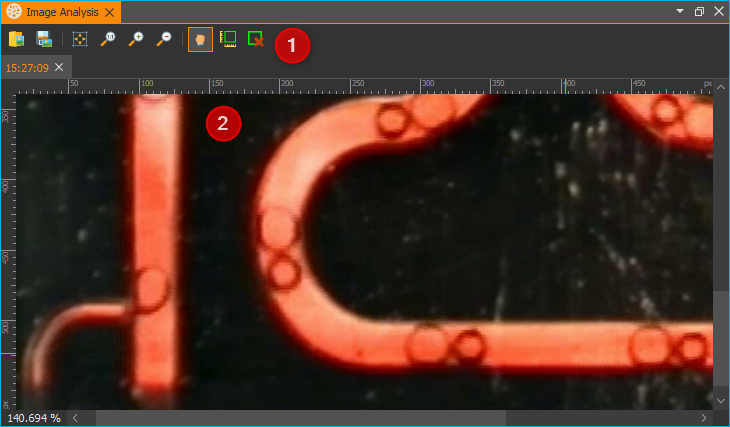
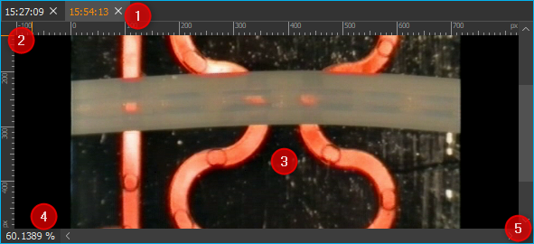
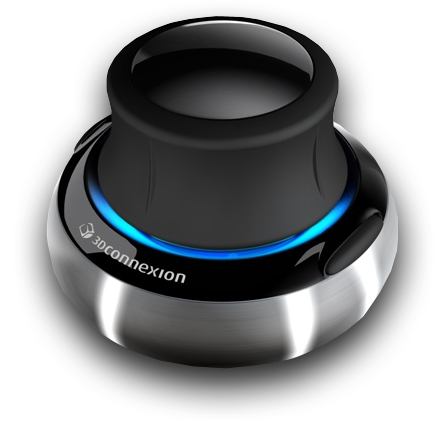
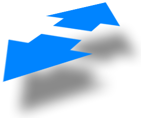

Bildbetrachter / Bildanalyse Plugin
===================================

Einführung
----------

Dieses Plugin ermöglicht es Ihnen, Bilder unterschiedlicher Formate
(PNG, JPG) zu öffnen und zu speichern. Zusätzlich können Sie damit:

-  die Bilder stufenlos Vergrößern und Verkleinern
-  bequem im Bild navigieren
-  Größen von Objekten im Bild messen

Den  :ref:`View <Views (Ansichten)>` des
Bildanalyse Plugins können Sie über den Menüpunkt :menuselection:`Window --> Show View --> Image Analysis` 
in der Seitenleiste aufrufen. Wenn noch kein Bild geladen wurde, ist der
Arbeitsbereich noch leer.
Die Oberfläche des Plugins besteht aus der `Werkzeugleiste`_ :guinum:`❶` und dem
eigentlichen `Bildbetrachter`_ :guinum:`❷`.

Werkzeugleiste
--------------

+-----------+---------------------------------------------------------+
| |image19| | Bilddatei öffnen                                        |
+-----------+---------------------------------------------------------+
| |image20| | aktuell angezeigte Bilddatei speichern                  |
+-----------+---------------------------------------------------------+
| |image21| | Ändert die Vergrößerung des Bildes so, dass es          |
|           | vollständig in den Bildbetrachter passt                 |
+-----------+---------------------------------------------------------+
| |image22| | Ändert die Vergrößerung des Bildes auf die tatsächliche |
|           | Pixelgröße                                              |
+-----------+---------------------------------------------------------+
| |image23| | Erhöht den Vergrößerungsfaktor                          |
+-----------+---------------------------------------------------------+
| |image24| | Verringert den Vergrößerungsfaktor                      |
+-----------+---------------------------------------------------------+
| |image25| | Handwerkzeuge zum Verschieben des aktuellen             |
|           | Bildausschnittes                                        |
+-----------+---------------------------------------------------------+
| |image26| | Messrechteck zeichnen                                   |
+-----------+---------------------------------------------------------+
| |image27| | Alle Messobjekte entfernen                              |
+-----------+---------------------------------------------------------+

.. admonition:: Tipp
   :class: tip

   Sie können Bilder auch einfach per Drag &     
   Drop (Ziehen und Ablegen) laden. Ziehen Sie dafür       
   einfach eine Bild-Datei aus Ihrem Dateisystem auf den   
   Bildanalyse-Arbeitsbereich. 

Bildbetrachter
--------------

Übersicht
~~~~~~~~~

Der eigentliche Bildbetrachter besteht aus den folgenden Komponenten:

.. rst-class:: guinums

1. Karteireiter zur Auswahl des aktuellen Bildes (bei mehreren
   geöffneten Bilddateien)
2. Lineale zur Anzeige der Bildabmessungen
3. Leinwand zur Bilddarstellung
4. Statuszeile zur Anzeige der Vergrößerung (100% entspricht der
   tatsächlichen Bildgröße)
5. Scrollbalken zur Bildnavigation.

Immer wenn Sie ein Bild öffnen, z.B. wenn Sie eine Bilddatei laden oder
mit der Kamera ein Bild aufnehmen, wir ein neuer Karteireiter
hinzugefügt mit dem Namen des Bildes. Durch das Auswählen eines
Karteireiters, können Sie zwischen den verschiedenen geöffneten Dateien
wechseln.

Um einen Karteireiter zu schließen, klicken Sie mit der linken Maustaste
die Schließen-Schaltfläche des betreffenden Karteireiters (siehe
Abbildung unten) an.

.. image:: Pictures/10000201000001220000005C1545D1D1.png
   :alt: Karteireiter schließen

Wenn Sie mit der rechten
Maustaste in den Bildbetrachter klicken, wird Ihnen ein Kontextmenü
angezeigt, in dem Sie wichtige Funktionen aus der Werkzeugleiste
wiederfinden und so ggf. schneller im Zugriff haben.

Maßeinheiten auswählen
~~~~~~~~~~~~~~~~~~~~~~~~

Sie können die Maßeinheit auswählen, die in den Linealen und beim Messen
von Bildobjekten verwendet wird. Klicken Sie dafür mit der rechten
Maustaste auf ein Lineal und wählen Sie dann die Maßeinheit (siehe
Abbildung).

.. image:: Pictures/1000020100000193000000A1DB1AAD46.png
   :alt: Maßeinheiten auswählen

Vergrößerung ändern
~~~~~~~~~~~~~~~~~~~

Verwenden Sie zur Einstellung der Vergrößerung die Schaltflächen aus der
Werkzeugleiste. Alternativ können Sie die Vergrößerung auch bequem durch
Drehen des Mausrades verändern.

========= ========= ==============================================
|image32| |image23| Vergrößerungsfaktor erhöhen (hineinzoomen)
|image33| |image24| Vergrößerungsfaktor verringern (heraus zoomen)
========= ========= ==============================================

Bildnavigation
--------------

Navigation mit Scrollbalken
~~~~~~~~~~~~~~~~~~~~~~~~~~~

Wenn Sie die Vergrößerung des Bildes stark erhöhen, kann das Bild nicht
mehr vollständig in der Anzeige dargestellt werden. In diesem Fall,
werden am rechten und unteren Rand der Anzeige Scrollbalken
eingeblendet, mit denen Sie die Panoramadarstellung in der Anzeige
verschieben können.

Navigation mit Hand-Werkzeug
~~~~~~~~~~~~~~~~~~~~~~~~~~~~

.. image:: Pictures/pan_hand.svg
   :width: 60
   :align: left

Aktivieren Sie das Werkzeug *Pan Tool* um die
Panoramadarstellung in der Anzeige zu verschieben.
Klicken Sie zum Verschieben nun einfach in die Bildanzeige und halten
Sie die linke Maustaste gerückt, während Sie die Maus bewegen. Der
aktuelle Bildausschnitt folgt nun den Bewegungen der Maus.

|

Navigation mit der Maus
~~~~~~~~~~~~~~~~~~~~~~~

Sie können auch die Maus verwenden, um interaktiv im Panorama zu
navigieren. Gehen Sie dafür wie folgt vor:

.. rst-class:: steps

#. Klicken Sie mit der mittleren Maustaste in die Panoramadarstellung
   
   .. image:: Pictures/10000000000001EC000002E9F2BF7149.png
       :width: 80

#. Es wird nun ein Navigationskreuz eingeblendet und die
   freie Navigation wird aktiviert

   .. image:: Pictures/1000020100000189000000B918EE2BA8.png

#. Sie können nun durch verschieben der Maus den aktuell
   sichtbaren Ausschnitt in der Panoramadarstellung verschieben. Je
   weiter Sie den Mauszeiger von dem eingeblendeten Navigationskreuz
   weg bewegen, um so schneller wird der Bildausschnitt verschoben
   verschoben.

   .. image:: Pictures/10000000000002BB000003B0D14AEFFC.png
      :width: 100

Navigation mit dem Space Navigator
~~~~~~~~~~~~~~~~~~~~~~~~~~~~~~~~~~~

Wenn das *Space Navigator* Plugin geladen wurde, können Sie auch
alternativ mit dem Space Navigator in der Abbildung navigieren.

Der `Space Navigator <https://3dconnexion.com/us/product/spacemouse-compact/>`_ 
ist ein intuitives Eingabegerät welches
Ihnen die Navigation innerhalb des Bildbetrachters in X- und Y-Richtung
gleichzeitig ermöglicht.
Um den Space Navigator zu nutzen, schließen ihn an einen freien USB
Anschluss an Ihren PC an. Aktuelle Treiber finden Sie auf unserer Internetseite:

https://cetoni.de/software-downloads/

oder auf dem Datenträger (CD oder USB-Stick), den Sie beim Kauf der Software 
erhalten haben. Installieren Sie den Treiber, um die SpaceMouse zu verwenden.
Positionieren Sie den Space Navigator so, dass das Verbindungskabel von
Ihnen weg zeigt und der 3D Connexion Schriftzug von Ihnen aus lesbar
ist.

.. image:: Pictures/1000000000000500000002D03030564E.png
   :alt: Aufstellung Space Navigator

Um die digitale Vergrößerung
des aktuellen Bildes zu ändern, drücken Sie das Steuerelement des
Navigators nach unten oder ziehen Sie es nach oben (Abbildung unten).

..  image:: Pictures/1000000000000117000001F4986AD712.png
   :alt: Digitale Vergrößerung mit dem Space Navigator ändern

Um den im Bildbetrachtungsfeld angezeigten Bildausschnitt anzupassen, drehen Sie 
den Navigationsknopf des Space Navigators in die gewünschte Richtung.

Die Geschwindigkeit, mit der der Bildausschnitt verschoben oder die
Vergrößerung geändert wird, kontrollieren Sie durch die Stärke der
Auslenkung des Bedienteils. D.h. je stärker Sie das Bedienelement in
eine bestimmte Richtung drücken oder drehen, umso schneller bewegt sich
die „virtuelle Kamera“.

========= ==============================================
|image39| Bildausschnitt nach links / rechts verschieben
|image40| Bildausschnitt nach oben / unten verschieben
|image41| Digitale Vergrößerung erhöhen / verringern
========= ==============================================

Bildobjekte messen
------------------

Maßrechteck zeichnen
~~~~~~~~~~~~~~~~~~~~

.. admonition:: Tipp
   :class: note

   Stellen Sie vor dem Zeichnen des              
   Maßrechteckes die gewünschte Maßeinheit ein um die      
   Maßangaben in dieser Einheit zu erhalten.  

Sie können wie folgt ein Maßrechteck zeichnen:

.. rst-class:: steps

#. Klicken Sie auf die Schaltfläche *Measure Rectangle* in
   der Werkzeugleiste um das Maßwerkzeug zu aktivieren.

   .. image:: Pictures/measure_rect.svg
      :width: 60

#. Klicken Sie mit der linken Maustaste in den Bildbetrachter an die
   Stelle der linken oberen Ecke des Maßrechteckes :guinum:`❶`.

   .. image:: Pictures/100002010000020E000000CCEAC7AB0F.png

#. Ziehen Sie nun bei gedrückter linker Maustaste das Rechteck auf die
   gewünschte Größe und lassen Sie dann die Maustaste los :guinum:`❷`.

Maßrechteck verschieben
~~~~~~~~~~~~~~~~~~~~~~~~~~~

Zum Verschieben eines Maßrechteckes bewegen Sie einfach die Maus über
das Rechteck bis der Mauszeiger sich in ein Pfeilkreuz verwandelt :guinum:`❶`.
Drücken Sie dann die linke Maustaste und ziehen Sie das Maßrechteck mit
gedrückter Maustaste an seine neue Position :guinum:`❷` und lassen Sie die
Maustaste dann dort los.

Größe des Maßrechteckes anpassen
~~~~~~~~~~~~~~~~~~~~~~~~~~~~~~~~~~~

.. image:: Pictures/1000020100000203000000BA99B95279.png
   :alt: Größe des Maßrechteckes anpassen

Um die Größe des Maßrechteckes zu ändern, klicken Sie einfach auf eine
der Markierungen auf den Ecken und Seiten des Maßrechteckes (Abbildung
unten). Sobald der Mauszeiger seine Form ändert :guinum:`❶`, können Sie die
ausgewählte Seite oder Ecke durch Drücken der linken Maustaste und
ziehen der Maus verschieben.

Maßrechteck löschen
~~~~~~~~~~~~~~~~~~~~

Sie können ein einzelnes Maßrechteck löschen, indem Sie es durch
Anklicken auswählen und dann die :kbd:`Delete`-Taste drücken.

.. image:: Pictures/measure_items_clear.svg
   :width: 60
   :align: left

Wenn Sie die Schaltfläche :guilabel:`Delete measuring lines` in der
Werkzeugleiste oder im Kontextmenü anklicken, können Sie alle Maßlinien
aus dem aktuellen Bild entfernen.

.. |image19| image:: Pictures/open_image2.svg
   :width: 60
.. |image20| image:: Pictures/save_image.svg
   :width: 60
.. |image21| image:: Pictures/fit_to_size.svg
   :width: 60

.. |image23| image:: Pictures/zoom_in.svg
   :width: 60
.. |image24| image:: Pictures/zoom_out.svg
   :width: 60
.. |image25| image:: Pictures/pan_hand.svg
   :width: 60

.. |image27| image:: Pictures/measure_items_clear.svg
   :width: 60

.. |image32| image:: Pictures/10000000000001EC000002E98AB54170.png
   :width: 80
.. |image33| image:: Pictures/10000000000001EC000002E9389967B0.png
   :width: 80

.. |image39| image:: Pictures/10000000000000C40000008BD9BAE182.png
   :width: 80

.. |image41| image:: Pictures/100000000000009D000000DF60858E32.png
   :width: 60