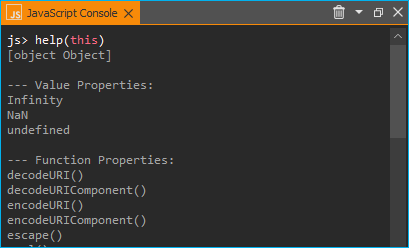

Verwendung von JavaScript
==================================================

JavaScript-Unterstützung in CETONI-Elementen
-----------------------------------------------------

.. admonition:: Achtung
   :class: caution

   Das CETONI Elements Script System Add-on ermöglicht die Steuerung und Automatisierung 
   von Prozessen mit Hilfe der Scriptsprache JavaScript. Überprüfen Sie die erstellten 
   Skripte/Programme sowie die Parametereingaben, bevor Sie diese zum ersten Mal 
   ausführen! CETONI übernimmt keine Haftung für direkte und/oder indirekte Schäden 
   an Ihrem System oder externen Hard- und Softwarekomponenten, die durch die von 
   Ihnen erstellten Skripte/Programme oder durch die Verwendung von Parametern, 
   die für Ihre spezifische Anwendung nicht geeignet oder ungünstig sind, entstehen.

Die CETONI Elements Software verfügt über eine integrierte JavaScript-Engine. 
Diese Engine bietet eine Umgebung für die Ausführung von JavaScript-Code. Sie 
ermöglicht die Ausführung von JavaScript-Code in CETONI Elements-Skripten über 
eine entsprechende Skriptfunktion und bietet eine einfache Möglichkeit, die 
Skriptsprache JavaScript in Ihre CETONI Elements-Skripte einzubinden.

Dies gibt Ihnen eine zusätzliche Möglichkeit, Logik im :ref:`Script-System` zu 
implementieren und kann die Implementierung komplexer Berechnungen vereinfachen.

JavaScript-Konsole
------------------

Überblick über die JavaScript-Konsole
~~~~~~~~~~~~~~~~~~~~~~~~~~~~~~~~~~~~~~

Das Skript-System bietet eine JavaScript-Konsole, mit der Sie ähnlich wie mit 
der Python-Konsole interaktiv JavaScript-Code eingeben und ausführen können.
Sie können die JavaScript-Konsole über das Hauptmenü aufrufen 
(:menuselection:`Window --> Show View --> Scripting --> JavaScript Console`):

.. image:: Pictures/javascript_console.png

In der JavaScript-Konsole können Sie Befehle ausprobieren, den Zugriff auf Objekte 
testen und Fehler debuggen. Wenn Funktionsaufrufe in der Konsole funktionieren, 
können Sie diese in Ihrem Skript verwenden.

Das Kontextmenü der JavaScript-Konsole enthält die üblichen Befehle zur Textbearbeitung:

.. image:: Pictures/javascript_console_context_menu.png

Sie haben drei Möglichkeiten, den Inhalt der JavaScript-Konsole zu löschen:

- wählen Sie :menuselection:`Clear` :guinum:`❶` im Kontextmenü
- klicken Sie auf das Mülleimer-Symbol :guinum:`❷` in der Titelleiste
- geben Sie in der Konsole den Befehl :code:`clear()` ein

.. admonition:: Achtung
   :class: caution

   **Gefahr von Fehlfunktionen oder Datenverlust !**    
      
   Verwenden Sie die JavaScript-Konsole nicht in einem laufenden Experiment, 
   Prozess oder während des normalen Betriebs bzw. produktiven Einsatzes. Falsche 
   Eingaben oder Zugriffe auf Ressourcen können unter Umständen zu einem Absturz 
   der Software führen.

Code-Vervollständigung 
~~~~~~~~~~~~~~~~~~~~~~~

Die JavaScript-Konsole unterstützt Sie bei der Eingabe mit einer einfachen Code-Vervollständigung.

.. image:: Pictures/js_console_code_completion.png

Im obigen Beispiel zeigt die Code-Vervollständigung eine Auswahl von Geräten an, 
die mit :code:`Nemes` beginnen.

Fehlermeldungen 
~~~~~~~~~~~~~~~~

Fehler, die beim Ausführen von Code in der JavaScript-Konsole auftreten, werden 
Ihnen als roter Text angezeigt:

.. image:: Pictures/js_console_error.png

Hilfe bekommen - getting help
~~~~~~~~~~~~~~~~~~~~~~~~~~~~~~

Sie können den globalen Befehl :code:`help()` verwenden, um mehr über die 
verfügbaren Objekte und Funktionen herauszufinden. Wenn Sie den Befehl :code:`help()` 
ohne Parameter verwenden, erhalten Sie eine Liste der verfügbaren Funktionen und 
Objekte:

.. image:: Pictures/js_console_help_no_param.png

Wenn Sie das globale Objekt über :code:`help(this)` übergeben, dann erhalten Sie 
eine Liste aller :ref:`Standardmäßig vorhandene Objekte` im 
globalen Bereich:

Wenn Sie ein Objekt oder einen Funktionsnamen als Parameter an die Hilfefunktion 
übergeben, z.B. :code:`help(ScriptEnv)`, erhalten Sie detaillierte Informationen 
über das angegebene Objekt, wie z.B. Typ :guinum:`❶`, Eigenschaften :guinum:`❷`, 
Methoden :guinum:`❸` und Signale :guinum:`❹`:

.. tip::
   Verwenden Sie die Funktion :code:`help(object)`, um einen Überblick über die 
   Methoden und Eigenschaften eines bestimmten Objekts zu erhalten. 

Zugriff auf Anwendungsobjekte
------------------------------

Das **ScriptEnv**-Objekt ist das zentrale Objekt für den Zugriff auf verfügbare 
Geräte und Anwendungsobjekte. Verwenden Sie den Befehl :code:`help(ScriptEnv)`, 
um eine Liste der verfügbaren Methoden und Eigenschaften dieses Objekts zu erhalten.

Verwendung von Geräteobjekten 
~~~~~~~~~~~~~~~~~~~~~~~~~~~~~~

Sie können auf Geräteobjekte mit der Funktion :code:`ScriptEnv.getDevice()` zugreifen. 
Um eine Übersicht der verfügbaren Gerätenamen zu erhalten, können Sie die Funktion 
:code:`ScriptEnv.getDeviceNames()` aufrufen.

.. image:: Pictures/js_console_device_names.png

Die Code-Vervollständigung hilft Ihnen bei der Eingabe eines Gerätenamens, indem 
sie Ihnen eine Liste der passenden Namen anzeigt (siehe Abbildung oben). Wenn Sie 
die Funktion :code:`getDevice()` ohne eine Zuweisung an eine Variable aufrufen, 
können Sie in der Konsole sehen, ob der Aufruf erfolgreich war:

.. code-block:: shell

   js> ScriptEnv.getDevice("Nemesys_S_1")
   QtLabb::CNemesys4Pump(0x1e2136485a0, "Nemesys_S_1")

Um auf ein Gerät zuzugreifen, weisen Sie das Ergebnis des Aufrufs von :code:`getDevice()` 
einer Variablen zu. Im folgenden Beispiel weisen wir das Geräteobjekt für die 
erste Nemesys S-Pumpe der Variablen :code:`pump` zu:

.. code-block:: shell

   js> pump = ScriptEnv.getDevice("Nemesys_S_1")
   QtLabb::CNemesys4Pump(0x1e2136485a0, "Nemesys_S_1")

Jetzt können Sie die Funktion :code:`help(pump)` verwenden, um einen Überblick 
über die verfügbaren Methoden und Funktionen des Pumpenobjekts zu erhalten.

.. tip::
   Verwenden Sie die Funktion :code:`help(object)`, um einen Überblick über die 
   Methoden und Eigenschaften von Geräteobjekten zu erhalten.

.. admonition:: Wichtig
   :class: note

   Bei vielen Geräten ist der Zugriff auf Geräteeigenschaften und -methoden nur 
   möglich, wenn die Anwendung mit den Geräten verbunden ist.

.. admonition:: Achtung
   :class: caution
   
   **Risiko von Fehlfunktionen / Datenverlust !**

   Über Gerätefunktionen können Sie auf Funktionen zugreifen, die in der grafischen 
   Benutzeroberfläche nicht verfügbar sind. Testen Sie Funktionen immer außerhalb 
   laufender Prozesse und nicht während des produktiven Einsatzes. Falsche 
   Eingaben oder Zugriffe auf Ressourcen, Methoden oder Eigenschaften können zu 
   Fehlfunktionen oder einem Absturz der Software führen.  

Wenn Sie mit dem Gerät verbunden sind, können Sie nun über die Funktionen des 
Geräteobjekts auf die Gerätefunktionalität zugreifen. So können Sie beispielsweise 
einen Nachfüllvorgang für die Pumpe auslösen:

.. code-block:: shell

   js> pump.refillSyringe()

oder den Pumpvorgang stoppen:

.. code-block:: shell

   js> pump.stopPumping()

Der folgende Code zeigt, wie man das Geräteobjekt für die Nemesys S-Pumpe über das 
:code:`ScriptEnv`-Objekt erhält und dann einen Entleerungsvorgang der Spritze startet:

.. code-block:: shell

   js> pump = ScriptEnv.getDevice("Nemesys_S_1")
   QtLabb::CNemesys4Pump(0x1e2136485a0, "Nemesys_S_1")
   
   js> pump.emptySyringe()

Verwendung von Anwendungsobjekten 
~~~~~~~~~~~~~~~~~~~~~~~~~~~~~~~~~~

Ähnlich wie bei Geräteobjekten können Sie auch auf Anwendungsobjekte zugreifen, 
die keine Geräte sind. Verwenden Sie dazu die beiden Funktionen 
:code:`ScriptEnv.getObject()` und :code:`ScriptEnv.getObjectNames()`

Der folgende Code zeigt, wie man das Anwendungsobjekt des grafischen Loggers über 
das :code:`ScriptEnv`-Objekt abruft und dann die Protokollierung startet:

.. code-block:: shell

   js> plot = ScriptEnv.getObject("ProcessDataGraph")
   QtLabb::CQCustomPlotDataLogger(0x1e2112dc280, "ProcessDataGraph")
   
   js> plot.startLogging()

.. tip::
   Verwenden Sie die Funktion :code:`help(object)`, um einen Überblick über die 
   Methoden und Eigenschaften von Anwendungsobjekten zu erhalten.         

.. admonition:: Achtung
   :class: caution

   **Risiko von Fehlfunktionen / Datenverlust !** 

   Über die Funktionen der Anwendungsobjekte können Sie auf Funktionen zugreifen, 
   die in der grafischen Benutzeroberfläche nicht verfügbar sind. Testen Sie Funktionen 
   immer außerhalb laufender Prozesse und nicht während des produktiven Einsatzes. 
   Falsche Eingaben oder Zugriffe auf Ressourcen, Methoden oder Eigenschaften können 
   zu Fehlfunktionen oder einem Absturz der Software führen.

.. _javascript_script_function:

JavaScript-Skript-Funktion
---------------------------

Übersicht über JavaScript-Skriptfunktionen
~~~~~~~~~~~~~~~~~~~~~~~~~~~~~~~~~~~~~~~~~~~

.. image:: Pictures/javascript_logo.svg
   :align: left
   :width: 60px

Die Skriptfunktion :code:`JExecute JavaScript Code` ist in der Kategorie 
:guilabel:`Core Functions` des :guilabel:`Script Pool` verfügbar:

.. image:: Pictures/core_functions.png
   
Mit dieser Funktion können Sie JavaScript-Code im Skript-System der Anwendung 
ausführen. Wenn Sie die Funktion in Ihr Skript einfügen, sehen Sie den ursprünglichen 
JavaScript-Code im Konfigurationsbereich.

.. code-block:: javascript

   // Implement your script logic in this function
   // Avoid blocking function calls
   function main() {
      return ScriptEnv.FINISH;
   }

Wenn das Skript ausgeführt wird, wird es von der JavaScript-Engine geladen, und 
dann wird die Funktion :code:`main()` aufgerufen. D.h. diese Funktion ist die 
Hauptfunktion des Skripts und die Logik sollte dort implementiert werden.

.. tip::
   Alle Optionen, die Sie in der `JavaScript-Konsole`_ für den Zugriff auf 
   :ref:`Geräteobjekte<Verwendung von Geräteobjekten>` 
   und :ref:`Anwendungsobjekte<Verwendung von Anwendungsobjekten>` haben, 
   sind auch in der Skriptfunktion verfügbar.    

Jede Skriptfunktion verwendet ihre eigene JavaScript-Engine-Instanz. Dies 
ermöglicht die Verwendung von JavaScript-Funktionen in parallelen Sequenzen.

JavaScript Editor
~~~~~~~~~~~~~~~~~~~~

Die JavaScript Skript Funktion verfügt über einen JavaScript Code Editor, der Sie 
beim Schreiben von JavaScript Code unterstützt.

.. image:: Pictures/javascript_editor.png

Der Editor verfügt über die folgenden Funktionen:

- Syntax-Hervorhebung für JavaScript-Code :guinum:`❶`
- eine einfache Code-Vervollständigung
- Code-Faltung :guinum:`❷`
- Zeilennummern :guinum:`❸`
- Undo / Redo-Funktionalität :guinum:`❹`

Einige Funktionen des Editors sind über das Kontextmenü zugänglich, andere 
Funktionen sind über Tastaturkürzel abrufbar. Hier sind einige der Funktionen:

.. list-table::
   :widths: 50 50
   :header-rows: 1

   * - Aktion
     - Tastaturkürzel
   * - Schriftgröße erhöhen
     - :kbd:`Strg` + :kbd:`+`
   * - Schriftgröße verkleinern
     - :kbd:`Strg` + :kbd:`-`
   * - Schriftgröße auf Standard zurücksetzen
     - :kbd:`Strg` + :kbd:`0`
   * - Ausgewählten Code-Block einrücken
     - :kbd:`Tab`
   * - Ausgewählten Code-Block wieder einrücken
     - :kbd:`Umschalt` + :kbd:`Tab`
   * - Rückgängig machen
     - :kbd:`Strg` + :kbd:`Z` oder Kontextmenü
   * - Wiederholen
     - :kbd:`Strg` + :kbd:`Y` oder Kontextmenü

.. admonition:: Wichtig
   :class: note

   Die Bearbeitung des JavaScript-Quellcodes ist nur möglich, wenn das Skript nicht 
   läuft. Sobald das Skript gestartet wurde, ist die Bearbeitung des Quellcodes 
   deaktiviert. Im Falle eines Fehlers müssen Sie das Skript über die Schaltfläche 
   :guilabel:`Terminate Script` beenden, bevor Sie den JavaScript-Code bearbeiten 
   können. 

Implementierung der Funktionslogik in main()
~~~~~~~~~~~~~~~~~~~~~~~~~~~~~~~~~~~~~~~~~~~~~

Bei der Implementierung des Skripts in :code:`main()` sollten Sie darauf achten, 
keine blockierenden Funktionen oder blockierende Wartezeiten zu verwenden. 
Normalerweise führt die JavaScript-Engine den JavaScript-Code im Haupt-Thread 
der Benutzeroberfläche aus, und die Verwendung blockierender Funktionsaufrufe 
kann alle Aktualisierungen der Benutzeroberfläche und die Hauptereignisschleife 
blockieren.

.. admonition:: Wichtig
   :class: note

   Verwenden Sie keine blockierenden Funktionsaufrufe, um ein Blockieren des 
   Haupt-UI-Threads zu vermeiden.

Wenn Sie komplexe Logik oder Zustandsautomaten in JavaScript implementieren wollen, 
sollten Sie die gleichzeitige Ausführung in einem Worker-Thread in Betracht ziehen. 
Um die gleichzeitige Ausführung zu aktivieren, können Sie den Kippschalter 
:guilabel:`Current Execution` einschalten. Lesen Sie mehr über diese Funktion im 
Abschnitt `Nebenläufige Ausführung`_.

.. image:: Pictures/concurrent_execution.png

Anders als bei den Funktionen :ref:`Variablen anlegen` oder 
:ref:`Variable erzeugen<variable erzeugen – *create variable*>` ist 
es hier nicht erlaubt, Variablenbezeichner (wie :code:`$Flow`) oder Geräteeigenschaften 
(wie :code:`$$Nemesys_S_1.ActualFlow`) direkt im JavaScript-Quellcode zu verwenden. 
Das heißt, der folgende Code ist **falsch** und **ungültig**:

.. code-block:: javascript

   function calculateFlow()
   {
      // Wrong - $Flow and $$Nemesys_S_1.ActualFlow are not defined
      return $Flow + $$Nemesys_S_1.ActualFlow
   }

Für den Zugriff auf Variablen müssen die Funktionen :code:`ScriptEnv.setVar()` und 
:code:`ScriptEnv.getVar()` verwendet werden. Der Zugriff auf Gerätefunktionen ist 
über :code:`ScriptEnv.getDevice()` möglich. Der korrekte Weg, um die obige Funktion 
zu implementieren, ist dieser:

.. code-block:: javascript

   function calculateFlow()
   {
      Flow = ScriptEnv.getVar("$Flow");
      pump = ScriptEnv.getDevice("Nemesys_S_1");
      return Flow + pump.ActualFlow;
   }

.. admonition:: Achtung
   :class: caution

   Es ist nicht erlaubt, Variablenbezeichner wie :code:`$Flow` oder 
   Geräteeigenschaften wie :code:`$$Nemesys_S_1.ActualFlow` direkt im 
   JavaScript-Quellcode zu verwenden.

Fehler bei der Skriptausführung
~~~~~~~~~~~~~~~~~~~~~~~~~~~~~~~~~

Wenn während der Ausführung eines Skripts Fehler auftreten, werden diese im 
:guilabel:`Event Log` angezeigt. Wenn Sie den Mauszeiger über die Fehlermeldung 
im Ereignisprotokoll bewegen, wird ein Hinweisfenster mit Details angezeigt:

.. image:: Pictures/script_execution_errors.png

In der Fehlermeldung erhalten Sie auch die Information, in welcher Zeile des 
Skripts ein Fehler aufgetreten ist. Dies hilft Ihnen, den Fehler im Skript-Editor 
zu finden und zu beheben.

.. admonition:: Wichtig
   :class: note

   Die Bearbeitung des JavaScript-Quellcodes ist nur möglich, wenn das Skript 
   nicht läuft. Sobald das Skript gestartet wurde, ist die Bearbeitung des 
   Quellcodes deaktiviert. Im Falle eines Fehlers müssen Sie das Skript über die 
   Schaltfläche :guilabel:`Terminate Script` beenden, bevor Sie den 
   JavaScript-Quellcode bearbeiten können. 

JavaScript-Code debuggen
-------------------------------

Wenn Sie eine Skriptfunktion mit JavaScript entwickeln, gibt es verschiedene Möglichkeiten, 
Fehler zu suchen und zu debuggen. In den folgenden Abschnitten wird beschrieben, 
wie Sie die JavaScript-Konsolen-API verwenden können, um Ihren JavaScript-Code zu debuggen.

=========== =========================
Funktion    Beschreibung
=========== =========================
print       Verwenden Sie :code:`print`, um auf der Konsole und im 
            Ereignisprotokoll zu drucken

            Zum Beispiel:

            .. code-block:: javascript

               function f(a, b) {
                  print("a is ", a, "b is ", b);
               }

Log         Verwenden Sie :code:`console.log`, :code:`console.debug`, 
            :code:`console.info`, :code:`console.warn`, oder :code:`console.error`, 
            um Debugging-Informationen auf der Konsole auszugeben.
            
            Zum Beispiel:

            .. code-block:: javascript

               function f(a, b) {
                  console.log("a is ", a, "b is ", b);
               }

Assert      :code:`console.assert` testet, ob ein Ausdruck wahr ist. Ist dies 
            nicht der Fall, wird eine optionale Meldung auf die Konsole geschrieben 
            und der Stack-Trace ausgegeben.
            
            Zum Beispiel:

            .. code-block:: javascript

               function f() {
                  var x = 12
                  console.assert(x == 12, "This will pass");
                  console.assert(x > 12, "This will fail");
               }

Timer       :code:`console.time` und :code:`console.timeEnd` protokollieren die 
            Zeit (in Millisekunden), die zwischen den Aufrufen vergangen ist. 
            Beide benötigen ein String-Argument, das die Messung identifiziert.

            Zum Beispiel:

            .. code-block:: javascript

               function f() {
                  console.time("wholeFunction");
                  console.time("firstPart");
                  // first part
                  console.timeEnd("firstPart");
                  // second part
                  console.timeEnd("wholeFunction");
               }

Trace       :code:`console.trace` gibt den Stack-Trace der JavaScript-Ausführung 
            an der Stelle aus, an der sie aufgerufen wurde. Diese Stack-Trace-Informationen 
            enthalten den Funktionsnamen, den Dateinamen, die Zeilennummer und 
            die Spaltennummer. Der Stack-Trace ist auf die letzten 10 Stack-Frames 
            beschränkt.

Count       :code:`console.count` gibt die aktuelle Anzahl der Durchläufe eines 
            bestimmten Codes aus, zusammen mit einer Meldung.
            
            Zum Beispiel:

            .. code-block:: javascript

               function f() {
                  console.count("f called");
               }

Exception   :code:`console.exception` gibt eine Fehlermeldung zusammen mit dem 
            Stack-Trace der JavaScript-Ausführung an der Stelle aus, an der sie 
            aufgerufen wird.
=========== =========================

Zusätzlich haben Sie in der Software die Möglichkeit die :code:`ScriptEnv.log()`
Funtion zur Ausgabe von Nachrichten im Event-Log zu verwenden. Der Vorteil
dieser Funktion ist, dass Sie als Parameter zusätzlich einen Log-Level und eine
Quelle :code:`Source` angeben können, die dann im Event-Log ausgegebn wird.

Im folgenden Beispiel, werden in der JavaScript Funktion vier Log-Nachrichten
mit unterschiedlichem Level ausgegeben:

.. code-block:: javascript

   function main() {
      ScriptEnv.log(ScriptEnv.LogInfo, "Test Info Message", "JavaScript Function");
      ScriptEnv.log(ScriptEnv.LogWarning, "Test Warning Message", "JavaScript Function");
      ScriptEnv.log(ScriptEnv.LogError, "Test Error Message", "JavaScript Function");
      ScriptEnv.log(ScriptEnv.LogDebug, "Test Debug Message", "JavaScript Function");
      return ScriptEnv.ScriptFinish;
   }

Dieser Code führt im Event-Log zu folgenden Log-Ausgaben:

.. image:: Pictures/js_scriptenv_log_eventlog.png

.. admonition:: Wichtig
   :class: note

   Nachrichten mit dem Log-Level :code:`ScriptEnv.LogDebug` werden nur ausgegeben,
   wenn der :ref:`Debug-Modus <debug-mode>` aktiv ist. 

Standardmäßig vorhandene Objekte
--------------------------------

Die JavaScript-Engine verfügt über eine Reihe von Standardobjekten, die in den 
globalen Bereich integriert sind. Eines dieser Objekte ist das **global object**, 
auf das mit dem Operator :code:`this` zugegriffen werden kann. Um alle eingebauten 
Objekte aufzulisten, müssen Sie nur die Funktion :ref:`help<Hilfe bekommen - getting help>` mit 
dem globalen Objekt wie folgt aufrufen: :code:`help(this)`.

Wenn Sie die Eigenschaften und Funktionen eines bestimmten eingebauten Objekts, 
wie z.B. :code:`Math`, sehen möchten, müssen Sie nur die Funktion help aufrufen 
und dieses Objekt übergeben: :code:`help(Math)`. Eine detaillierte Liste der 
eingebauten Objekte, die von der integrierten 
JavaScript-Engine unterstützt werden, finden Sie in der Qt-Dokumentation:

https://doc.qt.io/qt-5/qtqml-javascript-functionlist.html

Eine ausführliche Dokumentation der eingebauten Objekte finden Sie in der 
JavaScript-Referenzdokumentation:

https://developer.mozilla.org/en-US/docs/Web/JavaScript/Reference/Global_Objects

Nebenläufige Ausführung
--------------------------

Normalerweise wird der JavaScript-Code im Haupt-Thread der Benutzeroberfläche 
ausgeführt. Wenn Sie lang laufenden JavaScript-Code mit blockierenden 
Funktionsaufrufen oder längeren Verzögerungen implementieren möchten, sollten Sie 
die gleichzeitige Ausführung in einem eigenen Worker-Thread in Betracht ziehen, 
um eine Blockierung des Haupt-UI-Threads zu vermeiden. Um die gleichzeitige 
Ausführung zu aktivieren, können Sie die Option 
:guilabel:`Concurrent Execution` aktivieren.

.. image:: Pictures/concurrent_execution.png

Wenn der JavaScript-Code nebenläufig ausgeführt wird, ist es möglich, die 
JavaScript-Skriptfunktion zu unterbrechen, wenn die Skriptausführung angehalten 
wird. Der Nachteil der gleichzeitigen Ausführung ist, dass es nicht sicher ist, 
auf Methoden und Eigenschaften von UI-Objekten zuzugreifen, die Sie über 
:code:`ScriptEnv.getObject()` erhalten haben.

.. admonition:: Achtung
   :class: caution

   Es ist nicht sicher, Eigenschaften und Methoden von UI-Anwendungsobjekten zu 
   verwenden, wenn der JavaScript-Code nebenläufig außerhalb des Haupt-UI-Threads 
   ausgeführt wird. In diesem 
   Fall kann der Zugriff auf UI-Objekte die Anwendung zum Absturz bringen.

Um Methoden des UI-Objekts aufzurufen, müssen Sie die Funktion 
:code:`ScriptEnv.invoke()` verwenden. Dadurch wird sichergestellt, dass die 
aufgerufene Methode im Haupt-UI-Thread aufgerufen wird. Das folgende Beispiel 
zeigt, wie man eine Funktion des grafischen Loggers und einer Pumpe mit 
:code:`ScriptEnv.invoke()` aufruft:

.. code-block:: javascript

   function main()
   {
      pump = ScriptEnv.getDevice("Nemesys_S_1");
      ScriptEnv.invoke(pump.generateFlow, [-0.01]);
      graph = ScriptEnv.getObject("ProcessDataGraph");
      ScriptEnv.invoke(graph.startLogging, []);
   }

Die folgende Tabelle zeigt die Vor- und Nachteile der beiden Ausführungsarten, 
um Ihnen die Entscheidung zu erleichtern, welche Ausführungsart Sie verwenden 
sollten:

.. list-table::
   :header-rows: 1
   :stub-columns: 1
   :align: center

   * - 
     - Ausführung im UI-Thread
     - Gleichzeitige Ausführung
   * - Zugriff auf UI-Objekte
     - ja
     - nur über :code:`ScriptEnv.invoke()`
   * - Blockierende Funktionsaufrufe
     - nein - blockiert UI-Thread
     - ja
   * - Unterbrechbar
     - nein
     - ja
   * - Geeignet für
     - kurze Skripte oder Berechnungen
     - komplexe Skripte mit blockierenden Funktionsaufrufen und Verzögerungen

Zugriff auf Signale und Slots in Skripten
------------------------------------------

Die eingebettete JavaScript-Engine bietet die Möglichkeit, Signale und Slots zu 
verwenden. Signale werden von einem Objekt ausgesendet, wenn sich sein interner 
Zustand in irgendeiner Weise geändert hat. Ein Slot wird aufgerufen, wenn ein 
mit ihm verbundenes Signal ausgegeben wird. Slots sind normale Funktionen und 
können normal aufgerufen werden; ihre einzige Besonderheit ist, dass Signale mit 
ihnen verbunden werden können. Wenn Sie eine Verbindung zu einem Signal herstellen, 
kann der Empfänger ein regulärer Slot eines anderen Objekts oder eine 
JavaScript-Funktion sein. Der häufigste Fall ist, dass Sie das Signal mit einer 
anonymen Funktion verbinden:

.. code-block:: javascript

   pump.dosageFinished.connect(function() {
       console.log('dosage finished!');
   });

Wenn Sie die Verbindung rückgängig machen wollen, müssen Sie die Funktion in einer 
Variablen speichern:

.. code-block:: javascript

   function dosageFinished() {
      console.log('dosage finished!')
   }

   pump.dosageFinished.connect(dosageFinished);
   //...
   pump.dosageFinished.disconnect(dosageFinished);

Sie können das Signal auch mit einem Signal oder Slot eines anderen sichtbaren 
Objekts verbinden. Im folgenden Beispiel verbinden wir das Signal 
:code:`dosageFinished` von *pump2* mit dem Slot :code:`stopPumping` von *pump1*. 
Dadurch wird *pump1* automatisch gestoppt, wenn *pump2* anhält:

.. code-block:: javascript

   pump1 = ScriptEnv.getDevice("peRISYS_S_1");
   pump2 = ScriptEnv.getDevice("peRISYS_S_2");
   pump2.dosageFinished.connect(pump1.stopPumping)

Das folgende Beispiel ist etwas komplexer und zeigt, wie die gleichzeitige 
Ausführung zusammen mit einer Signalverbindung verwendet werden kann.

.. code-block:: javascript
   :linenos:

   function onDosageFinished() {
      print("onDosageFinished");
      ScriptEnv.leave();
   }

   // Implement your script logic in this function
   // Avoid blocking function calls
   function main() {
      pump = ScriptEnv.getDevice("Nemesys_S_1");
      if (typeof ScriptEnv.Initialized == "undefined") {
         ScriptEnv.Initialized = true;
         print("Connecting signal")
         pump.dosageFinished.connect(onDosageFinished);
      }  
      pump.aspirate(0.01, 0.01);
      return ScriptEnv.KEEP_RUNNING;
   }

Der Code in den Zeilen 10 bis 14 verbindet das Signal :code:`dosageFinished` der 
Pumpe mit der JavaScript-Funktion :code:`onDosageFinished`.

.. code-block:: javascript

   if (typeof ScriptEnv.Initialized == "undefined") {
      ScriptEnv.Initialized = true;
      print("Connecting signal")
      pump.dosageFinished.connect(onDosageFinished);
   }  

Die umgebende Prüfung :code:`if (typeof ScriptEnv.Initialized == "undefined")` 
stellt sicher, dass es nur eine Verbindung gibt, wenn die Funktion mehrmals 
aufgerufen wird. Wenn wir diese Prüfung nicht verwenden, wird bei jedem Aufruf 
der Funktion eine neue Verbindung erstellt.

In den nächsten beiden Zeilen wird die Pumpenansaugung gestartet und die 
Skriptfunktion :code:`main()` gibt :code:`ScriptEnv.KEEP_RUNNING` zurück, um 
anzuzeigen, dass die Skriptausführung nicht beendet werden soll, wenn die 
Hauptfunktion beendet ist.

.. code-block:: javascript

   pump.aspirate(0.01, 0.01);
   return ScriptEnv.KEEP_RUNNING;

Das Skripting-System bleibt in dieser Skriptfunktion, bis die Pumpe die Dosierung 
beendet hat. In diesem Fall wird die JavaScript-Funktion :code:`onDosageFinished()` 
aufgerufen. 

.. code-block:: javascript

   function onDosageFinished() {
      print("onDosageFinished");
      ScriptEnv.leave();
   }

Die Funktion gibt eine Meldung auf der Konsole aus und ruft 
:code:`ScriptEnv.leave()` auf, um der Skriptfunktion zu signalisieren, dass die 
Funktion beendet ist und die nächste Skriptfunktion ausgeführt werden kann. 
Dieses Beispiel zeigt, wie man eine länger laufende Aufgabe ausführt und die 
Skriptfunktion beendet, wenn die Aufgabe beendet ist.

API-Referenz
------------

ScriptEnv
~~~~~~~~~~

Das :code:`ScriptEnv`-Objekt ist das zentrale Objekt für den Zugriff auf 
verfügbare Geräte und Anwendungsobjekte.

.. doxygenclass:: QtLabb::Script::CScriptEnvAccess
    :project: python
    :path: ../doxygen/xml
    :members:
    :members-only:
    :membergroups: scripting

QFile
~~~~~~~~

Die Klasse :code:`QFile` bietet eine Schnittstelle zum Lesen von und Schreiben 
in Dateien. Sie ist ein Wrapper für die Klasse 
`QFile <https://doc.qt.io/qt-5/qfile.html>`_ aus dem Qt-Framework.

.. doxygenclass:: QtLabb::Script::CScriptQFile
    :project: python
    :path: ../doxygen/xml
    :members:
