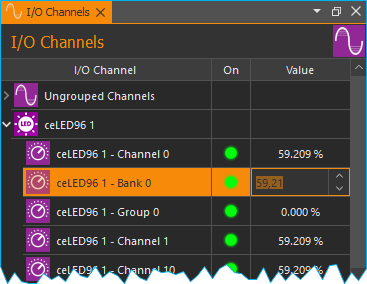
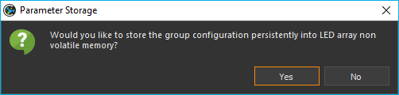
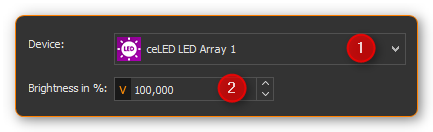

LED Array Plugin
================

Einführung
----------

Durch Drücken der Schaltfläche :guilabel:`LED Array` in der Seitenleiste oder den 
Menüpunkt :menuselection:`Window --> Show View --> LED Array`
können Sie zum :ref:`View <Views (Ansichten)>` des LED Array Plugins wechseln
(siehe Abbildung unten).

.. image:: Pictures/1000000000000382000002BC2FE3AAFD.png
   :alt: LED Array Workbench

Der Arbeitsbereich enthält für jedes angeschlossene LED-Array ein eigenes Bedienpanel:

Hardware Version
----------------

Für jedes LED Array wird je nach Version der LED Array Hardware ein
entsprechendes LED Array Bedienpanel eingeblendet. Die folgenden beiden
Hardwareversionen werden unterstützt:

.. list-table::
   :header-rows: 1

   * - LED Array Hardware V1
     - LED Array Hardware V2 
   * - |image6|
     - |image7|
   * - Die :ref:`Hardware Version 1 <led_hardware_v1>` unterstützt 12 unabhängige
       LED Array Kanäle mit einer Auflösung von 100 Schritten zur Einstellung der
       Helligkeit.
     - :ref:`Hardware Version 2 <led_hardware_v2>` unterstützt eine virtuell
       unbegrenzte Anzahl von unabhängigen LED Kanälen mit einer Auflösung von 4096
       Schritten zur Einstellung der Helligkeit.

.. _led_hardware_v1:

LED Array V1 - Bedienpanel
--------------------------

.. rst-class:: guinums

#. Beschriftung (anpassbar)
#. alle LED-Kanäle ein/aus
#. die Helligkeit der einzelnen LED-Kanäle einstellen (0 - 100%)
#. Einstellung der Helligkeit mehrerer LED-Kanäle (LED-Gruppe) gleichzeitig

Die Beschriftung des LED-Arrays kann von Ihnen jederzeit geändert
werden. Klicken Sie zum Ändern der Beschriftung einfach auf die
Beschriftung :guinum:`❶` und geben Sie dann einen neuen Namen für das LED-Array
ein. Dieser Name wird gespeichert und bei einem späteren Start der
Software wieder geladen.

Helligkeit einzelner LED-Kanäle einstellen
------------------------------------------

Die Helligkeit jedes einzelnen LED-Kanals können Sie einstellen, indem
Sie den Wert direkt in das Feld unter der LED eintragen :guinum:`❷` (0 – 100%)
oder indem Sie mit der rechten Maustaste auf eine LED klicken und die
Helligkeit dann mit dem Schieberegler :guinum:`❶` verändern (siehe Abbildung
unten).

.. image:: Pictures/100000000000010A000000A8ED3768DB.png
   :alt: Helligkeit einzelner LEDs ändern

Um einzelne LED-Kanäle
ein- und auszuschalten, klicken Sie mit der linken Maustaste auf eine
LED.

.. image:: Pictures/1000000000000106000000AE9333AD7C.png
   :alt: LED Kanal ein- / ausschalten

Da alle LED-Kanäle in der
QmixElements Software analoge Ausgangskanäle sind, können Sie die
Helligkeit einzelner LED-Kanäle auch über das Fenster der :ref:`I/O-Kanäle<Qmix I/O Plugin>` 
ändern (siehe Abbildung unten).

LED-Kanalgruppen
-------------------

Einführung
~~~~~~~~~~

Wenn mehrere LED-Kanäle synchron arbeiten sollen, können Sie diese
Kanäle zu Gruppen zusammenfassen und gemeinsam steuern. Das Bedienpanel
enthält 3 Schieberegler zur Einstellung der Helligkeit für drei
verschiedene LED-Kanalgruppen.

LED-Kanalgruppe konfigurieren
~~~~~~~~~~~~~~~~~~~~~~~~~~~~~

Zur Auswahl der Kanäle, die in einer Gruppe zusammengefasst werden
sollen, klicken Sie mit der rechten Maustaste in den Bedienbereich einer
Gruppe und wählen Sie im Kontextmenü den Punkt 
:menuselection:`Configure Group Channels` (siehe Abbildung unten).

.. image:: Pictures/100000000000013400000067B8EAA03B.png
   :alt: Aufruf LED-Gruppenkonfiguration

In dem Konfigurationsfenster das nun eingeblendet wird, können Sie alle
LED-Kanäle auswählen, die in einer Gruppe zusammengefasst werden sollen.
Setzen Sie ein Häkchen für jeden Kanal, der Teil dieser Gruppe sein soll
:guinum:`❶` und bestätigen Sie die Auswahl durch Klick auf :guilabel:`OK` :guinum:`❷`.

.. image:: Pictures/10000000000001640000019EAE700D89.png
   :alt: LED Gruppenkonfiguration

LED-Kanalgruppe steuern
~~~~~~~~~~~~~~~~~~~~~~~~~~

Sie können die Helligkeit einer LED-Gruppe mit dem Schieberegler :guinum:`❶`
verändern oder durch direkte Eingabe des Helligkeitswertes in das
Eingabefeld :guinum:`❷` (Abbildung unten).

.. image:: Pictures/10000000000000F60000005AF5E326F1.png
   :alt: LED Gruppensteuerung

Über das Häkchen in der linken
oberen Ecke :guinum:`❸` können Sie alle LEDs der Gruppe gemeinsam ein- und
ausschalten.

Standby-Timer konfigurieren
---------------------------

Das LED Array verfügt über eine Standby-Timer Funktionalität. D.h. nach
der letzten Aktion des Anwenders in der Software und nach Ablauf der
Standby-Zeit werden automatisch alle Sektoren des LED-Arrays
abgeschaltet. Jede Veränderung von Parametern in der Software, setzt den
Standby-Timer zurück und aktiviert das Array wieder.

.. admonition:: Wichtig
   :class: note

   Der Standby-Timer Wert wird im LED Array   
   gespeichert. D.h. auch wenn die Verbindung zum PC       
   unterbrochen wurde, wird das LED Array nach Ablauf der  
   Standby-Zeit abgeschaltet.

Um die Standby-Zeit zu konfigurieren, klicken Sie mit der rechten
Maustaste auf eine freie Fläche im Bedienpanel des LED-Arrays um das
Kontextmenü anzuzeigen. Wählen Sie dann den Menüpunkt :menuselection:`Configure Standby Timer`.

.. image:: Pictures/100000000000010700000096275DD1CF.png
   :alt: Standby-Timer Konfiguration aufrufen

In dem
Konfigurationsdialog der Ihnen nun angezeigt wird können Sie die
Stunden, Minuten und Sekunden des Standby-Timers konfigurieren. Durch
Anklicken der Schaltfläche :guilabel:`OK` werden Ihre Änderungen übernommen und
die Standby-Zeit im Gerät gespeichert (Abbildung unten).

.. image:: Pictures/100000000000010A000000B3587F0120.png
   :alt: Standby-Timer Konfigurationsdialog

.. admonition:: Wichtig
   :class: note

   Um den Standby-Timer zu desaktivieren      
   konfigurieren Sie die Stunden, Minuten und Sekunden mit 
   dem Wert 0.    

.. _led_hardware_v2:

LED Array V2 - Bedienpanel
--------------------------

.. image:: Pictures/100000000000010900000224043E069F.png

Die Beschriftung des LED-Arrays kann von Ihnen jederzeit geändert
werden. Klicken Sie zum Ändern der Beschriftung einfach auf die
Beschriftung :guinum:`❶` und geben Sie dann einen neuen Namen für das LED-Array
ein. Dieser Name wird gespeichert und bei einem späteren Start der
Software wieder geladen.

Globale Helligkeit einstellen
-----------------------------

Die globale Helligkeit aller LED Kanäle gleichzeitig können Sie über den
Schieberegler :guinum:`❷` oder über das Eingabefeld im Bereich :guilabel:`Global Brightness`
einstellen. Mit dem Ankreuzfeld in der linken oberen Ecke :guinum:`❶` schalten Sie
das globale Enable Signal des LED Arrays. Damit können Sie das Array
ein- / und ausschalten, ohne die Helligkeitswerte der einzelnen Kanäle
zu verändern.

.. admonition:: Wichtig
   :class: note

   Nur wenn das Enable Signal aktiviert ist, leuchten die LEDs des Arrays.   

Helligkeit von LED Bänken einstellen
------------------------------------

LED Bänke sind eine geräte- und hardwarespezifische Gruppierung von
einzelnen LED Kanälen in Gruppen. LED Bänke gruppieren LED Kanäle, die
auch physisch in der Hardware eine Gruppe bilden, z.B. alle LEDs auf
einer Platine oder alle LEDs eines bestimmten Typs (z.B. warmweiß oder
kaltweiß). Diese Gruppen sind in der Firmware verankert und können vom
Anwender nicht geändert werden.

.. image:: Pictures/10000000000000EE00000084AF8E2BCD.png
   :alt: Bedienelemente für LED Bank Helligkeit

Um die Helligkeit einer Bank zu ändern wählen Sie im Eingabefeld :guilabel:`Bank` :guinum:`❶` die
Bank aus, und stellen Sie dann mit dem Schieberegler oder dem
Eingabefeld :guinum:`❷` die Helligkeit der gewählten Bank ein.

Helligkeit einzelner LED-Kanäle einstellen
------------------------------------------

Im Bereich *LED Channel Brightness* stellen Sie die Helligkeit einzelner
LED Kanäle ein. Wählen Sie den Kanal im Eingabefeld :guilabel:`Channel` :guinum:`❶`. Die
Helligkeit ändern Sie über das Eingabefeld :guinum:`❷` oder den Schieberegler.

Um einen Kanal ein-
und auszuschalten, klicken Sie mit der linken Maustaste auf die LED :guinum:`❸`.

Da alle LED-Kanäle in der QmixElements Software analoge Ausgangskanäle
sind, können Sie die Helligkeit einzelner LED-Kanäle auch über das
Fenster der :ref:`I/O-Kanäle<Qmix I/O Plugin>` ändern (siehe Abbildung unten).

LED Kanalgruppen
----------------

Einführung
~~~~~~~~~~

Wenn mehrere LED-Kanäle synchron arbeiten sollen, können Sie diese
Kanäle zu Gruppen zusammenfassen und gemeinsam steuern. Über die
Gruppenkanäle können Sie dann alle Kanäle einer LED Gruppe gemeinsam
steuern

LED Kanalgruppen konfigurieren
~~~~~~~~~~~~~~~~~~~~~~~~~~~~~~

Um LED Kanalgruppen zu konfigurieren, klicken Sie mit der rechten
Maustaste in den Bereich *LED Group Brightness* und wählen Sie dann aus
dem Kontextmenü den Menüpunkt :menuselection:`Configure LED Groups`.

.. image:: Pictures/100000000000012E000000A2EFE72B3A.png
   :alt: LED Gruppenkonfiguration aufrufen

Es wird Ihnen nun der
Konfigurationsdialog zur Konfiguration der LED Gruppen angezeigt
(Abbildung unten).

.. image:: Pictures/10000000000002680000019589B3C1D4.png
   :alt: Konfigurationsdialog für LED Kanalgruppen

Um LED Kanäle einer Gruppen hinzuzufügen, gehen Sie wie folgt vor:

.. rst-class:: steps

#. Wählen Sie zuerst mit der Gruppen-Auswahlbox :guinum:`❷` die Gruppe aus, die
   Sie konfigurieren möchten.
#. Wählen Sie nun in der Kanalliste :guinum:`❶` die Kanäle, die Sie zur Gruppe
   hinzufügen möchten durch Klicken mit der Maustaste aus.

   -  einzelne Kanäle wählen Sie durch Anklicken aus
   -  mehrere zusammenhängende Kanäle wählen Sie aus, indem Sie den ersten
      Kanal mit der Maus anklicken und dann die :kbd:`Shift`-Taste gedrückt
      halten, während Sie den letzten Kanal anklicken

   .. image:: Pictures/10000000000004C90000026AF43AB254.png
      :width: 350

   -  mehrere unabhängige Kanäle wählen Sie aus, indem Sie beim
      Anklicken die Steuerungstaste gedrückt halten.

   .. image:: Pictures/10000000000003890000026A2EE7BB04.png
      :width: 250

#. Fügen Sie nun die ausgewählten Kanäle durch Anklicken der
   :guilabel:`Plus`-Schaltfläche zur Gruppe hinzu :guinum:`❸`. Um einzelne Kanäle aus der
   Gruppe zu löschen, wählen Sie die Kanäle in der Gruppenliste aus und
   klicken Sie anschließend die :guilabel:`Minus`-Schaltfläche :guinum:`❹`. Um alle Kanäle
   aus der Gruppe zu löschen, klicken Sie die Schaltfläche 
   :guilabel:`Clear LED Group` :guinum:`❺` an.
#. Wenn Sie alle Gruppen konfiguriert haben, klicken Sie :guilabel:`OK` :guinum:`❻`. Die
   Gruppenkonfiguration wird nun zum Gerät übertragen. Wenn Sie die
   Gruppenkonfiguration dauerhaft im Gerät speichern möchten, klicken
   Sie im angezeigten Meldungsfenster (siehe Abbildung unten) auf
   :guilabel:`Yes`.

Helligkeit von LED Gruppen einstellen
~~~~~~~~~~~~~~~~~~~~~~~~~~~~~~~~~~~~~

Um die Helligkeit einer Gruppe zu ändern, wählen Sie im Eingabefeld
:guilabel:`Group` :guinum:`❶` die Gruppe aus, und stellen Sie dann mit dem Schieberegler
oder dem Eingabefeld :guinum:`❷` die Helligkeit der gewählten Gruppe ein.

.. image:: Pictures/10000000000000F300000083463C4BD3.png
   :alt: Bedienelemente für LED Gruppen Helligkeit

Script Funktionen
-----------------

Das LED-Array-Plugin bietet eine Reihe von Scriptfunktionen die für die
Programmierung von automatischen Belichtungssequenzen oder für die
zeitgesteuerte Belichtung verwendet werden können. Die Scriptfunktionen
finden Sie in den Kategorien *LED Array Functions* und *I/O Functions*.

.. image:: Pictures/1000000000000111000000C6D2F2FCCA.png

|

.. image:: Pictures/10000000000000EA00000078FE1034F4.png

Funktion Globale Helligkeit – *Set Global LED Array Brightness*
~~~~~~~~~~~~~~~~~~~~~~~~~~~~~~~~~~~~~~~~~~~~~~~~~~~~~~~~~~~~~~~

.. image:: Pictures/100002010000002E0000002EFB529AA2.png
   :width: 60
   :align: left 
   
Mit dieser Scriptfunktion stellen Sie die globale Helligkeit
aller LED Kanäle eines LED Arrays gemeinsam ein. Zur Konfiguration der
Skriptfunktion gehen Sie wie folgt vor (Abbildung unten):

.. rst-class:: guinums

#. Wählen Sie dazu das LED-Gerät aus der Geräteliste aus
#. Stellen Sie anschließend die Helligkeit (0 – 100%) ein.

.. admonition:: Tipp
   :class: tip

   Diese Funktion unterstützt Scriptvariablen.   
   Im Feld :guilabel:`Brightness` können Variablen verwendet       
   werden.            

Funktion Bank-Helligkeit – *Set LED Bank Brightness*
~~~~~~~~~~~~~~~~~~~~~~~~~~~~~~~~~~~~~~~~~~~~~~~~~~~~

Die Helligkeit kompletter LED Bänke können Sie mit dieser
Scriptfunktion einstellen. Zur Konfiguration der Skriptfunktion gehen
Sie wie folgt vor (Abbildung unten):

.. image:: Pictures/100000000000019100000099D6A36581.png
   :alt: Skriptfunktion Set LED Bank Brightness

.. rst-class:: guinums

#. Wählen Sie das LED-Array Gerät aus
#. Wählen Sie die Bank aus, deren Helligkeit geändert werden soll
#. Stellen Sie die Helligkeit ein (0- - 100%)

.. admonition:: Tipp
   :class: tip

   Diese Funktion unterstützt Scriptvariablen.   
   Im Feld :guilabel:`Bank` und :guilabel:`Brightness` können Variablen   
   verwendet werden.

Funktion LED Helligkeit – Set LED Channel Brightness
~~~~~~~~~~~~~~~~~~~~~~~~~~~~~~~~~~~~~~~~~~~~~~~~~~~~

.. image:: Pictures/100002010000003000000030BE44A04A.png
   :width: 60
   :align: left

Für einzelne LED Kanäle können Sie die Helligkeit mit dieser
Scriptfunktion einstellen. Zur Konfiguration der Scriptfunktion gehen
Sie wie folgt vor (Abbildung unten):

.. image:: Pictures/100000000000016500000099E30E7287.png
   :alt: Skriptfunktion Set LED Channel Brightness

.. rst-class:: guinums

#. Wählen Sie das LED-Array Gerät aus
#. Wählen Sie den Kanal aus, dessen Helligkeit Sie einstellen möchten
#. Stellen Sie die Helligkeit ein (0- - 100%)

.. admonition:: Tipp
   :class: tip

   Diese Funktion unterstützt Scriptvariablen.   
   Im Feld :guilabel:`Channel` und :guilabel:`Brightness` können Variablen         
   verwendet werden.    

Funktion Gruppen-Helligkeit – Set LED Group Brightness
~~~~~~~~~~~~~~~~~~~~~~~~~~~~~~~~~~~~~~~~~~~~~~~~~~~~~~

Mit dieser Funktion können Sie die Helligkeit einer LED
Gruppe scriptgesteuert einstellen. Zur Konfiguration der Scriptfunktion
gehen Sie wie folgt vor (Abbildung unten):

.. image:: Pictures/10000000000001690000009BB63CA864.png
   :alt: Skriptfunktion Set LED Group Brightness

.. rst-class:: guinums

#. Wählen Sie das LED-Array Gerät aus
#. Wählen Sie die Gruppe aus, deren Helligkeit Sie einstellen möchten
#. Stellen Sie die Helligkeit ein (0- - 100%)

.. admonition:: Tipp
   :class: tip

   Diese Funktion unterstützt Scriptvariablen.   
   Im Feld :guilabel:`Group` und :guilabel:`Brightness` können Variablen verwendet 
   werden.  

Funktion Multi-Kanal Helligkeit – *Set Multi Channel Brightness*
~~~~~~~~~~~~~~~~~~~~~~~~~~~~~~~~~~~~~~~~~~~~~~~~~~~~~~~~~~~~~~~~

.. image:: Pictures/1000020100000030000000306620BC5F.png
   :width: 60
   :align: left

Mit dieser Funktion können Sie scriptgesteuert die Helligkeit
mehrere LED-Kanäle gleichzeitig einstellen.Zur Konfiguration der
Skriptfunktion gehen Sie wie folgt vor (Abbildung unten):

.. image:: Pictures/10000000000002260000018E1FF2911A.png
   :alt: Skriptkonfiguration Set LED Group Brightness

.. rst-class:: guinums

#. Wählen Sie das LED-Array Gerät aus
#. Stellen Sie die Helligkeit ein (0- - 100%)
#. Setzen Sie für jeden Kanal der geregelt werden soll ein Häkchen in
   der Kanalauswahlliste.

.. admonition:: Wichtig
   :class: note

   Sind sehr viele Kanäle ausgewählt, kann    
   die Datenübertragung für alle Kanäle eine gewisse Zeit  
   dauern, so dass nicht alle Kanäle genau synchron        
   geschaltet werden. Verwenden Sie ggf. LED Gruppen, wenn 
   diese Verzögerung nicht erwünscht ist.  

.. admonition:: Tipp
   :class: tip

   Diese Funktion unterstützt Scriptvariablen.   
   Im Feld :guilabel:`Brightness` können Variablen verwendet werden. 

Funktion Analogausgang setzen - *Set Analog Out* 
~~~~~~~~~~~~~~~~~~~~~~~~~~~~~~~~~~~~~~~~~~~~~~~~~

.. image:: Pictures/analogout_script.svg
   :width: 60
   :align: left

Alle LED
Kanäle sind in der QmixElements Software normale analoge Ausgangskanäle.
Sie können deshalb für das Einstellen der Helligkeit einzelner Kanäle
die Funktion *Set Analog Out* aus der Kategorie :ref:`I/O Script-Funktionen`
verwenden.

.. image:: Pictures/10000000000001C0000000BCBE441A82.png
   :alt: Skriptkonfiguration Set Analog Out

Wählen Sie im Konfigurationsbereich :guilabel:`Analog Output` den entsprechenden
LED-Kanal aus :guinum:`❶` und tragen Sie im Feld :guilabel:`Value` den Helligkeitswert :guinum:`❷` (0
– 100%) ein.

.. admonition:: Tipp
   :class: tip

   Diese Funktion unterstützt die Verwendung von 
   Variablen. D.h., im Feld :guilabel:`Value` :guinum:`❷` können Sie, statt      
   eines Wertes, den Namen einer Variablen eintragen, die  
   den Helligkeitswert zur Laufzeit des Scripts enthält    
   (siehe Abbildung).   

.. |image6| image:: Pictures/100000000000010E0000022483DA82B5.png
.. |image7| image:: Pictures/10000000000001090000022462F0E95C.png