Nemesys Plugin
==============

Einführung
----------

Das Nemesys Plugin dient zur Steuerung der Nemesys Spritzenpumpen.
Im Arbeitsbereich des Nemesys
Plugins (Abbildung unten) werden Ihnen für alle vorhandenen und
konfigurierten Spritzenpumpen Bedienpanels angezeigt.

.. image:: ./Pictures/100000000000045E000002BE838E4D417C3553CE.png
   :alt: Nemesys Arbeitsbereich

Wenn die Nemesys-Ansicht nicht sichtbar ist, dann wählen Sie 
:menuselection:`Window --> Show View --> Nemesys` aus dem Hauptmenü oder klicken 
Sie die Schaltfläche :guilabel:`Nemesys` in der Seitenleiste.

Dosiereinheiten-Bedienpanel
---------------------------

Übersicht
~~~~~~~~~

Jedes Bedienpanel dient zur Steuerung, Konfiguration und zur
Visualisierung eines Nemesys Dosiermoduls. Es enthält alle
Steuerelemente zur Konfiguration, Steuerung der Pumpenparameter und zur
Visualisierung des aktuellen Status.

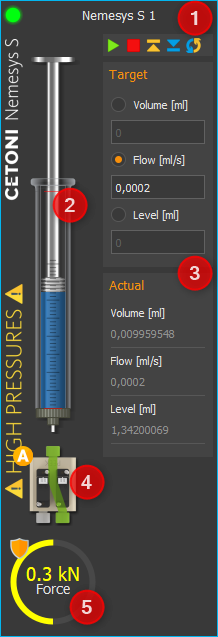

                                                         
Das Panel besteht aus:    

.. rst-class:: guinums

#. Beschriftung der Spritzenpumpe
#. Füllstandsanzeige
#. Bedienelemente (je nach Betriebsart)
#. Ventilschaltung und -status
#. Anzeige des internen Kraftsensors, sofern vom Gerät unterstützt    

Die Anzeige des Kraftsensors ist standardmäßig ausgeblendet. Um die Anzeige 
einzublenden, wählen Sie  :menuselection:`Show Force Indicator` aus dem Kontextmenü.
                                                                   
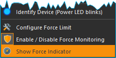

Modulnamen ändern
~~~~~~~~~~~~~~~~~

Sie können für jede Dosiereinheit eine individuelle Bezeichnung
vergeben. So können Sie z.B. kennzeichnen, welche Flüssigkeit damit
dosiert wird oder wozu die Dosiereinheit verwendet wird. Um eine neue
Bezeichnung zu vergeben, klicken Sie einfach mit der linken Maustaste
auf die Bezeichnung der Dosiereinheit. Sie können nun einen neuen Namen
eingeben und die Eingabe mit :kbd:`Return` bestätigen (Abbildung unten).

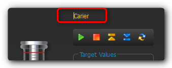

Füllstandanzeige Spritze
~~~~~~~~~~~~~~~~~~~~~~~~~~

Die Füllstandanzeige der Spritze zeigt stets die aktuelle Position der
Antriebseinheit und somit den aktuellen Füllstand der verwendeten
Spritze an. Zusätzlich wird durch die Färbung der Spritze die aktuelle
Bewegung der Dosiereinheit dargestellt, so dass Sie auch bei sehr
niedrigen Flussraten die Bewegungsrichtung der Spritze sofort erkennen
können. Folgende Färbungen sind möglich:

+-----------+----------------------------------------------------------+
| |image8|  | **Grau** - die Antriebseinheit ist im Moment inaktiv.    |
+-----------+----------------------------------------------------------+
| |image9|  | **Blau** - Der Spritzenkolben wird in Richtung           |
|           | Spritzeneinspannung bewegt (Reagenzabgabe).              |
+-----------+----------------------------------------------------------+
| |image10| | **Orange** - Der Spritzenkolben wird von der             |
|           | Spritzeneinspannung weg bewegt (Reagenzaufnahme).        |
+-----------+----------------------------------------------------------+

Diese farbliche Kennzeichnung der Bewegungsrichtung wird auch in allen
anderen Teilen des Nemesys Plugins verwendet.

.. admonition:: Tipp
   :class: tip

   Besonders bei sehr niedrigen Flussraten    
   hilft Ihnen die Einfärbung der Spritzen bei der         
   Erkennung der Bewegungsrichtung da eine Änderung der    
   Position des Spritzenkolbens kaum wahrnehmbar ist.  

Die Dicke der dargestellten Spritze informiert Sie über die ungefähre
Größe der Spritze, die im Moment eingespannt ist. Besonders bei großen
Spritzen sollten Sie sehr vorsichtig mit der Verwendung großer
Flussraten sein, da hierbei schnell hohe Drücke entstehen können die das
Gerät (Ventil) oder Ihre Applikation beschädigen.

.. admonition:: Achtung
   :class: caution

   Gefahr der Beschädigung der fluidischen    
   Anschlusstechnik durch hohe Drücke. Führen Sie eine     
   Referenzfahrt niemals mit eingespannter                 
   Hochdruck-Spritze durch, um Beschädigungen durch hohe   
   Drücke zu vermeiden.  

Softwarelimits
^^^^^^^^^^^^^^

Der Verfahrweg einer Spritze wird in der Software durch einen Minimal-
und einen Maximalwert begrenzt, um das Zerstören der Spritze bzw. das
Herausziehen des Kolbens aus dem Spritzenkörper zu vermeiden. Diese
Werte werden durch zwei rote Markierungen in der Füllstandanzeige
angezeigt (Abbildung unten) und müssen in der
:ref:`Spritzenkonfiguration` für jede
Spritze definiert werden.

.. image:: Pictures/syringe_software_limits.png

Kraftüberwachung
----------------

Einführung
~~~~~~~~~~

Die aktuellen Pumpen der Nemesys Reihe (Nemesys M und Nemesys S)
verfügen über eine interne Kraftsensorik zur Überwachung der Kraft, mit
der der Spritzenkolben in die Spritze gedrückt wird. Dies dient dazu,
das Risiko einer Beschädigungen des Gerätes, der Spritzen und der
Applikation zu minimieren.

Jede Pumpe verfügt über einen fest eingestellten maximalen Kraftwert,
bei dem die Dosierung gestoppt wird:

============= ========
**Nemesys S** 0.48 kN
**Nemesys M** 1.3 kN
============= ========

Zusätzlich kann die maximale Kraft durch ein vom Anwender einstellbares
Kraftlimit weiter begrenzt werden.

Bedienelemente
~~~~~~~~~~~~~~

Im Bedienpanel der Pumpe finden Sie Anzeige der Kraftüberwachung :guinum:`❶`
unterhalb der Spritzendarstellung. Sollte die Anzeige ausgeblendet sein,
können Sie über das Kontextmenü der Pumpe die Anzeige wieder einblenden.
Wählen Sie im Kontextmenü den Menüpunkt :menuselection:`Show Force Indicator`:

An dem Schutzschild Symbol :guinum:`❷` (siehe Abbildung unten) in der linken
oberen Ecke der Kraftanzeige können Sie erkennen, ob die
Kraftüberwachung aktiv oder inaktiv (Symbol ausgegraut) ist.

.. image:: ./Pictures/100002010000011500000099B1E7B77D37E1332E.png

Eine Dosierung ist nur mir aktivierter Kraftüberwachung
möglich. Wenn Sie den Mauspfeil über die Kraftanzeige bewegen, werden
Ihnen in einem kleinen Fenster :guinum:`❸` zusätzliche Informationen angezeigt:

-  **Name** - Name des Kraftsensors (z.B. um den Sensor im Script abzufragen oder
   im Logger zu verwenden
-  **Force range** - der einstellbare Bereich Kraftüberwachung
-  **Force limit** – die aktuell eingestellte zulässige Maximalkraft
-  **Monitoring** – zeigt an, ob die Kraftüberwachung aktiv ist

Um die maximale Kraft zu begrenzen, klicken Sie mit der rechten
Maustaste in die Kraftanzeige und wählen den Menüpunkt :menuselection:`Configure Force Limit`:

.. image:: ./Pictures/1000020100000146000000800BD9B0432D00F22A.png

Anschließend geben Sie die gewünschte Maximalkraft ein und drücken :guilabel:`OK`:

.. image:: ./Pictures/100002010000010000000070D53D2787371955AA.png

Vorgehen nach einer Kraft-Überlastabschaltung
~~~~~~~~~~~~~~~~~~~~~~~~~~~~~~~~~~~~~~~~~~~~~

Wird während der Verwendung der Pumpe die maximal eingestellte Kraft
überschritten, wird die Pumpe sofort gestoppt und in einen Fehlerzustand
gesetzt. Dies ist in der Abbildung unten dargestellt. Der Wert des
Kraftsensors (grüne Kurve) hat das eingestellte Kraftlimit (rote Linie)
überschritten :guinum:`❶`.

.. image:: ./Pictures/100002010000041C0000027F06C58E855A268253.png

Der Fehlerzustand der Pumpe wird durch die rot blinkende LED
angezeigt :guinum:`❷`. In der Kraftanzeige ist der aktuelle Messwert des
Kraftsensors zu sehen :guinum:`❸`. Zusätzlich wird Ihnen in der Ereignisanzeige
der Fehlergrund angezeigt.

.. image:: ./Pictures/10000201000002EA0000005B00458FB9B9C5043B.png

Um die Pumpe wieder aus diesem „Überlast“-Zustand in den
normalen Betriebsmodus zurück zu setzen, gehen Sie wie folgt vor:

.. rst-class:: steps

#. **Kraftabschaltung deaktivieren**. Klicken Sie mit der rechten
   Maustaste in die Kraftanzeige und wählen die dann den Menüpunkt
   *Enable / Disable Force Monitoring*. Danach sollte das
   Schutzschildsymbol ausgegraut sein.

   .. image:: ./Pictures/1000020100000205000000628984EFCAD3138B6D.png

   In der Ereignisanzeige erhalten Sie die Information, das der
   Sicherheitsstop nun zurückgesetzt wurde und dass ein Aufziehen der
   Spritze möglich ist.

   .. image:: ./Pictures/100002010000028C00000056870799632F9FDD06.png

#. **Pumpe aktivieren**. Klicken Sie zum Aktivieren der Pumpe mit der
   rechten Maustaste auf die rote Status LED der Pumpe und wählen Sie
   aus dem Kontextmenü den Menüpunkt *Enable Pump Drive*. Die Status
   LED der Pumpe muss danach grün leuchten.

   .. image:: ./Pictures/10000201000000F30000006A80846DAA366E3158.png

#. **Kraft verringern**. Sie können nun die Kraft verringern, indem Sie
   die Spritze aufziehen oder mit einer negativen Flussrate eine
   Dosierung starten. Sie sollten nun sehen, wie sich der Wert in der
   Kraftanzeige verringert. Sobald der Kraftwert einen Schwellwert
   unterschreitet, wird die Pumpe gestoppt und wieder in einen
   Fehlerzustand gesetzt. Sie sollten dann in der Ereignisanzeige eine
   entsprechende Meldung sehen:

   .. image:: ./Pictures/10000201000002C70000005EE9E5349F4ACFEEAF.png

#. **Kraftabschaltung aktivieren**. Klicken Sie nun mit der rechten
   Maustaste erneut in die Kraftanzeige und wählen die dann den
   Menüpunkt *Enable / Disable Force Monitoring.* Danach sollte die
   Kraftüberwachung wieder aktiv sein und das Schildsymbol farbig
   dargestellt werden:

   .. image:: ./Pictures/10000201000000630000005FF329372D2B9DEC99.png

   In der Ereignisanzeige sollten Sie nun die Information
   erhalten, dass die Kraftüberwachung wieder aktiv ist und der
   Sicherheitsstop zurückgesetzt wurde.

   .. image:: ./Pictures/10000201000001AA00000056EACFFD3C7DD5C0F4.png

#. **Pumpe aktivieren**. Klicken Sie zum Aktivieren der Pumpe nun
   erneut mit der rechten Maustaste auf die rote Status LED der Pumpe
   und wählen Sie aus dem Kontextmenü den Menüpunkt *Enable Pump
   Drive*. Die Status LED der Pumpe muss danach grün leuchten.

   .. image:: ./Pictures/10000201000000F30000006A80846DAA366E3158.png

Jetzt ist die Pumpe wieder betriebsbereit und kann normal verwendet
werden.

Referenzfahrt durchführen
-------------------------
.. admonition:: Tipp
   :class: tip

   Bei den aktuellen *Nemesys M* und *Nemesys S*     
   Pumpen ist keine Referenzfahrt mehr notwendig und Sie   
   können das Kapitel überspringen.    

Die Antriebe der Dosiereinheiten werden durch eine digitale
Positioniereinheit überwacht und gesteuert. Um diese Positioniereinheit
zu kalibrieren, können Sie eine Referenzfahrt der Dosiereinheit
durchführen. Ein geeigneter Zeitpunkt dafür ist z.B. der Wechsel einer
Spritze, da für die Referenzfahrt die Spritze aus der Dosiereinheit
entfernt werden muss. Während der Referenzfahrt fährt die Dosiereinheit
zur ihrer unteren Endlage und kalibriert beim Erreichen der Endlage Ihre
Nullposition.

.. admonition:: Wichtig
   :class: note

   Führen Sie auf jeden Fall eine             
   Referenzfahrt durch, wenn Sie die Pumpen an einem       
   anderen PC betreiben da die Kalibrierungsdaten auf dem  
   PC und nicht in den Dosiereinheiten gespeichert werden. 

Um eine Referenzfahrt zu starten, klicken Sie mit der rechten Maustaste
in das Bedienpanel der Dosiereinheit die kalibriert werden soll. In dem
Kontextmenü was sich nun öffnet, wählen Sie den Menüpunkt :menuselection:`Reference Move` 
(siehe Abbildung unten).

.. image:: Pictures/start_reference_move.png
   :alt: Abbildung 3: Start Referenzfahrt

.. admonition:: Achtung
   :class: caution

   Gefahr der Beschädigung von Spritzen! Die  
   Kalibrierung des Systems darf nur durchgeführt werden,  
   wenn keine Spritze auf der Dosiereinheit installiert    
   ist.   

.. admonition:: Achtung
   :class: caution

   Gefahr der Beschädigung der fluidischen    
   Anschlusstechnik durch hohe Drücke. Führen Sie eine     
   Referenzfahrt niemals mit eingespannter                 
   Hochdruck-Spritze durch um Beschädigungen durch hohe    
   Drücke zu vermeiden. 

Ventil
------

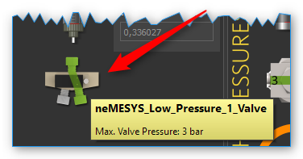

Wenn Ihre Dosiereinheit über ein Ventil verfügt, können Sie in diesem
Teil des Bedienpanels das Ventil umschalten oder die automatische
Ventilumschaltung konfigurieren. Gleichzeitig wird Ihnen hier ständig
der aktuelle Schaltzustand des Ventils angezeigt.

.. admonition:: Tipp
   :class: tip

   Bewegen Sie die Maus über das Ventil, um      
   zusätzliche Informationen zum Ventil zu erhalten. 

Manuelle Ventilschaltung
~~~~~~~~~~~~~~~~~~~~~~~~

Zum Umschalten des Ventils klicken Sie einfach mit der linken Maustaste
auf das Ventil-Symbol (siehe Abbildung unten). Sie sollten ein leises
Klicken hören und die Ventildarstellung sollte auf den anderen
Schaltzustand umschalten. Der aktuelle Schaltzustand des Ventils wird
Ihnen in der Software angezeigt.

.. image:: ./Pictures/1000000000000195000000ADA27EB388AC14806E.png
   :alt: Ventilschaltung

Wenn Sie ein Ventil haben mit mehr als
zwei Schaltstellungen, können Sie durch jedes Anklicken des Ventils mit
der linken Maustaste in die nächste Ventilposition schalten. Wenn Sie
beim Anklicken die :kbd:`Shift`-Taste gedrückt halten, können Sie die
Ventilpositionen in umgekehrter Richtung durchschalten:

.. image:: ./Pictures/10000000000001B10000009674312B473919102F.png
   :alt: Umgekehrte Ventilschaltung

Alternativ können Sie die
gewünschte Ventilposition auch direkt auswählen. Klicken Sie dafür mit
der rechten Maustaste auf das Ventil und wählen Sie dann im Kontextmenü
den Punkt :menuselection:`Switch Valve`.

.. image:: ./Pictures/100000000000016E000000B3905F4EAA693DD621.png
   :alt: Ventil-Kontextmenü anzeigen
 

Ihnen wird nun eine Auswahl
der gewünschten Ventilposition angezeigt. Sobald Sie eine Position
auswählen, wird das Ventil umgeschaltet. Die Auswahl der Position
schließen Sie durch Anklicken des grünen Häkchens.

.. image:: ./Pictures/100000000000017C000000FBB8D53C0B60FC4150.png
   :alt: Auswahl Ventilposition

Automatische Ventilschaltung
~~~~~~~~~~~~~~~~~~~~~~~~~~~~~~~~~~~~~~~~~~~~~~~~~~~~~~~~~~~~~~~~~~~

Jede Pumpe verfügt über eine Ventilautomatik, die das zu der Pumpe
gehörende Ventil automatisch schaltet, wenn sich der Zustand der Pumpe
ändert. Ob die Ventilautomatik aktiv ist, können Sie an dem kleinen
**A**-Icon erkennen, das dem Ventilbild überlagert ist.

.. image:: ./Pictures/10000000000002230000009D317412D5E296952F.png
   :alt: Ventilautomatik aktiv

Um die Ventilautomatik ein- und
auszuschalten, klicken Sie einfach mit der rechten Maustaste auf ein
Ventil und wählen dann den Menüpunkt :menuselection:`Enable Valve Automatic`.

.. image:: ./Pictures/10000000000001320000007D07F9BEE1F917E086.png
   :alt: Ventilautomatik ein- und ausschalten

Um die
Ventilautomatik zu konfigurieren, klicken Sie mit der rechten Maustaste
auf ein Ventil und wählen den Menüpunkt :menuselection:`Configure Valve Automatic`. Es
wird Ihnen dann der Konfigurationsdialog für die Ventilautomatik
angezeigt.

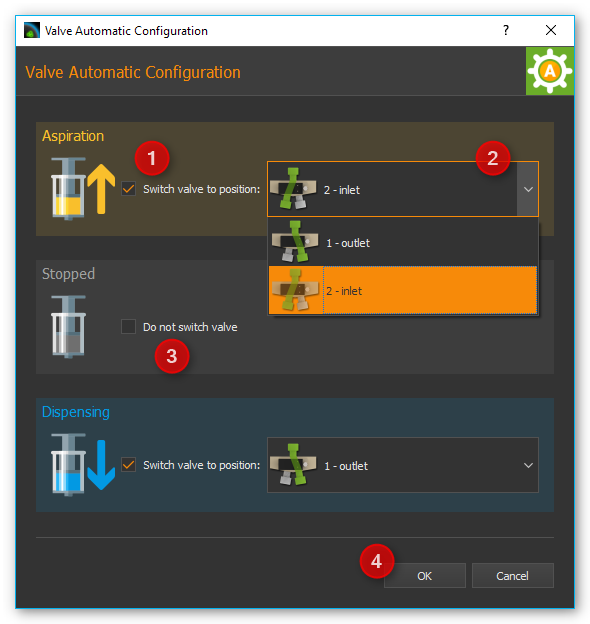

Sie können hier
für jeden Pumpenzustand (*Aspiration* – Fluidaufnahme, *Stopped* – Pumpe
gestoppt und *Dispensing* – Fluidabgabe) getrennt konfigurieren, in
welche Position das Ventil geschaltet werden soll. Um die
Ventilschaltung zu aktivieren, setzen Sie ein Häckchen in der Checkbox
:guinum:`❶`. Es wird dann eine Auswahlbox :guinum:`❷` angezeigt, zur Auswahl der
Ventilposition. Wenn Sie in einem Zustand das Ventil nicht schalten
möchten, entfernen Sie einfach das Häckchen in der Checkbox :guinum:`❸`. Schließen
Sie die Konfiguration durch Klick auf :guilabel:`OK` :guinum:`❹` ab.

.. admonition:: Wichtig
   :class: note

   In bestimmten Betriebsarten, z.B. bei der  
   kontinuierlichen Dosierung mit zwei Pumpen, wird die    
   Ventilautomatik vorübergehend deaktiviert, da die       
   Ventile dann von der Software der jeweiligen            
   Betriebsart geschaltet werden.   

Ventil zuweisen
~~~~~~~~~~~~~~~

Sie können jeder Pumpe, egal ob diese über ein Ventil verfügt oder
nicht, ein neues Ventil zuweisen. Dieses Ventil kann z.B. ein Qmix V
Modul sein, ein externes Kugelhahnventil oder das Ventil einer anderen
Spritzenpumpe.. Ziehen Sie dafür einfach das entsprechende Ventil aus
der Ventilliste :guinum:`❶` per Drag & Drop auf das Frontpanel :guinum:`❷` der
entsprechenden Pumpe.

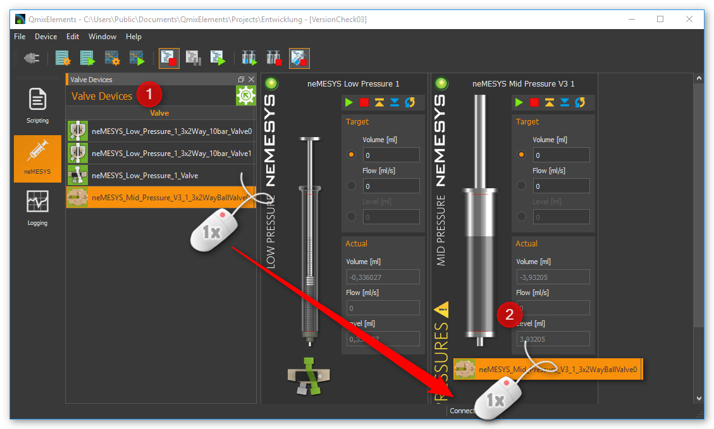

Alternativ können Sie
das Ventil auch über das Kontextmenü im Frontpanel der Pumpe zuweisen.
Klicken Sie dafür mit der rechten Maustaste in das Frontpanel und wählen
Sie dann im Kontextmenü den Punkt :menuselection:`Assign Valve`.

.. image:: ./Pictures/100000000000017C000000A2A0DA88BD315B82A3.png
   :alt: Ventil zuweisen

Wählen Sie dann aus der Ventilliste das Ventil aus, welches Sie zuweisen möchten.

.. image:: ./Pictures/10000000000001790000011DC571F9CE1064E587.png
   :alt: Ventilauswahldialog

Das neue Ventil wird dann unterhalb
der Spritze angezeigt. Wenn Sie für das Ventil die Ventilautomatik
konfigurieren und aktivieren, wird das zugewiesene Ventil automatisch
beim Aufziehen, Dosieren und Stoppen der Pumpe geschaltet.

.. image:: ./Pictures/10000000000001400000009219520510E258BA22.png
   :alt: Externes 3x2-Wege Kugelhahnventil

.. admonition:: Wichtig
   :class: note

   Sie können einer Pumpe immer nur ein Ventil zuweisen. 

Wenn Sie später die Original-Ventilkonfiguration wieder herstellen
möchten, wählen Sie im Kontextmenü der Pumpe oder im Kontextmenü des
Ventils den Punkt :menuselection:`Restore Default Valve`.

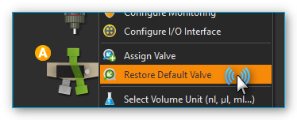

.. admonition:: Tipp
   :class: tip

   Im Abschnitt :ref:`Externe Ventile an I/O—Schnittstelle anschließen<externe_ventile>` 
   finden Sie eine detaillierte Anleitung, wie Sie externe 
   Ventilmodule (z.B. Kugelhahnventile) in die Software    
   einbinden. 

I/O Schnittstelle
-----------------

Übersicht
~~~~~~~~~

.. image:: ./Pictures/10000000000003880000025CBC968CAE13909DEE.png
   :alt: I/O Schnittstelle Nemesys Mitteldruckmodul V3
   :width: 400

Verschiedene Nemesys Pumpen bieten eine I/O Schnittstelle zur Einbindung
externer Signale und Sensoren oder zur Ausgabe von Triggersignalen
(Beispiel siehe Abbildung unten).

Die Schnittstelle verfügt je nach Gerätekonfiguration über digitale Ein- und
Ausgänge und / oder analoge Eingänge. Alle I/O Kanäle finden Sie in der
Software im Fenster *I/O Channels*. Wenn das Fenster in der Software
nicht sichtbar ist, können Sie es mit dem Menüpunkt 
:menuselection:`Window --> Show View --> I/O Channels` 
im Hauptmenü einblenden (siehe Abbildung unten).

.. image:: ./Pictures/100002010000013E000000B74AE0265CA479D65B.png
   :alt: Fenster I/O Channels einblenden

Jeder Kanal hat einen
eindeutigen Namen (z.B. *Nemesys 1 Analog In 1*) der aus dem Namen der
Pumpe (z.B. *Nemesys 1*) und dem Namen des I/O Kanals (z.B. *Analog In
1*) zusammengesetzt ist (siehe Abbildung unten).

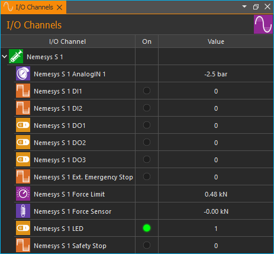

Skalierung der analogen Eingänge
~~~~~~~~~~~~~~~~~~~~~~~~~~~~~~~~~~

Die analogen Eingänge der Nemesys Module messen die Eingangsspannung von
0 – 5000 mV. Für jeden Kanal können Sie eine eigene Skalierung
festlegen. Dadurch können Sie z.B. den Spannungswert von 0 – 5000 mV in
einen Druckwert von 0 – 20 bar skalieren, wenn Sie einen Drucksensor
angeschlossen haben. Details zur Konfiguration der Kanäle oder zur
Skalierung finden Sie in der Dokumentation zum :ref:`I/O Plugin`.

Im folgenden Beispiel verwenden wir einen Drucksensor mit diesem
Messbereich: *0,5 V – 4,5 V* entspricht *0 – 20 bar*. Dieser Sensor ist
am analogen Eingang 1 angeschlossen. Für diesen Drucksensor legen wir
nun eine Skalierung fest. Dafür klicken Sie mit der rechten Maustaste in
den Kanal und wählen den Menüpunkt :menuselection:`Configure channel`. Der folgende
Konfigurationsdialog wird Ihnen dann angezeigt.

.. image:: ./Pictures/100002010000029C00000278588D110A32DA5302.png
   :alt: Beispiel Eingangsskalierung für Drucksensor

In dem Dialog konfigurieren wir die folgenden Werte:

.. rst-class:: guinums

#. als Sensortype wählen wir *Pressure* aus
#. die Basiseinheit bar entspricht der Einheit im Datenblatt unseres
   Sensors
#. in der Zeile :guilabel:`Device value` geben wir den Messbereich des analogen
   Einganges ein: 500 mV bis 4500 mV ein. In der Zeile :guilabel:`Scaled value`
   geben wir den Messbereich des Sensors 0 – 20 bar ein.
#. in Eingabefeld :guilabel:`Caption` vergeben wir einen neuen Namen für den
   Kanal
#. als Anzeigeeinheit wählen wir im Eingabefeld :guilabel:`Measuring unit` die
   Druckeinheit psi.
#. durch klicken von :guilabel:`OK` schließen wir die Konfiguration ab

In dem Fenster *I/O Channels* wird Ihnen nun der Messwert des
Drucksensors in bar angezeigt (siehe Abbildung unten).

.. image:: ./Pictures/1000020100000217000000D0C2BA47560EE1E867.png
   :alt: Skalierter Messwert für Drucksensor

.. admonition:: Tipp
   :class: tip

   Eine ausführliche Beschreibung der I/O        
   Kanäle, deren Konfiguration und zur Skalierung finden   
   Sie in der :ref:`I/O Plugin`-Dokumentation.    

.. _externe_ventile:

Externe Ventile an I/O—Schnittstelle anschließen
~~~~~~~~~~~~~~~~~~~~~~~~~~~~~~~~~~~~~~~~~~~~~~~~

Sie können an die externe I/O Schnittstelle verschiedene externe Geräte,
wie z.B. Sensoren oder Ventile anschließen. Um ein externes Ventil zu
konfigurieren, wählen Sie im Kontextmenü den Punkt :menuselection:`Configure external valves`.

.. image:: ./Pictures/10000201000001F4000000FD1C3EDAD5B9F8862F.png
   :alt: I/O Interface konfigurieren

Aus der Liste der externen
Ventile können Sie nun ein Gerät wählen, welches Sie an die I/O
Schnittstelle anschließen möchten. Die Liste der verfügbaren Ventile 
(:guilabel:`Available Valves` :guinum:`❶`) zeigt alle Ventilgeräte, die Sie 
auswählen können. Im Abschnitt :guilabel:`Valve Parameters` :guinum:`❷` sehen Sie 
detaillierte Informationen über den ausgewählten Ventiltyp.

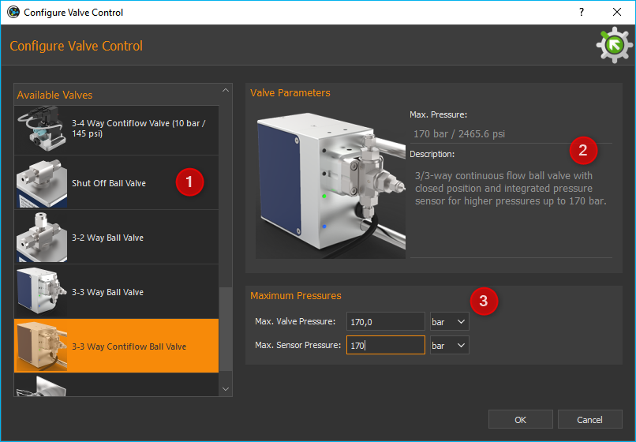

Für einige Ventile müssen Sie möglicherweise zusätzliche Parameter angeben :guinum:`❸`.
Wenn Sie ein Gerät
ausgewählt haben, bestätigen Sie Ihre Auswahl mit :guilabel:`OK`.

Nach der Auswahl eines Ventils wird Ihnen ein Dialog angezeigt, in dem
Sie konfigurieren können, ob das Ventil ein Primärventil oder
Sekundärventil sein soll.

.. image:: ./Pictures/1000000000000214000000A6D5C37AA1BE5C3A54.png
   :alt: Primär- / Sekundärventil festlegen

Das *Primärventil*
wird direkt an die I/O Schnittstelle angeschlossen. Wenn Sie ein zweites
zusätzliches Ventil anschließen möchten, benötigen Sie ein Y-Kabel oder
eine Verteilerbox. Da das zweite Ventil mit einem anderen digitalen
Ausgangssignal verbunden ist, wählen Sie für das zweite Ventil die
Schaltfläche :guinum:`❷` *Second Valve*.

Wenn Sie ein Ventil hinzugefügt haben, erscheint in der Ventilübersicht
das neue Ventil am Ende der Liste (siehe Abbildung unten), und Sie
können es dann sofort schalten oder einer :ref:`Pumpe
zuweisen <Ventil zuweisen>`.

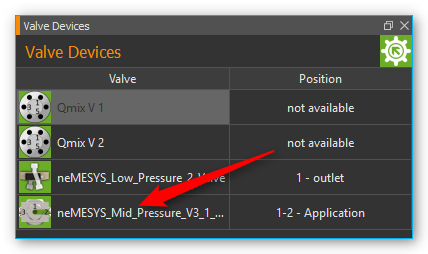

Wenn Sie später ein
Ventil nicht mehr benötigen, können Sie es über die Ventilliste wieder
löschen. Klicken Sie dafür mit der rechten Maustaste auf das
entsprechende Ventil in der Liste und wählen Sie den Menüpunkt :menuselection:`Delete Valve`.

.. image:: ./Pictures/10000000000001AC00000091DBC619732FF93701.png
   :alt: Externes Ventil löschen

Das Ventil wird dann aus der
Liste entfernt und wenn Sie es einer Pumpe zugewiesen haben auch aus dem
Bedienpanel der Pumpe.

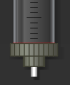

.. |image9| image:: Pictures/10000000000000460000005571CC2832E2E47223.png
   :width: 60

.. |image10| image:: Pictures/1000000000000046000000555AB1B48CFF3950BB.png
   :width: 60

.. include:: nemesys2_direktsteuerung_DE.inc.rst
.. include:: nemesys3_kontiflow_DE.inc.rst
.. include:: nemesys4_scriptfunktionen_DE.inc.rst
