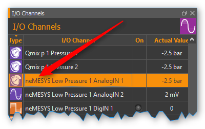
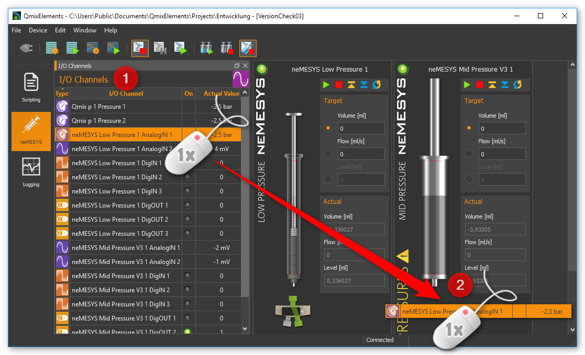
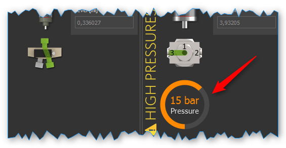
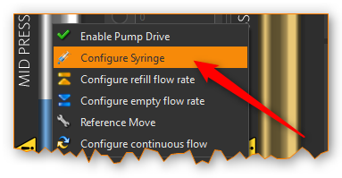
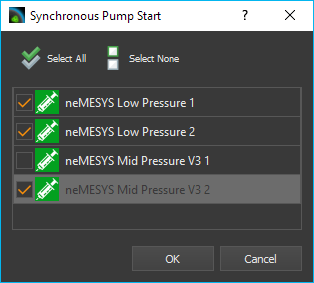
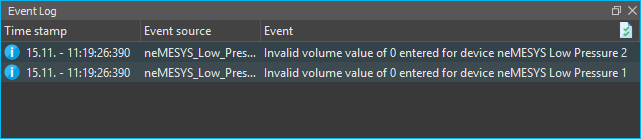

Drucküberwachung
----------------

.. admonition:: Vorsicht
   :class: error
  
   Bei der Dosierung mit den Nemesys-Pumpen können schnell hohe Drücke
   entstehen, die zur Beschädigung der Spritzen, des fluidischen Systems
   oder der Anwendung führen können. Um dies zu verhindern, sollten Sie den
   Druck mit Drucksensoren manuell oder automatisch überwachen.

Drucksensor zuweisen
~~~~~~~~~~~~~~~~~~~~

Sie können jeder Pumpe einen Drucksensor zuweisen. Dieser Drucksensor
wird dann auf dem Frontpanel der Pumpe angezeigt und kann zur
automatischen Drucküberwachung verwendet werden. Der Drucksensor muss
dafür nicht elektrisch an der Pumpe angeschlossen sein. Sie können jeden
Drucksensor dafür verwenden, der in der Liste der I/O Kanäle angezeigt
wird (siehe Abbildung unten).

.. admonition:: Tipp
   :class: tip

   Um einen beliebigen analogen Eingang als       
   Druckmesseingang verwenden zu können, müssen Sie diesen  
   ggf. vorher konfigurieren. Details zur :ref:` I/O-Kanal Konfiguration` 
   finden Sie im Kapitel zum Qmix I/O Plugin. 

Um einer Pumpen einen Drucksensor zuzuweisen, ziehen Sie den Drucksensor
einfach aus der Liste der I/O-Kanäle per Drag & Drop auf das Frontpanel
der Pumpe:

Sobald Sie die
Maustaste loslassen, wird der Drucksensor in das Bedienpanel der Pumpe
eingefügt. Der Drucksensor wird Ihnen nun in Form eines digitalen
Manometers unterhalb der Spritze, oder wenn ein Ventil vorhanden ist
unterhalb des Ventils, angezeigt (Abbildung unten).

Je nach gemessenem Druck,
verändert sich die Färbung der Anzeige. So können Sie schnell und auf
einem Blick erkennen, wie weit sich der Druck bereits dem Drucklimit
genähert hat.

.. image:: Pictures/100002010000023A0000009D1764E18592831F2C.png
   :alt: Drucksensoranzeige bei unterschiedlichen Drücken

.. admonition:: Wichtig
   :class: note

   Sie können einer Pumpe immer nur einen Drucksensor zuweisen.  

Wenn Sie später den Original-Sensor der Pumpe wieder herstellen möchten,
wählen Sie im Kontextmenü der Druckanzeige den Punkt :menuselection:`Restore Default Pressure Sensor`.

.. image:: Pictures/1000020100000139000000B4CE10195A7B1DFEB5.png
   :alt: ursprünglichen Drucksensor der Pumpe wiederherstellen

Drucküberwachung konfigurieren
~~~~~~~~~~~~~~~~~~~~~~~~~~~~~~~~

Wenn Sie einer Pumpe einen Drucksensor zugewiesen haben, können Sie für
diese Pumpe die Drucküberwachung konfigurieren. Mit aktivierter
Drucküberwachung wird der aktuelle Systemdruck permanent überwacht und
beim Über- oder Unterschreiten von Grenzwerten wird eine bestimmte
Aktion, wie z.B. der Stop der Pumpe, ausgelöst.

Um die Drucküberwachung zu konfigurieren gehen Sie wie folgt vor.

.. rst-class:: steps

#. Klicken Sie mit rechten Maustaste auf die Druckanzeige und wählen
   Sie aus dem Kontextmenü :menuselection:`Configure Pressure Monitoring` (siehe
   Abbildung unten).

   .. image:: Pictures/1000020100000144000000B30A56CA320F030E21.png

#. Der Dialog zur Drucksensorkonfiguration wird angezeigt (Abbildung unten).

   .. image:: Pictures/100002010000018000000216A8684657BB7011FA.png

#. Definieren Sie einen sicheren Bereich durch Eingabe eines unteren
   (*Lower Limit*) und oberen Grenzwertes (*Upper Limit*) :guinum:`❷`. Der obere
   Grenzwert ist durch den zulässigen Maximaldruck des Systems
   beschränkt. Dieser maximale Systemdruck wird durch den maximalen
   Druck der Spritze, des Ventils, des Drucksensors und durch die
   maximale Kraft der Antriebseinheit bestimmt.

#. Bestimmen Sie, durch Auswahl der entsprechenden Schaltfläche, was
   beim Unterschreiten des unteren Grenzwertes (:guilabel:`Underrun Action`)
   :guinum:`❸` und Überschreiten des oberen Grenzwertes (:guilabel:`Overrun Action`)
   geschehen soll.

#. Wählen Sie aus, für welche Pumprichtung die Überwachung aktiv sein
   soll. Sie können das Aufziehen, das Dosieren oder beide Richtungen
   überwachen lassen. Die empfohlene Standardeinstellung ist die
   Überwachung der Dosierung. Mit dieser Einstellung wird die Pumpe bei
   Überdruck gestoppt und Sie können trotzdem problemlos durch
   Aufziehen den Überdruck wieder abbauen.

#. Kontrollieren Sie, dass die Schaltfläche :guilabel:`Monitoring enabled` :guinum:`❶`
   aktiv ist. Andernfalls ist die konfigurierte Drucküberwachung
   inaktiv.

#. Übernehmen Sie die konfigurierte Drucküberwachung durch Betätigen
   der Schaltfläche :guilabel:`OK` :guinum:`❺`.

Im Bereich *Overrun* und *Underrun Action* :guinum:`❸` stehen folgende Aktionen
zur Auswahl:

-  **Do Nothing** – Das Verlassen des sicheren Bereichs wird ignoriert.
   Das Nemesys-Modul setzt die laufende Dosierung fort. Es wird keine
   Information oder Warnung ausgegeben
-  **Warn Only** – Beim Verlassen des sicheren Bereichs wird eine
   Warnmeldung ausgegeben. Das Nemesys-Modul setzt die laufende
   Dosierung fort.
-  **Stop Pump Drive** – Beim Verlassen des sicheren Bereichs wird die
   laufende Dosierung gestoppt. Zusätzlich wird eine Warnmeldung
   ausgegeben.
-  **Disable Voltage** – Das Dosiermodul wird durch Abschalten der
   Motorspannung gestoppt. Wird die Motorspannung weggeschaltet, kann
   der Spritzenkolben durch aufgebauten Druck verschoben werden.
   Zusätzlich wird eine Warnmeldung ausgegeben. Um die Pumpe wieder
   verwenden zu können, muss sie erst wieder aktiviert werden (siehe
   Abschnitt :ref:`Deaktivierte Pumpe wieder aktivieren <deaktivierte_pumpe_aktivieren>`)

Drucküberwachung verwenden
~~~~~~~~~~~~~~~~~~~~~~~~~~

Beim Dosieren können schnell hohe Drücke entstehen, die das Ventil oder
den Drucksensor beschädigen können. Deshalb ist besonders die
Überwachung des Überdrucks in Dosierrichtung wichtig. Ob die
Drucküberwachung aktiv ist, sehen Sie an dem kleinen Schild-Symbol
welches bei aktivierter Drucküberwachung in die Druckanzeige
eingeblendet wird (siehe Abbildungen unten). Nur wenn für den Überdruck
eine Aktion konfiguriert wurde, die zum Stop der Pumpe führt, wird das
Schild-Symbol orange dargestellt. Wenn bei der Überdrucküberwachung eine
Aktion gewählt wurde, die lediglich eine Warnung ausgibt, dann wird das
Schild ausgegraut.

+----------------------+----------------------+----------------------+
| |monitoring1|        | |monitoring2|        | |monitoring3|        |
+----------------------+----------------------+----------------------+
| Keine                | Drucküberwachung     | Drucküberwachung     |
| Drucküberwachung     | aktiv - Pumpe wird   | aktiv – Pumpe wird   |
|                      | bei Überdruck nicht  | bei Überdruck        |
|                      | gestoppt             | gestoppt             |
+----------------------+----------------------+----------------------+

Die Pfeile in dem Schild zeigen an, für welche Pumprichtung die
Drucküberwachung aktiv ist:

============== ==============================
|mon_filling|  Fluidaufnahme (Aufsaugen) überwachen
|mon_dosing|   Fluidabgabe (Dosierung) überwachen
|mon_always|   Fluidaufnahme und Fluidabgabe überwachen
============== ==============================

.. admonition:: Tipp
   :class: tip

   Wenn die Drucküberwachung konfiguriert ist,   
   können Sie diese jederzeit über das Kontextmenü der     
   Druckanzeige ein- und ausschalten (Abbildung unten). 

.. image:: Pictures/100002010000015C000000A27069F23A3292D42D.png
   :alt: Drucküberwachung ein- und ausschalten

.. admonition:: Wichtig
   :class: note

   Wenn Sie einen zugewiesenen Drucksensor    
   wieder entfernen, z.B. durch *Restore Default Pressure  
   Sensor*, dann wird die Drucküberwachung automatisch     
   deaktiviert.  

Wenn Sie die Maus über die Druckanzeige bewegen, erhalten Sie
zusätzliche Informationen zur Drucküberwachung und zum Maximaldruck des
Sensors und des Systems.

.. _deaktivierte_pumpe_aktivieren:

Deaktivierte Pumpe wieder aktivieren
-------------------------------------

Wurde ein Nemesys-Modul durch eine Überwachungsfunktion deaktiviert,
ändert sich die Farbe der LED im Bedienpanel der Pumpe von grün :guinum:`❶` auf
rot :guinum:`❷`.

.. image:: Pictures/1000000000000205000000E324C478DCDA68618B.png
   :alt: Anzeige des Pumpenstatus

Um die Pumpe wieder verwenden
zu können, müssen Sie sie aktivieren. Klicken sie hierzu mit der rechten
Maustaste in das Bedienpanel der Pumpe und wählen Sie aus dem
Kontextmenü den Punkt :menuselection:`Enable Pump Drive` (siehe Abbildung unten).

.. image:: Pictures/1000020100000226000000B397F3BA342CB9289C.png

Spritzenkonfiguration
---------------------

Einführung
~~~~~~~~~~

Die Software bietet Ihnen komfortable Möglichkeiten, Ihre eigenen
Spritzen zu konfigurieren und zu verwalten. Die Konfiguration und die
Verwendung bestimmter Spritzen in der Software erfüllen dabei zwei
Aufgaben:

#. Alle Flussraten und Volumina in der Software werden auf Basis der
   konfigurierten Spritze berechnet.
#. Die konfigurierte Spitzenlänge und die eingestellten Limits begrenzen
   die Bewegung des Kolbens.

Konfigurationsdialog aufrufen
~~~~~~~~~~~~~~~~~~~~~~~~~~~~~

Die Bediensoftware zeigt stets für jede Dosiereinheit die aktuelle
Flussrate an. Um die Flussrate berechnen zu können, benötigt das
Programm die Kennwerte der 30 6 Nemesys Plugin jeweils verwendeten
Spritze. Diese Werte sollten bei jedem Wechsel der Spritze von Ihnen
ordnungsgemäß konfiguriert werden. 

Klicken Sie dafür mit der
rechten Maustaste in die Darstellung der Spritze der Achse, die Sie
konfigurieren möchten. In dem Menü, welches erscheint, wählen Sie den
Menüpunkt :menuselection:`Configure Syringe`. Wählen Sie dann, wie in der Abbildung
oben dargestellt, die entsprechende Spritze aus, die Sie konfigurieren
möchten. Es wird dann der *Spritzenauswahldialog* gestartet.

.. admonition:: Wichtig
   :class: note

   Beachten Sie dass beim Wechsel der Spritze 
   die Aufziehgeschwindigkeit und die                      
   Entleergeschwindigkeit dieser Dosiereinheit auf 0       
   zurückgesetzt werden. D.h. nach jedem Spritzenwechsel   
   müssen Sie diese Werte neu konfigurieren.    

Spritzenauswahldialog
~~~~~~~~~~~~~~~~~~~~~

In diesem Dialog können Sie aus einer Liste von vorhandenen und
vordefinierten Spritzen die gewünschte Spritze auswählen. Folgende
Möglichkeiten stehen Ihnen hier zur Verfügung:

.. image:: Pictures/1000020100000378000002404EDC1DC325F1526C.png
   :alt: Spritzenauswahldialog

1. In der Listenansicht :guinum:`❶` werden alle Spritzen angezeigt, die Sie bereits
   zu einem früheren Zeitpunkt erstellt haben. Enthält die Liste eine
   passende Spritze, können Sie diese auswählen und den Dialog durch
   klicken auf :guilabel:`Apply Syringe` beenden. Alternativ können Sie eine
   Spritze auch einfach durch einen Doppelklick auf die Spritze
   auswählen.
2. Befindet sich in der Liste keine passende Spritze, kann durch einen
   Klick auf die Schaltfläche :guilabel:`Create` :guinum:`❷` eine neue Spritze angelegt
   werden. Ein Klick die Schaltfläche :guilabel:`Edit` öffnet ein Fenster zum
   Bearbeiten der Spitzenparameter der aktuell markierten Spritze. Durch
   Anklicken der Schaltfläche :guilabel:`Delete` können Sie die ausgewählte
   Spritze aus der Liste entfernen. Das Entfernen ist auch durch das
   Drücken der :kbd:`Delete`-Taste möglich.
3. Auf der rechten Seite sehen Sie ein Vorschaubild :guinum:`❸` der ausgewählten
   Spritze und alle Spritzenparameter.
4. Die Auswahl kann jederzeit durch Klicken auf :guilabel:`Apply Syringe` 
   :guinum:`❹` abgeschlossen oder durch Klicken auf :guilabel:`Cancel` abgebrochen werden.

Liste der vorhandenen Spritzen
~~~~~~~~~~~~~~~~~~~~~~~~~~~~~~

Die Liste mit den vorhandenen Spritzen zeigt alle vorhandenen Spritzen
in tabellarischer Form an. Sie enthält sowohl die von CETONI definierten
Standardspritzen als auch die vom Anwender erstellten Spritzen. Am
Symbol in der ersten Spalte können Sie erkennen, ob es sich um eine
Standardspritze oder eine anwenderspezifische Spritze handelt:

========== ============================
|syringe1| Standardspritze von CETONI
|syringe2| Anwenderspezifische Spritze
========== ============================

.. admonition:: Wichtig
   :class: note

   Vordefinierte Spritzen können nicht editiert oder gelöscht werden. 

Folgende Spalten finden Sie in der Spritzenliste:

- **Name** - Eindeutiger Name der Spritze. Spritzen mit gleichem Namen sind nicht erlaubt.             

- **Material** - Stahl oder Glas – die Spritze wird in der Software entsprechend dargestellt.                

- **Max. Pressure (bar)** - Der Maximaldruck – wichtig für die Drucküberwachung.                      

- **Suited for pump** - Zeigt an, für welche Pumpe diese Spritze geeignet ist. 
  Ist dieses Feld leer, ist es eine Spritze die vom Anwender 
  erstellt wurde.

.. admonition:: Tipp
   :class: tip

   Wenn Sie in den Spaltenkopf einer Spalte      
   klicken, wird die Spritzenliste nach dieser Spalte      
   sortiert. Dies wird Ihnen durch einen kleinen Pfeil     
   über dem Titel angezeigt. Durch einen erneuten Klick in 
   die gleiche Spalte, können Sie die Sortierung umkehren. 

Um in der Liste nach einer bestimmten Spritze zu suchen,
klicken Sie einfach mit der rechten Maustaste eine Zelle in der Spalte
an, welche Sie durchsuchen möchten. Meistens wird dies die Spalte
*Name* sein. Aus dem Kontextmenü welches dann angezeigt wird, wählen
Sie den Menüpunkt :menuselection:`Search in column`.

Ihnen wird ein Suchfeld angezeigt, in dem Sie Ihren Suchtext :guinum:`❶` eingeben
können.

.. image:: Pictures/100002010000015D000000EFB70D100D1CA3DEDA.png
   :alt: Suchdialog für Spritzen

Während des Tippens wird Ihnen
eine Liste mit möglichen Treffern angezeigt :guinum:`❷`. Sobald ein passender
Treffer dabei ist, wählen Sie diesen mit den Cursortasten aus oder
klicken Sie den Eintrag mit der Maus an. Der Suchdialog wird geschlossen
und in der Liste der Spritzen wir die gefundene Spritze farblich
markiert.

Spitzenparameter konfigurieren
~~~~~~~~~~~~~~~~~~~~~~~~~~~~~~

Wenn Sie die Schaltfläche :guilabel:`Create` oder :guilabel:`Edit` anklicken, wird
der Assistent zur Konfiguration der Spritzenparameter (*Syringe
Configuration Wizard*) geöffnet. 

.. image:: Pictures/100002010000019A0000002FF7133A8CD9E5221A.png

Um die Spritze zu konfigurieren, führen Sie bitte die folgenden Schritte durch:

.. rst-class:: steps

#. Vergeben Sie als erstes einen eindeutigen Namen für die Spritze im
   Feld :guilabel:`Unique syringe name` :guinum:`❶` (Abbildung unten). Wenn Sie eine
   Spritze zum Editieren ausgewählt haben und nur deren Namen ändern,
   können Sie damit eine Kopie der ausgewählten Spritze erzeugen.
   Wählen Sie dann das Material :guinum:`❷` der Spritze aus. Klicken Sie auf
   :guilabel:`Next` um zum nächsten Schritt zu gelangen.

   .. image:: Pictures/1000020100000288000001A4EEE8573B18AE8967.png
      :alt: Spritzenkonfiguration Schritt 1 - Namen eingeben

#. Sie sollten nun den inneren Spritzendurchmesser
   konfigurieren. Der innere Spritzendurchmesser wird benötigt für die
   Berechnung von Flussraten und Dosiermengen. Sollten Sie nicht über
   den Innendurchmesser verfügen, können Sie den Innendurchmesser
   alternativ auch über die Skalenlänge in mm (:guilabel:`Scale length`) und das
   darin enthaltene Volumen in μl (:guilabel:`Scale volume`) definieren. Die
   Software errechnet daraus dann den inneren Spritzendurchmesser.
   Wählen Sie in diesem Schritt aus, wie Sie den
   Spritzeninnendurchmesser konfigurieren möchten (Abbildung unten). Je
   nach Auswahl setzen Sie die Konfiguration mit Punkt **(3)** oder **(4)** fort.
   Klicken Sie auf :guilabel:`Next` um zum nächsten Schritt zu gelangen.

   .. image:: Pictures/100002010000028800000185AF36898A33DA145C.png
      :alt: Spritzenkonfiguration Schritt 2 - Methode wählen

#. Konfigurieren Sie den Innendurchmesser der Spritze indem Sie die
   Skalenlänge und das Volumen innerhalb dieser Skalenlänge angeben
   (Abbildung unten). Messen Sie dafür die Skala mit einem
   entsprechenden Messmittel (Messschieber) aus und entnehmen Sie den
   Volumenwert der Beschriftung der Skala. Klicken Sie dann auf :guilabel:`Next`
   um zum nächsten Schritt zu gelangen und lesen Sie weiter bei Punkt **(5)**.

#. Konfigurieren Sie den Innendurchmesser der Spritze indem Sie diesen
   mit einem Messschieber ermitteln. Tragen Sie den Wert dann in das
   Feld :guilabel:`Inner Syringe Diameter` ein und Klicken Sie dann auf 
   :guilabel:`Next` um zum nächsten Schritt zu gelangen.

   .. image:: Pictures/100002010000028800000162E28D58A7BA62F4FD.png
      :alt: Spritzenkonfiguration Schritt 4 - Innendurchmesser eingeben

#. Konfigurieren Sie nun den Kolbenhub (:guilabel:`Piston Stroke`) der
   Spritze (Abbildung unten). Der Kolbenhub ist die maximale Länge, die
   der Kolben in der Spritze bewegt werden kann, ohne dass diese
   undicht wird und Flüssigkeit austritt. Empfehlenswert ist es, hier
   die Länge der Skala auf der Spritze als maximalen Kolbenhub zu
   verwenden.

   .. image:: Pictures/1000020100000288000001628DA24CB3EDC0A2EF.png
      :alt: Spritzenkonfiguration Schritt 5 - Kolbenhub

   Werden in
   einem Mehrfachspritzenhalter Spritzen unterschiedlicher Länge verwendet,
   so begrenzt die spritze mit dem geringsten Kolbenhub den Verfahrbereich
   des Antriebs. Wenn Sie den Kolbenhub angegeben haben, errechnet Ihnen
   die Software daraus und aus dem Innendurchmesser das maximal dosierbare
   Volumen.

#. Legen Sie nun die Limits für den maximalen und den minimalen
   Spritzenfüllstand (Abbildung unten) fest. Sie können dadurch den
   Verfahrbereich des Kolbens durch zwei zusätzliche Software-Limits
   begrenzen. Sie können diese Parameter wahlweise in Mikrolitern oder
   Millimetern angeben. Sie sollten diese Werte z.B. beim Einsatz eines
   Spritzenrührers verwenden, um den Verfahrbereich zu begrenzen. Wenn
   Sie den Wert in einer Einheit eingeben (z.B. Millimeter) wird der
   Wert der anderen Einheit (z.B. Mikroliter) von der Software
   ermittelt.

   .. image:: Pictures/100002010000028800000162919C8B52DB5AA3E1.png
      :alt: Spritzenkonfiguration Schritt 6 - Limits
 
   Die Spritzenvorschau auf der linken Seite, zeigt Ihnen stets die aktuelle
   Konfiguration der Spritze an. Die Breite der Spritze ändert sich mit der
   Änderung des Innendurchmessers. Die Länge der Spritze ändert sich, durch
   die Änderung des maximalen Kolbenhubes und die zwei roten Markierungen
   auf der Spritze zeigen die zwei zusätzlichen Limits an. Entsprechend
   dieser Vorschau wird die Spritze dann auch später in der Software
   dargestellt.

#. Abschließend geben Sie den maximalen Druck, mit dem die Spritze
   verwendet werden kann, an. Dieser Wert ist gleich dem maximalen
   Wert, den sie bei der Konfiguration einer Drucküberwachung angeben
   können. (siehe Abschnitt `Drucküberwachung`_)

   .. image:: Pictures/100002010000028800000162A0AA05D585AC109D.png
      :alt: Spritzenkonfiguration Schritt 7 - Maximaldruck

#. Schließen Sie die Konfiguration der Spritzenparameter
   durch einen Klick auf die Schaltfläche :guilabel:`Finish` ab. Sie können die
   Konfiguration jederzeit durch Drücken der Schaltfläche :guilabel:`Cancel`
   abbrechen. Mit der Schaltfläche :guilabel:`Back` können Sie stets zum
   vorherigen Konfigurationsschritt zurückkehren.

Konfiguration der SI Einheiten
------------------------------

Bei der Dosierung von Fluidströmen sind die verwendeten Flussraten und
die zu dosierenden bzw. bereits dosierten Flüssigkeitsmengen die
wesentlichen Parameter. Für eine optimale Anpassung an die jeweilige
Applikation können vom Anwender die SI-Einheiten für die Darstellung von
Flussraten und Volumina für jede einzelne Dosiereinheit individuell
konfiguriert werden. Um den SI-Dialog anzuzeigen, klicken Sie mit der
rechten Maustaste in das Bedienpanel der Pumpe um das Kontextmenü
anzuzeigen.

.. image:: Pictures/100000000000022E000000C19B0C9EFBDA77502B.png
   :alt: Kontextmenü Pumpe

Wählen Sie dann den Menüpunkt :menuselection:`Select Volume Unit` um die SI-Einheit 
für Volumina zu konfigurieren oder :menuselection:`Select Flow Unit` um die Einheit 
für die Flussrate zu wählen. Ihnen
wird dann ein Fenster zur Einstellung der SI-Einheit angezeigt.

.. image:: Pictures/1000000000000145000000BEBA39AC007BF75722.png
   :alt: Konfiguration SI-Einheit Volumen / Flussrate

Stellen Sie hier die gewünschte SI-Einheit ein und Beenden Sie den Dialog durch
Anklicken von :guilabel:`OK`.

Direktsteuerung
---------------

Übersicht
~~~~~~~~~

.. image:: Pictures/100002010000009E000001A84E67845F7A6B164B.png

Verwenden Sie die Direktsteuerung zur interaktiven Steuerung
der Dosiereinheiten. Dosieren Sie damit genau definierte
Flüssigkeitsmengen mit definierten Flussraten oder erzeugen Sie
konstante Fluidströme.

Weiterhin werden Ihnen in der Direktsteuerung die aktuellen Werte für
die Flussrate, das dosierte Volumen und den aktuellen Füllstand der
Spritze angezeigt. Wenn Sie ein Hochdruckmodul verwenden, wird Ihnen
hier zusätzlich der aktuelle Druck des Drucksensors angezeigt.

Folgende Bedien- und Anzeigeelemente sind vorhanden:

.. rst-class:: guinums

1. Werkzeugleiste
2. Soll-Werte der Dosiereinheit
3. Aktuelle Ist-Werte der Dosiereinheit

Werkzeugleiste
~~~~~~~~~~~~~~

Die Werkzeugleiste enthält Schaltflächen zum Starten von
Dosiervorgängen. Folgende Schaltflächen stehen Ihnen zur Verfügung:

========== =========================================================================
|toolbar1| Dosiervorgang mit eingestellten Soll-Werten starten
|toolbar2| Dosiervorgang stoppen
|toolbar3| Reagenz aufnehmen - Dosiereinheit wird bis zur Maximalposition verfahren 
|toolbar4| Spritze entleeren - Dosiereinheit wird bis zur Minimalposition verfahren
|toolbar5| Kontinuierlichen Fluss konfigurieren 
========== =========================================================================

.. admonition:: Achtung
   :class: caution

   Gefahr der Beschädigung der Spritze beim   
   Entleeren! Die Dosiereinheit wird beim Spritze          
   entleeren je nach Konfiguration mit hoher               
   Geschwindigkeit Richtung untere Endlage gefahren.

Soll-Werte
~~~~~~~~~~

Art der Dosierung wählen
^^^^^^^^^^^^^^^^^^^^^^^^

.. image:: Pictures/10000201000000820000009E49BC52210132F79C.png

Mit den Auswahlfeldern auf der linken Seite bestimmen Sie die Art der Dosierung.

Folgende Möglichkeiten stehen Ihnen zur Verfügung:

-  **Volume** - Wählen Sie
   diesen Modus um ein bestimmtes Volumen mit einer definierten
   Flussrate zu dosieren.
-  **Flow** - In diesem Modus erzeugen Sie einen konstanten Fluidstrom.
   Die Dosierung erfolgt dabei so lange bis eine Endlage erreicht wurde
   oder bis der Dosiervorgang durch Sie gestoppt wird. 42 6 Nemesys
   Plugin Abbildung 6.15: Art der Dosierung wählen
-  **Syringe Level** - In diesem Modus können Sie gezielt einen bestimmten
   Füllstand der Spritze bestimmen, welcher mit einer definierten
   Flussrate erreicht werden soll.

Flussrate und Fördervolumen einstellen
^^^^^^^^^^^^^^^^^^^^^^^^^^^^^^^^^^^^^^

Für die Eingabe von Flussrate, Fördervolumen oder Spritzenfüllstand
nutzen Sie bitte die Werteingabefelder :guilabel:`Volume`, :guilabel:`Flow` und 
:guilabel:`Syringe Level`. Das Einstellen der Sollwerte führt noch nicht zu einem Start der
Antriebe bzw. zu einer Änderung der aktuellen Flussrate. Erst beim Start
eines Dosiervorganges durch Drücken der :guilabel:`Start`-Schaltfläche in der
Werkzeugleiste werden die neuen Werte zur Dosiereinheit übertragen.

Volumendosierung
^^^^^^^^^^^^^^^^

Wenn Sie ein bestimmtes Volumen dosieren möchten, müssen Sie die Werte
für da zu dosierende Volumen und die Flussrate eingeben. Der Volumenwert
wird relativ zu der aktuellen Position des Spritzenkolbens eingegeben.
Das heißt, zur Aufnahme von Reagenz (aspirieren) geben Sie bitte ein
negatives Volumen ein und zur Reagenzabgabe (dispensieren) ein positives
Volumen. Die Flussrate ist in dieser Betriebsart stets ein positiver
Wert und kennzeichnet, mit welcher Flussrate die Reagenzaufnahme /
-abgabe erfolgen soll.

Konstante Flussrate
^^^^^^^^^^^^^^^^^^^

Um einen kontinuierlichen Fluidstrom zu erzeugen, wird nur die Flussrate
benötigt, und das Volumen-Eingabefeld ist für Eingaben gesperrt. Die
Flussrate kann in diese Betriebsart sowohl positiv als auch negativ
sein. Ein negativer Wert kennzeichnet wieder die Reagenzaufnahme und ein
positiver Wert die Reagenzabgabe.

Spritzenfüllstand setzen
^^^^^^^^^^^^^^^^^^^^^^^^

Einen genau definierten Spritzenfüllstand können Sie erreichen, wenn Sie
die Werte für den Spritzenfüllstand und die Flussrate eingeben. Der
Spritzenfüllstand muss ein positiver Wert sein, der zwischen dem
Minimal- und dem Maximalwert des Spritzenfüllstandes liegt (siehe
Abschnitt
`Spritzenkonfiguration`_). Die
Flussrate ist in dieser Betriebsart stets ein positiver Wert und
kennzeichnet, mit welcher Flussrate die Reagenzaufnahme / -abgabe
erfolgt.

.. admonition:: Achtung
   :class: caution

   Gefahr der Beschädigung des Ventils oder   
   fluidischer Verbindungen. Durch hohe Flussraten können  
   sehr schnell hohe Drücke entstehen, die zur             
   Beschädigung des Ventils, fluidischer Verbindungen oder 
   Ihrer Applikation führen können.  

.. admonition:: Wichtig
   :class: note

   Wählen Sie zur Dosierung kleinster         
   Flussraten Spritzen mit geringem Innendurchmesser aus,  
   um eine pulsationsfreie Dosierung zu gewährleisten.    

Ist-Werte
---------

In dem Bereich :guilabel:`Actual Values` werden die aktuellen vom Gerät gemeldeten Werte
angezeigt.

.. image:: Pictures/10000201000000A3000000D936035CE9D70E6F8F.png
   :alt: Ist-Werte

Das Feld :guilabel:`Flow` zeigt die Flussrate, die
durch die Dosiereinheit im Moment realisiert wird. Das Feld :guilabel:`Volume`
zeigt das Volumen an, das seit dem letzten Start der Dosiereinheit
gefördert wurde. Wird der Antrieb gestoppt und erneut gestartet, wird
der Ist-Wert für das geförderte Volumen auf 0 zurückgesetzt. Das Feld
:guilabel:`Syringe Level` zeigt den aktuellen Füllstand der Dosiereinheit in der
konfigurierten SI Volumeneinheit an.

Pumpen synchron starten /stoppen
--------------------------------

In der Hauptwerkzeugleiste finden Sie zwei Schaltflächen zum
gleichzeitigen Starten / Stoppen mehrerer Pumpenmodule.

Wenn Sie auf die :guilabel:`Sync Start`-Schaltfläche :guinum:`❶` klicken, 
wird Ihnen ein Auswahldialog angezeigt,
in dem Sie die Pumpen auswählen, die Sie gleichzeitig starten möchten
(Abbildung unten).

Setzen Sie hier für
jede Pumpe die Sie starten möchten ein Häkchen. Sobald Sie auf die
Schaltfläche :guilabel:`OK` klicken, wird die Dosierung für alle ausgewählten
Pumpen gestartet.

.. admonition:: Wichtig
   :class: note

   Vor dem Start müssen die Dosierparameter   
   (Volumen, Flussrate) aller ausgewählten Pumpen im       
   Bedienpanel jeder Pumpe entsprechend konfiguriert       
   werden.     

Vor dem Start der Pumpen, prüft die Software die konfigurierten
Dosierparameter aller ausgewählten Pumpen. Werden dabei ungültige
Parameter gefunden (z.B. Fluss- oder Volumenwerte von 0), wird der
Synchronstart nicht durchgeführt. Im Ereignisprotokoll (*Event Log*) der
Anwendung erhalten Sie dann Informationen zu den gefundenen Problemen.

.. image:: Pictures/stop_all.svg
   :width: 60
   :align: left

Wenn Sie auf die :guilabel:`Stop All`-Schaltfläche :guinum:`❷` klicken, werden 
sofort alle Pumpen gestoppt.*

|

.. |monitoring1| image:: Pictures/100002010000006B0000006B365777AF0E6D78EE.png
.. |monitoring2| image:: Pictures/100002010000006B0000006B74DCFA441C7082B3.png
.. |monitoring3| image:: Pictures/100002010000006B0000006BB08163BBBD4A5EC9.png

.. |mon_filling| image:: Pictures/10003607000035050000350533EA6BA84CD29399.svg
   :width: 60

.. |mon_always| image:: Pictures/1000054600003505000035050DAB3DA9ED765957.svg
   :width: 60

.. |syringe1| image:: Pictures/1005A3140000109100001091CCFB5CA93067BCC0.svg
   :width: 60
.. |syringe2| image:: Pictures/100008110000350500003505F16041283C2D49B0.svg
   :width: 60

.. |toolbar1| image:: Pictures/100009810000388C0000388C3CA31C917CCAEF69.svg
   :width: 40
.. |toolbar2| image:: Pictures/100009170000388C0000388C5FBCE4289669598A.svg
   :width: 40
.. |toolbar3| image:: Pictures/10000A5A0000350500003505C28D88992FBDF5DF.svg
   :width: 40
.. |toolbar4| image:: Pictures/10000A63000035050000350551F1D5FC8C214918.svg
   :width: 40
.. |toolbar5| image:: Pictures/10006B24000034EB000034EB2B72B9A4AEDF2E9A.svg
   :width: 40
