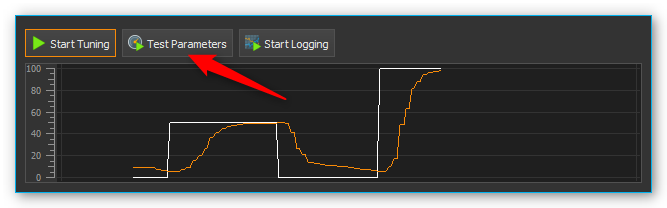
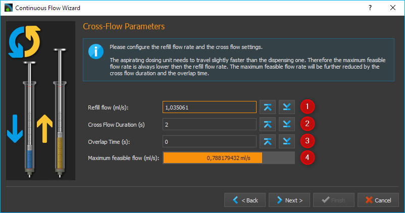
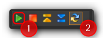
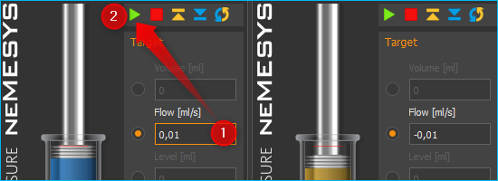

Kontinuierlicher Fluss
----------------------

Einführung
~~~~~~~~~~

In der Betriebsart Kontinuierlicher Fluss können Sie je zwei Pumpen in
der Software miteinander koppeln, um über wechselseitige Fluidaufnahme
und -abgabe einen kontinuierlichen Fluss über einen langen Zeitraum zu
erzeugen. Dabei dosiert eine der beiden Pumpen mit einer bestimmten
Flussrate in die Anwendung, während die andere Pumpe in dieser Zeit
Reagenz aus dem Reservoir aufnimmt. Wenn die dosierende Pumpe die
Spritze entleert hat, schaltet die Software automatisch auf die zweite
Dosiereinheit mit der vollen Spritze um und setzt den Dosiervorgang mit
dieser Pumpe fort. Dadurch entsteht ein kontinuierlicher,
ununterbrochener Fluss, mit dem Sie eine nahezu unbegrenzte Zeit lang
mit einer konstanten Flussrate dosieren können.

Bedien- und Anzeigeelemente
~~~~~~~~~~~~~~~~~~~~~~~~~~~

Wenn für eine Dosiereinheit der kontinuierliche Fluss konfiguriert
wurde, können Sie dies daran erkennen, dass im Bereich Direktsteuerung
die Schaltfläche mit dem Symbol für den kontinuierlichen Fluss gedrückt
ist (siehe Abbildung).

.. image:: Pictures/1000000000000234000000666822C5C8CC8265D0.png
   :alt: Anzeige Betriebsart kontinuierlicher Fluss

Die Betriebsart kontinuierlicher Fluss wird automatisch beendet, sobald Sie
die Spritzenkonfiguration einer der beiden verbundenen Dosiereinheiten
ändern. Sie müssen in diesem Fall alle Parameter erneut konfigurieren.
Wenn für eine Dosiereinheit der kontinuierliche Fluss aktiv ist, werden
im Bedienpanel die Anzeigeelemente (*Continuous flow*) für die Anzeige
des Status des kontinuierlichen Flusses eingeblendet (Abbildung unten).

.. image:: Pictures/1000000000000235000000E8395960DBE1D49010.png
   :alt: Statusanzeige kontinuierlicher Fluss

Folgende Anzeigeelemente sind dann sichtbar:

-  **Remaining time** - Die Restzeit zeigt die verbleibende Zeit für die
   kontinuierliche Dosierung an. Wenn diese Anzeige den Wert Null
   erreicht, wird der kontinuierliche Fluss automatisch gestoppt.
-  **Accumulated volume [ml]** - Das akkumulierte dispensierte Volumen
   zeigt die Summe der Volumina an, welche bisher von beiden Pumpen in
   die Anwendung dosiert wurden.
-  **Linked pump** - Die verbundene Pumpe ist die zweite Pumpe die mit
   dieser Pumpe zum kontinuierlichen Fluss verbunden ist.

Kontinuierlichen Fluss konfigurieren
~~~~~~~~~~~~~~~~~~~~~~~~~~~~~~~~~~~~

Um einen kontinuierlichen Fluss zu erzeugen, benötigen Sie mindestens
zwei Nemesys Dosiereinheiten. Beide Einheiten sollten über ein Ventil
verfügen. Um den kontinuierlichen Fluss zu konfigurieren, klicken Sie
mit der rechten Maustaste in das Bedienpanel der Direktsteuerung und
wählen im Kontextmenü :menuselection:`Configure continuous flow` (Abbildung unten).

Es erscheint
ein Konfigurationsdialog. Die Dosiereinheit, in deren Bedienpanel Sie
die Konfiguration des kontinuierlichen Flusses aufrufen, ist die Erste
der beiden Dosiereinheiten die miteinander verbunden werden. Wurde für
die Dosiereinheit noch kein kontinuierlicher Fluss konfiguriert, dann
können Sie den Konfigurationsdialog auch durch Drücken der Schaltfläche
:guilabel:`Continuous Flow` in der Direktsteuerung aufrufen (Abbildung unten).

.. image:: Pictures/10000000000000AC00000042C7E1513050994EA1.png

Wenn Sie nach dem Aufruf des Dialogs die folgende
Konfigurationsseite sehen (siehe Abbildung unten), dann wurde eine
vorher eingestellte Konfiguration erfolgreich geladen und Sie müssen nur
noch die :guilabel:`Finish`-Schaltfläche anklicken, um die Konfiguration zu
übernehmen. 

.. image:: Pictures/1000020100000322000001FBE37231369011B166.png
   :alt: Konfigurationsparameter für den kontinuierlichen Fluss erfolgreich geladen

Wenn Sie nur bestimmte Parameter der geladenen
Konfiguration ändern möchten, blättern Sie einfach durch Anklicken der
:guilabel:`Next`-Schaltfläche durch die einzelnen Seiten des
Konfigurationsassistenten.

Zweite Dosiereinheit wählen
~~~~~~~~~~~~~~~~~~~~~~~~~~~

.. image:: Pictures/1000020100000322000001A528FAB18020B1F28A.png
   :alt: Zweite Dosiereinheit wählen

Auf dieser Seite
Konfigurationsdialogs wählen Sie aus der Liste der verfügbaren
Dosiereinheiten (Abbildung ) die zweite Dosiereinheit für den
kontinuierlichen Fluss aus. Wenn kein Konfiguration geladen wurde, ist
dies die erste Seite des Konfigurationsassistenten. Wählen Sie die
Dosiereinheit aus, indem Sie den Namen in der Liste anklicken. Klicken
Sie dann auf die Schaltfläche *Next* um die Konfiguration fortzusetzen.

.. admonition:: Wichtig
   :class: note

   Sie sollten stets zwei Dosiereinheiten für  
   den kontinuierlichen Fluss auswählen, die unmittelbar    
   miteinander verbunden sind und in der Software           
   nebeneinander angezeigt werden. 

Modus des kontinuierlichen Flusses wählen
~~~~~~~~~~~~~~~~~~~~~~~~~~~~~~~~~~~~~~~~~

Für den kontinuierlichen Fluss können Sie zwischen den Folgenden
Betriebsarten wählen:

-  **Pressure Controlled Switching** - Das druckgesteuerte Schalten
   ermöglicht die besten Ergebnisse ohne Veränderung des Drucks und der
   Flussrate beim Umschalten. Dafür benötigen Sie aber für jede Pumpe
   einen Drucksensor.

-  **Cross-Flow** – Mit dem *Cross-Flow* realisieren sie einen weichen
   Übergang und eine möglichst konstante Flussrate beim Wechsel von
   einer Dosiereinheit auf die andere. Dieser Modus eignet sich, wenn
   sie mit einem geringen Systemdruck arbeiten und keine Drucksensoren
   haben.

Die einzelnen Modi werden in den nächsten Unterabschnitten im Detail
erläutert. Klicken sie mit der linken Maustaste auf die Schaltfläche
des Modus, den sie konfigurieren möchten, und anschließend auf :guilabel:`Next`
um fortzufahren.

3x2-Wege Ventile konfigurieren
~~~~~~~~~~~~~~~~~~~~~~~~~~~~~~

Während des kontinuierlichen Flusses, werden für beide Pumpen die
entsprechenden Ventile geschaltet. Im Fenster *Configure
3x2-Way Valves* (Abbildung unten) konfigurieren Sie die Ventile und die
Ventilpositionen für Ihre 3x2-Wege Ventile.

.. admonition:: Tipp
   :class: tip

   Wenn Sie Ihren Pumpen bereits Ventile          
   zugewiesen haben, werden diese Ventile hier automatisch  
   eingetragen.    

.. image:: Pictures/10000000000003400000024683286CF4C3CADAAF.png
   :alt: Ventilkonfiguration kontinuierlicher Fluss

Wählen Sie als erstes aus, was für Ventile Sie verwenden wollen :guinum:`❶`. Wenn Sie
3x2-Wege Ventile verwenden und die Betriebsart *druckgesteuertes
Umschalten* (:guilabel:`Pressure-Controlled Switching`) gewählt haben, benötigen 
Sie noch zusätzliche
Absperrventile. Wenn Sie 3x3-Wege Ventile mit einer zusätzlichen
geschlossenen Stellung haben (*3x3-Way Valve with closed position*),
benötigen Sie für das druckgesteuerte Schalten keine zusätzlichen
Absperrventile.

Mit der Auswahlbox :guinum:`❷` wählen Sie das Ventil aus, welches geschaltet
werden soll. In den beiden Auswahlboxen darunter :guinum:`❸`, wählen Sie die
Ventilpositionen aus, in die das Ventil beim Aufziehen und Dosieren
geschaltet werden soll. Wenn Sie über ein 3x3-Wege Ventile mit einer
zusätzlichen geschlossenen Stellung verfügen, müssen Sie hier noch
zusätzlich die geschlossene Stellung konfigurieren.

.. image:: Pictures/100000000000027400000050FC75667E716B4EBE.png
   :alt: Konfiguration geschlossene Ventilposition

Absperrventile konfigurieren
~~~~~~~~~~~~~~~~~~~~~~~~~~~~~

Wenn Sie als Betriebsart das druckgesteuerte Schalten gewählt haben und
wenn Ihre 3x2-Wege Ventile nicht über eine geschlossene Stellung
verfügen, müssen Sie im nächsten Schritt noch Ihre Absperrventile
konfigurieren. Wie im vorherigen Ventildialog wählen Sie die Ventile
aus, und konfigurieren dann die geschlossene :guinum:`❶` und geöffnete :guinum:`❷`
Ventilstellung.

Drucksensoren konfigurieren
~~~~~~~~~~~~~~~~~~~~~~~~~~~

Wenn Sie als Betriebsart das druckgesteuerte Schalten gewählt haben,
müssen Sie in diesem Schritt die Drucksensoren für beide Pumpen
konfigurieren (siehe Abbildung unten).

.. image:: Pictures/1000000000000340000001E2129FDD2D9C04C10E.png
   :alt: Konfiguration Drucksensoren für druckgesteuertes Umschalten

.. admonition:: Tipp
   :class: tip

   Wenn Sie Ihren Pumpen bereits Drucksensoren    
   zugewiesen haben, die auf dem Frontpanel angezeigt       
   werden, dann werden diese Sensoren hier automatisch      
   eingetragen und Sie können durch Klicken von :guilabel:`Next >`  
   sofort weitergehen.  

Pressure Controlled Switching – Druckgesteuertes Umschalten
~~~~~~~~~~~~~~~~~~~~~~~~~~~~~~~~~~~~~~~~~~~~~~~~~~~~~~~~~~~~~~

Einführung druckgesteuertes Umschalten
^^^^^^^^^^^^^^^^^^^^^^^^^^^^^^^^^^^^^^

Beim druckgesteuerten Schalten wird mit Hilfe von Ventilen und
Drucksensoren der Druck der aufziehenden Pumpe an der Druck der
dosierenden Pumpe vor dem Umschalten angeglichen. Zusätzlich wird beim
Umschalten der Fluss beider Pumpen ineinander überblendet (Cross-Flow).
Dadurch entsteht kein Umschaltimpuls und sowohl der Druck als auch die
Flussrate bleiben nahezu konstant.

Da für das Aufziehen der Pumpe, das Überblenden, den Druckaufbau und den
Druckabbau sowie für das Schalten der Ventile Zeit benötigt wird, ist
die realisierbare Flussrate im kontinuierlichen Fluss geringer, als die
maximale Flussrate beider einzelnen Pumpen.

Im Konfigurationsfenster für das druckgesteuerte Schalten, können Sie
alle Parameter konfigurieren und den Druckregler von jeweils einer der
beiden Pumpen für die aktuelle Konfiguration und den gewünschten
Applikationsdruck tunen.

Im oberen Bereich des Fensters :guinum:`❶` finden Sie alle Parameter (*Tuning
Parameters*), die Sie einstellen können. Im unteren Bereich des Fensters
:guinum:`❷` finden Sie ein Diagramm in dem während des Tunings der Sollwert des
Reglers (weiß) und der gemessen Druckwert (farbig) angezeigt wird.
Anhand der grafischen Darstellung, können Sie die Funktion des
Druckreglers beurteilen und z.B. ein Überschwingen erkennen.

.. admonition:: Vorsicht
   :class: error
  
   Während des Tunings können sehr hohe       
   Drücke auftreten. Aktivieren Sie ggf. die               
   `Drucküberwachung`_, um beim Überschreiten bestimmter      
   Druckwerte die Pumpe zu stoppen.  

Tuning Parameter Übersicht
^^^^^^^^^^^^^^^^^^^^^^^^^^

Der kontinuierliche Fluss verwendet für jede Pumpe einen eigenen
P-Regler zur Regelung des Zieldruckes in der aufziehenden Pumpe vor dem
Umschalten in die Applikation. Die Proportionalverstärkung
(*Proportional Gain*) des Reglers hängt von vielen Faktoren, wie z.B.
Druck, Dichtheit, Schlauchlängen oder dem verwendeten Fluid ab. Dieser
Wert muss für jedes Setup neu eingestellt, bzw. getuned werden. Folgende
Bedienelemente finden Sie im Tuning Bereich:

.. image:: Pictures/1000020100000269000000BE9D9D103837FCB8A9.png
   :alt: Tuning Parameter für den druckgesteuerten kontinuierlichen Fluss

.. rst-class:: guinums

1. **Druckanzeige** – je nach Dosierrichtung (Aufziehen / Abgeben) wird
   die Druckanzeige orange oder blau eingefärbt.
2. **Tuning Pressure** – Hier stellen Sie den Druck ein, für den der
   Druckregler getuned wird. Stellen Sie hier den erwarteten
   Applikationsdruck ein, mit dem Sie in Ihre Anwendung dosieren.
3. **Proportional Gain** – In diesem Feld sehen Sie die
   Proportionalverstärkung des Druckreglers. Wenn Sie auf die
   Schaltfläche mit der Lampe klicken, schlägt Ihnen das System für den
   eingegebenen Zieldruck einen Verstärkungsfaktor vor, den Sie als
   Ausgangspunkt für das Tuning verwenden können.
4. **Pressure Window** – Definiert einen symmetrischen Bereich von
   akzeptierten Druckwerten relativ zum Zieldruck. D.h., nur wenn der
   Druck für die Dauer der *Pressure Window Time* innerhalb dieses
   Fensters ist, wird er von der Software als stabil bewertet. Ein zu
   hoher Wert kann zum Überschwingen des Reglers führen, ein zu geringer
   Wert führt zu langen Zeiten für das Ausregeln des Zieldruckes oder
   kann dazu führen, dass der Zieldruck nie erreicht wird. Der Wert der
   eingestellt werden sollte hängt vom Zieldruck und der Güte der
   verwendeten Drucksensoren ab. Das Pressure Window muss in jedem Fall
   größer sein als die Schwankungen des Drucksensors, da sonst der Druck
   nie als stabil gewertet wird.
5. **Pressure Window Time** – Ist der Druck für diesen Zeitraum
   innerhalb des definierten Zielfensters (*Pressure Window*), dann gilt
   der Zieldruck als erreicht.
6. **Reservoir Pressure** – Stellen Sie hier Ihren Druck im Reservoir
   ein, aus dem die Spritze befüllt wird. Der Druck wird beim Befüllen
   auf diesen Druck abgesenkt, bevor das Ventil zum Reservoir geöffnet
   wird.
7. **Statusanzeige** – Die Statusanzeige gibt Ihnen Informationen über
   den aktuellen Zustand des Druckreglers oder des Tunings. Sie sollten
   erst zum nächsten Schritt gehen, wenn Sie hier einen grünen Haken
   sehen oder wenn ein vorheriges Tuning geladen wurde.
8.  **Restore Default Settings** – Durch Drücken dieser Schaltfläche
   stellen Sie die Standardwerte für die Tuning Parameter wieder her.

Druckregler tunen
^^^^^^^^^^^^^^^^^

Der Druckregler einer Pumpe sollte ungefähr an der Position des Kolbens
getuned werden, bei der das Umschalten auf die andere Pumpe stattfindet.
Wenn Sie zwei gleiche Pumpen verwenden, geschieht dies normalerweise bei
fast vollständig gefüllter Spritze. Damit beim Tuning zum Druckabbau die
Spritze noch aufgezogen werden kann, sollte die Kolben nicht an der
hintersten Position sein. Wählen Sie als Richtwert eine zu 90% gefüllte
Spritze.

Zum Tunen des Druckreglers führen Sie bitte die folgenden Schritte durch.

.. rst-class:: steps

#. Geben Sie als erstes den gewünschten Tuning Druck :guinum:`❷` ein. Dieser
   sollte ungefähr dem Applikationsdruck bei der gewünschten Flussrate
   entsprechen. Ermitteln Sie den Tuning Druck ggf. vorher, indem Sie
   mit der gewünschten Flussrate in Ihre Anwendung dosieren.
#. Wählen Sie nun den Startwert für die Proportionalverstärkung :guinum:`❹` des
   Reglers. Wenn Sie auf die Schaltfläche mit der Lampe klicken,
   schlägt Ihnen das System einen Startwert für den eingestellten Druck
   vor.
#. Starten Sie dann das Tuning, durch Anklicken der Schaltfläche :guilabel:`Start Tuning`.
   Die Software beginnt jetzt mit dem automatischen
   Reglertuning. Das Tuning beginnt aus Sicherheitsgründen beim halben
   Tuning-Druck., um eine Beschädigung beim Überschwingen des Druckes
   zu vermeiden. Das System tuned den Regler so, dass er den Zieldruck
   schnell ausregelt und dabei nur geringfügig überschwingt.

Wenn das Erreichen des Zieldruckes sehr lange dauert (10
Sekunden und mehr – siehe Abbildung unten), können Sie das Tuning auch
abbrechen und die Proportionalverstärkung manuell erhöhen (z.B.
verdoppeln).

.. image:: Pictures/100000000000028700000096E13BE55DE415EBFA.png

Wenn der Regler stark überschwingt, können Sie das Tuning unterbrechen,
und die Proportionalverstärkung manuell verringern (z.B. halbieren).
Starten Sie das Tuning dann erneut mit den neuen Werten.

.. admonition:: Tipp
   :class: tip

   Ändern Sie nach einem erfolgreichem Tuning    
   den Wert für das Zielfenster (Pressure Window) und      
   starten Sie dann einen neuen Tuningdurchlauf. So        
   bekommen Sie ein Gefühl dafür, wie sich dieser Wert auf 
   das Reglertuning auswirkt. 

Beim Tuning wird die Proportionalverstärkung des Reglers automatisch
geändert. Wenn Sie lediglich manuell eingestellte Reglerparameter testen
möchten, ohne die Werte automatisch zu ändern, starten Sie statt des
Tunings einfach einen Parametertest durch Anklicken der Schaltfläche
:guilabel:`Test Parameters`.

Beim Parametertest wechselt die Pumpe zyklisch zwischen dem
drucklosen Zustand von 0 bar und dem eingestellten Tuning-Druck. Damit
können Sie im Diagramm visuell die eingestellten Regelparameter prüfen
und bewerten.

Klicken Sie mit der rechten Maustaste in das Diagramm, um das
Kontextmenü mit weiteren Diagrammfunktionen aufzurufen.

.. image:: Pictures/100000000000029000000120B3361EA8175F41D4.png
   :alt: Kontextmenü Druckreglertuningdiagramm

Parameter einstellen
^^^^^^^^^^^^^^^^^^^^^^

Nach dem Tuning der beiden Pumpen stellen Sie auf der nächsten Seite
weitere Parameter ein für das druckgesteuerte Schalten.

.. image:: Pictures/1000020100000322000001A5F4F82BA9F678CA6C.png
   :alt: Kontinuierliche Flussparameter für das druckgesteuerte Umschalten

Im Feld :guilabel:`Refill Flow` :guinum:`❶` stellen Sie die
Flussrate ein, die zum Befüllen der Spritze verwendet wird. Je größer
Sie diesen Wert wählen, um so größer ist die maximal realisierbare
Flussrate bei der kontinuierlichen Dosierung. D.h. Sie sollten die
Befüllflussrate immer so groß wie möglich wählen bzw. so groß, wie es
Ihre Applikation zulässt. Wenn die Befüllflussrate zu hoch ist, kann es
zur Entstehung von Luftblasen kommen.

Mit dem :guilabel:`Timing` Schieberegler :guinum:`❷` kontrollieren Sie das Timing des
kontinuierlichen Flusses. Während des Tunings wir das Volumen und die
Zeiten ermittelt, die benötigt werden für das Bedrucken der aufziehenden
Pumpe. Diese Zeiten werden mit einem Faktor multipliziert, um einen
Sicherheitspuffer zu haben. Dieser Puffer dient dazu, Verzögerungen beim
Druckaufbau, die durch Störungen oder Schwankungen im System entstehen
können, abzufangen. Mit dem Schieberegler können Sie wählen, ob Sie
einen hohen Sicherheitsaufschlag wünschen (*Robust Timing*) oder ob
Ihnen ein geringer Sicherheitsaufschlag reicht (*Tight Timing*).

.. image:: Pictures/10000000000001C70000004CD2D8CDFE5C22501F.png

Bei einem größeren Sicherheitspuffer sind nur geringere
Flussraten realisierbar als bei einem geringen Sicherheitspuffer.
Dagegen steigt bei einem geringeren Sicherheitspuffer das Risiko, dass
bei Schwankungen oder Störungen das Timing des kontinuierlichen Flusses
gestört wird und somit der Fluss nicht mehr stabil ist. Durch
Doppelklick auf den Schieberegler stellen Sie den Standartwert ein, den
wir Ihnen empfehlen, wenn Sie nicht zwingend eine höhere Flussrate
benötigen.

.. admonition:: Wichtig
   :class: note

   Ein geringer Sicherheitspuffer beim Timing 
   erhöht das Risiko, dass bei Schwankungen des            
   Applikationsdrucks oder bei anderen Störgrößen das      
   Timing des kontinuierlichen Flusses gestört wird und    
   der kontinuierliche Fluss abbricht.    

Im Feld :guilabel:`Maximum feasible flow (ml/s)` :guinum:`❸` sehen Sie die maximale
Flussrate, die mit den eingestellten Parametern erreicht werden kann .
Durch der farbigen Balken sehen Sie, wie weit diese Flussrate von der
maximalen Flussrate entfernt ist, die Sie im normalen Pumpenbetrieb mit
der Pumpe realisieren können. So können Sie schnell erkennen, wie sich
die Refill-Flussrate und das Timing auf die realisierbare Flussrate
auswirken.

Wenn Sie alle Parameter eingestellt haben, setzen Sie die Konfiguration
mit dem Abschnitt `Flussrate und Dauer des
kontinuierlichen Flusses einstellen`_ fort.

Cross-Flow konfigurieren
~~~~~~~~~~~~~~~~~~~~~~~~

Im Feld :guilabel:`Refill Flow` :guinum:`❶` stellen Sie die Flussrate ein, die
zum Befüllen der Spritze verwendet wird. Dies tun Sie durch Drücken der Tasten 
:guilabel:`Min` und :guilabel:`Max`. Je größer Sie diesen Wert
wählen, um so größer ist die maximal realisierbare Flussrate bei der
kontinuierlichen Dosierung. D.h. Sie sollten die Befüllflussrate immer
so groß wie möglich wählen bzw. so groß, wie es Ihre Applikation
zulässt. Wenn die die Befüllflussrate zu hoch ist, kann es zur
Entstehung von Luftblasen kommen. Diese Flussrate ist stets geringfügig
größer als die Flussrate im Feld :guilabel:`Maximum feasible flow (ml/s)` :guinum:`❹`,
da die Spritzen schneller aufgezogen werden müssen, um zum
Umschaltzeitpunkt bereit für die nächste Dosierung zu sein.

Der Cross-Flow ermöglicht ein sanftes Überblenden der Flüsse der beiden
beteiligten Dosiermodule durch Konfiguration der :guilabel:`Cross-flow Duration`
:guinum:`❷` stellen Sie hier die Zeitdauer für die Überblendung ein.

Im Feld :guilabel:`Maximum feasible flow (ml/s)` :guinum:`❹` sehen Sie die maximale
Flussrate, die mit den eingestellten Parametern erreicht werden kann
. Durch der farbigen Balken sehen Sie, wie weit diese Flussrate von der
maximalen Flussrate entfernt ist, die Sie im normalen Pumpenbetrieb mit
der Pumpe realisieren können. So können Sie schnell erkennen, wie sich
die Refill-Flussrate und die anderen Parameter auf die realisierbare
Flussrate auswirken.

Die folgende Abbildung zeigt das Überblenden der Flüsse von zwei
Pumpen.

.. image:: Pictures/100002010000034B000002BF708D26F0E1102F63.png
   :alt: Flussprofil eines Cross-Flow

Die Cross-Flow-Durationt t\ :sub:`cross` gibt die Überblenddauer des Flusses vom
ersten Dosiermodul auf das zweite an. Je kleiner dieser Wert gewählt
wird, desto steiler verläuft die Flussratenkurve und desto schneller ist
der Überblendvorgang abgeschlossen.

.. image:: Pictures/1000020100000320000002A28DB2B4CFC4D85EB4.png
   :alt: Überlappzeit 

Der Cross-Flow bietet eine einfache
Möglichkeit der Kompensation von Druckeinbrüchen beim Umschaltvorgang.
Die Überlappzeit t\ :sub:`ov` (*Overlap Time* :guinum:`❸`) bestimmt die Zeitdauer, um
welche die Flusskurven der beiden Dosiermodule ineinander verschoben
sind. Je größer :sub:`ov`, desto länger dosieren beide Dosiermodule
gleichzeitig (siehe Abbildung oben).

Flussrate und Dauer des kontinuierlichen Flusses einstellen
~~~~~~~~~~~~~~~~~~~~~~~~~~~~~~~~~~~~~~~~~~~~~~~~~~~~~~~~~~~

In diesem Fenster (Abbildung unten) stellen Sie die Flussrate ein, mit
der der kontinuierliche Fluss gestartet wird :guinum:`❶` und die Dauer der
Dosierung :guinum:`❷`. Wenn Sie die Dauer nicht begrenzen möchten, belassen Sie
die Auswahl auf den voreingestellten Wert *Dose unlimited*. Bei dieser
Einstellung wird der kontinuierliche Fluss solange fortgeführt, bis Sie
die Dosierung manuell stoppen.

Die Software bietet Ihnen drei Möglichkeiten die Dauer des
kontinuierlichen Flusses zu begrenzen:

-  **Dose volume** - Der kontinuierliche Fluss wird gestoppt, sobald ein
   definiertes Gesamtvolumen dosiert wurde.
-  **Dose for**- Der kontinuierliche Fluss endet nach einer eingestellten
   Dauer.
-  **Dose until** - Der kontinuierliche Fluss endet zu einem bestimmten
   Zeitpunkt in der Zukunft.

Kontinuierlichen Fluss starten/unterbrechen
~~~~~~~~~~~~~~~~~~~~~~~~~~~~~~~~~~~~~~~~~~~

Nach der Konfiguration starten Sie den kontinuierlichen Fluss
durch Linksklick auf die Schaltfläche :guilabel:`Start Dosing` in der
Direktsteuerung.

.. image:: Pictures/10000201000000DC0000004C9FC9EE927968E354.png

Sie können einen kontinuierlichen Fluss durch Drücken der
Schaltfläche :guilabel:`Stop Dosing` jederzeit unterbrechen.

.. image:: Pictures/10000201000000DC0000004C5F506061A78F169E.png

Beim Stopp einer Dosiereinheit des kontinuierlichen Flusses wird stets
auch die verbundene Dosiereinheit gestoppt. Wenn Sie für den
kontinuierlichen Fluss eine bestimmte Dauer konfiguriert haben, bewirkt
ein Stopp der Dosiereinheit eine Unterbrechung dieser Dauer. D.h., wenn
Sie die Dosiereinheit erneut starten, wird der kontinuierliche Fluss mit
der verbleibenden Restdauer zum Zeitpunkt der Unterbrechung fortgesetzt.
Haben Sie für den kontinuierlichen Fluss ein Gesamtzielvolumen
konfiguriert, wird beim Neustart das Restvolumen dosiert, das zum
Zeitpunkt der Unterbrechung übrig war.

Kontinuierlichen Fluss abbrechen/neu starten
~~~~~~~~~~~~~~~~~~~~~~~~~~~~~~~~~~~~~~~~~~~~

Wenn die eingestellte Zeit für den kontinuierlichen Fluss abgelaufen ist
oder das Gesamtzielvolumen erreicht wurde, ist der kontinuierliche Fluss
am Ende und es werden beide verbundene Dosiereinheiten gestoppt. Durch
Linksklick auf die Schaltfläche :guilabel:`Start` :guinum:`❶` können sie einen beendeten
kontinuierlichen Fluss erneut starten. In diesem Fall werden Dauer oder
Gesamtzielvolumen auf die Anfangswerte zurückgesetzt. Durch Linksklick
auf die Schaltfläche :guilabel:`Continuous Flow` :guinum:`❷` verlassen sie den
Kontinuierlichen-Fluss-Modus und brechen den laufenden kontinuierlichen
Fluss ab. In diesem Fall ist ein Neustart nicht möglich. (siehe
Abbildung unten)

Flussrate im kontinuierlichen Fluss ändern
~~~~~~~~~~~~~~~~~~~~~~~~~~~~~~~~~~~~~~~~~~~

Sie können in allen Betriebsmodi die Flussrate während eines laufenden
Dosiervorgangs ändern. Geben sie hierzu die gewünschte Flussrate in das
Feld :guilabel:`Flow` :guinum:`❶` ein und bestätigen sie durch Anklicken der Schaltfläche
:guilabel:`Start` :guinum:`❷` mit der linken Maustaste. (siehe Abbildung unten)

Die Flussrate wird durch das
Dosiermodul übernommen, alle anderen Dosierparameter, wie zum Beispiel
Volumen oder Continuous-Flow-Parameter bleiben erhalten. Während der
Konfiguration eines kontinuierlichen Flusses wird ihnen die maximale
Dosierflussrate (*Maximum feasible flow*), welche mit der augenblicklich
konfigurierten Wiederbefüllflussrate und den anderen
Kontinuierlicher-Fluss-Parametern realisierbar ist, zur Hilfestellung
angezeigt. 