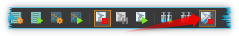
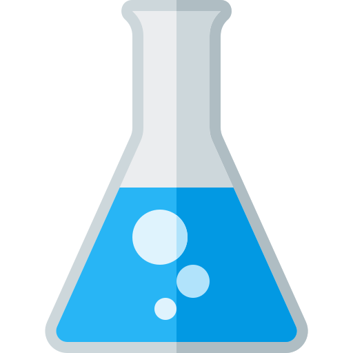
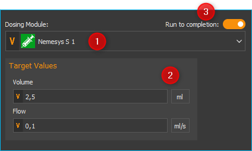
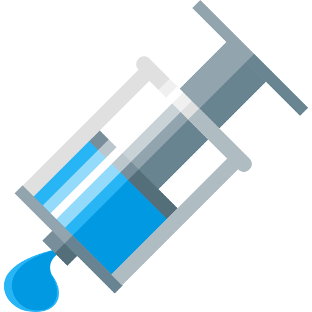
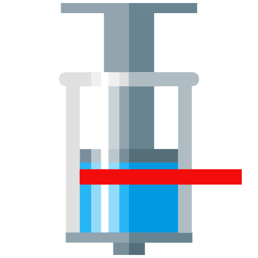
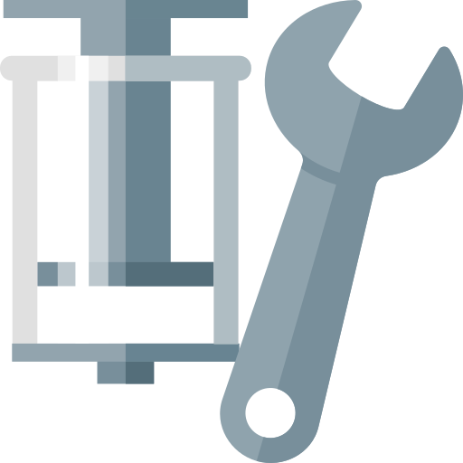

Nemesys Script Funktionen
-------------------------

Einführung
~~~~~~~~~~

Das Nemesys-Plugin bietet eine Reihe von Script-Funktionen die für die
Programmierung von automatischen Abläufen verwendet werden können. Die
folgenden Scriptfunktionen sind verfügbar:

.. image:: ./Pictures/100002010000011B000000F6E6C15CD2AF9DE7DA.png
   :alt: Nemesys Script Funktionen

Pumpen bei Script-Stopp automatisch stoppen
~~~~~~~~~~~~~~~~~~~~~~~~~~~~~~~~~~~~~~~~~~~~~

Wenn Sie möchten, dass beim Stopp des laufenden Scriptprogramms durch
den User auch alle Pumpen sofort gestoppt werden, aktivieren Sie dafür
die entsprechende Schaltfläche in der Hauptwerkzeugleiste.

Funktion Volumendosierung - *Dose Volume*
~~~~~~~~~~~~~~~~~~~~~~~~~~~~~~~~~~~~~~~~~

Mit dieser Funktion können Sie ein bestimmtes Volumen mit
einer genau definierten Flussrate dosieren. Im Auswahlfeld *Dosing
Module* :guinum:`❶` wählen Sie das Dosiermodul aus, welches Sie für die Dosierung
verwenden möchten. Alternativ können Sie in das Feld auch den Namen
einer Scriptvariable eintragen, welche eine Gerätereferenz einer Pumpe
enthält.

Alle weiteren Parameter, wie das zu dosierende Volumen und die Flussrate
können Sie im Bereich *Target Values* :guinum:`❷` einstellen.

Zusätzlich können Sie
im Konfigurationsbereich noch den Parameter :guilabel:`Run to completion` :guinum:`❸` ein-
oder ausschalten. Wenn :guilabel:`Run to completion` aktiviert ist, wir die
Skriptausführung erst fortgesetzt, wenn das komplette Volumen dosiert
wurde und der Dosiervorgang beendet ist. Ist dieser Parameter nicht
aktiv, wir die Dosierung gestartet, und dann sofort die nächste
Scriptfunktion bearbeitet. Damit können Sie z.B. mehrere Dosiermodule
nahezu gleichzeitig starten.

.. admonition:: Tipp
   :class: tip

   Alle Dosierfunktionen unterstützen die         
   Verwendung von Variablen. D.h. in allen Eingabefeldern   
   die im Konfigurationsbereich mit einem farbigen V        
   gekennzeichnet sind (z.B. Flussrate und Volumen) können  
   Sie Variablen eintragen.  

Funktion Konstanter Fluss - *Generate Flow*
~~~~~~~~~~~~~~~~~~~~~~~~~~~~~~~~~~~~~~~~~~~

Diese Funktion dient zur Erzeugung einer konstanten Flussrate.
Im Konfigurationsbereich können Sie das Dosiermodul auswählen und die
Flussrate einstellen. Wenn der Parameter :guilabel:`Run to completion` aktiv ist,
wird die nächste Skriptfunktion erst bearbeitet, wenn das Modul gestoppt
wurde oder eine der Endlagen erreicht hat. Die Konfiguration der
Parameter entspricht der Funktion :ref:`Volumendosierung 
<funktion volumendosierung - *pump volume*>`.

.. admonition:: Tipp
   :class: tip

   In der Auswahlbox der Pumpe können Sie auch    
   eine Scriptvariable verwenden, die eine Gerätereferenz enthält.     

Funktion Spritzenfüllstand setzen - *Set Syringe Level*
~~~~~~~~~~~~~~~~~~~~~~~~~~~~~~~~~~~~~~~~~~~~~~~~~~~~~~~

Diese Funktion können Sie in einem Script verwenden, wenn Sie
einen bestimmten Spritzenfüllstand erreichen möchten. Das Dosiermodul
dosiert dann solange, bis der Ziel-Füllstand erreicht ist. Das
Dosiermodul, den Füllstand und die Flussrate können Sie im
Konfigurationsbereich dieser Funktion einstellen. Die Konfiguration der
Parameter entspricht der Funktion :ref:`Volumendosierung 
<funktion volumendosierung - *pump volume*>`.

Funktion Kontinuierlicher Fluss – *Continuous Flow*
~~~~~~~~~~~~~~~~~~~~~~~~~~~~~~~~~~~~~~~~~~~~~~~~~~~

Mit dieser Funktion können Sie in einem Script einen
kontinuierlichen Fluss mit zwei Pumpen erzeugen. Wählen Sie dafür im
Konfigurationsbereich der Funktion das erste der beiden Dosiermodule
aus :guinum:`❶` und starten Sie anschließend den *Continuous Flow Wizard* :guinum:`❷` um
alle Parameter zu konfigurieren. Eine detaillierte Beschreibung der
Konfiguration finden Sie im Abschnitt :ref:`Kontinuierlichen Fluss konfigurieren`.

.. image:: ./Pictures/10000201000001BC00000132A166CAFDAC65CC2D.png
   :alt: Konfiguration Continuous Flow Scriptfunktion

Nach der Konfiguration mit dem *Continuous Flow Wizard* sehen Sie im
Feld :guilabel:`Flow` :guinum:`❸` die konfigurierte Flussrate. Wenn Sie im Wizard für den
kontinuierlichen Fluss ein bestimmtes Volumen konfiguriert haben, wird
zusätzlich das Feld :guilabel:`Volume` :guinum:`❹` angezeigt. Mit Hilfe der beiden
Felder :guilabel:`Flow` und :guilabel:`Volume` können Sie die Flussrate und das Volumen
über Scriptvariablen einstellen.

Mit dem Auswahlfeld :guilabel:`Run to completion` :guinum:`❺` legen Sie fest, wann die
nächste Scriptfunktion ausgeführt wird. Ist diese Option nicht aktiv,
wird der kontinuierliche Fluss gestartet und dann sofort die nächste
Scriptfunktion ausgeführt. Ist :guilabel:`Run to completion` aktiv, wird das
Script erst fortgesetzt, wenn die Abbruchbedingung, die im Wizard
konfiguriert wurde eintritt – d.h. erst wenn das konfigurierte Volumen
dosiert wurde oder die eingestellte Zeitdauer abgelaufen ist.

Funktion Kontinuierlichen Fluss ändern – *Change Continuous Flow*
~~~~~~~~~~~~~~~~~~~~~~~~~~~~~~~~~~~~~~~~~~~~~~~~~~~~~~~~~~~~~~~~~~~

.. image:: ./Pictures/100215FB000034EB000034EB41F823505A27F258.svg
   :width: 60
   :align: left 

Mit dieser Funktion können Sie einen vorher konfigurierten
kontinuierlichen Fluss starten oder einen bereits laufenden
kontinuierlichen Fluss ändern. Damit diese Funktion ohne Fehler
ausgeführt wird, müssen Sie entweder vorher einen kontinuierlichen Fluss
für zwei Pumpen konfiguriert oder die Scriptfunktion :ref:`Continuous
Flow <Funktion Kontinuierlicher Fluss – Continuous Flow>`
ausgeführt haben.

.. image:: ./Pictures/100002010000021900000072852784EDF6312364.png
   :alt: Konfiguration Change Continuous Flow Scriptfunktion

Im Konfigurationsbereich wählen Sie die Pumpe aus :guinum:`❶`, deren
kontinuierlichen Fluss Sie ändern möchten. Im Feld :guilabel:`Flow` :guinum:`❷` geben Sie
die Flussrate ein. Die Einheit entspricht dabei der Einheit, die im
*Continuous Flow Wizard* bei der Konfiguration des kontinuierlichen
Flusses konfiguriert wurde.

.. admonition:: Tipp
   :class: tip

   Zur Einstellung der Flussrate können Sie Scriptvariablen verwenden.

Funktion Dosierung stoppen - *Stop Dosage*
~~~~~~~~~~~~~~~~~~~~~~~~~~~~~~~~~~~~~~~~~~

.. image:: ./Pictures/1000783B000034EB000034EB057FAC65A6CE5D99.svg
   :width: 60
   :align: left

Mit dieser Funktion können Sie einen aktiven Dosiervorgang
eines Moduls stoppen.

|

.. admonition:: Tipp
   :class: tip

   In der Auswahlbox der Pumpe können Sie auch   
   eine Scriptvariable verwenden, die eine Gerätereferenz  
   enthält.

Funktion Alle Pumpe stoppen - *Stop All Pumps*
~~~~~~~~~~~~~~~~~~~~~~~~~~~~~~~~~~~~~~~~~~~~~~

.. image:: ./Pictures/1000783B000034EB000034EB057FAC65A6CE5D99.svg
   :width: 60
   :align: left

Stoppt die Dosierung aller Pumpen

|

Funktion Referenzfahrt ausführen – *Execute Reference Move*
~~~~~~~~~~~~~~~~~~~~~~~~~~~~~~~~~~~~~~~~~~~~~~~~~~~~~~~~~~~

Mit dieser Funktion können Sie aus dem Script heraus eine
Referenzfahrt starten. Mit dem Parameter *Run To Completion* können Sie
festlegen, ob die Funktion beendet wird, nach dem Start der
Referenzfahrt oder erst nach Beendigung der Referenzfahrt.