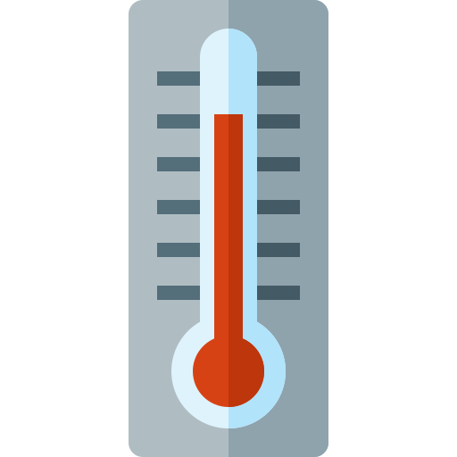
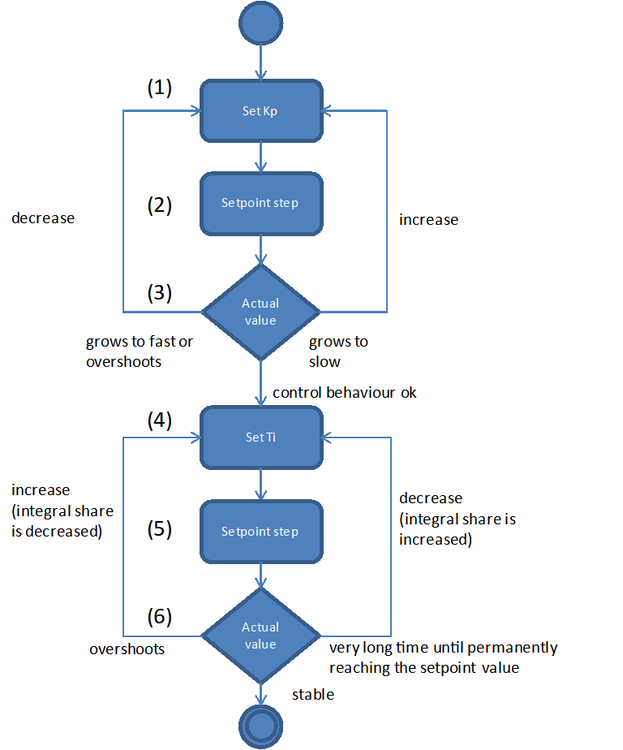

Qmix Controller Plugin
======================

Einführung 
-----------

Das Qmix Controller Plugin dient zur Einbindung der Qmix Reglermodule in
die QmixElements Software und zur Erzeugung benutzerdefinierter
Regelkreise. Folgende Module werden unterstützt:

.. image:: Pictures/controller_devices.png

.. rst-class:: guinums

#.  *Qmix Q-* - thermoelektrisches Kühlmodul
#.  *Qmix Q+* - zwei-kanaliges Heizmodul
#.  *Qmix TC*– zwei kanaliges Reglermodul für externe Heiz- / Kühlsysteme
    (z.B. für Spritzenheizung und Schlauchheizung)

Liste der Regelkanäle 
----------------------

Alle Qmix Regelkanäle werden in der Liste der Regelkanäle (:guilabel:`Controller Channels`) 
angezeigt. 

.. image:: Pictures/10000000000001D5000000F75FCDB73E.png
   :alt: Liste der Reglerkanäle

Die unterschiedlichen Kanaltypen (Kühlmodul Q-, Heizmodul Q+ ...) können Sie
an den unterschiedlichen Symbolen vor dem Kanalnamen unterscheiden
(siehe Abbildung oben). Die Liste der Regelkanäle ist ein 
:ref:`Werkzeugfenster<Views (Ansichten)>`, dass Sie durch Anklicken und Ziehen der Titelleiste
jederzeit an eine andere Position in der grafischen Oberfläche
verschieben oder aus der Oberfläche als separates Fenster herauslösen
können.

Die Kanalliste zeigt ihnen alle verfügbaren Qmix-Regelkanäle in
Tabellenform an. Folgende Spalten sind vorhanden:

-  **Controller** - zeigt den Namen des Regelkanals und den Typ durch ein
   Symbol an.
-  **On** - zeigt durch eine grüne LED ob die Regelung ein- oder
   ausgeschaltet ist. Klicken Sie die LED an, um die Regelung ein- oder
   auszuschalten.
-  **Setpoint** - enthält den eingestellten Sollwert des Reglers
-  **Actual Value** - zeigt den aktuellen Ist-wert

Kanaltypen 
~~~~~~~~~~~

Die folgenden Kanaltypen werden im Moment unterstützt:

======== =====================================================================
|image1| *Schneeflockensymbol* - Qmix Q- Kühlmodule 
|image2| *Thermometersymbol* - Qmix Q+ Heizmodule und Qmix TC Module 
|image3| *Symbol Reglerkurve* – dynamisch erzeugte, benutzerdefinierte Kanäle
======== =====================================================================

Kanalnamen ändern 
~~~~~~~~~~~~~~~~~~

Sie können den Namen eines Kanals jederzeit ändern und z.B. einen Namen
vergeben, der zu Ihrer speziellen Anwendung passt.

.. image:: Pictures/10000000000001D5000000F7561B0C23.png
   :alt: Kanalname ändern

Ändern Sie den Namen mit folgenden Schritten:

.. rst-class:: steps

#. Klicken Sie doppelt in die Tabellenzelle mit den Namen den Sie ändern
   möchten.
#. Geben Sie den neuen Namen in das Editierfenster ein, welches nun
   eingeblendet wird (siehe Abbildung oben)
#. Beenden Sie Ihre Eingabe durch Drücken der :kbd:`Return`-Taste.

Regelung ein- / ausschalten
~~~~~~~~~~~~~~~~~~~~~~~~~~~~

.. image:: Pictures/10000000000001D5000000D144CCA89A.png
   :alt: Regelung ein- / ausschalten

Zum Ein- und Ausschalten der Regelung klicken Sie einfach auf die LED
des Kanals, den Sie umschalten möchten.

Sollwert eingeben
~~~~~~~~~~~~~~~~~

Klicken Sie zur Eingabe des Sollwertes doppelt in die :guilabel:`Setpoint`-Spalte
des Kanals dessen Sollwert Sie ändern möchten. Geben Sie nun in das
Editierfenster das angezeigt wird (siehe Abbildung unten) den Sollwert
ein, oder verwenden Sie die Pfeil- Schaltflächen um den Sollwert
schrittweise zu verringern oder zu erhöhen.

Kontextmenü für Reglerkanäle
-----------------------------

Durch Rechtsklick in die Liste der Reglerkanäle können Sie ein
Kontextmenü mit zusätzlichen Funktionen einblenden:

.. image:: Pictures/100002010000022300000129ACB2B97D.png
   :alt: Kontextmenü aufrufen

Das Kontextmenü enthält die folgenden Menüpunkte:

+-----------+---------------------------------------------------------+
| |image18| | **Configure Channel...**                                |
|           |                                                         |
|           | Öffnet den Konfigurationsdialog des Kanals zur          |
|           | Konfiguration aller Kanalparameter.                     |
+-----------+---------------------------------------------------------+
| |image19| | **Restore Default Settings**                            |
|           |                                                         |
|           | Stellt die Standardeinstellungen des Kanals wieder her. |
+-----------+---------------------------------------------------------+
| |image20| | **Reset Calibration**                                   |
|           |                                                         |
|           | Setzt die Zweipunktskalierung zurück auf den            |
|           | Skalierungsfaktor 1 und den Offset 0                    |
+-----------+---------------------------------------------------------+
| |image21| | **Configure scaling...**                                |
|           |                                                         |
|           | Öffnet den Konfigurationsdialog mit der Seite zur       |
|           | Konfiguration der Reglerskalierung.                     |
+-----------+---------------------------------------------------------+
| |image22| | **Select PID parameters...**                            |
|           |                                                         |
|           | Öffnet den Konfigurationsdialog mit der Seite zur       |
|           | Auswahl und Erstellung von PID-Parametersätzen.         |
+-----------+---------------------------------------------------------+
| |image23| | **Delete user channel**                                 |
|           |                                                         |
|           | Wenn der ausgewählte Kanal ein benutzerdefinierter      |
|           | Kanal ist, wird dieser durch Anklicken dieses           |
|           | Menüpunktes gelöscht. Für andere Reglerkanäle ist       |
|           | dieser Menüpunkt ausgegraut.                            |
+-----------+---------------------------------------------------------+
| |image24| | **Create user channel**                                 |
|           |                                                         |
|           | Öffnet den Wizard zur Erstellung eines neuen            |
|           | benutzerdefinierten Reglerkanals.                       |
+-----------+---------------------------------------------------------+

Kanaleinstellungen konfigurieren
--------------------------------

Um den Konfigurationsdialog (siehe Abbildung unten) zur Einstellung der
Skalierung zu öffnen, wählen Sie im
`Kontextmenü für Reglerkanäle`_ den Menüpunkt 
:menuselection:`Configure channel`.

.. image:: Pictures/100002010000034C000001C3C2B07A89.png
   :alt: Konfiguration Skalierung

Die Konfiguration der
allgemeinen Kanaleinstellungen sowie die Kalibrierung der Reglerkanäle
sind identisch mit der Konfiguration der :ref:`Qmix I/O Plugin`-Kanäle. 
Lesen Sie für eine detaillierte Beschreibung der Konfiguration
den Abschnitt :ref:`I/O Kanal Konfiguration`.

Auswahl und Konfiguration von Reglerparametern
----------------------------------------------

Übersicht
~~~~~~~~~

Um das Regelverhalten der einzelnen Reglerkanäle optimal an Ihre
Anwendung anzupassen, können Sie für jeden einzelnen Kanal die
Regelparameter individuell anpassen. Dafür können Sie entweder aus einer
Liste von vordefinierten PID Parametersätzen wählen, oder neue
Parametersätze erstellen.

Um zur Reglerparameterauswahl zu gelangen, wählen Sie im
`Kontextmenü für Reglerkanäle`_ den Menüpunkt :menuselection:`Select PID parameters`.

.. image:: Pictures/100002010000034C000002287E739DAD.png
   :alt: Auswahl eines Reglerparametersets

Im oberen Bereich
sehen Sie die aktuellen Parameter des Gerätes :guinum:`❶` (:guilabel:`Current Channel Parameters`). 
Im unteren Bereich finden Sie eine Liste mit :guilabel:`PID Parameter Presets` :guinum:`❷`.

Reglerparameter ändern
~~~~~~~~~~~~~~~~~~~~~~

Um die aktuellen Reglerparameter zu editieren, klicken Sie mit der Maus
im Bereich :guilabel:`Current Channel Parameters` doppelt in das Feld welches Sie
ändern möchten und geben den neuen Wert ein:

.. image:: Pictures/100002010000025A0000008921C42A7E.png
   :alt: Regelparameter ändern

PID Parameter Preset auswählen
~~~~~~~~~~~~~~~~~~~~~~~~~~~~~~~

.. image:: Pictures/100002010000034C00000228CAC67298.png
   :alt: PID Parameter Preset auswählen

Wählen Sie aus der
Tabelle der vorhanden Parametersätze einen Parametersatz durch Anklicken
mit der linken Maustaste aus :guinum:`❶` und klicken Sie anschließend auf die
Schaltfläche :guilabel:`Apply Preset` :guinum:`❷` um die Regelparameter zu übernehmen.
Die Werte im Bereich :guilabel:`Current Channel Parameters` :guinum:`❸` werden mit den neuen
Werten aus dem Preset aktualisiert. Schließen die Konfiguration durch
Anklicken der Schaltfläche :guilabel:`Ok` :guinum:`❹` ab.

Die PID Parameter Presets enthalten bereits vordefinierte
Standard-Reglerparameter für verschiedene Qmix Geräte (z.B. Qmix Q+,
Qmix Q- oder Qmix TC) oder bestimmtes Zubehör (z.B. Spritzenheizung oder
Schlauchheizung).

.. admonition:: Tipp
   :class: tip

   Zur optimalen Anpassung an die Regelstrecken  
   in Ihrer Anwendung können Sie eigene Parametersätze mit 
   Reglerparametern erstellen. 

PID Parameter Preset erstellen
~~~~~~~~~~~~~~~~~~~~~~~~~~~~~~

Durch Anklicken der Schaltfläche :guilabel:`Create Preset` :guinum:`❶` erzeugen sie einen
neuen Satz von Reglerparametern :guinum:`❷`. (siehe Abbildung unten) Anschließend
können Sie die einzelnen Werte des Parametersets editieren indem Sie
doppelt in ein Feld klicken :guinum:`❸` und einen neuen Wert eingeben.

.. image:: Pictures/1000020100000335000000F62671DF1C.png
   :alt: Erstellen eines PID-Parametersatzes

Vergeben Sie für
jeden Parametersatz einen aussagekräftigen, eindeutigen Namen und passen
Sie die Reglerparameter an die Regelstrecke in Ihrer Anwendung an. Um
geeignete Parameter für einen Regelkreis zu finden, gehen Sie wie im
Abschnitt `Vorgehensweise für die Einstellung von Reglerparametern`_
beschrieben vor.

Löschen von PID Parameter Presets
~~~~~~~~~~~~~~~~~~~~~~~~~~~~~~~~~

Sie löschen einen Reglerparametersatz, indem sie ihn durch Anklicken mit
der linken Maustaste auswählen :guinum:`❶` und anschließend die Schaltfläche
:guilabel:`Delete Selected Preset` :guinum:`❷` klicken.

.. image:: Pictures/1000020100000333000000D15C7BAB96.png
   :alt: Löschen eines Reglerparametersets

.. admonition:: Wichtig
   :class: note

   Vordefinierte Standard-Reglerparameter     
   sind gesperrt und können nicht gelöscht werden.         
   Gesperrte Parameter erkennen Sie in der Tabelle an dem  
   gelben Schloss.    

Benutzerdefinierte Reglerkanäle
-------------------------------

Einführung
~~~~~~~~~~

Sie können benutzerdefinierte Reglerkanäle erzeugen, bei denen Sie
beliebige Geräteeigenschaften (Device Properties) als Ein- und
Ausgangsgrößen für die Regelschleife verwenden können. Damit wird es
z.B. möglich mit Hilfe eines Druckmesskanals eines *Qmix p*-Gerätes und
einer *Nemesys Spritzenpumpe* eine Druckregelung aufzubauen oder eine
druckgesteuerte Dosierung zu realisieren.

Erstellen von Reglerkanälen
~~~~~~~~~~~~~~~~~~~~~~~~~~~

Sie öffnen den Dialog zum Erzeugen von Reglerkanälen durch Rechtsklick
in die Reglerkanalliste und Auswahl der Menüpunktes :menuselection:`Create user channel` 
im Kontextmenü.

.. image:: Pictures/100002010000022300000129BD54D696.png
   :alt: Dialog für das Erstellen eines Reglerkanals aufrufen

Im Konfigurationswizard der Ihnen nun angezeigt wird, gehen Sie wie folgt
vor:

.. image:: Pictures/1000020100000340000001A6ED2C69A6.png
   :alt: Ein- und Ausgangsgrößen des Reglerkanals auswählen

.. rst-class:: steps

#. Wählen Sie das Gerät, welches die Messgröße
   (Eingangsgröße) des Reglers zur Verfügung stellen soll: :guilabel:`Controller Input`.
#. Wählen Sie die Geräteeigenschaft (*Device Property*) aus, die als
   Messgröße verwendet werden soll.
#. Wählen Sie das Gerät, welches die Stellgröße (Ausgangsgröße) des
   Reglers zur Verfügung stellen soll: :guilabel:`Controller Output`.
#. Wählen Sie die Geräteeigenschaft (*Device Property*) aus, die als
   Stellgröße verwendet werden soll.
#. Klicken Sie auf die Schaltfläche :guilabel:`Next`, um die Konfiguration
   fortzusetzen.

Abschließend erscheint ein Fenster für die Konfiguration und Auswahl von
Reglerparametern. Dort können Sie wie im Abschnitt 
`Auswahl und Konfiguration von Reglerparametern`_
beschrieben, die Reglerparameter konfigurieren. Durch Anklicken der
Schaltfläche :guilabel:`Finish` schließen sie die Erstellung des Reglerkanals ab.

.. admonition:: Tipp
   :class: tip

   Sie können die Reglerparameter später         
   jederzeit ändern und so optimal an ihre Regelstrecke    
   anpassen. 

Änderung der Stellgrößenskalierung oder -einheit
~~~~~~~~~~~~~~~~~~~~~~~~~~~~~~~~~~~~~~~~~~~~~~~~

Die Stellgröße, wie zum Beispiel die Flussrate eines
Nemesys-Dosiersystems bei einer Druckregelung oder der Wert eines
analogen Ausgangs bei einer Temperaturregelung, wird durch den
PID-Regelalgorithmus ermittelt und unskaliert an das entsprechende Gerät
ausgegeben. Das bedeutet, dass sie, die Reglerparameter, besonders die
Stellgrößengrenzen, jedes Mal neu anpassen müssen, wenn sie die
Skalierung oder die Einheit des entsprechenden Gerätes ändern. Bei einem
Nemesys-Dosiersystem trifft dies auch zu, wenn sie die Spritzengröße
ändern, da sich hierdurch der Flussratenbereich ändert.

.. admonition:: Wichtig
   :class: note

   Wenn sie die Skalierung oder Einheit eines 
   Gerätes ändern, das Bestandteil eines Regelkreises ist, 
   müssen sie die Reglerparameter kontrollieren und diese  
   gegebenenfalls anpassen. Bei einem Nemesys-Dosiersystem 
   trifft dies auch zu, wenn sie die Spritzengröße ändern.

Regler Script Funktionen
------------------------

Einführung
~~~~~~~~~~

Das Qmix Regler-Plugin enthält eine Script Funktion, um die
Regler-Parameter aus einem Script heraus zu ändern. Damit ist es z.B.
möglich, zeitgesteuerte Temperaturkurven zu realisieren.

.. image:: Pictures/10000201000001240000007754114FA5.png
   :alt: Qmix Regler Script Funktionen

Funktion Reglerparameter setzen - *Set Controller Param*
~~~~~~~~~~~~~~~~~~~~~~~~~~~~~~~~~~~~~~~~~~~~~~~~~~~~~~~~

Mit dieser Funktion können Sie einen neuen Sollwert an den
Regelkanal übergeben oder den Regelkreis ein- und ausschalten. Klicken
Sie zum Ein- / Ausschalten einfach auf die LED (:guilabel:`Control loop on / off`) 
im Konfigurationsbereich (Abbildung unten).

|

.. image:: Pictures/10000000000001A7000000C4FD6D097D.png
   :alt: Konfiguration Regler Script Funktion

.. _pid_reglerfunktion:

PID Regler Funktion – *PID Control*
~~~~~~~~~~~~~~~~~~~~~~~~~~~~~~~~~~~

Einführung
^^^^^^^^^^^^

.. image:: Pictures/10000B740000388E0000388E0BB445FF.svg
   :width: 60
   :align: left

Die PID Regler Funktion implementiert einen PID-Regler für
Anwendungen, die einen effizienten PID-Algorithmus erfordern. Der
PID-Algorithmus unterstützt die Begrenzung des Ausgangsbereiches mit
Integrator-Anti-Windup-Funktionalität.

Derzeit ist der PID-Algorithmus der am weitesten verbreitete
Regelalgorithmus der in der Industrie verwendet wird. PID Regelkreise
werden u.a. verwendet für die Regelung von Heiz- und Kühlsystemen, für
die Überwachung von Flüssigkeitsständen, für Durchflussregelung und
Druckregelung. Bei der PID Regelung geben Sie eine Prozessvariable und
eine Stellgröße vor. Die Prozessvariable ist dabei der Systemparameter,
den Sie steuern möchten, wie z.B. Druck, Temperatur oder Durchfluss. Der
Sollwert ist der gewünschte Wert für den Parameter welchen Sie regeln
möchten. Der PID Regler berechnet dann die Reglerausgangsgröße wie z.B.
Heizleistung oder Ventilposition. Diese Reglerausgangsgröße wird dann
auf das System angewendet, welches wiederum die Prozessvariable in
Richtung der Stellgröße treibt.

Konfiguration
^^^^^^^^^^^^^^

Im Konfigurationsbereich der Anwendung konfigurieren Sie alle Parameter
die für die PID Funktion benötigt werden.

Die folgenden Parameter müssen konfiguriert werden (siehe Abbildung
unten):

.. rst-class:: guinums

1. **Prozessvariable (Actual Value Input)** – die Prozessvariable ist
   der gemessene Wert der Prozessgröße (z.B. Temperatur) die geregelt
   wird. Dieser Wert ist gleich dem Istwert des Regelkreises. Tragen Sie
   hier eine Variable ein oder greifen Sie über
   einen :ref:`Prozessdatenbezeichner <Device Properties (Prozessdaten)>` direkt
   auf bestimmte Prozessdaten eines Gerätes zu.
2. **Stellgröße (Setpoint)** – geben Sie hier den Sollwert, den
   gewünschten Zielwert ein, auf den die Prozessvariable geregelt werden
   soll. Sie können einen festen Wert eingeben (z.B. 50°C) oder den Wert
   durch eine Variable übergeben.
3. **Reglerparameter (Control Loop Parameters)** – die PID-Verstärkungsfaktoren 
   konfigurieren die Proportionalverstärkung (K), Nachstellzeit (T\ :sub:`I`\)
   und Vorhaltezeit (T\ :sub:`D`\) des Reglers und wirken damit
   unmittelbar auf das Regelverhalten des Reglers. Die Wirkung der
   einzelnen Regelparameter wird in folgendem Abschnitt erläutert.

   .. image:: ./Pictures/10000201000001F400000208F1F44DB1.png
      :alt: Konfiguration PID Regler Funktion

4. **Reglerausgang (Controller Output)** – dieser Bereich gruppiert
   alle Einstellungen zum Ausgang des Reglers.
   *Control Value Output* gibt den Ausgangswert des PID Algorithmus
   zurück, der auf den gesteuerten Prozess angewendet werden muss. D.h.
   bei einer Temperaturregelung wäre dieser Wert die Heizleistung die
   vom Heizer erzeugt werden muss. Tragen Sie in das Feld den Namen
   einer Variablen ein, die dann den ausgegebenen Wert speichern kann
   oder verwenden Sie
   einen :ref:`Prozessdatenbezeichner <Device Properties (Prozessdaten)>` um
   direkt die Prozessdaten eines Gerätes zu schreiben.

   .. image:: Pictures/10000000000001D7000000C159F1FF85.png
      :alt: Prozessdatenbezeichner über Kontextmenü eintragen

   Mit den Parametern U\ :sub:`max` und U\ :sub:`min` begrenzen Sie den
   Wertebereich des Reglerausganges. Wenn Sie z.B. über einen analogen
   Ausgang von 0 – 5 V die Heizleistung steuern, dann geben Sie für
   U\ :sub:`min`\ den Wert 0 und für U\ :sub:`max`\ den Wert 5 ein.
   Sollte der Regelalgorithmus Werte erzeugen, die außerhalb des
   Bereiches liegen, werden diese automatisch auf den Bereich begrenzt.

.. admonition:: Tipp
   :class: tip

   Sie können die PID Reglerfunktion auch        
   verwenden, um eine P, PI oder PD Regler zu realisieren, 
   indem Sie die entsprechenden nicht benötigten           
   Verstärkungsfaktoren auf 0 setzen.  

PID-Regelparameter
^^^^^^^^^^^^^^^^^^^^

Ein PID-Regelparametersatz besteht aus einem Proportional-, einem
Integrier- und einem Differenzieranteil.

Proportionalanteil
'''''''''''''''''''

Der Proportionalanteil (K-Anteil) bildet aus dem Sollwert (W) und dem
Istwert (X) die Regelabweichung,

.. image:: Pictures/math_01.png
   :scale: 20%

multipliziert diese mit der Proportionalverstärkung K und gibt den
errechneten Wert als Stellgröße (Y) auf die Regelstrecke aus. Der
Proportionalanteil folgt somit folgender Gleichung.

.. image:: Pictures/math_02.png
   :scale: 20%

Integrieranteil
'''''''''''''''

Der Integrieranteil (I-Anteil) bildet mathematisch die Fläche, welche
von Regelabweichung und Zeit *t*\ eingeschlossen wird. Liegt eine
konstante Regelabweichung vor, wird der I-Anteil rampenförmig
hochgefahren. 

Für eine gleichbleibende Regelabweichung lautet die Reglergleichung:

- Y\ :sub:`t0`: Stellgröße zu Beginn der Betrachtung
- T\ :sub:`i`: Integrierzeit

Entspricht der Istwert dem Sollwert verändert sich der Stellwert nicht.
Eine durch den I-Anteil aufgebaute Stellgröße bleibt erhalten. Erst wenn
der Istwert größer als der Sollwert wird, wird der I-Anteil abgebaut.
Bei Strecken mit Verzug (z.B. Temperaturregelstrecke) sorgt der I-Anteil
dafür, dass eine bleibende Regelabweichung ausgeregelt wird. Ein
Proportionalregler allein ist dazu nicht im Stande. Allgemein gilt für
den I-Anteil folgende Gleichung:

Mit der Nachstellzeit T\ :sub:`I` kann die Geschwindigkeit des I-Anteils
verändert werden. Je kleiner T\ :sub:`I` desto schneller baut der
Integrieranteil seine Stellgröße auf. Aus der Gleichung geht hervor,
dass auch die Proportionalverstärkung K auf den I-Anteil wirkt. In
QmixElements können sie den I-Anteil nur in Verbindung mit einem
Proportionalanteil konfigurieren (PI-Regler). Die Reglergleichung
besteht somit immer aus der Summe von K- und I-Anteil.

.. image:: Pictures/math_05.png
   :scale: 20%

.. admonition:: Wichtig
   :class: note

   Der Integrieranteil ist für das Ausregeln  
   einer bleibenden Regelabweichung verantwortlich. 

Differenzieranteil
''''''''''''''''''

Der Differenzieranteil (D-Anteil) reagiert auf Änderungen des Istwertes
und wirkt diesen entgegen. Zwei Situationen können bezüglich der Wirkung
des D-Anteils betrachtet werden:

-  In einem Regelkreis hat der Istwert einen stabilen Endwert erreicht.
   Auf Grund einer Störung wird der Istwert geringer. Nun liefert der
   D-Anteil einen zusätzlichen positiven Stellwertanteil, welcher hilft,
   den Istwert wieder in Richtung größerer Werte zu bringen.
-  Erfolgt eine Sollwerterhöhung, wird in einem Regelkreis der Istwert
   ebenfalls größer werden. Der D-Anteil erkennt den steigenden Istwert
   und bremst durch einen negativen Stellwertanteil das Anfahren des
   Istwertes auf den neuen Endwert.

Der D-Anteil tritt in der Praxis nur in Verbindung mit einem K-Anteil
auf. Die Reglergleichung lautet.

Je größer die Proportionalverstärkung K und die Vorhaltezeit
T\ :sub:`D`, desto stärker wirkt der D-Anteil und desto stärker wird der
Änderung der Istgröße entgegengewirkt (gedämpft).

Zusammenfassung
'''''''''''''''

Die folgende Tabelle fast die Wirkung der einzelnen Regelparameter
zusammen.

+----------------------+----------------------+----------------------+
| PID-Parameter        | Ausregeln einer      | Anfahren des         |
|                      | Störung der          | Sollwerts            |
|                      | Regelstrecke         | (Führungsverhalten)  |
|                      | (Störverhalten)      |                      |
+======================+======================+======================+
| K größer             | stärkere Reaktion    | schnelleres Anfahren |
|                      | (schwächer gedämpft) |                      |
+----------------------+----------------------+----------------------+
| K kleiner            | schwächerer Reaktion | langsameres Anfahren |
|                      | (stärker gedämpft)   |                      |
+----------------------+----------------------+----------------------+
| TI größer            | schwächere Reaktion, | langsameres Anfahren |
|                      | im Allgemeinen zeigt | und Ausregeln der    |
|                      | der I-Anteil nur     | bleibenden           |
|                      | eine geringe         | Regelabweichung bei  |
|                      | Reaktion, gerade auf | Verzugsstrecken      |
|                      | kurzzeitige          |                      |
|                      | Störungen            |                      |
+----------------------+----------------------+----------------------+
| TI kleiner           | stärkere Reaktion,   | schnelleres Anfahren |
|                      | im Allgemeinen zeigt | und Ausregeln der    |
|                      | der I-Anteil nur     | bleibenden           |
|                      | eine geringe         | Regelabweichung bei  |
|                      | Reaktion, gerade auf | Verzugsstrecken      |
|                      | kurzzeitige          | (Überschwingen, wenn |
|                      | Störungen            | T\ :sub:`I` zu       |
|                      |                      | klein)               |
+----------------------+----------------------+----------------------+
| TD größer            | stärkere Reaktion    | langsameres Anfahren |
|                      |                      | (stärkere Wirkung    |
|                      |                      | gegen                |
|                      |                      | Istwertänderung)     |
+----------------------+----------------------+----------------------+
| TD kleiner           | schwächere Reaktion  | schnelleres Anfahren |
|                      |                      | (geringere Wirkung   |
|                      |                      | gegen                |
|                      |                      | Istwertänderung)     |
+----------------------+----------------------+----------------------+

Programmierung des Regelkreises
^^^^^^^^^^^^^^^^^^^^^^^^^^^^^^^^

Dieser Abschnitt zeigt Ihnen, wie Sie mit Hilfe der PID Regler Funktion
einen PID Regler in einem Scriptprogramm realisieren.

Um einen Regelkreis zu realisieren, gehen Sie wie folgt vor:

.. rst-class:: guinums

1. Der Regler muss zyklisch in einem festen Zeitintervall aufgerufen
   werden. Dafür verwenden Sie eine Schleife. In diesem Fall verwenden
   Sie eine :ref:`bedingte Schleife<bedingte_schleife>` mit
   der Schleifenbedingung 1 – also eine Schleife die endlos läuft und
   nie abbricht, außer der Anwender stoppt das Scriptprogramm.
2. Nun erzeugen Sie eine :ref:`PID Regler Funktion<pid_reglerfunktion>` innerhalb der
   Schleife und konfigurieren alle Parameter.
3. Innerhalb der Schleife wird nun die :ref:`Verzögerungsfunktion<verzögerungsfunktion>`
   aufgerufen um eine definierte Verzögerungszeit von 200 Millisekunden
   einzufügen. Diese Zeit legt damit die Häufigkeit fest, mit der der
   Regelalgorithmus aufgerufen wird und damit das *dt* welches im
   Algorithmus bei der Berechnung der Regelparameter verwendet wird.

Damit haben Sie einen einfachen Regelkreis aufgebaut, der alle 200
Millisekunden die PID Regler Funktion aufruft.

.. admonition:: Tipp
   :class: tip

   Laut Regelungstheorie muss ein                
   Regelungssystem einen physikalischen Prozess mit einer  
   10 mal höheren Geschwindigkeit abtasten, als die        
   schnellste Zeitkonstante in diesem physikalischen       
   Prozess. Zum Beispiel ist eine Zeitkonstante von 60 s   
   typisch für einen Temperaturregelkreis in einem kleinen 
   System. In diesem Fall ist eine Zykluszeit von etwa 6 s 
   ausreichend. Eine höhere Frequenz führt dann nicht zu   
   einer Verbesserung der Leistung des Reglers.  

Vorgehensweise für die Einstellung von Reglerparametern
-------------------------------------------------------

Einfacher geschlossener Regelkreis und PID-Reglergleichung
~~~~~~~~~~~~~~~~~~~~~~~~~~~~~~~~~~~~~~~~~~~~~~~~~~~~~~~~~~

Der Regler (z.B. PID-Regler) und die zu regelnde Strecke (z.B. zu
temperierendes System) bilden zusammen ein rückgekoppeltes System, den
einfachen geschlossenen Regelkreis. (siehe Abbildung unten)

.. image:: Pictures/1000020100000345000000BBD9E22878.png
   :alt: Einfacher geschlossener Regelkreis

Ein PID-Regler
ermittelt hierbei die Stellgröße *u* zum Zeitpunkt t\ :sub:`1` nach
folgender Gleichung.

.. image:: Pictures/math_08.png
   :scale: 20%

Die Stellgröße enthält 3 Anteile.

+----------+----------------------------------+
| |math09| | Der Proportionalanteil (P-Anteil)|
|          | bildet mittels des Faktors       |
|          | K\ :sub:`p` die direkte          |
|          | Auswirkung des Fehlers auf die   |
|          | Stellgröße.                      |
+----------+----------------------------------+
| |math10| | Der Integrieranteil (I-Anteil)   |
|          | errechnet die zeitliche Summe    |
|          | des Fehlers und bildet sie       |
|          | mittels K\ :sub:`p` und der      |
|          | Zeitkonstanten T\ :sub:`i` auf   |
|          | die Stellgröße ab. Je größer     |
|          | K\ :sub:`p` und je kleiner       |
|          | T\ :sub:`i`\ desto größer wird   |
|          | der I-Anteil der Stellgröße.     |
+----------+----------------------------------+
| |math11| | Der Differenzieranteil (D-Anteil)|
|          | richtet sich nach den zeitlichen |
|          | Änderungen des Istwertes und     |
|          | bildet diese über K\ :sub:`p` und|
|          | T\ :sub:`D` auf die Stellgröße   |
|          | ab.                              |
+----------+----------------------------------+

Vorbereitung der Reglereinstellung in QmixElements 
~~~~~~~~~~~~~~~~~~~~~~~~~~~~~~~~~~~~~~~~~~~~~~~~~~~

Zunächst sollten sie sich den aktuellen Wert und die Stellgröße ihres
Regelkanals im Plot des Data-Loggers anzeigen lassen. (siehe Kapitel
:ref:`Prozessdaten-Protokollierung (DatenloggerPlugin)`)
Sie können sich auch den Sollwert anzeigen lassen :guinum:`❶` . Dies ist nicht
unbedingt erforderlich, da sie ihn im Allgemeinen kennen, erleichtert
aber die Orientierung im Plot. (siehe Abbildung unten)

.. image:: Pictures/100002010000033E000001B1025EE03C.png
   :alt: Konfiguration des graphischen Loggers für die Reglereinstellung

Die Einstellung im Bereich :guilabel:`Log Interval` :guinum:`❷` hängt von
der Änderungshäufigkeit des aktuellen Wertes des Reglerkanals ab. Sie
sollten einen brauchbaren Graphen erhalten, wenn sie für Log Interval
die gleiche Größe benutzen, die sie für den Wert Sample Time ihres
Reglerparametersatzes verwendet haben.

Auswahl des Parameters Sample Time
~~~~~~~~~~~~~~~~~~~~~~~~~~~~~~~~~~

Der Parameter Sample Time ist definiert als die Zeitdauer zwischen zwei
Berechnungen der Stellgröße des Reglers. Je kleiner dieser Wert gewählt
wird desto häufiger wird die Stellgröße berechnet. Als Faustformel kann
man sich merken, dass Sample Time nicht größer als ein Zehntel der
kleinsten im Regelkreis vorkommenden Zeitkonstante sein sollte.
Erfahrungsgemäß konnten bei folgenden Geräten mit den angegebenen
Zeitkonstanten brauchbare (stabile Regelung) Ergebnisse erzielt werden:

========================================= ================
Anwendung                                 Sample Time (ms)
========================================= ================
Qmix Q+                                   500
Druckregelung mit Nemesys und Qmix p      50
========================================= ================

.. admonition:: Tipp
   :class: tip

   Für die Sample Time sollten Werte gewählt     
   werden, die kleiner oder gleich 1/10 der kleinsten im   
   Regelkreis vorkommenden Zeitkonstante sind. 

Festlegen der Stellgrößengrenzen
~~~~~~~~~~~~~~~~~~~~~~~~~~~~~~~~

Die minimale (U\ :sub:`min`) und maximale (U\ :sub:`max`) Stellgröße der
QmixElements-Regler kann limitiert werden. Die Stellgrößen sollten über
einen ausreichenden Hub verfügen, sodass die angestrebten Sollwerte
erreicht werden können. Gleichzeitig sollten sie darauf achten, dass
ihre Regelstrecke nicht durch zu groß gewählte Grenzwerte beschädigt
wird. (z.B. zu hohe Flußrate eines Nemesys Dosiersystems bei
Druckregelung führt zur Zerstörung des fluidischen Systems) Dies sollten
sie testen, indem sie ihre Regelstrecke mit dem oberen und unteren Limit
der Stellgröße beaufschlagen. (z.B. mit Flußrate, die dem
Stellgrößenlimit entspricht, dosieren) Weiterhin müssen sie einen Wert
wählen, den die Stellgröße annehmen soll, wenn der Reglerkanal
deaktiviert (U\ :sub:`disabled`) wird (im Allgemeinen Null).

.. admonition:: Achtung
   :class: caution

   Unzureichende Limitierung der Stellgrößen  
   kann zur Beschädigung ihres zu regelnden Systems        
   führen.  

Ermittlung von PI-Reglerparametern am Beispiel einer Temperaturregelstrecke
~~~~~~~~~~~~~~~~~~~~~~~~~~~~~~~~~~~~~~~~~~~~~~~~~~~~~~~~~~~~~~~~~~~~~~~~~~~

Eine Temperaturregelstrecke ist im Allgemeinen eine Regelstrecke welche
eine oder mehrere Verzögerungszeitkonstanten enthält. Häufig kann sie
durch eine Verzögerungstrecke 1. Ordnung approximiert werden.
Nachfolgend die Sprungantwort einer Verzögerungstrecke 1. Ordnung im
Bildbereich.

.. image:: Pictures/math_12.png
   :scale: 20%

Ziel der Reglereinstellung ist es, die Streckenzeitkonstante T\ :sub:`1`
zu kompensieren und die Reglerverstärkung K\ :sub:`p` anzupassen, sodass ein
gutes Führungsverhalten des geschlossenen Regelkreises erzielt wird. Da
T\ :sub:`1` in der Praxis häufig nicht bekannt ist, kann man sich durch
folgendes Verfahren schrittweise einem brauchbaren Ergebnis annähern.

.. rst-class:: steps

#. Die Werte für Sample Time, U\ :sub:`min`, U\ :sub:`max`
   und U\ :sub:`disabled` wählen sie entsprechend der Empfehlungen in den vorangegangenen Abschnitten.
   Die Werte der einzelnen Reglerzeitkonstanten setzen sie zu Null.
   Hiermit deaktivieren sie den I- und D-Anteil des PID-Reglers.
   Hieraus folgt eine vereinfachte Reglergleichung.

   .. math:: U = {K_{p} \cdot e}

   Wählen sie für den P-Anteil einen moderaten Verstärkungsfaktor.
   Bedenken sie, dass sich der Fehler der Regelgröße über K\ :sub:`p`
   direkt auf die Stellgröße U auswirkt. Ein zu großer Wert für
   K\ :sub:`P` kann den Regler somit permanent in die Sättigung
   treiben.

#. Beaufschlagen sie ihren Regelkreis mit einem Sollgrößensprung, zum
   Beispiel indem sie die Solltemperatur von Raumtemperatur auf 50°C
   ändern und die Regelung aktivieren. (siehe Abschnitt
   :ref:`Entering setpoint` und :ref:`Switching control devices on / off`)

#. Bei einer Verzögerungsstrecke 1. Ordnung wird sich der Istwert wie
   in folgender Abbildung dargestellt verhalten.

   .. image:: Pictures/graph02.png
   
   In Abhängigkeit von der gewählten
   Reglerverstärkung K\ :sub:`p` wird sich die Istgröße unterschiedlich
   schnell in die Nähe des Sollwertes begeben. Außerdem wird sich eine
   bleibende Regelabweichung einstellen. Ein P-Regler ist nämlich nicht
   in der Lage eine Verzögerungstrecke 1. Ordnung vollständig
   auszuregeln. Ist K\ :sub:`p` zu klein eingestellt, verläuft die
   Istwertkurve zu flach und es dauert sehr lang, bis sich der Istwert
   in der Nähe des Sollwertes befindet. (siehe Abbildung oben, Verlauf
   für K\ :sub:`p` = 1) Ein zu großer Wert für K\ :sub:`p` führt
   dagegen zum Überschwingen, gegebenenfalls zu einer Dauerschwingung
   um den Sollwert. (siehe Abbildung oben, Verlauf für K\ :sub:`p` =
   1)  Im dargestellten Beispiel erreicht der Istwert bei K\ :sub:`p` =
   3 recht zügig einen stationären Wert ohne überzuschwingen. Aus
   diesem Grund kann man mit diesem Wert weiterarbeiten.

#. Im nächsten Schritt müssen sie T\ :sub:`i` so einstellen, dass die
   bleibende Regelabweichung verschwindet. Beginnen sie zunächst mit
   einer großen Zeitkonstanten T\ :sub:`i` (kleiner Integrieranteil).

#. Beaufschlagen sie ihren Regelkreis mit einem Sollgrößensprung, zum
   Beispiel indem sie die Solltemperatur von Raumtemperatur auf 50°C
   ändern und die Regelung aktivieren. (siehe Abschnitt
   :ref:`Entering setpoint` und :ref:`Switching control devices on / off`)

#. Sie können die Zeitkonstante T\ :sub:`i` verringern, wenn sie die
   Zeit bis zum dauerhaften Erreichen des Sollwertes verringern
   möchten. Sie müssen hierbei beachten, dass eine zu klein gewählte
   Zeitkonstante T\ :sub:`i` (großer Integrieranteil) zum Schwingen des
   Regelkreises führen kann. Im dargestellten Diagramm kann man sehen,
   dass eine Integrierzeitkonstante von T\ :sub:`i`\ =260s ein gutes
   Ergebnis liefert. Die Istgröße entspricht der Sollgröße und das
   System schwingt nicht. Mit T\ :sub:`i` = 1000s wird im dargestellten
   Zeitbereich die Sollgröße überhaupt nicht erreicht.
   T\ :sub:`i`\ =20s führt zu einem starken Überschwingen des Systems.
   (siehe Abbildung unten)

   .. image:: Pictures/10000000000001A7000000C4FD6D097D.png

#. In sehr vielen Fällen (z.B.
   Temperaturregelung) ist ein PI-Regler vollkommen ausreichend. Im
   stationären Zustand verbleibt keine Regelabweichung und die Dynamik
   ist zufriedenstellend. Soll der Regler auch robust gegenüber
   plötzlich auftretenden Störungen sein, so kann es sinnvoll sein,
   einen Differenzieranteil einzubeziehen. Die detaillierte Behandlung
   von Stabilität, Führungs- und Störverhalten der unterschiedlichen
   Regelkreissysteme würde diese praxisnahe Einführung übersteigen.
   Deshalb wird an dieser Stelle auf die Regelungstechnikliteratur
   verwiesen.

   .. image:: Pictures/graph03.png

#. Erstellen Sie nun ein PID Parameter Preset mit den Werten die Sie
   ermittelt haben und vergeben Sie einen eindeutigen Namen.

.. |image1| image:: Pictures/10004AA90000387200003872C4D36C50.svg
   :width: 40

.. |image2| image:: Pictures/100051AC0000387200003872CA0648E8.svg
   :width: 40

.. |image3| image:: Pictures/100046F500003872000038724548056A.svg
   :width: 40

.. |image19| image:: Pictures/1000046A0000388E0000388EB24BAE1A.svg
   :width: 40
   
.. |image20| image:: Pictures/100002C10000388E0000388E08119BA0.svg
   :width: 40
   
.. |image21| image:: Pictures/100010A40000388E0000388EA92DC2A7.svg
   :width: 40
   
.. |image22| image:: Pictures/10000AC700003872000038724DFCC517.svg
   :width: 40
   

   
.. |image24| image:: Pictures/100015DE0000387200003872946736F7.svg
   :width: 40

.. |math09| image:: Pictures/math_09.png
   :scale: 20%

.. |math11| image:: Pictures/math_11.png
   :scale: 20%