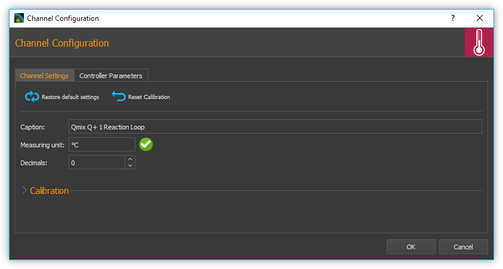
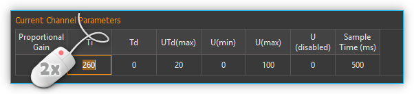

Liste der Regelkanäle
----------------------

Alle Qmix Regelkanäle werden in der Liste der Regelkanäle (:guilabel:`Controller Channels`)
angezeigt.

.. image:: Pictures/10000000000001D5000000F75FCDB73E.png
   :alt: Liste der Reglerkanäle

Die unterschiedlichen Kanaltypen (Kühlmodul Q-, Heizmodul Q+ ...) können Sie
an den unterschiedlichen Symbolen vor dem Kanalnamen unterscheiden
(siehe Abbildung oben). Die Liste der Regelkanäle ist ein
:ref:`View <Views (Ansichten)>`, den Sie durch Anklicken und Ziehen der Titelleiste
jederzeit an eine andere Position in der grafischen Oberfläche
verschieben oder aus der Oberfläche als separates Fenster herauslösen
können.

Die Kanalliste zeigt ihnen alle verfügbaren Regelkanäle in
Tabellenform an. Folgende Spalten sind vorhanden:

-  **Controller** - zeigt den Namen des Regelkanals und den Typ durch ein
   Symbol an.
-  **On** - zeigt durch eine grüne LED ob die Regelung ein- oder
   ausgeschaltet ist. Klicken Sie die LED an, um die Regelung ein- oder
   auszuschalten.
-  **Setpoint** - enthält den eingestellten Sollwert des Reglers
-  **Actual Value** - zeigt den aktuellen Ist-wert

Kanaltypen
~~~~~~~~~~~

Die folgenden Kanaltypen werden im Moment unterstützt:

======== =====================================================================
|image1| *Schneeflockensymbol* - Qmix Q- Kühlmodule
|image2| *Thermometersymbol* - Qmix Q+ Heizmodule und Qmix TC Module
|image3| *Symbol Reglerkurve* – dynamisch erzeugte, benutzerdefinierte Kanäle
======== =====================================================================

Kanalnamen ändern
~~~~~~~~~~~~~~~~~~

Sie können den Namen eines Kanals jederzeit ändern und z.B. einen Namen
vergeben, der zu Ihrer speziellen Anwendung passt.

.. image:: Pictures/10000000000001D5000000F7561B0C23.png
   :alt: Kanalname ändern

Ändern Sie den Namen mit folgenden Schritten:

.. rst-class:: steps

#. Klicken Sie doppelt in die Tabellenzelle mit den Namen den Sie ändern
   möchten.
#. Geben Sie den neuen Namen in das Editierfenster ein, welches nun
   eingeblendet wird (siehe Abbildung oben)
#. Beenden Sie Ihre Eingabe durch Drücken der :kbd:`Return`-Taste.

Regelung ein- / ausschalten
~~~~~~~~~~~~~~~~~~~~~~~~~~~~

.. image:: Pictures/10000000000001D5000000D144CCA89A.png
   :alt: Regelung ein- / ausschalten

Zum Ein- und Ausschalten der Regelung klicken Sie einfach auf die LED
des Kanals, den Sie umschalten möchten.

Sollwert eingeben
~~~~~~~~~~~~~~~~~

Klicken Sie zur Eingabe des Sollwertes doppelt in die :guilabel:`Setpoint`-Spalte
des Kanals dessen Sollwert Sie ändern möchten. Geben Sie nun in das
Editierfenster das angezeigt wird (siehe Abbildung unten) den Sollwert
ein, oder verwenden Sie die Pfeil- Schaltflächen um den Sollwert
schrittweise zu verringern oder zu erhöhen.

.. image:: Pictures/10000000000001D5000000F728D7F291.png
   :alt: Sollwert ändern

Kontextmenü für Reglerkanäle
-----------------------------

Durch Rechtsklick in die Liste der Reglerkanäle können Sie ein
Kontextmenü mit zusätzlichen Funktionen einblenden:

.. image:: Pictures/100002010000022300000129ACB2B97D.png
   :alt: Kontextmenü aufrufen

Das Kontextmenü enthält die folgenden Menüpunkte:

+-----------+---------------------------------------------------------+
| |image18| | **Configure Channel...**                                |
|           |                                                         |
|           | Öffnet den Konfigurationsdialog des Kanals zur          |
|           | Konfiguration aller Kanalparameter.                     |
+-----------+---------------------------------------------------------+
| |image19| | **Restore Default Settings**                            |
|           |                                                         |
|           | Stellt die Standardeinstellungen des Kanals wieder her. |
+-----------+---------------------------------------------------------+
| |image20| | **Reset Calibration**                                   |
|           |                                                         |
|           | Setzt die Zweipunktskalierung zurück auf den            |
|           | Skalierungsfaktor 1 und den Offset 0                    |
+-----------+---------------------------------------------------------+
| |image21| | **Configure scaling...**                                |
|           |                                                         |
|           | Öffnet den Konfigurationsdialog mit der Seite zur       |
|           | Konfiguration der Reglerskalierung.                     |
+-----------+---------------------------------------------------------+
| |image22| | **Select PID parameters...**                            |
|           |                                                         |
|           | Öffnet den Konfigurationsdialog mit der Seite zur       |
|           | Auswahl und Erstellung von PID-Parametersätzen.         |
+-----------+---------------------------------------------------------+
| |image23| | **Delete user channel**                                 |
|           |                                                         |
|           | Wenn der ausgewählte Kanal ein benutzerdefinierter      |
|           | Kanal ist, wird dieser durch Anklicken dieses           |
|           | Menüpunktes gelöscht. Für andere Reglerkanäle ist       |
|           | dieser Menüpunkt ausgegraut.                            |
+-----------+---------------------------------------------------------+
| |image24| | **Create user channel**                                 |
|           |                                                         |
|           | Öffnet den Wizard zur Erstellung eines neuen            |
|           | benutzerdefinierten Reglerkanals.                       |
+-----------+---------------------------------------------------------+

Kanaleinstellungen konfigurieren
--------------------------------

Um den Konfigurationsdialog (siehe Abbildung unten) zur Einstellung der
Skalierung zu öffnen, wählen Sie im
`Kontextmenü für Reglerkanäle`_ den Menüpunkt
:menuselection:`Configure channel`.

Die Konfiguration der
allgemeinen Kanaleinstellungen sowie die Kalibrierung der Reglerkanäle
sind identisch mit der Konfiguration der :ref:`I/O Plugin`-Kanäle.
Lesen Sie für eine detaillierte Beschreibung der Konfiguration
den Abschnitt :ref:`I/O Kanal Konfiguration`.

Auswahl und Konfiguration von Reglerparametern
----------------------------------------------

Übersicht
~~~~~~~~~

Um das Regelverhalten der einzelnen Reglerkanäle optimal an Ihre
Anwendung anzupassen, können Sie für jeden einzelnen Kanal die
Regelparameter individuell anpassen. Dafür können Sie entweder aus einer
Liste von vordefinierten PID Parametersätzen wählen, oder neue
Parametersätze erstellen.

Um zur Reglerparameterauswahl zu gelangen, wählen Sie im
`Kontextmenü für Reglerkanäle`_ den Menüpunkt :menuselection:`Select PID parameters`.

.. image:: Pictures/100002010000034C000002287E739DAD.png
   :alt: Auswahl eines Reglerparametersets

Im oberen Bereich
sehen Sie die aktuellen Parameter des Gerätes :guinum:`❶` (:guilabel:`Current Channel Parameters`).
Im unteren Bereich finden Sie eine Liste mit :guilabel:`PID Parameter Presets` :guinum:`❷`.

Reglerparameter ändern
~~~~~~~~~~~~~~~~~~~~~~

Um die aktuellen Reglerparameter zu editieren, klicken Sie mit der Maus
im Bereich :guilabel:`Current Channel Parameters` doppelt in das Feld welches Sie
ändern möchten und geben den neuen Wert ein:

PID Parameter Preset auswählen
~~~~~~~~~~~~~~~~~~~~~~~~~~~~~~~

.. image:: Pictures/100002010000034C00000228CAC67298.png
   :alt: PID Parameter Preset auswählen

Wählen Sie aus der
Tabelle der vorhanden Parametersätze einen Parametersatz durch Anklicken
mit der linken Maustaste aus :guinum:`❶` und klicken Sie anschließend auf die
Schaltfläche :guilabel:`Apply Preset` :guinum:`❷` um die Regelparameter zu übernehmen.
Die Werte im Bereich :guilabel:`Current Channel Parameters` :guinum:`❸` werden mit den neuen
Werten aus dem Preset aktualisiert. Schließen die Konfiguration durch
Anklicken der Schaltfläche :guilabel:`Ok` :guinum:`❹` ab.

Die PID Parameter Presets enthalten bereits vordefinierte
Standard-Reglerparameter für verschiedene Qmix Geräte (z.B. Qmix Q+,
Qmix Q- oder Qmix TC) oder bestimmtes Zubehör (z.B. Spritzenheizung oder
Schlauchheizung).

.. admonition:: Tipp
   :class: tip

   Zur optimalen Anpassung an die Regelstrecken
   in Ihrer Anwendung können Sie eigene Parametersätze mit
   Reglerparametern erstellen.

PID Parameter Preset erstellen
~~~~~~~~~~~~~~~~~~~~~~~~~~~~~~

Durch Anklicken der Schaltfläche :guilabel:`Create Preset` :guinum:`❶` erzeugen sie einen
neuen Satz von Reglerparametern :guinum:`❷`. (siehe Abbildung unten) Anschließend
können Sie die einzelnen Werte des Parametersets editieren indem Sie
doppelt in ein Feld klicken :guinum:`❸` und einen neuen Wert eingeben.

.. image:: Pictures/1000020100000335000000F62671DF1C.png
   :alt: Erstellen eines PID-Parametersatzes

Vergeben Sie für
jeden Parametersatz einen aussagekräftigen, eindeutigen Namen und passen
Sie die Reglerparameter an die Regelstrecke in Ihrer Anwendung an. Um
geeignete Parameter für einen Regelkreis zu finden, gehen Sie wie im
Abschnitt `Vorgehensweise für die Einstellung von Reglerparametern`_
beschrieben vor.

Löschen von PID Parameter Presets
~~~~~~~~~~~~~~~~~~~~~~~~~~~~~~~~~

Sie löschen einen Reglerparametersatz, indem sie ihn durch Anklicken mit
der linken Maustaste auswählen :guinum:`❶` und anschließend die Schaltfläche
:guilabel:`Delete Selected Preset` :guinum:`❷` klicken.

.. image:: Pictures/1000020100000333000000D15C7BAB96.png
   :alt: Löschen eines Reglerparametersets

.. admonition:: Wichtig
   :class: note

   Vordefinierte Standard-Reglerparameter
   sind gesperrt und können nicht gelöscht werden.
   Gesperrte Parameter erkennen Sie in der Tabelle an dem
   gelben Schloss.

Benutzerdefinierte Reglerkanäle
-------------------------------

Einführung
~~~~~~~~~~

Sie können benutzerdefinierte Reglerkanäle erzeugen, bei denen Sie
beliebige Geräteeigenschaften (Device Properties) als Ein- und
Ausgangsgrößen für die Regelschleife verwenden können. Damit wird es
z.B. möglich mit Hilfe eines Druckmesskanals eines *Qmix p*-Gerätes und
einer *Nemesys Spritzenpumpe* eine Druckregelung aufzubauen oder eine
druckgesteuerte Dosierung zu realisieren.

Erstellen von Reglerkanälen
~~~~~~~~~~~~~~~~~~~~~~~~~~~

Sie öffnen den Dialog zum Erzeugen von Reglerkanälen durch Rechtsklick
in die Reglerkanalliste und Auswahl der Menüpunktes :menuselection:`Create user channel`
im Kontextmenü.

.. image:: Pictures/100002010000022300000129BD54D696.png
   :alt: Dialog für das Erstellen eines Reglerkanals aufrufen

Im Konfigurationswizard der Ihnen nun angezeigt wird, gehen Sie wie folgt
vor:

.. image:: Pictures/1000020100000340000001A6ED2C69A6.png
   :alt: Ein- und Ausgangsgrößen des Reglerkanals auswählen

.. rst-class:: steps

#. Wählen Sie das Gerät, welches die Messgröße
   (Eingangsgröße) des Reglers zur Verfügung stellen soll: :guilabel:`Controller Input`.
#. Wählen Sie die Geräteeigenschaft (*Device Property*) aus, die als
   Messgröße verwendet werden soll.
#. Wählen Sie das Gerät, welches die Stellgröße (Ausgangsgröße) des
   Reglers zur Verfügung stellen soll: :guilabel:`Controller Output`.
#. Wählen Sie die Geräteeigenschaft (*Device Property*) aus, die als
   Stellgröße verwendet werden soll.
#. Klicken Sie auf die Schaltfläche :guilabel:`Next`, um die Konfiguration
   fortzusetzen.

Abschließend erscheint ein Fenster für die Konfiguration und Auswahl von
Reglerparametern. Dort können Sie wie im Abschnitt
`Auswahl und Konfiguration von Reglerparametern`_
beschrieben, die Reglerparameter konfigurieren. Durch Anklicken der
Schaltfläche :guilabel:`Finish` schließen sie die Erstellung des Reglerkanals ab.

.. admonition:: Tipp
   :class: tip

   Sie können die Reglerparameter später
   jederzeit ändern und so optimal an ihre Regelstrecke
   anpassen.

Änderung der Stellgrößenskalierung oder -einheit
~~~~~~~~~~~~~~~~~~~~~~~~~~~~~~~~~~~~~~~~~~~~~~~~

Die Stellgröße, wie zum Beispiel die Flussrate eines
Nemesys-Dosiersystems bei einer Druckregelung oder der Wert eines
analogen Ausgangs bei einer Temperaturregelung, wird durch den
PID-Regelalgorithmus ermittelt und unskaliert an das entsprechende Gerät
ausgegeben. Das bedeutet, dass sie, die Reglerparameter, besonders die
Stellgrößengrenzen, jedes Mal neu anpassen müssen, wenn sie die
Skalierung oder die Einheit des entsprechenden Gerätes ändern. Bei einem
Nemesys-Dosiersystem trifft dies auch zu, wenn sie die Spritzengröße
ändern, da sich hierdurch der Flussratenbereich ändert.

.. admonition:: Wichtig
   :class: note

   Wenn sie die Skalierung oder Einheit eines
   Gerätes ändern, das Bestandteil eines Regelkreises ist,
   müssen sie die Reglerparameter kontrollieren und diese
   gegebenenfalls anpassen. Bei einem Nemesys-Dosiersystem
   trifft dies auch zu, wenn sie die Spritzengröße ändern.

