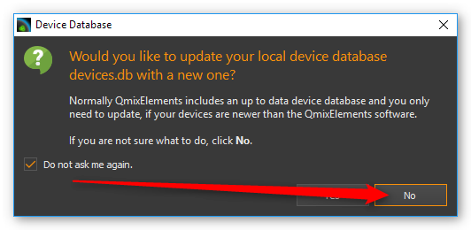
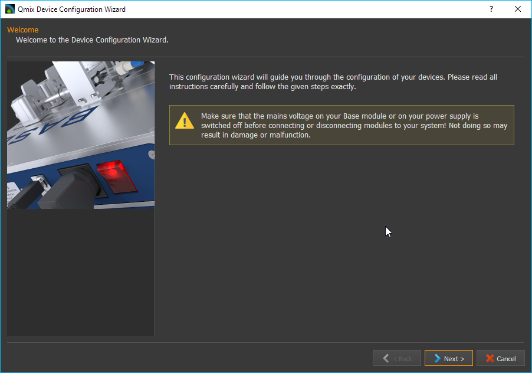
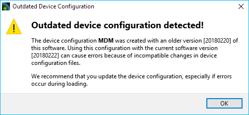

Erstellen von Gerätekonfigurationen
===================================

Einleitung
----------

Um einzelne Geräte oder komplette Systeme bestehend aus mehreren
Einzelgeräten in CETONI Elements zu benutzen, müssen Sie eine
Gerätekonfiguration erstellen. Hierfür verwenden Sie den
*Gerätekonfigurator*, welcher in CETONI Elements integriert ist. Der
Gerätekonfigurator enthält einen *Konfigurationsassistenten*, der Sie bei
der Konfiguration ihrer Geräte unterstützt.

Aufruf des Gerätekonfigurators
------------------------------

Sie starten den Gerätekonfigurator durch Auswahl des Menüpunktes
:menuselection:`Device --> Create Configuration` im Hauptmenü.

.. image:: Pictures/1000020100000142000000E460C63C6ECF459963.png
   :alt: Aufruf Gerätekonfigurator

Um den Gerätekonfigurator zur Konfiguration Ihrer Geräte zu verwenden, muss eine gültige Lizenz
installiert sein. Wenn Sie keine Lizenz besitzen, können Sie die Erstellung von
Gerätekonfigurationen testen, sie können ihre Geräte aber nicht mit
Hilfe des Konfigurationsassistenten :guinum:`❶` konfigurieren. Eine nicht
aktivierte Software-Version erkennen Sie an einer Warnmeldung in der
Statusleiste des Gerätekonfigurators :guinum:`❷` (siehe Abbildung unten).

.. figure:: Pictures/1000020100000335000001D8DF2765F4CE46116A.png
   :alt: nicht aktivierte Version des Gerätekonfigurators

.. admonition:: Wichtig
   :class: note

   Wenn Sie Ihre echten Geräte konfigurieren möchten, aktivieren Sie Ihre Lizenz,
   bevor Sie den *Gerätekonfigurator* starten. Eine Anleitung dazu finden Sie im
   Kapitel :ref:`Lizenzen aktivieren`.

Importieren einer Gerätedatenbank
---------------------------------

Der Gerätekonfigurator und der Konfigurationsassistent verwenden eine
Gerätedatenbank (:file:`devices.db`) aus denen die gerätespezifischen
Parameter für die Konfiguration der Geräte auslesen werden. Bei der
Installation der CETONI Elements Software wird diese Gerätedatenbank
bereits installiert.

Wenn Sie Geräte verwenden, die noch nicht in der Gerätedatenbank
enthalten sind, müssen Sie ggf. eine aktuellere Version der
Gerätedatenbank importieren. Diese finden Sie entweder auf Ihrem
Installationsdatenträger oder Sie erhalten Sie direkt von CETONI.

Beim Start des Gerätekonfigurators, werden Sie gefragt, ob Sie eine neue
Gerätedatenbank importieren möchten. Wenn auf Ihrem
Installationsdatenträger die Datei :file:`devices.db` enthalten ist, sollten
Sie diese importieren.

.. admonition:: Tipp
   :class: tip

   Wenn keine Gerätedatenbank auf dem
   Installationsdatenträger vorhanden ist, wird ihr Gerät
   bereits durch die CETONI Elements Software unterstützt
   und Sie können den Import überspringen.

.. rst-class:: steps

#. Bestätigen sie die Abfrage durch Linksklick auf die Schaltfläche :guilabel:`Yes`.

   .. image:: Pictures/100002010000021400000104F1C5A4A3FB36B583.png
      :alt: Abfrage Gerätedatenbankimport

#. Es öffnet sich ein
   Dateidialog. Wählen sie die Datenbankdatei :file:`devices.db`, die sich im
   Wurzelverzeichnis der mitgelieferten CETONI Elements CD befindet (siehe Abbildung unten).

   .. image:: Pictures/100002010000030C000001D07377795B057AC007.png
      :alt: Dateidialog Gerätedatenbank

#. Der Gerätekonfigurator verfügt jetzt über eine aktuelle Gerätedatenbank.

.. admonition:: Wichtig
   :class: note

   Die Gerätedatenbank enthält wichtige
   Konfigurationsinformationen über ihre Geräte. Sie müssen
   immer dann eine aktuelle Gerätedatenbank importieren,
   wenn sie ein neues Gerät der cetoni GmbH erwerben.

Solange sie keine neuen Geräte erwerben, müssen sie nicht bei jedem
Start des Gerätekonfigurators eine Gerätedatenbank importieren. Wenn Sie
nicht möchten, dass CETONI Elements sie weiter nach einer
Gerätedatenbank fragt, setzen sie den Haken bei :guilabel:`Do not ask me again` und
klicken sie auf die Schaltfläche :guilabel:`No` (siehe Abbildung unten).

Wenn sie zukünftig eine
Gerätedatenbank importieren möchten, erreichen sie den Import-Dialog
über den Menüpunkt :menuselection:`Device → Import Device Database` des Hauptmenüs
(siehe Abbildung unten).

.. image:: Pictures/100002010000012C000000D9432772F445244F1B.png
   :alt: Menüpunkt Gerätedatenbank importieren

.. admonition:: Tipp
   :class: tip

   Sie müssen nicht bei jedem Start des
   Gerätekonfigurators eine Gerätedatenbank importieren.
   Solange sie keine neuen Geräte erwerben, müssen Sie kein
   neue Gerätedatenbank importieren.

Übersicht
---------

.. image:: Pictures/10000201000003A8000002551C97F93586909741.png
   :alt: Übersicht Gerätekonfigurator

Der Gerätekonfigurator
ist in folgende drei Bereiche untergliedert:

.. rst-class:: guinums

1. **Toolbar** – Funktionen zum Anlegen, Laden und Speichern von
   Konfigurationen, sowie zum Starten des Konfigurationsassistenten
2. **Device List** – Auswahl aller konfigurierbaren Geräte
3. **Device configuration** – individuelle, vom Nutzer erstellte Gerätekonfiguration

Die Werkzeugleiste
------------------

Die Werkzeugleiste enthält folgende Funktionen:

+-----------+---------------------------------------------------------+
| |image26| | Erstellt eine neue, leere Gerätekonfiguration.          |
+-----------+---------------------------------------------------------+
| |image27| | Lädt eine vorhandene Gerätekonfiguration.               |
+-----------+---------------------------------------------------------+
| |image28| | Speichert die erstellte Gerätekonfiguration.            |
+-----------+---------------------------------------------------------+
| |image29| | Speichert die erstellte Gerätekonfiguration unter einem |
|           | neuen Namen.                                            |
+-----------+---------------------------------------------------------+
| |image30| | Setzt alle Geräte der Konfiguration als simulierte      |
|           | Geräte.                                                 |
+-----------+---------------------------------------------------------+
| |image31| | Startet den Dialog für die Auswahl von Add-On-Plugins.  |
|           | Es handelt sich dabei um optionale Erweiterungen der    |
|           | Software, die CETONI, unter Umständen in Ihrem Auftrag, |
|           | kundenspezifisch entwickelt hat.                        |
+-----------+---------------------------------------------------------+
| |image32| | Startet den Konfigurationsassistenten.                  |
+-----------+---------------------------------------------------------+
| |image33| | Startet die Software mit der Gerätekonfiguration die im |
|           | Gerätekonfigurator aktiv ist                            |
+-----------+---------------------------------------------------------+

Der Konfigurationsassistent
---------------------------

Der *Konfigurationsassistent* unterstützt Sie bei der Integration ihrer Geräte
in ihre spezifische Gerätekonfiguration. Sie **müssen** ihn immer dann
ausführen, wenn Sie:

-  eine Gerätekonfiguration neu erstellen oder ändern.
-  Ein Gerät einer vorhanden Konfiguration tauschen oder ein neues Gerät
   einbinden.
-  Ihre CETONI Elements Software aktualisiert haben.

.. admonition:: Wichtig
   :class: note

   Konfiguration und Geräte gehören zusammen.
   Führen sie den Konfigurationsassistenten immer aus,
   wenn sie eine Konfiguration ändern oder ein anderes
   Gerät in eine vorhandene Konfiguration einbinden
   wollen.

Ihre Gerätekonfiguration sollte stets mit der Softwareversion erstellt
worden sein, mit der Sie die Konfiguration verwenden möchten, da es
sonst unter Umständen zu Fehlern kommen kann. Wenn die
Gerätekonfiguration mit einer anderen Softwareversion erstellt wurde,
erhalten Sie beim Start der Anwendung einen Warnhinweis.

Wenn Sie diese Warnung sehen, sollten Sie die
Gerätekonfiguration im Gerätekonfigurator öffnen, speichern und dann
alle Geräte mit dem Konfigurationsassistenten konfigurieren.

Erstellung einer Beispielkonfiguration
--------------------------------------

Im folgenden Beispiel wird die Erstellung einer Gerätekonfiguration
bestehend aus einem Nemesys s Dosiermodul und einem Qmix Q+ Modul erklärt.

.. rst-class:: steps

#. Starten sie den Gerätekonfigurator wie in Abschnitt
   :ref:`Aufruf des Gerätekonfigurators` beschrieben.
#. Klicken sie mit der linken Maustaste auf die Nemesys S Spritzenpumpe
   in der Geräteliste :guinum:`❶` und halten sie diese gedrückt.
#. Ziehen sie die Nemesys S Pumpe mit gedrückter Maustaste in die
   Gerätekonfiguration :guinum:`❷`. Sobald sie die Maustaste loslassen, wird die
   Pumpe in die Konfiguration eingefügt. Alternativ können Sie ein
   Gerät auch hinzufügen, indem Sie es in der Geräteliste doppelt
   anklicken.

   .. admonition:: Tipp
      :class: tip

       Sie können Geräte via Drag & Drop oder durch Doppelklick hinzufügen.

   .. image:: Pictures/1000020100000315000001F95769560860DF416C.png
      :alt: Erstellen der Gerätekonfiguration

   .. admonition:: Tipp
      :class: tip

      Sie können Geräte aus der Gerätekonfiguration
      entfernen, indem Sie das Gerät durch Anklicken
      auswählen und dann die Entfernen Taste drücken.

#. Verfahren Sie auf gleiche Weise mit dem Qmix Q+ Modul.
#. Speichern Sie Ihre Konfiguration jetzt unter einem aussagekräftigen
   Namen ab durch Klick auf Sie Schaltfläche :guilabel:`Save` :guinum:`❸`.
#. Starten sie durch Klicken mit der linken Maustaste auf die
   Schaltfläche :guilabel:`Configure` :guinum:`❹` den Konfigurationsassistenten .

   .. admonition:: Achtung
         :class: caution

         Schalten Sie das Basismodul immer aus,
         bevor Sie Geräte entfernen oder anstecken um Schaden an
         den Geräten zu vermeiden.

#. Der Konfigurationsassistent fordert sie nun auf, folgende Schritte
   durchzuführen:

   -  Schließen Sie die Nemesys S Pumpe an das Basismodul an.
   -  Schalten Sie den Power Schalter der Nemesys S Pumpe in die
      ON-Stellung.
   -  Schalten Sie den Power Schalter von allen anderen Geräten
      die am Basismodul angeschlossen sind aus.
   -  Entfernen Sie alle Geräte vom Basismodul, die nicht über
      einen Schalter verfügen um sie auszuschalten – das wäre in
      diesem Fall das Qmix Q+ Modul (Schalten Sie das Basismodul
      aus, bevor Sie Geräte entfernen und anstecken).
   -  Stecken sie den Busterminator auf das letzte Modul in Ihrem
      System – die Nemesys S Pumpe.
   -  Schalten Sie das Basismodul wieder ein.
   -  Überprüfen Sie, dass die Nemesys S Pumpe, welche Sie
      konfigurieren möchten, das einzige Modul, welches nun
      eingeschaltet ist. Während der Konfiguration des Moduls,
      dürfen sich keine anderen eingeschalteten Geräte am
      Basismodul befinden.

   .. image:: Pictures/10000201000003860000027872DE1FBA980DE172.png

   .. admonition:: Wichtig
      :class: note

      Während der Konfiguration eines Gerätes
      dürfen Siech keine anderen eingeschalteten Geräte am
      Basismodul befinden, da es ansonsten zu Fehlern bei der
      Konfiguration oder zu späteren Fehlfunktionen kommen
      kann.

   -  Klicken sie mit der linken Maustaste auf die Schaltfläche :guilabel:`Next`
      um fortzufahren.

#. Die Nemesys S Pumpe wird konfiguriert. Dies kann einige Sekunden dauern.

   .. image:: Pictures/1000020100000386000002783B7DFF9EE7B610D1.png
      :alt: Gerät wird konfiguriert

#. Der Konfigurationsassistent zeigt Ihnen die erfolgreiche
   Konfiguration der Nemesys S Pumpe an. Klicken sie mit der linken
   Maustaste auf die Schaltfläche :guilabel:`Next` um fortzufahren.

   .. image:: Pictures/1000020100000386000002780368D5E4C23E8331.png
      :alt: Gerätekonfiguration erfolgreich

#. Der Konfigurationsassistent fordert sie auf, folgende Schritte zu tätigen:

   -  Verbinden Sie das Qmix Q+ Modul mit Ihrem Basismodul
      (Schalten Sie das Basismodul aus, bevor Sie Geräte entfernen
      und anstecken).
   -  Schalten Sie den Power Schalter von allen anderen Geräten
      die am Basismodul angeschlossen sind aus – das wäre in
      diesem Fall die Nemesys S Pumpe. Alternative können Sie auch
      die Nemesys S Pumpe vom Basismodul entfernen und nur das
      Qmix Q+ Modul anschließen.
   -  Entfernen Sie alle Geräte vom Basismodul, die nicht über
      einen Schalter verfügen um sie auszuschalten.
   -  Stecken sie den Busterminator auf das letzte Modul in Ihrem
      System.
   -  Schalten Sie das Basismodul wieder ein.
   -  Überprüfen Sie, dass das Qmix Q+ Modul das einzige Modul ist
      welches nun eingeschaltet ist. Während der Konfiguration des
      Moduls, dürfen sich keine anderen eingeschalteten Geräte
      Basismodul befinden.

   .. image:: Pictures/100002010000038600000278BB49B91B78BAF742.png
      :alt: Konfiguriertes Gerät trennen

#. Klicken Sie :guilabel:`Next`, um das QmixQ+ Modul zu konfigurieren.
#. Setzen sie auf der folgenden Seite mit der linken Maustaste das
   Häkchen neben *Import and activate new device configuration into
   CETONI Elements now*. Auf diese Weise aktiviert CETONI Elements die
   neue Gerätekonfiguration und startet nach dem Beenden des
   Konfigurationsassistenten neu.

   .. image:: Pictures/10000201000002DC000001E9CA80FBFC63198D1D.png
      :alt: Gerätekonfiguration aktivieren

#. Bereiten sie den Neustart von CETONI Elements mit der erstellten Konfiguration vor:

   -  Schalten sie das Basismodul aus.
   -  Verbinden Sie die Nemesys S Pumpe und das Qmix Q+ Modul mit dem
      Basismodul.
   -  Stecken sie den Busterminator an.
   -  Schalten sie das Basismodul wieder ein.
   -  Schalten Sie den Power Schalter der Nemesys S Pumpe ein
   -  Schließen sie den Konfigurationsassistenten durch Betätigen der
      Schaltfläche :guilabel:`Finish` ab.

   .. image:: Pictures/10000201000002DC000001E960A7B6801635EFFC.png
      :alt: Abschluss des Konfigurationsassistenten

#. Bestätigen sie den Neustart der Software mit der neuen Konfiguration.

   .. image:: Pictures/1000020100000209000000973518A94FC04F6523.png
      :alt: Neustart von CETONI Elements bestätigen

#. CETONI Elements steht Ihnen nun mit den Funktionen der Nemesys S Pumpe und
   des Qmix Q+ Moduls zur Verfügung.

Erweitern einer vorhandenen Konfiguration
-----------------------------------------

Im folgenden Beispiel wird gezeigt, wie sie die im vorangegangenen
Abschnitt erzeugte Konfiguration bestehend aus einem Nemesys S Dosiermodul
und einem Qmix Q+ Modul um ein weiteres Gerät erweitern können.

.. rst-class:: steps

#. Starten sie den Gerätekonfigurator wie in Abschnitt
   :ref:`Aufruf des Gerätekonfigurators` beschrieben.
#. Nach dem Start des Gerätekonfigurators wird die Konfiguration
   angezeigt, die momentan durch die CETONI Elements Software geladen
   wurde. Die grünen Haken über den Geräten bedeuten ihnen, dass die
   Geräte bereits konfiguriert wurden.

   .. image:: Pictures/1000020100000495000002DBC4E00C234E4AF418.png
      :alt: Anzeige der geladenen Konfiguration

#. Möchten Sie eine andere Konfiguration als die, die derzeit von der CETONI
   Elements Software geladen wurde, ändern, müssen sie diese über die
   Schaltfläche :guilabel:`Open` in der Werkzeugleiste aufrufen.

   .. image:: Pictures/100002010000025F000000564EB0B2BD3EA73911.png
      :alt: Laden einer Gerätekonfiguration

#. Fügen Sie, wie im vorangegangenen Abschnitt beschrieben, ein weiteres Gerät durch Drag
   & Drop hinzu. Das Ausrufezeichen über dem neuen Gerät zeigt Ihnen,
   dass das Gerät noch nicht konfiguriert wurde. Die Konfiguration ist
   in diesem Zustand noch nicht verwendbar.

   .. image:: Pictures/1000020100000495000002DBE574762DF8C08052.png
      :alt: Hinzufügen eines Gerätes zu einer bestehenden Konfiguration

   .. admonition:: Wichtig
      :class: note

      Beinhaltet eine Gerätekonfiguration nicht
      konfigurierte Geräte, dann ist sie (noch) ungültig und
      kann nicht verwendet werden.

#. Starten sie den *Konfigurationsassistenten* durch Anklicken der
   Schaltfläche :guilabel:`Configure`.

   .. image:: Pictures/100002010000026E0000005A49AF5264C0E989FD.png
      :alt: Starte den Konfigurationsassistenten

#. Wenn die Software bereits mit den angeschlossenen Geräten
   verbunden wurde, dann kann der Konfigurationsprozess nicht
   fortgesetzt werden. In diesem Fall schlägt ihnen der
   Konfigurationsassistent vor, die Software und den Gerätekonfigurator
   automatisch neu zu starten. Klicken sie auf die Schaltfläche :guilabel:`Yes`,
   wenn sie den Konfigurationsprozess fortsetzen möchten.

   .. image:: Pictures/1000020100000214000000B9F911FCCD726CA849.png
      :alt: Neustart des Gerätekonfigurators

#. Es startet der aus dem vorangegangenen Abschnitt bekannte Konfigurationsablauf. Auf
   der zweiten Seite schlägt ihnen der Assistent diesmal jedoch vor,
   bereits konfigurierte Geräte vom Konfigurationsprozess
   auszuschließen. Setzen sie den Haken neben :guilabel:`Skip configured devices`.

   .. image:: Pictures/10000201000002DC000001A6F3562502AF0DE59C.png
      :alt: konfigurierte Geräte auslassen

#. Der *Konfigurationsassistent* fährt nun direkt mit der Konfiguration des
   neu hinzugefügten Gerätes (im Beispiel Qmix P) fort.

   .. image:: Pictures/10000201000002DC000001C34265519F69AC6D55.png
      :alt: Konfiguration des neuen Gerätes

#. Führen sie den Konfigurationsablauf auf die gleiche Weise wie beim Neuerstellen
   einer Konfiguration zu Ende.
#. Nach dem Neustart der Software steht Ihnen nun auch die Funktionalität des
   neuen Gerätes zur Verfügung.

Konfiguration eines einzelnen Gerätes
-------------------------------------

Sie können im Gerätekonfigurator auch jederzeit nur ein einzelnes Gerät
aus Ihrer Konfiguration konfigurieren – z.B. wenn Sie ein defektes Gerät
gegen ein neues getauscht haben. Klicken Sie dazu einfach mit der
rechten Maustaste auf das Gerät, welches konfiguriert werden soll und
wählen Sie den Menüpunkt :menuselection:`Configure`.

.. image:: Pictures/1000020100000432000002BB096CA19B52A6276F.png
   :alt: Einzelgerät konfigurieren

Der Konfigurationsassistent führt Sie nun durch die Konfiguration des einzelnen Gerätes.

Simulierte Geräte
-----------------

Sie können einzelne Geräte oder eine vollständige Gerätekonfiguration
simulieren. Dies ist sinnvoll, wenn sie beispielsweise Skripte
programmieren und hierbei Geräte benutzen möchten, die Ihnen momentan
nicht zur Verfügung stehen. Die Demo-Konfiguration der CETONI
Elements-Software, zum Beispiel, besteht vollständig aus simulierten
Geräten. Um ein einzelnes Gerät zu simulieren gehen Sie wie folgt vor.

.. rst-class:: steps

#. Klicken Sie mit der rechten Maustaste auf das Gerät, das sie
   simulieren möchten.
#. Klicken sie mit der linken Maustaste auf die Schaltfläche :guilabel:`Simulate`.

   .. image:: Pictures/100002010000024900000114FAB67531E84DD8FF.png
      :alt: Simulieren eines einzelnen Gerätes

#. Das Gerät wird hierauf als simuliertes Gerät gekennzeichnet. Speichern Sie die
   Konfiguration. Wenn Sie CETONI Elements das nächste Mal mit dieser
   Gerätekonfiguration laden, wird Ihnen das Gerät als simuliertes
   Gerät zur Verfügung stehen.

   .. image:: Pictures/100002010000024500000103CAAD327CC34BFAE1.png
      :alt: Simuliertes Gerät

Eine gesamte Gerätekonfiguration simulieren Sie, indem sie die Schaltfläche
:guilabel:`Simulate All` in der Hauptwerkzeugleiste mit der linken Maustaste anklicken.

.. image:: Pictures/10000201000003A4000001AB6990B251D2B11E55.png
   :alt: Simulieren einer gesamten Gerätekonfiguration

.. |image26| image:: Pictures/100016B7000034EB000034EBF007ABD978022879.svg
   :width: 40
.. |image27| image:: Pictures/1000069300003505000035059CEEC88E17AC3A44.svg
   :width: 40
.. |image28| image:: Pictures/10000CE50000350500003505303BFDEECD65BB70.svg
   :width: 40
.. |image29| image:: Pictures/1000173B0000387200003872AFCF364C5ED9850F.svg
   :width: 40
.. |image30| image:: Pictures/100011C0000034EB000034EBDA043906CEBA5F5A.svg
   :width: 40
.. |image31| image:: Pictures/10000AD00000350500003505C47905C00A889D90.svg
   :width: 40
.. |image32| image:: Pictures/10002680000034EB000034EBD15B809B1EA625C8.svg
   :width: 40
.. |image33| image:: Pictures/10001BD3000034EB000034EBF4CF559786D64E36.svg
   :width: 40
