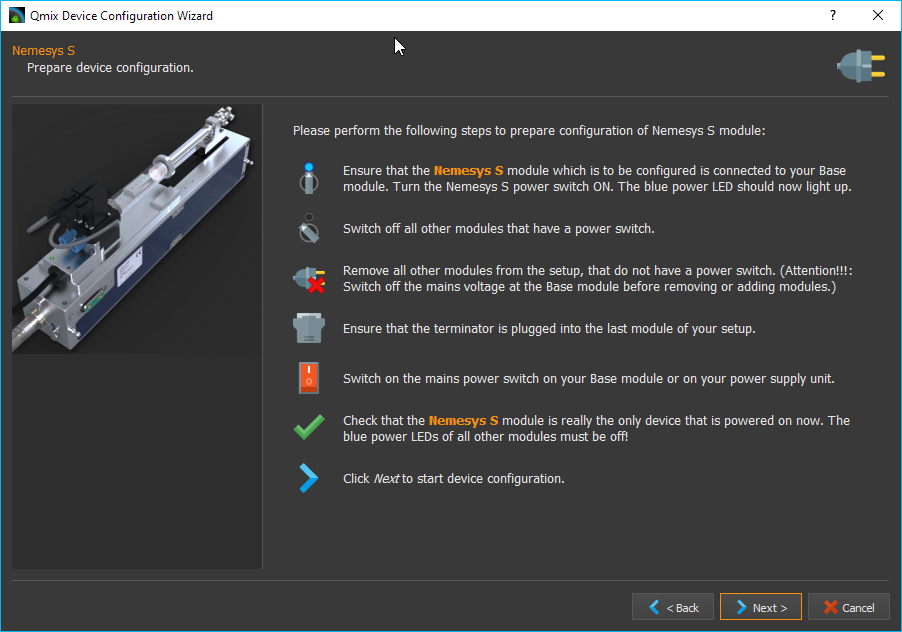
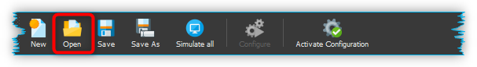

Erstellen von Gerätekonfigurationen
===================================

Einleitung
----------

Um einzelne Geräte oder komplette Systeme bestehend aus mehreren
Einzelgeräten in CETONI Elements zu benutzen, müssen Sie eine
Gerätekonfiguration erstellen. Hierfür verwenden Sie den
*Gerätekonfigurator*, welcher in CETONI Elements integriert ist. Der
Gerätekonfigurator enthält einen Konfigurationsassistenten, der Sie bei
der Konfiguration ihrer Geräte unterstützt.

Aufruf des Gerätekonfigurators
------------------------------

|Abbildung 1.1: Aufruf Gerätekonfigurator|\ Sie starten den
Gerätekonfigurator durch Auswahl des Menüpunktes *Device → Create*
*Configuration* im Hauptmenü.

Importieren einer Gerätedatenbank
---------------------------------

Der Gerätekonfigurator und der Konfigurationsassistent verwenden eine
Gerätedatenbank (*devices.db*) aus denen die gerätespezifischen
Parameter für die Konfiguration der Geräte auslesen werden. Bei der
Installation der CETONI Elements Software wird diese Gerätedatenbank
bereits installiert.

Wenn Sie Geräte verwenden, die noch nicht in der Gerätedatenbank
enthalten sind, müssen Sie ggf. eine aktuellere Version der
Gerätedatenbank importieren. Diese finden Sie entweder auf Ihrem
Installationsdatenträger oder Sie erhalten Sie direkt von CETONI.

Beim Start des Gerätekonfigurators, werden Sie gefragt, ob Sie eine neue
Gerätedatenbank importieren möchten. Wenn auf Ihrem
Installationsdatenträger die Datei *devices.db* enthalten ist, sollten
Sie diese importieren.

+----------+----------------------------------------------------------+
| |image3| | **Tipp**. Wenn keine Gerätedatenbank auf dem             |
|          | Installationsdatenträger vorhanden ist, wird ihr Gerät   |
|          | bereits durch die CETONI Elements Software unterstützt   |
|          | und Sie können den Import überspringen.                  |
+----------+----------------------------------------------------------+

(1) Bestätigen sie die Abfrage durch Linksklick auf die Schaltfläche
    *Yes*.
(2) |Abbildung 1.2: Abfrage Gerätedatenbankimport|\ Es öffnet sich ein
    Dateidialog. Wählen sie die Datenbankdatei *devices.db*, die sich im
    Wurzelverzeichnis der mitgelieferten CETONI Elements CD befindet,
    und klicken sie mit der linken Maustaste auf die Schaltfläche
    *Öffnen*.
(3) |Abbildung 1.3: Dateidialog Gerätedatenbank|\ Der Gerätekonfigurator
    verfügt jetzt über eine aktuelle Gerätedatenbank.

+----------+----------------------------------------------------------+
| |image6| | **Wichtig**. Die Gerätedatenbank enthält wichtige        |
|          | Konfigurationsinformationen über ihre Geräte. Sie müssen |
|          | immer dann eine aktuelle Gerätedatenbank importieren,    |
|          | wenn sie ein neues Gerät der cetoni GmbH erwerben.       |
+----------+----------------------------------------------------------+

Solange sie keine neuen Geräte erwerben, müssen sie nicht bei jedem
Start des Gerätekonfigurators eine Gerätedatenbank importieren. Wenn Sie
nicht möchten, dass CETONI Elements sie weiter nach einer
Gerätedatenbank fragt, setzen sie den Haken bei *Do not ask again und
klicken sie auf die Schaltfläche No\ (siehe Abbildung unten).*

|Abbildung 1.4: Abfrage Gerätedatenbank|\ Wenn sie zukünftig eine
Gerätedatenbank importieren möchten, erreichen sie den Import-Dialog
über den Menüpunkt *Device → Import Device Database* des Hauptmenüs
(siehe Abbildung unten).

.. figure:: ./Pictures/100002010000012C000000D9432772F445244F1B.png
   :alt: Abbildung 1.5: Menüpunkt Gerätedatenbank importieren
   :width: 7.939cm
   :height: 5.743cm

   Abbildung 1.5: Menüpunkt Gerätedatenbank importieren

+----------+----------------------------------------------------------+
| |image9| | **Tipp**. Sie müssen nicht bei jedem Start des           |
|          | Gerätekonfigurators eine Gerätedatenbank importieren.    |
|          | Solange sie keine neuen Geräte erwerben, müssen Sie kein |
|          | neue Gerätedatenbank importieren.                        |
+----------+----------------------------------------------------------+

Aktivierung des Gerätekonfigurators
-----------------------------------

Um den Gerätekonfigurator zu verwenden, benötigen Sie eine gültige
Lizenz. Wenn Sie keine Lizenz besitzen, können Sie die Erstellung von
Gerätekonfigurationen testen, sie können ihre Geräte aber nicht mit
Hilfe des Konfigurationsassistenten ❶ konfigurieren. Eine nicht
aktivierte Software-Version erkennen Sie an einer Warnmeldung in der
Statusleiste des Gerätekonfigurators ❷ (siehe Abbildung unten). Die
Aktivierung von CETONI Elements wird im Kapitel `Lizenz
aktivieren <#4.4.Lizenz aktivieren|outline>`__ beschrieben.

.. figure:: ./Pictures/1000020100000335000001D8DF2765F4CE46116A.png
   :alt: Abbildung 1.6: nicht aktivierte Version des Gerätekonfigurators
   :width: 16.14cm
   :height: 9.278cm

   Abbildung 1.6: nicht aktivierte Version des Gerätekonfigurators

Übersicht
---------

|Abbildung 1.7: Übersicht Gerätekonfigurator|\ Der Gerätekonfigurator
ist in folgende drei Bereiche untergliedert:

1.  Werkzeugleiste – Funktionen zum Anlegen, Laden und Speichern von
   Konfigurationen, sowie zum Starten des Konfigurationsassistenten
2.  Geräteliste – Auswahl aller konfigurierbaren Geräte
3.  individuelle, vom Nutzer erstellte Gerätekonfiguration

Die Werkzeugleiste
------------------

Die Werkzeugleiste enthält folgende Funktionen:

+-----------+---------------------------------------------------------+
| |image26| | Erstellt eine neue, leere Gerätekonfiguration.          |
+-----------+---------------------------------------------------------+
| |image27| | Lädt eine vorhandene Gerätekonfiguration.               |
+-----------+---------------------------------------------------------+
| |image28| | Speichert die erstellte Gerätekonfiguration.            |
+-----------+---------------------------------------------------------+
| |image29| | Speichert die erstellte Gerätekonfiguration unter einem |
|           | neuen Namen.                                            |
+-----------+---------------------------------------------------------+
| |image30| | Setzt alle Geräte der Konfiguration als simulierte      |
|           | Geräte.                                                 |
+-----------+---------------------------------------------------------+
| |image31| | Startet den Dialog für die Auswahl von Add-On-Plugins.  |
|           | Es handelt sich dabei um optionale Erweiterungen der    |
|           | Software, die CETONI, unter Umständen in Ihrem Auftrag, |
|           | kundenspezifisch entwickelt hat.                        |
+-----------+---------------------------------------------------------+
| |image32| | Startet den Konfigurationsassistenten.                  |
+-----------+---------------------------------------------------------+
| |image33| | Startet die Software mit der Gerätekonfiguration die im |
|           | Gerätekonfigurator aktiv ist                            |
+-----------+---------------------------------------------------------+

Der Konfigurationsassistent
---------------------------

|Abbildung 1.8: Der Konfigurationsassistent|\ Der
Konfigurationsassistent unterstützt Sie bei der Integration ihrer Geräte
in ihre spezifische Gerätekonfiguration. Sie müssen ihn immer dann
ausführen, wenn Sie:

-  eine Gerätekonfiguration neu erstellen oder ändern.
-  Ein Gerät einer vorhanden Konfiguration tauschen oder ein neues Gerät
   einbinden.
-  Ihre CETONI Elements Software aktualisiert haben

+-----------+---------------------------------------------------------+
| |image36| | **Wichtig**. Konfiguration und Geräte gehören zusammen. |
|           | Führen sie den Konfigurationsassistenten immer aus,     |
|           | wenn sie eine Konfiguration ändern oder ein anderes     |
|           | Gerät in eine vorhandene Konfiguration einbinden        |
|           | wollen.                                                 |
+-----------+---------------------------------------------------------+

Ihre Gerätekonfiguration sollte stets mit der Softwareversion erstellt
worden sein, mit der Sie die Konfiguration verwenden möchten, da es
sonst unter Umständen zu Fehlern kommen kann. Wenn die
Gerätekonfiguration mit einer anderen Softwareversion erstellt wurde,
erhalten Sie beim Start der Anwendung einen Warnhinweis.

|image37|\ Wenn Sie diese Warnung sehen, sollten Sie die
Gerätekonfiguration im Gerätekonfigurator öffnen, speichern und dann
alle Geräte mit dem Konfigurationsassistenten konfigurieren.

Erstellung einer Beispielkonfiguration
--------------------------------------

Im folgenden Beispiel wird die Erstellung einer Gerätekonfiguration
bestehend aus einem neMESYS Dosiermodul und einem Qmix Q+ Modul erklärt.

(1) Starten sie den Gerätekonfigurator wie in Abschnitt
    `1.2 <#anchor-1>`__ beschrieben.
(2) Klicken sie mit der linken Maustaste auf die Nemesys S Spritzenpumpe
    in der Geräteliste ❶ und halten sie diese gedrückt.
(3) Ziehen sie die Nemesys S Pumpe mit gedrückter Maustaste in die
    Gerätekonfiguration ❷. Sobald sie die Maustaste loslassen, wird die
    Pumpe in die Konfiguration eingefügt. Alternativ können Sie ein
    Gerät auch hinzufügen, indem Sie es in der Geräteliste doppelt
    anklicken.

+-----------+---------------------------------------------------------+
| |image40| | **Tipp**. Sie können Geräte via Drag & Drop oder durch  |
|           | Doppelklick hinzufügen.                                 |
+-----------+---------------------------------------------------------+

   Abbildung 1.9: Erstellen der Gerätekonfiguration

+-----------+---------------------------------------------------------+
| |image43| | **Tipp**. Sie können Geräte aus der Gerätekonfiguration |
|           | entfernen, indem Sie das Gerät durch Anklicken          |
|           | auswählen und dann die Entfernen Taste drücken.         |
+-----------+---------------------------------------------------------+

(1) Verfahren sie auf gleiche Weise mit dem Qmix Q+ Modul.
(2) Speichern Sie Ihre Konfiguration jetzt unter einem aussagekräftigen
    Namen ab durch Klick auf Sie Schaltfläche *Save* ❸.
(3) Starten sie durch Klicken mit der linken Maustaste auf die
    Schaltfläche *Configure* ❹ den Konfigurationsassistenten .

+-----------+---------------------------------------------------------+
| |image46| | **Wichtig**. Schalten Sie das Basismodul immer aus,     |
|           | bevor Sie Geräte entfernen oder anstecken um Schaden an |
|           | den Geräten zu vermeiden.                               |
+-----------+---------------------------------------------------------+

.. figure:: ./Pictures/1000020100000386000002786DDB775867DDCAEB.png
   :alt: Abbildung 1.10: Start des Konfigurationsassistenten
   :width: 15.937cm
   :height: 11.165cm

   Abbildung 1.10: Start des Konfigurationsassistenten

(1) Der Konfigurationsassistent fordert sie nun auf, folgende Schritte
    durchzuführen:

-  

   -  

      -  

         -  Schließen sie die Nemesys S Pumpe an das Basismodul an
         -  Schalten Sie den Power Schalter der Nemesys S Pumpe in die
            ON-Stellung
         -  Schalten Sie den Power Schalter von allen anderen Geräten
            die am Basismodul angeschlossen sind aus
         -  Entfernen Sie alle Geräte vom Basismodul, die nicht über
            einen Schalter verfügen um sie auszuschalten – das wäre in
            diesem Fall das Qmix Q+ Modul (Schalten Sie das Basismodul
            aus, bevor Sie Geräte entfernen und anstecken)
         -  Stecken sie den Busterminator auf das letzte Modul in Ihrem
            System – die Nemesys S Pumpe.
         -  Schalten Sie das Basismodul wieder ein
         -  Überprüfen Sie, dass die Nemesys S Pumpe, welche Sie
            konfigurieren möchten, das einzige Modul, welches nun
            eingeschaltet ist. Während der Konfiguration des Moduls,
            dürfen sich keine anderen eingeschalteten Geräte am
            Basismodul befinden

+-----------+---------------------------------------------------------+
| |image49| | **Wichtig**. Während der Konfiguration eines Gerätes    |
|           | dürfen Siech keine anderen eingeschalteten Geräte am    |
|           | Basismodul befinden, da es ansonsten zu Fehlern bei der |
|           | Konfiguration oder zu späteren Fehlfunktionen kommen    |
|           | kann.                                                   |
+-----------+---------------------------------------------------------+

-  

   -  Klicken sie mit der linken Maustaste auf die Schaltfläche *Next*
      um fortzufahren.

(1) Die Nemesys S Pumpe wird konfiguriert. Dies kann einige Sekunden
    dauern.

   Abbildung 1.11: Gerät wird konfiguriert

(1) Der Konfigurationsassistent zeigt Ihnen die erfolgreiche
    Konfiguration der Nemesys S Pumpe an. Klicken sie mit der linken
    Maustaste auf die Schaltfläche *Next* um fortzufahren.
(2) |Abbildung 1.12: Gerätekonfiguration erfolgreich|\ Der
    Konfigurationsassistent fordert sie auf, folgende Schritte zu
    tätigen:

-  

   -  

      -  

         -  Verbinden Sie das Qmix Q+ Modul mit Ihrem Basismodul
            (Schalten Sie das Basismodul aus, bevor Sie Geräte entfernen
            und anstecken)
         -  Schalten Sie den Power Schalter von allen anderen Geräten
            die am Basismodul angeschlossen sind aus – das wäre in
            diesem Fall die Nemesys S Pumpe. Alternative können Sie auch
            die Nemesys S Pumpe vom Basismodul entfernen und nur das
            Qmix Q+ Modul anschließen
         -  Entfernen Sie alle Geräte vom Basismodul, die nicht über
            einen Schalter verfügen um sie auszuschalten
         -  Stecken sie den Busterminator auf das letzte Modul in Ihrem
            System
         -  Schalten Sie das Basismodul wieder ein
         -  Überprüfen Sie, dass das Qmix Q+ Modul das einzige Modul ist
            welches nun eingeschaltet ist. Während der Konfiguration des
            Moduls, dürfen sich keine anderen eingeschalteten Geräte
            Basismodul befinden

(1) |Abbildung 1.13: Konfiguriertes Gerät trennen|\ Klicken Sie Next um
    das QmixQ+ Modul zu konfigurieren
(2) Setzen sie auf der folgenden Seite mit der linken Maustaste das
    Häkchen neben *Import andactivate new device configuration into
    QmixElements now*. Auf diese Weise aktiviert CETONI Elements die
    neue Gerätekonfiguration und startet nach dem Beenden des
    Konfigurationsassistenten neu.

(1) |Abbildung 1.14: Gerätekonfiguration aktivieren|\ Bereiten sie den
    Neustart von CETONI Elements mit der erstellten Konfiguration vor:

-  

   -  

      -  Schalten sie das Basismodul aus.
      -  Verbinden Sie die Nemesys S Pumpe und das Qmix Q+ Modul mit dem
         Basismodul.
      -  Stecken sie den Busterminator an.
      -  Schalten sie das Basismodul wieder ein.
      -  Schalten Sie den Power Schalter der Nemesys S Pumpe ein
      -  Schließen sie den Konfigurationsassistenten durch Betätigen der
         Schaltfläche *Finish* ab.

(1) |Abbildung 1.15: Abschluss des
    Konfigurationsassistenten|\ Bestätigen sie den Neustart der Software
    mit der neuen Konfiguration.
(2) |Abbildung 1.16: Neustart von CETONI Elements bestätigen|\ CETONI
    Elements steht Ihnen nun mit den Funktionen der Nemesys S Pumpe und
    des Qmix Q+ Moduls zur Verfügung.

Erweitern einer vorhandenen Konfiguration
-----------------------------------------

Im folgenden Beispiel wird gezeigt, wie sie die im vorangegangenen
Abschnitt erzeugte Konfiguration bestehend aus einem neMESYS Dosiermodul
und einem Qmix Q+ Modul um ein weiteres Gerät erweitern können.

(1) Starten sie den Gerätekonfigurator wie in Abschnitt
    `1.2 <#anchor-1>`__ beschrieben.
(2) Nach dem Start des Gerätekonfigurators wird die Konfiguration
    angezeigt, die momentan durch die CETONI Elements Software geladen
    wurde. Die grünen Haken über den Geräten bedeuten ihnen, dass die
    Geräte bereits konfiguriert wurden.
(3) |Abbildung 1.17: Anzeige der geladenen Konfiguration|\ Möchten sie
    eine andere Konfiguration als die, die derzeit von der CETONI
    Elements Software geladen wurde, ändern, müssen sie diese über die
    Schaltfläche *Load* in der Werkzeugleiste aufrufen.
(4) |Abbildung 1.18: Laden einer Gerätekonfiguration|\ Fügen Sie, wie im
    vorangegangenen Abschnitt beschrieben, ein weiteres Gerät durch Drag
    & Drop hinzu. Das Ausrufezeichen über dem neuen Gerät zeigt Ihnen,
    dass das Gerät noch nicht konfiguriert wurde. Die Konfiguration ist
    in diesem Zustand noch nicht verwendbar.

.. figure:: ./Pictures/1000020100000495000002DBE574762DF8C08052.png
   :alt: Abbildung 1.19: Hinzufügen eines Gerätes zu einer bestehenden
   Konfiguration
   :width: 16.006cm
   :height: 9.973cm

   Abbildung 1.19: Hinzufügen eines Gerätes zu einer bestehenden
   Konfiguration

+-----------+---------------------------------------------------------+
| |image52| | **Wichtig**. Beinhaltet eine Gerätekonfiguration nicht  |
|           | konfigurierte Geräte, dann ist sie (noch) ungültig und  |
|           | kann nicht verwendet werden.                            |
+-----------+---------------------------------------------------------+

(1) Starten sie den Konfigurationsassistenten durch Anklicken der
    Schaltfläche *Configure*
(2) |image53|\ Wenn die Software bereits mit den angeschlossenen Geräten
    verbunden wurde, dann kann der Konfigurationsprozess nicht
    fortgesetzt werden. In diesem Fall schlägt ihnen der
    Konfigurationsassistent vor, die Software und den Gerätekonfigurator
    automatisch neu zu starten. Klicken sie auf die Schaltfläche *Yes*,
    wenn sie den Konfigurationsprozess fortsetzen möchten.
(3) |Abbildung 1.20: Neustart des Gerätekonfigurators|\ Es startet der
    aus dem vorangegangenen Abschnitt bekannte Konfigurationsablauf. Auf
    der zweiten Seite schlägt ihnen der Assistent diesmal jedoch vor,
    bereits konfigurierte Geräte vom Konfigurationsprozess
    auszuschließen. Setzen sie den Haken neben *Skip configured
    devices*.
(4) |Abbildung 1.21: konfigurierte Geräte auslassen|\ Der
    Konfigurationsassistent fährt nun direkt mit der Konfiguration des
    neu hinzugefügten Gerätes (im Beispiel Qmix P) fort.
(5) |Abbildung 1.22: Konfiguration des neuen Gerätes|\ Führen sie den
    Konfigurationsablauf auf die gleiche Weise wie beim Neuerstellen
    einer Konfiguration (vgl. Abschnitt `1.8 <#anchor-2>`__) zu Ende.
(6) Nach dem Neustart der Software steht Ihnen nun auch die
    Funktionalität des neuen Gerätes zur Verfügung

Konfiguration eines einzelnen Gerätes
-------------------------------------

Sie können im Gerätekonfigurator auch jederzeit nur ein einzelnes Gerät
aus Ihrer Konfiguration konfigurieren – z.B. wenn Sie ein defektes Gerät
gegen ein neues getauscht haben. Klicken Sie dazu einfach mit der
rechten Maustaste auf das Gerät, welches konfiguriert werden soll und
wählen Sie den Menüpunkt *Configure*.

|Abbildung 1.23: Einzelgerät konfigurieren|\ Der Konfigurationsassistent
führt Sie nun durch die Konfiguration des einzelnen Gerätes.

Simulierte Geräte
-----------------

Sie können einzelne Geräte oder eine vollständige Gerätekonfiguration
simulieren. Dies ist sinnvoll, wenn sie beispielsweise Skripte
programmieren und hierbei Geräte benutzen möchten, die Ihnen momentan
nicht zur Verfügung stehen. Die Demo-Konfiguration der CETONI
Elements-Software, zum Beispiel, besteht vollständig aus simulierten
Geräten. Um ein einzelnes Gerät zu simulieren gehen Sie wie folgt vor.

(1) Klicken Sie mit der rechten Maustaste auf das Gerät, das sie
    simulieren möchten.
(2) Klicken sie mit der linken Maustaste auf die Schaltfläche
    *Simulate*.
(3) |Abbildung 1.24: Simulieren eines einzelnen Gerätes|\ Das Gerät wird
    hierauf als simuliertes Gerät gekennzeichnet. Speichern Sie die
    Konfiguration. Wenn Sie CETONI Elements das nächste Mal mit dieser
    Gerätekonfiguration laden, wird Ihnen das Gerät als simuliertes
    Gerät zur Verfügung stehen.

|Abbildung 1.25: Simuliertes Gerät|\ Eine gesamte Gerätekonfiguration
simulieren Sie, indem sie die Schaltfläche *Simulate All* in der
Hauptwerkzeugleiste mit der linken Maustaste anklicken.

|Abbildung 1.26: Simulieren einer gesamten Gerätekonfiguration|
---------------------------------------------------------------

Optionale Add-On-Plugins
------------------------

Es gibt optionale Erweiterungen der Software, die CETONI, unter
Umständen in Ihrem Auftrag, kundenspezifisch entwickelt hat.
Gegebenenfalls werden bestimmte Plugins für eine bestimmte
Gerätekonfiguration aber gar nicht benötigt, bzw. sind hierfür gar nicht
geeignet. Beim Erstellen und Bearbeiten einer Gerätekonfiguration können
Sie frei konfigurieren, welche optionalen Plugins mit Ihrer
Gerätekonfiguration geladen werden sollen.

+-----------+---------------------------------------------------------+
| |image56| | **Tipp**. Die Software CETONI Elements kann um          |
|           | kundenspezifische Plugins erweitert werden. Sprechen    |
|           | Sie uns bitte an, sollten Sie eine spezifische          |
|           | Anpassung der Softwarefunktionalität benötigen.         |
+-----------+---------------------------------------------------------+

Wenn Sie lediglich eine Standard-CETONI Elements-Version installiert
haben, werden keine optionalen Add-On-Plugins verfügbar sein.
Dementsprechend ist die Funktion für die Konfiguration von optionalen
Add-On-Plugins deaktiviert (siehe Abbildung unten).

|
Abbildung 1.27: Funktion zur Auswahl von optionalen Add-On-Plugins bei
Standard-CETONI Elements-Installation|\ Haben Sie ein CETONI
Elements-Add-On installiert, welches optionale Plugins enthält, ist
diese Funktion verfügbar (siehe Abbildung unten).

.. figure:: ./Pictures/100002010000025100000053D81EEF100715C18F.png
   :alt: 
   Abbildung 1.28: Funktion zur Auswahl von optionalen Add-On-Plugins,
   wenn optionale Plugins verfügbar sind
   :width: 15.697cm
   :height: 2.196cm

   Abbildung 1.28: Funktion zur Auswahl von optionalen Add-On-Plugins,
   wenn optionale Plugins verfügbar sind

+-----------+---------------------------------------------------------+
| |image59| | **Wichtig**. Nicht jedes CETONI Elements-Add-On enthält |
|           | optionale Plugins. Viele Add-Ons (z.B. Spectroscopy     |
|           | Add-On) enthalten ausschließlich obligatorische         |
|           | Plugins, die geladen werden müssen, um die              |
|           | Gerätefunktionalität bereitzustellen. Obligatorische    |
|           | Plugins können über diese Funktion nicht ausgewählt     |
|           | werden. Diese werden automatisch immer geladen, wenn    |
|           | das jeweilige Gerät (z.B. Qmix λ) konfiguriert wurde.   |
+-----------+---------------------------------------------------------+

Wenn Sie mit der linken Maustaste auf die Funktion *Add-On Plugins*
klicken, erscheint der Auswahldialog für Add-On-Plugins. In der unteren
Hälfte des Dialogs befindet sich eine Tabelle, in der alle verfügbaren
optionalen Add-On-Plugins angezeigt werden (siehe Abbildung unten).

|
Abbildung 1.29: Add-On-Plugins-Auswahldialog mit verfügbaren optionalen
Plugins|\ Sie können sich Informationen über das Add-On-Plugin anzeigen
lassen, indem Sie mit der Maus über den jeweiligen Tabelleneintrag
fahren (siehe Abbildung unten).

|
Abbildung 1.30: Einblenden von Detailinformationen zum
Add-On-Plugin|\ Um ihrer Gerätekonfiguration ein optionales
Add-On-Plugin hinzuzufügen, markieren Sie das Feld neben dem Plugin ❶
und klicken anschließend auf *Ok* ❷. Zum Abschluss müssen Sie die
Konfiguration speichern ❸, um die Änderungen dauerhaft zu übernehmen
(siehe Abbildung unten).

   Abbildung 1.31: Hinzufügen eines Add-On-Plugins zu einer
   Konfiguration
   :width: 14.473cm
   :height: 9.749cm

   Abbildung 1.31: Hinzufügen eines Add-On-Plugins zu einer
   Konfiguration

.. |Abbildung 1.1: Aufruf Gerätekonfigurator| image:: ./Pictures/1000020100000142000000E460C63C6ECF459963.png
   :width: 8.523cm
   :height: 6.034cm
.. |image1| image:: ./Pictures/100010E9000004F6000004F63DD8DD0424FEE418.svg
   :width: 1.799cm
   :height: 1.799cm
.. |image2| image:: ./Pictures/100010E9000004F6000004F63DD8DD0424FEE418.svg
   :width: 1.799cm
   :height: 1.799cm
.. |image3| image:: ./Pictures/100010E9000004F6000004F63DD8DD0424FEE418.svg
   :width: 1.799cm
   :height: 1.799cm

.. |Abbildung 1.3: Dateidialog Gerätedatenbank| image:: ./Pictures/100002010000030C000001D07377795B057AC007.png
   :width: 14.002cm
   :height: 8.327cm
.. |image4| image:: ./Pictures/10000D67000004F6000004F6259481FFE44F65EA.svg
   :width: 1.799cm
   :height: 1.799cm
.. |image5| image:: ./Pictures/10000D67000004F6000004F6259481FFE44F65EA.svg
   :width: 1.799cm
   :height: 1.799cm
.. |image6| image:: ./Pictures/10000D67000004F6000004F6259481FFE44F65EA.svg
   :width: 1.799cm
   :height: 1.799cm
.. |Abbildung 1.4: Abfrage Gerätedatenbank| image:: ./Pictures/10000201000002140000010401848AB92A244C42.png
   :width: 14.081cm
   :height: 6.881cm
.. |image7| image:: ./Pictures/100010E9000004F6000004F63DD8DD0424FEE418.svg
   :width: 1.799cm
   :height: 1.799cm
.. |image8| image:: ./Pictures/100010E9000004F6000004F63DD8DD0424FEE418.svg
   :width: 1.799cm
   :height: 1.799cm
.. |image9| image:: ./Pictures/100010E9000004F6000004F63DD8DD0424FEE418.svg
   :width: 1.799cm
   :height: 1.799cm
.. |Abbildung 1.7: Übersicht Gerätekonfigurator| image:: ./Pictures/10000201000003A8000002551C97F93586909741.png
   :width: 15.603cm
   :height: 9.952cm

.. |image11| image:: ./Pictures/1000069300003505000035059CEEC88E17AC3A44.svg
   :width: 1.27cm
   :height: 1.27cm

.. |image13| image:: ./Pictures/1000173B0000387200003872AFCF364C5ED9850F.svg
   :width: 1.27cm
   :height: 1.27cm
.. |image14| image:: ./Pictures/100011C0000034EB000034EBDA043906CEBA5F5A.svg
   :width: 1.27cm
   :height: 1.27cm

.. |image17| image:: ./Pictures/10001BD3000034EB000034EBF4CF559786D64E36.svg
   :width: 1.27cm
   :height: 1.27cm

.. |image19| image:: ./Pictures/1000069300003505000035059CEEC88E17AC3A44.svg
   :width: 1.27cm
   :height: 1.27cm

.. |image21| image:: ./Pictures/1000173B0000387200003872AFCF364C5ED9850F.svg
   :width: 1.27cm
   :height: 1.27cm
.. |image22| image:: ./Pictures/100011C0000034EB000034EBDA043906CEBA5F5A.svg
   :width: 1.27cm
   :height: 1.27cm

.. |image25| image:: ./Pictures/10001BD3000034EB000034EBF4CF559786D64E36.svg
   :width: 1.27cm
   :height: 1.27cm

.. |image27| image:: ./Pictures/1000069300003505000035059CEEC88E17AC3A44.svg
   :width: 1.27cm
   :height: 1.27cm

.. |image29| image:: ./Pictures/1000173B0000387200003872AFCF364C5ED9850F.svg
   :width: 1.27cm
   :height: 1.27cm
.. |image30| image:: ./Pictures/100011C0000034EB000034EBDA043906CEBA5F5A.svg
   :width: 1.27cm
   :height: 1.27cm

.. |image33| image:: ./Pictures/10001BD3000034EB000034EBF4CF559786D64E36.svg
   :width: 1.27cm
   :height: 1.27cm
.. |Abbildung 1.8: Der Konfigurationsassistent| image:: ./Pictures/1000020100000386000002786DDB775867DDCAEB.png
   :width: 16.039cm
   :height: 11.238cm
.. |image34| image:: ./Pictures/10000D67000004F6000004F6259481FFE44F65EA.svg
   :width: 1.799cm
   :height: 1.799cm
.. |image35| image:: ./Pictures/10000D67000004F6000004F6259481FFE44F65EA.svg
   :width: 1.799cm
   :height: 1.799cm
.. |image36| image:: ./Pictures/10000D67000004F6000004F6259481FFE44F65EA.svg
   :width: 1.799cm
   :height: 1.799cm
.. |image37| image:: ./Pictures/1000020100000214000001064F07FEF3BE10889D.png
   :width: 14.081cm
   :height: 6.934cm
.. |image38| image:: ./Pictures/100010E9000004F6000004F63DD8DD0424FEE418.svg
   :width: 1.799cm
   :height: 1.799cm
.. |image39| image:: ./Pictures/100010E9000004F6000004F63DD8DD0424FEE418.svg
   :width: 1.799cm
   :height: 1.799cm
.. |image40| image:: ./Pictures/100010E9000004F6000004F63DD8DD0424FEE418.svg
   :width: 1.799cm
   :height: 1.799cm
.. |image41| image:: ./Pictures/100010E9000004F6000004F63DD8DD0424FEE418.svg
   :width: 1.799cm
   :height: 1.799cm
.. |image42| image:: ./Pictures/100010E9000004F6000004F63DD8DD0424FEE418.svg
   :width: 1.799cm
   :height: 1.799cm
.. |image43| image:: ./Pictures/100010E9000004F6000004F63DD8DD0424FEE418.svg
   :width: 1.799cm
   :height: 1.799cm
.. |image44| image:: ./Pictures/10000E5F000004F6000004F6E6C66567E26292A2.svg
   :width: 1.799cm
   :height: 1.799cm
.. |image45| image:: ./Pictures/10000E5F000004F6000004F6E6C66567E26292A2.svg
   :width: 1.799cm
   :height: 1.799cm
.. |image46| image:: ./Pictures/10000E5F000004F6000004F6E6C66567E26292A2.svg
   :width: 1.799cm
   :height: 1.799cm
.. |image47| image:: ./Pictures/10000D67000004F6000004F6259481FFE44F65EA.svg
   :width: 1.799cm
   :height: 1.799cm
.. |image48| image:: ./Pictures/10000D67000004F6000004F6259481FFE44F65EA.svg
   :width: 1.799cm
   :height: 1.799cm
.. |image49| image:: ./Pictures/10000D67000004F6000004F6259481FFE44F65EA.svg
   :width: 1.799cm
   :height: 1.799cm
.. |Abbildung 1.12: Gerätekonfiguration erfolgreich| image:: ./Pictures/1000020100000386000002780368D5E4C23E8331.png
   :width: 15.88cm
   :height: 11.127cm

.. |Abbildung 1.14: Gerätekonfiguration aktivieren| image:: ./Pictures/10000201000002DC000001E9CA80FBFC63198D1D.png
   :width: 16.06cm
   :height: 10.728cm
.. |Abbildung 1.15: Abschluss des Konfigurationsassistenten| image:: ./Pictures/10000201000002DC000001E960A7B6801635EFFC.png
   :width: 16.164cm
   :height: 10.799cm

.. |image50| image:: ./Pictures/10000D67000004F6000004F6259481FFE44F65EA.svg
   :width: 1.799cm
   :height: 1.799cm
.. |image51| image:: ./Pictures/10000D67000004F6000004F6259481FFE44F65EA.svg
   :width: 1.799cm
   :height: 1.799cm
.. |image52| image:: ./Pictures/10000D67000004F6000004F6259481FFE44F65EA.svg
   :width: 1.799cm
   :height: 1.799cm
.. |image53| image:: ./Pictures/100002010000026E0000005A49AF5264C0E989FD.png
   :width: 16.201cm
   :height: 2.342cm
.. |Abbildung 1.20: Neustart des Gerätekonfigurators| image:: ./Pictures/1000020100000214000000B9F911FCCD726CA849.png
   :width: 14.081cm
   :height: 4.897cm
.. |Abbildung 1.21: konfigurierte Geräte auslassen| image:: ./Pictures/10000201000002DC000001A6F3562502AF0DE59C.png
   :width: 15.847cm
   :height: 9.135cm

.. |Abbildung 1.23: Einzelgerät konfigurieren| image:: ./Pictures/1000020100000432000002BB096CA19B52A6276F.png
   :width: 16.201cm
   :height: 10.545cm

.. |Abbildung 1.25: Simuliertes Gerät| image:: ./Pictures/100002010000024500000103CAAD327CC34BFAE1.png
   :width: 15.378cm
   :height: 6.854cm
.. |Abbildung 1.26: Simulieren einer gesamten Gerätekonfiguration| image:: ./Pictures/10000201000003A4000001AB6990B251D2B11E55.png
   :width: 15.877cm
   :height: 7.273cm
.. |image54| image:: ./Pictures/100010E9000004F6000004F63DD8DD0424FEE418.svg
   :width: 1.799cm
   :height: 1.799cm
.. |image55| image:: ./Pictures/100010E9000004F6000004F63DD8DD0424FEE418.svg
   :width: 1.799cm
   :height: 1.799cm
.. |image56| image:: ./Pictures/100010E9000004F6000004F63DD8DD0424FEE418.svg
   :width: 1.799cm
   :height: 1.799cm
.. |
Abbildung 1.27: Funktion zur Auswahl von optionalen Add-On-Plugins bei Standard-CETONI Elements-Installation| image:: ./Pictures/100002010000023E000000515D00BAB8AAC98C98.png
   :width: 15.192cm
   :height: 2.143cm
.. |image57| image:: ./Pictures/10000D67000004F6000004F6259481FFE44F65EA.svg
   :width: 1.799cm
   :height: 1.799cm
.. |image58| image:: ./Pictures/10000D67000004F6000004F6259481FFE44F65EA.svg
   :width: 1.799cm
   :height: 1.799cm
.. |image59| image:: ./Pictures/10000D67000004F6000004F6259481FFE44F65EA.svg
   :width: 1.799cm
   :height: 1.799cm
.. |
Abbildung 1.29: Add-On-Plugins-Auswahldialog mit verfügbaren optionalen Plugins| image:: ./Pictures/10000201000001F1000001F405E5F7AACBD5FB5C.png
   :width: 11.245cm
   :height: 11.312cm
.. |
Abbildung 1.30: Einblenden von Detailinformationen zum Add-On-Plugin| image:: ./Pictures/100002010000031B000001207309E46F4E0A2038.png
   :width: 12.693cm
   :height: 4.598cm
