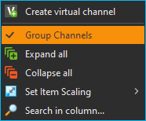
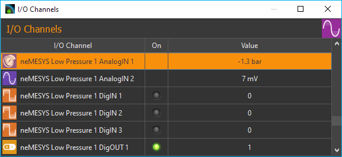
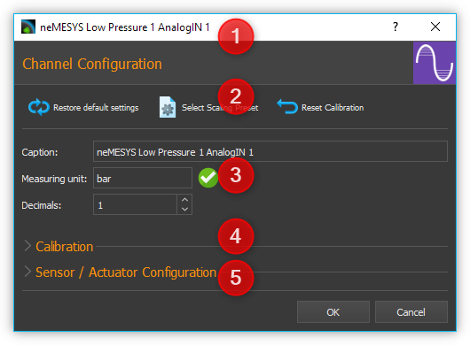
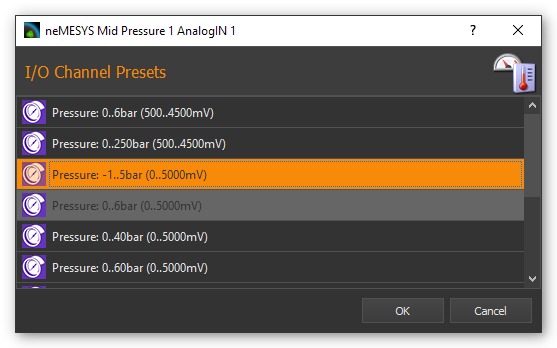
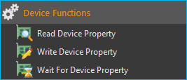
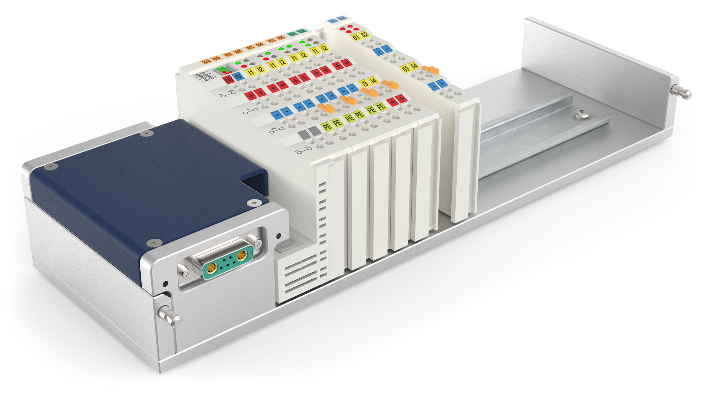

Qmix I/O Plugin
===============

Einführung
----------

Das Qmix I/O Plugin dient zur Einbindung der Qmix I/O Module in die
QmixElements Software und zur Anzeige von I/O Kanälen anderer Geräte wie
z.B. Nemaxys / rotAXYS Positioniersystem oder Nemesys Spritzenpumpen.

.. image:: Pictures/10000201000001F6000001EFFBB551A475EADF72.png
   :alt: Liste der I/O Kanäle

Liste der I/O Kanäle 
---------------------

Alle Qmix I/O Kanäle werden in der Liste der I/O Kanäle angezeigt. Die
unterschiedlichen I/O-Typen (Analog Eingang, Analog Ausgang, Digital
Eingang und Digital Ausgang) können Sie an den unterschiedlichen
Symbolen vor dem Kanalnamen unterscheiden (siehe Abbildung). Wenn Sie
die I/O Liste nicht sehen, können Sie das Fenster über das Hauptmenü der
Anwendung :menuselection:`Window --> Show View --> I/O Channels` einblenden:

.. image:: Pictures/100002010000021B000000AB3B30B0CC6EFEE72A.png

Folgende Spalten sind vorhanden:

-  **I/O Channel**- enthält den Namen des I/O-Kanals und zeigt ein Symbol
   für den Kanaltyp an.
-  **On** - zeigt durch eine grüne LED, ob ein Kanal ein- oder
   ausgeschaltet ist bzw. ob ein Digital-Kanal 0 oder 1 gesetzt ist.
-  **Actual Value** - zeigt den aktuellen Wert des Kanals an. Bei
   Ausgangskanälen ist dies der Wert, der ausgegeben wird und bei
   Eingangskanälen der Wert, der vom Gerät gelesen wird.

Kanaltypen 
~~~~~~~~~~~

Die folgenden Kanaltypen werden im Moment unterstützt:

======== ======================================
|image1| analoge Eingänge (Spannung oder Strom)
|image2| analoge Ausgänge
|image3| digitale Eingänge
|image4| digitale Ausgänge
|image5| analoge Druckmesseingänge
|image6| analoge Temperaturmesseingänge
|image7| analoge Kraftsensoren
|image8| analoge Flusssensoren
|image9| virtuelle Kanäle
======== ======================================

Gruppierung
~~~~~~~~~~~

Standardmäßig werden die I/O Kanäle gruppiert angezeigt. D.h. die Kanäle
eines bestimmten Gerätes sind unter dem Gerätenamen gruppiert, so dass
eine baumartige Struktur entsteht. D.h., Sie können damit gezielt die
Anzeige von Kanälen für bestimmte Geräte, z.B. für die Nemesys Pumpen,
ein- und ausblenden. In der folgenden Abbildung werden z.B. nur die
Kanäle der ersten Nemesys Pumpe angezeigt.

.. admonition:: Wichtig
   :class: note

   Wenn Sie noch mit einer älteren            
   Gerätekonfiguration arbeiten, müssen Sie ggf. die       
   Gerätekonfiguration im Gerätekonfigurator erneut        
   speichern, damit die I/O Kanäle gruppiert angezeigt     
   werden. 

.. image:: Pictures/100002010000022A00000129BE2F20D0F3631291.png
   :alt: Gruppierung der I/O Kanäle

Alle I/O Kanäle, die nicht zu
einem bestimmten Gerät gehören, bzw. Kanäle von Geräten, die noch keine
Gruppierung unterstützen, werden in der Gruppe *Ungrouped Channels*
zusammengefasst.

Die Gruppierung der Kanäle können Sie
jederzeit aktivieren und deaktivieren. Klicken Sie dafür einfach mit der
rechten Maustaste in die Liste der I/O Kanäle und wählen Sie dann im
Kontextmenü den Punkt :guilabel:`Group Channels` (Abbildung unten).

Wenn die Gruppierung der Kanäle deaktiviert ist, erhalten Sie
eine flache Darstellung der I/O-Kanäle in Listenform.

I/O Kanäle suchen
~~~~~~~~~~~~~~~~~~

Wenn Sie in der Liste schnell nach einem bestimmten Kanal suchen
möchten, klicken Sie mit der rechten Maustaste in die erste Spalte (*I/O
Channel*) und wählen Sie aus dem Kontextmenü den Punkt :guilabel:`Search in column`.

.. image:: Pictures/1000000000000164000000B8F8746536D6C09088.png

Es wird ein Suchdialog angezeigt, in dem Sie den Suchbegriff
eingeben können. Bereits während der Eingabe wird Ihnen eine Liste der
möglichen Treffer angezeigt. Wenn Sie einen Eintrag auswählen, wird der
entsprechende Kanal in der I/O Liste angezeigt und farblich markiert.

Skalierung ändern
~~~~~~~~~~~~~~~~~

Um die Übersichtlichkeit zu erhöhen oder die Anzeige zu vergrößern, kann
die Darstellung zwischen drei Größen umgeschaltet werden. Dafür wählen
Sie aus dem Kontextmenü den Punkt :guilabel:`Set Item Scaling` und anschließend
die gewünschte Größe:

.. image:: Pictures/100002010000022B000001231C920F293849CD41.png
   :alt: Skalierung der Darstellung ändern

Ausgänge setzen
---------------

Die Werte von Ausgangskanälen können vom Anwender geändert werden. Zu
den Ausgangskanälen gehören z.B. digitale und analoge Ausgangskanäle
sowie virtuelle Kanäle (*Virtual Channels)*. Digitale Ausgangskanäle
können Sie ein- und ausschalten, indem Sie auf die LED in der *On*-Spalte
des Kanals klicken.

.. image:: Pictures/10000201000001F1000000B04F8C214E5ED6F298.png
   :alt: Digitale Ausgangskanäle ein- und ausschalten

Analoge Kanäle können Sie ebenfalls durch Anklicken der LED ein- und
ausschalten. Ist ein analoger Kanal ausgeschaltet, wird der Wert 0
ausgegeben. Ist ein analoge Kanal eingeschaltet, wird der Wert in der
Spalte *Value* ausgegeben. Möchten Sie die analogen Wert ändern, klicken
Sie einfach mit der linken Maustaste doppelt in die Wert Spalte eines
Kanals, oder wählen Sie die Wert-Spalte des Kanals aus und beginnen Sie
anschließend mit der Eingabe auf der Tastatur.

.. image:: Pictures/10000201000001F1000000B76EDE046BAAE032A0.png
   :alt: Werte von analogen Ausgangskanälen ändern

Damit können Sie auch die Werte von virtuellen Kanälen ändern.

I/O Kanal Konfiguration
-----------------------

Kanalnamen ändern
~~~~~~~~~~~~~~~~~

Sie können den Namen jedes Kanals jederzeit ändern und, z.B., einen
Namen vergeben, der zu Ihrer speziellen Anwendung passt. Ändern Sie den
Namen mit folgenden Schritten:

.. rst-class:: steps

1. Klicken Sie **doppelt** in die Tabellenzelle mit dem Namen, den Sie
   ändern möchten.
2. Geben Sie den neuen Namen in das Editierfenster ein, welches nun
   eingeblendet wird (siehe Abbildung).
3. Beenden Sie Ihre Eingabe durch Drücken der :kbd:`Return`-Taste.

.. image:: Pictures/1000020100000210000000CFEE86A61E8D9261A1.png
   :alt: Kanalnamen ändern

Konfigurationsdialog aufrufen
~~~~~~~~~~~~~~~~~~~~~~~~~~~~~~

Für viele I/O Kanäle sind neben der Konfiguration des Kanalnamens noch
weitere Konfigurationsmöglichkeiten vorhanden (z.B., Skalierung der
analogen Ein- / Ausgänge). Diese Konfigurationseinstellungen finden Sie
im Konfigurationsdialog des jeweiligen Kanals.

.. image:: Pictures/1000020100000210000000E26A44508AB4B23B66.png
   :alt: Kanalkonfiguration aufrufen

Den Dialog zur Konfiguration
rufen Sie auf, indem Sie mit der rechten Maustaste auf einen Kanal in
der Liste der I/O Kanäle klicken und dann den Menüpunkt :guilabel:`Configure channel` 
auswählen (Abbildung oben).

Konfigurationsdialog
~~~~~~~~~~~~~~~~~~~~

Im Konfigurationsdialog können Sie alle Parameter der analogen Ein- und
Ausgänge konfigurieren. Wenn Sie den Dialog öffnen, sehen Sie die
folgenden Bedienelemente

.. rst-class:: guinums

#. In der Titelzeile des Dialogs wird Ihnen der Name des Kanals
   angezeigt, den Sie konfigurieren.
#. In der Werkzeugleiste können finden Sie die Aktionen, die Sie
   ausführen können:

   +-----------+---------------------------------------------------------------+
   | |image21| | **Restore default settings** – durch Anklicken dieser         |
   |           | Schaltfläche können sie alle Parameter (Kanalname,            |
   |           | Nachkommastellen, Skalierung, *etc*...) wieder auf Ihre       |
   |           | Standardwerte zurücksetzen.                                   |
   +-----------+---------------------------------------------------------------+
   | |image22| | **Select Scaling Preset** – öffnet ein Auswahldialog mit      |
   |           | vordefinierten :ref:`Skalierungseinstellungen                 |
   |           | <vordefinierte_skalierungen>`                                 |
   +-----------+---------------------------------------------------------------+
   | |image23| | **Reset Calibration** – setzt die Kalibrierung des Kanals     |
   |           | auf die Standardeinstellungen (Offset = 0, Faktor = 1)        |
   |           | zurück.                                                       |
   +-----------+---------------------------------------------------------------+

#. Hier können Sie die allgemeinen Einstellungen des Kanals, wie Name,
   Dezimalstellen oder Maßeinheit konfigurieren:

   -  *Caption* - hier können Sie einen neuen Kanalnamen vergeben, der
      dann in der Kanalliste angezeigt wird.
   -  *Measuring Unit*– geben Sie in dieses Feld die Maßeinheit ein, in
      der die Messwerte angezeigt werden. Die Einheit muss kompatibel
      zur Basiseinheit des Kanals oder des Sensors sein. So können Sie
      z.B. für einen Druckmesskanal die Einheiten **bar, psi** oder
      **Pa** verwenden, aber nicht die Einheiten **mV, mA** oder
      **kg**. Die Software rechnet dann automatisch die Messwerte des
      Sensors in die gewählte Einheit um.
   -  *Decimals* – in diesem Feld können Sie die Anzahl der Dezimal-
      oder Nachkommastellen festlegen, mit denen alle skalierten Werte
      angezeigt werden sollen.

#. Im Bereich Kalibrierung (*Calibration*) können Sie
   Messwertabweichungen von Kanälen durch Kalibrierung ausgleichen
#. Bei Kanälen, die den Anschluss von Sensoren unterstützen (z.B. bei
   Spannungs- oder Strommesseingängen) können Sie hier die
   Bedienelemente zur Konfiguration der Skalierung des
   Sensors anzeigen. Klicken Sie dafür auf *Sensor / Actuator
   Configuration.*

.. admonition:: Tipp
   :class: tip

   Alle Änderungen der Einstellungen werden erst 
   nach dem Anklicken der Schaltfläche :guilabel:`OK` übernommen.  
   Klicken Sie die Schaltfläche :guilabel:`Cancel`, werden alle    
   Änderungen verworfen. 

.. admonition:: Wichtig
   :class: note

   Beim Anklicken der Schaltfläche :guilabel:`Restore default settings` 
   werden alle Einstellungen sofort     
   zurückgesetzt. Ein Klick auf :guilabel:`OK` ist nicht           
   erforderlich.  

Kalibrierung
------------

Mit der Zwei-Punkt-Kalibrierung können Sie Messabweichungen eines Kanals
korrigieren. Dafür nehmen Sie an zwei Punkten :guinum:`❶` und :guinum:`❷` den Messwert des
Kanals auf (:guilabel:`Value`), und geben für diese Punkte den tatsächlichen,
korrigierten Wert des Kanals an (:guilabel:`Calibrated Value`). Die Software
errechnet daraus den Anstieg (Faktor) und den Offset der Skalierung.

Wenn Sie den die Schaltfläche :guilabel:`Capture current channel value` :guinum:`❸`
anklicken, wird der aktuelle Wert des Kanals automatisch in das
Messwertfeld :guilabel:`Value` eingetragen.

.. image:: Pictures/100002010000024C000000FE0348D163BBF02B8A.png
   :alt: Kalibrierung I/O Kanal

.. admonition:: Wichtig
   :class: note

   Alle Werte der Kalibrierung werden in der  
   konfigurierten Maßeinheit eingegeben. Wenn Sie die      
   Maßeinheit oder die Skalierung des Kanals ändern,       
   müssen Sie die Kalibrierung prüfen und ggf. anpassen.   

Sensorskalierung konfigurieren
------------------------------

Einführung
~~~~~~~~~~

Bei analogen Kanälen, die den Anschluss von Sensoren unterstützen (z.B.
bei Spannungs- oder Strommesseingängen) können Sie die sensorspezifische
Skalierung konfigurieren. So können Sie, z.B., Sensoren an die analogen
Eingänge anschließen und die Messwerte dann auf den Wertebereich der
analogen Sensoren skalieren und in der richtigen Einheit anzeigen.
Klicken Sie dafür im Konfigurationsdialog auf :guilabel:`Scaling Configuration`.

.. image:: Pictures/10000201000002B700000137795168A3F5C0861B.png
   :alt: Konfiguration der Skalierungsparameter

Physikalische Messgröße wählen
~~~~~~~~~~~~~~~~~~~~~~~~~~~~~~~

Im Bereich *Physical Quantity* :guinum:`❶` wählen Sie die physikalische Messgröße
aus, die mit dem Sensor gemessen werden soll. Wenn die gewünschte
Messgröße in der :guilabel:`Type` Auswahlbox nicht unterstützt wird, wählen Sie
einfach als Typ *Custom* aus, für eine eigene Skalierung. Für einen
Drucksensor, wählen Sie z.B. den Typ *Pressure* aus.

Im :guilabel:`Unit` Eingabefeld, geben Sie die Basiseinheit des Sensors ein. Bei
der Auswahl eines Typs, wird Ihnen bereits eine entsprechende Einheit
vorgeschlagen. Die Einheit muss kompatibel mit der gewählten
physikalischen Messgröße sein (z.B. *bar, psi, Pa* oder *atm* für
Drucksensoren).

Zweipunkt-Skalierung
~~~~~~~~~~~~~~~~~~~~

Mit der Zweipunkt-Skalierung :guinum:`❷` konfigurieren Sie die Umrechnung zwischen
den analogen Messwerten des I/O-Kanals (z.B. in mV oder mA) und den
Sensormesswerten des daran angeschlossenen Sensors (z.B. bar oder °C).
Normalerweise können Sie diese Werte direkt aus dem Datenblatt des
betreffenden Sensors entnehmen.

.. admonition:: Wichtig
   :class: note

   Im Moment unterstützt die Software nur die  lineare Skalierung von Messgrößen.

Haben Sie z.B. einen Drucksensor, der bei einem anlogen Eingangsbereich
von 0,5 V bis 4,5 V einen Messbereich von 0 – 20 bar hat, dann geben Sie
in der ersten Spalte (*Device value*) die 500 mV und 4500 mV ein und in
der zweiten Spalte (*Scaled value*) die 0 und 20 bar.

.. admonition:: Wichtig
   :class: note

   Achten Sie darauf, dass die verwendeten    
   Einheiten mit den Einheiten im Datenblatt des Sensors   
   übereinstimmen. 

Limits
~~~~~~

Im Bereich *Limits* :guinum:`❸` legen Sie den Messbereich des Sensors fest. In
vielen Fällen stimmt dieser Bereich mit dem Bereich überein, den Sie in
der Zweipunkt-Skalierung verwenden. Deshalb werden die Werte bei der
Änderung der Zweipunktskalierung automatisch in den Bereich Limits
übernommen. Hier können Sie den Wertebereich nachträglich noch weiter
einschränken oder ändern.

.. admonition:: Wichtig
   :class: note

   Durch Klicken auf :guilabel:`estore default settings` werden alle Parameter 
   sofort auf ihre ursprüngliche Einstellung zurückgesetzt. Das Klicken auf 
   :guilabel:`OK` ist nicht erforderlich.  

Anwenderspezifische Skalierungen
~~~~~~~~~~~~~~~~~~~~~~~~~~~~~~~~

Wenn Sie einen Sensor verwenden, der in der :guilabel:`Type` Auswahlbox noch nicht
unterstützt wird, dann wählen Sie einfach den Sensortyp :guilabel:`Custom` :guinum:`❶` aus.
In diesem Fall wird das Eingabefeld *Measuring unit* :guinum:`❷` ausgegraut, da
keine automatische Einheitenumrechnung mehr möglich ist.

.. image:: Pictures/1000020100000293000001A7CF54CF7D61FB34F6.png
   :alt: Anwenderspezifische Skalierung

.. _vordefinierte_skalierungen:

Vordefinierte Skalierungen - Scaling Presets
---------------------------------------------

Einige analoge Ein- und Ausgangskanäle bieten die Wahl vordefinierter
Skalierungseinstellungen. Diese beinhalten Drucksensor-Konfigurationen für die 
Analogeingänge der Nemesys Spritzenpumpengeräte.

.. admonition:: Wichtig
   :class: note

   Nicht alle Kanäle verfügen über            
   vordefinierte Skalierungseinstellungen, so dass der     
   Menüpunkt :guilabel:`Select scaling preset` nur bei einigen       
   Kanälen vorhanden ist.

.. image:: Pictures/10000201000002010000010D504DB5DF96F402B1.png
   :alt: Auswahl vordefinierter Konfigurationen

Um eine vordefinierte Konfiguration zu übernehmen, klicken Sie mit der rechten 
Maustaste auf den entsprechenden Analogkanal, um das Kontextmenü anzuzeigen 
(siehe Abbildung unten). Wählen Sie :guilabel:`Select scaling preset`.
s erscheint ein Dialog mit einer Auswahl von Skalierungsvoreinstellungen (siehe Abbildung unten).
Wählen Sie die gewünschte Voreinstellung und bestätigen Sie Ihre Wahl mit einem 
Linksklick auf :guilabel:`OK`.

Um die Standardeinstellungen wiederherzustellen Kanaleinstellungen wiederherzustellen, 
klicken Sie einfach auf den Menüpunkt :guilabel:`Restore default settings` im 
Kontextmenü des Kanals (siehe Abbildung unten).   

.. image:: Pictures/1000020100000210000000E26F7EC82ABD40B5A3.png

Virtuelle Kanäle (Virtual Channels)
-----------------------------------

Virtuellen Kanal anlegen
~~~~~~~~~~~~~~~~~~~~~~~~

Die Software ermöglicht das Anlegen von virtuellen I/O Kanälen. Diese
Kanäle sind keinem physischen I/O-Gerät zugeordnet, sondern eine Art
Wertespeicher. Sie können die virtuellen Kanäle mit Werten beschreiben
und diese Auslesen – genau wie bei einem Speicher. Mit Hilfe dieser
Kanäle, können Sie z.B. berechnete Werte aus einem QmixElements Script
im grafischen Logger anzeigen. Sie müssen nur den Kanal anlegen, im
Logger den Kanal hinzufügen, und können dann Werte aus dem Script in den
Kanal schreiben.

Um einen virtuellen Kanal anzulegen, klicken Sie mit der rechten
Maustaste in die I/O Kanalliste und wählen den Punkt :guilabel:`Create virtual channel`.

.. image:: Pictures/100002010000023A00000102ED9CC097AC4CA17D.png
   :alt: Virtuelle Kanäle anlegen

Es wird dann ein virtueller
Kanal hinzugefügt und Sie können den Kanal nun weiter konfigurieren –
z.B. den Kanalnamen ändern. Wenn die Gruppierung von Kanälen aktiv ist,
werden alle virtuellen Kanäle in der Gruppe *Virtual Channels*
zusammengefasst und beim Anlegen dort eingefügt.

.. image:: Pictures/10000201000001EB000000BFAE47483A07671078.png
   :alt: Gruppe mit virtuellen Kanälen

Wenn die Gruppierung von
Kanälen deaktiviert ist, wird der neu erstellte virtuelle Kanal am Ender
der Liste eingefügt.

Zugriff auf virtuelle Kanäle aus Scriptprogrammen
~~~~~~~~~~~~~~~~~~~~~~~~~~~~~~~~~~~~~~~~~~~~~~~~~

Um auf die virtuellen Kanäle aus Scriptprogrammen heraus zuzugreifen
(Werte zu lesen und zu schreiben), können Sie die Funktionen aus der
Kategorie :ref:`Gerätefunktionen<gerätefunktionen>` verwenden.

Virtuelle Kanäle löschen
~~~~~~~~~~~~~~~~~~~~~~~~~~

Zum Löschen eines virtuellen Kanals, klicken Sie mit der rechten
Maustaste auf den Kanal, und wählen dann aus dem Kontextmenü den
Menüpunkt :guilabel:`Delete virtual channel` (Abbildung unten).

.. image:: Pictures/10000000000001E8000000D1A8C8F0B61AD24CD2.png
   :alt: Virtuelle Kanäle löschen

I/O Script-Funktionen 
-----------------------

Einführung
~~~~~~~~~~

Das Qmix I/O Plugin enthält Script-Funktionen zum Schalten der digitalen
Ausgänge und zum Setzten von Ausgangswerten der analogen Ausgänge.

.. image:: Pictures/1000020100000123000000778D7426E56265EAC3.png
   :alt: I/O Script-Funktionen

Funktion Digitalausgang setzen - *Set Digital Out* 
~~~~~~~~~~~~~~~~~~~~~~~~~~~~~~~~~~~~~~~~~~~~~~~~~~~

.. image:: Pictures/1000064300003505000035054FDB6D797453998C.svg
   :width: 60
   :align: left

Verwenden Sie diese Funktion zum Setzen bzw. Löschen eines
Digitalausgangs aus einem Script heraus. Wählen Sie im
Konfigurationsbereich der Funktion den digitalen Kanal aus und stellen
Sie dann den gewünschten Ausgangswert ein.

|

Funktion Analogausgang setzen - *Set Analog Out* 
~~~~~~~~~~~~~~~~~~~~~~~~~~~~~~~~~~~~~~~~~~~~~~~~~

.. image:: Pictures/10000F0E00003505000035054CE4E2663723FE52.svg
   :width: 60
   :align: left

Mit dieser Funktion können Sie aus einem Script heraus einen
Wert auf einen analogen Ausgangskanal schreiben. Wählen Sie dafür im
Konfigurationsbereich den analogen Kanal aus und konfigurieren Sie dann
den analogen Ausgangswert, der später beim Ausführen der Funktion
gesetzt werden soll.

Diese Funktion unterstützt die Verwendung von Variablen. D.h., im Feld
:guilabel:`Value` können Sie, statt eines Wertes, den Namen einer Variablen
eintragen, die den analogen Ausgangswert zur Laufzeit des Scripts
enthält (siehe Abbildung unten). Diese Variable kann dann anschließend für 
Berechnungen oder zur Ausführung von wertbezogenen Funktionen verwendet werden.

.. image:: Pictures/1000020100000218000000BA59FD4FDF9E3D6F7B.png
   :alt: Set Analog Out Scriptkonfiguration

Unterstützte Beckhoff I/O-Module
---------------------------------

Das I/O-Plugin unterstützt das modulare CETONI QmixIO-B-Modul.

Die folgende Liste zeigt alle Beckhoff Bussysteme, die von der Software 
unterstützt werden:

Digitale Eingangsterminals
~~~~~~~~~~~~~~~~~~~~~~~~~~~~~~~~

.. image:: Pictures/dig_in.svg
   :width: 60
   :align: left

Die Software sollte mit allen 
`KL1xxx <https://www.beckhoff.com/en-en/products/i-o/bus-terminals/kl1xxx-digital-input/>`_ 
digitalen Eingangsklemmen funktionieren. Die folgenden Klemmen wurden bereits mit dem 
dem I/O-Plugin getestet.   

|

.. list-table::
   :widths: 25 75
   :header-rows: 1

   * - Terminal ID
     - Beschreibung
   * - `KL1104 <https://www.beckhoff.com/en-en/products/i-o/bus-terminals/kl1xxx-digital-input/kl1104.html>`_
     - 4-Kanal-Digitaleingang 24 V DC, 3 ms, 2-/3-Leiteranschluss
   * - `KL1124 <https://www.beckhoff.com/en-en/products/i-o/bus-terminals/kl1xxx-digital-input/kl1124.html>`_
     - 4-Kanal-Digitaleingang 5 V DC
   * - `KL1404 <https://www.beckhoff.com/en-en/products/i-o/bus-terminals/kl1xxx-digital-input/kl1404.html>`_
     - 4-Kanal-Digitaleingang 24 V DC
   * - `KL1408 <https://www.beckhoff.com/en-en/products/i-o/bus-terminals/kl1xxx-digital-input/kl1408.html>`_
     - 8-Kanal-Digitaleingang 24 V DC
   * - `KL1862 <https://www.beckhoff.com/en-en/products/i-o/bus-terminals/kl1xxx-digital-input/kl1862.html>`_
     - 16-Kanal-Digitaleingang 24 V DC, 3 ms, Flachbandkabelanschluss

Digitale Ausgangsterminals
~~~~~~~~~~~~~~~~~~~~~~~~~~~~~~~~

.. image:: Pictures/dig_out.svg
   :width: 60
   :align: left

Die Software sollte mit allen 
`KL2xxx <https://www.beckhoff.com/en-en/products/i-o/bus-terminals/kl2xxx-digital-output/>`_ 
digitalen Ausgangsklemmen funktionieren. Die folgenden Klemmen wurden bereits 
mit dem dem I/O-Plugin getestet.  

|

.. list-table::
   :widths: 25 75
   :header-rows: 1

   * - Terminal ID
     - Beschreibung
   * - `KL2012 <https://www.beckhoff.com/en-en/products/i-o/bus-terminals/kl2xxx-digital-output/kl2012.html>`_
     - 2-Kanal-Digitalausgang, 24 V DC, 0,5 A
   * - `KL2022 <https://www.beckhoff.com/en-en/products/i-o/bus-terminals/kl2xxx-digital-output/kl2022.html>`_
     - 2-Kanal-Digitalausgang, 24 V DC, 2 A
   * - `KL2114 <https://www.beckhoff.com/en-en/products/i-o/bus-terminals/kl2xxx-digital-output/kl2114.html>`_
     - 4-Kanal-Digitalausgang, 24 VDC
   * - `KL2124 <https://www.beckhoff.com/en-en/products/i-o/bus-terminals/kl2xxx-digital-output/kl2124.html>`_
     - 4-Kanal-Digitalausgang, 5 V DC
   * - `KL2404 <https://www.beckhoff.com/en-en/products/i-o/bus-terminals/kl2xxx-digital-output/kl2404.html>`_
     - 4-Kanal-Digitalausgang, 24 V DC, 0,5 A, 2-Leiter-Anschluss
   * - `KL2408 <https://www.beckhoff.com/en-en/products/i-o/bus-terminals/kl2xxx-digital-output/kl2408.html>`_
     - 8-Kanal-Digitalausgang, 24 V DC, 0,5 A, 2-Leiter-Anschluss
   * - `KL2442 <https://www.beckhoff.com/en-en/products/i-o/bus-terminals/kl2xxx-digital-output/kl2442.html>`_
     - 2 Kanal Digitalausgang, 24 V DC, 2 x 4 A/1 x 8 A
   * - `KL2612 <https://www.beckhoff.com/en-en/products/i-o/bus-terminals/kl2xxx-digital-output/kl2612.html>`_
     - 2-Kanal-Relaisausgang, 125 V AC/30 V DC
   * - `KL2634 <https://www.beckhoff.com/en-en/products/i-o/bus-terminals/kl2xxx-digital-output/kl2634.html>`_
     - 4-Kanal-Relaisausgang, 250 V AC/30 V DC
   * - `KL2808 <https://www.beckhoff.com/en-en/products/i-o/bus-terminals/kl2xxx-digital-output/kl2808.html>`_
     - 8-Kanal-Digitalausgang, 24V, 0,5 A
   * - `KL2872 <https://www.beckhoff.com/en-en/products/i-o/bus-terminals/kl2xxx-digital-output/kl2872.html>`_
     - 16-Kanal-Digitalausgang, 24V, 0,5 A, Flachbandkabel

Analoge Eingangsterminals
~~~~~~~~~~~~~~~~~~~~~~~~~~~

.. image:: Pictures/analog_in.svg
   :width: 60
   :align: left

Die folgenden analogen Eingangsterminals werden vom E/A-Plugin unterstützt:

|
|

.. list-table::
   :widths: 25 75
   :header-rows: 1

   * - Terminal ID
     - Beschreibung
   * - `KL3021 <https://www.beckhoff.com/en-en/products/i-o/bus-terminals/kl3xxx-analog-input/kl3021.html>`_
     - 1-Kanal-Analogeingang 4..20mA - 0,3% 12Bit
   * - `KL3022 <https://www.beckhoff.com/en-en/products/i-o/bus-terminals/kl3xxx-analog-input/kl3022.html>`_
     - 2-Kanal-Analogeingang 4...20 mA, 12 Bit, differenziell
   * - `KL3054 <https://www.beckhoff.com/en-en/products/i-o/bus-terminals/kl3xxx-analog-input/kl3054.html>`_
     - 4-Kanal-Analogeingang 4..20mA - 12 Bit, single-ended
   * - `KL3102 <https://www.beckhoff.com/en-en/products/i-o/bus-terminals/kl3xxx-analog-input/kl3102.html>`_
     - 2-Kanal-Analogeingang -10V..+10V
   * - `KL3152 <https://www.beckhoff.com/en-en/products/i-o/bus-terminals/kl3xxx-analog-input/kl3152.html>`_
     - 2-Kanal-Analogeingang 4..20mA - 0.05% 16 Bit
   * - `KL3162 <https://www.beckhoff.com/en-en/products/i-o/bus-terminals/kl3xxx-analog-input/kl3162.html>`_
     - 2-Kanal-Analogeingang 0..10V - 0.05% 16 Bit
   * - `KL3201 <https://www.beckhoff.com/en-en/products/i-o/bus-terminals/kl3xxx-analog-input/kl3201.html>`_
     - 1-Kanal PT100 RTD
   * - `KL3202 <https://www.beckhoff.com/en-en/products/i-o/bus-terminals/kl3xxx-analog-input/kl3202.html>`_
     - 2-Kanal PT100 RTD
   * - `KL3204 <https://www.beckhoff.com/en-en/products/i-o/bus-terminals/kl3xxx-analog-input/kl3204.html>`_
     - 4-Kanal PT100 RTD
   * - `KL3214 <https://www.beckhoff.com/en-en/products/i-o/bus-terminals/kl3xxx-analog-input/kl3214.html>`_
     - 4-Kanal PT100 RTD 3-Draht-Verbindung
   * - `KL3222 <https://www.beckhoff.com/en-en/products/i-o/bus-terminals/kl3xxx-analog-input/kl3222.html>`_
     - 2-Kanal PT100 RTD, hochpräzise
   * - `KL3312 <https://www.beckhoff.com/en-en/products/i-o/bus-terminals/kl3xxx-analog-input/kl3312.html>`_
     - 2-Kanal-Thermoelement-Eingang
   * - `KL3314 <https://www.beckhoff.com/en-en/products/i-o/bus-terminals/kl3xxx-analog-input/kl3314.html>`_
     - 4-Kanal-Thermoelement-Eingang
   * - `KL3404 <https://www.beckhoff.com/en-en/products/i-o/bus-terminals/kl3xxx-analog-input/kl3404.html>`_
     - 4-Kanal-Analogeingang -10V..+10V, 12 Bit, single-ended
   * - `KL3408 <https://www.beckhoff.com/en-en/products/i-o/bus-terminals/kl3xxx-analog-input/kl3408.html>`_
     - 8-Kanal-Analogeingang -10V..+10V, 12 Bit, single-ended
   * - `KL3444 <https://www.beckhoff.com/en-en/products/i-o/bus-terminals/kl3xxx-analog-input/kl3444.html>`_
     - 4-Kanal-Analogeingang 0..20mA, 12 bit, single-ended
   * - `KL3454 <https://www.beckhoff.com/en-en/products/i-o/bus-terminals/kl3xxx-analog-input/kl3454.html>`_
     - 4-Kanal-Analogeingang 4..20mA, 12 bit, single-ended
   * - `KL3464 <https://www.beckhoff.com/en-en/products/i-o/bus-terminals/kl3xxx-analog-input/kl3464.html>`_
     - 4-Kanal-Analogeingang 0..10V, 12 bit, single-ended
   * - `KL3468 <https://www.beckhoff.com/en-en/products/i-o/bus-terminals/kl3xxx-analog-input/kl3468.html>`_
     - 8-Kanal-Analogeingang 0..10V, 12 bit, single-ended

Analoge Ausgangsterminals
~~~~~~~~~~~~~~~~~~~~~~~~~

.. image:: Pictures/analog_out.svg
   :width: 60
   :align: left

Die folgenden analogen Ausgangsterminals werden vom I/O-Plugin unterstützt:

|
|

.. list-table::
   :widths: 25 75
   :header-rows: 1

   * - Terminal ID
     - Beschreibung
   * - `KL4002 <https://www.beckhoff.com/en-en/products/i-o/bus-terminals/kl4xxx-analog-output/kl4002.html>`_
     - 2-Kanal-Analogausgang 0..10, 12 Bit, differenziell
   * - `KL4004 <https://www.beckhoff.com/en-en/products/i-o/bus-terminals/kl4xxx-analog-output/kl4004.html>`_
     - 4-Kanal-Analogausgang 0..10, 12 Bit, differenziell
   * - `KL4022 <https://www.beckhoff.com/en-en/products/i-o/bus-terminals/kl4xxx-analog-output/kl4022.html>`_
     - 2-Kanal-Analogausgang 4..20mA, 12 Bit, single-ended
   * - `KL4112 <https://www.beckhoff.com/en-en/products/i-o/bus-terminals/kl4xxx-analog-output/kl4112.html>`_
     - 2-Kanal-Analogausgang 0..20mA, 16 bit, single-ended
   * - `KL4132 <https://www.beckhoff.com/en-en/products/i-o/bus-terminals/kl4xxx-analog-output/kl4132.html>`_
     - 2-Kanal-Analogausgang -10..10V, 16 bit, differenziell
   * - `KL4404 <https://www.beckhoff.com/en-en/products/i-o/bus-terminals/kl4xxx-analog-output/kl4404.html>`_
     - 4-Kanal-Analogausgang 0..10V, 12 Bit, single-ended
   * - `KL4408 <https://www.beckhoff.com/en-en/products/i-o/bus-terminals/kl4xxx-analog-output/kl4408.html>`_
     - 8-Kanal-Analogausgang 0..10V, 12 bit, single-ended
   * - `KL4414 <https://www.beckhoff.com/en-en/products/i-o/bus-terminals/kl4xxx-analog-output/kl4414.html>`_
     - 4-Kanal-Analogausgang 0..20mA, 12 bit, single-ended
   * - `KL4424 <https://www.beckhoff.com/en-en/products/i-o/bus-terminals/kl4xxx-analog-output/kl4424.html>`_
     - 4-Kanal-Analogausgang 4..20mA, 12 bit, single-ended
   * - `KL4434 <https://www.beckhoff.com/en-en/products/i-o/bus-terminals/kl4xxx-analog-output/kl4434.html>`_
     - 4-Kanal-Analogausgang -10V..+10V, 12 bit, single-ended

Spezielle Terminals
~~~~~~~~~~~~~~~~~~~~

.. image:: Pictures/special_terminals.svg
   :width: 60
   :align: left

Die folgenden speziellen Terminals werden vom I/O-Plugin unterstützt:

|
|

.. list-table::
   :widths: 25 75
   :header-rows: 1

   * - Terminal ID
     - Beschreibung
   * - `KL1501 <https://www.beckhoff.com/en-gb/products/i-o/bus-terminals/kl1xxx-digital-input/kl1501.html>`_
     - 1-Kanal-Digitaleingang, Zähler, 24 V DC, 100 kHz

.. |image1| image:: Pictures/analog_in.svg
   :width: 40
.. |image2| image:: Pictures/analog_out.svg
   :width: 40
.. |image3| image:: Pictures/dig_in.svg
   :width: 40
.. |image4| image:: Pictures/dig_out.svg
   :width: 40

.. |image6| image:: ./Pictures/100051AD000034EB000034EB615CA53F231E2071.svg
   :width: 40
.. |image7| image:: ./Pictures/10004C5E000034EB000034EB7FFDB68DD93E5C3E.svg
   :width: 40
.. |image8| image:: ./Pictures/100047B2000034EB000034EB7BBD43FF0627D5D3.svg
   :width: 40
.. |image9| image:: ./Pictures/1000000000000030000000305963F73F938F8699.png
   :width: 40

.. |image21| image:: ./Pictures/1000046A00003505000035052554114A973E3AD6.svg
   :width: 40
.. |image22| image:: ./Pictures/10001183000034EB000034EBDFA4938505ACE302.svg
   :width: 40
.. |image23| image:: ./Pictures/100002C1000035050000350588E8C4C80407FC4C.svg
   :width: 40