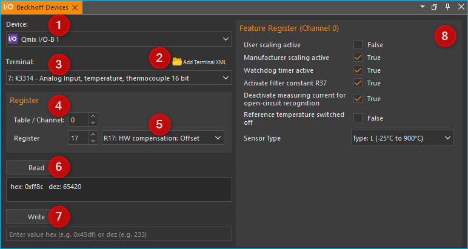

Unterstützte Beckhoff Klemmen
------------------------------------

Das I/O-Plugin unterstützt das modulare CETONI QmixIO-B-Modul.

.. image:: Pictures/QmixIO-B_IO-Module.jpg

Die folgende Liste zeigt alle Beckhoff Bussysteme, die von der Software
unterstützt werden:

Digitale Eingangsklemmen
~~~~~~~~~~~~~~~~~~~~~~~~~~~~~~~~

.. image:: Pictures/dig_in.svg
   :width: 60
   :align: left

Die Software sollte mit allen
`KL1xxx <https://www.beckhoff.com/en-en/products/i-o/bus-terminals/kl1xxx-digital-input/>`_
digitalen Eingangsklemmen funktionieren. Die folgenden Klemmen wurden bereits mit dem
dem I/O-Plugin getestet.

|

.. list-table::
   :widths: 25 75
   :header-rows: 1

   * - Terminal ID
     - Beschreibung
   * - `KL1104 <https://www.beckhoff.com/en-en/products/i-o/bus-terminals/kl1xxx-digital-input/kl1104.html>`_
     - 4-Kanal-Digitaleingang 24 V DC, 3 ms, 2-/3-Leiteranschluss
   * - `KL1124 <https://www.beckhoff.com/en-en/products/i-o/bus-terminals/kl1xxx-digital-input/kl1124.html>`_
     - 4-Kanal-Digitaleingang 5 V DC
   * - `KL1404 <https://www.beckhoff.com/en-en/products/i-o/bus-terminals/kl1xxx-digital-input/kl1404.html>`_
     - 4-Kanal-Digitaleingang 24 V DC
   * - `KL1408 <https://www.beckhoff.com/en-en/products/i-o/bus-terminals/kl1xxx-digital-input/kl1408.html>`_
     - 8-Kanal-Digitaleingang 24 V DC
   * - `KL1862 <https://www.beckhoff.com/en-en/products/i-o/bus-terminals/kl1xxx-digital-input/kl1862.html>`_
     - 16-Kanal-Digitaleingang 24 V DC, 3 ms, Flachbandkabelanschluss

Digitale Ausgangsklemmen
~~~~~~~~~~~~~~~~~~~~~~~~~~~~~~~~

.. image:: Pictures/dig_out.svg
   :width: 60
   :align: left

Die Software sollte mit allen
`KL2xxx <https://www.beckhoff.com/en-en/products/i-o/bus-terminals/kl2xxx-digital-output/>`_
digitalen Ausgangsklemmen funktionieren. Die folgenden Klemmen wurden bereits
mit dem dem I/O-Plugin getestet.

|

.. list-table::
   :widths: 25 75
   :header-rows: 1

   * - Terminal ID
     - Beschreibung
   * - `KL2012 <https://www.beckhoff.com/en-en/products/i-o/bus-terminals/kl2xxx-digital-output/kl2012.html>`_
     - 2-Kanal-Digitalausgang, 24 V DC, 0,5 A
   * - `KL2022 <https://www.beckhoff.com/en-en/products/i-o/bus-terminals/kl2xxx-digital-output/kl2022.html>`_
     - 2-Kanal-Digitalausgang, 24 V DC, 2 A
   * - `KL2114 <https://www.beckhoff.com/en-en/products/i-o/bus-terminals/kl2xxx-digital-output/kl2114.html>`_
     - 4-Kanal-Digitalausgang, 24 VDC
   * - `KL2124 <https://www.beckhoff.com/en-en/products/i-o/bus-terminals/kl2xxx-digital-output/kl2124.html>`_
     - 4-Kanal-Digitalausgang, 5 V DC
   * - `KL2404 <https://www.beckhoff.com/en-en/products/i-o/bus-terminals/kl2xxx-digital-output/kl2404.html>`_
     - 4-Kanal-Digitalausgang, 24 V DC, 0,5 A, 2-Leiter-Anschluss
   * - `KL2408 <https://www.beckhoff.com/en-en/products/i-o/bus-terminals/kl2xxx-digital-output/kl2408.html>`_
     - 8-Kanal-Digitalausgang, 24 V DC, 0,5 A, 2-Leiter-Anschluss
   * - `KL2442 <https://www.beckhoff.com/en-en/products/i-o/bus-terminals/kl2xxx-digital-output/kl2442.html>`_
     - 2 Kanal Digitalausgang, 24 V DC, 2 x 4 A/1 x 8 A
   * - `KL2612 <https://www.beckhoff.com/en-en/products/i-o/bus-terminals/kl2xxx-digital-output/kl2612.html>`_
     - 2-Kanal-Relaisausgang, 125 V AC/30 V DC
   * - `KL2634 <https://www.beckhoff.com/en-en/products/i-o/bus-terminals/kl2xxx-digital-output/kl2634.html>`_
     - 4-Kanal-Relaisausgang, 250 V AC/30 V DC
   * - `KL2808 <https://www.beckhoff.com/en-en/products/i-o/bus-terminals/kl2xxx-digital-output/kl2808.html>`_
     - 8-Kanal-Digitalausgang, 24V, 0,5 A
   * - `KL2872 <https://www.beckhoff.com/en-en/products/i-o/bus-terminals/kl2xxx-digital-output/kl2872.html>`_
     - 16-Kanal-Digitalausgang, 24V, 0,5 A, Flachbandkabel

Analoge Eingangsklemmen
~~~~~~~~~~~~~~~~~~~~~~~~~~~

.. image:: Pictures/analog_in.svg
   :width: 60
   :align: left

Die folgenden analogen Eingangsklemmen werden vom E/A-Plugin unterstützt:

|
|

.. list-table::
   :widths: 25 75
   :header-rows: 1

   * - Terminal ID
     - Beschreibung
   * - `KL3021 <https://www.beckhoff.com/en-en/products/i-o/bus-terminals/kl3xxx-analog-input/kl3021.html>`_
     - 1-Kanal-Analogeingang 4..20mA - 0,3% 12Bit
   * - `KL3022 <https://www.beckhoff.com/en-en/products/i-o/bus-terminals/kl3xxx-analog-input/kl3022.html>`_
     - 2-Kanal-Analogeingang 4...20 mA, 12 Bit, differenziell
   * - `KL3054 <https://www.beckhoff.com/en-en/products/i-o/bus-terminals/kl3xxx-analog-input/kl3054.html>`_
     - 4-Kanal-Analogeingang 4..20mA - 12 Bit, single-ended
   * - `KL3102 <https://www.beckhoff.com/en-en/products/i-o/bus-terminals/kl3xxx-analog-input/kl3102.html>`_
     - 2-Kanal-Analogeingang -10V..+10V
   * - `KL3152 <https://www.beckhoff.com/en-en/products/i-o/bus-terminals/kl3xxx-analog-input/kl3152.html>`_
     - 2-Kanal-Analogeingang 4..20mA - 0.05% 16 Bit
   * - `KL3162 <https://www.beckhoff.com/en-en/products/i-o/bus-terminals/kl3xxx-analog-input/kl3162.html>`_
     - 2-Kanal-Analogeingang 0..10V - 0.05% 16 Bit
   * - `KL3201 <https://www.beckhoff.com/en-en/products/i-o/bus-terminals/kl3xxx-analog-input/kl3201.html>`_
     - 1-Kanal PT100 RTD
   * - `KL3202 <https://www.beckhoff.com/en-en/products/i-o/bus-terminals/kl3xxx-analog-input/kl3202.html>`_
     - 2-Kanal PT100 RTD
   * - `KL3204 <https://www.beckhoff.com/en-en/products/i-o/bus-terminals/kl3xxx-analog-input/kl3204.html>`_
     - 4-Kanal PT100 RTD
   * - `KL3214 <https://www.beckhoff.com/en-en/products/i-o/bus-terminals/kl3xxx-analog-input/kl3214.html>`_
     - 4-Kanal PT100 RTD 3-Draht-Verbindung
   * - `KL3222 <https://www.beckhoff.com/en-en/products/i-o/bus-terminals/kl3xxx-analog-input/kl3222.html>`_
     - 2-Kanal PT100 RTD, hochpräzise
   * - `KL3312 <https://www.beckhoff.com/en-en/products/i-o/bus-terminals/kl3xxx-analog-input/kl3312.html>`_
     - 2-Kanal-Thermoelement-Eingang
   * - `KL3314 <https://www.beckhoff.com/en-en/products/i-o/bus-terminals/kl3xxx-analog-input/kl3314.html>`_
     - 4-Kanal-Thermoelement-Eingang
   * - `KL3404 <https://www.beckhoff.com/en-en/products/i-o/bus-terminals/kl3xxx-analog-input/kl3404.html>`_
     - 4-Kanal-Analogeingang -10V..+10V, 12 Bit, single-ended
   * - `KL3408 <https://www.beckhoff.com/en-en/products/i-o/bus-terminals/kl3xxx-analog-input/kl3408.html>`_
     - 8-Kanal-Analogeingang -10V..+10V, 12 Bit, single-ended
   * - `KL3444 <https://www.beckhoff.com/en-en/products/i-o/bus-terminals/kl3xxx-analog-input/kl3444.html>`_
     - 4-Kanal-Analogeingang 0..20mA, 12 bit, single-ended
   * - `KL3454 <https://www.beckhoff.com/en-en/products/i-o/bus-terminals/kl3xxx-analog-input/kl3454.html>`_
     - 4-Kanal-Analogeingang 4..20mA, 12 bit, single-ended
   * - `KL3464 <https://www.beckhoff.com/en-en/products/i-o/bus-terminals/kl3xxx-analog-input/kl3464.html>`_
     - 4-Kanal-Analogeingang 0..10V, 12 bit, single-ended
   * - `KL3468 <https://www.beckhoff.com/en-en/products/i-o/bus-terminals/kl3xxx-analog-input/kl3468.html>`_
     - 8-Kanal-Analogeingang 0..10V, 12 bit, single-ended

Analoge Ausgangsklemmen
~~~~~~~~~~~~~~~~~~~~~~~~~

.. image:: Pictures/analog_out.svg
   :width: 60
   :align: left

Die folgenden analogen Ausgangsklemmen werden vom I/O-Plugin unterstützt:

|
|

.. list-table::
   :widths: 25 75
   :header-rows: 1

   * - Terminal ID
     - Beschreibung
   * - `KL4002 <https://www.beckhoff.com/en-en/products/i-o/bus-terminals/kl4xxx-analog-output/kl4002.html>`_
     - 2-Kanal-Analogausgang 0..10, 12 Bit, differenziell
   * - `KL4004 <https://www.beckhoff.com/en-en/products/i-o/bus-terminals/kl4xxx-analog-output/kl4004.html>`_
     - 4-Kanal-Analogausgang 0..10, 12 Bit, differenziell
   * - `KL4022 <https://www.beckhoff.com/en-en/products/i-o/bus-terminals/kl4xxx-analog-output/kl4022.html>`_
     - 2-Kanal-Analogausgang 4..20mA, 12 Bit, single-ended
   * - `KL4112 <https://www.beckhoff.com/en-en/products/i-o/bus-terminals/kl4xxx-analog-output/kl4112.html>`_
     - 2-Kanal-Analogausgang 0..20mA, 16 bit, single-ended
   * - `KL4132 <https://www.beckhoff.com/en-en/products/i-o/bus-terminals/kl4xxx-analog-output/kl4132.html>`_
     - 2-Kanal-Analogausgang -10..10V, 16 bit, differenziell
   * - `KL4404 <https://www.beckhoff.com/en-en/products/i-o/bus-terminals/kl4xxx-analog-output/kl4404.html>`_
     - 4-Kanal-Analogausgang 0..10V, 12 Bit, single-ended
   * - `KL4408 <https://www.beckhoff.com/en-en/products/i-o/bus-terminals/kl4xxx-analog-output/kl4408.html>`_
     - 8-Kanal-Analogausgang 0..10V, 12 bit, single-ended
   * - `KL4414 <https://www.beckhoff.com/en-en/products/i-o/bus-terminals/kl4xxx-analog-output/kl4414.html>`_
     - 4-Kanal-Analogausgang 0..20mA, 12 bit, single-ended
   * - `KL4424 <https://www.beckhoff.com/en-en/products/i-o/bus-terminals/kl4xxx-analog-output/kl4424.html>`_
     - 4-Kanal-Analogausgang 4..20mA, 12 bit, single-ended
   * - `KL4434 <https://www.beckhoff.com/en-en/products/i-o/bus-terminals/kl4xxx-analog-output/kl4434.html>`_
     - 4-Kanal-Analogausgang -10V..+10V, 12 bit, single-ended

Spezielle Klemmen
~~~~~~~~~~~~~~~~~~~~

.. image:: Pictures/special_terminals.svg
   :width: 60
   :align: left

Die folgenden speziellen Klemmen werden vom I/O-Plugin unterstützt:

|
|

.. list-table::
   :widths: 25 75
   :header-rows: 1

   * - Terminal ID
     - Beschreibung
   * - `KL1501 <https://www.beckhoff.com/en-gb/products/i-o/bus-terminals/kl1xxx-digital-input/kl1501.html>`_
     - 1-Kanal-Digitaleingang, Zähler, 24 V DC, 100 kHz
   * - `KL3356 <https://www.beckhoff.com/de-de/produkte/i-o/busklemmen/kl3xxx-analog-eingang/kl3356.html>`_
     - 1-Kanal-Analog-Eingang, Messbrücke, Vollbrücke, 16 Bit

Beckhoff Klemmen konfigurieren
------------------------------------------

Einführung in die Klemmenkonfiguration
~~~~~~~~~~~~~~~~~~~~~~~~~~~~~~~~~~~~~~~~

Die I/O-Klemmen von Beckhoff können über ihre Klemmenregister parametriert und
konfiguriert werden. Die einzelnen Klemmen werden vor der Lieferung von
CETONI konfiguriert, parametriert und getestet. Unter Umständen kann es aber
erforderlich werden, die Klemmenkonfiguration nachträglich anzupassen - z.B.
zur Auswahl eines anderen Sensortyps, zur Änderung der Skalierung oder zum
Aktivieren / Deaktivieren der automatischen Kalibrierung.

Zur Konfiguration der Klemmen können Sie sich in der Software den View
:guilabel:`Beckhoff Devices` verwenden. Den View können Sie über das Hauptmenü
mit dem Menüpunkt :menuselection:`Window --> Show View --> Beckhoff Devices`
einblenden.

Konfigurationsoberfläche
~~~~~~~~~~~~~~~~~~~~~~~~~~~~~~~~~~~~~~~~

Die Konfigurationsoberfläche ermöglicht Ihnen den Zugriff auf die Parameter
einzelner Klemmen. Wenn Sie über mehrere QmixIO-B oder Beckhoff Module
verfügen, wählen Sie zuerst in der Auswahlbox :guilabel:`Device` :guinum:`❶` das
Gerät aus, welches die Klemme enthält, die konfiguriert werden soll.

Jetzt können Sie im Auswahlfeld :guilabel:`Terminal` :guinum:`❸` die Klemme
auswählen, die Sie parametrieren wollen. Die Reihenfolge der Klemmen in der
Auswahlbox entspricht dabei der Reihenfolge der Klemmen auf dem Gerät von
links nach rechts beginnend beim Buskoppler.

Im Bereich :guilabel:`Register` :guinum:`❹` wählen Sie den Kanal der Klemme
:guilabel:`Table / Channel` und das Klemmenregister :guilabel:`Register` aus.
Bei mehrkanaligen Klemmen, z.B. bei 4-kanaligen analogen Eingangsklemmen,
können Sie jeden Kanal separat konfigurieren. Wenn für die gewählte Klemme
eine XML-Beschreibungsdatei hinterlegt ist, können Sie das Register auch
über eine Auswahlfeld mit den Registernamen :guinum:`❺` auswählen. Ist keine
XML-Beschreibungsdatei vorhanden, müssen Sie sich die Registernummer aus der
PDF-Dokumentation von Beckhoff heraussuchen.

Über die beiden Schaltflächen :guilabel:`Read` :guinum:`❻` und :guilabel:`Write`
:guinum:`❼` können Sie nun Daten aus dem ausgewählten Register lesen und schreiben.
Informationen zu Bedeutung der Daten finden Sie in der PDF-Dokumentation von
Beckhoff.

.. admonition:: Achtung
   :class: caution

   Das Ändern von Parametern kann dazu führen, dass die Klemme nicht mehr wie
   von CETONI getestet und konfiguriert funktioniert. Vor dem Ändern eines
   Parameters sollten Sie sich ggf. den aktuellen Wert notieren um diesen
   später wieder herstellen zu können.

Die meisten Klemmen verfügen über ein **Feature Register** je Kanal zur Einstellung
bestimmter Konfigurationsparameter. Dieses Register ist gewöhnlich das Register
**R32**. Wenn für die gewählte Klemme eine XML-Beschreibungsdatei hinterlegt ist
sehen Sie im Bereich :guilabel:`Feature Register` :guinum:`❽` eine grafische
Oberfläche zum Zugriff auf die einzelnen Parameter des Registers. Ist keine
XML-Beschreibungsdatei vorhanden, müssen Sie im Bereich :guilabel:`Register`
:guinum:`❹` das Register über seine Nummer auswählen, und dann den kompletten
Wert lesen oder schreiben. Details zum Feature-Register finden Sie in der
Beckhoff PDF-Dokumentation.

Eine XML-Klemmenbeschreibung erstellen
~~~~~~~~~~~~~~~~~~~~~~~~~~~~~~~~~~~~~~~~

Wenn für eine bestimmte Klemme noch keine XML-Beschreibungsdatei hinterlegt ist,
können Sie mit Hilfe der PDF-Dokumentation ggf. selbst eine XML Datei erstellen
und über die Schaltfläche :guilabel:`Add Terminal XML` zur Software hinzufügen:

.. image:: Pictures/beckhoff_add_terminal_xml.png

Eine XML-Klemmenbeschreibung kann mehrere Klemmen enthalten. Die folgende
Datei zeigt die Klemmenbeschreibung für die Klemmen, die bereits in der Software
hinterlegt sind. Sie können diese als Vorlage zur Erstellung einer eigenen XML
Klemmenbeschreibung verwenden:

.. code-block:: xml

   <?xml version="1.0" encoding="utf-8"?>
   <Terminals>
      <K1501 Descr="Up- or Down-Counter Terminal, 24 VDC, 100 kHz">
         <Registers FeatureReg="32">
            <R8 Name="Terminal type"/>
            <R9 Name="Software version number"/>
            <R32 Name="Feature register">
               <Bit8 Descr="Counter mode" Bits="3" Type="List">
                  <Item0 Bin="001">32-bit up/down counter</Item0>
                  <Item1 Bin="010">2 * 16-bit up counter</Item1>
                  <Item2 Bin="100">32-bit gated counter, Gate input low: Counter is locked</Item2>
                  <Item3 Bin="101">32-bit gated counter, Gate input high: Counter is locked</Item3>
               </Bit8>
               <Bit11 Descr="Down counter"/>
            </R32>
         </Registers>
      </K1501>
      <K3152 Descr="Analog Input, 4..20mA, 16 bit, differential, high precision" FeatureReg="32">
         <Registers FeatureReg="32">
            <R32 Name="Feature register">
               <Bit0 Descr="User scaling active"/>
               <Bit1 Descr="Manufacturer scaling active"/>
               <Bit2 Descr="Disable watchdog timer"/>
               <Bit3 Descr="Signed amount representation"/>
               <Bit4 Descr="Siemens outout format"/>
               <Bit5 Descr="Disable calibration"/>
               <Bit6 Descr="Disable differential measurement"/>
               <Bit7 Descr="Stabilization of calibration active"/>
               <Bit8 Descr="Measuring range limitation active"/>
               <Bit9 Descr="Limit value 1 active"/>
               <Bit10 Descr="Limit value 2 active"/>
               <Bit11 Descr="Disable channel"/>
            </R32>
            <R33 Name="User Offset"/>
            <R34 Name="User Gain"/>
            <R35 Name="Limit value 1"/>
            <R36 Name="Limit value 2"/>
            <R37 Name="Filter constants"/>
            <R40 Name="Calibration interval"/>
            <R44 Name="Interval for forced calibration"/>
            <R47 Name="Number of stable measured values"/>
            <R48 Name="Tolerance for measured value stability"/>
         </Registers>
      </K3152>
      <K3162 Descr="Analog Input, 0..10V, 16 bit, differential," FeatureReg="32">
         <Registers FeatureReg="32">
            <R32 Name="Feature register">
               <Bit0 Descr="User scaling active"/>
               <Bit1 Descr="Manufacturer scaling active"/>
               <Bit2 Descr="Disable watchdog timer"/>
               <Bit3 Descr="Signed amount representation"/>
               <Bit4 Descr="Siemens outout format"/>
               <Bit5 Descr="Disable calibration"/>
               <Bit6 Descr="Disable differential measurement"/>
               <Bit7 Descr="Stabilization of calibration active"/>
               <Bit8 Descr="Measuring range limitation active"/>
               <Bit9 Descr="Limit value 1 active"/>
               <Bit10 Descr="Limit value 2 active"/>
               <Bit11 Descr="Disable channel"/>
            </R32>
            <R33 Name="User Offset"/>
            <R34 Name="User Gain"/>
            <R35 Name="Limit value 1"/>
            <R36 Name="Limit value 2"/>
            <R37 Name="Filter constants"/>
            <R40 Name="Calibration interval"/>
            <R44 Name="Interval for forced calibration"/>
            <R47 Name="Number of stable measured values"/>
            <R48 Name="Tolerance for measured value stability"/>
         </Registers>
      </K3162>
      <K3312 Descr="Analog Input, temperature, thermocouple 16 bit" FeatureReg="32">
         <Registers FeatureReg="32">
            <R0 Name="Raw ADC value"/>
            <R6 Name="Diagnostic register"/>
            <R17 Name="HW compensation: Offset"/>
            <R18 Name="HW compensation: Gain"/>
            <R19 Name="Manuf. Scaling: Offset"/>
            <R20 Name="Manuf. Scaling: Gain"/>
            <R32 Name="Feature register">
               <Bit0 Descr="User scaling active"/>
               <Bit1 Descr="Manufacturer scaling active"/>
               <Bit2 Descr="Watchdog timer active"/>
               <Bit5 Descr="Activate filter constant R37"/>
               <Bit6 Descr="Deactivate measuring current for open-circuit recognition"/>
               <Bit8 Descr="Reference temperature switched off"/>
               <Bit8 Descr="Sensor Type" Bits="4" Type="List">
                  <Item0 Bin="0000">Type: L (-25°C to 900°C)</Item0>
                  <Item0 Bin="0001">Type: K (-100°C to 1370°C</Item0>
                  <Item0 Bin="0010">Type: J (-100°C to 1200°C)</Item0>
                  <Item0 Bin="0011">Type: E (-100°C to 1000°C)</Item0>
                  <Item0 Bin="0100">Type: T (-100°C to 400°C)</Item0>
                  <Item0 Bin="0101">Type: N (-100°C to 1300°C)</Item0>
                  <Item0 Bin="0110">Type: U (-25°C to 600°C)</Item0>
                  <Item0 Bin="0111">Type: B (600 °C to 1800 °C)</Item0>
                  <Item0 Bin="1000">Type: R (0 °C to 1700 °C)</Item0>
                  <Item0 Bin="1001">Type: S (0 °C to 1700 °C)</Item0>
                  <Item0 Bin="1101">1 µV 1.6µV (Range +-30 mV)</Item0>
                  <Item0 Bin="1110">2 µV 3.2µV (Range +-30 mV)</Item0>
                  <Item0 Bin="1111">4 µV 6.4µV (Range +-30 mV)</Item0>
               </Bit8>
            </R32>
            <R33 Name="User Scaling Offset"/>
            <R34 Name="User Scaling Gain"/>
            <R37 Name="Filter constant"/>
         </Registers>
      </K3312>
      <K3314 Descr="Analog Input, temperature, thermocouple 16 bit" FeatureReg="32">
         <Registers FeatureReg="32">
            <R0 Name="Raw ADC value"/>
            <R6 Name="Diagnostic register"/>
            <R17 Name="HW compensation: Offset"/>
            <R18 Name="HW compensation: Gain"/>
            <R19 Name="Manuf. Scaling: Offset"/>
            <R20 Name="Manuf. Scaling: Gain"/>
            <R32 Name="Feature register">
               <Bit0 Descr="User scaling active"/>
               <Bit1 Descr="Manufacturer scaling active"/>
               <Bit2 Descr="Watchdog timer active"/>
               <Bit5 Descr="Activate filter constant R37"/>
               <Bit6 Descr="Deactivate measuring current for open-circuit recognition"/>
               <Bit8 Descr="Reference temperature switched off"/>
               <Bit8 Descr="Sensor Type" Bits="4" Type="List">
                  <Item0 Bin="0000">Type: L (-25°C to 900°C)</Item0>
                  <Item0 Bin="0001">Type: K (-100°C to 1370°C</Item0>
                  <Item0 Bin="0010">Type: J (-100°C to 1200°C)</Item0>
                  <Item0 Bin="0011">Type: E (-100°C to 1000°C)</Item0>
                  <Item0 Bin="0100">Type: T (-100°C to 400°C)</Item0>
                  <Item0 Bin="0101">Type: N (-100°C to 1300°C)</Item0>
                  <Item0 Bin="0110">Type: U (-25°C to 600°C)</Item0>
                  <Item0 Bin="0111">Type: B (600 °C to 1800 °C)</Item0>
                  <Item0 Bin="1000">Type: R (0 °C to 1700 °C)</Item0>
                  <Item0 Bin="1001">Type: S (0 °C to 1700 °C)</Item0>
                  <Item0 Bin="1101">1 µV 1.6µV (Range +-30 mV)</Item0>
                  <Item0 Bin="1110">2 µV 3.2µV (Range +-30 mV)</Item0>
                  <Item0 Bin="1111">4 µV 6.4µV (Range +-30 mV)</Item0>
               </Bit8>
            </R32>
            <R33 Name="User Scaling Offset"/>
            <R34 Name="User Scaling Gain"/>
            <R37 Name="Filter constant"/>
         </Registers>
      </K3314>
      <K3356 Descr="Analog Input, measuring bridge, full bridge, 16 bit" FeatureReg="32">
         <Registers FeatureReg="32">
            <R32 Name="Feature register">
               <Bit0 Descr="User scaling active"/>
               <Bit1 Descr="Manufacturer scaling active"/>
               <Bit2 Descr="Disable watchdog timer"/>
               <Bit4 Descr="Disable cyclic calibrartion of A/D converter"/>
               <Bit5 Descr="Disable cyclic testing"/>
               <Bit6 Descr="Disable cyclic reference measurement"/>
               <Bit7 Descr="Symmetrical measurement active"/>
               <Bit8 Descr="Scale factor is active"/>
               <Bit9 Descr="Calibration stabilization active"/>
               <Bit10 Descr="User calibration is active if bit 32.0 is set."/>
               <Bit11 Descr="Unit of R36" Bits="1" Type="List">
                  <Item0 Bin="0">1 mV/V</Item0>
                  <Item1 Bin="1">0,01 mV/V</Item1>
               </Bit11>
               <Bit12 Descr="After calibration / measurement of ref. voltage output value" Bits="1" Type="List">
                  <Item0 Bin="0">immediately</Item0>
                  <Item1 Bin="1">if weight value has become stable</Item1>
               </Bit12>
            </R32>
            <R33 Name="User Scaling Offset"/>
            <R34 Name="User Scaling Gain"/>
            <R35 Name="nominal weight of the load cell"/>
            <R36 Name="nominal parameter of the load cell"/>
            <R37 Name="Filter constant of the A/D converter, and configuration bits for the filter">
               <Bit0 Descr="Fast"/>
               <Bit1 Descr="SkipFIR"/>
            </R37>
            <R38 Name="Scaling Factor"/>
            <R39 Name="Measuring interval for reference signal"/>
            <R40 Name="Calibration interval"/>
            <R41 Name="Test interval"/>
            <R42 Name="nominal test value"/>
            <R43 Name="test tolerance"/>
            <R44 Name="Forced calibration interval"/>
            <R45 Name="threshold for reference voltage test"/>
            <R46 Name="threshold for correction factor"/>
         </Registers>
      </K3356>
      <K4004 Descr="Analog Output, 0..10V," FeatureReg="32">
         <Registers FeatureReg="32">
            <R5 Name="Raw DAC value"/>
            <R9 Name="Software version number"/>
            <R32 Name="Feature register">
               <Bit0 Descr="User scaling active"/>
               <Bit1 Descr="Manufacturer scaling active"/>
               <Bit2 Descr="Watchdog timer active"/>
               <Bit3 Descr="Sign / amount representation"/>
               <Bit5 Descr="Calculation of absolute value"/>
               <Bit8 Descr="User switch-on value"/>
            </R32>
            <R33 Name="User scaling: Offset"/>
            <R34 Name="User scaling: Gain"/>
            <R35 Name="User switch-on value"/>
         </Registers>
      </K4004>
   </Terminals>

Digitale Eingangsterminals
~~~~~~~~~~~~~~~~~~~~~~~~~~~~~~~~

.. |image1| image:: Pictures/analog_in.svg
   :width: 40
.. |image2| image:: Pictures/analog_out.svg
   :width: 40
.. |image3| image:: Pictures/dig_in.svg
   :width: 40
.. |image4| image:: Pictures/dig_out.svg
   :width: 40
.. |image5| image:: ./Pictures/10004C06000034EB000034EB3B64F50CF73C7319.svg
   :width: 40
.. |image6| image:: ./Pictures/100051AD000034EB000034EB615CA53F231E2071.svg
   :width: 40
.. |image7| image:: ./Pictures/10004C5E000034EB000034EB7FFDB68DD93E5C3E.svg
   :width: 40
.. |image8| image:: ./Pictures/100047B2000034EB000034EB7BBD43FF0627D5D3.svg
   :width: 40
.. |image9| image:: ./Pictures/1000000000000030000000305963F73F938F8699.png
   :width: 40

.. |image21| image:: ./Pictures/1000046A00003505000035052554114A973E3AD6.svg
   :width: 40
.. |image22| image:: ./Pictures/10001183000034EB000034EBDFA4938505ACE302.svg
   :width: 40
.. |image23| image:: ./Pictures/100002C1000035050000350588E8C4C80407FC4C.svg
   :width: 40
