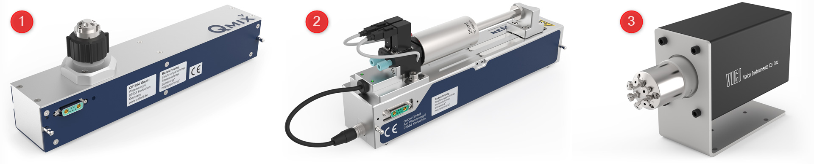
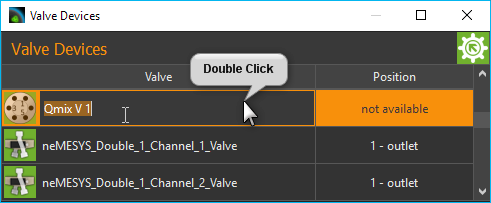
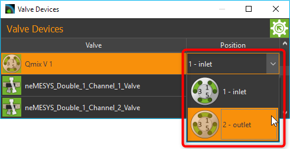
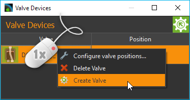
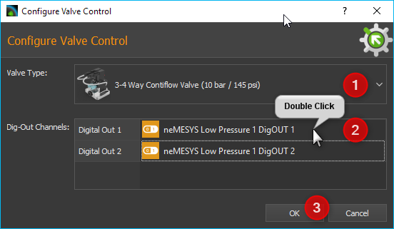
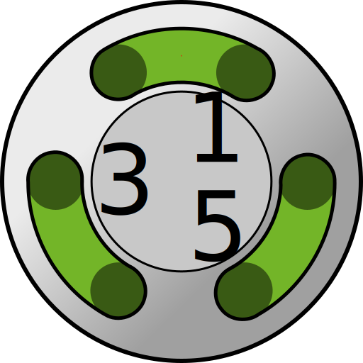

Ventil Plugin
==================

Einführung
----------

Das Ventil Plugin dient zur Steuerung der QmixV Ventil Module oder von
Ventilen, die Teil anderer Geräte sind (z.B. Ventile der Nemesys
Spritzenpumpen).

.. rst-class:: guinums

#. CETONI QmixV Ventilmodule
#. Ventilgeräte, die Teil anderer Geräte sind (z.B. Ventile, die auf Nemesys 
   Spritzenpumpen montiert sind)
#. Unterstützte Ventile von anderen Herstellern (z.B. VICI-Ventile)      

Ventil-Geräteliste
------------------

Das Plugin besteht im Wesentlich aus der Ventil-Geräteliste (siehe
Abbildung oben) die als Werkzeugfenster in der Qmix Oberfläche angezeigt
wird. 

.. image:: Pictures/10000201000001EB000000F0B98E00020FCB7DA7.png
   :alt: QmixV Ventil-Geräteliste

Das Fenster können Sie durch Anklicken und Ziehen der Titelleiste
jederzeit an eine andere Position in der grafischen Oberfläche
verschieben oder aus der Oberfläche als separates Fenster herauslösen.

Die Ventil-Geräteliste zeigt ihnen alle verfügbaren Ventilgeräte in
Tabellenform an. In der linken Tabellenspalte wird der Name des Ventils
und die aktuelle Ventilposition grafisch angezeigt. In der rechten
Spalte sehen Sie die Bezeichnung der aktuellen Ventilposition.

Ventilname ändern 
~~~~~~~~~~~~~~~~~~

Sie können den Namen des Ventils jederzeit ändern und z.B. einen Namen
vergeben, der zu Ihrer speziellen Anwendung passt. Ändern Sie den Namen
mit folgenden Schritten:

.. rst-class:: steps

#. Klicken Sie doppelt in die Tabellenzelle mit den Namen den Sie ändern
   möchten.
#. Geben Sie den neuen Namen in das Editierfenster ein, welches nun
   eingeblendet wird (siehe Abbildung).
#. Beenden Sie Ihre Eingabe durch Drücken der :kbd:`Return`-Taste.

Ventilposition umschalten
~~~~~~~~~~~~~~~~~~~~~~~~~

Die Ventilposition können Sie ebenfalls in der Modulliste umschalten.
Gehen Sie dafür wie folgt vor:

1. Klicken Sie doppelt in die Tabellenzelle in der die Ventilposition
   angezeigt wird.
2. Wählen Sie in der Auswahlbox die nun angezeigt wird die gewünschte
   Ventilposition aus (siehe Abbildung unten).
3. Bestätigen Sie die Auswahl durch Drücken der :kbd:`Return`-Taste oder
   klicken Sie auf eine andere Tabellenzelle um die Auswahlbox zu
   schließen.

Das Ventil wird nun in die neue Ventilposition geschaltet.

Ventilpositionen benennen 
~~~~~~~~~~~~~~~~~~~~~~~~~~

Sie können in der Software jeder Ventilposition einen individuellen
Namen geben und so die Bezeichnung der Ventilpositionen entsprechend
Ihrer Anwendung konfigurieren. Um den Namen der Ventilposition zu
ändern, führen Sie die folgenden Schritte durch:

.. rst-class:: steps

#. Klicken Sie mit der rechten Maustaste in die Tabellenzeile von dem
   Ventil, dessen Positionen Sie umbenennen möchten.

   .. image:: Pictures/10000201000001EB000000CBBC80A0A020333068.png
       :alt: Ventilkonfiguration aufrufen

#. In dem Kontextmenü welches nun angezeigt wird, wählen Sie den
   Menüpunkt :guilabel:`Configure valve positions...`.

#. Es wird nun ein Konfigurationsdialog angezeigt (Abbildung unten) der
   aus einer Ventilauswahlbox :guinum:`❶` besteht und aus der Liste der
   Ventilpositionen :guinum:`❷`.

   .. image:: Pictures/10000201000001640000014B947BCFC5B43A8B70.png
      :alt: Ventil-Konfigurationsdialog

#. Klicken Sie zur Benennung einer Ventilposition doppelt auf die
   Tabellenzeile dieser Position.

#. Es wird nun ein Editierfenster in die Tabellenzelle eingeblendet :guinum:`❸`,
   in den Sie den neuen Namen der Ventilposition eingeben können.

#. Bestätigen Sie die Eingabe durch Drücken der :kbd:`Return`-Taste.

#. Wenn Sie alle Ventilpositionen benannt haben, können sie den
   Konfigurationsdialog schließen.

Ab jetzt werden die Ventilpositionen in der Software in allen Bereichen
stets mit den neuen Namen angezeigt.

Ventile erstellen
-----------------

Sie können die Ventile von CETONI über einen oder mehrere digitale
Ausgänge steuern. Wenn Sie Ihr Ventil an die entsprechenden digitalen
Ausgänge angeschlossen haben, müssen Sie es in der Software
konfigurieren.

Als erstes sollten Sie dafür das Fenster der I/O Kanäle öffnen, und
durch manuelles Schalten der digitalen Ausgänge testen, ob das Ventil
korrekt angeschlossen ist und schaltet.

.. image:: Pictures/10000201000001AB000000D1DDFEC2AE0EE1C649.png
   :alt: Liste der I/O Kanäle - Test durch manuelles Schalten der digitalen Ausgänge

Klicken Sie dafür bei dem entsprechenden Kanal auf
die LED in der Spalte :guilabel:`On` um die digitalen Kanäle aus- und wieder
einzuschalten. Überprüfen Sie, ob das Ventil beim Umschalten des
digitalen Ausgangs geschaltet wird. Wird das Ventil nicht geschaltet,
ist es entweder falsch angeschlossen oder Sie schalten den falschen
Ausgang. Wenn das Ventil schaltet, können Sie mit der Erstellung des
Ventils in der Software fortfahren.

Klicken Sie dafür mit der rechten Maustaste in die Liste der Ventile und
wählen Sie dann aus dem Kontextmenü den Eintrag :menuselection:`Create Valve`.

Es wird nun der
Dialog zu Erstellung und Konfiguration eines Ventils angezeigt.

In dem Dialog wählen Sie als erstes im Feld :guilabel:`Valve Type` :guinum:`❶` 
den Typ des Ventils
aus, welches Sie angeschlossen haben. Danach müssen Sie für das Ventil
in der Tabelle *Dig-Out Channels* die digitalen Ausgänge konfigurieren.
Je nach Ventiltyp können das einer oder mehrere Ausgänge sein. Um einen
Ausgang zu konfigurieren, klicken Sie doppelt in die Tabellenzelle :guinum:`❷` für
diesen Kanal und wählen dann aus der Liste den entsprechenden digitalen
Ausgang aus. Die :guilabel:`OK`-Schaltfläche :guinum:`❸` wird erst freigeschaltet, wenn für
jeden Schalteingang des Ventils der entsprechende digitale Ausgangskanal
konfiguriert wurde. Sie können dann die Konfiguration durch Klick auf
:guilabel:`OK` abschließen.

In der Liste der Ventile erscheint nun das soeben erstellte Ventil.
Ventile, die Sie mit der :guilabel:`Create Valve`-Funktion erstellen, erhalten das
Präfix :code:`DO_` um zu kennzeichnen, dass es Ventile sind, welche durch
digitale Ausgänge gesteuert werden.

.. admonition:: Tipp
   :class: tip

   Ventile, die Sie mit der :guilabel:`Create Valve`-Funktion erstellt haben 
   können Sie in der        
   Ventilliste an dem Präfix :code:`DO_` erkennen.   

Ventile löschen
---------------

Ventile, die Sie dynamisch in der Software erzeugt haben, z.B. mit der
Funktion :ref:`Create Valve<Ventile erstellen>` (siehe vorheriger Abschnitt), können über das
Kontextmenü wieder aus der Ventilliste gelöscht werden. Klicken Sie
dafür mit der rechten Maustaste in die Zeile des Ventils, welches Sie
löschen möchten und wählen Sie dann den Menüpunkt :menuselection:`Delete Valve`.

.. image:: Pictures/10000201000001A0000000C3567ED07E7C53F439.png
   :alt: Ventile löschen

.. admonition:: Wichtig
   :class: note

   Ventile, die mit dem *Gerätekonfigurator*     
   erzeugt und konfiguriert wurden, oder die Bestandteil    
   von anderen Geräten sind, können mit :guilabel:`Delete Valve`      
   nicht gelöscht werden. 

Ventil Script Funktionen 
-------------------------

.. image:: Pictures/10000201000000F70000003E8592638162A9459E.png

Das Ventil-Plugin enthält eine Script Funktion für das Umschalten
der Ventile aus einem Script heraus.

Funktion Ventil umschalten - Switch Valve 
~~~~~~~~~~~~~~~~~~~~~~~~~~~~~~~~~~~~~~~~~~

.. image:: Pictures/10002F3400003505000035057520F6A9E5AEC280.svg
   :width: 60
   :align: left

Verwenden Sie diese Funktion zum Umschalten der
Ventilposition. Im Konfigurationsbereich dieser Funktion können Sie das
Ventilmodul auswählen :guinum:`❶` und die Zielposition :guinum:`❷` an die das Ventil
geschaltet werden soll. Das Vorschaubild visualisiert die ausgewählte Zielposition :guinum:`❸`.

Beide Auswahlboxen unterstützen die Verwendung von Variablen. Das heißt, in der 
Geräteauswahlbox :guinum:`❶` können Sie eine Variable verwenden, die eine 
Ventilgerätereferenz enthält.
In der Zielpositionsauswahlbox :guinum:`❷` können Sie eine Skriptvariable verwenden, 
die einen Zielpositionsindex enthält.

Das folgende Beispiel zeigt ein Skript, das zwei Variablen :guinum:`❶` erstellt. 
Die Variable :code:`$ProcessValve` speichert die Gerätereferenz auf das Ventilgerät 
**Valve_0**. Die Variable :code:`$RefillPosition` speichert die Zielposition des 
Ventils für das Nachfüllen der Spritze.

.. image:: Pictures/switch_valve_variables.png

Diese Variablen werden dann im Skript *Switch Valve* :guinum:`❷` für die Definition 
von :guilabel:`Valve` und :guilabel:`Target Position` verwendet.

Unterstützte VICI-Ventile
--------------------------

Das Valve Plugin unterstützt VICI-Ventile mit USB- oder RS-232-Schnittstelle.

.. image:: Pictures/VICI_Valve.jpg

Die folgende Liste zeigt alle Typen von VICI-Ventilen, die von der Software 
unterstützt werden:

.. list-table::
   :widths: 20 80
   :header-rows: 0

   * - |image-vici-10pos11port|
     - 10-Stellungs-Selektionsventil (SD) (z.B. `Niedrigdruck <https://www.vici.com/vval/sd.php>`_, `Hochdruck <https://www.vici.com/vval/sduw.php>`_)
   * - |image-vici-6pos7port|
     - 6-Stellungs-Selektionsventil (SD) (z.B. `Niedrigdruck <https://www.vici.com/vval/sd.php>`_, `Hochdruck <https://www.vici.com/vval/sduw.php>`_)
   * - |image-vici-2pos6port|
     - 6 Injektionsventil (z.B. `GC Einspritzdüsen <https://www.vici.com/vval/vval_gc.php>`_, `HPLC-Einspritzdüsen <https://www.vici.com/vval/vval_hplc.php>`_)

.. |image-vici-10pos11port| image:: Pictures/10Pos11Port_PositionIcon0.svg
   :width: 60

.. |image-vici-6pos7port| image:: Pictures/6Pos7Port_PositionIcon0.svg
   :width: 60

