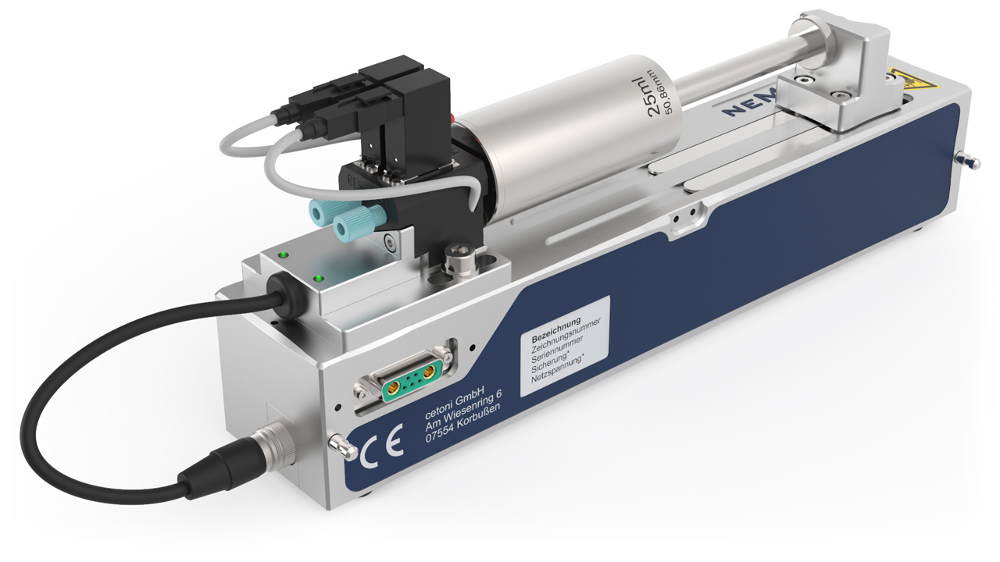

Ventil Plugin
==================

Einführung
----------

Das Ventil Plugin dient zur Steuerung von Ventilen, die Teil anderer Geräte sind
(z.B. Ventile, die auf Nemesys Spritzenpumpen montiert sind).

.. include:: qmixv_common_DE.inc.rst
