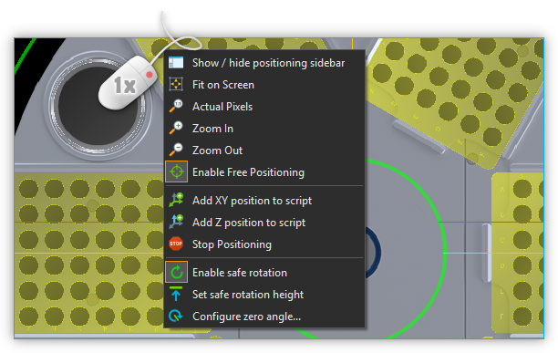
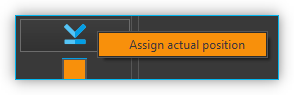
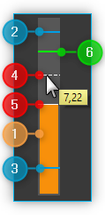
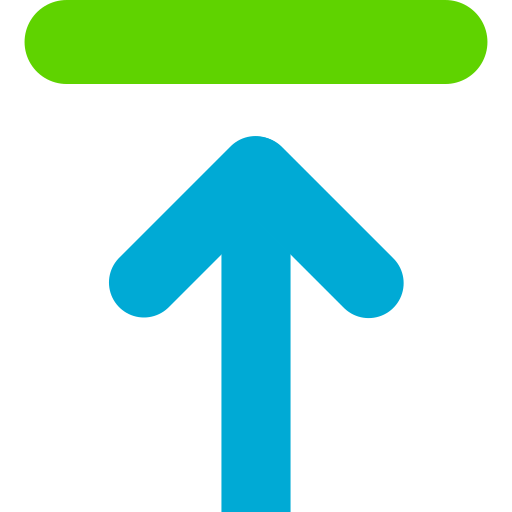
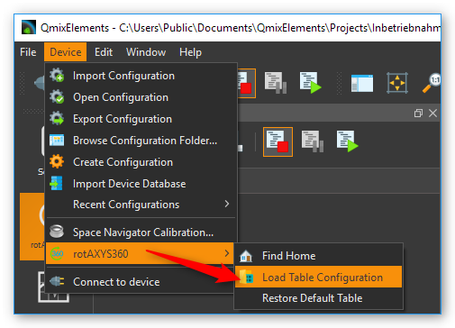
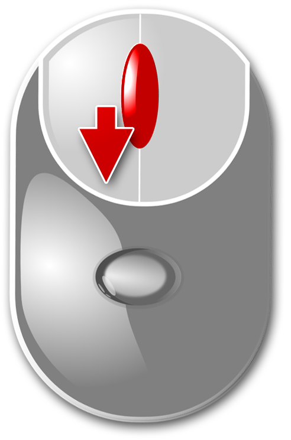
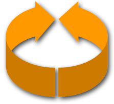

Rotaxys / Nemaxys Plugins
=========================

Einführung
----------

Diese Plugins unterstützen die Steuerung und Visualisierung verschiedener 
CETONI-Positionierungssysteme wie Rotaxys- und Nemaxys-Geräte. Für jedes Gerät 
wird ein :ref:`View <Views (Ansichten)>` erstellt, das alle UI-Elemente zur manuellen 
Steuerung eines einzelnen Geräts bereitstellt (siehe Abbildung unten).

.. image:: Pictures/10000201000003DC00000264E20C70B3.png
   :alt: Arbeitsbereich für Positioniersysteme

Sie können eine Ansicht für ein bestimmtes Gerät über den Hauptmenüpunkt 
:menuselection:`Window --> Show View --> Rotaxys` oder 
:menuselection:`Window --> Show View --> Nemaxys` oder über die entsprechenden 
Schaltflächen in der Anwendung :ref:`Sidebar (Seitenleiste)<Seitenleiste>`  anzeigen.

Eine solche Ansicht besteht hauptsächlich aus den folgenden Komponenten:

.. rst-class:: guinums

1. Werkzeugleiste
2. Positionierkarte für XY-Positionierung
3. Steuerkreuz für manuelle Positionierung
4. Z-Panel für die Positionierung der Z-Achse (Hubachse)
5. Seitenleiste
6. Statusleiste

Seitenleiste
------------

.. image:: Pictures/10000201000000AF0000012F9C3F78B4.png

In der Seitenleiste, die ein- und ausgeblendet werden kann,
finden Sie zusätzliche Steuerelemente zur Konfiguration und Steuerung
Ihres Positioniersystems. So können Sie z.B. im Bereich :guilabel:`Velocities`
(siehe Abbildung) die Geschwindigkeiten aller Achsen frei konfigurieren.
Alle Positionierungen in der *Positionierkarte* oder im *Z-Panel* werden
dann mit den eingestellten Geschwindigkeiten durchgeführt.

Werkzeugleiste
--------------

+-----------+---------------------------------------------------------+
| |image26| | Blendet die Seitenleiste mit zusätzlichen               |
|           | Konfigurations- und Steuerelementen ein oder aus        |
+-----------+---------------------------------------------------------+
| |image27| | Ändert die Vergrößerung der Positionierkarte so, dass   |
|           | die Anzeige vollständig in den Arbeitsbereich passt     |
+-----------+---------------------------------------------------------+
| |image28| | Ändert die Vergrößerung der Positionierkarte auf die    |
|           | tatsächliche Pixelgröße                                 |
+-----------+---------------------------------------------------------+
| |image29| | Erhöht den Vergrößerungsfaktor                          |
+-----------+---------------------------------------------------------+
| |image30| | Verringert den Vergrößerungsfaktor                      |
+-----------+---------------------------------------------------------+
| |image31| | Schaltet zwischen freier Positionierung und             |
|           | Container-Positionierung um (siehe Abschnitt            |
|           | `Positionierkarte`_ )                                   |
+-----------+---------------------------------------------------------+
| |image32| | Fügt die Skriptfunktion *Move XY* mit der aktuellen     |
|           | XY-Position als Zielposition zum Skript Editor hinzu    |
+-----------+---------------------------------------------------------+
| |image33| | Fügt die Skriptfunktion *Move Z* mit der aktuellen      |
|           | Position der Z-Achse als Zielposition zum Skript Editor |
|           | hinzu.                                                  |
+-----------+---------------------------------------------------------+
| |image34| | Stoppt sofort die Bewegungen aller Achsen des           |
|           | Positioniersystems                                      |
+-----------+---------------------------------------------------------+
| |image35| | Aktiviert/deaktiviert den `Sicherheitshub`_. Ist        |
|           | dieser aktiv, fährt die Z-Achse vor jeder               |
|           | Positionierung in der XY Ebene in eine sichere          |
|           | Position.                                               |
+-----------+---------------------------------------------------------+
| |image36| | Legt die aktuelle Position der Z-Achse als sichere      |
|           | Position fest. Ist die Sicherheitshebefunktion aktiv,   |
|           | fährt das Positioniersystem vor jeder Bewegung in der   |
|           | XY-Ebene auf diese Höhe.                                |
+-----------+---------------------------------------------------------+
| |image37| | Nullwinkel konfigurieren – der Nullwinkel wird vom      |
|           | Achssystem nicht überfahren und ist der Anfangs- und    |
|           | Endpunkt des 360°-Drehbereichs                          |
+-----------+---------------------------------------------------------+
| |image38| | Find Home - Führt eine Referenzfahrt aus, um die        |
|           | Ausgangsposition des Geräts zu finden.                  |
+-----------+---------------------------------------------------------+

Steuerkreuz
-----------

Rotaxys
~~~~~~~

Mit dem 6-Wege-Steuerkreuz können Sie alle Achsen des Rotaxys Positioniersystems 
manuell positionieren.

+-------------------------+----------------------------------------------------+
| |image48|               | Rotationsachse entgegen dem Uhrzeigersinn drehen   |
+-------------------------+----------------------------------------------------+
| |image49|               | Rotationsachse im Uhrzeigersinn drehen             |
+-------------------------+----------------------------------------------------+
| |image50|               | Radiusachse vom Drehzentrum weg bewegen            |
|                         | (Radius vergrößern)                                |
+-------------------------+----------------------------------------------------+
| |image51|               | Radiusachse Richtung Drehzentrum bewegen           |
|                         | (Radius verringern)                                |
+-------------------------+----------------------------------------------------+
| |image52|               | Hubachse nach oben oder unten bewegen              |
+-------------------------+----------------------------------------------------+

Nemaxys
~~~~~~~

Mit dem 6-Wege-Steuerkreuz können Sie alle Achsen des Nemaxys Positioniersystems 
manuell positionieren.

========= ===========================================
|image53| X-Achse nach links bewegen
|image54| X-Achse nach rechts bewegen
|image55| Y-Achse zur Rückseite des Gerätes bewegen
|image56| Y-Achse zur Vorderseite des Gerätes bewegen
|image57| Z-Achse nach oben oder unten bewegen
========= ===========================================

Geschwindigkeit verändern
~~~~~~~~~~~~~~~~~~~~~~~~~

Bei der Auswahl einer Richtung auf dem Steuerkreuz, wird die
entsprechende Achse mit einer festen Geschwindigkeit positioniert. Diese
Geschwindigkeit kann durch das gleichzeitige Drücken einer Taste auf der
Tastatur verändert werden. Drücken Sie dafür zuerst die Taste auf der
Tastatur und klicken Sie anschließend auf eine Richtungstaste im
Steuerkreuz.

Die folgen Tasten können verwendet werden:

+---------------------+--------------------------------------------+
| |image62|           | Shift key                                  |
|                     |                                            |
|                     | Increases the velocity by a fixed factor   |
+---------------------+--------------------------------------------+
| |image63|           | Control key                                |
|                     |                                            |
|                     | Decreases the velocity be a fixed factor   |
|                     | for precise, fine positioning              |
+---------------------+--------------------------------------------+

.. admonition:: Achtung
   :class: caution

   Gefahr von Beschädigung durch Kollision mit             
   Probenbehälter! Achten Sie darauf, bei abgesenkter      
   Werkzeugspitze, z.B. wenn sich eine Kanüle in einem     
   Behälter befindet, keine Kollisionen durch Bewegung der 
   Rotations- oder Linearachse zu verursachen.  

Positionierkarte
----------------

Einführung
~~~~~~~~~~

Die Positionierungskarte ist eine Gesamtansicht der XY-Ebene Ihres Achsensystems.
Sie zeigt den Verfahrbereich und die Arbeitsplatzkonfiguration Ihres Geräts.

========= ==============================================
|image67| Vergrößerungsfaktor erhöhen (hineinzoomen)
|image68| Vergrößerungsfaktor verringern (heraus zoomen)
========= ==============================================

Zur Navigation innerhalb der Positionierkarte können Sie ebenfalls die
Maus verwenden. Sie können den aktuell sichtbaren Ausschnitt über die
beiden Scrollbalken am rechten und unteren Rand der Karte verschieben.
Alternativ können Sie auch die freie Mausnavigation aktivieren. Gehen
Sie dafür wie folgt vor:

.. rst-class:: steps

#. Klicken Sie mit der mittleren Maustaste in die Positionierkarte
   
   .. image:: Pictures/10000000000001EC000002E9F2BF7149.png
      :width: 2.5cm
   
#. Es wird nun ein Navigationskreuz eingeblendet und die
   freie Navigation wird aktiviert

   .. image:: Pictures/100002010000018300000083E415CE9E.png

#. Sie können nun durch verschieben der Maus den aktuell
   sichtbaren Ausschnitt in der Positionierkarte verschieben. Je weiter
   Sie den Mauszeiger von dem eingeblendeten Navigationskreuz weg
   bewegen, um so schneller wird die Karte verschoben.

Positioniermodi
~~~~~~~~~~~~~~~

Die Positionierkarte kann in zwei verschiedenen Modi verwendet werden:

-  freie Positionierung
-  Container-Positionierung

.. image:: Pictures/10000D0D0000387200003872DC49EFEE.svg
   :width: 60
   :align: left

Zur Umschaltung zwischen den beiden Modi, verwenden Sie die
Schaltfläche *Positioning Map* in der Werkzeugleiste oder im Kontextmenü
der Positionierkarte. Die aktuelle Position des Rotaxys Gerätes wird auf
der Positionierkarte durch ein grünes Kreuz angezeigt.

.. image:: Pictures/100000000000021B000001883AC10950.png

.. admonition:: Wichtig
   :class: note

   Um Kollisionen zu vermeiden, wird vor dem  
   Anfahren einer Position die Hubachse stets automatisch  
   in die oberste Position verfahren.    

Freie Positionierung
~~~~~~~~~~~~~~~~~~~~

Bei der freien Positionierung
können Sie alle Positionen innerhalb eines erlaubten Bereiches :guinum:`❹`
anfahren. Der erlaubte Bereich ist durch eine grüne Umrandung
gekennzeichnet (siehe Abbildung). Wenn Sie die Maus bewegen, wird die
potentielle Zielposition :guinum:`❶` durch ein Zielkreuz, das aus zwei
gestrichelten Linien besteht, gekennzeichnet. Wenn Sie mit der linken
Maustaste die Zielposition anklicken, verfährt das Positioniersystem zu
der gewählten Position. Die Anzeige der aktuellen Position :guinum:`❷` bewegt sich
dann zur Zielposition :guinum:`❸`.

Container Positionierung
~~~~~~~~~~~~~~~~~~~~~~~~

In diesem Modus, klicken Sie zur Positionierung einfach in einen der
vorhandenen Container (Wells). Sobald Sie den Zielcontainer angeklickt
haben, verfährt das System automatisch zum Mittelpunkt des gewählten
Zielcontainers.

.. image:: Pictures/10000000000001820000011C044844B8.png
   :alt: Container Positionierung

Der gewählte Zielcontainer wird durch eine farbliche Markierung gekennzeichnet.

Kontextmenü aufrufen
~~~~~~~~~~~~~~~~~~~~

Klicken Sie mit der rechten Maustaste in die Positionierkarte, um das
Kontextmenü aufzurufen.

Z-Panel für die Positionierung der Z-Achse
------------------------------------------

.. image:: Pictures/100002010000008400000179E985566C.png

Das Z-Panel rechts neben der Positionierkarte zeigt Ihnen stets die
aktuelle Position der Hubachse an und gibt Ihnen verschiedene
Möglichkeiten zur Positionierung der Hub-Achse. Es besteht aus:

.. rst-class:: guinums

1. Schaltflächen für vordefinierte Positionen
2. numerische Höhenanzeige (Position Hubachse)
3. Slider zu Auswahl der Zielposition
4. grafische Höhenanzeige

Schaltfläche für vordefinierte Positionen
~~~~~~~~~~~~~~~~~~~~~~~~~~~~~~~~~~~~~~~~~

Die beiden Schaltflächen für das Heben und Senken :guinum:`❶` erleichtern die
schnelle Positionierung der Hubachse auf vorher von Ihnen definierte
Maximal- und Minimal-Positionen. Wenn Sie eine der beiden Schaltflächen
anklicken, verfährt die Hubachse mit der eingestellten Geschwindigkeit
an die vorher für diese Schaltfläche definierte Position. Mit den beiden
Schaltflächen legen Sie auch den Verfahrbereich fest, der mit dem
Positionsslider :guinum:`❸` ausgewählt werden kann.

Um die aktuelle Position zuzuweisen, klicken Sie auf eine der beiden
Schaltflächen mit der rechten Maustaste und wählen Sie dann im
Kontextmenü den Punkt :menuselection:`Assign actual position`.

Die zugewiesene Position wird
in den Konfigurationsdaten gespeichert und ist auch beim erneuten Start
der Software wieder vorhanden. Der konfigurierte Verfahrbereich mit
maximaler und minimaler Position wird Ihnen in der grafischen
Höhenanzeige durch zwei blaue Markierungen angezeigt (siehe Abschnitt `Höhenanzeige`_).

Höhenanzeige 
~~~~~~~~~~~~~

Die numerische Höhenanzeige zeigt Ihnen die aktuelle Höhe der Achse in
Millimetern an. Die grafische Anzeige stellt in einem Balken die
aktuelle Position innerhalb des Verfahrbereichs der Achse dar.

.. rst-class:: guinums

-  **Aktuelle Position / Höhe** – der farbige Balken zeigt
   die aktuelle Position der Achse
-  **Softwarelimit Maximum** – zeigt die maximale Position, die Sie
   mit dem Slider auswählen können. Im Abschnitt `Schaltfläche für vordefinierte Positionen`_
   ist beschrieben, wie Sie das Limit festlegen.
-  **Softwarelimit Minimum** – zeigt die minimale Position, die Sie
   mit dem Slider auswählen können
-  **Zielauswahl-Markierung** – zeigt die potentielle Zielposition,
   die per Mausklick zur Zielposition wird. Den Wert für diese Position
   wird im Hinweisfenster neben der Markierung angezeigt
-  **Zielposition** – wenn Sie mit der Maus in die Höhenanzeige
   klicken, wird eine neue Zielposition festgelegt und die Achse
   verfährt an diese Position. Die neue Zielposition kann nur innerhalb
   der Softwarelimits liegen. Klicken Sie außerhalb der Limits, verfährt
   die Achse bis zum entsprechenden Limit.
-  **Sichere Position für XY-Bewegung** – zeigt für bestimmte
   Achssysteme (z.B. Rotaxys) die sichere Position für XY-Bewegungen an.
   D.h. wenn die Achse tiefer steht als diese Position, wird vor einer
   XY-Bewegung die Achse auf diese Höhe verfahren.

Statusleiste
------------

In Statusleiste des Rotaxys / Nemaxys Arbeitsbereiches können Sie stets
die aktuelle XY-Position und den aktuellen Status des Gerätes ablesen.

.. image:: Pictures/10000201000001A40000003D95DACEE7.png
   :alt: Statusleiste

Sicherheitshub
--------------

.. image:: Pictures/10000B3C0000388E0000388EB899FB65.svg
   :width: 60
   :align: left

Sie können über diese Schaltfläche in der Werkzeugleiste den
Sicherheitshub ein- und ausschalten. Ist der Sicherheitshub aktiv, fährt
die Z-Achse vor jeder XY-Positionierung auf eine vorgegebene
Sicherheitshöhe. Dies verhindert Kollisionen mit Probengefäßen oder
anderen Gegenständen auf dem Arbeitstisch.

|

Durch Drücken dieser Schaltfläche definieren Sie die aktuelle
Position der Z-Achse als sichere Höhe. Wenn der Sicherheitshub aktiv
ist, wird das Achssystem vor jeder XY-Positionierung automatisch auf
diese Höhe fahren.

|

Mikrotiterplatte konfigurieren (Rotaxys)
----------------------------------------

Einführung
~~~~~~~~~~

.. admonition:: Wichtig
   :class: note

   Diese Funktion ist nur für Rotaxys-Geräte verfügbar. Wenn Sie ein Nemaxys- 
   oder Rotaxys 360-Gerät haben, überspringen Sie diesen Abschnitt.

In der `Positionierkarte`_ wird stets
die aktuell konfigurierte Mikrotiterplatte angezeigt. Sie können in der
Software neue Platten konfigurieren und einem Rotaxys Gerät zuweisen.
Wählen Sie dafür im Hauptmenü den Punkt :menuselection:`Edit --> Configure Well Plate`
(siehe Abbildung unten).

.. image:: Pictures/1000000000000185000000A437A90768.png
   :alt: Aufruf Konfigurationsdialog Mikrotiterplatte

Es wird
Ihnen nun der Konfigurationsdialog für Mikrotiterplatten angezeigt.
Dieser Konfigurationsdialog ist wie folgt aufgebaut:

.. rst-class:: guinums

#. Liste der erstellten Mikrotiterplatten
#. Konfigurationsparameter der aktuellen Platte
#. grafische Darstellung der aktuellen Platte

Vorhandene Mikrotiterplatte auswählen
~~~~~~~~~~~~~~~~~~~~~~~~~~~~~~~~~~~~~

Wenn die Liste der vorhandenen Platten :guinum:`❶` bereits eine passende
Mikrotiterplatte enthält, wählen Sie diese einfach durch Anklicken aus
und bestätigen Sie die Auswahl durch Anklicken der :guilabel:`OK`-Schaltfläche im
Dialog.

.. image:: Pictures/100000000000029A0000020185A439FC.png
   :alt: Konfigurationsdialog für Mikrotiterplatten

Neue Mikrotiterplatte erstellen
~~~~~~~~~~~~~~~~~~~~~~~~~~~~~~~~~

Um ein neue Mikrotiterplatte zu erstellen, führen Sie die folgenden
Schritte durch:

.. rst-class:: steps

#. Konfigurieren Sie im Bereich *Well plate geometry* :guinum:`❷` die Geometrie
   der Wellplatte. Sie konfigurieren die Anzahl der Zeilen :guilabel:`Rows` und
   Spalten :guilabel:`Columns` und den Abstand zwischen den Zeilen :guilabel:`Row Spacing` 
   und Spalten :guilabel:`Column Spacing`. Diese Daten finden Sie im
   Datenblatt der Mikrotiterplatte.

#. Als nächstes konfigurieren Sie die Geometrie der Kavitäten im
   Bereich *Cavity geometry*. Legen Sie hier die Größe der Kavitäten
   fest :guilabel:`Cavity Size` sowie deren Tiefe :guilabel:`Cavity Height`. Mit dem
   Auswahlfeld :guilabel:`Circular Cavities` legen Sie fest, ob die neue Platte
   runde oder quadratische Kavitäten haben soll.
   
#. Bestimmen Sie abschließend die Farbe der neuen Platte.
   Wählen Sie dafür im Farbauswahlfeld :guilabel:`Color` die gewünschte Farbe.
   Sollte die passende Farbe nicht vorhanden sein, wählen Sie den
   Eintrag *More...*. Es wird dann ein Farbauswahldialog zur freien
   Farbwahl angezeigt (siehe Abbildung unten).

   .. image:: Pictures/1000000000000222000001B52D5E1599.png

#. Klicken Sie nun auf die Schaltfläche :guilabel:`Add Well Plate`, um
   die neue Mikrotiterplatte der Liste hinzuzufügen. In dem
   Eingabedialog der nun angezeigt wird, müssen Sie einen eindeutigen
   Namen für die neue Platte vergeben. Drücken Sie nun :kbd:`Enter` oder klicken 
   Sie :guilabel:`OK`

   .. image:: Pictures/10000000000000F6000000A48331D83C.png

#. Die neue Platte wird nun der Liste hinzugefügt und kann von Ihnen
   ausgewählt werden.

Rotaxys360 Arbeitstisch konfigurieren
-------------------------------------

.. admonition:: Tipp
   :class: tip

   Diese Funktion ist nur für Rotaxys 360 Geräte verfügbar. Wenn Sie ein Nemaxys 
   oder Rotaxys-Gerät besitzen, können Sie diesen Abschnitt überspringen.

Arbeitstisch-Konfiguration laden
~~~~~~~~~~~~~~~~~~~~~~~~~~~~~~~~

Für das Rotaxys 360 Positioniersystem können im Moment die einzelnen
Mikrotiterplatten noch nicht vom Anwender konfiguriert werden, wie beim
Rotaxys Positioniersystem. Das Rotaxys 360 Positioniersystem unterstützt
aber das Laden von vorgefertigten Arbeitstisch-Konfigurationsdateien, in
denen die gesamte Konfiguration eines bestimmten Arbeitstisches
beschrieben ist.

Um eine Arbeitstisch-Konfiguration zu laden, blenden Sie sich die
Oberfläche des entsprechenden Rotaxys 360 Gerätes ein. Wählen Sie dann
im Hauptmenü den Punkt :menuselection:`Device --> rotAXYS 360 --> Load Table Configuration`.

Wählen Sie
dann in dem Dateiauswahldialog der angezeigt wird die
Konfigurationsdatei für den Arbeitstisch aus und laden Sie diese. Die
Anzeige des Arbeitstisches wird dann sofort auf die neue Konfiguration
aktualisiert (siehe Abbildung Beispielkonfiguration).

.. image:: Pictures/100002010000029700000167F3466823.png
   :alt: Arbeitstisch Beispielkonfiguration

Standard Arbeitstisch wiederherstellen
~~~~~~~~~~~~~~~~~~~~~~~~~~~~~~~~~~~~~~~

Wählen Sie zum Wiederherstellen des Standard-Arbeitstisches im Hauptmenü
den Punkt :menuselection:`Device --> rotAXYS 360 --> Restore Default Table`.

.. image:: Pictures/10000201000001D2000000ACD92863B0.png
   :alt: Standard Arbeitstisch wiederherstellen

Nullwinkel konfigurieren (Rotaxys 360)
--------------------------------------

Das Rotaxys360 Achssystem verfügt über einen Drehbereich, der
theoretisch größer als 360 Grad ist. Um ein Verwickeln und Verfitzen des
Schlauches für die Fluiddosierung zu verhindern, wurde der Drehbereich
auf 360° begrenzt.

Mit dem Nullwinkel
konfigurieren Sie den Winkel, der vom Positioniersystem nie überfahren
wird. Der Nullwinkel ist gleichzeitig der Start- und Endpunkt für den
Drehbereich. Wenn der Nullwinkel genau zwischen zwei Probenbehältern
liegt, die Sie prozessieren möchten, wird das Positioniersystem den
längeren Weg in die entgegengesetzte Richtung wählen, um den Nullwinkel
nicht zu überfahren.

.. image:: Pictures/10000DA30000388E0000388E5B234FC2.svg
   :width: 60
   :align: left

Sie können den Nullwinkel an eine anderen Winkelposition
verschieben, um dieses Problem zu umgehen. Drücken Sie dafür die
Schaltfläche zur Konfiguration des Nullwinkels.

========= =========
|image85| |image86|
========= =========

In dem Dialog der Ihnen nun angezeigt wird (siehe Abbildung oben),
können Sie den Nullwinkel im Bereich von 0 – 360° frei einstellen.

Positionierung mit dem Space Navigator
--------------------------------------

.. image:: Pictures/10000000000001BC000001A5A8497856.png

Der `Space Navigator <https://3dconnexion.com/us/product/spacemouse-compact/>`_ 
ist ein intuitives Eingabegerät, welches Ihnen die
Steuerung von allen Achsen (Rotationsachse, Radius-Achse und Hubachse)
gleichzeitig ermöglicht.
Um den Space Navigator zu nutzen, schließen Sie ihn an einen freien
USB-Anschluss an Ihrem PC an. Aktuelle Treiber finden Sie auf unserer
Internetseite:

https://cetoni.de/software-downloads/

oder auf dem Datenträger (CD oder USB-Stick) den Sie beim Kauf der
Software erhalten haben. Installieren Sie den Treiber, um den Space
Navigator nutzen zu können.

.. image:: Pictures/1000000000000500000002D03030564E.png

Positionieren Sie den Space Navigator so, dass das Verbindungskabel von
Ihnen weg zeigt und der **3D Connexion**-Schriftzug von Ihnen aus lesbar
ist.

Rotaxys mit Space Navigator positionieren
~~~~~~~~~~~~~~~~~~~~~~~~~~~~~~~~~~~~~~~~~

Übersicht
^^^^^^^^^

+---------------------+---------------------------------------------------------+
| |image94|           | Rotationsachse im Uhrzeigersinn oder entgegen dem       |
|                     | Uhrzeigersinn rotieren                                  |
+---------------------+---------------------------------------------------------+
| |image95|           | Radiusachse zum Außenradius oder zum Drehzentrum        |
|                     | bewegen                                                 |
+---------------------+---------------------------------------------------------+
| |image96|           | Hubachse nach oben oder unten bewegen                   |
+---------------------+---------------------------------------------------------+

.. admonition:: Wichtig
   :class: note

   Benutzen Sie den Space Navigator nicht,    
   wenn die Software das System verfährt (z.B. bei aktiver 
   Scriptausführung), um die Verfahrbewegungen nicht zu    
   unterbrechen.    

Rotationsachse positionieren
^^^^^^^^^^^^^^^^^^^^^^^^^^^^

Um die Rotationsachse zu positionieren, drehen Sie das Steuerelement im
Uhrzeigersinn oder entgegen dem Uhrzeigersinn.

.. image:: Pictures/100000000000023C00000157E76FE648.png
   :alt: Positionierung Rotationsachse mit Space Navigator

Die Geschwindigkeit, mit der die Achsen verfahren werden, kontrollieren Sie
durch die Stärke der Auslenkung des Bedienteils. D.h. je stärker Sie das
Bedienelement in eine bestimmte Richtung drücken oder drehen, umso
schneller bewegt sich das Verfahrsystem. So können Sie durch eine
geringe Auslenkung des Bedienteils sehr fein und gezielt positionieren.

.. admonition:: Tipp
   :class: tip

   Je stärker Sie das Bedienteil auslenken, um   
   so höher sind die Verfahrgeschwindigkeiten der Achsen.  

Radiusachse positionieren
^^^^^^^^^^^^^^^^^^^^^^^^^

Zum Verfahren der Radius-Achse schieben Sie das Bedienteil des Space
Navigators nach vorn oder hinten. Um die Radius-Achse zum Außenradius zu
bewegen, drücken Sie das Bedienelement nach vorn von sich weg. Um die
Radius-Achse zum Zentrum der Rotationsachse zu verfahren, ziehen Sie das
Bedienelement zu sich heran.

Hubachse positionieren
^^^^^^^^^^^^^^^^^^^^^^^

Um die Z-Achse zu positionieren, drücken Sie das Bedienelement nach
unten oder ziehen Sie das Bedienelement nach oben. Die Z-Achse wird in
die Richtung bewegt, in die Sie das Bedienelement des Space Navigators
bewegen.

Nemaxys mit Space Navigator positionieren
--------------------------------------------

Übersicht
~~~~~~~~~~

======================= ==================================================================
|image103|              X-Achse nach links oder rechts bewegen 
|image104|              Y-Achse nach vorn (in Richtung Anwender) oder nach hinten bewegen 
|image105|              Positioning vertical Z-axis
======================= ==================================================================

.. admonition:: Wichtig
   :class: note

   Benutzen Sie den Space Navigator nicht,    
   wenn die Software das System verfährt (z.B. bei aktiver 
   Scriptausführung), um die Verfahrbewegungen nicht zu    
   unterbrechen.   

X-Achse positionieren
~~~~~~~~~~~~~~~~~~~~~~~

Um die Bewegung der X-Achse zu steuern, schieben Sie das Bedienelement des Space 
Navigators in die gewünschte Richtung. Schieben Sie den Regler nach links, um 
die X-Achse nach links zu bewegen, und nach rechts, um die Achse nach rechts zu bewegen.

.. image:: Pictures/100000000000021E0000012A75C2B620.png
   :alt: Positionierung X-Achse mit Space Navigator

Die Geschwindigkeit, mit der die Achsen verfahren werden, kontrollieren Sie
durch die Stärke der Auslenkung des Bedienteils. D.h. je stärker Sie das
Bedienelement in eine bestimmte Richtung drücken oder drehen, umso
schneller bewegt sich das Verfahrsystem. So können Sie durch eine
geringe Auslenkung des Bedienteils sehr fein und gezielt positionieren.

.. admonition:: Tipp
   :class: tip

   Je stärker Sie das Bedienteil auslenken, um  
   so höher sind die Verfahrgeschwindigkeiten der Achsen. 

Y-Achse positionieren
~~~~~~~~~~~~~~~~~~~~~~

Um die Y-Achse zu verfahren, ziehen Sie das Bedienelement zu sich heran
oder schieben Sie das von sich weg. Entsprechend der Auslenkung des
Bedienelementes verfährt die Y-Achse zur Geräterückseite oder nach vorn
in Ihre Richtung.

.. admonition:: Tipp
   :class: tip

   Sie können beide Richtungen gleichzeitig steuern, wenn Sie den Controller 
   vorwärts oder rückwärts und gleichzeitig nach links oder rechts bewegen.

Hubachse positionieren
~~~~~~~~~~~~~~~~~~~~~~~

Um die Z-Achse zu positionieren, drücken Sie das Bedienelement nach
unten oder ziehen Sie das Bedienelement nach oben. Die Z-Achse wird in
die Richtung bewegt, in die Sie das Bedienelement des Space Navigators
bewegen.

Steuerung von einzelnen Achsen
------------------------------

Zusätzlich zur Steuerung von Achssystemen, können auch einzelne Achsen
manuell gesteuert werden. Dies kann notwendig sein, wenn Ihr Achssystem
über zusätzliche Werkzeugachsen verfügt (z.B. zweite Z-Achse oder
Rotationsachse) die nicht Bestandteil der XYZ-Steuerung sind.

.. image:: Pictures/10000000000001DC000000DF02C90C52.png
   :alt: Anzeige Bedienpanel zur Steuerung von Einzelachsen

Das Fenster zur Steuerung der Einzelachsen können Sie über den Menüpunkt
:menuselection:`Window → Single Axis Control` im Hauptmenü der Anwendung einblenden
(Abbildung unten).

.. admonition:: Tipp
   :class: tip

   Das Fenster zur Steuerung der Einzalachsen   
   ist ein Werkzeugfenster und kann frei in der Anwendung 
   platziert und in allen vier Seitenbereichen angedockt  
   werden.   

Im Fenster zur Steuerung der Einzalachsen stehen Ihnen folgende
Bedienelemente zur Verfügung:

.. rst-class:: guinums

1. Auswahlfeld **Axis Device** zur Auswahl der Einzelachse, die Sie
   steuern möchten.
2. Im Bereich **Position** wird Ihnen die aktuelle Position im Bereich
   zwischen Minimal- und Maximalposition als Fortschrittsbalken
   angezeigt. Über die Plus- / Minustasten können Sie die ausgewählte
   Achse verfahren. Die Verfahrbewegung dauert solange an, wie die
   entsprechende Schaltfläche gedrückt ist.

   .. image:: Pictures/10000000000001620000013436ED2B99.png

3. Im Bereich *Velocity* können Sie die Geschwindigkeit für die Verfahrbewegung einstellen.

.. admonition:: Tipp
   :class: tip

   Mit der Scriptfunktion :ref:`Einzelachse verfahren <einzelachse_verfahren>`
   können Sie einzelne Achsen aus einem Script-Programm heraus steuern.  

Weitere Funktionen 
-------------------

Achssystem kalibrieren 
~~~~~~~~~~~~~~~~~~~~~~~

Wenn der Verfahrweg einer Achse blockiert ist (z.B. im Fall einer
Kollision) kann es dazu kommen, dass die Schrittmotoren in dem Gerät
Schritte “verlieren”, so dass die Positionswerte nicht mehr korrekt
angezeigt werden. In diesem Fall ist es notwendig, eine Kalibrierung des
Achssystems durchzuführen. Zum Start der Kalibrierung wählen Sie im
Hauptmenü den Punkt :menuselection:`Device --> rotAXYS --> Find Home` (siehe Abbildung
unten). Wenn Sie ein Nemaxys System haben, erreichen Sie die
Kalibrierung über :menuselection:`Device --> neMAXYS --> Find Home`.

.. image:: Pictures/10000201000001DD00000099ECA5B3B8.png
   :alt: Positioniersystem kalibrieren

Script Funktionen zum Positionieren
-----------------------------------

Das Plugin bietet eine Reihe von Skriptfunktionen, die für die Integration der 
CETONI-Positionierungssysteme in das Skripting-System CETONI Elements erforderlich 
sind. Die folgenden Skriptfunktionen sind verfügbar:

.. image:: Pictures/100002010000013E000000C4FF06E1BD.png
   :alt: Script Funktionen zum Positionieren

Funktion XY Bewegung - *Move XY*
~~~~~~~~~~~~~~~~~~~~~~~~~~~~~~~~

Diese Funktion dient dazu, das ein Achssystem in einem Qmix
Script in der XY-Ebene zu positionieren. Das Achssystem :guinum:`❶`, und die
Zielposition (X- und Y- Position) :guinum:`❷` können Sie im
Konfigurationsbereich dieser Funktion eingeben . Alternativ können Sie
auch das Achssystem manuell an eine bestimmte Position verfahren (z.B.
mit der Positionierkarte - siehe Abschnitt :ref:`Positionierkarte`)
und dann mit der Schaltfläche :guilabel:`Capture Actual Position` der Scriptfunktion
die aktuellen Positionswerte zuweisen.

.. image:: Pictures/1000000000000222000001A467F71F03.png
   :alt: Konfigurationsbereich XY-Positionierung

Wenn Sie keine
weiteren Einstellungen vornehmen, erfolgen alle Positionierungen mit der
maximal möglichen Geschwindigkeit. Wenn Sie eigene Geschwindigkeiten
eingeben möchten, blenden Sie durch Anklicken von :guilabel:`Axis Velocities` die
Bedienelemente zur Eingabe der Geschwindigkeiten ein :guinum:`❸`. Hier können Sie
nun für jede Achse die Geschwindigkeit der Positionierung einstellen.

Mit dem Auswahlfeld :guilabel:`Run to completion` :guinum:`❹` legen Sie fest, ob nach dem
Start des Positioniervorganges:

-  sofort mit der Bearbeitung der nächsten Scriptfunktion begonnen wird
   (*Run to completion* inaktiv)
-  oder ob die nächste Funktion erst aufgerufen wird, wenn die
   Zielposition erreicht wurde (*Run to completion* aktiv).

Funktion Hubbewegung - *Move Z*
~~~~~~~~~~~~~~~~~~~~~~~~~~~~~~~

.. image:: Pictures/100028D60000388E0000388E7FEE4E05.svg
   :width: 60
   :align: left

Mit dieser Funktion kann die Hubachse (Z-Achse)
eines Achssystems positioniert werden. Das Achssystem :guinum:`❶`, und die
Positionsparameter (Z-Position :guinum:`❷` und Geschwindigkeit :guinum:`❸`) können Sie im
Konfigurationsbereich dieser Funktion eingeben. Alternativ können Sie
auch die Z-Achse manuell an eine bestimmte Position verfahren (z.B. mit
dem Z-Panel - siehe Abschnitt `Z-Panel für die Positionierung der Z-Achse`_ ) und dann mit der
Schaltfläche :guilabel:`Capture Actual Position` der Scriptfunktion die aktuellen
Z-Position zuweisen.

.. image:: Pictures/10000000000001F80000011DC4B4D896.png
   :alt: Konfigurationsbereich Z-Positionierung

Wenn Sie keine
weiteren Einstellungen vornehmen, erfolgen alle Positionierungen mit der
maximal möglichen Geschwindigkeit. Wenn Sie eigene Geschwindigkeiten
eingeben möchten, blenden Sie durch Anklicken von :guilabel:`Velocity` :guinum:`❸` die
Bedienelemente zur Eingabe der Geschwindigkeiten ein. Ein erneuter Klick
auf dieses Element, blendet die Eingabefelder für die Geschwindigkeit
wieder aus.

Mit dem Auswahlfeld :guilabel:`Run to completion` :guinum:`❹` legen Sie fest, ob nach dem
Start des Positioniervorganges:

-  sofort mit der Bearbeitung der nächsten Scriptfunktion begonnen wird
   (*Run to completion* inaktiv)
-  oder ob die nächste Funktion erst aufgerufen wird, wenn die
   Zielposition erreicht wurde (*Run to completion* aktiv).

.. admonition:: Tipp
   :class: tip

   Wenn :guilabel:`Run to completion` nicht aktiviert ist, können Sie mehrere 
   Achsen gleichzeitig verfahren. Sie können z.B. mit der Positionierung des 
   XY-Systems beginnen, und während die XY-Achsen verfahren werden, können Sie 
   die Positionierung mit der Z-Achse durchführen.

.. admonition:: Wichtig
   :class: note

   Die Eingabefelder zur Konfiguration der   
   Geschwindigkeiten sind standardmäßig ausgeblendet und  
   müssen erst durch das Anklicken von :guilabel:`Velocity` eingeblendet werden.  

Funktion Referenzfahrt – *Find Home*
~~~~~~~~~~~~~~~~~~~~~~~~~~~~~~~~~~~~

Diese Funktion ermöglicht den Start einer Referenzfahrt aus
dem Script heraus. Das Positioniersystem fährt zu seiner
Referenzposition und initialisiert sein Wegmessystem neu. Mit dem 
:guilabel:`Run to Completion`-Parameter können Sie wählen, ob die Funktion beendet
werden soll nach dem Start der Referenzfahrt oder erst wenn die
Referenzfahrt abgeschlossen ist.

.. _einzelachse_verfahren:

Funktion Einzelachse verfahren - *Move Axis*
~~~~~~~~~~~~~~~~~~~~~~~~~~~~~~~~~~~~~~~~~~~~

.. image:: Pictures/1000083F0000388E0000388E79629C8E.svg
   :width: 60
   :align: left

Mit dieser Funktion kann eine Einzelachse
positioniert werden. Im Auswahlfeld :guilabel:`Axis device` :guinum:`❶` wählen 
Sie die Achse aus, die
verfahren werden soll. Die Positionsparameter (Position :guinum:`❷` und
Geschwindigkeit :guinum:`❸`) können Sie im Konfigurationsbereich dieser Funktion
eingeben. Alternativ können Sie auch die Achse manuell an eine bestimmte
Position verfahren (z.B. mit dem Bedienpanel zur Einzelachssteuerung -
siehe Abschnitt `Steuerung von einzelnen Achsen`_) und dann mit der Schaltfläche
:guilabel:`Capture Position` der Scriptfunktion die aktuellen Position zuweisen.

.. image:: Pictures/10000000000001F50000011DA0097ABC.png
   :alt: Konfigurationsbereich Positionierung Einzelachse

Wenn
Sie keine weiteren Einstellungen vornehmen, erfolgen alle
Positionierungen mit der maximal möglichen Geschwindigkeit. Wenn Sie
eigene Geschwindigkeiten eingeben möchten, blenden Sie durch Anklicken
von :guilabel:`Velocity` die Bedienelemente zur Eingabe der Geschwindigkeiten :guinum:`❸`
ein. Ein erneuter Klick auf dieses Element, blendet die Eingabefelder
für die Geschwindigkeit wieder aus.

Mit dem Auswahlfeld :guilabel:`Run to completion` :guinum:`❹` legen Sie fest, ob nach dem
Start des Positioniervorganges:

-  sofort mit der Bearbeitung der nächsten Scriptfunktion begonnen wird
   (*Run to completion* inaktiv)
-  oder ob die nächste Funktion erst aufgerufen wird, wenn die
   Zielposition erreicht wurde (*Run to completion* aktiv).

.. admonition:: Wichtig
   :class: note

   Die Eingabefelder zur Konfiguration der   
   Geschwindigkeiten sind standardmäßig ausgeblendet und  
   müssen erst eingeblendet werden.  

Funktion Zu Container verfahren – Move to container
~~~~~~~~~~~~~~~~~~~~~~~~~~~~~~~~~~~~~~~~~~~~~~~~~~~

.. image:: Pictures/10001F860000387200003872C360796C.svg
   :width: 60
   :align: left

Diese Funktion dient dazu, ein Achssystem in der XY-Ebene
zum Mittelpunkt eines bestimmten Containers (Becherglas, Fluidtank,
Kavität einer Wellplatte) zu verfahren.

In der Auswahlbox :guilabel:`XY Device` (Abbildung unten – :guinum:`❶`) wählen Sie das
Achssystem aus. Den Zielcontainer wählen Sie in der Auswahlbox :guinum:`❷` aus.
Falls der Container über mehrere Kavitäten verfügt (z.B. die Wells einer
Wellplatte), geben Sie im Bereich :guinum:`❸` die Spalte :guilabel:`column` und Zeile
:guilabel:`row` der Kavität ein. Die Nummerierung erfolgt dabei von 0
beginnend. D.h. bei einer Wellplatte mit 12 Spalten und 8 Zeilen können
Sie bei :guilabel:`column` Werte von 0 bis 11 und bei :guilabel:`row` Werte von 0 bis 7
eingeben. Bei Container mit nur einer Kavität (z.B. Becherglas) sind die
Eingabefelder für Zeile und Spalte ausgegraut.*

.. image:: Pictures/1000000000000235000001BE75B30F65.png

Wenn Sie
keine weiteren Einstellungen vornehmen, erfolgen alle Positionierungen
mit der maximal möglichen Geschwindigkeit. Wenn Sie eigene
Geschwindigkeiten eingeben möchten, blenden Sie durch Anklicken von
:guilabel:`Axis Velocities` die Bedienelemente zur Eingabe der Geschwindigkeiten
ein :guinum:`❹`. Hier können Sie nun für jede Achse die Geschwindigkeit der
Positionierung einstellen.

Mit dem Auswahlfeld :guilabel:`Run to completion` :guinum:`❺` legen Sie fest, ob nach dem
Start des Positioniervorganges:

-  sofort mit der Bearbeitung der nächsten Scriptfunktion begonnen wird
   (*Run to completion* inaktiv)
-  oder ob die nächste Funktion erst aufgerufen wird, wenn die
   Zielposition erreicht wurde (*Run to completion* aktiv).

.. admonition:: Tipp
   :class: tip

   Sie können in den Zeilen- und Spalteneingabefeldern Skriptvariablen verwenden. 
   Auf diese Weise können Sie alle Kavitäten einer Kavitätenplatte in einer 
   Schleife unter Verwendung der Schleifenzählervariablen verarbeiten.

.. |image27| image:: Pictures/10000D410000388E0000388E35A2B3B1.svg
   :width: 40
.. |image28| image:: Pictures/100009990000388E0000388E1BA93A61.svg
   :width: 40
.. |image29| image:: Pictures/100006470000388E0000388E347518E6.svg
   :width: 40
.. |image30| image:: Pictures/100005ED0000388E0000388ED759EE76.svg
   :width: 40
.. |image31| image:: Pictures/10000D0D0000387200003872DC49EFEE.svg
   :width: 40
.. |image32| image:: Pictures/10006A1200003872000038721E5AEA51.svg
   :width: 40
.. |image33| image:: Pictures/10004B2D000038720000387201D5E26F.svg
   :width: 40
.. |image34| image:: Pictures/10000DBF0000388E0000388EA99541AC.svg
   :width: 40
.. |image35| image:: Pictures/10000B3C0000388E0000388EB899FB65.svg
   :width: 40

.. |image37| image:: Pictures/10000DA30000388E0000388E5B234FC2.svg
   :width: 40

.. |image48| image:: Pictures/100000000000008E0000008ADFC67101.png
   :width: 120
.. |image49| image:: Pictures/100000000000008E0000008A4C967708.png
   :width: 120
.. |image50| image:: Pictures/100000000000008E0000008ABA97D8C2.png
   :width: 120
.. |image51| image:: Pictures/100000000000008E0000008AF56DAD39.png
   :width: 120
.. |image52| image:: Pictures/100000000000008E0000008A4BC0171B.png
   :width: 120

.. |image53| image:: Pictures/100000000000008E0000008A43243293.png
   :width: 120
.. |image54| image:: Pictures/100000000000008E0000008A8EC74FBF.png
   :width: 120
.. |image55| image:: Pictures/100000000000008E0000008A42F68D0D.png
   :width: 120
.. |image56| image:: Pictures/100000000000008E0000008A0D0CF8F6.png
   :width: 120
.. |image57| image:: Pictures/100000000000008E0000008AB3A142D4.png
   :width: 120

.. |image62| image:: Pictures/1000000000000227000000DC165AEB92.png
   :width: 4.489cm
.. |image63| image:: Pictures/10000000000000E9000000DA41A245E6.png
   :width: 1.91cm

.. |image67| image:: Pictures/10000000000001EC000002E98AB54170.png
   :width: 2.5cm

.. |image86| image:: Pictures/10000000000001F4000001F46EE2C177.png
   :width: 6.807cm

.. |image95| image:: Pictures/1000000000000116000000E97F22C917.png
   :width: 80
.. |image96| image:: Pictures/100000000000009D000000DF60858E32.png
   :width: 80

.. |image104| image:: Pictures/1000000000000116000000E97F22C917.png
   :width: 80
.. |image105| image:: Pictures/100000000000009D000000DF60858E32.png
   :width: 80