Script-System
=============

Einführung
----------

.. admonition:: Achtung
   :class: caution

   Mit dem CETONI Elements Script-System können Sie Prozesse steuern und automatisieren. 
   Überprüfen Sie die erstellten Skripte/Programme sowie die Parametereinträge, bevor Sie 
   sie zum ersten Mal ausführen! CETONI übernimmt keine Haftung für direkte und/oder
   indirekte Schäden an Ihrem System oder externen Hard- und Softwarekomponenten,
   die durch die von Ihnen erstellten Skripte/Programme oder durch die Eingabe von Parametern
   die für Ihren speziellen Anwendungsfall nicht geeignet oder ungünstig sind.

Die Software verfügt über ein leistungsfähiges Script-System, um
Prozessabläufe zu automatisieren.

.. image:: Pictures/10000201000003C9000001AAB18C614061F55B68.png
   :alt: Script-System Übersicht

Die Benutzeroberfläche des Skriptsystems besteht aus zwei einzelnen Ansichten:

.. rst-class:: guinums

1. *Script Editor*- enthält das vom Anwender programmierte Script (siehe :ref:`Views<Views (Ansichten)>`).
2. *Script Pool* - enthält alle verfügbaren Scriptfunktionen.
3. *Script-Konfiguration* - dient zur Konfiguration der Parameter einer
   Scriptfunktion, die im Scripteditor ausgewählt ist

Script Pool
-----------

Überblick
~~~~~~~~~~~~

Um den *Script Pool* einzublenden, aktivieren Sie auf der Seitenleiste die
Schaltfläche :guilabel:`Scripting`.

.. image:: Pictures/10000201000001BC00000116F459D83094022ABD.png
   :alt: Script Pool einblenden

Zusammen mit dem *Script Pool*
wird auch der Bereich zur *Script-Konfiguration* eingeblendet. Der *Script
Pool* enthält alle Scriptfunktionen, die für die Programmierung von
Scripten zur Verfügung stehen. Die Scriptfunktionen sind dabei nach
Kategorien unterteilt. Jedes Gerät bzw. jedes Plugin registriert seine
Scriptfunktionen in einer eigenen Kategorie. 
Die Kategorien können vom Anwender jederzeit im *Script Pool* ein- und ausgeklappt 
werden.

.. image:: Pictures/100002010000022E0000017D7475090392B8F4E9.png
   :alt: Script Pool - Kategorie ein- und ausgeklappt

Zum Ein-:guinum:`❶` & Ausklappen :guinum:`❷` der Funktionen einer Kategorie, klicken Sie
einfach auf den Kategorienamen (Abbildung oben).

Script Pool Kontextmenü
~~~~~~~~~~~~~~~~~~~~~~~~~~

Öffnen Sie das Kontextmenü, indem Sie mit der rechten Maustaste auf den Skript-Pool klicken:

+-----------+---------------------------------------------------------+
| |editfun| | Öffnet die ausgewählte Funktion *User Library*          |
|           | zur Bearbeitung.                                        |
+-----------+---------------------------------------------------------+
| |folder|  | Öffnet den Ordner *Benutzerbibliothek* im Datei-Explorer|
+-----------+---------------------------------------------------------+
| |expand|  | Erweitert alle Kategorien                               |
+-----------+---------------------------------------------------------+
| |collapse|| Klappt alle Kategorien zusammen                         |
+-----------+---------------------------------------------------------+

Script Editor
-------------

.. _einführung-1:

Einführung
~~~~~~~~~~

Der *Script Editor* dient zur grafischen Programmierung von
Scripten/Programmen. In der unteren Abbildung (*Script Editor*) sind
folgende Elemente des Arbeitsfensters nummeriert:

.. rst-class:: guinums

1. *Werkzeugleiste* - zum Laden, Speichern und zur Ablaufsteuerung von
   Scripten.
2. Die Kopfzeile enthält den Dateinamen des aktuell geöffneten Scriptprogramms.
3. *Funktionsbaum* - baumartige Struktur mit allen Scriptfunktionen
4. Die aktuell ausgeführte Funktion wird farblich hervorgehoben (hier
   blau)
5. Wenn Sie eine Funktion durch Anklicken auswählen, wird diese
   mit der Akzentfarbe das aktuellen Themes farblich markiert (hier orange).

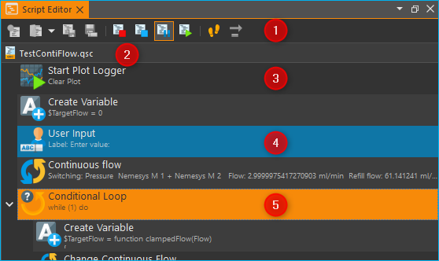

Jede Funktion wird im Funktionsbaum in
einer eigenen Zeile angezeigt. In dieser Zeile sind alle wichtigen
Parameter der Funktion für Sie sichtbar (siehe Abbildung unten):

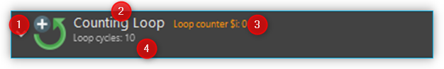

Auf der linken Seite finden
Sie das grafische Symbol der Funktion :guinum:`❶`. Unmittelbar rechts neben dem
Symbol oben :guinum:`❷` finden Sie den Funktionsnamen. Neben dem Funktionsnamen
werden Ihnen Statusinformationen :guinum:`❸` angezeigt. Diese Informationen sind
bei vielen Funktionen erst während der Ausführung sichtbar und können
sich währende der Ausführung auch ändern. Direkt unter dem
Funktionsnamen sehen eine Zusammenfassung aller wichtigen
Funktionsparameter :guinum:`❹`, die im Konfigurationsbereich von Ihnen
konfiguriert wurden.

Der *Script Editor* ist in der Software ein bewegliches andockbares
Fenster. D.h., Sie können den Editor durch Anklicken der Titelleiste und
anschließendes Ziehen mit der Maus an eine andere Position innerhalb der
Software verschieben und an beliebiger Stelle wieder andocken. Sollte
das Fenster des Editor einmal nicht sichtbar sein, dann aktivieren Sie
es über den Menüpunkt :menuselection:`Window → Script Editor` im Hauptmenü 
(siehe Abbildung unten).

.. image:: Pictures/100002010000018B000000E25969D2D1DAB3AE6A.png
   :alt: Script Editor anzeigen

Um die Übersichtlichkeit zu
erhöhen oder die Darstellung des Editors an Ihre Bedürfnisse anzupassen,
können Sie die Skalierung ändern Klicken Sie dafür mit der rechten
Maustaste in den Editor um das Kontextmenü zu öffnen und wählen Sie in
dem Untermenü *Set Item Scaling* die Größe der Darstellung aus:

Die folgenden Größen sind auswählbar:

-  **Small** – sehr kompakte Darstellung für maximale Übersichtlichkeit
   bei komplexen Funktionsabläufen, die Funktionsparameter werden nicht
   mehr mit angezeigt
-  **Normal** – normale Darstellung
-  **Big** – die Icons und der Funktionsname werden vergrößert
   dargestellt für eine optimale Lesbarkeit

Werkzeugleiste
~~~~~~~~~~~~~~

+-----------+---------------------------------------------------------+
| |image17| | Erzeugt ein neues, leeres Script.                       |
+-----------+---------------------------------------------------------+
| |image18| | Lädt eine vorhandene Script-Datei in den Script Editor. |
+-----------+---------------------------------------------------------+
| |image19| | Speichert das aktuelle Script.                          |
+-----------+---------------------------------------------------------+
| |image20| | Speichert das aktuelle Script unter einem neuen Namen.  |
+-----------+---------------------------------------------------------+
| |image21| | Beendet die Scriptausführung sofort. Alle Geräte        |
|           | bleiben im aktuellen Zustand, sie werden nicht          |
|           | abgeschaltet oder gestoppt und gehen nicht in einen     |
|           | sicheren Zustand über. Durch Anklicken der              |
|           | Start-Schaltfläche beginnt der Programmablauf komplett  |
|           | von vorne.                                              |
+-----------+---------------------------------------------------------+
| |image22| | Script Stopp Anfordern. Beim Klick auf diese            |
|           | Schaltfläche wird die globale Scriptvariable            |
|           | *$\ StopRequested* auf den Wert *true* gesetzt. Das     |
|           | Script kann diese Variable zyklisch abfragen, z.B. in   |
|           | der Hauptschleife des Scriptes, um auf eine             |
|           | Stopp-Anforderung zu reagieren und das Script zu        |
|           | beenden. Dadurch hat das Script die Möglichkeit, Geräte |
|           | in einen sicheren Zustand zu bringen (z.B. Pumpen zu    |
|           | stoppen, Ventile zu schalten) bevor die                 |
|           | Scriptausführung beendet wird.                          |
+-----------+---------------------------------------------------------+
| |image23| | Unterbricht die aktuelle Programmausführung - durch     |
|           | Anklicken der Start-Schaltfläche wird die Ausführung an |
|           | der aktuellen Position fortgesetzt .                    |
+-----------+---------------------------------------------------------+
||runscript|| Startet die Programmausführung oder setzt ein Programm  |
|           | nach einer Unterbrechung fort.                          |
+-----------+---------------------------------------------------------+
| |stepping|| Aktiviert den Einzelschrittbetrieb zum Testen und       |
|           | Debuggen von Scriptprogrammen. Ist diese Funktion aktiv |
|           | wird die Scriptausführung nach der Ausführung jeder     |
|           | Scriptfunktion unterbrochen.                            |
+-----------+---------------------------------------------------------+
| |execstep|| Durch Klicken dieser Schaltfläche kann der nächste      |
|           | Schritt, d.h. die nächste Funktion im                   |
|           | Einzelschrittbetrieb ausgeführt.                        |
+-----------+---------------------------------------------------------+

.. admonition:: Tipp
   :class: tip

   Sie können Scripte auch einfach per Drag &    
   Drop (Ziehen und Ablegen) laden. Ziehen Sie dafür       
   einfach eine Script-Datei aus Ihrem Dateisystem auf den 
   Script-Editor.        

Kontextmenü
~~~~~~~~~~~

Wenn Sie mit der rechten Maustaste auf eine Funktion im *Script-Editor*
klicken, wird ein Kontextmenü mit zusätzlichen Aktionen eingeblendet
(siehe Abbildung unten).

.. image:: Pictures/100002010000014400000150DF1BE1DD8FC0A460.png
   :alt: Kontextmenü Script Editor

Die folgenden Funktionen stehen über das Kontextmenü zu Verfügung:

+-----------+---------------------------------------------------------+
| |editfun| | Öffnet den ausgewählten                                 |
|           | :ref:`Skriptfunktionsaufruf<script_function_call>`      |
|           | zur Bearbeitung (nur bei Rechtsklick auf einen          |
|           | Skriptfunktionsaufruf)                                  |
+-----------+---------------------------------------------------------+
| |image52| | Verschiebt die ausgewählte Funktion um eine Position    |
|           | nach oben                                               |
+-----------+---------------------------------------------------------+
| |image53| | Verschiebt die ausgewählte Funktion um eine Position    |
|           | nach unten                                              |
+-----------+---------------------------------------------------------+
| |image54| | Kopiert die ausgewählten Funktionen in die              |
|           | Zwischenablage                                          |
+-----------+---------------------------------------------------------+
| |image55| | Fügt die Funktionen aus der Zwischenablage vor die      |
|           | ausgewählte Funktion ein                                |
+-----------+---------------------------------------------------------+
| |duplica| | Dupliziert die ausgewählte Funktion. Dies ist eine      |
|           | Kombination aus Kopieren und Einfügen in einem          |
|           | einzigen Schritt.                                       |
+-----------+---------------------------------------------------------+
| |image56| | Löscht die ausgewählten Funktionen                      |
+-----------+---------------------------------------------------------+
| |image57| | Löscht alle Funktionen im Script                        |
+-----------+---------------------------------------------------------+
| |image58| | Ersetzt die ausgewählten Funktionen durch eine          |
|           | Funktionssequenz und fügt die Funktionen in die Sequenz |
|           | ein. Damit können Sie schnell Funktionen gruppieren und |
|           | so ihr Script strukturieren und übersichtlicher         |
|           | gestalten.                                              |
+-----------+---------------------------------------------------------+
| |disable| | Aktiviert / Deaktiviert die ausgewählten Funktionen.    |
|           | Damit können Sie bestimmt Funktionen temporär           |  
|           | deaktivieren und später wieder aktivieren. Deaktivierte |
|           | Funktionen werden bei der Programmausführung            |
|           | übersprungen. Dies entspricht der Funktionalität des    |
|           | Auskommentierens von Quelltext in textbasierten         |
|           | Programmiersprachen.                                    |
+-----------+---------------------------------------------------------+
| |expand|  | Klappt alle Funktionen im Script auf                    |
+-----------+---------------------------------------------------------+
| |collapse|| Klappt alle Funktionen im Script ein so dass nur noch   |
|           | die oberste Funktionsebene zu sehen ist                 |
+-----------+---------------------------------------------------------+
| |image61| | Ändert die Skalierung der Darstellung der               |
|           | Scriptfunktionen. Damit kann die Übersichtlichkeit bei  |
|           | komplexen Scripten erhöht werden.                       |
+-----------+---------------------------------------------------------+
| |image62| | Startet die Scriptausführung an der ausgewählten        |
|           | Funktion. Wenn Variablen im Script vorher initialisiert |
|           | werden, kann es sein, dass sie in diesem Fall noch      |
|           | nicht initialisiert sind.                               |
+-----------+---------------------------------------------------------+
| |image63| | Beendet die Scriptausführung sofort. Alle Geräte        |
|           | bleiben im aktuellen Zustand, sie werden nicht          |
|           | abgeschaltet oder gestoppt und gehen nicht in einen     |
|           | sicheren Zustand über.                                  |
+-----------+---------------------------------------------------------+

.. admonition:: Tipp
   :class: tip

   Um die Ausführung des Skriptes von einer      
   bestimmten Funktion aus zu starten, klicken Sie mit der 
   rechten Maustaste auf die Funktion und wählen Sie dann  
   im Kontextmenü den Punkt :menuselection:`Run From Here`.             

Script Konfigurationsbereich
----------------------------

Übersicht
~~~~~~~~~

Der Konfigurationsbereich enthält alle Bedienelemente zur Konfiguration
der Scriptfunktion, die aktuell im *Script Editor* ausgewählt ist.

.. image:: Pictures/100002010000021A0000012F07608C2B70720CC7.png
   :alt: Script Konfigurationsbereich

Der Konfigurationsbereich besteht aus:

.. rst-class:: guinums

1. Kopfzeile mit der Bezeichnung der aktuell ausgewählten Funktion
2. Eingabe- und Bedienelemente der Funktion
3. Kommentarfeld zur Eingabe eines beliebigen Kommentars

Die Eingabe- und Bedienelemente :guinum:`❷` sind für jede Script-Funktion
unterschiedlich. Alle Funktionen haben aber einige Einstellungen
gemeinsam, wie z.B das Kommentarfeld im unteren Teil des
Konfigurationsbereiches :guinum:`❸` oder der Funktionsname im Kopf :guinum:`❶`.

Funktionsbezeichnung ändern
~~~~~~~~~~~~~~~~~~~~~~~~~~~

Sie können im Kopf des Konfigurationsbereiches die Bezeichnung der
Funktion ändern, um so „sprechende“ Funktionsbezeichnungen zu verwenden,
die Dritten oder Ihnen später das Lesen und Verstehen des Skriptes
erleichtern.

Um die Funktionsbezeichnung zu ändern, klicken Sie entweder mit der
linken Maustaste auf den Funktionsnamen im Kopf der Funktion oder
klicken Sie den Namen mit der rechten Maustaste an und wählen Sie im
Kontextmenü den Punkt :menuselection:`Edit Function Caption` (siehe Abbildung 
unten).

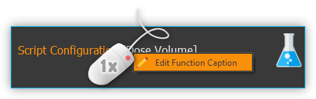

In dem Eingabedialog der nun angezeigt wird, geben Sie eine neue Bezeichnung
für die Funktion ein.

.. image:: Pictures/10000201000001B00000009EE87E1DC8113145D3.png
   :alt: Eingabe Funktionsbezeichnung

Das folgende Beispiel
zeigt ein kurzes Programm mit den Standardfunktionsnamen auf der linken
Seite und das gleiche Programm mit eigenen Funktionsnamen auf der
rechten Seite.

======================= ===========================
Standard Funktionsnamen Anwendungsspezifische Namen
|image67|               |image68|
======================= ===========================

.. admonition:: Tipp
   :class: tip

   Verbessern Sie die Lesbarkeit,                
   Verständlichkeit und die Wartbarkeit Ihrer Skripte      
   durch die Verwendung von sprechenden,                   
   anwendungsspezifischen Funktionsbezeichnungen. 

Kommentar eingeben
~~~~~~~~~~~~~~~~~~

Im Kommentarfeld können Sie einen beliebigen Kommentar eingeben, der es
anderen Anwendern ermöglicht, Ihr Script besser zu verstehen und dem
Programmablauf leichter zu folgen.

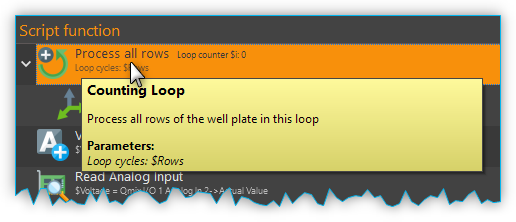

Wenn Sie im *Script Editor*
den Mauspfeil über eine Funktion bewegen, wird Ihnen der entsprechende
Kommentar dieser Funktion in einem Hinweisfenster (*Tooltip*)
eingeblendet (siehe Abbildung oben). So können Sie, ohne dass Sie den
Konfigurationsbereich einer Funktion öffnen müssen, den Kommentar zu
dieser Funktion lesen.

Programmierung
--------------

Funktionen hinzufügen
~~~~~~~~~~~~~~~~~~~~~

Funktionen werden aus dem Script-Pool mit Ziehen-und-Ablegen (Drag &
Drop) in den Script Editor übernommen. Dazu gehen Sie wie folgt vor:

.. rst-class:: steps

#. Klicken Sie mit der linken Maustaste im Script-Pool auf die
   Funktion, die Sie einfügen möchten :guinum:`❶` und halten Sie die Maus
   gedrückt.
#. Ziehen Sie die Funktion mit gedrückter Maustaste in den *Script
   Editor* hinein.
#. Sobald Sie die linke Maustaste loslassen :guinum:`❷`, wird die Funktion in den
   Script- Editor an der entsprechenden Stelle eingefügt.

.. image:: Pictures/1000020100000257000000FE60273A82A9E46F3B.png
   :alt: Drag&Drop von Script Funktionen

An welche Stelle die
Funktion eingefügt wird, hängt davon ab, an welcher Position sich der
Mauszeiger befindet, wenn Sie die Maustaste loslassen. Folgende
Varianten sind möglich:

.. image:: Pictures/10000201000001340000012B261E2BD3D1D76AC8.png

.. rst-class:: guinums

1. Lassen Sie die Maustaste über einer Funktion los, so wird
   die neue Funktion vor die Funktion eingefügt.
2. Wird die Maustaste über einer Funktionssequenz (z.B., einer
   Schleife/Loop) losgelassen, dann wird die neue Funktion am Ende der
   Sequenz angefügt.
3. Wenn über dem freien Bereich am Ende des Funktionsbaumes die
   Maustaste losgelassen wird, dann wird die Funktion an das Ende
   angehängt.

Funktionen auswählen
~~~~~~~~~~~~~~~~~~~~

Um Funktionen zu bewegen, zu kopieren oder zu löschen, müssen Sie die
Funktionen zuerst auswählen. Sie können entweder eine einzelne Funktion
durch Anklicken auswählen, oder eine zusammenhängende Folge von
Funktionen auf der gleichen Hierarchieebene.

.. image:: Pictures/10000201000001F0000000EFC1A07C20DF2E2141.png
   :alt: Script Editor Mehrfachauswahl

Sobald Sie eine
Funktion mit der linken Maustaste anklicken wird die aktuelle Auswahl
gelöscht und die neue Funktion ausgewählt :guinum:`❶`. Wenn Sie jedoch die
Umschalttaste (:kbd:`Shift`) drücken, während Sie auf ein Element klicken :guinum:`❷`, werden
alle Elemente zwischen dem aktuellen Element und dem angeklickten
Element ausgewählt.

Funktionen bewegen
~~~~~~~~~~~~~~~~~~

Durch *Ziehen-und-Ablegen* können Sie die Funktionen im Funktionsbaum
bewegen und so an eine neue Position verschieben. Für das Einfügen an
der neuen Position gelten dieselben Regeln wie beim Hinzufügen von neuen
Funktionen.

.. image:: Pictures/10000201000001CC000000FCEBE9DEBFD8E32CFF.png
   :alt: Funktionen bewegen

Für das Verschieben von Funktionen
nach Oben und Unten gibt es eine weitere Alternative. Klicken Sie
hierfür mit der rechten Maustaste auf die Funktion, die verschoben
werden soll. Aus dem Kontextmenü (siehe Abbildung unten) wählen Sie dann
den Menüpunkt *Move up* oder *Move down*. Alternativ können Sie auch
die Tastenkombinationen :kbd:`Strg` + :kbd:`↑` oder :kbd:`Strg` + :kbd:`↓`
verwenden.

Mit dieser zweiten Methode lassen sich Funktionen nur in der aktuellen
Sequenz noch oben oder unten verschieben. Wollen Sie die Funktion an
eine komplett andere Position im Funktionsbaum bewegen, so ist dies nur
mit Ziehen-und Ablegen-möglich.

.. admonition:: Wichtig
   :class: note

   Mit *Move up* oder *Move down* wird immer 
   nur die aktuelle Funktion verschoben. Auch wenn mehrere 
   Funktionen ausgewählt sind, wird nur die aktuelle       
   Funktion verschoben. Wenn Sie die komplette Auswahl     
   verschieben möchten, können Sie dies durch              
   *Ziehen-und-Ablegen* (Drag & Drop) erreichen.  

Funktionen löschen
~~~~~~~~~~~~~~~~~~

Für das Löschen von Funktionen gibt es zwei Möglichkeiten:

1. Wählen Sie die zu löschenden Funktionen aus und klicken Sie dann im
   Kontextmenü auf den Menüpunkt *Delete*.
2. Wählen Sie die zu löschenden Funktionen aus und drücken Sie dann die
   *Entfernen* Taste.

Funktionen kopieren
~~~~~~~~~~~~~~~~~~~

Das Kopieren von Funktionen kann auch wieder wahlweise über das
Kontextmenü oder mittels Tastenkombinationen erfolgen. Wenn Sie mit dem
Kontextmenü arbeiten, wählen Sie nacheinander die Menüpunkte *Copy* und
*Paste* (Abbildung unten). Wenn Sie mit der Tastatur arbeiten, verwenden
Sie die Tastenkombinationen :kbd:`Strg` + :kbd:`C` zum Kopieren und 
:kbd:`Strg` + :kbd:`V` zum Einfügen.

.. image:: Pictures/1000020100000112000000CF9D471977536A43C2.png
   :alt: Funktionen kopieren

So kopieren Sie eine Funktion:

.. rst-class:: steps

#. Wählen Sie die Funktionen, die Sie kopieren möchten, durch Anklicken
   aus.
#. Kopieren Sie die Funktionen mit dem Menüpunkt *Copy* aus dem
   Kontextmenü oder über die Tastenkombination :kbd:`Strg` + :kbd:`C`.
#. Wählen Sie die Funktion, vor die Sie die kopierten Funktionen
   einfügen möchten, durch Anklicken aus.
#. Fügen Sie die kopierten Funktionen mit dem Menüpunkt *Paste* oder der
   Tastenkombination :kbd:`Strg` + :kbd:`V` ein.

Den Einfügevorgang *Paste* können Sie beliebig oft wiederholen, um
mehrere Kopien der vorher mit *Copy* kopierten Funktionen aus der
Zwischenablage einzufügen.

.. admonition:: Tipp
   :class: tip

   Zum schnellen Duplizieren von Funktionen können Sie auch den Menüpunkt
   :menuselection:`Duplicate` oder die Tastenkombination :kbd:`Strg` + :kbd:`D`
   verwenden.

Funktionen gruppieren
~~~~~~~~~~~~~~~~~~~~~

Um die Übersichtlichkeit und Lesbarkeit Ihres Scripts zu verbessern,
können Sie Abfolgen von Funktionen schnell und einfach in
Funktionssequenzen gruppieren. Wählen Sie dafür einfach eine
zusammenhängende Reihe von Funktionen aus, und klicken Sie dann im
Kontextmenü auf den Menüpunkt *Convert Selection To Function Sequence.*

.. image:: Pictures/1000020100000162000000A933F710A74CD5FF30.png
   :alt: Funktionen gruppieren

Die ausgewählten Funktionen werden nun durch eine Funktionssequenz ersetzt, 
welche die ausgewählten Funktionen enthält.

.. image:: Pictures/10000201000002AD000000B45887FBE2E338C1B1.png

.. _funktionen-deaktivieren:

Funktionen deaktivieren / aktivieren
~~~~~~~~~~~~~~~~~~~~~~~~~~~~~~~~~~~~~~

In klassischen textbasierten Programmiersprachen gibt es die Möglichkeit, 
Quelltext durch Auskommentieren temporär zu deaktivieren. Das Script-System
bietet eine vergleichbare Funktionalität. Um Funktionen zu deaktivieren, 
markieren Sie die Funktionen im Script-Editor und wählen dann aus dem Kontextmenü 
den Eintrag
:menuselection:`Enable / Disable Selected Functions`. Alternativ können Sie auch
die Tastenkombination :kbd:`Strg` + :kbd:`/` verwenden.

.. image:: Pictures/context_menu_disable_functions.png

Wenn Sie Funktionen
deaktivieren, werden diese in eine :guilabel:`Disabled Functions` Sequenz
eingefügt. Bei der Skriptausführung, wird der Inhalt der Sequenz einfach
übersprungen.

Um deaktivierte Funktionen wieder zu aktivieren, wählen Sie eine einzelne
:guilabel:`Disabled Functions` Sequenz aus, und verwenden dann den 
gleichen Menüpunkt / Tastenkombination wie beim Deaktivieren.

Funktionsparameter editieren
~~~~~~~~~~~~~~~~~~~~~~~~~~~~

Sobald Sie eine Funktion im Funktionsbaum durch Anklicken auswählen,
werden im Bereich *Script-Konfiguration* die Bedienelemente zur
Konfiguration der gewählten Funktion eingeblendet und Sie können die
Funktionsparameter editieren.

Tooltip anzeigen
~~~~~~~~~~~~~~~~

Wenn Sie die Maus über eine Funktion bewegen, wird nach kurzer Zeit das
Hinweisfenster (*Tooltip*) für diese Funktion angezeigt (siehe Abbildung
unten). In diesem Fenster erhalten Sie alle Informationen zu dieser
Funktion auf einem Blick: Funktionsname :guinum:`❶`, Kommentar oder
Funktionsbeschreibung :guinum:`❷` und Funktionsparameter :guinum:`❸`.

.. figure:: Pictures/1000020100000204000000DEDBCF89E6569C55A7.png
   :alt: Hinweisfenster für Funktion (Tooltip)

.. _scriptvariablen:

Variablen
---------

.. _variables-introduction:

Einführung
~~~~~~~~~~

Das Script-System unterstützt die Verwendung von Variablen. Variablen
sind in Scriptprogrammen Behälter für Rechengrößen und Werte, die im
Verlauf der Scriptausführung auftreten. Variablen werden durch einen vom
Benutzer zu definierenden Namen bezeichnet. Variablen können verwendet
werden, um Werte (z.B., Schleifenzähler oder von Sensoren gemeldete
Daten) darin zu speichern oder Ergebnisse von Berechnungen.
Scriptfunktionen, die die Verwendung von Variablen unterstützen, können
dann später auf den Inhalt dieser Variablen zugreifen.

Variablen anlegen
~~~~~~~~~~~~~~~~~

Bevor im Script Variablen zum Speichern von Werten oder zum Rechnen
verwendet werden können, müssen die Variablen angelegt werden. Es gibt
zwei Varianten zum Anlegen von Variablen:

1. Explizit: Variablen werden explizit vom Anwender definiert, z.B.
   durch die Funktion :ref:`variable_erzeugen`.
2. Implizit: Das Anlegen erfolgt implizit über Funktionen, die Variablen
   anbieten, wie z.B. durch die Funktion :ref:`zählschleife`, deren
   Schleifenzähler eine Variable ist.

.. _naming-variables:

Benennung von Variablen
~~~~~~~~~~~~~~~~~~~~~~~

Bezüglich der Namensgebung für Variablen sind einige Besonderheiten zu
beachten: Jede Variable wird im Programm über einen weitgehend frei
wählbaren Namen angesprochen. Dieser Name identifiziert die Variable
eindeutig. Verschiedene Namen bezeichnen verschiedene Variablen. Durch
ein vorangestelltes :code:`$`-Symbol können Variablennamen oder die Verwendung
von Variablen eindeutig visuell identifiziert werden. Das Scriptsystem
unterscheidet zwischen Groß- und Kleinschreibung: der Name :code:`$Var`
benennt also ein andere Variable als der Name :code:`$var`.

Für die Benennung von Variablen gelten außerdem folgende Vorgaben:

-  Variablennamen müssen immer mit einem Dollarzeichen ($) beginnen und
   dürfen kein weiteres Dollarzeichen beinhalten.
-  Variablennamen dürfen nur Buchstaben und Ziffern enthalten (a-Z,
   0-9).
-  Sonderzeichen (z.B., $, &, /, -, ...) dürfen nicht verwendet werden.
-  Variablennamen dürfen nicht mit einer Ziffer beginnen.

.. admonition:: Tipp
   :class: tip

   Sie können den Inhalt von Variablen mit Hilfe 
   der Show Message Funktion anzeigen lassen, um so z.B.   
   die Ergebnisse von Berechnungen zu überprüfen.  

Sichtbarkeitsbereich von Variablen (Scope)
~~~~~~~~~~~~~~~~~~~~~~~~~~~~~~~~~~~~~~~~~~

Unter dem Sichtbarkeitsbereich einer Variable versteht man den
Programmabschnitt, in dem die Variable nutzbar und sichtbar ist. Die
Qmix Scripte haben im Scripteditor eine baumartige Struktur mit beliebig
vielen Ebenen. Eine Variable ist stets nur auf der Ebene sichtbar, auf
der Sie erstellt wurde und auf allen tieferen Ebenen.

Im folgenden Beispielprogramm ist die Variable :code:`$a` im rot markierten
Bereich sichtbar – d.h. von Scriptfunktionen verwendbar (Abbildungen
unten):

Die Variable :code:`$b` dagegen ist nur in der Funktionssequenz
(*FunctionSequence*) sichtbar (Abbildung unten).

Der Zähler :code:`$i` der Zählschleife ist nur in den Funktionen sichtbar, die
sich in der Zählschleife (*Counting Loop*) befinden:

.. image:: Pictures/10000201000001CB000001831A3AF6CDB6960307.png

Die Variable :code:`$c`, die innerhalb der Zählschleife erstellt
wird, ist auch nur auf dieser Ebene sichtbar, da keine weiteren
untergeordneten Ebenen mehr vorhanden sind:

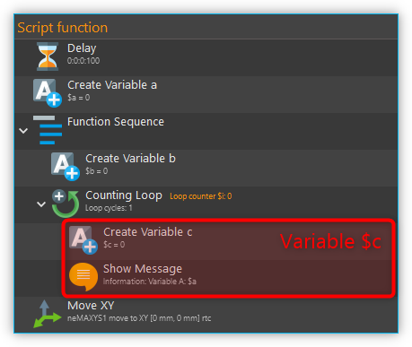

Zu beachten ist außerdem, dass eine später (d.h., auf einer
tieferen Ebene) definierte Variable eine früher (d.h., vorher, auf einer
höheren Ebene) definierte Variable gleichen Namens überschreibt: wäre
:code:`$c` z.B. wiederholt als :code:`$b` definiert worden, würde der später
zugeordnete Wert (also 2) den vorhergehenden (also 1) überschreiben.

.. admonition:: Wichtig
   :class: note

   Wenn Sie Variablen in tieferen Ebenen den  
   gleichen Namen geben, wie Variablen in höheren Ebenen,  
   dann überdecken die Variablen in der tieferen Ebene die 
   Variablen der höheren Ebene. D.h., Funktionen in der    
   tieferen Ebene können nicht mehr auf die Variable der   
   höheren Ebene (bzw. deren Werte) zugreifen.   

Verwendung von Variablen
~~~~~~~~~~~~~~~~~~~~~~~~

Variablen können in allen Funktionen, die diese unterstützen, verwendet
werden (z.B. *Create Variable* Funktion). Über den Variablennamen
inklusive Dollarzeichen (z.B. *$TargetPosition*) kann im Script auf eine
Variable lesend oder schreibend zugegriffen werden.

.. admonition:: Wichtig
   :class: note

   Variablen haben erst einen gültigen Wert,   
   wenn die Zuweisungsfunktion (z.B. Create Variable)      
   durchlaufen wurde. Wenn Sie die Aktion *Run From Here*    
   verwenden, kann es deshalb vorkommen, dass Variablen    
   keine gültigen Werte enthalten, da Sie die              
   Zuweisungsfunktion übersprungen haben.  

Bei Funktionen, die die Verwendung von Variablen unterstützen, sind die
entsprechenden Eingabefelder durch ein farbiges :guilabel:`V` markiert
(siehe Abbildung unten). Sie können dann, alternativ zu einem Wert, den
Bezeichner einer Variable eintragen, um deren Wert in Ihrem Script zu
verwenden.

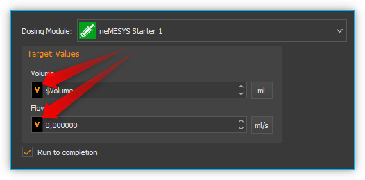

.. admonition:: Tipp
   :class: tip

   In fast allen Eingabefeldern, welche die     
   Verwendung von Variablen unterstützen können Sie auch   
   direkt über Prozessdatenbezeichner auf                  
   Geräteprozessdaten zugreifen                            
   (siehe `Device Properties (Prozessdaten)`_).
   

Autovervollständigung von Variablennamen
~~~~~~~~~~~~~~~~~~~~~~~~~~~~~~~~~~~~~~~~

Eingabefelder, die die Verwendung von Variablen unterstützen, bieten
eine *Autovervollständigung,* die Sie bei der Auswahl und Eingabe
gültiger Variablennamen unterstützt.

.. image:: Pictures/10000201000001C20000014FBE3E569F0981A6AD.png
   :alt: Autovervollständigung von Variablennamen

Sobald Sie
in diesen Eingabefeldern das Dollarzeichen ($) eingeben, um einen
Variablennamen einzutragen, wird eine Liste der bereits erstellten
Variablen eingeblendet (siehe Abbildung oben).

Mit jedem weiteren Buchstaben den Sie dann eingeben, wird die Liste der
Variablen erneut gefiltert und an den bisherigen Inhalt des Feldes
angepasst. Mit den :kbd:`↑`- oder :kbd:`↓`-Tasten oder mit der Maus können
Sie einen Eintrag aus der Liste wählen und mit der :kbd:`Enter` Taste die
Auswahl in das Eingabefeld übernehmen.

.. _device-property-identifiers:

Device Properties (Prozessdaten)
--------------------------------

In fast allen Eingabefeldern, welche die Verwendung von Variablen
unterstützen (siehe `Verwendung von Variablen`_),
können Sie auf Prozessdaten (*Device Properties*) von Geräten auch
direkt zugreifen. Klicken Sie dafür einfach mit der rechten Maustaste in
das Eingabefeld und wählen Sie den Menüpunkt *Insert device property*
(siehe Abbildung unten).

.. image:: Pictures/10000201000001E3000000F91FE4E79FF2747393.png
   :alt: Device Properties in Eingabefelder einfügen

Es wird nun ein Dialog zur Auswahl der Prozessdaten angezeigt (siehe Abbildung
unten).

.. image:: Pictures/10000201000001C6000000F0B5F49C8D9D01ECE2.png
   :alt: Auswahldialog für Geräte-Prozessdaten

In diesem Dialog können Sie im Auswahlfeld :guilabel:`Filter` :guinum:`❶`, welchen Gerätetyp
Sie verwenden möchten. Im Auswahlfeld :guilabel:`Device` :guinum:`❷` wählen Sie ein
bestimmtes Gerät aus und die Prozessdaten auf die zugegriffen werden
soll, wählen Sie im Feld :guilabel:`Property` :guinum:`❸`.

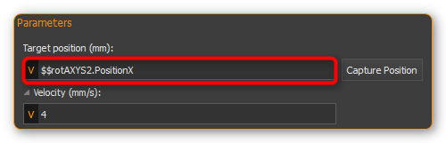

In das Eingabefeld wird nun der ausgewählte Prozessdatenbezeichner
eingetragen. Ähnlich wie Variablen haben die Bezeichner für Prozessdaten
einen bestimmte Form:

:code:`$$Gerätename.Prozessdaten`

Jeder Bezeichner beginnt mit zwei Dollarzeichen und ein Punkt trennt den
Gerätenamen von dem Bezeichner für die Prozessdaten. Der gesamte
Prozessdatenbezeichner darf keine Leerzeichen oder andere Sonderzeichen
enthalten.

.. admonition:: Important
   :class: note

   Der Gerätename und auch die Bezeichnung    
   der Prozessdaten haben eine normalisierte Form - alle   
   Leerzeichen wurden entfernt und durch Unterstrich       
   ersetzt. Der Gerätename ist der eindeutige Name des     
   Gerätes und nicht die Bezeichnung, die der Anwender für 
   jedes Gerät konfigurieren kann.  

Sobald die Skriptfunktion ausgeführt wird, werden die Prozessdaten vom
Gerät gelesen und an die Funktion als Parameter übergeben.

.. _programming-your-own-script-functions:

Eigene Scriptfunktionen programmieren
-------------------------------------

Scriptfunktion erstellen
~~~~~~~~~~~~~~~~~~~~~~~~

Zusätzlich zu den Scriptfunktionen, die im Script-Pool zur Verfügung
stehen, haben Sie die Möglichkeit, eigene Scriptfunktionen zu
programmieren und diese dann später in Ihren Scripten zu verwenden. Um
eine eigene Scriptfunktion zu implementieren, gehen Sie wie folgt vor:

:step:`Schritt 1 - Ein neues Script erstellen`

Klicken Sie auf die Schaltfläche :guilabel:`Create New Script` :guinum:`❶` 
um ein leeres Script zu erzeugen. Klicken Sie anschließend auf die Schaltfläche 
:guilabel:`Save Script` :guinum:`❷` um der Scriptfunktion einen Namen zu geben 
und sie dann mit
diesem Namen zu speichern. Der Name der Scriptfunktion wird dann im Kopf
des Scripteditors angezeigt :guinum:`❸`. In diesem Beispiel verwenden wir den
Namen *AddValues*, da wir eine Funktion implementieren möchten, die zwei
Werte addiert.

.. image:: Pictures/10000201000001E300000081C08337AF408A77E5.png

:step:`Schritt 2 - Funktionsparameter definieren`

Sie können für Ihre Funktion Funktionsparameter und Rückgabewerte
definieren. Funktionsparameter sind Werte, die beim Aufruf der Funktion
an diese übergeben werden. Rückgabewerte sind Werte (z.B. Ergebnisse von
Berechnungen), die von der Funktion an das aufrufende Script
zurückgegeben werden. Für jede Funktion können bis zu 10
Funktionsparameter und bis zu 10 Rückgabewerte definiert werden.

Um Parameter und Rückgabewerte zu definieren, klicken Sie mit der Maus
auf eine freie Fläche im Scripteditor oder auf den Kopf des
Scripteditors :guinum:`❶` (Abbildung unten), in dem der Name der Funktion
angezeigt wird.

.. image:: Pictures/100002010000025F000000F613C948DBF14299DF.png

Im Script-Pool sehen Sie nun das Konfigurationsfenster für
das Script. Hier können Sie durch Anklicken der :guilabel:`Add` Schaltflächen
Funktionsparameter :guinum:`❷` oder Rückgabewerte :guinum:`❸` hinzufügen.

Klicken Sie für dieses Beispiel zweimal auf die :guilabel:`Add` Schaltfläche 
:guinum:`❷` um zwei Funktionsparameter hinzuzufügen. Klicken Sie dann auf den 
ersten Parameternamen (Abbildung unten) und vergeben Sie einen
aussagekräftigeren Namen: *Summand1*:

.. image:: Pictures/10000201000001AD000000BA59BF59476BCC908C.png

Tragen Sie dann für den Parameter den Default Wert 0 ein :guinum:`❷`.
Klicken Sie nun auf den zweiten Parameternamen und benennen Sie diesen
um in *Summand2.*

:step:`Schritt 3 - Rückgabewerte definieren`

Klicken Sie jetzt einmal auf die :guilabel:`Add` Schaltfläche im Bereich *Return
Values* :guinum:`❶` (Abbildung unten) um einen Rückgabewert hinzuzufügen. Klicken
Sie dann auf den ersten Rückgabewert Namen und benennen Sie diesen um
in: *Sum.*

.. image:: Pictures/10000201000001510000007CC6466F2943E0596A.png

Speichern Sie nun die Scriptfunktion, um Ihre Änderungen zu
sichern. Der Konfigurationsbereich der Scriptfunktion sollte nun wie
folgt aussehen:

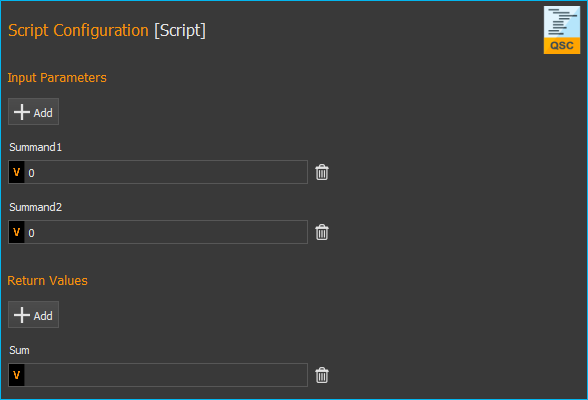

:step:`Schritt 4 - Funktionslogik implementieren`

Alle Funktionsparameter und Rückgabewerte stehen innerhalb des Scriptes
als Variablen zur Verfügung, die gelesen und geschrieben werden können.
D.h. das Script kann die übergebenen Werte nun aus den beiden Variablen
:code:`$Summand1` und :code:`$Summand2` lesen und das Ergebnis der Berechnung in der
Variable :code:`$Sum` speichern und damit zurück an das aufrufende Script
übergeben.

Um nun die Addition durchzuführen, fügen Sie eine *Set Variable*
Scriptfunktion in das Script ein und setzen den Type der Variable auf
*JavaScript Expression*.

.. image:: Pictures/1000020100000256000000F4FC5255AD8336787C.png

Im Feld :guilabel:`Name` tragen Sie den Namen :guinum:`❶` (Abbildung unten) 
der Variable ein,
die den Wert speichern soll – in diesem Fall also die Variable :code:`$Sum`.
In das Eingabefeld für den JavaScript Code :guinum:`❷` können Sie nun die Addition
der beiden Variablen :code:`$Summand1` und :code:`$Summand2` eintragen.

.. image:: Pictures/10000201000001A60000010A9B2821B16D5BA0B3.png

:step:`Schritt 5 - Geben Sie der Funktion einen aussagekräftigen Namen`

Klicken Sie in das Feld für den Funktionsnamen :guinum:`❶` und geben Sie der 
Funktion einen aussagekräftigen, eindeutigen, kurzen und beschreibenden Namen. 
Dieser Name wird später im Skript-Editor später als Funktionsname angezeigt. 
Hier verwenden wir den Namen **Add Values** (Werte hinzufügen) :guinum:`❷`:

.. image:: Pictures/function_name.png

:step:`Schritt 6 - Fügen Sie einen optionalen Kommentar hinzu`

Klicken Sie in das Feld :guilabel:`Comment` und fügen Sie einen optionalen 
Kommentar hinzu, der dem der dem Benutzer Ihrer Funktion hilft, ihre Parameter, 
ihren Rückgabewert und ihre Verwendung nachzuvollziehen:

.. image:: Pictures/function_comment.png

:step:`Schritt 7 - Zuweisen eines optionalen benutzerdefinierten Symbols`

Wenn Sie Ihre Funktionen im Skript verwenden, wird das Standardsymbol das 
Symbol des **Skript-Funktionsaufrufs**:

Wenn Sie Ihre Funktion mit einem benutzerdefinierten SVG-Symbol erweitern möchten, 
dann klicken Sie auf die Schaltfläche :guilabel:`Select Icon`.
Die Software zeigt einen Symbolauswahldialog mit einer Bibliothek aller in der 
Software geladenen Icons. Sie können ein Symbol auswählen, indem Sie es doppelt 
anklicken :guinum:`❸`. 

.. image:: Pictures/icon_library.png

Sie haben zwei Möglichkeiten, die Symbolbibliothek zu filtern. Die erste 
Möglichkeit ist, ein bestimmtes Plugin aus der Liste :guinum:`❶` auszuwählen, 
wenn Sie ausschließlich an Icons aus diesem Plugin interessiert sind. Die zweite 
Möglichkeit ist die Eingabe eines Filterausdrucks in das Filter-Textfeld 
:guinum:`❷` einzugeben. Sie können beide Filteroptionen kombinieren:

.. image:: Pictures/filtered_icon_library.png

Wenn Sie kein Symbol in der Bibliothek finden, können Sie ein benutzerdefiniertes 
SVG-Symbol laden, indem Sie auf die Schaltfläche :guilabel:`Load Custom SVG Icon`
unterhalb der Symbolliste klicken. In diesem Beispiel verwenden wir diese Option, 
um ein benutzerdefiniertes Summensymbol auszuwählen. Sobald Sie das Icon ausgewählt 
haben, wird das Icon der Funktion im Skripteditor :guinum:`❶` und im 
Konfigurationspanel :guinum:`❷` aktualisiert:

.. image:: Pictures/script_function_icons.png

.. admonition:: Tipp
   :class: tip

   Wenn Sie das Standardsymbol wiederherstellen möchten, klicken Sie auf die 
   Schaltfläche :guilabel:`Clear Icon` im Konfigurationsbereich der Skriptfunktion.

:step:`Schritt 8 - Speichern der Funktion`

Wenn Sie alle Ihre Änderungen vorgenommen haben, sollten Sie die endgültige 
Funktion erneut speichern.

:step:`Schritt 9 – Die Funktion testen`

Jetzt können Sie die Scriptfunktion testen. 
Klicken Sie auf die :guilabel:`Run Script`-Schaltfläche 
:guinum:`❶` (Abbildung unten) – es sollte kein Fehler auftreten und das Ergebnis 
der Addition sollte im Scripteditor in der *Set Variable* Funktion angezeigt
werden :guinum:`❷`.

.. image:: Pictures/10000201000002670000013365D1FE2B80D7A609.png

Falls Fehler auftreten, korrigieren Sie diese und speichern Sie die
Scriptfunktion erneut.

Eigene Scriptfunktionen verwenden
~~~~~~~~~~~~~~~~~~~~~~~~~~~~~~~~~

Klicken Sie auf die Schaltfläche :guilabel:`Create New Script` :guinum:`❶` um 
ein leeres Script zu erzeugen. Klicken Sie anschließend auf die Schaltfläche 
:guilabel:`Save Script` :guinum:`❷` um der Scriptfunktion einen Namen zu geben 
und sie dann mit
diesem Namen zu speichern. Der Name der Scriptfunktion wird dann im Kopf
des Scripteditors angezeigt :guinum:`❸`. In diesem Beispiel verwenden wir den
Namen *CustomScriptFunctionTest*.

.. image:: Pictures/custom_script_function_test01.png

Fügen Sie als erste Funktion eine *Create Variable* Funktion zum Script
hinzu und konfigurieren Sie die Funktion wie folgt.

.. image:: Pictures/100002010000027000000121D5231907367C5044.png

Fügen Sie nun als zweite Funktion einen *Script Function Call* aus der
*Core Functions* Kategorie in das Script ein.

Es öffnet sich ein Dateiauswahldialog, in dem Sie die externe
Scriptfunktion auswählen können, die vom Script :guinum:`❶` aufgerufen werden soll.
Wählen Sie hier die Beispielfunktion :file:`AddValues.qsc`, die wir im
vorherigen Abschnitt erstellt haben. Die Funktion wird eingefügt. Der Skript-Editor 
:guinum:`❶` und das Konfigurationspanel :guinum:`❷` zeigen beide das 
benutzerdefinierte Symbol. Geben Sie für die
Funktionsparameter *Summand1* und *Summand2* testweise zwei Werte ein,
z.B. 4 und 3. Sie können in diesen Feldern auch Scriptvariablen
verwenden. Tragen Sie im Rückgabeparameter *Sum* die Variable
:code:`$Result` ein. D.h., der Rückgabewert von *Sum* wird in der Variablen
:code:`$Result` gespeichert wird. Die Funktion sollte nun wie folgt
konfiguriert sein:

.. image:: Pictures/10000201000001D1000001A86EEBD1F62A2FEFFD.png

Fügen Sie als letzte Funktion nun eine *ShowMessage* Funktion hinzu, um
den Wert der Variable :code:`$Result` auszugeben. Tragen Sie im Feld :guilabel:`Message`
folgendes ein:

Ihr Script sollte nun wie folgt aussehen:

.. image:: Pictures/100002010000017D000000CE262C3B7A1191FE4E.png

Führen Sie das Script jetzt aus. Die :ref:`nachricht_anzeigen` Funktion sollte
Ihnen nun das Ergebnis des Aufrufs von :file:`AddValues.qsc` in einem Fenster
und im Ereignisprotokoll anzeigen.

.. admonition:: Tipp
   :class: tip

   Durch die Verwendung von eigenen Scriptfunktionen können Sie Ihr Script
   strukturieren und in wiederverwendbare und gut wartbare
   Einzelkomponenten zerlegen.

Skriptfunktion bearbeiten
~~~~~~~~~~~~~~~~~~~~~~~~~~

Um eine Skriptfunktion später zu bearbeiten, müssen Sie sie nur im Skript-Editor 
öffnen. Sie können dies direkt im Skript-Editor tun, indem Sie mit der rechten 
Maustaste auf eine benutzerdefinierte Funktion klicken und den Kontextmenüeintrag 
:menuselection:`Edit Selected Function` wählen.

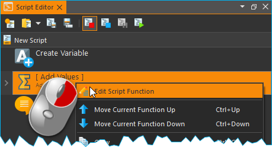

.. admonition:: Wichtig
   :class: note

   Wenn Sie eine Skriptfunktion zur Bearbeitung öffnen, wird das aktuell geöffnete 
   Skript im Skript-Editor durch das zu bearbeitende Skript ersetzt.

Skript-Benutzerbibliothek
--------------------------

Der `Script Pool`_ enthält eine anfänglich leere Kategorie *User Library* (Benutzerbibliothek). 
Diese Kategorie ermöglicht eine projektspezifische Gruppierung von benutzerdefinierten 
Skriptfunktionen in einer Art Benutzerbibliothek. Dies ermöglicht einen schnellen 
Zugriff auf häufig verwendete Funktionen und das schnelle Hinzufügen von 
benutzerspezifischen Funktionen in den Skript-Editor per Drag & Drop.

.. image:: Pictures/user_library.png

Die Kategorie *User Library* zeigt den Inhalt des Ordners :file:`UserLibrary` 
innerhalb des aktuellen Projektordners :file:`Scripts`. Zum Durchsuchen des 
Inhalts dieses Ordners im Dateiexplorer zu durchsuchen, klicken Sie einfach mit 
der rechten Maustaste in die Kategorie *User Library* und 
wählen Sie den Menüpunkt :menuselection:`Browse User Library Folder`.

.. image:: Pictures/browse_user_library_folder.png

Um Funktionen zur Kategorie *User Library* hinzuzufügen, 
müssen Sie sie einfach im Ordner :file:`UserLibrary` oder einem beliebigen 
Unterordner innerhalb des Ordners :file:`UserLibrary` speichern oder Sie 
verwenden Ihren Datei-Explorer, um die Funktionen in den Ordner :file:`UserLibrary` 
zu kopieren. Wenn Sie neue Funktionen zur *User Library* hinzugefügt haben, müssen 
Sie die Benutzerbibliothek aktualisieren. Klicken Sie dazu mit der rechten 
Maustaste in die Kategorie *User Library* und wählen Sie den Menüpunkt 
:menuselection:`Refresh User Library`.

.. admonition:: Wichtig
   :class: note

   Um neu hinzugefügte Funktionen in der *User Library* anzuzeigen, müssen Sie 
   die die Bibliothek über den Kontextmenüpunkt :menuselection:`Refresh User Library` 
   aktualisieren.

Die Kategorie *User Library* berücksichtigt auch Unterverzeichnisse im Ordner 
:file:`UserLibrary`. Das heißt, Unterverzeichnisse werden als Ordner in der 
Kategorie *User Library* angezeigt.

.. image:: Pictures/user_library_folders.png

Standardmäßig wird jeder Ordner mit einem Ordnersymbol :guinum:`❶` angezeigt, 
aber Sie können für jeden Ordner ein eigenes Symbol erstellen. Kopieren Sie einfach 
ein :file:`SVG`-Symbol mit demselben Namen in einen Ordner, um es als Ordnersymbol 
festzulegen. Im obigen Beispiel enthält die *User Library* den Ordner 
:file:`Robot Functions`. Dieser Ordner enthält die Datei 
:file:`Robot Functions.svg`. Wenn die Software ein SVG-Symbol in einem Ordner 
mit demselben Namen wie der Ordner erkennt, wird es als Ordnersymbol :guinum:`❷` 
im Script Pool festgelegt.

Um eine Benutzerfunktion aus der *User Library* zur Bearbeitung im `Script Editor`_
zu öffnen, klicken Sie mit der rechten Maustaste auf die Funktion und wählen den 
Kontextmenüpunkt :menuselection:`Edit Selected Function`.

.. image:: Pictures/script_pool_edit_function.png

Script Autostart
----------------

Das Script-System kann so konfiguriert werden, dass nach dem
erfolgreichen Verbinden zur Gerätehardware automatisch ein Script
geladen und gestartet wird. Den Dialog mit den entsprechenden
Einstellungen öffnen Sie über den Menüpunkt :menuselection:`Edit → Settings` im
Hauptmenü der Anwendung.

.. image:: Pictures/100002010000022600000126F6C3DD9DEA793D3B.png

Im Settings-Dialog der
Anwendung können Sie nun den Script-Autostart konfigurieren. Wählen Sie
dafür zuerst die Settings Kategorie *Scripting* :guinum:`❶` aus. Nun können Sie
im rechten Bereich den Script-Autostart aktivieren :guinum:`❷`. Über das
Eingabefeld :guilabel:`Autostart Scriptfile` :guinum:`❸` können Sie das Scriptfile
auswählen, welches geladen und ausgeführt werden soll. Ist dieses Feld
leer, wird das Script ausgeführt, welches beim Start der Anwendung
geladen wird, d.h. das Script, welches beim letzten Schließen der
Anwendung im Scripteditor geöffnet war. Schließen Sie die Konfiguration
durch Klicken auf :guilabel:`OK` :guinum:`❹` ab.

Wenn Sie möchten, dass nach dem Hochfahren Ihres Rechners
vollautomatisch die Software gestartet und ein Script ausgeführt wird,
dann gehen Sie wie folgt vor:

.. rst-class:: steps

1. Tragen Sie **QmixElements.exe** in den *Windows Autostart* ein, um die
   Software nach dem Hochfahren des Rechners automatisch zu starten.
2. Öffnen Sie den Dialog mit den globalen Einstellungen über das
   Hauptmenü der Anwendung (:menuselection:`Edit → Settings`).
3. Wählen Sie die Einstellungskategorie *General* und aktivieren Sie die
   Option :menuselection:`Auto connect`. Das bewirkt, dass sich die Software
   nach dem Start automatisch zu den angeschlossenen Geräten verbindet.
4. Wählen Sie dann die Einstellungskategorie Scripting um den Script
   Autostart zu konfigurieren.

Script Fehlerbehandlung
-----------------------

Ganz gleich, wie gut wir programmieren, manchmal sind unsere Skripte fehlerhaft.
Sie können durch unsere Fehler, eine unerwartete Benutzereingabe, wenn Parameter 
außerhalb des Wertebereichs liegen, durch Fehler bei der Kommunikation mit Geräten
oder aus tausend anderen Gründen auftreten.

Tritt im Script ein Fehler auf, sieht die Standard-Reaktion wie folgt aus. 

- die Scriptausführung wird unterbrochen :guinum:`❶` 
- das Script stoppt an der Funktion, die den Fehler verursacht hat :guinum:`❷`
- im *Event Log* wird eine Fehlermeldung ausgegeben und die Warnung, dass die
  Scriptausführung unterbrochen wurde :guinum:`❸`
- da das Script unterbrochen ist, werden auch parallele Sequenzen nicht weiter ausgeführt
- das Script lässt sich nur noch durch Anklicken der Start-Schaltfläche fortführen :guinum:`❹`

.. image:: Pictures/default_error_handling.png

Dies Art der Fehlerbehandlung kann z.B. bei der automatischen Steuerung über die I/Os
einer SPS oder auch aus den Anforderungen eines Prozesses heraus nicht erwünscht
sein - z.B. wenn parallele Sequenzen weiterlaufen sollen, eine SPS die
Möglichkeit haben soll auf Fehler zu reagieren oder Fehler zurückzusetzen oder
wenn ein manuelles Eingreifen durch den Anwender nicht möglich ist.

.. image:: Pictures/try_except.svg
   :width: 60
   :align: left

Dafür gibt es die :ref:`Try...Catch<try_catch>` Funktion, mit der wir Fehler 
"abfangen" können, so dass das Skript, statt zu stoppen, etwas Sinnvolleres tun
kann wie z.B. den Fehler zu behandeln. Wird ein Fehler in einem
:ref:`Try...Catch<try_catch>` Block gefangen, so ist nur die Funktionssequenz betroffen, 
in der der Fehler aufgetreten ist - das Script läuft weiter und parallele Sequenzen 
werden weiterhin ausgeführt.

Alle Details zur Fehlerbehandlung mittels Try...Catch finden Sie in der
:ref:`Dokumentation zum Try...Catch<try_catch>` Block.

Scripte Debuggen
-----------------------

Wenn Sie ein Scriptprogramm entwickeln, gibt es verschiedene Möglichkeiten, 
Fehler zu suchen und zu debuggen. In den folgenden Abschnitten stellen wir
einige Features vor, die Ihnen beim Debuggen von Scripten helfen.

Einzelschrittbetrieb
~~~~~~~~~~~~~~~~~~~~~~~~~~

Mit dem Einzelschrittbetrieb haben Sie mehr Kontrolle über die einzelnen 
Aktionen ihres Scripts. Ist der Einzelschrittbetrieb aktiv wird die 
Scriptausführung nach der Ausführung jeder Scriptfunktion unterbrochen. 
Um den Einzelschrittbetrieb zu verwenden, gehen Sie wie folgt vor:

.. rst-class:: steps
.. rst-class:: inlineimg

#. |stepping| Aktivieren Sie den Einzelschrittbetrieb durch Drücken der 
   *Enable / Disable Single Stepping* Schaltfläche

   .. image:: Pictures/single_stepping_buttons.png

#. |execstep| Verwenden Sie die *Execute Single Step* Schaltfläche um die Ausführung 
   des nächsten Schrittes zu triggern. Drücken Sie dieses Schaltfläche so oft
   Sie weitere Einzelschritte ausführen wollen.
#. |stepping| Deaktivieren Sie den Einzelschrittbetrieb durch erneutes Drücken 
   der *Enable / Disable Single Stepping* Schaltfläche
#. |runscript| Setzen Sie die normale Scriptausführung durch Drücken der
   *Run Script* Schaltfläche fort.

.. rst-class:: inlineimg

So können Sie Schritt für Schritt durch Ihre Programm gehen und den Ablauf in
Ruhe beobachten. Sie können den Einzelschrittbetrieb jederzeit aktivieren oder
deaktivieren - auch während ihr Programm bereits läuft.

Haltepunkte einfügen
~~~~~~~~~~~~~~~~~~~~~~~~~~

.. image:: Pictures/interrupt_script.svg
   :width: 60
   :align: left

Sie können Ihr Script an bestimmten Stellen unterbrechen, indem Sie eine
:ref:`Interrupt Script <script_unterbrechen>` Funktion einfügen. So können Sie 
gezielt an bestimmten Punkten den Programmablauf unterbrechen, um den Zustand 
von Variablen zu untersuchen. Wenn sie die Haltefunktion in eine 
:ref:`Conditional Sequenz <bedingte_sequenz>` einfügen, können Sie das Programm 
unterbrechen, wenn bestimmte Ereignisse eintreten oder Variablen bestimmte 
Werte haben.

Im folgenden Beispiel wird der Programmablauf unterbrochen, wenn der Wert der
Variable :code:`EmployeeName` den Wert :code:`John` hat.

.. image:: Pictures/conditional_interrupt.png

Debugnachrichten ausgeben
~~~~~~~~~~~~~~~~~~~~~~~~~~

Durch den Einzelschrittbetrieb oder das Einfügen von Haltepunkten wird das
Laufzeitverhalten des Programms verändert. D.h. der Ablauf wird verlangsamt oder
unterbrochen. Das Ausgeben von Debugnachrichten ist eine Möglichkeit, den
Programmablauf, den Wert von Variablen oder den Wert von Geräteeigenschaften
durch die Ausgabe von Nachrichten im Event-Log zu visualisieren, ohne das
Laufzeitverhalten stark zu verändern.

Um eine Debugnachricht auszugeben, müssen Sie lediglich eine 
:ref:`Show Message <nachricht_anzeigen>`
Funktion an der Stelle im Programm einfügen, an der Sie eine Nachricht
in das Event-Log schreiben möchten. Dafür sollte in der Show Message Funktion
die Anzeige der Message Box und die Unterbrechung des Programms deaktiviert
sein.

In der folgenden Abbildung wird z.B. der Wert der Variablen :code:`$Flow` in jedem
Schleifendurchlauf im Event-Log ausgegeben:

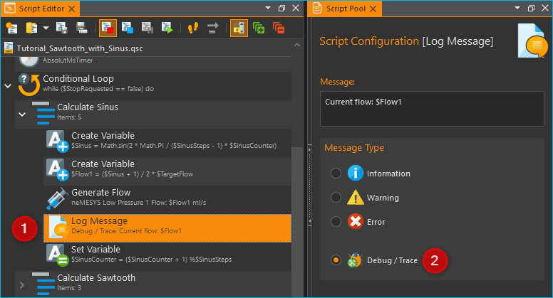

Im Event-Log wird dann jede aufgezeichnete Nachricht mit einem Zeitstempel
angezeigt. Dadurch können Sie die ausgegebenen Werte im zeitlichen Kontext
analysieren:

.. image:: Pictures/debug_event_log.png

Funktionen deaktivieren
~~~~~~~~~~~~~~~~~~~~~~~~~~~

Um bestimmte Programmabschnitte isoliert zu testen, um die Ausführung von
Funktionen während des Debuggings zu blockieren oder um alternative 
Implementierungen zu testen, kann es erforderlich sein, Funktionen zeitweise
zu deaktivieren. Deaktivierte Funktionen werden bei der Programmausführung 
übersprungen. Dies entspricht der Funktionalität des Auskommentierens von 
Quelltext in textbasierten Programmiersprachen.

Details zum Deaktivieren von Funktionen finden Sie im Abschnitt 
:ref:`Funktionen aktivieren / deaktivieren <funktionen-deaktivieren>`.

.. |image17| image:: ./Pictures/100018A30000387200003872627AA1597179191F.svg
   :width: 40
.. |image18| image:: ./Pictures/10000F850000350500003505755524BB44FF2E56.svg
   :width: 40

.. |image20| image:: ./Pictures/1000173B0000387200003872AFCF364C5ED9850F.svg
   :width: 40
.. |image21| image:: ./Pictures/10000C2E000034EB000034EB0815ABACAEE84EE0.svg
   :width: 40

.. |image23| image:: ./Pictures/10000E11000034EB000034EB5683B6AF8D85CDA6.svg
   :width: 40
.. |runscript| image:: ./Pictures/10000C80000038720000387227CC20DA34BFD4F5.svg
   :width: 40

.. |image52| image:: ./Pictures/1000097D000035050000350538CD8A3BED7FE2BC.svg
   :width: 40

.. |image54| image:: ./Pictures/1000089D000034EB000034EB2EF1F414485F4814.svg
   :width: 40
.. |image55| image:: ./Pictures/100006280000350500003505598C9D0C09166EE0.svg
   :width: 40
.. |image56| image:: ./Pictures/1000029600003505000035058E70718A79A91FE8.svg
   :width: 40
.. |image57| image:: ./Pictures/100007F200003505000035055B70923F64560DD7.svg
   :width: 40
.. |image58| image:: ./Pictures/10000944000038720000387225245FA0499799FC.svg
   :width: 40
.. |image59| image:: ./Pictures/10000C4D000034EB000034EBC98F4DA231899D2F.svg
   :width: 40
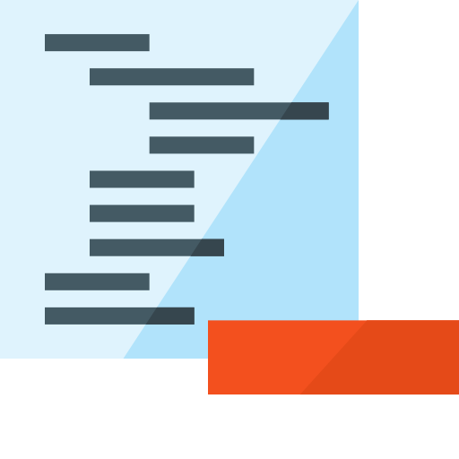

.. |image62| image:: ./Pictures/10000B39000034EB000034EB3EB900673AC29BB5.svg
   :width: 40

.. |image67| image:: Pictures/100002010000012C0000009A8EA2B85DC0AE3CC8.png
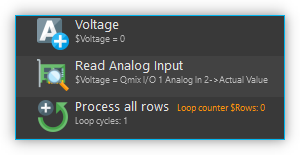

.. |expand| image:: Pictures/expand-all2.svg
   :width: 40

.. |collapse| image:: Pictures/collapse-all2.svg
   :width: 40

.. |duplica| image:: Pictures/duplicate.svg
   :width: 40

.. |editfun| image:: Pictures/edit_function.svg
   :width: 40

.. |folder| image:: Pictures/folder.svg
   :width: 40   

.. |stepping| image:: Pictures/step.svg
   :width: 40

.. |execstep| image:: Pictures/single_step2.svg
   :width: 40

