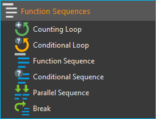
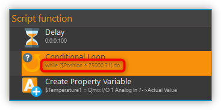
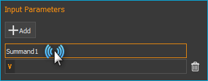

Script Grundfunktionen
=======================
Das *Script-System* enthält bereits eine Reihe von Grundfunktionen oder
Basis- Funktionen zur Programmablaufsteuerung. Diese Funktionen sind
unabhängig von den vorhandenen Plugins immer verfügbar. Diese Funktionen
finden Sie in den Kategorien :guilabel:`Core Functions` , :guilabel:`Function Sequences`, 
und :guilabel:`Time Functions`.

Kernfunktionen – *Core Functions*
----------------------------------

Übersicht Kernfunktionen
~~~~~~~~~~~~~~~~~~~~~~~~~~~

Die Funktionskategorie *Core Functions* enthält grundlegende Funktionen
zur Programmablaufsteuerung und zur Verwendung von Variablen.

.. image:: Pictures/100002010000016C000000F4AB94CEE86128C9B1.png
   :alt: Übersicht Kern Funktionen (Core Functions)

Script unterbrechen – *Interrupt Script*
~~~~~~~~~~~~~~~~~~~~~~~~~~~~~~~~~~~~~~~~~~

Mit dieser Funktion können Sie die Skriptausführung
unterbrechen. Der Anwender kann das Script dann später jederzeit fortsetzen.

.. _nachricht_anzeigen:

|

Nachricht anzeigen – *Show Message*
~~~~~~~~~~~~~~~~~~~~~~~~~~~~~~~~~~~

Mit dieser Funktion können Sie dem Anwender aus einem Skript
heraus eine Nachricht anzeigen und optional die Skriptausführung
unterbrechen. Damit ist diese Funktion für Anwendungen geeignet, die ein
Eingreifen des Anwenders zu bestimmten Zeitpunkten während der
Ausführung eines Skriptes erforderlich machen.

Beim Ausführen kann die Nachricht sowohl in einem *Nachrichtenfenster*,
…

… als auch in der *Ereignisanzeige* der Software angezeigt werden:

.. image:: Pictures/10000201000002B30000009CE9126D1E71812C4B.png
   :alt: Ereignisanzeige

In der *Ereignisanzeige* werden alle
Nachrichten in chronologischer Reihenfolge aufgelistet. In der
optionalen Message Box wird stets die letzte Nachricht angezeigt.

Show Message Konfiguration
^^^^^^^^^^^^^^^^^^^^^^^^^^^^^

Bei der Konfiguration der Nachrichtenfunktion, können Sie folgende
Punkte konfigurieren:

.. rst-class:: guinums

1. Geben Sie im Bereich :guilabel:`Message` den Nachrichtentext ein.
2. Im Bereich :guilabel:`Message Type` können Sie Art der Nachricht auswählen.
   Je nach Typ, wird im Nachrichtenfenster und in der Ereignisanzeige
   ein entsprechendes Symbol eingeblendet und in der Ereignisanzeige die
   Nachricht farblich hervorgehoben.
3. Im Bereich *Output* stellen Sie ein, ob die Nachricht in einem
   eigenen Meldungsfenster angezeigt werden soll (:guilabel:`Show Message Box`)
   und ob die Nachricht in der *Ereignisanzeige* erscheinen soll (:guilabel:`Write to Event Log`).
4. Wählen Sie aus, ob die Nachricht die Skriptausführung unterbrechen
   soll. Ist in dem Feld :guilabel:`Interrupt script execution` ein Häkchen,
   so wird die komplette Scriptausführung unterbrochen, bis die
   Programmausführung vom Anwender fortgesetzt wird. Wenn Sie ein
   Meldungsfenster mit :guilabel:`Show Message Box` einblenden, sollten Sie diese
   Option nicht auswählen und stattdessen auf Option :guinum:`❺` zurückgreifen.
5. Hier können Sie auswählen, ob die Skriptausführung nach dem
   Anklicken von :guilabel:`OK` im Meldungsfenster fortgesetzt wird.

Je nach ausgewählten Optionen verhält sich diese Funktion wie folgt:

.. list-table::
   :widths: 10, 10, 10, 10, 60

   *  - Show Message Box
      - Write to Event Log
      - Inter-rupt Script Exe-cution
      - Continue Script if User Clicks OK
      - Result
   *  -  
      -  :fa:`check`
      -  
      -  
      -  Eine Nachricht wird in den Event Log geschrieben und dann die nächste 
         Funktion ausgeführt. 
   *  -  
      -  :fa:`check`
      -  :fa:`check`
      -  
      -  Eine Nachricht wird in den Event Log geschrieben und die Scriptausführung 
         wird unterbrochen. Die Ausführung kann durch Anklicken der :guilabel:`Run Script`
         -Schaltfläche fortgesetzt werden.  
   *  -  :fa:`check`
      -  :fa:`check`
      -  
      -  
      -  Eine Nachricht wird in den Event Log geschrieben, ein Meldungsfenster wird        
         angezeigt und dann die nächste Funktion ausgeführt. 
   *  -  :fa:`check`
      -  
      -  
      -  :fa:`check`
      -  Ein Meldungsfenster wird angezeigt. Sobald der Anwender auf OK klickt,     
         wird die nächste Scriptfunktion ausgeführt.    
   *  -  :fa:`check`
      -  :fa:`check`
      -  
      -  
      -  Ein Meldungsfenster wird angezeigt und die Scriptausführung wird unterbrochen. 
         Die Ausführung kann durch Anklicken der :guilabel:`Run Script`-Schaltfläche 
         fortgesetzt werden.     

Variablen-Inhalt oder Prozessdaten anzeigen
^^^^^^^^^^^^^^^^^^^^^^^^^^^^^^^^^^^^^^^^^^^^^

Im :guilabel:`Message`-Feld der Funktion können Sie auch Variablen
oder :ref:`Prozessdatenbezeichner<Device Properties (Prozessdaten)>` verwenden.
Diese dienen als Platzhalter und werden zur Laufzeit des Scriptes durch
den Inhalt der Variablen oder die Prozessdaten eines Gerätes ersetzt.
Sobald Sie im Text ein Dollarzeichen ($) eingeben, wird Ihnen eine Liste
der verfügbaren Variablen eingeblendet, aus der Sie eine Variable
auswählen können (siehe Abbildung unten).

.. image:: Pictures/10000201000001DB000000D68C630A99C4BAD6D1.png
   :alt: Verwendung von Variablen in Show Message

Sie können z.B. in das :guilabel:`Message`-Feld folgenden Text eingeben:

.. centered::
   *Der Inhalt der Variablen A ist $A.*

Wenn die Variable :code:`$A` zur Laufzeit den Wert 25,3 enthält, dann wird die
Funktion folgende Nachricht ausgeben:

.. centered::
   *Der Inhalt der Variablen A ist 25,3.*

.. admonition:: Tipp
   :class: tip

   Sie können den Inhalt von Variablen mit Hilfe  
   der Show Message Funktion anzeigen lassen, um so z.B.    
   die Ergebnisse von Berechnungen zu überprüfen.           

.. admonition:: Tipp
   :class: tip

   Klicken Sie mit der rechten Maustaste und      
   wählen Sie dann aus dem Kontextmenü den Punkt Insert     
   device property um direkt die Prozessdaten von Geräten   
   auszugeben.    

.. _variable_erzeugen:

Variable erzeugen – *Create Variable*
~~~~~~~~~~~~~~~~~~~~~~~~~~~~~~~~~~~~~~

.. image:: Pictures/1000119100003872000038728AF29595FE1DD321.svg
   :width: 60
   :align: left

Mit dieser Funktion können Sie eine neue Variable erzeugen und
ihr einen Wert zuweisen. Im Konfigurationsbereich dieser Funktion
(Abbildung unten) können Sie folgende Parameter eingeben:

.. rst-class:: guinums

1. **Name** – geben Sie hier den eindeutigen Variablennamen ein. Details zur
   Benennung von Variablen finden Sie im Abschnitt :ref:`naming-variables`.
2. **Type** – wählen Sie hier den Typ aus, den Sie in der
   Variable speichern wollen.
3. **Value** – geben Sie hier den Wert ein oder, wenn die Variable vom
   Typ *JavascriptExpression* ist, den Ausdruck zur Berechnung der
   Variable.

.. admonition:: Tipp
   :class: tip

   Um eine falsche Benennung von Variablen zu    
   verhindern, akzeptiert das :guilabel:`Name`-Feld nur Variablennamen 
   die mit einem Dollarzeichen beginnen.   

Variablen Typen
^^^^^^^^^^^^^^^^^

Die Variablen im Script-System sind untypisiert und können
unterschiedlichste Werte aufnehmen. So kann z.B. einer Variable bei der
Erstellung ein numerischer Wert zugewiesen werden und später in die
gleiche Variable ein Text gespeichert werden. Das :guilabel:`Type Hint`-Feld im
Konfigurationsbereich ist lediglich ein Hinweis, welcher Typ
gespeichert werden soll und dient dazu, ein entsprechendes Eingabefeld
je nach Typ anzuzeigen. Alle
Typen, *Boolean* , *Number* oder *Text* lassen sich auch über
einen JavaScript Ausdruck eingeben. Die folgende Tabelle ist eine
Übersicht einer Auswahl von Daten, die in Variablen gespeichert werden
können.

.. table::
   :widths: 10, 10, 30, 40
   
   +-----------+---------------+-------------------+-------------------+
   | Type Hint | Daten / Werte | Beispiele         |                   |
   +===========+===============+===================+===================+
   | |image31| | Boolean       | Boolesche Werte   | true, false       |
   +-----------+---------------+-------------------+-------------------+
   | |image32| | Number        | Numerische Werte  | 24, 10, -13.23,   |
   |           |               |                   | -128, 0.001       |
   +-----------+---------------+-------------------+-------------------+
   | |image33| | Text          | Wörter oder Texte | Value1, Enter a   |
   |           |               |                   | value             |
   +-----------+---------------+-------------------+-------------------+
   | |image34| | JavaScript    | Geräte Handle     | $$Nemesys_M_1     |
   |           |               | (z.B. zur Übergabe| or                |
   |           |               | von Geräten an    | $$Nemesys         |
   |           |               | Funktionen)       | _M_1_ForceSensor  |
   +-----------+---------------+-------------------+-------------------+
   | |image34| | JavaScript    | Array von Zahlen  | [3, 7, 8.5, 12,   |
   |           |               |                   | 23.5]             |
   +-----------+---------------+-------------------+-------------------+
   | |image34| | JavaScript    | Array von Texten  | [User1, User2,    |
   |           |               |                   | User3, User4]     |
   +-----------+---------------+-------------------+-------------------+
   | |image34| | JavaScript    | Array von Geräte  | [$$Nemesys_M_1,   |
   |           |               | Handles           | $$Nemesys_M_2]    |
   +-----------+---------------+-------------------+-------------------+
   | |image34| | JavaScript    | Ergebnis einer    | 25 +              |
   |           |               | Berechnung        | $TargetPositionX  |
   +-----------+---------------+-------------------+-------------------+
   | |image34| | JavaScript    | Gelesene Geräte-  | $$Nemesy          |
   |           |               | eigenschaften /   | s_M_1.DosedVolume |
   |           |               | Prozessdaten      |                   |
   +-----------+---------------+-------------------+-------------------+

Berechnung von Werten
^^^^^^^^^^^^^^^^^^^^^^^

Wenn Sie für eine Variable den Typ *JavaScript Expression* wählen,
können Sie im Feld :guilabel:`Value` einen Ausdruck eingeben, der dann zur
Laufzeit berechnet wird. In diesem Ausdruck können Sie auch auf andere
Variablen zugreifen und deren Werte in die Berechnung einbinden.\ Der
Zugriff auf Scriptvariablen ist über den Variablennamen, der mit einem
Dollarzeichen beginnt möglich.

.. image:: Pictures/10000201000001F4000000F212FF4BFC515C9AB5.png
   :alt: Eingabe von Berechnungen

.. admonition:: Tipp
   :class: tip

   Bei der Eingabe von Berechnungen mit          
   Variablen unterstützt Sie die Autovervollständigung bei 
   der Auswahl von Variablen, die bereits erstellt wurden. 

Sie können in einen JavasScript Ausdruck auch direkt die Eigenschaften /
Prozessdaten eines Gerätes lesen und in eine Berechnung einbinden. Im
folgenden Beispiel wird der Variable :code:`$Flow` :guinum:`❶` berechnet als ein
zwanzigstel der Geräteeigenschaft :code:`$$Nemesys_M_1.MaxFlow` :guinum:`❷`.
Geräteeigenschaften (Device Properties) können sie einfach über das
Kontextmenü (*Insert device property*) :guinum:`❸` hinzufügen.

.. image:: Pictures/10000201000001E7000000D09DED5F410BD67FC9.png

.. admonition:: Tipp
   :class: tip

   Klicken Sie mit der rechten Maustaste in das  
   Eingabefeld und wählen Sie dann aus dem Kontextmenü den 
   Punkt *Insert device property* um in der Berechnung       
   direkt auf die Prozessdaten von Geräten zuzugreifen.   

Über das Kontextmenü können Sie auch Gerätereferenzen (Device
References) in den JavaScript Code einfügen. Damit ist es möglich,
Gerätereferenzen (z.B. :code:`$$Nemesys_M_1`) oder Arrays mit
Gerätereferenzen (z.B. :code:`[$$Nemesys_M_1, $$Nemesys_M_2, $$Nemesys_M_3]`) 
in Variablen speichern. Im folgenden Beispiel wird
eine Referenz des Drucksensors :code:`$$QmixP1_Pressure1`  in der
Variable :code:`$PressureSensor` gespeichert.

Die Bezeichner für Gerätereferenzen beginnen wie 
:ref:`Device Properties <device properties (prozessdaten)>` 
mit zwei Dollarzeichen, bestehen aber nur aus dem
Gerätenamen ohne zusätzliche Geräteeigenschaft.

Operatoren
^^^^^^^^^^^^

Folgende Operatoren stehen für Berechnungen zur Verfügung:

+-------------------------------------------+--------------------+
| Arithmetische Operatoren                  | Beispiel           |
+====+======================================+====================+
| \+ | Addiert zwei Werte                   | :code:`$a + $b`    |
+----+--------------------------------------+--------------------+
| \- | Subtrahiert einen Wert von einem     | :code:`$a - 1`     |
|    | anderen                              |                    |
+----+--------------------------------------+--------------------+
| \* | Multipliziert zwei Werte             | :code:`5 * $b`     |
+----+--------------------------------------+--------------------+
| /  | Dividiert zwei Werte                 | :code:`$a / 10`    |
+----+--------------------------------------+--------------------+
| %  | Dividiert zwei Werte und gibt den    | :code:`$a % 5`     |
|    | Rest zurück                          |                    |
+----+--------------------------------------+--------------------+

+-------------------------------------------+------------------------+
| Logische Operatoren                       | Beispiel               |
+=====+=====================================+========================+
| \=\=| Prüft, ob die Werte gleich sind     | :code:`1 == 2`         |
+-----+-------------------------------------+------------------------+
| !=  | Prüft, ob die Werte ungleich sind   | :code:`5 != 6`         |
+-----+-------------------------------------+------------------------+
| >   | Prüft, ob der erste Wert größer ist | :code:`7 > 2`          |
|     | als der zweite.                     |                        |
+-----+-------------------------------------+------------------------+
| <   | Prüft, ob der erste Wert kleiner ist| :code:`3 < $a`         |
|     | als der zweite.                     |                        |
+-----+-------------------------------------+------------------------+
| ≥   | Prüft, ob der erste Wert größer oder| :code:`$b ≥ 3`         |
|     | gleich dem zweiten ist.             |                        |
+-----+-------------------------------------+------------------------+
| ≤   | Prüft, ob der erste Wert kleiner    | :code:`$a ≤ $b`        |
|     | oder gleich dem zweiten ist         |                        |
+-----+-------------------------------------+------------------------+
| &&  | Verknüpft zwei Aussagen durch       | :code:`true && false`  |
|     | logisches AND (und)                 |                        |
+-----+-------------------------------------+------------------------+
| \|\|| Verknüpft zwei Werte durch logisches| :code:`$a || (b < 5)`  |
|     | OR (oder)                           |                        |
+-----+-------------------------------------+------------------------+
| !   | Verknüpft einen Wert mit logischem  | :code:`!true == false` |
|     | NOT (nicht)                         |                        |
+-----+-------------------------------------+------------------------+

+-------------------------------------------+--------------------+
| Text Operatoren                           | Beispiel           |
+====+======================================+====================+
| \+ | Fügt zwei Texte zusammen             | :code:`text + $a`  |
+----+--------------------------------------+--------------------+

Operatorenrangfolge
^^^^^^^^^^^^^^^^^^^

Unter den Operatoren gibt es eine festgelegte Rangordnung. Wenn Sie
komplexe Rechenoperationen durchführen oder mehrere Bedingungen
miteinander verknüpfen, gilt bei der internen Auflösung solcher
komplexen Ausdrücke die folgende Rangordnung:

========== =========
Rangfolge  Operatoren
========== =========
1          \|\|
2          &&
3          == !=
4          < ≤ > ≥
5          \+ \-
6          \\ / %
7          !
8          ()
========== =========

Mit Hilfe von Klammern, die absichtlich die unterste Rangstufe in der
Prioritätshierarchie darstellen, können Sie die Rangfolge bei den
Operatoren beeinflussen und Ausdrücke so bewerten, wie Sie es wünschen.

Beispiele
^^^^^^^^^

Nachfolgend finden Sie einige Beispiele zur Berechnung von Variablen und
für unterschiedliche JavaScript Ausdrücke:

Beispiel 1
''''''''''

Sie möchten die Werte zweier Variablen *a* und *b* miteinander
addieren und das Ergebnis in einer dritten Variable *c* speichern:

=========== =========
Name:       *$c*
JavaScript: :code:`$a + $b`
=========== =========

Beispiel 2
''''''''''

Sie möchten eine Variable *Speed* mit 5 multiplizieren und den Wert
in der gleichen Variable wieder speichern:

=========== =============
Name:       *$Speed*
JavaScript: :code:`$Speed * 5`
=========== =============

Beispiel 3
''''''''''

Sie möchten die beiden booleschen Variablen *SwitchedOn* und 
*CheckOk* miteinander durch UND Verknüpfen und in der Variable
*TurnOn* speichern:

=========== =========================
Name:       *$TurnOn*
JavaScript: :code:`$SwitchedOn && $CheckOk`
=========== =========================

Beispiel 4
''''''''''

Sie möchten der Variablen *$Flow* die aktuelle Flussrate der Pumpe
*Nemesys_M_1* zuweisen.

=========== ==========================
Name:       *$Flow*
JavaScript: :code:`$$Nemesys_M_1.ActualFlow`
=========== ==========================

Beispiel 5
''''''''''

Sie möchten ein Array erstellen mit 4 Flussraten und dieses der
Variablen *$TargetFlows* zuweisen.

=========== =========================
Name:       *$TargetFlows*
JavaScript: :code:`[0.12, 0.05, 0.2, 0.21]`
=========== =========================

Beispiel 6
''''''''''

Die Variable *$TargetFlows* enthält ein Array mit 4 numerischen Werten.
Sie möchten den dritten Wert im Array der Variable
*$NextFlow* zuweisen. Der Index für den Array Zugriff wird von 0
beginnend nummeriert. D.h. zum Zugriff auf das dritte Element ist der
Index 2.

=========== =================
Name:       *$NextFlow*
JavaScript: :code:`$TargetFlows[2]`
=========== =================

Beispiel 7
''''''''''

Sie möchten in der Variable *$Pressures* ein Array mit den beiden
aktuellen Werten der Drucksensoren *QmixP_1_Pressure1* und
*QmixP_1_Pressure2* speichern.

=========== ====================================================================
Name:       *$Pressures*
JavaScript: :code:`[$$QmixP_1_Pressure1.ActualValue, $$QmixP_1_Pressure2.ActualValue]`
=========== ====================================================================

Beispiel 8
''''''''''

Sie möchten in der Variable *$ProcessPump* eine Gerätereferenz (Device
Reference) der *Nemesys_M_1* Pumpe speichern um diesen später an eine
Funktion übergeben zu können.

=========== ===============
Name:       *$ProcessPump*
JavaScript: :code:`$$Nemesys_M_1`
=========== ===============

.. _wert_variable_setzen:

Wert einer Variable setzen – *Set Variable*
~~~~~~~~~~~~~~~~~~~~~~~~~~~~~~~~~~~~~~~~~~~~

.. image:: Pictures/1000132400003872000038722A8DDCED1A890F1C.svg
   :width: 60
   :align: left

Mit dieser Funktion können Sie einer bereits vorhandenen
Variable einen neuen Wert zuweisen. Die Konfiguration der Variablen
entspricht der Funktion :ref:`Variable erzeugen <variable_erzeugen>`.

.. figure:: Pictures/10000201000001AB00000115B0297DFCE8D1556F.png
   :alt: Eingabe Variablenname mit Autovervollständigung

.. admonition:: Tipp
   :class: tip

   Bei der Eingabe des Namens unterstützt Sie    
   die Autovervollständigung mit einer Auswahl von         
   Variablen die bereits erstellt wurden. 

.. _eigenschaftsvariable_erzeugen:

Eigenschaftsvariable erzeugen – *Create Property Variable*
~~~~~~~~~~~~~~~~~~~~~~~~~~~~~~~~~~~~~~~~~~~~~~~~~~~~~~~~~~~

.. image:: Pictures/10001162000038720000387269894D0D5041B1EE.svg
   :width: 60
   :align: left

Mit dieser Funktion erzeugen Sie eine spezielle Variable, die
mit einer bestimmten Eigenschaft eines Gerätes verbunden wird. Über
diese Variable haben Sie im Script direkten Zugriff auf die verbundene
Geräteeigenschaft und können diese ohne zusätzliche Funktionsaufrufe
auslesen.

Wenn Sie z.B. einen analogen Eingangswert einlesen möchten und mit
normalen Variablen arbeiten, müssen Sie zuerst eine Variable mit der
Funktion :ref:`Variable erzeugen <variable_erzeugen>` erzeugen und dann mit der 
Funktion :ref:`Prozessdaten lesen <prozessdaten_lesen>` den
analogen Eingangswert in die Variable einlesen. Erst danach können Sie
die Variable für weitere Berechnungen und Prüfungen verwenden. Wann
immer Sie einen neuen analogen Eingangswert benötigen, müssen Sie die
Funktion :ref:`Prozessdaten lesen <prozessdaten_lesen>` erneut aufrufen.

.. image:: Pictures/10000201000001F7000001347DCF10AF4AE123D0.png
   :alt: Konfiguration Eigenschaftsvariable anlegen

Mit Eigenschaftsvariablen wird dieser Zugriff auf Geräteeigenschaften
(z.B. Eingangswert eines analogen Einganges) erheblich vereinfacht. Wenn
Sie die Variable anlegen, verbinden Sie im Konfigurationsdialog
dauerhaft eine Geräteeigenschaft mit der Variable. Wann immer Sie nun in
Scriptfunktionen auf den Wert dieser Variable lesend zugreifen, wird
automatisch der aktuelle Wert der verbundenen Geräteeigenschaft
ausgelesen.

Den Namen der Variable geben Sie im Feld :guilabel:`Variable` :guinum:`❶` ein (Abbildung
oben). Über die Auswahlbox :guilabel:`Device` :guinum:`❸` wählen Sie das Gerät aus, von
welchem Sie die Prozessdaten lesen möchten. In der Auswahlliste werden
alle Geräte der aktuellen Konfiguration angezeigt. Um die Suche nach
einem Gerät zu vereinfachen, können Sie die Geräteliste filtern. Wählen
Sie dafür im Auswahlfeld :guilabel:`Filter` :guinum:`❷` einfach den Gerätetyp aus, nach
dem Sie filtern möchten.

Wenn Sie
das Gerät gewählt haben, können Sie dann im Auswahlfeld :guilabel:`Property` :guinum:`❹` die
Geräteeigenschaft (den Prozessdateneintrag) wählen, den Sie auslesen
möchten.

D.h., zusammenfassend lässt sich diese Funktion wie folgt beschreiben:

.. centered:: 
   "Verbinde die Geräteeigenschaft :guinum:`❹` des Gerätes :guinum:`❸` mit der Variablen
   :guinum:`❶` und gebe den Wert der Geräteeigenschaft zurück, wenn ein Lesezugriff
   auf die Variable erfolgt."

.. admonition:: Wichtig
   :class: note

   Eigenschaftsvariablen können nicht zum     
   Speichern von Werten bei Berechnungen verwendet werden. 
   Verwenden Sie dafür normale Variablen.   

Variablendeklarationen gruppieren – *Variable Declaration Sequence*
~~~~~~~~~~~~~~~~~~~~~~~~~~~~~~~~~~~~~~~~~~~~~~~~~~~~~~~~~~~~~~~~~~~

.. image:: Pictures/100015BD00003872000038722A0A6332DCBD75A0.svg
   :width: 60
   :align: left 

Mit der Variable Declaration Sequence können Sie Variablen,
die Sie mit :ref:`Variable erzeugen <variable_erzeugen>` oder :ref:`Eigenschaftsvariable erzeugen <eigenschaftsvariable_erzeugen>`
deklarieren zusammenfassen. Damit können Sie die Übersichtlichkeit Ihres
Scriptes erhöhen. Statt vieler einzelner Variablen ist nur noch die
Variablendeklarationssequenz sichtbar und erst beim Aufklappen dieser
Sequenz, sehen Sie die deklarierten Variablen.

Alle Variablen sind auf der Ebene sichtbar, in der sich die
Deklarationssequenz befindet. D.h. die Variablen innerhalb der Sequenz
werden so deklariert, als würden Sie sich auf der Ebene der
Deklarationssequenz befinden.

.. image:: Pictures/100002010000019E000000C0724835B0FD04E921.png 
   :alt: Beispielsequenz mit Variablen

Mit der Sequenz
können Sie auch Variablen die logisch zusammengehören gruppieren und es
so für den Anwender einfacher machen, bestimmte Variablen zu finden.

Benutzereingabe – *User Input*
~~~~~~~~~~~~~~~~~~~~~~~~~~~~~~

Diese Funktion ermöglicht das Einlesen eines einzelnen
Eingabewertes (Zahl oder Text) in eine bestehende Variable. Im
Konfigurationsbereich (siehe Abbildung unten) können Sie folgende
Parameter konfigurieren:

.. image:: Pictures/10000201000001B5000001065756B50B196B91FF.png
   :alt: Konfiguration User Input Funktion

.. rst-class:: guinums

1. **Label Text** – Hier geben Sie einen Text an, der dem Anwender bei der 
   Ausführung der Funktion über dem Eingabefeld als Beschriftung und erklärender 
   Text angezeigt wird.
2. **Variable** – In diesem Feld legen Sie die Variable fest, die den vom
   Anwender eingegebenen Wert speichern soll.
3. **Type** – Den Eingabetyp, Zahl oder Text, legen Sie hier fest. Je
   nach gewähltem Wert, akzeptiert der Eingabedialog nur bestimmte
   Werte.
4. **Test Input Dialog** – Durch Anklicken dieser Schaltfläche können Sie
   den Eingabedialog testweise anzeigen, um zu prüfen, wie der Anwender
   den Eingabedialog später bei der Ausführung des Scriptes sehen wird
   (siehe Abbildung unten).

.. image:: Pictures/10000201000000E80000009E6FFCCC92FBEB562A.png

Eigene Scriptfunktion – *Script Function Call*
~~~~~~~~~~~~~~~~~~~~~~~~~~~~~~~~~~~~~~~~~~~~~~

.. image:: Pictures/10002495000034EB000034EB5801BA1011E76C10.svg
   :width: 60
   :align: left

Script Function Calls ermöglichen Ihnen die Einbindung
eigener Scripte als Funktionen. D.h. so wie Sie in anderen
Programmiersprachen Funktionen als wiederverwendbare Bausteine
erstellen, können Sie auch im Scriptsystem eigene Funktionen in Form
externer Scripte aufrufen.

.. image:: Pictures/10000201000001E1000001A9C4192918D20FBB5B.png

Externe Scriptfunktionen können über 0 – 10 Eingabe Parameter (Input
Parameters) :guinum:`❶` verfügen und über 0 – 10 Rückgabewerte (Return Values)
:guinum:`❷`. Damit können Sie Werte an das Script übergeben (z.B. numerische
Werte oder Variablen) und Rückgabewerte des Scriptes lesen und in
Scriptvariablen speichern. Unter :guilabel:`Script File` :guinum:`❸` wird Ihnen der Pfad
zur externen Scriptdatei angezeigt, die beim Aufruf ausgeführt wird.

Im Abschnitt :ref:`Eigene Scriptfunktionen programmieren`
finden Sie eine ausführliche Anleitung zur Erstellung eigener
Scriptfunktionen.

Funktionssequenzen – *Function Sequences*
-----------------------------------------

Übersicht Funktionssequenzen
~~~~~~~~~~~~~~~~~~~~~~~~~~~~

Die Funktionskategorie FunctionSequences enthält
verschiedene Arten von Funktionssequenzen. Funktionssequenzen sind
Scriptfunktionen, die eine Reihe (Sequenz) von Funktionen aufnehmen
können. Wird eine Funktionssequenz ausgeführt, bedeutet das, dass alle
Scriptfunktionen die sich in dieser Sequenz befinden ausgeführt werden.

Zählschleife – *Counting Loop*
~~~~~~~~~~~~~~~~~~~~~~~~~~~~~~

.. image:: Pictures/100013490000388C0000388C4A5D96BDCF59F705.svg
   :width: 60
   :align: left

Diese Funktion ermöglicht die mehrfache Ausführung von
Funktionen innerhalb der Schleife. Die Anzahl der Wiederholungen ist
dabei über die Anzahl der Schleifenzyklen (:guilabel:`Loop Cycles`) im
Konfigurationsbereich festlegbar.

|

Die Anzahl der Schleifendurchläufe kann entweder explizit über eine
Zahl oder implizit über den Name einer Variablen definiert werden
(Abbildung unten, :guinum:`❶`), die die Anzahl der Durchläufe enthält.

.. image:: Pictures/10000201000001FA0000007BEEA293AE47742C49.png

Zusätzlich können Sie einen Namen für die Zählvariable (*Counter
Variable*) der Schleife vergeben (Abbildung oben, :guinum:`❷`). Innerhalb der
Schleife können dann Funktionen, die Variablen unterstützen, über diesen
Namen auf den aktuellen Wert der Zählvariable zugreifen und diesen,
z.B., für weitere Berechnung verwenden.

.. admonition:: Wichtig
   :class: note

   Die Zählvariable einer Zählschleife        
   beginnt stets bei dem Wert 0 zu zählen. D.h. bei einer  
   Zyklenzahl von 10 Schleifenzyklen, enthält die          
   Zählvariable in den einzelnen Durchläufen aufsteigende  
   Werte von 0 bis 9.   

.. admonition:: Wichtig
   :class: note

   Sie sollten stets eine :ref:`Verzögerungsfunktion<verzögerungsfunktion>` in 
   eine Schleife einfügen. Ansonsten kann die Ausführung   
   zu einer 100% Auslastung des Prozessors und damit zur   
   Blockierung der grafischen Oberfläche führen. Eine      
   kleine Verzögerungszeit von 10ms – 100ms sind bereits   
   ausreichend. 

Mit Hilfe der Zählvariable (:guilabel:`Counter Variable`) können Sie die Schleife auf vorzeitig beenden
(abbrechen). Wenn Sie innerhalb der Schleife mit Hilfe der Funktion 
:ref:`Wert einer Variable setzen<wert_variable_setzen>`
den Wert der Zählvariable auf einen Wert >= der Anzahl von
Schleifenzyklen setzen (:guilabel:`Loop Cycles`), wird die Schleife beim nächsten
Durchlauf beendet.

.. admonition:: Tipp
   :class: tip

   Sie können die Zählschleife vorzeitig durch das Ändern der Zählvariable beenden. 

.. _bedingte_schleife:

Bedingte Schleife – *Conditional Loop*
~~~~~~~~~~~~~~~~~~~~~~~~~~~~~~~~~~~~~~

Einführung
^^^^^^^^^^

.. image:: Pictures/100016C80000388C0000388C2CFA711217EA5B06.svg
   :width: 60
   :align: left

Diese Schleifenfunktion dient zur mehrfachen Ausführung von
Funktionen innerhalb der Schleife, solange die Bedingung im Kopf der
Schleife wahr ist. D.h. die Abbruchbedingung im Schleifenkopf wird vor
jedem Schleifendurchlauf geprüft und die Schleifenausführung wird
beendet oder übersprungen, wenn die Abbruchbedingung nicht wahr ist. 

In Textform lässt sich die Funktionsauführung wie folgt beschreiben:

.. centered:: 
   "Wiederhole die Ausführung der Funktionen innerhalb der Schleife,
   solange die Schleifenbedingung wahr ist."

Es gibt zwei Möglichkeiten, die Parameter für die Schleifenprüfung festzulegen: den einfachen Modus 
und den JavaScript-Ausdruck.   

Konfiguration – einfacher Modus
^^^^^^^^^^^^^^^^^^^^^^^^^^^^^^^

Im Konfigurationsbereich können Sie im einfachen Modus die
Schleifenbedingung bequem über die vorhandenen Bedienelemente eingeben.
Folgende Parameter können eingegeben werden:

.. image:: Pictures/10000201000001FF000001568EF29AE39EE9077E.png
   :alt: Konfiguration Conditional Loop - Einfacher Modus

.. rst-class:: guinums

#. **JavaScript Expression** – diese Schaltfläche dient zum Umschalten
   zwischen dem einfachen und dem :ref:`erweiterten Eingabemodus<erweiterter_eingabemodus>`.
#. **Name** – geben Sie hier den Namen der Variablen ein, deren
   Wert in der Bedingung verglichen oder geprüft werden soll. Die
   Variable steht auf der linken Seite der Vergleichsbedingung und muss
   mit einem Dollar-Zeichen :code:`$` (sowie :code:`$FlowRate`) beginnen.
#. **Type** – hier können Sie den Typ der Variablen wählen und
   damit die Bedienelemente im Bereich *Condition* umschalten.
#. **Comparison operator** – mit der Auswahlbox können Sie bequem den
   Vergleichsoperator auswählen.
#. **Comparison condition** – geben Sie hier einen numerischen Wert oder
   eine Variable ein, mit der die Variable aus :guinum:`❷` verglichen werden soll.

Beispielkonfiguration (einfacher Modus)
'''''''''''''''''''''''''''''''''''''''

Im folgenden Beispiel wird in der Schleifenbedingung geprüft, ob die
Variable :code:`$Position` kleiner oder gleich **25.000,31** ist.

========================= ================ ==================== =====================
Variablenname :guinum:`❷` Typ :guinum:`❸`  Operator :guinum:`❹` Bedingung :guinum:`❺`
========================= ================ ==================== =====================
*$Position*               *Number*         *≤*                  *25.000,31*
========================= ================ ==================== =====================

Im Scripteditor wird der eingegebene Ausdruck komplett angezeigt:

Dieser Ausdruck bewirkt,
dass die Schleife solange ausgeführt wird, wie der Wert der Variablen
:code:`$Position` kleiner oder gleich ist *25.000,31.*

.. _erweiterter_eingabemodus:

Konfiguration – erweiterter Modus
^^^^^^^^^^^^^^^^^^^^^^^^^^^^^^^^^

Während der einfache Modus dem Benutzer eine grafische Benutzeroberfläche bietet,
ermöglicht der JavaScript-Modus das direkte Einfügen eines JavaScript-Ausdrucks
mit Variablennamen sowie mathematischen und logischen Ausdrücken.

.. image:: Pictures/1000020100000204000000F1DD2E88C4898B65B8.png
   :alt: Konfiguration Conditional Loop - Erweiterter Modus

Im erweiterten Modus wird ein JavaScript Editor angezeigt mit
Syntaxhervorhebung und Zeilennummern. Hier können Sie die
Schleifenbedingung als JavaScript Ausdruck eingeben. D.h. Sie können,
wie in der Abbildung oben, auch komplexere Rechenoperationen in der
Prüfbedingung durchführen oder mehrere Variablen in die Prüfbedingung
einbinden. Auch JavaScript Funktionen, wie hier z.B.
:code:`Math.round()` können verwendet werden.

.. admonition:: Wichtig
   :class: note

   Sie sollten stets eine :ref:`Verzögerungsfunktion<verzögerungsfunktion>`
   in eine Schleife einfügen. Ansonsten kann die  
   Ausführung zu einer 100% Auslastung des Prozessors und  
   damit zur Blockierung der grafischen Oberfläche führen. 
   Eine kleine Verzögerungszeit von 10ms – 100ms sind      
   bereits ausreichend.  

.. _funktionssequenz:

Funktionssequenz – *Function Sequence*
~~~~~~~~~~~~~~~~~~~~~~~~~~~~~~~~~~~~~~

.. image:: Pictures/10000944000038720000387225245FA0499799FC.svg
   :width: 60
   :align: left

Die *Funktionssequenz* dient zur Gruppierung von Funktionen.
Dies erleichtert die Navigation im Funktionsbaum, da die
Funktionssequenz ggf. zugeklappt werden kann. Weiterhin erleichtert die
Sequenz auch das Kopieren von Funktionsabläufen, die aus mehreren
Funktionen bestehen. Wenn Sie, z.B., mehrere Funktionen, die
nacheinander ausgeführt werden, kopieren möchten, um sie an
verschiedenen Stellen im Programm erneut zu verwenden, dann verschieben
Sie diese in eine leere Funktionssequenz. Anschließend können Sie bequem die
gesamte Sequenz verschieben oder kopieren.

.. image:: Pictures/10000201000001C800000183A3E022ED20FA32CC.png
   :alt: Konfiguration Funktionssequenz

Funktionssequenz benennen
^^^^^^^^^^^^^^^^^^^^^^^^^^^

Es ist möglich, einer Funktionssequenz einen neuen und damit eindeutigen
Namen zu geben, der dann im Funktionsbaum angezeigt wird. Dies
erleichtert die Navigation, wenn mehrere Funktionssequenzen vorhanden
sind. Klicken Sie dafür einfach doppelt auf den Funktionsnamen :guilabel:`Caption Field`
(Abbildung oben :guinum:`❶`).

Funktionsparameter und Rückgabewerte hinzufügen
^^^^^^^^^^^^^^^^^^^^^^^^^^^^^^^^^^^^^^^^^^^^^^^^^

Sie können aus der Funktionssequenz heraus auf Variablen zugreifen, die
außerhalb der Funktionssequenz definiert sind. Alternativ können Sie
aber auch Funktionsparameter und Rückgabewerte definieren.
*Funktionsparameter* sind Werte, die beim Aufruf der Funktion an diese
übergeben werden. *Rückgabewerte* sind Werte (z.B. Ergebnisse von
Berechnungen), die von der Funktion an das aufrufende Script
zurückgegeben werden. Für jede Funktion können bis zu 10
Funktionsparameter und bis zu 10 Rückgabewerte definiert werden. Die
Funktionen in der Sequenz greifen dann nur noch auf die
Funktionsparameter zu und nicht mehr auf die externen Variablen. Das
verbessert die Kapselung und macht die Funktion unabhängiger von äußeren
Variablen und damit einfacher wartbar.

Sie können durch Anklicken der :guilabel:`Add` Schaltflächen Funktionsparameter :guinum:`❷`
oder Rückgabewerte :guinum:`❸` hinzufügen. Vergeben Sie aussagekräftige
Parameternamen, indem Sie die Parameternamen über den Eingabefeldern
anklicken (Abbildung unten):

Funktionssequenz laden
^^^^^^^^^^^^^^^^^^^^^^^^^^^^^^^^^

Die Funktionssequenz ermöglicht es außerdem, gespeicherte
Funktionsabläufe erneut zu laden. Damit können Sie spezielle Abläufe in
verschiedenen Skripten direkt wieder verwenden. Klicken Sie dafür auf
die Schaltfläche *Load from script file* (Abbildung oben: :guinum:`❹`). Die
Scripte werden in das aktuelle Script geladen. D.h. Sie können
Änderungen an der geladenen Funktionssequenz durchführen, ohne dass das
externe Script beeinflusst wird.

Auswahl in Funktionssequenz umwandeln
^^^^^^^^^^^^^^^^^^^^^^^^^^^^^^^^^^^^^

Um die Übersichtlichkeit und Lesbarkeit Ihres Scripts zu verbessern,
können Sie Abfolgen von Funktionen schnell und einfach in
*Funktionssequenzen* gruppieren. Wählen Sie dafür einfach eine
zusammenhängende Reihe von Funktionen aus, und klicken Sie dann im
Kontextmenü auf den Menüpunkt *Convert Selection To Function Sequence.*

.. image:: Pictures/1000020100000162000000A95990FD078AE74F5D.png

*Die ausgewählten Funktionen werden nun durch eine
Funktionssequenz ersetzt, welche die ausgewählten Funktionen enthält.*

.. image:: Pictures/10000201000002AD000000B49490E03AE7CD8CE6.png

.. _bedingte_sequenz:

Bedingte Sequenz – *Conditional Sequence*
~~~~~~~~~~~~~~~~~~~~~~~~~~~~~~~~~~~~~~~~~

.. image:: Pictures/100010E0000038720000387245E0E2D44AF732BF.svg
   :width: 60
   :align: left   

Die bedingte Sequenz enthält eine Reihe von Scriptfunktionen,
die nur ausgeführt wird, wenn die Prüfbedingung im Kopf der bedingten
Sequenz wahr ist. Ist die Prüfbedingung zum Zeitpunkt der
Skriptausführung nicht wahr, dann wird die bedingte Sequenz einfach
übersprungen. In Textform lässt sich die Funktionsauführung wie folgt
beschreiben:

.. centered::
   "Wenn die Prüfbedingung wahr ist, dann führe die Funktionen innerhalb
   der Sequenz aus."

Die Konfiguration der bedingten Sequenz ist identisch zur Konfiguration
der :ref:`bedingten Schleife<bedingte_schleife>`.

.. _parallele_sequenz:

Parallele Ausführung – *Parallel Sequence*
~~~~~~~~~~~~~~~~~~~~~~~~~~~~~~~~~~~~~~~~~~

.. image:: Pictures/10000F0500003872000038726C61F7339CE41618.svg
   :width: 60
   :align: left

Diese Skriptfunktion ermöglicht die parallele Ausführung von
Funktionen oder Funktionssequenzen. Die Konfiguration dieser
Skriptfunktion entspricht der Konfiguration einer Funktionssequenz 
(*Function Sequence*). Im Gegensatz zur normalen Funktionssequenz werden
die einzelnen Funktionen aber nicht sequenziell sondern parallel
ausgeführt. D.h., bei der Ausführung dieser Funktion werden alle
unmittelbar untergeordneten Funktionen gleichzeitig gestartet.

Wenn Sie komplexe Funktionsabläufe parallel ausführen möchten, sollten
Sie diese jeweils in einer Funktionssequenz zusammenfassen. Die folgende
Abbildung zeigt Ihnen eine parallele Sequenz, in der der drei einzelne
Prozesse (Funktionssequenzen) parallel ablaufen:

.. image:: Pictures/1000020100000183000000C4A35D59BF937B06FE.png

Die Sequenz
wird beendet, wenn alle parallel ausgeführten Funktionen der Sequenz
beendet wurden. Dadurch eignet sich die Funktion zur Ausführung von
parallelen Abläufen, bei denen bis zur Beendigung des längsten Ablaufes
gewartet werden soll.

.. admonition:: Tipp
   :class: tip

   Parallele Sequenzen erhöhen die Komplexität   
   und sind schwierig zu debuggen, d.h. das Finden von     
   Fehlern in parallelen Sequenzen kann unter Umständen    
   schwierig sein.    

Funktionssequenz abbrechen – *Break*
~~~~~~~~~~~~~~~~~~~~~~~~~~~~~~~~~~~~

Mit dieser Funktion können Sie die die Funktionssequenz, die
diese Funktion enthält, abbrechen. Dies funktioniert mit allen
Funktionssequenzen aus der :ref:`Funktionssequenz<funktionssequenz>`-Kategorie und mit dem
Script selbst.

Mit dem Parameter :guilabel:`Termination Depth` können Sie einstellen, bis zu
welcher Ebene die umgebende Funktionssequenz abgebrochen wird. Beim
Standartwert 0 wird lediglich die Sequenz abgebrochen, welche die
*Break* Funktion enthält. Bei dem Wert 1 wird zusätzlich auch die
Sequenz, die eine weitere Ebene darüber liegt abgebrochen usw.

Möchten Sie z.B. eine Funktionssequenz :guinum:`❶` bei einer bestimmten Bedingung
abbrechen, dann fügen Sie in die Funktionssequenz eine :ref:`bedingte Sequenz<bedingte_sequenz>` :guinum:`❷`
zum Prüfen der Abbruchbedingung ein und in diese
:ref:`bedingte Sequenz<bedingte_sequenz>` eine *Break* Funktion :guinum:`❸` mit der *Termination
Depth* :guinum:`❷`. Die Break Funktion :guinum:`❸` wird dann im Fall dass die Bedingung war
ist die *Conditional Sequence* :guinum:`❷` und die darüber liegende
Funktionssequenz :guinum:`❶` abbrechen.

.. image:: Pictures/1000020100000175000000A03698480BFF00A770.png

Zeitfunktionen – *Time Functions*
---------------------------------

Übersicht Zeitfunktionen
~~~~~~~~~~~~~~~~~~~~~~~~

.. image:: Pictures/1000020100000145000000ACCA98E3B49CC6CFEB.png
   :alt: Übersicht Zeitfunktionen (Time Functions)

Diese
Funktionskategorie enthält Funktionen, um den Programmablauf
zeitgesteuert oder in Abhängigkeit von bestimmten Zeiten und Zeiträumen
zu unterbrechen oder um auf bestimmte Zeitereignisse zu warten.

.. _verzögerungsfunktion:

Verzögerungsfunktion – *Delay*
~~~~~~~~~~~~~~~~~~~~~~~~~~~~~~

Die Verzögerungsfunktion unterbricht die weitere
Programmausführung für eine einstellbare Anzahl von Millisekunden. Die
Verzögerungsdauer (Stunden, Minuten, Sekunden und Millisekunden) können
Sie im Konfigurationsbereich (siehe Abbildung unten) einstellen.

.. image:: Pictures/100000000000021E00000077C7524A66137294EE.png
   :alt: Konfiguration Delay-Funktion

Alle Eingabefelder
unterstützen die Verwendung von Variablen. Sie können die Eingabefelder
völlig frei und flexibel mit Werten belegen und können Werte und
Variablen beliebig miteinander mischen.

Beispielkonfiguration
^^^^^^^^^^^^^^^^^^^^^^^

Wenn Sie z.B. eine Verzögerung von 10 Minuten und 15 Sekunden
einstellen möchten, können Sie dies durch sehr unterschiedliche Belegung
der Eingabefelder erreichen:

======= ======= ======== ============
Stunden Minuten Sekunden Millisekunden
======= ======= ======== ============
0       10      15       0
0       0       615      0
0       0       0        615000
0       10      0        15000
======= ======= ======== ============

Wartefunktion – *Wait until*
~~~~~~~~~~~~~~~~~~~~~~~~~~~~

Mit der Wartefunktion können Sie die Programmausführung bis
zu einem genau definiertem Zeitpunkt aus Datum + Uhrzeit verzögern. Die
Programmausführung wird erst beim Erreichen des konfigurierten Termins
fortgesetzt.

.. admonition:: Wichtig
   :class: note

   Beachten Sie, dass die Wartefunktion nur   
   einmal korrekt ausgeführt werden kann. Wird das Script  
   erneut ausgeführt und der Termin liegt in der           
   Vergangenheit, wird diese Funktion einfach              
   übersprungen. D.h. vor einer erneuten Ausführung muss   
   ein Termin, der in der Zukunft liegt, konfiguriert      
   werden. 

.. _timer_starten:

Timer starten – *Start Timer*
~~~~~~~~~~~~~~~~~~~~~~~~~~~~~

.. image:: Pictures/1000095E0000350500003505163F47DDE33790B9.svg
   :width: 60
   :align: left

Diese Funktion startet einen Millisekundentimer, auf dessen
Ablauf mit der Funktion :ref:`Auf Timer warten<auf_timer_warten>` (siehe unten) gewartet werden
kann oder dessen aktuelle Millisekundenwert mit der Funktion :ref:`Timerwert lesen<timerwert_lesen>` 
gelesen werden kann. Zur Konfiguration vergeben Sie einen
eindeutigen Namen für den Timer (:guilabel:`Timer Name`).

Wird diese Funktion aufgerufen mit dem Namen eines Timers der bereits
gestartet wurde, wird dieser Timer erneut gestartet mit der nun
konfigurierten Zeitspanne.

.. admonition:: Tipp
   :class: tip

   Wenn Sie in Ihrem Script die Ausführungszeit  
   für einen bestimmten Prozess Sequenz von Funktionen     
   messen möchten, starten Sie einfach vor der Sequenz     
   einen Timer und lesen nach der Sequenz die              
   Millisekunden mit der Funktion :ref:`Timerwert lesen<timerwert_lesen>` 

.. _auf_timer_warten:

Auf Timer warten – *Wait for Timer*
~~~~~~~~~~~~~~~~~~~~~~~~~~~~~~~~~~~

.. image:: Pictures/10000D500000350500003505855C71628C55D85A.svg
   :width: 60
   :align: left 

Diese Funktion unterbricht den weiteren Programmablauf, bis
für den gewählten Timer die in dieser Funktion konfigurierte Ablaufzeit
(*Timer Running Time*), abgelaufen ist. Der Timer mit dem
entsprechenden Namen muss vorher mit der Funktion :ref:`Timer starten<timer_starten>` 
gestartet worden sein. Ist der Timer beim Aufruf dieser
Funktion bereits abgelaufen, wird die Programmausführung ohne
Unterbrechung fortgesetzt.

Mit den beiden Funktionen :ref:`Timer starten<timer_starten>`  und :ref:`Auf Timer warten<auf_timer_warten>` 
können Programmfunktionen in festen Intervallen ausgeführt werden. Sie können
dafür, z.B., eine Funktion oder Funktionssequenz zusammen mit den
Timerfunktionen in einer :ref:`parallelen Sequenz<parallele_sequenz>` verwenden.*

.. _timerwert_lesen:

Timerwert lesen – *Read Timer*
~~~~~~~~~~~~~~~~~~~~~~~~~~~~~~

Mit dieser Funktion können Sie den aktuellen
Millisekundenwert eines bestimmten Timers auslesen und in einer
Variablen speichern. Diesen Variablenwert können Sie dann z.B. mit der
:ref:`Nachricht anzeigen<nachricht_anzeigen>`
-Funktion anzeigen lassen. Damit können Sie z.B. die Zeiten von
Programmabläufen in Ihrem Script messen und ausgeben.

Gerätefunktionen – *Device Functions*
-------------------------------------

Einführung
~~~~~~~~~~

.. image:: Pictures/10000201000001020000006F96BE123CCB58B612.png
   :alt: Gerätegrundfunktionen

Im Script-System sind bereits eine Reihe von generischen
Script-Funktionen zum Zugriff auf Geräte (Gerätedaten,
Geräteeigenschaften = *Device Properties*) enthalten. Diese Funktionen
sind unabhängig von den vorhandenen Plugins immer verfügbar. Sie finden
diese Funktionen in der Kategorie *Device Functions*.

.. _prozessdaten_lesen:

Prozessdaten lesen – *Read Device Property*
~~~~~~~~~~~~~~~~~~~~~~~~~~~~~~~~~~~~~~~~~~~~

.. image:: Pictures/10002597000034EB000034EB8C1E4F7964CA4032.svg
   :width: 60
   :align: left 

Mit dieser Funktion können Sie Prozessdaten aus einem Gerät
lesen und in eine Variable speichern.

|

Über die Auswahlbox :guilabel:`Device` :guinum:`❷` wählen Sie das Gerät aus, von welchem
Sie die Prozessdaten lesen möchten. In der Auswahlliste werden alle
Geräte der aktuellen Konfiguration angezeigt. Um die Suche nach einem
Gerät zu vereinfachen, können Sie die Geräteliste filtern. Wählen Sie
dafür im Auswahlfeld :guilabel:`Filter` :guinum:`❶` einfach den Gerätetyp aus, nach dem
Sie suchen. Wenn Sie das Gerät gewählt haben, können Sie nun im
Auswahlfeld :guilabel:`Property` :guinum:`❸` die Geräteeigenschaft wählen, die Sie
auslesen möchten.

.. admonition:: Wichtig
   :class: note

   Es werden nur Geräte und                   
   Geräteeigenschaften angezeigt, die lesbar sind. 

Den Namen der Variable, in die der Wert gespeichert werden soll, geben
Sie im Feld :guilabel:`Variable` :guinum:`❹` ein (Abbildung unten).

.. image:: Pictures/10000201000001DE000001244F9C5E31F069E4F2.png
   :alt: Scriptkonfiguration Read Device Property

Zusammenfassend lässt sich die Funktion *Read Process Data* wie folgt
beschreiben:

.. centered::
   "Lese von Gerät* :guinum:`❷` den Wert* :guinum:`❸` und speichere ihn in Variable :guinum:`❹`."

.. admonition:: Tipp
   :class: tip

   Bei der Eingabe des Variablennamens          
   unterstützt Sie die Autovervollständigung durch das    
   Einblenden einer Liste bereits erstellter Variablen.  

Prozessdaten schreiben– *Write Device Property*
~~~~~~~~~~~~~~~~~~~~~~~~~~~~~~~~~~~~~~~~~~~~~~~

.. image:: Pictures/100024C0000034EB000034EBCD08BD4563B1D7D1.svg
   :width: 60
   :align: left

Diese Funktion dient zum Schreiben von Prozessdaten von
Geräten. Im Eingabefeld :guinum:`❶` geben Sie den Wert ein, der geschrieben
werden soll. In diesem Feld können Sie auch Variablen oder :ref:`Device Properties (Prozessdaten)` verwenden.

|

Im Bereich *Device Property* :guinum:`❷` wählen Sie, wie bei der Funktion 
:ref:`Prozessdaten lesen <prozessdaten_lesen>` beschrieben, das Gerät und dessen
Geräteeigenschaft aus, die Sie schreiben möchten (Abbildung unten). In
der Geräteauswahl werden Ihnen nur Geräte und Geräteeigenschaften :guinum:`❷`
angezeigt, die beschreibbar sind.

.. image:: Pictures/10000201000001DE00000122138AE1DCD5FBF187.png
   :alt: Scriptkonfiguration Write Device Property

Der Wert im Eingabefeld :guinum:`❶` wird dann zur Laufzeit in die gewählte
Geräteeigenschaft geschrieben.

Auf Prozessdaten warten – *Wait For Device Property*
~~~~~~~~~~~~~~~~~~~~~~~~~~~~~~~~~~~~~~~~~~~~~~~~~~~~

.. image:: Pictures/10002565000034EB000034EB5C19DADB200F9112.svg
   :width: 60
   :align: left

Mit dieser Funktion können Sie die Scriptausführung darauf
warten lassen, dass eine bestimmte Geräteeigenschaft oder ein bestimmter
Prozessdateneintrag eine definierte Bedingung erfüllt. Die Funktion wird
erst dann fortgesetzt, wenn diese Bedingung erfüllt ist.

.. image:: Pictures/10000201000001DE0000013FEB6E6B812107306F.png
   :alt: Scriptkonfiguration Wait for Device Property

Im Konfigurationsbereich (Abbildung oben) wählen Sie als erstes im Bereich
*Device Data* :guinum:`❶`, wie bei der Funktion :ref:`Prozessdaten lesen <prozessdaten_lesen>` 
beschrieben, das Gerät und dessen
Geräteeigenschaft aus, die Sie prüfen möchten.

Im Bereich *Condition* konfigurieren Sie die Prüfbedingung. Dafür wählen
Sie als erstes einen *Vergleichsoperator* :guinum:`❷` aus und geben dann den Wert
ein :guinum:`❸`, mit dem verglichen werden soll. Im Wertefeld :guinum:`❸` können Sie
auch Variablen verwenden, um die Prüfbedingung zu setzen.

Verkürzt lässt sich die Funktion wie folgt beschreiben:

.. centered::
   "Setzte die Programmausführung fort, wenn die die gewählte Eigenschaft
   des Gerätes :guinum:`❶` die Bedingung :guinum:`❷` :guinum:`❸` erfüllt."

.. admonition:: Tipp
   :class: tip

   Vergleichsbedingung können Variablen verwendet werden.  

Funktionen zum Logging
-----------------------

Übersicht
~~~~~~~~~

Die Kategorie Logging enthält Scriptfunktionen zur Steuerung diverser
Log-Funktionen und zum Zugriff auf den Event-Log.

.. image:: Pictures/10000201000000F7000000576ADB75F680C601FE.png

Ereignisprotokoll löschen – *Clear Event Log*
~~~~~~~~~~~~~~~~~~~~~~~~~~~~~~~~~~~~~~~~~~~~~~~~~~~~~~~~~

.. image:: Pictures/clear_event_log.svg
   :width: 60
   :align: left

Diese Scriptfunktion löscht alle Einträge aus dem Event-Log
Fenster der Anwendung.

|

Ereignisprotokoll exportieren– *Export Event Log*
~~~~~~~~~~~~~~~~~~~~~~~~~~~~~~~~~~~~~~~~~~~~~~~~~

Die Export Funktion exportiert den Inhalt des Event-Log
Fensters in eine Textdatei. Klicken Sie im Konfigurationsbereich auf das
Ordnersymbol (Abbildung unten), um einen Dateinamen und Speicherort zu
wählen. Wir empfehlen Ihnen den Speicherort im Log Ordner des aktuellen
Projekts beizubehalten.

Die Funktion speichert die exportierte Datei mit einem
Zeitstempel, z.B. :file:`EventLog_20220121_161653.txt`.

Funktionen zur Datenspeicherung
-----------------

Diese Kategorie enthält Funktionen zum Lesen von Daten aus Dateien und zum 
dauerhaften Speichern von Daten.

.. image:: Pictures/data_storage_category.png

Einstellungsdatei öffnen
~~~~~~~~~~~~~~~~~~~~~~~~~~

.. image:: Pictures/open_settings_file.svg
   :width: 60
   :align: left

Diese Funktion öffnet eine Einstellungsdatei :file:`*.ini` zum dauerhaften Lesen / Schreiben von Daten.
Eine :file:`*.ini`-Datei ist eine strukturierte Datei, die aus Abschnitten und Schlüsseln besteht.
Der Name eines Abschnitts in der Datei :file:`*.ini` wird immer in eckigen Klammern angegeben.
Der Name eines Schlüssels steht immer in einer separaten Zeile und der Inhalt wird durch das Zeichen 
:code:`=` zugewiesen. Das folgende Beispiel zeigt eine typische :file:`*.ini`-Datei:

.. code-block:: ini

   [SyringeConfig]
   Length=60
   Volume=1000
   Caption=CustomGlass

   [Variables]
   Flow=100
   Caption=Water

Die Datei hat zwei Abschnitte (:code:`SyringeConfig` und :code:`Variables`) und jeder
Abschnitt enthält eine Reihe von Schlüssel-Werte-Paaren.

Um eine Einstellungsdatei zu öffnen oder eine neue Datei zu erstellen, müssen Sie einen Dateinamen :guinum:`❶`
und eine Skriptvariable :guinum:`❷` angeben, um das erstellte Objekt der Einstellungsdatei zu speichern.

.. image:: Pictures/open_settings_file.png

Wenn die Datei existiert, wird sie geöffnet. Wenn sie noch nicht existiert, wird sie 
erstellt. Sie können die Variable nun in den Funktionen :ref:`Werte lesen<werte_lesen>` und :ref:`Werte schreiben<werte_schreiben>` verwenden
Funktionen verwenden, um ein gültiges und korrekt initialisiertes Einstellungsobjekt bereitzustellen.

.. _werte_lesen:

Werte lesen - *Read Setting*
~~~~~~~~~~~~~~~~~~~

.. image:: Pictures/settings_read.svg
   :width: 60
   :align: left

Diese Funktion liest einen einzelnen Wert aus der Einstellungsdatei. Wenn die Einstellung nicht 
existiert, gibt die Funktion den angegebenen optionalen  Normalwert (:guilabel:`Default Value`) zurück. 
Wenn die Einstellung nicht existiert und kein Standardwert angegeben ist, zeigt die Funktion einen Fehler. 

Wenn Sie die Spritzenlänge aus der folgenden Einstellungsdatei lesen möchten…

.. code-block:: ini
   :linenos:
   :emphasize-lines: 2

   [SyringeConfig]
   Length=60
   Volume=1000
   Caption=CustomGlass

…dann würden Sie die folgenden Parameter verwenden:

.. image:: Pictures/read_setting_config.png

In das Feld :guilabel:`Settings Object Variable` :guinum:`❶` geben Sie eine Variable mit einem gültigen
Einstellungsobjekt an, das mit der Funktion `Einstellungsdatei öffnen` erstellt wurde. Dann
müssen Sie in das optionale Feld :guilabel:`Settings Group` *SyingeConfig* :guinum:`❷` und den 
:guilabel:`Schlüssel` *Length* (Länge) :guinum:`❸` angeben. Die Funktion liest nun den Wert :code:`60` aus
der Datei und speichert ihn in der angegebenen Skriptvariablen :code:`$SyringeLength`.

.. _werte_schreiben:

Werte schreiben - *Write Setting*
~~~~~~~~~~~~~~~~~~~~~

.. image:: Pictures/settings_write.svg
   :width: 60
   :align: left

Diese Funktion schreibt einen einzelnen Wert in eine Einstellungsdatei. Wenn der im Feld 
:guilabel:`Key` angegebene Schlüssel bereits existiert, wird der vorherige Wert überschrieben. Um
diese Funktion zu verwenden, müssen Sie eine Einstellungsdatei öffnen oder erstellen, bevor Sie die 
Funktion `Einstellungsdatei öffnen`_ verwenden.

Im folgenden Beispiel soll das Spritzenvolumen 1000 in der 
Einstellungsdatei gespeichert werden:

.. image:: Pictures/write_setting_config.png

Im :guilabel:`Settings Object Variable` :guinum:`❶` geben Sie eine Variable mit einem gültigen
Einstellungsobjekt an, das mit der Funktion `Einstellungsdatei öffnen` erstellt wurde. Dann müssen Sie
ein optionales :guilabel:`Settings Group` und den :guilabel:`Key` :guinum:`❷` angeben.
Im Feld :guilabel:`Value` :guinum:`❸` geben Sie den Wert oder eine Skriptvariable
die den Wert enthält.

Mit den angegebenen Parametern wird das Spritzenvolumen in Zeile 3 der Einstellungsdatei geschrieben:   

.. code-block:: ini
   :linenos:
   :emphasize-lines: 3

   [SyringeConfig]
   Length=60
   Volume=1000
   Caption=CustomGlass

.. |image31| image:: Pictures/1000034B000035050000350585C9BEED447C4FB8.svg
   :width: 40
.. |image32| image:: Pictures/100004EA000035050000350581CFD983D12D425F.svg
   :width: 40
.. |image33| image:: Pictures/10000B740000350500003505221106A05ED7DC85.svg
   :width: 40
.. |image34| image:: Pictures/javascript_logo.svg
   :width: 40