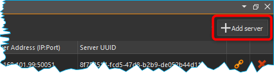

SiLA2 Add-on
============

.. image:: Pictures/sila_header.svg

Einführung in das SiLA2 Add-on
---------------------------------

Mit Hilfe des SiLA-Add-ons können Sie jedes SiLA-Gerät in die CETONI Elements-Software 
integrieren. Eine generische, dynamisch generierte Schnittstelle ermöglicht Ihnen 
den manuellen Zugriff auf alle SiLA-Funktionen, -Befehle und -Eigenschaften eines 
beliebigen SiLA-Geräts. 
Mit Hilfe verschiedener Skriptfunktionen können Sie Ihre SiLA-Geräte automatisieren 
und in CETONI Elements-Skripte integrieren.

Installation
------------

Das SiLA 2 Add-on ist nicht im Standard CETONI Elements
Installationspaket enthalten, sondern muss als Add-on zusätzlich
installiert werden. Die Versionen von SiLA 2 Plugin und installierter
CETONI Elements Software sollten übereinstimmen. Wenn Sie z.B. das SiLA
2 Plugin mit der Versionsnummer **20210707** installieren möchten, sollte
die CETONI Elements Software mit der Versionsnummer **20210707** installiert
sein.

.. admonition:: Wichtig
   :class: note

   Die Versionsnummer der CETONI Elements      
   Software und des SiLA 2 Add-ons sollten übereinstimmen.  
   Die Version des SiLA 2 Add-ons darf nie größer sein, als 
   die Version der CETONI Elements Software. Je größer die  
   Differenz zwischen der Versionsnummern ist, umso größer  
   ist die Wahrscheinlichkeit dass Probleme oder Fehler     
   auftreten. 

Bitte schließen Sie vor der Installation alle anderen Programme.

Starten Sie zur Installation die Datei
:file:`CETONI_Elements_SiLA_64bit_Setup.exe`. Der Installationsassistent
führt Sie anschließend durch die Installation der Software- und
Hardware-Treiber.

.. image:: Pictures/sila_install_01.png

Während der Installation werden die Bonjour Print Services installiert,
die für das automatische Discovery von SiLA Servern im Netzwerk nötig
sind. Dieser Schritt ist nur notwendig, wenn die Bonjour Services auf
Ihrem Rechner noch nicht installiert wurden. Sind sie bereits
installiert, deaktivieren Sie bitte die entsprechende Komponente (siehe
Abbildung unten).

.. image:: Pictures/sila_install_02.png

.. admonition:: Wichtig
   :class: note

   Unter Windows müssen Sie mit                
   Administratorrechten angemeldet sein, um die             
   Installation der Hardware-Treiber durchführen zu können. 

Grundlagen von SiLA 2
---------------------

SiLA 2 (Standardization in Lab Automation) ist ein
Kommunikationsstandard für Labor-Geräte. Das primäre Ziel von SiLA ist
es, einen internationalen, offenen Konnektivitätsstandard in der
Laborautomatisierung zu schaffen über den Geräte unterschiedlicher
Hersteller miteinander in einer Anwendung kommunizieren können.

Client-Server Konzept
~~~~~~~~~~~~~~~~~~~~~

Die Kommunikation basiert auf einem Client-Server-Prinzip und verwendet
etablierte Netzwerkstandards. Ein **SiLA-Server** wird üblicherweise von
einem Gerät bereitgestellt während ein **SiLA-Client** üblicherweise eine
Steuerungssoftware (z.B. ein LIMS oder CETONI Elements) ist. Da ein
SiLA-Server in den meisten Fällen ein Gerät repräsentiert, werden die
Begriffe *SiLA-Server* (oder nur *Server*) und *Gerät* im Folgenden
synonym verwendet.

.. image:: Pictures/client_server.png

Jeder SiLA Server hat eine bestimmte Anzahl von Features implementiert. Die 
**SiLA-Features** sind eine Schlüsselkomponente des SiLA-2-Standards, da sie 
die Interaktion zwischen dem SiLA-Client und dem SiLA-Server definieren. Jedes 
einzelne Feature beschreibt einen bestimmten Aspekt des Gesamtverhaltens des Servers.

Die Merkmale eines Geräts (d. h. eines SiLA-Servers) werden in einer XML-Datei 
beschrieben, in der die Funktionalität beschrieben wird:

- **Properties (Eigenschaften)**: Datenwerte, die statisch (z. B. Seriennummer) 
  oder dynamisch (z. B. aktuelle Temperatur) sein können
- **Commands (Befehle)**: eine Interaktion zur Steuerung oder Übermittlung von 
  Informationen an/von SiLA, eine Aktion, die von einem SiLA-Server ausgeführt werden kann
- **Parameters (Parameter)**: erwartete Informationen, die zur Ausführung des 
  Befehls erforderlich sind
- **Return values (Rückgabewerte)**: erwartete Ausgabe des Befehls
- **Errors (Fehler)**: erwartete Fehler, die während des Vorgangs auftreten können

.. image:: Pictures/sila_feature.png

Commands und Properties
~~~~~~~~~~~~~~~~~~~~~~~

Properties und Commands können sowohl *Unobservable* als auch *Observable* sein.

**Unobservable Properties** sind statische Daten eines Servers, die sich
während der Laufzeit eines Servers nicht ändern (z.B. die Anzahl
möglicher Schaltstellungen eines Ventils).

**Observable Properties** sind dynamische Daten eines Servers, die sich
während der Laufzeit eines Servers ändern können und über deren Änderung
Clients informiert werden sollen (z. B. die aktuelle Flussrate einer
Spritzenpumpe). Observable Properties können von einem Client
*abonniert* werden, sodass dieser über alle Änderungen der Property
informiert wird.

**Unobservable Commands** sind Aktionen, die auf einem Gerät ausgeführt
werden können und die nur sehr wenig Zeit in Anspruch nehmen (z. B. zum
Ändern von Einstellungen wie den Spritzenparametern einer Pumpe).

**Observable Commands** sind Aktionen, die potentiell längere Zeit für
die Ausführung auf dem Gerät in Anspruch nehmen können (z. B. eine
Fluid-Dosierung). Hierbei kann ein Client die sogenannte *Execution
Info* abonnieren, um über den Fortschritt der Command-Ausführung
benachrichtigt zu werden.

.. tip:: 
   Eine umfassende Einführung in den SiLA-Standard finden Sie auf der SiLA-Homepage: 
   https://sila-standard.com/standards/ oder in diesem 
   `Blogbeitrag <https://matthieu-croissant.medium.com/sila-2-hands-on-bringing-automation-to-the-laboratory-dacc12df7152>`_.

SiLA UI Übersicht
-----------------

Durch Anklicken der Schaltfläche :guilabel:`SiLA 2` und anschließend *Server
Overview* :guinum:`❶` in der Seitenleiste wechseln Sie zum *SiLA 2 Plugin*
(siehe Abbildung unten).

.. rst-class:: guinums

#. Schaltfläche :guilabel:`SiLA 2` zur Anzeige von *Server Overview* und
   verbundene SiLA 2 Server
#. Schaltfläche zum Durchführen eines Netzwerk-Scans, um verfügbare
   SiLA 2 Server zu finden
#. Schaltfläche zum Herstellen einer Verbindung zu allen Servern in der Liste
#. Anzeige aller im Netzwerk gefundenen oder manuell hinzugefügten SiLA 2 Server
#. Auswahlbox zum Zulassen von unverschlüsselten Verbindungen
#. Schaltfläche zum manuellen Hinzufügen eines SiLA 2 Servers
#. Schaltfläche zum Herstellen oder Auflösen einer Verbindung zu einem SiLA 2 Server
#. Schaltfläche zum Löschen des Servers aus der Liste

Mit der Schaltfläche :guinum:`❶` bzw. den Karteireitern können Sie
zwischen den aktuell verbundenen SiLA 2 Servern und dem *Server
Overview* wechseln. Für jeden Server wird ein Reiter angelegt.

Verbinden zu einem SiLA 2 Server
--------------------------------

Verbinden zu automatisch gefundenen Servern
~~~~~~~~~~~~~~~~~~~~~~~~~~~~~~~~~~~~~~~~~~~

.. image:: Pictures/link.svg
   :width: 40
   :align: left

Um sich mit einem SiLA 2 Server zu verbinden, der über das *SiLA Server
Discovery* im lokalen Netzwerk gefunden wurde, klicken Sie einfach auf
das *Connect-Icon* :guinum:`❶` in der entsprechenden Zeile im *Server Overview*.

Nachdem die Verbindung erfolgreich hergestellt wurde, erscheint anstelle
des Connect-Icons das *Disconnect*-Icon :guinum:`❷`. Durch klicken auf dieses Icon
können Sie die Verbindung zu diesem Gerät wieder trennen.

.. image:: Pictures/1000000100000433000000D8B27B749FA02DEB20.png

.. tip:: 
   .. image:: Pictures/link_multi.svg
      :width: 40
      :align: left
   
   Über die Schaltfläche *Connect-To-All* :guinum:`❸`       
   können Sie sich gleichzeitig mit allen Geräten verbinden 
   und müssen sich nicht zu jedem Gerät einzeln verbinden.  

.. tip::
   .. image:: Pictures/wifi.svg
      :width: 40
      :align: left

   Sollte die Software eines oder mehrere Ihrer  
   SiLA-Geräte nicht gefunden haben, kann es helfen, die   
   Server neu zu starten und einen erneuten Netzwerk-Scan  
   :guinum:`❹` durchzuführen.    

.. tip::
   Wenn Sie die Software schließen, während Sie  
   noch zu einem oder mehreren SiLA-Servern verbunden      
   sind, wird versucht, diese Verbindungen beim nächsten   
   Start der Software wiederherzustellen.    

.. admonition:: Wichtig
   :class: note

   Wenn Sie einen Server mit einer aktiven    
   Verbindung zur Software aus der *Server Overview* Liste 
   löschen, dann wird die Verbindung automatisch getrennt. 

Normalerweise ist die Kommunikation zwischen SiLA-Server und -Client
verschlüsselt. Sollte eines Ihrer Geräte jedoch keine Verschlüsselung
bereitstellen, schlägt der Verbindungsversuch mit einer Fehlermeldung im
Event Log fehl. Für lokale Tests können Sie trotzdem eine Verbindung mit
diesem Gerät herstellen, wenn Sie den Haken bei 
:guilabel:`Allow insecure (unencrypted) connection` setzen (Abbildung unten).

.. image:: Pictures/allow_unsecure.png

.. admonition:: Achtung
   :class: caution

   Sie sollten niemals eine unverschlüsselte  
   Verbindung zu einem Gerät herstellen, dass sich         
   außerhalb Ihres lokalen Netzwerks befindet, da sonst    
   die gesamte Kommunikation zwischen dem Gerät und der    
   Software von Dritten mitgelesen werden kann.   

Manuelles Hinzufügen und Verbinden zu einem Server
~~~~~~~~~~~~~~~~~~~~~~~~~~~~~~~~~~~~~~~~~~~~~~~~~~

Sollte ein Server in Ihrem lokalen Netzwerk nicht automatisch gefunden
werden, oder wollen Sie sich zu einem Server außerhalb Ihres lokalen
Netzwerks verbinden, müssen Sie diesen Server manuell hinzufügen.
Klicken Sie dafür auf die Schaltfläche :guilabel:`Add server` :guinum:`❻` (siehe Abbildung
oben). Es erscheint das folgende Dialogfenster.

Geben Sie hier entweder den Hostnamen oder die IP-Adresse
Ihres Geräts sowie den Port ein, auf dem der SiLA Server läuft. Klicken
Sie anschließend auf :guilabel:`OK`.

Die Software wird nun versuchen, sich zu diesem Server zu verbinden. Ist
dies erfolgreich erscheint der Server in der *Server Overview* Liste.
Sollte die Verbindung nicht hergestellt werden können, finden Sie im
*Event Log* eine Fehlermeldung mit Hinweisen, warum die Verbindung
fehlgeschlagen ist.

Nicht vertrauenswürdige Zertifikate akzeptieren
~~~~~~~~~~~~~~~~~~~~~~~~~~~~~~~~~~~~~~~~~~~~~~~

Zur Verschlüsselung der Kommunikation zwischen Server und Client werden
SSL-Zertifikate verwendet, die auch zur Verschlüsselung der
Kommunikation im Internet verwendet werden. Normalerweise sind diese
Zertifikate von einer vertrauenswürdigen Zertifikationsstelle signiert.
Sollten Sie versuchen, eine Verbindung zu einem Server herzustellen, der
ein selbstsigniertes Zertifikat verwendet, erscheint folgendes
Dialogfenster.

.. image:: Pictures/untrusted_certificate.png

Wenn Sie dem Zertifikat vertrauen, klicken Sie im Dialogfenster auf
:guilabel:`Yes`, um die Verbindung fortzusetzen, andernfalls auf :guilabel:`No`. In diesem
Fall wird die Verbindung abgebrochen.

Durch klicken auf :guilabel:`View Certificate` erhalten Sie weitere
Informationen über das Zertifikat. Dort sehen Sie vor allem, welche
Institution das Zertifikat erstellt und signiert hat.

Steuerung eines SiLA 2 Servers
------------------------------

Nachdem Sie sich erfolgreich mit einem SiLA Server verbunden haben,
können Sie diesen über eine generische Oberfläche steuern. Diese
Oberfläche sieht für jede Art von SiLA Server, also für jedes Gerät
unabhängig vom Typ oder Hersteller des Geräts, gleich aus. 

.. tip::
   Mit dieser Schnittstelle können Sie zwar alle Aspekte eines SiLA-Servers steuern, 
   sie eignet sich jedoch nicht für die Erstellung komplexer Arbeitsabläufe. 
   Für diesen Zweck sind die vom Plugin bereitgestellten Skriptfunktionen, die 
   im Abschnitt `SiLA 2 Script-Funktionen`_ vorgestellt werden, besser geeignet.

Öffnen Sie die generische Oberfläche indem Sie mit der Sidebar
Schaltfläche :guilabel:`SiLA 2` den gewünschten Server auswählen (siehe Abschnitt 
`Grundlagen von SiLA 2`_. Sie sehen nun
alle SiLA 2 Features, die von dem Server bereitgestellt werden :guinum:`❶`. Wenn
Sie den Mauszeiger auf eines der :guilabel:`i` Symbole bewegen, erscheint ein
Tooltip mit der Beschreibung des Features :guinum:`❷`. 

.. image:: Pictures/feature_overview.png

Durch einen Klick auf den
Namen des Features oder den Pfeil links neben dem Namen können Sie das
Feature aufklappen. Jetzt sehen Sie alle verfügbaren Commands und
Properties dieses Features :guinum:`❶`. Commands finden Sie auf der linken,
Properties auf der rechten Seite :guinum:`❷`. Über den Splitter in der Mitte können
Sie die Größe anpassen, die für die Commands bzw. Properties zur
Verfügung steht :guinum:`❸`.

.. image:: Pictures/commands_and_properties.png

SiLA Commands UI
~~~~~~~~~~~~~~~~~~

Wenn ein SiLA Command über Parameter, Metadaten oder Rückgabewerte verfügt, 
wie z.B. der Befehl 
:guilabel:`Set Fill Level` :guinum:`❶` in der folgenden Abbildung, kann er
erweitert werden, um die Parameter :guinum:`❷` oder Metadaten einzugeben und die 
Rückgabewerte anzuzeigen. Das folgende Bild zeigt alle Befehle der Funktion 
:guilabel:`Pump Fluid Dosing Service`:

.. image:: Pictures/sila_commands.png

Wenn ein SiLA Command keine oder nur einen Parameter hat, wie z.B. der Befehl 
:guilabel:`Generate Flow` in der oberen Abbildung, dann kann der Befehl nicht 
erweitert werden und es wird höchstens ein Eingabefeld direkt neben dem 
Befehlsnamen :guinum:`❸` angezeigt. 
Um den Befehl auszuführen, klicken Sie auf die Schaltfläche :guilabel:`Ausführen` 
:guinum:`❹`.

SiLA Properties UI
~~~~~~~~~~~~~~~~~~~

Properties lassen sich normalerweise nicht aufklappen. Die folgende Abbildung 
zeigt die SiLA-Eigenschaften der Funktion :guilabel:`Analog In Channel Provider`. 
Hier wird nur ein Feld mit dem aktuellen Wert der Property angezeigt :guinum:`❶`. 
Rechts daneben befindet sich die Schaltfläche zum erneuten Abfragen der
Property :guinum:`❷`. 

.. image:: Pictures/sila_properties.png

Das Klicken der Schaltfläche :guinum:`❷` löst eine folgenden beiden Aktionen aus:

-  Ist die Property *Unobservable* (siehe Abschnitt
   `Commands und Properties`_), dann wird sie einfach noch einmal vom Server
   abgefragt.
-  Ist die Property *Observable*, so wird die im Hintergrund laufende
   Subscription abgebrochen und eine neue Subscription begonnen. Dies
   kann beispielsweise nötig sein, wenn die Subscription aufgrund eines
   Fehlers automatisch abgebrochen wurde.

Außerdem kann es sein, dass eine Property Metadaten benötigt. In diesem
Fall lässt sich die Property wie ein Command aufklappen und es
erscheinen die Eingabefelder für die Metadaten :guinum:`❸`. Nachdem Sie die
Metadaten eingegeben haben, müssen Sie die Property erneut abfragen bzw.
eine neue Subscription starten, damit diese Daten zum Server gesendet
werden.

.. admonition:: Wichtig
   :class: note

   Beim erstmaligen Öffnen der generischen    
   Oberfläche werden alle Unobservable Properties einmal   
   abgefragt und für Observable Properties werden          
   automatisch im Hintergrund Subscriptions gestartet.     
   Dies geht allerdings nur, wenn die Property keine       
   Metadaten benötigt. In diesem Fall müssen Sie die       
   Metadaten zuerst eingeben und dann den Wert selbst      
   abfragen bzw. selbst eine Subscription starten.  

Die Verbindung zu einem Server beenden
~~~~~~~~~~~~~~~~~~~~~~~~~~~~~~~~~~~~~~~~

Wenn Sie die Verbindung zu einem Server beenden oder die Verbindung
z.B. wegen eines Netzwerkfehlers automatisch abbricht, dann bleibt die
Oberfläche zwar geöffnet, allerdings sind alle Eingabefelder und
Schaltflächen gesperrt. Wenn Sie dann den Karteireiter für den
betroffenen Server schließen wollen, erscheint folgendes Dialogfenster:

Mit einem Klick auf :guilabel:`Yes` wird die Oberfläche (*View*) für
diesen Server geschlossen und neu erstellt, wenn der gleiche Server
später wieder verbunden wird. Durch Klicken auf :guilabel:`No` bleibt der View
erhalten und wird nur
ausgeblendet. Dadurch können Sie den View später wieder öffnen, um
beispielsweise bestimmte Parameter oder Command Responses zu sehen.
Zusätzlich wird der View automatisch wiederverwendet, wenn die
Verbindung zum Server wiederhergestellt ist.

SiLA 2 Script-Funktionen
------------------------

Einführung
~~~~~~~~~~

Das SiLA 2-Plugin enthält verschiedene Script-Funktionen zur
scriptgesteuerten Ausführung von SiLA Commands und zur Abfrage von 
SiLA Properties.

.. image:: Pictures/sila_script_functions.png

Command ausführen – *Execute SiLA Command*
~~~~~~~~~~~~~~~~~~~~~~~~~~~~~~~~~~~~~~~~~~~

.. image:: Pictures/100002E8000035050000350510C5FE834025052E.svg
   :width: 60
   :height: 60
   :align: left

Mit dieser Funktion können Sie einen SiLA Command ausführen und
das Ergebnis der Ausführung in eine Variable speichern.

.. image:: Pictures/100000010000032D000000CB19F74944FFDAB71C.png

Den auszuführenden Command :guinum:`❶`, sowie die benötigten
Parameter und Metadaten :guinum:`❷` können Sie im Konfigurationsbereich
einstellen.

Zusätzlich können Sie für *Observable Commands* die Option :guilabel:`Run to completion` 
:guinum:`❸` ein- oder ausschalten. Wenn :guilabel:`Run to completion` aktiviert
ist, wird die Scriptausführung erst fortgesetzt, wenn der Command
vollständig ausgeführt wurde. Ist diese Option nicht aktiv, wird der
Command nur gestartet und dann sofort die nächste Script-Funktion
bearbeitet.

Besitzt der Command Rückgabewerte, dann können Sie außerdem Variablen
angeben :guinum:`❹`, in denen diese Werte gespeichert werden sollen.

.. tip::
   Alle SiLA Script-Funktionen unterstützen die  
   Verwendung von Variablen. D.h. in allen Eingabefeldern  
   die im Konfigurationsbereich mit einem gelben V         
   gekennzeichnet sind können Sie Variablen eintragen. 

.. _property_lesen:

Property lesen – *Read SiLA Property*
~~~~~~~~~~~~~~~~~~~~~~~~~~~~~~~~~~~~~

.. image:: Pictures/100043500000350500003505BEBA0AAB65FAB614.svg
   :width: 60
   :height: 60
   :align: left

Mit dieser Funktion können Sie eine SiLA Property abfragen und den
Wert in eine Variable speichern.

.. image:: Pictures/1000000100000345000001FD6EA9B6588936741F.png

Die abzufragende Property :guinum:`❶` sowie die möglichen benötigten
Metadaten :guinum:`❷` können Sie im Konfigurationsbereich einstellen.

Den Namen der Variable, in die der Wert der gelesenen Property
gespeichert werden soll, geben Sie im Feld unten :guinum:`❸` ein. Sollte die
Property eine Structure von mehreren Werten zurückgeben, dann erscheinen
für jedes Element der Structure entsprechende Felder, in denen Sie die
Zielvariable eingeben können.

Auf SiLA Property-Wert warten – *Wait For SiLA Property Value*
~~~~~~~~~~~~~~~~~~~~~~~~~~~~~~~~~~~~~~~~~~~~~~~~~~~~~~~~~~~~~~

.. image:: Pictures/100041250000350500003505032351FB39BC478A.svg
   :width: 60
   :height: 60
   :align: left

Mit dieser Funktion können Sie die weitere Scriptausführung pausieren, bis 
eine bestimmte Property eine definierte Bedingung erfüllt. 
Die Funktion wird erst dann fortgesetzt, wenn die Bedingung
erfüllt ist.

.. image:: Pictures/100000010000034500000209E2A9E0C1D0F440CC.png

Im Konfigurationsbereich wählen Sie zuerst, wie bei der
Funktion :ref:`Read SiLA Property <property_lesen>` beschrieben, die Property 
:guinum:`❶`, die Sie prüfen möchten, sowie die möglichen benötigten Metadaten aus.

.. admonition:: Wichtig
   :class: note

   Die SiLA Property muss *Observable* sein,    
   damit sie in dieser Script-Funktion verwendet werden    
   kann. 

Im Bereich *Condition* konfigurieren Sie die Prüfbedingung. Dafür wählen
Sie als erstes einen Vergleichsoperator :guinum:`❷` aus und geben dann den Wert
ein :guinum:`❸`, mit dem verglichen werden soll. Im Wertfeld :guinum:`❸` können Sie auch
Variablen verwenden, um die Prüfbedingung zu setzen.

.. tip:: 
   Um ein bestimmtes Feature oder einen Command  
   bzw. eine Property schnell zu finden können Sie im      
   Filter Eingabefeld den Namen oder einen Teil des Namens 
   eingeben. Die Auswahlboxen für das Feature bzw. den     
   Command oder die Property enthalten dann nur noch       
   Einträge, die dem eingegebenen Filter entsprechen. 

SiLA-Server austauschen
~~~~~~~~~~~~~~~~~~~~~~~

Ein SiLA-Server ist immer eindeutig über seine UUID (Universally Unique
Identifier) bestimmt. Wenn Sie eine Script Funktion für einen bestimmten
Server erstellen, dann wird im Hintergrund diese UUID gespeichert. Das
führt dazu, dass Scripte immer an die SiLA-Server gebunden sind, für die
sie geschrieben wurden. Nun kann es aber vorkommen, dass sie z.B. ein
Script, dass sie für eine Nemesys Niederdruck-Pumpe geschrieben haben,
mit einer anderen Niederdruck-Pumpe verwenden wollen oder dass ein
bestimmter SiLA-Server ausgetauscht werden musste und sich damit seine
UUID geändert hat. In diesen Fällen können Sie die konfigurierten
SiLA-Server in Ihren Scripten ebenfalls durch die neuen Server
austauschen.

Laden Sie dazu das Script, in dem Sie die Server austauschen wollen in
den Script-Editor. Wählen Sie dann eine SiLA 2 Funktion aus, bei der Sie
den Server austauschen wollen. Die Konfigurationsoberfläche der Funktion
sollte ausgegraut sein, da der entsprechende SiLA-Server nicht verbunden
ist. Dies sehen Sie auch an der Warnung im Konfigurationsbereich :guinum:`❶`.

.. image:: Pictures/10000001000003B5000001C901728FB6CD47BE5B.png

Klicken Sie nun auf das Symbol zum Ändern des SiLA-Servers :guinum:`❷`.
Es öffnet sich folgendes Dialogfenster:

.. image:: Pictures/10000001000001C600000172BBE267CD9A17CF31.png

Hier können Sie nun aus den verbundenen SiLA-Servern einen
auswählen, der anstelle des konfigurierten Servers verwendet werden
soll.

.. admonition:: Wichtig
   :class: note

   Der neue Server muss exakt die gleichen    
   Features bereitstellen, wie der bisherige Server. Der   
   Auswahldialog weist Sie darauf hin, falls dies nicht    
   der Fall sein sollte.

Haben Sie einen passenden Server ausgewählt, klicken Sie auf :guilabel:`Assign selected Server`. 
Nun wird in **jeder** Script-Funktion (nicht nur in der
aktuellen) der bisherige durch den gerade ausgewählten Server ersetzt.
Nun ist der Konfigurationsbereich auch nicht mehr ausgegraut und Sie
können die Funktion wieder bearbeiten. Wenn Sie jetzt das Script
speichern, dann wird der gerade ausgewählte Server übernommen und beim
nächsten Laden des Scripts verwendet.

SiLA Properties über Prozessdaten auslesen
------------------------------------------

Bestimme SiLA Properties werden automatisch als Prozessdaten
bereitgestellt. Das ermöglicht es beispielsweise Script-Variablen direkt
über das jeweilige Prozessdatum zu initialisieren oder diese Daten im
grafischen Prozessdaten-Logger zu verwenden.

Die SiLA Properties müssen dafür folgende Eigenschaften erfüllen:

-  Die Property muss Observable sein.
-  Die Property darf keine Metadata erfordern.
-  Der Datentyp der Property muss sich auf einen numerischen (*Integer*
   oder *Real*) oder booleschen (*Boolean*) Datentyp zurückführen
   lassen.

Verwendung in anderen Script-Funktionen
~~~~~~~~~~~~~~~~~~~~~~~~~~~~~~~~~~~~~~~

Auf SiLA Prozessdaten kann in gewohnter Weise zugegriffen werden:

.. image:: Pictures/10000001000003E000000237BE142D3DDB84E94C.png

In das Eingabefeld wird nun der ausgewählte Prozessdatenbezeichner
eingetragen. Diese haben angelehnt an den üblichen
Prozessdatenbezeichner ebenfalls eine bestimmte Form:

:code:`$$ServerName_ServerUUID.FeatureIdentifier_PropertyIdentifier`

Jeder Bezeichner beginnt mit zwei Dollarzeichen und ein Punkt trennt den
eindeutigen Gerätenamen von dem eindeutigen Bezeichner für die
Prozessdaten. Der Gerätename ergibt sich aus dem Namen des SiLA Servers
sowie dessen eindeutiger ID (UUID, Universally Unique Identifier). Der
Name für das Prozessdatum ergibt sich aus dem Namen des Features und der
jeweiligen Property. Der gesamte Prozessdatenbezeichner darf keine
Leerzeichen oder andere Sonderzeichen enthalten.

Verwendung im grafischen Prozessdaten-Logger
~~~~~~~~~~~~~~~~~~~~~~~~~~~~~~~~~~~~~~~~~~~~

SiLA Prozessdaten können wie gewohnt im grafischen Prozessdaten-Logger
verwendet werden:

.. image:: Pictures/1000000100000550000002C759AE7BAD95D9239D.png

Zuerst öffnen Sie die Plotlogger Konfiguration :guinum:`❶`. Dort fügen
Sie per Drag-and-Drop das gewünschte SiLA Gerät in die Liste der
Diagrammkurven ein :guinum:`❷`. Dann wählen Sie mit einem Doppelklick auf die
Tabellenzelle mit der Geräteeigenschaft die aufzuzeichnende SiLA
Property aus :guinum:`❸`.