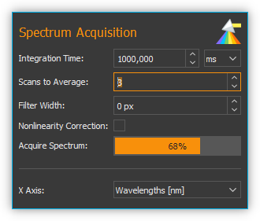
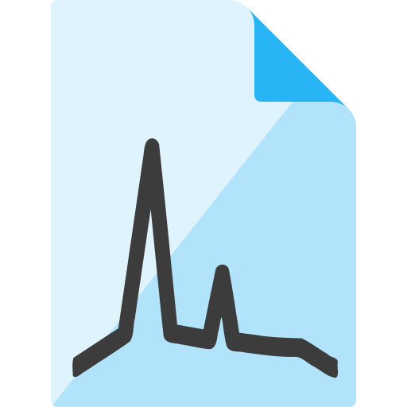
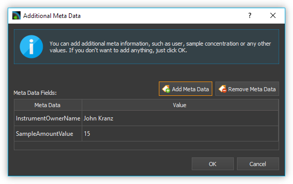
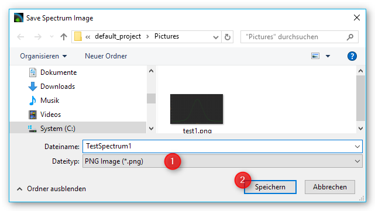
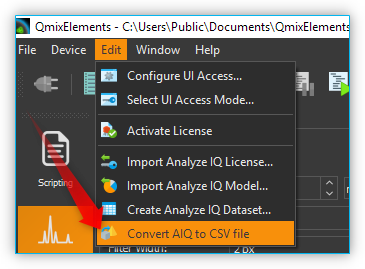
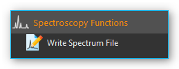
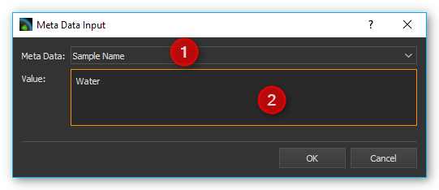
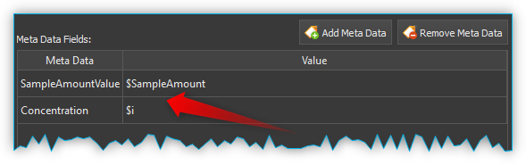

Spektroskopie Add-on
====================

Installation
------------

Das Spektroskopie Add-on ist nicht im Standard Installationspaket
enthalten, sondern muss als Add-on zusätzlich installiert werden. Die
Versionen von Spectroscopy Plugin und installierter CETONI Elements
Software sollten übereinstimmen. Wenn Sie z.B. das Spectroscopy Add-on
mit der Versionsnummer 20150520 installieren möchten, sollte die CETONI
Elements Software mit der Versionsnummer 20150520 installiert sein.

.. admonition:: Wichtig
   :class: note

   Die Versionsnummer der CETONI Elements      
   Software und des Spectroscopy Add-ons sollten            
   übereinstimmen. 

Bitte schließen Sie vor der Installation alle anderen Programme.

.. admonition:: Wichtig
   :class: note

   Installieren Sie das Spectroscopy Plugin +  
   Gerätetreiber, bevor Sie Ihr Spektrometer erstmalig über 
   USB mit dem PC verbinden.  

Starten Sie zur Installation die Datei
:file:`CETONI_Elements_Spectroscopy_Setup_64bit.exe`. Der
Installationsassistent führt Sie anschließend durch die Installation der
Software- und Hardware-Treiber.

.. admonition:: Wichtig
   :class: note

   Unter Windows müssen Sie mit                
   Administratorrechten angemeldet sein, um die             
   Installation der Hardware-Treiber durchführen zu können. 

.. admonition:: Wichtig
   :class: note

   Bei der Installation können Sie optional   
   das *Analyze IQ Addon* installieren für die             
   chemometrische (quantitative und qualitative) Analyse   
   aufgenommener Spektren. Für dieses Addon benötigen Sie  
   eine kostenpflichtige Runtime-Lizenz.  

Einführung
----------

Durch Anklicken der Schaltfläche :guilabel:`Spectroscopy` :guinum:`❺` in der
Seitenleiste wechseln Sie zum *Spectroscopy Plugin* (siehe Abbildung
unten).

.. figure:: Pictures/100002010000050A00000312BAF977EF4EE61643.png
   :alt: Übersicht Spectroscopy Workbench

.. rst-class:: guinums

1. Werkzeugleiste
2. Karteireiter zur Auswahl der Anzeige eines Spektrometers. Mit den Karteireitern 
   können Sie zwischen den Anzeigen und Steuerelementen der einzelnen Spektrometer 
   wechseln. Für jedes Spektrometer wird ein Karteireiter angelegt.
3. Spektrum Live-Anzeige
4. Parameter für Spektrenaufnahme und Vorverarbeitung
5. Schaltfläche :guilabel:`Spectroscopy button`

Werkzeugleiste
--------------

+-----------------+---------------------------------------------------+
| |image39|       | Die Seitenleiste mit den                          |
|                 | Spektrometereinstellungen ein-/ausblenden         |
+-----------------+---------------------------------------------------+
| |image40|       | Start / Stopp der Live-Anzeige von Spektraldaten  |
+-----------------+---------------------------------------------------+
| |image41|       | Aufnahme / Entfernen eines Hintergrundspektrums   |
+-----------------+---------------------------------------------------+
| |image42|       | Automatische Ermittlung der Integrationszeit      |
|                 | starten /stoppen                                  |
+-----------------+---------------------------------------------------+
| |image43|       | Anlegen eines Spektrum-Analyse-Kanals             |
+-----------------+---------------------------------------------------+
| |image44|       | Spektrometereinstellungen aus \*.aiq Datei laden. |
+-----------------+---------------------------------------------------+
| |image45|       | Speichern der Spektraldaten als Text-Format       |
|                 | (*.txt) oder als Analyze IQ Datei (*.aiq)         |
+-----------------+---------------------------------------------------+
| |image46|       | Speichern der Spektraldaten als PNG Bilddatei     |
|                 | oder PDF Dokument                                 |
+-----------------+---------------------------------------------------+
| |image47|       | Panorama Werkzeug zum Verschieben der Spektrum    |
|                 | Live-Anzeige                                      |
+-----------------+---------------------------------------------------+
| |image48|       | Zoombereich-Auswahl-Werkzeug (Vergrößerung)       |
+-----------------+---------------------------------------------------+
| |image49|       | X Achse skalieren, um sie auf den sichtbaren      |
|                 | Bildschirmbereich einzupassen                     |
+-----------------+---------------------------------------------------+
| |image50|       | Y Achse skalieren, um sie auf den sichtbaren      |
|                 | Bildschirmbereich einzupassen                     |
+-----------------+---------------------------------------------------+
| |image51|       | Beide Achsen skalieren, um sie im                 |
|                 | Bildschirmbereich einzupassen                     |
+-----------------+---------------------------------------------------+

Spektrum Live-Anzeige
---------------------

In der Spektrum Live Anzeige sehen
sie stets das aktuelle, zuletzt aufgenommene Spektrum nach allen
Verarbeitungsschritten. 

.. image:: Pictures/100002010000029B00000177ABD966992CA135D7.png

Die Peakmarker :guinum:`❶` zeigen die x- und y-Koordinate
eines gefundenen Spektrumpeaks an. Die Linie für die minimale
Peakintensität ist gelb dargestellt :guinum:`❷`. Unterhalb dieser Linie werden
keine Spektrumpeaks mehr markiert. Wenn Sie in der :guilabel:`Baseline Correction` die
Anzeige der berechneten Baseline aktiviert haben, wird Ihnen diese als
rote Kurve :guinum:`❸` angezeigt. Die X-Achse :guinum:`❺` zeigt die eingestellte Einheit an
(hier Welllenlängen in nm). Die Y-Achse :guinum:`❹` zeigt die gemessene Intensität
in *counts*.

Mit dem Mausrad können Sie in die Spektren-Anzeige hinein- und
herauszoomen.

Wenn das :guilabel:`Panorama Tool` zum Verschieben des Anzeigebereichs aktiviert
ist, können Sie sich die Werte des Spektrums an einer Stelle anzeigen
lassen, indem Sie den Mauszeiger an die entsprechende Position über die
Kurve bewegen :guinum:`❻`. Es wird dann ein Fenster mit den Werten angezeigt. Wenn
Sie den Mauszeiger über die Kurve bewegen, folgt das Fenster dem
Mauszeiger und die Werte darin werden kontinuierlich aktualisiert.

Übersicht Parameter Steuerelemente
----------------------------------

Die Steuerelemente kontrollieren Aufnahme und Vorverarbeitung von
Spektren. Sie sind dabei in der Reihenfolge von oben nach unten
angeordnet, in der auch die Verarbeitung erfolgt

.. image:: Pictures/1000020100000149000002B3DCBA8B215B75CC36.png

.. rst-class:: guinums 

#. **Spectrum Acquisition (Spektrenerfassung)** - enthält alle Einstellungen des 
   Spektrometers für die Aufnahme eines Spektrums
#. **Baseline Correction** - hier können Sie die Parameter für die 
   Echtzeit-Basislinienkorrektur einstellen
#. **Peak Detection** - hier konfigurieren Sie die Parameter für die automatische 
   Peak Erkennung

Mit Hilfe der `Spektrum Live-Anzeige`_
können Sie die Auswirkung von Parameteränderungen sofort sehen und bewerten.

Spektrenaufnahme
----------------

Übersicht Bedienelemente für Spektrenaufnahme
~~~~~~~~~~~~~~~~~~~~~~~~~~~~~~~~~~~~~~~~~~~~~

Im Bereich *Spectrum Acquisition* finden Sie alle Bedienelemente zur
Einstellung der Aufnahmeparameter.

Integrationszeit einstellen
~~~~~~~~~~~~~~~~~~~~~~~~~~~~

Die Integrationszeit entspricht der Belichtungszeit des Spektrometer
CCDs. Es ist die Zeit, die der Detektor Photonen sammeln kann.

.. image:: Pictures/1000000000000156000000474167447199E62218.png
   :alt: Integrationszeit einstellen

Die Integrationszeit geben
Sie im Eingabefeld :guinum:`❶` ein. Die gewünschte Zeiteinheit im Auswahlfeld :guinum:`❷`.
Mit zunehmender Integrationszeit wachsen die Intensitätswerte des
Spektrums, da der Detektor länger Photonen sammeln kann.

.. tip::
   Die Zeitdauer für die Aufnahme eines          
   Spektrums wächst mit zunehmender Integrationszeit.   

Ist die Aufnahmedauer größer als 500 Millisekunden, wird unter den
Steuerelementen ein Fortschrittsbalken eingeblendet, der Ihnen den
Fortschritt der aktuellen Aufnahme zeigt. Ist das Produkt aus
Integrationszeit und *Scans to Average* größer gleich 10 Sekunden,
erscheint eine Warnmeldung mit dem Hinweis auf die zukünftige Länge der
Integrationszeit. Entweder können die aktuellen Parameter-Einstellungen
übernommen werden oder die ursprünglichen Werte bleiben erhalten.

.. image:: Pictures/1000020100000214000000B9A90C45B25306261E.png
   :alt: Hinweisfenster bei zu langer Integrationszeit.

.. admonition:: Wichtig
   :class: note

   Alle Parameteränderungen werden erst nach  
   Beendigung der aktuell laufenden Spektrumaufnahme       
   ausgeführt. Dadurch kann bei hohen Integrationszeiten   
   der Eindruck entstehen, dass die Software nicht mehr    
   reagiert. 

Integrationszeit automatisch ermitteln
~~~~~~~~~~~~~~~~~~~~~~~~~~~~~~~~~~~~~~~

.. image:: Pictures/100013ED000034EB000034EBCC5E333393A120A7.svg
   :width: 60
   :align: left

Wenn Sie in der Werkzeugleiste die Schaltfläche zur
automatischen Ermittlung der Integrationszeit anklicken, versucht die
Software die Integrationszeit automatisch so zu regeln, dass die
maximale Intensität des Spektrums 80% des maximalen Sensorwertes
(Sättigung) erreicht. Sie können die automatische
Integrationszeitermittlung jederzeit durch erneutes Anklicken der
Schaltfläche stoppen.

Spektrum vorverabeiten
~~~~~~~~~~~~~~~~~~~~~~

Die Vorverarbeitung von Live-Spektren kann zu einem besseren
Signal-Rausch-Verhältnis (Signal-to-Noise-Ratio, SNR) beitragen. Dies
reduziert Störeinflüsse bei qualitativer Verbesserung der Spektren.
Spektrale Glättung lässt markante Peaks erkennen. Die Beseitigung von
Nichtlinearitäten und eine Grundlinienkorrektur der Spektren wirken sich
zusätzlich positiv auf deren Qualität aus.

.. image:: Pictures/1000000000000155000000858ACEEBB181F0436F.png

Scans To Average
^^^^^^^^^^^^^^^^^^^^

Dies ist eine zeitliche Mittelwertbildung. Es wird die eingestellte
Anzahl von Spektren aufgenommen und dann für jeden einzelnen Bildpunkt
der Mittelwert aus allen Aufnahmen gebildet. Das verbessert das
Signal-Rausch-Verhältnis (mit steigender Zahl steigt auch das SNR aber
auch die Aufnahmedauer)

Filter Width
^^^^^^^^^^^^^^^

Dies ist eine räumliche Mittelwertbildung bei der das Spektrum visuell
geglättet wird. Dafür wird für jeden Bildpunkt der Mittelwert aus den
benachbarten Bildpunkten gebildet. Der eingegeben Wert definiert die
Breite des Filters in Pixeln auf der linken und rechten Seite des
aktuellen Bildpunktes. (z.B.: Filter Width = 3: Durchschnittsbildung von
jedem Datenwert mit seinen 3 linken und 3 rechten Nachbarwerten). Steigt
der Wert für *Filter Width*, wächst der SNR → das Spektrum wird
zunehmend glatter. Ein zu hoher Wert für *Filter Width* führt zur
Reduzierung der spektralen Auflösung

Nonlinearity Correction
^^^^^^^^^^^^^^^^^^^^^^^^^

Diese Funktion korrigiert die zwischen Photonenstrom und Ausgangssignals
des CCD Sensors bestehende Nichtlinearität

Einheit der x-Achse wählen
~~~~~~~~~~~~~~~~~~~~~~~~~~

.. image:: Pictures/10000000000000A8000000859C4F5349C1A99934.png

Sie können für die x-Achse verschiedene Einheiten wählen:

+---------------------+-----------------------------------------------+
| Einheit             | Bedeutung                                     |
+=====================+===============================================+
| Wavelengths [nm]    | Wellenlänge der x-Achse in der Einheit        |
|                     | Nanometer                                     |
+---------------------+-----------------------------------------------+
| Pixels [px]         | jeder Pixelwert entspricht einem              |
|                     | CCD-Sensorelement, Beginn bei 0, Ende bei n-1 |
|                     | (n = Maximalzahl an Sensorelementen)          |
+---------------------+-----------------------------------------------+
| Wavelengths [µm]    | Wellenlänge der x-Achse in der Einheit        |
|                     | Mikrometer                                    |
+---------------------+-----------------------------------------------+
| Frequency [GHz]     | x-Achsenfrequenz in der Einheit GigaHertz     |
|                     | (GHz)                                         |
+---------------------+-----------------------------------------------+
| Wave numbers [1/cm] | x-Achse in der Einheit von inversen           |
|                     | Zentimetern (1/cm)                            |
+---------------------+-----------------------------------------------+
| Raman shift [Raman] | x-Achse in Einheit 1/cm - abhängig von        |
|                     | Anregungswellenlänge des Lasers               |
+---------------------+-----------------------------------------------+

Baselinekorrektur
-----------------

Übersicht Bedienelemente zur Baselinekorrektur
~~~~~~~~~~~~~~~~~~~~~~~~~~~~~~~~~~~~~~~~~~~~~~

Im Bereich *Baseline Correction* finden Sie alle Einstellungen für die
Realtime-Baselinekorrektur:

.. image:: Pictures/100002010000014B000000F9E97A1A85837E0B1C.png
   :alt: Bedienelemente für Realtime-Baslinekorrektur

Die
Baseline-Variation ist ein Problem, das bei vielen Arten von
Spektraldaten auftritt. Typischerweise ist es eine lineare oder
nichtlineare Addition zu den Spektren, die dazu führt, dass erwartete
Nullmessungen einen positiven Wert erreichen. Dies kann z.B. die
Fluoreszenz bei der Aufnahme von Raman-Spektren sein. Eine Baseline kann
als die langsam variierende Kurve beschrieben werden, die durch den
unteren Teil der Spektren verläuft, ohne die Sprünge der Peaks.

Bei der Baselinekorrektur wird durch den gewählten Algorithmus eine
Baseline berechnet. Diese wird dann von dem aufgenommenen Spektrum
abgezogen um die Baseline-Variation zu korrigieren.

Mit dem Auswahlfeld :guilabel:`Enable Baseline Correction` :guinum:`❶` aktivieren oder
deaktivieren Sie die Baselinekorrektur. In der Auswahlliste
:guilabel:`Baseline Algorithm` :guinum:`❷` wählen Sie den Algorithmus zur Berechnung der
Baseline aus. Mit dem Auswahlfeld :guilabel:`Show Baseline` :guinum:`❸` können Sie
auswählen, ob die berechnete Baseline in der *Spektrum Live-Anzeige*
angezeigt wird oder nicht. Auch wenn die Baselinekorrektur ausgeschaltet
ist, können Sie die berechnete Baseline anzeigen lassen und so deren
Qualität überprüfen (siehe Abbildung unten).

.. image:: Pictures/1000020100000402000001A97720894F1E93F7FF.png
   :alt: Anzeige berechnete Baseline

In dem Bereich darunter :guinum:`❹`
finden Sie die Einstellungen für den bei :guinum:`❷` gewählten Baseline
Algorithmus.

Baseline Algorithmen
~~~~~~~~~~~~~~~~~~~~

Vancouver Raman Algorithmus
^^^^^^^^^^^^^^^^^^^^^^^^^^^

Der Vancouver Raman Algorithmus wurde entwickelt für die automatisierte
Hintergrundentfernung von Autofluoreszenz-im Bereich der biomedizinische
Raman-Spektroskopie (vgl. Zhao, J., Lui, H., McLean, D. I., & Zeng, H.
(2007). Automated Autofluorescence Background Subtraction Algorithm for
Biomedical Raman Spectroscopy. Applied Spectroscopy, 61(11), 1225–1232).
Er basiert auf einer modifizierten Multi-Polynom-Anpassung, mit einer
zusätzlichen Peak-Entfernung während der ersten Iteration und einer
statistischen Methode zur Berücksichtigung von Signalrausch-Effekten.

.. image:: Pictures/10000201000001460000007B1C98A8A89B024276.png
   :alt: Parameter für Vancouver Raman Algorithmus

Für diesen
Algorithmus können Sie die folgenden Parameter einstellen:

.. rst-class:: guinums

-  **Polynomial Order** – Damit stellen Sie den Grad des Polynoms für
   die Polynomanpassung ein. Basierend auf empirischen Erfahrungen
   liefern Polynome vierter bis sechster Ordnung die besten
   Fluoreszenz-Approximationen.
-  **Max. Iterations** – Die maximale Anzahl der Iterationen nach
   denen die Berechnung abgebrochen wird. D.h. auch wenn der Fehler noch
   über dem Schwellwert liegt, wird nach der maximalen Anzahl von
   Iterationen die Berechnung beendet.
-  **Error Threshold** – Legt den Schwellwert für den maximalen
   Fehler als Abbruchkriterium fest. Wird der Schwellwert
   unterschritten, dann wird die Berechnung beendet. Für 0,95%
   Sicherheit verwenden Sie z.B. 0,05

Rolling Ball Algorithmus
^^^^^^^^^^^^^^^^^^^^^^^^

Der ursprüngliche Rolling Ball Baseline Algorithmus (vgl. M. Kneen and
H. Annegarn, Nucl. Instrum. Methods Phys. Res. 82, 59 (1996).) wurde für
Röntgenspektren entwickelt. Die berechnete Grundlinie entsteht dabei
durch eine gedachte Kugel, die auf der Unterseite des Spektrums entlang
rollt. Die Grundlinie ist einfach die Spur des obersten Punktes der
Kugel. In drei Schleifen findet der Algorithmus minimale Punkte in
lokalen Fenstern, findet maximale Punkte unter den minimalen Punkten und
glättet durch Mittelung über die maximalen Punkte.

.. image:: Pictures/100002010000014800000062E976D673182661CF.png
   :alt: Parameter für Rolling Ball Baseline Algorithmus 

Für
diesen Algorithmus können Sie die folgenden Parameter einstellen:

-  **Min. / Max. Window** – Größe der lokalen Fenster zur Berechnung
   der minimalen und maximalen Punkte zur Identifzierung der Grundlinie.
-  **Smoothing Window**– Breite der lokalen Fenster für die Glättung
   

Peak-Erkennung
--------------

Übersicht
~~~~~~~~~

Spitzenwerte in einem Spektrum sind dessen „charakteristischer
Fingerabdruck“: Die Identifikation eines Stoffes bzw. Stoffgemisches
kann über die horizontale Position der Spitzenwerte (auch Peaks genannt)
erfolgen. Zudem ermöglichen die Intensitätswerte von Haupt- und
Nebenpeaks Rückschlüsse auf die Höhe der einzelnen Konzentrationen in
Stoffgemischen. Im Bereich *Peak Detection* finden Sie alle
Einstellungen für die automatische Peak-Erkennung:

.. image:: Pictures/100002010000014B000000C71D3283399DE7CA61.png
   :alt: Einstellungen für Peak-Erkennung

-  **Find Peaks** – Schaltet die Erkennung von Peaks ein und aus
-  **Min. Peak Distance** - Minimaldistanz (in x-Richtung) zwischen zwei
   Peakmarkierungen in der eingestellten Einheit der X-Achse.
-  **Show peak threshold** - Zeigt den Schwellwert für die Erkennung von
   Peaks als gelb gestrichelte Linie in der Spektrumdarstellung an
-  **Peak Threshold** - Schwellwert für die Peakerkennung – nur Peaks
   oberhalb des Schwellwerts werden als Peaks erkannt und in der Anzeige
   markiert.

.. tip:: 
   Da die eingetragene minimale Peakdistanz      
   nicht zu 100% genau auf den Plot übertragen wird,       
   experimentieren Sie ein wenig mit dem Wert, um ein für  
   Sie optimales Ergebnis zu erreichen.  

.. tip:: 
   Zu viele Peakmarkierungen können die          
   Rechenleistung Ihres Computers beeinträchtigen. Es wird 
   nur eine begrenzte Anzahl an Peaks angezeigt. 

.. image:: Pictures/10000201000001990000009ADEAA7757BB84C426.png
   :alt: Wann Peaks markiert werden

Anwendungsbeispiel: Eine
Peakmarkierung erfolgt nicht, wenn sich der Peak unter der Linie für
minimale Peakintensität befindet :guinum:`❶`. Liegt er darüber :guinum:`❷`, erscheint
die Markierung. Der letzte Peak bleibt unmarkiert :guinum:`❸`, da die
Entfernung von seinem Vorgänger kleiner als die minimale Peakdistanz
ist.

.. tip::
   Beeinträchtigen zu viele Peakmarkierungen die 
   Rechenleistung Ihres Computers, reduzieren Sie die      
   Anzahl an Peakmarkierungen. Erhöhen Sie dazu            
   Minimaldistanz und minimale Peakintensität oder glätten 
   Sie das Spektrum.   

Dunkelspektrum / Hintergrundspektrum entfernen
----------------------------------------------

Das Dunkelspektrum ist der erwartete Signalpegel, wenn kein Licht
vorhanden ist. Das Hintergrundspektrum ist der erwartete Signalpegel
wenn keine Probe vorhanden ist. Durch Abziehen des Dunkel- /
Hintergrundspektrums vom aktuell aufgenommenen Spektrum werden
Streulichteinflüsse und das Rauschen des Aufnahmesensors im
Ergebnisspektrum reduziert.

Wählen Sie zunächst die Parameter mit den Steuerelementen so, wie Sie
sie bei Ihren Messungen auch tatsächlich verwenden. Schalten Sie Ihre
Licht- bzw. Laserquelle aus und nehmen Sie ein Hintergrundspektrum auf,
indem Sie auf das Glühbirnenicon klicken.

.. image:: Pictures/10000000000001A500000045E617BDA0A41B53BB.png
   :alt: Hintergrundspektrum anwenden

Nun wird automatisch von
jedem neu aufgenommenen Spektrum das gleiche Hintergrundspektrum
abgezogen.

.. image:: Pictures/10000000000001B1000000485C4904E43654367A.png
   :alt: Hintergrundspektrum entfernen

Sind Sie mit dem Ergebnis
unzufrieden, klicken Sie auf das Glühbirnensymbol mit dem roten Kreuz.
Dadurch entfernen Sie das Hintergrundspektrum und können die Aufnahme
des Hintergrundspektrums wiederholen.

Spektraldaten & Spektrometereinstellungen speichern
---------------------------------------------------

Speichern Sie Ihre Spektraldaten als Textdatei, indem Sie in
der Werkzeugleiste auf das entsprechend Symbol klicken. Sie können das
aufgenommene Spektrum als Text-Datei (:file:`*.txt`) oder als Analyze IQ Datei
(:file:`*.aiq`) speichern. Textdateien haben den Vorteil, dass Sie diese einfach
in einem Tabellenkalkulationsprogramm (z.B. Excel) öffnen können, um die
Spektren dort zu analysieren. Analyze IQ Dateien haben den Vorteil, dass
dort zusätzlich Metadaten zu den aufgenommenen Spektraldaten gespeichert
werden. So wird z.B. das Erstellungsdatum, die Einheiten für X und Y
Achse, der Anwender und alle aktuellen Einstellungen des Spektroskops in
einer Analyze IQ Datei gespeichert.

.. tip:: 
   Wenn Sie später das *Analyze IQ Add-on* zur   
   qualitativen und quantitativen Analyse verwenden        
   möchten, sollten Sie Ihre Spektren als Analyze IQ Datei 
   (:file:`*.aiq`) speichern.   

Es öffnet sich ein Dialogfenster, zur Auswahl des Dateinamens und der
Dateiformats.

.. image:: Pictures/1000000000000281000001690B1712E12DD8A2ED.png
   :alt: Spektraldaten als Textdatei speichern

Als Zielverzeichnis wird das Datenverzeichnis des aktuellen Projekts
verwendet. Sie können im Dateidialog aber auch ein anderes Verzeichnis
wählen.

Wenn Sie als Dateiformat das :file:`*.aiq` Format ausgewählt haben, wird Ihnen
nun ein Dialog zum Hinzufügen von Metadaten angezeigt.

Hier können Sie durch Anklicken von
:guilabel:`Add Meta Data` zusätzliche Informationen, wie z.B. Probenname oder
Probenmenge zur :file:`*.aiq` Datei hinzufügen. Nach dem Klick auf :guilabel:`Add Meta Data` 
erscheint das Eingabefenster zur Auswahl des Metadatennamens und
zur Eingabe des Wertes.

.. image:: Pictures/100002010000021D00000106AECCF1F0C5BD4297.png
   :alt: Metadaten Eingabe

Mit dem Auswahlfeld :guilabel:`Meta Data` :guinum:`❶` können Sie entweder ein
vordefiniertes Metadatenfeld auswählen oder ein neues
anwenderspezifisches Metadatenfeld definieren. Ein neues Feld
definierten Sie durch Eingabe eines Namens, der nicht in der Liste
enthalten ist, z.B. *Concentration*. Die vordefinierten Metadatenfelder
sind im Dateiformat für :file:`*.aiq` Dateien definiert und werden teilweise in
der externen Analyze IQ Software angezeigt.

Wenn Sie das Metadatenfeld gewählt haben, geben Sie dann im Feld :guilabel:`Value` :guinum:`❷`
den Wert für das Metadatenfeld ein und schließen Sie die Eingabe durch
Anklicken von :guilabel:`OK` ab.

Wenn Sie ein Metadatenfeld wieder aus der Liste löschen möchten, dann
wählen Sie dieses aus und klicken anschließend auf die Schaltfläche
:guilabel:`Remove Meta Data`. Sobald Sie :guilabel:`OK` klicken wird das letzte 
aufgenommen Spektrum zusammen mit den aktuellen Spektrometereinstellungen und den
Metadaten in eine Datei mit der Endung aiq gespeichert.

.. tip:: 
   Wenn Sie Dateien im AIQ Format speichern,     
   können Sie diese später jederzeit in das CSV Format     
   konvertieren mit der Funktion `Analyze-IQ Dateien in CSV konvertieren`_. 

Spektrometereinstellungen laden
-------------------------------

.. image:: Pictures/10001A5A0000350500003505B28BB34041B3E522.svg
   :width: 60
   :align: left

Alle Spektrometereinstellungen lassen sich aus vorher
gespeicherten :file:`*.aiq` Dateien laden. Klicken Sie dafür in der
Werkzeugleiste auf das Symbol *Load Spectrometer Settings* (:file:`*.aiq`) und
wählen Sie dann eine :file:`*.aiq` Datei aus.

|

Spektrum Bild speichern
-----------------------

.. image:: Pictures/100014E3000034EB000034EBE5DD307BDB0E90BB.svg
   :width: 60
   :align: left

Durch Anklicken der entsprechenden Schaltfläche in der
Werkzeugleiste können Sie das aktuelle Bild des Spektrum-Liveanzeige als
PNG-Bild oder als Vektorgrafik in Form eines PDF-Dokuments speichern.

Im Dateidialog der angezeigt wird, können Sie wählen, ob Sie ein
PNG-Bild oder PDF-Dokument speichern möchten :guinum:`❶`. Als Zielverzeichnis
wird das Bilder-Verzeichnis des aktuellen Projekte vorgegeben. Sie könne
im Dateidialog aber auch ein anderes Verzeichnis wählen.

Klicken Sie die :guilabel:`Speichern` Schaltfläche :guinum:`❷` um das Bild zu speichern.

Analyze-IQ Dateien in CSV konvertieren
--------------------------------------

Wenn Sie Ihre Spektraldaten im Analyze IQ Format (:file:`*.aiq`) gespeichert
haben, können Sie diese später jederzeit in das CVS Format konvertieren.
Im Hauptmenü finden Sie dafür den Menüpunkt :menuselection:`Edit --> Convert AIQ to CSV file`. 
Klicken Sie diesen Menüpunkt an, wählen Sie die Analyze-IQ Datei
aus und die Software speichert die Datei dann als CSV-Datei mit dem
gleichen Dateinamen und der Dateiendung :file:`*.txt`.

Spektraldaten laden und anzeigen mit dem Spectra Viewer
-------------------------------------------------------

Mit dem *Spectra Viewer* steht Ihnen ein Tool zur Verfügung, um
gespeicherte Spektraldaten im Analyze IQ Format (:file:`*.aiq`) oder im CSV
Format (:file:`*.txt`) zu öffnen und zu betrachten. Um den Spectra Viewer zu
öffnen, wählen Sie im Hauptmenü den Menüpunkt 
:menuselection:`Window → Show View → Spectroscopy → Spectra Viewer`. 
Alternativ können Sie den Spectra Viewer
auch über die :guilabel:`Spectroscopy` Schaltfläche in der Sidebar öffnen.

..  image:: Pictures/10000201000002AF0000014F5CF64A834AD822ED.png
   :alt: Spectra Viewer zum Laden und Anschauen von gespeicherten Spektren
   :width: 16.201cm
   :height: 7.899cm

In der Werkzeugleiste :guinum:`❶` am oberen Rand finden Sie die
einzelnen Funktionen des Spectra Viewers. Die Funktionen sind im
Wesentlichen die gleichen Funktionen wie in der `Spektrum Live-Anzeige`_. 
Durch Rechtsklick
mit der Maustaste in den Viewer, können Sie das Kontextmenü mit allen
Funktionen aufrufen.

.. image:: Pictures/10001A5A0000350500003505B28BB34041B3E522.svg
   :width: 60
   :align: left

Klicken Sie auf die Schaltfläche :guilabel:`Load Spectra Data` um
Spektrendateien zu öffnen. In dem Dateiauswahldialog der nun angezeigt
wird, können Sie eine oder mehrere Dateien auswählen. Die ausgewählten
Dateien werden danach im *Spectra Viewer* angezeigt.

Wie in der *Spektren Live-Anzeige* können Sie auch hier die Maus über
eine Kurve bewegen, um den Wert der Kurve an der betreffenden Stelle
anzeigen zu lassen :guinum:`❷`.

Wenn Sie zusätzliche Spektren laden möchten, klicken Sie einfach erneut
die Schaltfläche :guilabel:`Load Spectra Data`. Die neuen Spektren werden dann
zu den bestehenden Spektren hinzugefügt.

.. image:: Pictures/100019CB000035050000350509AD2B23340F765E.svg
   :width: 60
   :align: left

Klicken Sie auf die Schaltfläche :guilabel:`Clear Viewer`, um alle
Kurven im Spectra Viewer zu löschen.

|

.. image:: Pictures/10001855000034EB000034EBA6C6DA993124AA4C.svg
   :width: 60
   :align: left

Mit der Schaltfläche :guilabel:`Export Plot Image` können Sie das
aktuelle Bild im *Spectra Viewer* als PDF- oder Bilddatei exportieren.

|

Echtzeitanalyse mit Hilfe von Analyse-Kanälen
---------------------------------------------

Einführung
~~~~~~~~~~

Analysekanäle bieten Ihnen die Möglichkeit, Analysen der aufgenommenen
Spektraldaten online durchzuführen und die Ergebnisse der Analysen über
Analysekanäle in die CETONI Elements Skriptprogrammierung einzubinden.
Damit steht Ihnen ein leistungsfähiges Werkzeug zur Verfügung um
Spektraldaten online zu analysieren und dann auf Basis der
Analyseergebnisse andere Geräte zu steuern oder bestimmte Ereignisse
auszulösen.

Für jede Analyse wird ein „analoger“ Eingangskanal in der Liste der I/O
Kanäle angelegt (siehe Abbildung unten). Diese Eingangskanäle können wie
jeder andere analoge Kanal in das CETONI Elements Scriptsystem eingebunden
und ausgewertet werden.

.. image:: Pictures/10000000000001F7000001142841551EFEB1EACB.png
   :alt: Analysekanäle in der Liste der I/O-Kanäle

Um einen Analysekanal anzulegen, klicken Sie in der Werkzeugleiste auf die
Schaltfläche :guilabel:`Create Spectrum Analysis Channel`.

.. image:: Pictures/10000000000002260000005471DE945B98781511.png

Es wird ein Dialog angezeigt, in dem Sie die Analysefunktion
auswählen können:

.. image:: Pictures/10000000000001CE00000122F7C226839147E7EE.png
   :alt: Auswahldialog für Analysefunktion

Nachdem Sie die Analysefunktion konfiguriert haben, wird ein
Analysekanal in der Liste der I/O-Kanäle eingefügt. Details zu den
vorhandenen Analysefunktionen finden Sie in den folgenden Abschnitten.

.. tip::
   Sie können für ein Spektrometer beliebig      
   viele Analysekanäle anlegen. So können Sie z.B.         
   gleichzeitig die Intensität bei einer bestimmten        
   Wellenlänge messen oder die Intensität des gesamten     
   Signals durch die Integration aller Werte ermitteln.

Durch Anklicken der grünen LED in der ON-Spalte (Abbildung unten) können
sie die betreffende Online-Analyse jederzeit aktivieren und
deaktivieren. Wenn Sie die Konfiguration eines Analysekanals ändern
möchten oder den Kanal löschen wollen, dann klicken Sie mit der rechten
Maustaste in den Kanal um das Kontextmenü anzuzeigen (Abbildung unten).
Wählen Sie dann aus dem Kontextmenü die gewünschte Aktion aus.

.. image:: Pictures/10000000000001DF000000D382294C592C92D8DB.png
   :alt: Kontextmenü: Analysekanäle löschen oder konfigurieren

Integrationsfunktion – Spectrum Integration
~~~~~~~~~~~~~~~~~~~~~~~~~~~~~~~~~~~~~~~~~~~~~

Mit der Integrationsfunktion können Sie die Intensität der Spektraldaten
innerhalb einer bestimmten Bandbreite messen oder die Intensität des
Signals bei einer bestimmten Wellenlänge. Dafür legen Sie im
Konfigurationsdialog zuerst die Bandbreite :guinum:`❶` fest, innerhalb derer
das Signal integriert werden soll. Wenn Sie die Intensität bei einer
bestimmten Wellenlänge messen möchten, tragen Sie für :guilabel:`Start Range` und
:guilabel:`End Range` die gleichen Werte ein.

.. image:: Pictures/100000000000020400000142D6ECCD346178EA57.png
   :alt: Konfiguration Integrationsfunktion

Klicken Sie auf die
Schaltfläche :guilabel:`Apply` um die Werte zu übernehmen. Die Software korrigiert
die eingegebenen Werte auf die nächstmöglichen Werte die das
Spektrometer unterstützt. In der aktuellen Anzeige des
Analyseergebnisses :guinum:`❸` können Sie sofort die Auswirkungen der
geänderten Werte sehen. Wenn Sie auf die Schaltfläche :guilabel:`OK` klicken,
werden die eingestellten Wert übernommen und ein neuer Analysekanal
angelegt oder der aktuell ausgewählte Kanal aktualisiert.

Chemometrische Analysefunkion – Chemometric Analysis
~~~~~~~~~~~~~~~~~~~~~~~~~~~~~~~~~~~~~~~~~~~~~~~~~~~~

Die chemometrische Analyse ermöglicht die quantitative und qualitative
Bestimmung von Konzentrationen einzelner Stoffe in Stoffgemischen. Zur
Nutzung dieser Funktion benötigen Sie eine kostenpflichtige Lizenz für
das Analyze IQ Realtime Add-on.

In dem Konfigurationsdialog dieser Funktion müssen Sie lediglich ein
vorhandenes Analyze IQ Modell auswählen, welches für die Analyse der
Spektren verwendet werden soll (siehe Abbildung unten).

.. image:: Pictures/10000000000002B200000198351FAEE79E8F24F1.png
   :alt: Auswahldialog für Analyze IQ Modell

Auf der linken
Seite finden Sie eine Liste mit allen vorhandenen Modellen :guinum:`❶`. Auf
der rechten Seite finden Sie nähere Details zu dem Modell welches Sie
auf der linken Seite in der Liste ausgewählt haben. So sehen Sie hier,
welche Substanz :guinum:`❷` analysiert wird, ob es sich um eine quantitative
oder qualitative Analyse handelt :guinum:`❸` und eine kurze Beschreibung zu
dem gewählten Modell :guinum:`❹`.

Wenn Sie ein Modell ausgewählt haben, wird eine Analysekanal angelegt.
Bei einer quantitativen Analyse zeigt Ihnen der Kanal die Konzentration
des Stoffes im Bereich von 0 – 100% an (siehe Abbildung unten). Bei
einer qualitativen Analyse zeigt Ihnen der Kanal über die beiden Werte 0
(Stoff nicht vorhanden) und 1 (Stoff vorhanden) das Vorhandensein eines
Stoffes in einem Stoffgemisch an.

.. image:: Pictures/100000000000019B000000BB706D21E0968AD54A.png
   :alt: Analysekanal für quantitative chemometrische Analyse

Spektroskopie Script-Funktionen
-------------------------------

Das Spektroskopie-Plugin enthält verschiedene Script-Funktionen zur
scriptgesteuerten Aufnahme von Spektren.

Spektraldaten speichern – *Write Spectrum File*
~~~~~~~~~~~~~~~~~~~~~~~~~~~~~~~~~~~~~~~~~~~~~~~~

.. image:: Pictures/10001C570000350500003505E6F32F564847474D.svg
   :width: 60
   :align: left

Mit dieser Funktion können Sie das aktuelle Spektrum in eine
Textdatei (:file:`*.txt`) oder Analyze IQ Datei (:file:`*.aiq`) schreiben.
Im Konfigurationsbereich wählen Sie zuerst das Spektrometer aus, von
welchem Sie ein Spektrum aufzeichnen möchten :guinum:`❶`.

|

.. image:: Pictures/100000000000022E000001345C6C067BCF3E1B4B.png
   :alt: Konfiguration Write Spectrum File Funktion

Wählen Sie dann den Dateinamen und den Dateityp (:file:`*.txt` oder :file:`*.aiq`) aus,
mit dem die Dateien gespeichert werden sollen. Klicken Sie dafür auf die
Schaltfläche mit dem Ordnersymbol :guinum:`❷`, und wählen Sie das
Zielverzeichnis, den Dateinamen und den Typ aus.

Bei Aufruf der Funktion wird in den Dateinamen noch der aktuelle
Zeitstempel eingefügt. Dadurch wird bei jedem Aufruf der Funktion eine
Datei mit einem neuen und eindeutigen Dateinamen erzeugt. Die Datei
:file:`Spectrum.aiq` wird dann beim Aufruf der Funktion z.B. mit folgendem
Dateinamen gespeichert:

.. centered:: Spectrum_20161223_135552_545.aiq

Zusätzlich zu den Spektraldaten, können Sie noch Metadaten zur Messung,
zur Probe oder zu dem Gerät in die Datei speichern :guinum:`❸`.

.. admonition:: Wichtig
   :class: note

   Metadaten werden nur gespeichert, wenn Sie 
   als Dateiformat das Analyze IQ Format (:file:`*.aiq`) wählen. 

Klicken Sie auf die Schaltfläche :guilabel:`Add Meta Data`, um ein Metadatenfeld
hinzuzufügen. Wählen Sie nun in dem Dialog ein vordefiniertes
Metadatenfeld mit der Auswahlbox :guinum:`❶` aus oder erzeugen Sie ein neues
Metadatenfeld durch die Eingabe eines Namens, der nicht in der Liste
enthalten ist, z.B. Concentration. Geben Sie dann im Eingabefeld
:guinum:`❷` den Wert ein, der dem Metadatenfeld zugewiesen werden soll.

Sie können als Wert für ein
Metadatenfeld auch einfache Scriptvariablen verwenden. Diese werden zur
Laufzeit des Scripts ausgewertet und dann der Wert der Scriptvariablen
in dem entsprechendem Metadatenfeld gespeichert (siehe Abbildung unten).

.. image:: Pictures/100000000000022E000000B9C135A601DF289C38.png
   :alt: Verwendung von Variablen in Metadaten

Analyze IQ Add-on
-----------------

Einführung
~~~~~~~~~~

Das Analyze IQ Add-on ermöglicht die Einbindung der leistungsfähigen
chemometrischen Analysefunktionen von Analyze IQ in die CETONI Elements
Software.

In praktischen Anwendungen führt die Analyse von Stoffgemischen oder
gemischten Flüssigkeiten zu Peaks in den Spektraldaten, die sich
gegenseitig Überlappen können und es kann zu nichtlinearen Beziehungen
zwischen den spektralen Antworten der unterschiedlichen Stoffe kommen.

Analyze IQ bietet ein neues, modellbasiertes Paradigma für die
Spektralanalyse:

-  Erzeugen Sie eine Reihe von bekannten Stoffmischungen /
   Materialzusammensetzungen
-  Nehmen Sie die Spektraldaten dieser Stoffgemische auf
-  Wählen Sie aus einem breiten Spektrum chemometrischer
   Analysemethoden, um analytische Modelle zu konstruieren, die alle
   Spektraldaten kompakt zusammenfassen
-  unbekannte Mischungen können schnell und genau mit diesen
   analytischen Modellen analysiert werden

Dieses Paradigma bietet eine Reihe von Vorteilen:

-  es trennt Modellbildung von Modellnutzung
-  Expertenwissen für die Analyse von Spektraldaten kann in Modellen
   verpackt und dann an Anwender für die Verwendung der Modelle
   weitergegeben werden

Chemometrische Modelle werden komfortabel mit *Analyze IQ Lab* erstellt
(Abbildung unten).

.. image:: Pictures/10000000000004C5000002D59035C8FFB4E53AF3.png
   :alt: Analyze IQ Lab Software zur Erstellung von Analysemodellen

Die Modelle können dann auch von Nicht-Experten
angewandt werden, um Daten schnell in Ergebnisse und Entscheidungen zu
verwandeln. Über eine Schnittstelle zur *Analyze IQ RealTime Software*
ist diese Analysefunktionalität in die CETONI Elements Software integriert
und kann über die
:ref:`Analysekanäle <Echtzeitanalyse mit Hilfe von Analyse-Kanälen>`
zur Echtzeit-Analyse von Stoffgemischen verwendet werden.

Lizenzdaten importieren
~~~~~~~~~~~~~~~~~~~~~~~

.. image:: Pictures/100000000000015F000000AB601EAD6DCEE2D509.png
   :alt:  Import Analyze IQ License

Um das Analyze IQ Add-on
nutzen zu können, benötigen Sie eine gültige Lizenzdatei. Diese
Lizenzdatei (:file:`*.ail`) erhalten Sie von CETONI nach der Bestellung des
Analyze IQ Add-on. Um die Lizenzdatei zu importieren, wählen Sie in der
Software den Menüpunkt :menuselection:`Edit --> Import Analyze IQ License`.

Nach dem Import der Lizenzdaten, wird der Analyze IQ RealTime Server
gestartet, und die CETONI Elements Software verbindet sich zu dem
Analyseserver.

.. image:: Pictures/100000000000025200000083F1434245C5549A11.png
   :alt: Status-Message nach erfolgreicher Verbindung zum Analyze IQ RealTime Server

Spektraldaten für die Modellbildung erzeugen
~~~~~~~~~~~~~~~~~~~~~~~~~~~~~~~~~~~~~~~~~~~~~~

Die CETONI Software kann Spektraldaten im aiq-Dateiformat
speichern und damit die Modellbildung in der Analyze IQ Software
erheblich vereinfachen. Für die Modellbildung von
Klassifizierungsmodellen (Substanz vorhanden ja /nein) oder
Quantifizierungsmodellen (Konzentration einer Substanz in Prozent) muss
jedem aufgenommenen Spektrum die Information zugeordnet werden, ob eine
bestimmte Substanz enthalten ist bzw. in welcher Konzentration diese
enthalten ist. Diese Aufgabe kann durch die Verwendung der
Metadatenfelder des aiq-Dateiformates perfekt gelöst werden.

Sowohl beim :ref:`manuellen Speichern von
Spektraldaten <Spektraldaten & Spektrometereinstellungen speichern>`
als auch bei der :ref:`scriptgesteuerten
Speicherung <spektraldaten speichern – *write spectrum file*>`
können Sie die Konzentration eines Stoffes in den Metadaten speichern.
Verwenden Sie für alle Spektren aus denen Sie ein Analysemodell
erstellen möchten das gleiche Metadatenfeld, z.B. Concentration. Wenn
Sie scriptgesteuert Mischungen erzeugen, dann können Sie die Speicherung
der Spektraldaten zusammen mit dem Konzentrationswert durch die
Verwendung von Variablen automatisieren (siehe Abbildung unten).

Alle Spektren, die Sie für die Erstellung eines Modells
verwenden möchten, sollten Sie in dem selben Verzeichnis speichern.

.. admonition:: Wichtig
   :class: note

   Legen Sie für jedes Analysemodell ein      
   eigenes Verzeichnis an und speichern Sie darin alle     
   Spektren, die Sie für die Modellbildung für dieses      
   spezifische Modell verwenden möchten.  

Vorbereitung des Datensatzes
~~~~~~~~~~~~~~~~~~~~~~~~~~~~

Im Analyze IQ User Manuel finden Sie bei der Beschreibung zur
Modellbildung den Abschnitt *Preparing the Dataset*. In der
Unterüberschrift *Import from Multiple Spectrum Files* wird beschrieben,
wie Sie aus mehreren einzelnen Spektraldateien in einem Ordner ein
Modell bilden können. Dabei erzeugt Analyze IQ eine CSV Datei in der die
Zuordnung vom Spektrum zum Konzentrationswert erfolgt.

.. image:: Pictures/10000201000001E70000010D75D43D854ECA1BA6.png
   :alt: Beispiel einer Spektrenliste mit Zielwerten

Für jedes Spektrum in dem Ordner wird eine Zeile in der CSV Datei
angelegt, in welche der Anwender händisch den Konzentrationswert in
Prozent (Quantifizierungsmodell) oder das Vorhandensein einer Substanz
(Klassifizierungsmodell) als „Yes“ oder „No“ Auswahl einträgt (siehe
Abbildung).

Dieser aufwändige Prozess kann in der Software mit wenigen Mausklicks
erledigt werden. Wählen Sie zur Erstellung eines Datensatzes im
Hauptmenü den Punkt :menuselection:`Edit --> Create Analyze IQ Dataset`.

Es wird nun der Dialog angezeigt, zur Vorbereitung des
Datensatzes für ein Analysemodell. Im Feld :guilabel:`Folder Containing Spectra` 
:guinum:`❶` wählen Sie den Ordner aus, in dem die Spektren
enthalten sind. Im Feld :guilabel:`Value Metadata` :guinum:`❷` geben Sie den Namen des
Metadatenfelds ein, oder wählen es aus, in dem Sie beim Speichern der
Spektren den Konzentrationswert geschrieben habe.

.. image:: Pictures/100002010000022F000001778C1FCD60ED7C0F8F.png
   :alt: Dialog zur Konfiguration eines Analyze IQ Datensatzes für die Modellbildung

Klicken Sie dann auf den :guilabel:`Refresh` Button :guinum:`❸` mit dem
grünen Pfeilsymbol um die Konzentrationswerte aus allen Spektren
automatisch einzulesen und damit die Spalte :guilabel:`Concentration` :guinum:`❹` zu
aktualisieren.

.. tip:: 
   Falls nicht die erwarteten Werte eingelesen   
   werden sondern alle Felder in der Spalte                
   :guilabel:`Concentration` auf dem Wert 0 verbleiben, überprüfen   
   Sie bitte ob Sie das korrekte Metadatenfeld gewählt     
   haben oder ob Sie beim Namen des Metadatenfeldes einen  
   Tippfehler haben. 

Immer wenn Sie den Eintrag im Metadatenfeld ändern, sollten Sie die
Werte mit der :guilabel:`Refresh`-Schaltfläche neu einlesen.

Klicken Sie dann auf die Schaltfläche :guilabel:`Write Quantification File` :guinum:`❺` wenn
Sie ein Quantifizierungsmodell erstellen möchten oder auf die
Schaltfläche :guilabel:`Write Classification File` :guinum:`❻`, um ein
Klassifizierungsmodell zu erstellen. Wenn Sie eine der Schaltflächen
anklicken, wird ein Dateidialog zur Eingabe des Dateinamens in dem
Ordner geöffnet, der die Spektren enthält. Geben Sie dort den Dateinamen
ein, um den Datensatz als CSV-Datei zu speichern.

Wenn Sie ein Klassifizierungsmodell erstellen, wird beim Speichern eine
Datei angelegt, in der in für jedes Spektrum eingetragen wird, ob die
Zielsubstanz enthalten ist (Yes) oder nicht (No). Die folgend Abbildung
zeigt ein Beispiel einer solchen Datei:

.. image:: Pictures/1000020100000181000000AB5D346C54C08AFC47.png
   :alt: Beispiel CSV Datei für Klassifizierungsmodell

Um die Einträge zu generieren wird folgende Regel verwendet:

-  Wert aus Metadatenfeld = 0 → **No**
-  Wert aus Metadatenfeld ≠ 0 → **Yes**

Dies sollten Sie ggf. bereits bei der Speicherung der Metadaten
beachten. Wenn Sie ein Quantifizierungsmodell verwenden, werden die
Konzentrationswerte direkt in die CSV Datei geschrieben (siehe Abbildung
unten).

.. image:: Pictures/1000020100000181000000A8C8DF05F0B9F4E8F7.png
   :alt: Beispiel CSV Datei für Quantifizierungsmodell

Spektren in Analyze IQ importieren
~~~~~~~~~~~~~~~~~~~~~~~~~~~~~~~~~~~~

Wenn Sie ein neues Analysemodell in Analyze IQ erstellen, müssen Sie
lediglich die aufgenommenen Spektren und die erstellte CSV-Datei
importieren und können danach sofort mit der Modellbildung beginnen:

.. image:: Pictures/100002010000035A0000020464AE09D436942582.png
   :alt: Analyze IQ Import von Spektren

Klicken Sie dafür in der
Analyze IQ Software den Punkt :guilabel:`Import from Multiple Spectrum File`
:guinum:`❶` an. Wählen Sie dann den Ordner, der die Spektren enthält :guinum:`❷` und
wählen Sie die CSV Datei aus :guinum:`❸`, die Sie vorher als Datensatz mit der
CETONI Software erstellt haben. Klicken Sie dann auf :guilabel:`Next` :guinum:`❹`, um
alle Daten zu importieren.

Nach dem Datenimport können Sie mit der Modellbildung starten, die
detailliert im Analyze IQ User Manual beschrieben ist (siehe Abbildung
unten). 

.. image:: Pictures/100002010000034E0000020C478454CB59CB80E2.png
   :alt: Analyze IQ Erstellung eines Analysemodells aus importieren Spektren

Am Ende der Modellbildung erhalten Sie ein fertiges
Analysemodell (:file:`*.aiqm`), welches Sie dann wieder in der CETONI Elements
Software für automatische Analysen verwenden können. Im folgenden
Abschnitt erfahren Sie, wie das funktioniert.

Analysemodelle importieren
~~~~~~~~~~~~~~~~~~~~~~~~~~

Um chemometrische Analysen durchführen zu können, benötigen Sie fertige
Analysemodelle. Diese Modelle (:file:`*.aiqm` Dateien) müssen Sie über die
CETONI Elements Software importieren, um Sie dem *Analyze IQ RealTime
Server* hinzuzufügen. Wählen Sie für den Import den Menüpunkt 
:menuselection:`Edit --> Import Analyze IQ Model`.

.. image:: Pictures/1000000000000177000000B044D45C5DD87F2BF6.png
   :alt: Analyze IQ Modelle importieren

Nach dem Import wird der
*Analyze IQ RealTime Server* neu gestartet und das importierte Modell
steht für Analysen zu Verfügung.

.. image:: Pictures/10000000000002B200000198351FAEE79E8F24F1.png
   :alt: Auswahldialog für Analyze IQ Modell

.. tip:: 
   Um Analysemodelle selbst zu erstellen,        
   benötigen Sie die Analyze IQ Lab Software von Analyze   
   IQ, die nicht Bestandteil des Analyze IQ Add-ons ist.  

.. admonition:: Wichtig
   :class: note

   Die Analysemodelle müssen für das         
   entsprechende Spektrometer erstellt worden sein. D.h.  
   die Analysemodelle müssen mit Spektraldaten erstellt   
   worden sein, die vom gleichen Spektrometer oder        
   Spektrometertyp aufgenommen wurden, wie das            
   Spektrometer, was zu aktuellen Aufnahme der            
   Spektraldaten verwendet wird.  

.. |image39| image:: Pictures/10000CF90000350500003505BA16671AF8897E57.svg
   :width: 40
.. |image40| image:: Pictures/10001D0E000034EB000034EBFE4D9797859D4CF2.svg
   :width: 40
.. |image41| image:: Pictures/100004AD000034EB000034EBDEC49DCAEF80199B.svg
   :width: 40
.. |image42| image:: Pictures/100013ED000034EB000034EBCC5E333393A120A7.svg
   :width: 40
.. |image43| image:: Pictures/100088BB000034EB000034EBF06C5A485FDD3915.svg
   :width: 40
.. |image44| image:: Pictures/10001A5A0000350500003505B28BB34041B3E522.svg
   :width: 40

.. |image46| image:: Pictures/10001855000034EB000034EBA6C6DA993124AA4C.svg
   :width: 40
.. |image47| image:: Pictures/100005C7000035050000350518807CBDF5FF2BAE.svg
   :width: 40
.. |image48| image:: Pictures/1000100A000034EB000034EBFC7CEEC6D6B20A4B.svg
   :width: 40
.. |image49| image:: Pictures/10000AAD0000350500003505B065E97D3266EBF3.svg
   :width: 40

.. |image51| image:: Pictures/10000D410000350500003505737D2F8FEABFA448.svg
   :width: 40