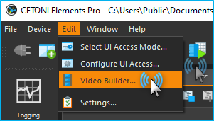
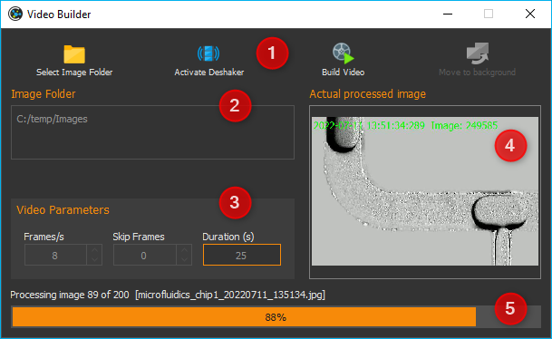
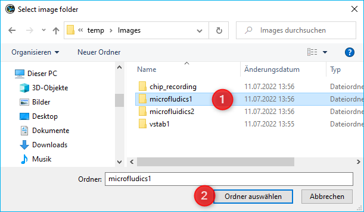
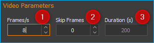
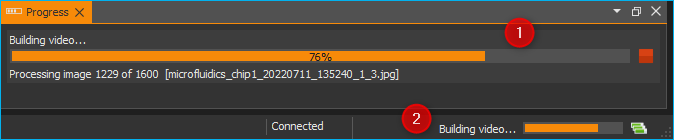
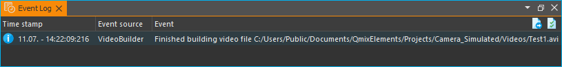

Video Builder Plugin
====================

Einführung
----------

Mit dem Video Builder Plugin können Sie schnell und unkompliziert aus
Bildern, die Sie z.B. zeit- oder scriptgesteuert mit dem :ref:`Kamera Plugin`
oder dem Mikroskop-Plugin aufgenommen haben, ein Video erstellen.
Dadurch können z.B. von sehr langsamen mikrofluidischen Prozessen oder
von Langzeit-Mikroskopaufnahmen Zeitrafferfilme erstellt werden.

Den Video Builder können Sie im Hauptmenü über den Menüpunkt 
:menuselection:`Edit --> Video Builder` aufrufen.

Der Video Builder Dialog enthält die folgenden Bedien- und
Anzeigeelemente (siehe Abbildung unten):

.. rst-class:: guinums

1. Werkzeugleiste
2. Verzeichnis der Bilddateien
3. Video-Parameter
4. Anzeige des Bildes was aktuell bearbeitet wird
5. Anzeige des Bearbeitungsfortschritts

Filmerstellung
----------------

Um einen Film zu erstellen, gehen Sie wie folgt vor:

:step:`Schritt 1 - Bilddateien auswählen`

.. image:: Pictures/folder.svg
   :width: 60
   :align: left

Klicken Sie zum Auswählen der Bilddateien auf die Schaltfläche
:guilabel:`Select Image Folder` in der Werkzeugleiste. In dem Dialog der nun 
angezeigt wird (siehe Abbildung unten) können Sie
dann zu dem Ordner mit den Bilddateien navigieren :guinum:`❶` und dann diesen
Ordner durch Drücken der Schaltfläche :guilabel:`Choose` :guinum:`❷` wählen.

:step:`Schritt 2 – Filmerstellung parametrieren`

Im Bereich *Video Parameters* können Sie nun die Parameter der
Filmerstellung konfigurieren.

Die folgenden Parameter können Sie einstellen:

.. rst-class:: guinums

1. **Frames/s** – konfiguriert die Framerate des fertigen Films, d.h. wie
   viele Bilder pro Sekunde angezeigt werden.
2. **Skip Frames** – legt fest, wie viele Bilddateien bearbeitet werden.
   Bei einem Wert von 0 werden alle Dateien verwendet, bei einem Wert
   von 1 wird z.B. nur jedes zweite Bild verwendet usw.

Auf Basis der vorhandenen Anzahl von Bildern und der beiden Parameter
oben, wird im Feld :guilabel:`Duration (s)` :guinum:`❸` die Dauer des fertigen Films in
Sekunden angezeigt.

.. image:: Pictures/deshaker.svg
   :width: 60
   :align: left

Zusätzlich können Sie noch festlegen, ob der Film nachträglich
entwackelt (stabilisiert) werden soll. Aktivieren Sie dafür die
Schaltfläche :guilabel:`Activate Deshaker`.

|

.. admonition:: Tipp
   :class: tip

   Durch die Entwacklung können Sie z.B.          
   Bildmaterial, das in einer Langzeitbeobachtung mit einem 
   Mikroskop aufgenommen wurden, nachträglich               
   stabilisieren. 

.. admonition:: Wichtig
   :class: note

   Durch die Entwacklung verlängert sich die   
   Zeit für die Filmerstellung.     

:step:`Schritt 3 – Filmerstellung starten`

.. image:: Pictures/movie_run.svg
   :width: 60
   :align: left

Die Filmerstellung starten Sie durch anklicken der
Schaltfläche :guilabel:`Build Video`.
In dem Dateidialog der nun angezeigt wird, legen Sie das Zielverzeichnis
und den Dateinamen fest, unter dem der Film gespeichert werden soll.
Sobald Sie die Auswahl bestätigt haben, beginnt die Filmerstellung.

|

Die Filmerstellung kann, besonders bei einer großen Anzahl von Bildern,
sehr lange dauern. Die Verarbeitung kann im Hintergrund fortgesetzt werden, 
indem Sie die Funktion :guilabel:`Move to background` aktivieren. Dadurch wird 
das Dialogfeld *Video Builder* geschlossen und Sie können mit der Anwendung 
weiterarbeiten.

Wenn ein Prozess im Hintergrund ausgeführt wird, wird dies in der Statusleiste 
:guinum:`❶` des Hauptanwendungsfensters und in der *Fortschrittsansicht* 
:guinum:`❷` angezeigt (siehe Abbildung unten).

Sobald die Filmerstellung abgeschlossen ist, erhalten Sie
eine Nachricht im :ref:`Ereignisprotokoll` der Applikation (Abbildung unten).

Nun können Sie den Vorgang mit einem neuen Satz von Bildern oder mit anderen 
Einstellungen beginnen.