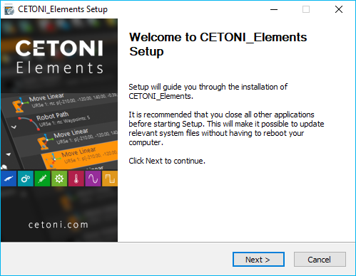
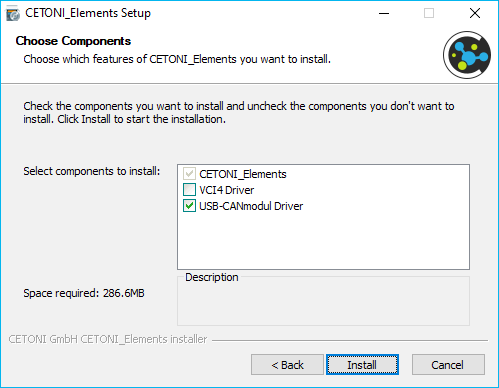
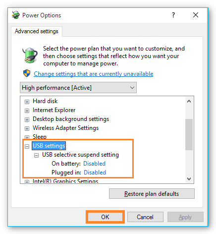

Installation
============

Installing the Software
-----------------------

.. admonition:: Important
   :class: note

   In order not to impair time-critical      
   control processes of the CETONI Elements software, no    
   other computation-intensive applications should be       
   executed on the controller PC.   

.. admonition:: Important
   :class: note

   Install the CETONI Elements software +    
   device drivers before connecting your device via USB to  
   the PC.

.. admonition:: Attention
   :class: caution

   Danger of malfunction / data loss due to  
   standby / sleep mode. Switch off the activation of the   
   standby / sleep mode on your PC or notebook to avoid a   
   malfunction of the hardware driver.     

.. admonition:: Attention
   :class: caution

   Risk of malfunction / data loss due to   
   power saving option. Always operate your PC or notebook 
   in mains operation and deactivate selective USB power   
   saving to avoid malfunctioning of the hardware driver.               

To install the software, insert the CETONI Elements CD ROM into your
CD/DVD drive, or plug the CETONI Elements USB stick into a free USB
port. Then start the file *CETONI_Elements_Setup.exe* from the CD or USB
stick. The Installation Wizard then leads you through the installation
of the CETONI Elements software and the hardware drivers.

.. admonition:: Important
   :class: note

   Under Windows, you need to be logged in  
   with administrator rights in order to be able to        
   install the hardware drivers. 

The Installation Wizard now leads you through the installation of the
software.

The hardware device drivers are
installed during the installation. This step is only required if the
drivers are not already installed on your computer. If the hardware
drivers are already installed, please deactivate the driver components
(Figure below).

System Requirements
----------------------------

Your computer should meet the following system requirements in order to
be able to use the software:

-  PC with an Intel Core i3 processor (or higher) - minimum 1.3 GHz
   (Most processors produced in 2015 and later should work well with
   this software)
-  at least 8 GB RAM (recommended 16 GByte).
-  free hard disk space of approx. 400 MByte
-  at least 2 free USB (2.0 or 3.0) interfaces
-  Operating system: Windows 10 / 11 64-bit (Windows 7 and Windows 8 may
   work, but are not tested)
-  Monitor resolution: 1920 X 1080 (HD) or higher
-  wheel mouse

Standby or sleep mode must be deactivated under Windows when the
software is used, because activation of the standby or sleep mode can
lead to malfunctions of the hardware device driver.

.. admonition:: Attention
   :class: caution

   Danger of malfunction / data loss due to 
   standby / sleep mode. Switch off the activation of the  
   standby / sleep mode on your PC or notebook to avoid a  
   malfunction of the hardware driver.      

To avoid disconnections from the device, please disable selective power
saving for USB ports in the power options:

Installing USB Device Drivers
-----------------------------

The USB device drivers are required for the USB connection to your
device. When you connect your device to your PC via USB for the first
time or connect the device some time later to another USB slot, Windows
starts the Hardware Wizard automatically, this detects a new USB device
and installs the requisite drivers if you have previously installed the
CETONI Elements software from CD or USB stick.

.. admonition:: Important
   :class: note

   The installation procedure for the       
   device drivers can vary slightly depending on the       
   Windows version used.   

.. admonition:: Important
   :class: note

   Danger of data loss as a result of       
   uncontrolled switch off procedures! Always close the    
   software before you switch off your device! Only then   
   are all settings saved correctly, and the configuration 
   data will not be lost.      

.. tip::
   If your driver is not working properly after installation, you can download and
   reinstall it from the drivers section of the `CETONI Downloads <https://cetoni.com/software-downloads>`_
   page.

