CETONI Elements - An Overview
=============================

First Steps
-----------------

The first time the software is started, a default configuration is
loaded: The software loads only its core without any device-specific
plugins. The default configuration is active, when you see the following
startup screen (figure below).

|Figure 1.1: First start of CETONI Elements – Startup Screen|

.. admonition:: Important
   :class: note

   Also after a system crash or after an    
   update of the software, the default configuration is     
   loaded, and the start-up screen appears.

If you want to start the application in demo mode, eg
for presentations and tests or if you currently have no real
equipment, then click the :guilabel:`Start Demo` button.

License Keys
------------

Activate License
~~~~~~~~~~~~~~~~

Right after the initial installation of the software, you have an active
demo license. To view your installed licenses, select 
:menuselection:`Help --> Show License Information` from the main menu.

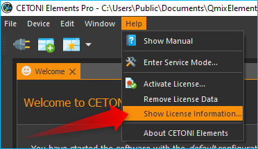

The demo license allows you to create device configurations with
simulated devices and to test all functions of the software.

|image4|

In order to use the software to control your devices, you must
register the license code you have received in the software. To do this,
select :menuselection:`Help --> Activate License` in the main menu.

|image5|

In the license activation dialog, enter your license code and
then click the :guilabel:`Activate` button. If you have entered the license key
correctly, the activation of the license is confirmed and after
restarting the software you can work with the activated license:

|image6|

If you want to upgrade your license or activate additional
licenses for further add-ons, you can proceed exactly as described
above.

Overview of Activated Licenses
~~~~~~~~~~~~~~~~~~~~~~~~~~~~~~

Using the menu item :menuselection:`Help --> Show License Information` in the main menu
of the application, you can display an overview of the current licenses:

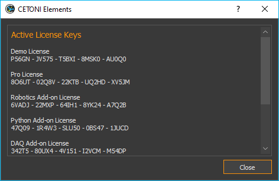

Remove Licenses
~~~~~~~~~~~~~~~

If you want to remove all licenses, select :menuselection:`Help --> Remove License Data`
from the main menu. It is not possible to remove individual licenses,
you can only remove all licenses together. After removing the licenses,
you will work with a demo license again.

Device Configurations
---------------------------

You have
to install and load a device configuration, in order to be able to
control your devices with the software. A device configuration is a folder 
with a set of XML files which contain a complete description of the 
configuration of all devices in the current setup. Only devices that are 
properly configured in the device configuration are available in the CETONI 
Elements software. In the startup screen you can see all ways to get to a valid device
configuration:

|Figure 1.1: First start of CETONI Elements – Startup Screen|

Create Configuration
~~~~~~~~~~~~~~~~~~~~~~~~~~~~~~

.. image:: Pictures/100002010000009600000096EA64110C769BEAC3.png
   :width: 2cm
   :height: 2cm
   :align: left

The :guilabel:`Create Configuration` button allows you to create new
device configurations. To use individual devices or complete systems
consisting of several individual devices in CETONI Elements, you must
create a device configuration. For this purpose, use the Device
Configurator, which is integrated in CETONI Elements. For detailed
instructions on how to create device configurations, see 
:ref:`Device Configurator<Creating Device Configurations>` section.

Open Configuration
~~~~~~~~~~~~~~~~~~~~~~~~~~~~~~

This allows you to load an existing device
configuration that was previously installed on your system.

Import Configuration
~~~~~~~~~~~~~~~~~~~~~~~~~~~~~~

.. image:: Pictures/10000201000000960000009603BB5C04B1480424.png
   :width: 2cm
   :height: 2cm
   :align: left

Select this menu item to install a device
configuration from a disk or USB-stick (eg from CETONI Elements
installation CD)

For most devices and modules you can create your own device
configurations with the CETONI Elements Device Configurator. If you have
devices that are not supported by the Device Configurator or if you use
devices that need to be preconfigured by CETONI, you will find the
device configuration on the installation media (CD or USB stick) that
you received with your device.

Perform the following steps to import an existing device configuration:

.. tip::
   If you create a configuration with the Device 
   Configurator, the configuration will be installed       
   automatically and you don't need to perform the         
   following steps. 

.. rst-class:: steps

#. Select the :menuselection:`Device --> Import Configuration` menu item from the main
   menu.

   .. image:: Pictures/10000000000001310000010F1E67A086173830FE.png

#. Now select whether you
   want to import a folder with a device configuration (:guilabel:`Import Folder`) 
   or a compressed device configuration file (:guilabel:`Import .qcf File`). 
   On the installation media that came with your device, the
   device configurations are stored in folders. Therefore, select the
   item :guilabel:`Import Folder`.

   .. image:: Pictures/1000000000000214000000A60483FD84C031337D.png

#. In the dialog that now opens, select the :file:`DeviceConfiguration`
   directory on the installation CD or browse to another directory
   containing a valid device configuration.

   |image12|

#. Now enter a unique name for the configuration under which it will be
   stored on your computer.

   |Figure 1.3: Assign a configuration name|

#. Acknowledge the query to restart the application.

   |Figure 1.4: Restart application|

After completing these steps, the software with the device-specific plugins will 
start to load.

.. admonition:: Important
   :class: note

   When importing, device configurations,   
   these are always imported into the current project. 

Export Device Configuration
~~~~~~~~~~~~~~~~~~~~~~~~~~~~~~

You can also export device configurations. If you would like to give a
device configuration to employees or if you need the send a device
configuration to the CETONI support staff, then you should export a
device configuration as compressed :file:`.qcf` file. To export a device
configuration, select the main menu item 
:menuselection:`Device --> Export Configuration`.

|Figure 1.5: Export device configuration|

Device configurations are exported as compressed :file:`*.qcf` files.

CETONI Elements – The Basics
------------------------------

Introduction to CETONI Elements
~~~~~~~~~~~~~~~~~~~~~~~~~~~~~~~~~~~

The CETONI Elements application is a plugin-based, modular software
solution for controlling a wide range of laboratory automation devices,
in particular CETONI's Qmix modules. The software consists of a core,
which provides the basic functions and services. This includes the
application window, the event log, and the toolbar.

This core system is then expanded by device- and application-specific
software modules, referred to as plugins. They provide the user with
specific software solutions appropriate for virtually any device
configuration within the standardized user interface.

Show User Manual
~~~~~~~~~~~~~~~~~~

The software PDF manual can be accessed via the application's help menu
(:menuselection:`Help --> Show PDF Manual`).

.. image:: Pictures/10000000000000DC000000A56971ED828CA56C1E.png

.. admonition:: Important
   :class: note

   A PDF-viewer must be installed on your system to be able to view the PDF
   software manual.

To show this online software manual select the menu item 
:menuselection:`Help --> Open Online Manual`.

Show Software Version
~~~~~~~~~~~~~~~~~~~~~~~

If you need to know the version of the installed CETONI Elements, e.g.,
for service purposes, select :menuselection:`Help --> About CETONI Elements` from the main
menu (see figure below).

|Figure 1.7: Displaying the installed software version|

The Main Application Window
---------------------------

The application window of the software consists of the following
central components:

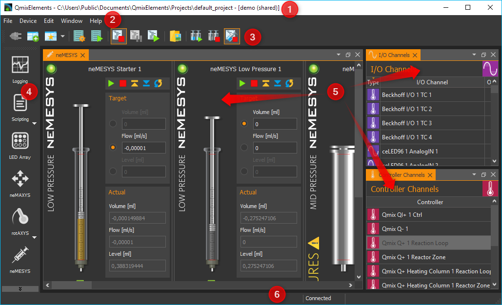

.. rst-class:: guinums

1. `Title bar`_
2. Main menu
3. Toolbars (can be freely positioned and can be hidden)
4. Sidebar for showing *Views* (can be freely positioned and can be
   hidden)
5. The individual *Views*, which can be moved freely in the user
   interface
6. Status bar

Title bar
---------

The title bar displays the application name, the current project path
and the name of the currently loaded device configuration. The following
example illustrates this more clearly. If the title bar contains the
following text:

:code:`CETONI Elements – C:\Users\Public\\Documents\CETONI Elements\Projects\default_project [demo (shared)]`

then you will get the following information:

:application name: CETONI Elements
:current project path: :file:`C:\\Users\\Public\\Documents\\CETONI Elements\\Projects\\default_project`
:device configuration: demo (shared)

Views
-----

Introduction to Views
~~~~~~~~~~~~~~~~~~~~~~~~

The *Views* are windows that contain the display and control elements
for a specific task or device. For example, there are *Views* for the
graphical logger, the display of I/O channels or for the script editor.

All views can be freely moved within the main window via drag & drop.
All views can be shown and hidden and the views can also be removed from
the main window via drag & drop to move them to another screen. This
allows you to adapt the user interface of the CETONI Elements software
optimally to your requirements and your application and thus configure
an individual graphical user interface.

Show Views
~~~~~~~~~~

When you start the software, not all views may be displayed. To display
a view, select :menuselection:`Window --> Show View` from the main menu. You will then
see a menu with all views that are available in the application. Simply
click on the corresponding menu item to display the view (see figure
below).

|Figure 1.9: Displaying Views via the Menu|

For certain devices, there
may be a separate view for each device (e.g. for cameras). In this case,
the views in the View menu are grouped together and can be displayed
individually.

|Figure 1.10: Displaying Views for Devices|

Alternatively, you can show
some views via the :guilabel:`Sidebar` without having to open the main menu.

Moving Views
~~~~~~~~~~~~

To move a view, you must first detach it from its current position.
There are several ways to do this. The first option is Drag & Drop. To
do this, click with the left mouse button on the tab of the view :guinum:`❶` and
simply drag the view from its position :guinum:`❷` with the mouse button held
down. As long as you do not release the mouse button, you can move the
view freely (see figure below).

|Figure 1.11: Move View via Drag & Drop| 

Alternatively, you can detach
the view from its position by double-clicking on its tab. The third
option is the context menu of the view. To do this, right-click the tab
and choose :guilabel:`Detach` from the context menu.

|Figure 1.12: Detach view from its position via context menu|

If you
have detached the view from its position, the view is displayed in a
separate window. Like any other operating system window, you can now
enlarge, reduce, maximize, or move this window to another screen.

Docking Views
~~~~~~~~~~~~~

You can dock views, or groups of views which have their own window, into
the main window or any other view window via drag & drop. To do this,
simply drag the window of the view over the target window into which the
view/view group should be docked. The destination window will then
display icons - the *drop targets*. These target markers indicate the
areas in which the window can be inserted. If your target window
contains only one view, you will see the following 5 drop targets.

|Figure 1.13: Drop target markers|

If you move the mouse cursor over a
*drop target* while moving a window, a colored frame (*drop preview*)
indicates the position (*dock area*) where the view would be inserted.

|Figure 1.14: Drop Preview Display|

If you now release the mouse button
over the target marker, the window is inserted at the position indicated
by the drop preview.

|Figure 1.15: View inserted on the left side|

If you select the symbol
in the middle of the window as the drop target, the new view is inserted
as an additional tab on the position of the existing view.

|Figure 1.16: View Group|

If you drag your view over a window that
already contains several views, additional drop-target markers are
displayed. This means that you then have additional options for docking
the view window. You can see this in the figure below. There are the
outer drop targets :guinum:`❶`, which you already know from the previous section.
In addition, there are five other drop targets that are displayed in the
form of a cross :guinum:`❷`.

|Figure 1.17: Drop target markers|

Move the window with the mouse button
pressed over the individual markers to see the drop preview and to get a
feel for the possibilities for docking a window.

If you want to dock a view as an additional tab, you can move the mouse
cursor either over the middle drop-target icon :guinum:`❶` (see figure below) or
over the title bar of an already docked view :guinum:`❷`.

|Figure 1.18: Insert View as Additional Tab|

Moving View Groups
~~~~~~~~~~~~~~~~~~

Not only individual views can be moved but also complete view groups in
which several views are tabbed. To move a complete view group, do not
click on the tab of the view, but in the title bar of the group (see
figure below). You can now drag and drop the entire group with all tabs
from the current position and move it to a new position.

|Figure 1.19: Moving View Groups|

Alternatively, you can detach a view
group by double-clicking in the title bar :guinum:`❶` of the group, via the menu
item :guilabel:`Detach Area` :guinum:`❷` in the context menu or by clicking the :guilabel:`Detach`
button in the title bar :guinum:`❸`.

|Figure 1.20: Undock View Group|

You can dock a view group or a window
with several views in exactly the same way as a window with only one
view.

Closing Views and View Groups
~~~~~~~~~~~~~~~~~~~~~~~~~~~~~

You can close a single view either via the Close button :guinum:`❶` in the active
tab or via the menu item :guilabel:`Close` :guinum:`❷` in the context menu of a tab.

|Figure 1.21: Closing View|

A view group can be closed with the :guilabel:`Close`.
button :guinum:`❶` in the title bar of the group or with the :guilabel:`Close Area` menu
item :guinum:`❷` in the context menu of the view group.

|Figure 1.22: Closing View Group|

Useful stuff when working with Views
~~~~~~~~~~~~~~~~~~~~~~~~~~~~~~~~~~~~~

If you have view groups with a large number of views, it may be
difficult to navigate between the individual views in the group due to
the number of tabs and the labels that are then truncated. In this case,
you can use the corresponding button in the title bar of the view group
to call a menu with all views of the group and select the corresponding
view.

|Figure 1.23: Opening the View Menu of a View Group|

If you want to
"clean up" a view group quickly, you can use the context menu to close
all views except the currently active view. To do this, select :guilabel:`Close Others`
from the context menu of the active tab.

|Figure 1.24: Close all inactive views of a group|

If you want to
quickly "clean up" a window, for example the main window of the
application, you can use the context menu of a view group to close all
other groups. To do this, select :guilabel:`Close Other Areas` from the context
menu of the view group.

.. image:: Pictures/1000020100000224000000A46CB57E1DDB2A63DE.png

Perspectives
------------

Introduction to working with perspectives
~~~~~~~~~~~~~~~~~~~~~~~~~~~~~~~~~~~~~~~~~

Different tasks, different devices or even different users require a
different arrangement of views. By moving the individual views, you can
optimally adapt the interface to your requirements, to the way you work,
or to your PC hardware.

Once you have found the perfect arrangement of views for a particular
task, you can save this arrangement with a specific name. This stored,
names arrangement is called a *perspective* in the software. If you have
created several perspectives, you can rearrange the entire interface of
the application and adapt it to a new task or requirement with a single
mouse click.

You can activate a perspective using the corresponding button in the
toolbar.

|image19|

When you click on the button, the default perspective is
loaded. If you click on the arrow next to the button :guinum:`❶` (see figure
below), you will open the menu for selecting a previously created
perspective :guinum:`❷`.

|Figure 1.26: Opening existing perspective|

When you click on a
perspective, the views in the user interface are arranged in the same
way as when the perspective was created. Alternatively, you can access
the perspectives from the main menu. To do this, select the menu item
:menuselection:`Window --> Perspective`.

.. image:: Pictures/1000020100000225000000F171D95022C6176EB6.png

.. tip::
   If you have lost the overview when arranging  
   the views or if you want to start again with the        
   arrangement of the views, simply use the Perspective    
   button in the toolbar to call the Standard Perspective  
   :guilabel:`Default`.

Creating Perspectives
~~~~~~~~~~~~~~~~~~~~~

.. image:: Pictures/10002D67000034EB000034EBF8FD72807B3DC1BA.svg
   :width: 60
   :align: left

To create a perspective, click the :guilabel:`Create Perspective`
button in the toolbar. Then enter a unique name for this perspective in
the input dialog and click :guilabel:`OK`.

|Figure : Create Perspective|

The new perspective is now available in the Perspective menu.

Deleting Perspectives
~~~~~~~~~~~~~~~~~~~~~

To delete perspectives, choose :guilabel:`Manage Perspectives` from the
Perspectives menu.

|Figure : Manage Perspectives|

A dialog with a list of all perspectives
is now displayed. In the list :guinum:`❶` you can select single or multiple
perspectives just like in the file explorer. You can use the :kbd:`Shift` key
to select several related entries. With the help of the :kbd:`Ctrl` key you
can click several entries one after the other and select them.

|Figure : Deleting Perspectives|

If you then click the :guilabel:`Remove` button :guinum:`❷`,
all selected perspectives will be deleted.

.. _application-sidebar:

Sidebar
-------

The sidebar allows you to quickly display different views. Some buttons
show a specific view directly. Other buttons allow several views to be
displayed and display a menu for selecting the view (see figure below).

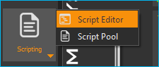

.. tip::
   The sidebar, and also all toolbars, can be    
   freely positioned and arranged in the peripheral areas  
   of the main window. If you right-click on a toolbar,    
   you will see a menu for showing and hiding the          
   toolbars.  

Event Log
---------

Important events are displayed in the event log. This includes notes,
warnings and error messages. The view with the event log is
automatically displayed when an event is written to the log.

|Figure : Event Log View|

.. image:: Pictures/100004F9000034EB000034EB95984B664DF6577B.svg
   :width: 60
   :align: left

You can clear the event log by
pressing the :guilabel:`Clear Event Log` button in the upper right corner of the
screen (see figure).

|

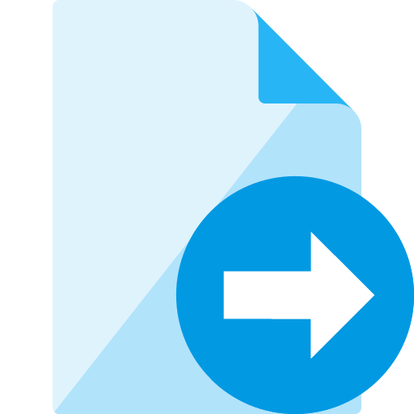

By clicking the :guilabel:`Export To File` button, you can export the
contents of the event log to a text file. After you have assigned a file
name, the file is saved and you can open it in any text editor.

.. image:: Pictures/1000020100000258000000551980D8BBF41A9394.png

If you want to display the event log view manually, select 
:menuselection:`Window --> Show View --> Event Log`` from the main menu of the 
application.

|Figure : Showing Event Log View|

The event log lists the individual
events in chronological order. The latest event is always in the first
row. This can be seen from the time stamps in the first column.

|image29|

When connecting to the device hardware, it may happen that
device errors are received and displayed in the event log. You can
ignore and delete these errors if the event log contains a more recent
message from the same event source (the same device) in which the
error-free state of the device is reported (example in the figure
below).

In this example (see figure above), all 3 axes of the rotAXYS sample
handler report an error :guinum:`❶`. However, the most recent top three messages :guinum:`❷`
show, that there is no more error and that the device works without
errors. So you can safely ignore the previous error event.

Status Bar
----------

The status bar displays a variety of information, such as the connection
status to the device.

Connecting To Device
--------------------

In the toolbar, you see the :guilabel:`Connect to device` button signified by the
plug icon (see figure below). Press this button to connect CETONI
Elements with your device(s).

.. image:: Pictures/100000000000013B000000B23CF02D461CC3D4A3.png

.. admonition:: Important
   :class: note

   The device must be connected to the PC   
   via USB and the power supply to the device must be      
   switched on to connect to the device. 

Working with projects
---------------------

Introduction to projects
~~~~~~~~~~~~~~~~~~~~~~~~~

If you work with the CETONI Elements software, then you always work in a
certain CETONI Elements project. A project stores all project-related
data like current device configuration, application-specific device
names, syringe and tubing configurations, scaling factors, flow rates,
SI units and much more. That is, when you load a project, all
user-specific settings are loaded. So you can easily switch between
different projects or share projects with other employees.

The `Title bar`_ always shows your current
project path. If you select the menu item :menuselection:`File --> Browse Project Folder` 
in the main menu, the current project will be opened in File
Explorer.

|Figure 1.34: Browse project folder|

In the File Explorer you can see
the project-specific data of your current project. Each project has a
fixed structure of files and sub directories. In the
:file:`projectsettings.ini` file all project-specific settings are saved. In
addition, the following sub directories exist in the project directory:

-  :file:`Configurations` – this directory stores all device
   configurations that you import or create with the device
   configurator
-  :file:`Data` – this is a directory in which the plugins can store data
   that can not be saved in the project settings file
-  :file:`Log` – used to store log files such as CSV files generated by CSV
   logger.
-  :file:`Pictures` - stores all image files that are recorded in the
   project (for example, by script functions or from the camera
   plugin).
-  :file:`Scripts` – all script files that are created in a project are to
   be stored in this directory
-  :file:`Videos` – video files that are generated by the camera plugin
   will be stored in this directory

Creating a new project
~~~~~~~~~~~~~~~~~~~~~~~~

To create a new project, select the menu item  :menuselection:`File --> New Project`
from the main menu.

|Figure 1.35: Creating new project|

In the dialog window that is then
displayed, you can configure the new project. First enter a unique
project name :guinum:`❶`. Then select whether you want to copy the settings of
the current project into the new project via 
:guilabel:`Copy current project settings` or whether you want to start with an 
empty project via :guilabel:`Create empty project` :guinum:`❷`.

Then select the location where the project folder is to be created. If
the checkbox :guilabel:`Use default location` :guinum:`❸` is checked, the project
will be created in the :file:`Projects` directory of the CETONI Elements data
folder. If you want to select a different storage location, for
example, to save the project on an external device, remove the check
mark :guinum:`❸` and select the location by clicking the :guilabel:`Browse` button :guinum:`❹`.

Complete the creation of the new project by clicking :guilabel:`OK` :guinum:`❺`.

|Figure 1.36: Configuration dialog for creation of a new project|

.. admonition:: Important
   :class: note

   Save project data, such as scripts,      
   images, log files, etc., in the project directory or    
   subdirectories whenever possible. This is the only way  
   to ensure that all important data is exported or saved  
   during project export. 

Open an existing project
~~~~~~~~~~~~~~~~~~~~~~~~

To open an existing project, select the menu item 
:menuselection:`File --> Open Project` from the main menu.

|Figure 1.37: Open an existing project|

In the dialog window that is
now displayed, you can use the selection box :guinum:`❶` to select a
project from the standard project directory. You can also select a
project by typing the project name into the selection box. The
selection box supports you while typing, through the display of matching
projects. If your project is not stored in the default directory, click
the Browse button :guinum:`❷`. You can then select a project directory
with the help of a directory selection dialog window (for example, on
an external device).

|Figure 1.38: Dialog for opening an existing project|

Then open the new project by clicking :guilabel:`OK` :guinum:`❸`.
 
Export current project
~~~~~~~~~~~~~~~~~~~~~~~~

If you want to archive your project or pass it on to another user, you
can do this quickly and easily by exporting the project. During project
export, all the data of a project that is in the project directory and
which you select for export are stored in a compressed project file
:file:`*.qpr`.

|Figure 1.39: Open the project export window|

To export a project, you
must first open the project in the software. From the application's main
menu, select :menuselection:`File --> Export Project`.

In the export window that appears, you can now select which directories
of the project :guinum:`❶` are to be exported.

|Figure 1.40: Selection of project directories for export|

Click the
:guilabel:`Select All` :guinum:`❷` or :guilabel:`Select None` :guinum:`❸` buttons to select all elements
or no element.

.. admonition:: Important
   :class: note

   Exporting directories with large amounts 
   of data, e.g. Pictures and Videos directories, leads to 
   large project files and longer times for the export of  
   a project. Export such directories only if it is        
   necessary for the transfer of data. 

During the export, you will be informed about the current state of the
export by the *Event Log* :guinum:`❶`, the *Progress Window* :guinum:`❷`, and the
*Status Line* :guinum:`❸`.

|Figure 1.41: Status display project export|

You can cancel the export
at any time by clicking the :guilabel:`Cancel` :guinum:`❹` button.

Importing projects
~~~~~~~~~~~~~~~~~~~~

The import function allows you to import project files :file:`*.qpr` into the
software. To do this, select :menuselection:`File --> Import Project` from the main menu.

|Figure 1.42: Selecting project import|

In the file selection window
that appears, select the project file :file:`*.qpr` that you want to import.
You will then see a window where you enter the name under which the
imported project should be stored in your CETONI Elements project
directory.

|Figure 1.43: Enter project name|

.. admonition:: Important
   :class: note

   Assign a unique project name. If you use 
   a name for which a project already exists in the        
   project directory, an import is not possible. 

During the import, you will be informed about the current state of the
import by the *Event Log* :guinum:`❶`, the *Progress Window* :guinum:`❷` and the
*Status Line* :guinum:`❸`.

|Figure 1.44: Status display project import|

You can cancel the import
at any time by clicking the :guilabel:`Cancel` :guinum:`❹` button. After successfully
importing the project, the software will offer you to load the imported
project.

|image42|

Click :guilabel:`Yes` to restart the software with the imported
project.

Global Settings
---------------

Open settings dialog
~~~~~~~~~~~~~~~~~~~~

The configuration dialog for the global application settings can be
opened via the menu item :menuselection:`Edit --> Settings` in the main menu of the
application.

|Figure 1.45: Settings dialog|

On the left side you will find the
different settings categories. Select a category for which you want to
configure the global settings. On the right side you will see the
settings that you can configure for the selected category.

Click :guilabel:`Apply` to accept the changes or :guilabel:`OK` to accept the changes and
close the dialog.

General Settings
~~~~~~~~~~~~~~~~

Auto Connect
^^^^^^^^^^^^

If this option is enabled, CETONI Elements automatically connects to the
attached devices after startup. If you register CETONI Elements.exe in
the Windows *Autostart*, you can start the CETONI Elements software
fully automatically after switching on the computer and establish a
connection to the device without any user intervention being necessary.

Personalize Color and Style
---------------------------

Via the menu item :menuselection:`Edit --> Settings` in the main menu of the application
you open the configuration dialog of the application. There you will
find the *Color & Style* :guinum:`❶` section with the settings for customizing
the design of the graphical interface.

|image43|

You can customize accent color by selecting a color from the
palette of predefined colors :guinum:`❷` or by defining your own color using the
:guilabel:`Custom Color` button :guinum:`❸`.

.. admonition:: Important
   :class: note

   Adjusting the graphical user interface   
   after a change blocks the application for a short time. 
   You should therefore not perform these changes if you   
   are working with devices or if a critical control       
   application / script is active.

Using the :guilabel:`Color Theme` selection box, you can switch the complete color
design of the application between different themes. For example, you can
switch between a Light Theme and a Dark Theme to adapt the application
to your wishes or to the corporate identity of your company. The
following two screenshots show examples of a customized interface:

Example 1: Dark design with alternative accent color

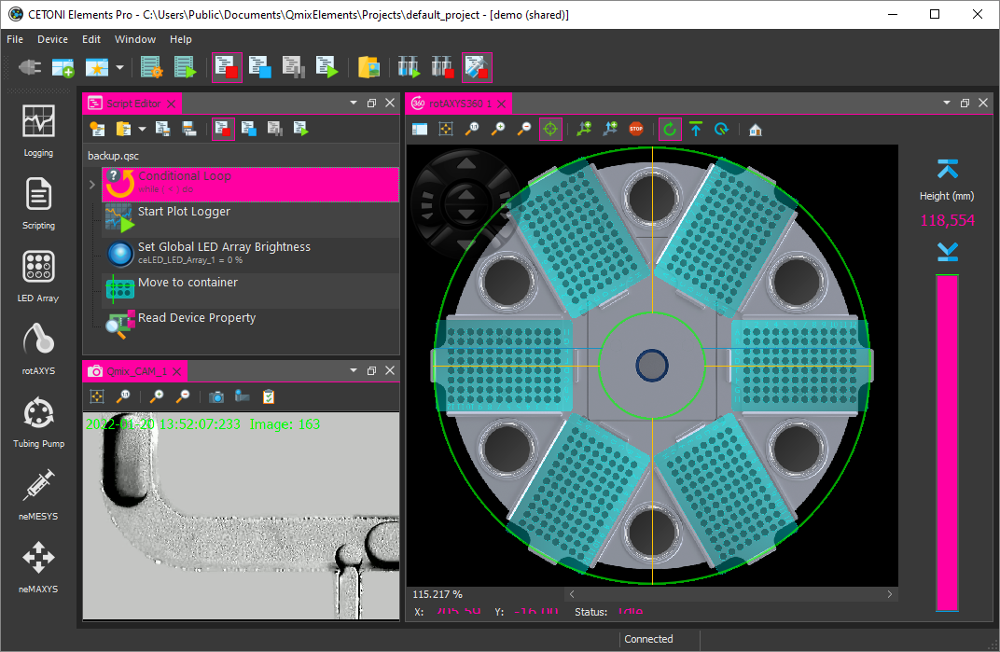

Example 2: Light design with blue accent color

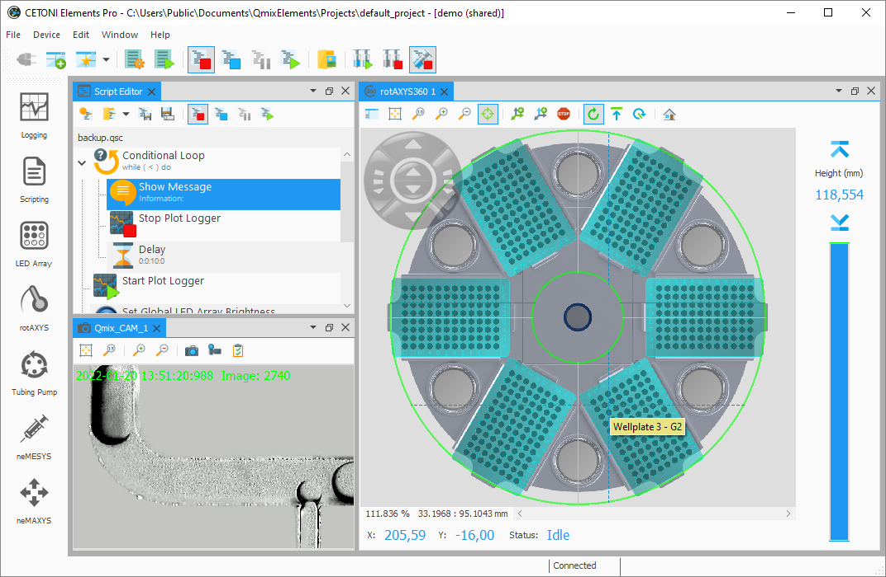

Restricting Access to the User Interface (UI)
---------------------------------------------

Introduction to UI Access configuration
~~~~~~~~~~~~~~~~~~~~~~~~~~~~~~~~~~~~~~~~~~

The software allows you to restrict access to control elements in the
software using the UI-Access- Manager. You can configure which elements
of the application are hidden for users. This may be desired, for
example, if you have written a script for other users or employees. If
you want to ensure that the devices are only operated via the script and
not manually via the user interface controls, you can hide the relevant
controls.

Configuring Access to User Interface Elements
~~~~~~~~~~~~~~~~~~~~~~~~~~~~~~~~~~~~~~~~~~~~~

To configure access to the software interface, select 
:menuselection:`Edit --> Configure UI Access` from the main menu.

|Figure 1.46: Open UI Access Configuration|

The configuration dialog
for UI access is displayed. In the first column :guinum:`❶` you can see the
elements of the user interface that you can hide and show. Within the
individual groups (e.g. workbenches) the elements are sorted
alphabetically.

In the second column :guinum:`❷` you can see the configuration of the
*Default* mode. This mode is always active when the software is started.
I.e. this mode is the mode that every user sees without special
authorizations. For each element, you can choose whether it is visible
or hidden in the interface. This way you can easily hide controls from
normal users.

|Figure 1.47: Configuration dialog for UI access configuration|

The
third column :guinum:`❸` contains the configuration of the interface for
access-protected mode. This mode is password protected. This means that
you can access this mode by entering the password and thus show
previously hidden operating elements.

.. tip::
   For the protected mode, you should set all    
   control elements to visible in order to have access to  
   them if necessary. 

You can set the password for the protected area by double-clicking in
the corresponding cell of the third column and entering the password.

|Figure 1.48: Enter password for UI access mode selection|

When you
have finished the configuration, click the :guilabel:`OK` button to close the
dialog and save the configuration.

.. admonition:: Important
   :class: note

   The configuration is saved in the        
   current project. This means that the configuration of   
   the interface is project-specific and not global. 

Switching UI Access Mode
~~~~~~~~~~~~~~~~~~~~~~~~

After starting the application, the standard mode is always active. This
means that the interface is displayed with the configuration that you
have configured for standard mode. To enter protected mode, select 
:menuselection:`Edit --> Select UI Access Mode` from the main menu.

|Figure 1.49: Switching UI Access Mode|

After selection, the interface
is immediately adapted according to the selected configuration. If you
want to leave the protected mode, open the selection dialog again and
then select the default configuration.

.. |Figure 1.1: First start of CETONI Elements – Startup Screen| image:: Pictures/1000020100000422000002BE2B654AE685AA4D8E.png

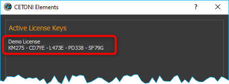

.. |image5| image:: Pictures/10000201000001ED00000145C29F8E208FCC285C.png

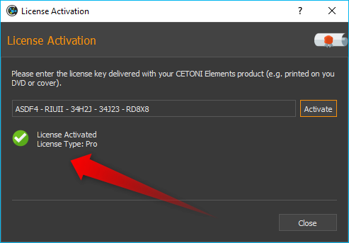

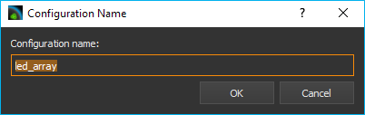

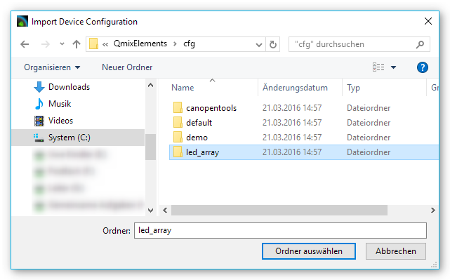

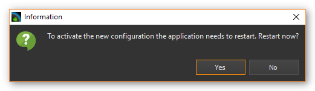

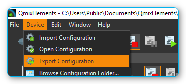

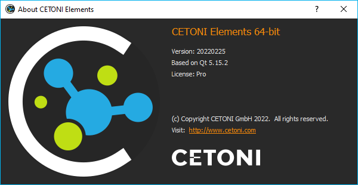

.. |Figure 1.9: Displaying Views via the Menu| image:: Pictures/10000201000001BF000000EB5BF27DBB42FBAF06.png

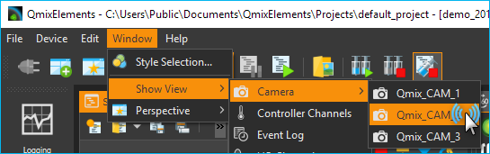

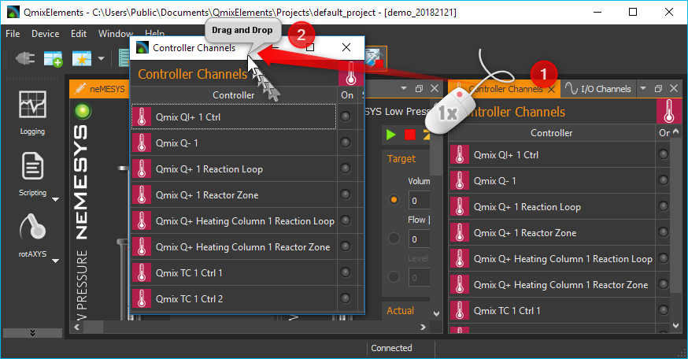

.. |Figure 1.12: Detach view from its position via context menu| image:: Pictures/10000201000001310000009DE8129AEE37B00CF4.png

.. |Figure 1.13: Drop target markers| image:: Pictures/10000201000002890000014BCF8FC8087ECC35C5.png

.. |Figure 1.14: Drop Preview Display| image:: Pictures/10000201000002890000014B5699FFD5D09BAADF.png

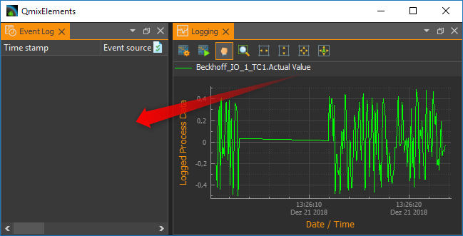

.. |Figure 1.16: View Group| image:: Pictures/1000020100000252000000C9F4392403DF96FF6D.png

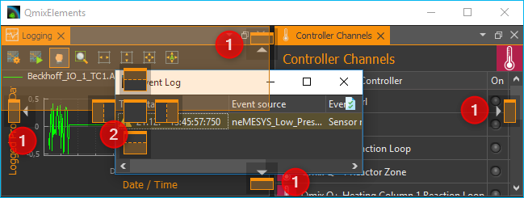

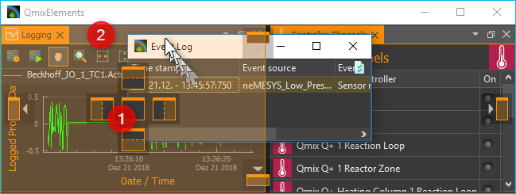

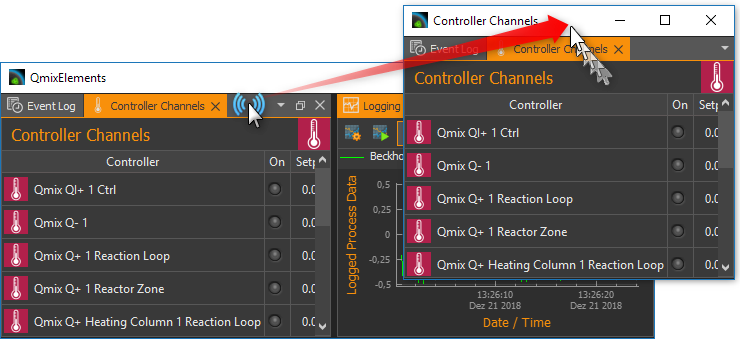

.. |Figure 1.20: Undock View Group| image:: Pictures/1000020100000264000000FC1AB96C910DA572FD.png

.. |Figure 1.21: Closing View| image:: Pictures/1000020100000264000000BF3127F5F8B75874DD.png

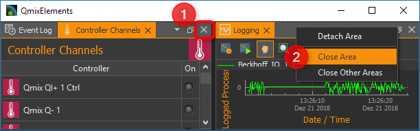

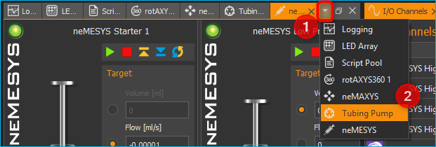

.. |Figure 1.24: Close all inactive views of a group| image:: Pictures/10000201000002000000006B0A134CD1AC8B3316.png

.. |Figure 1.26: Opening existing perspective| image:: Pictures/1000020100000220000000E4C70099429E65895A.png

.. |Figure : Create Perspective| image:: Pictures/10000201000000CA00000080463140FE0D508006.png

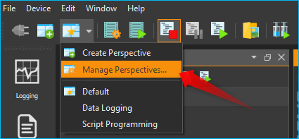

.. |Figure : Deleting Perspectives| image:: Pictures/10000201000001E4000000EAEAB5054A1B53326F.png

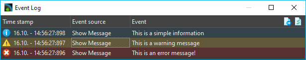

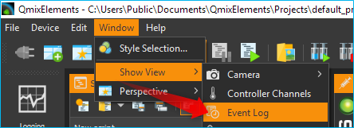

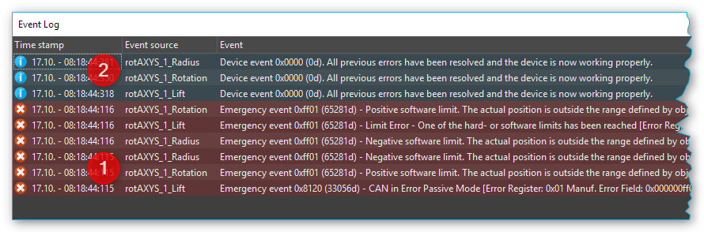

.. |Figure 1.34: Browse project folder| image:: Pictures/1000000000000189000000B4EABB56CB8A567B96.png

.. |Figure 1.35: Creating new project| image:: Pictures/1000000000000189000000B4EABB56CB8A567B96.png

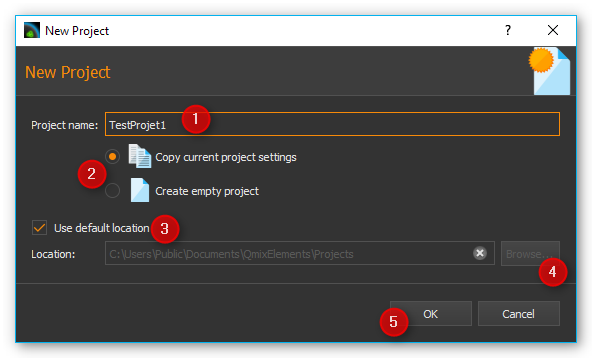

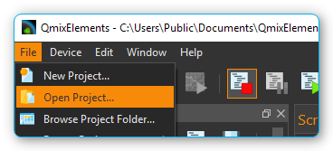

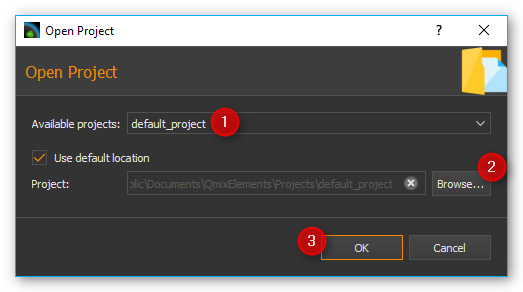

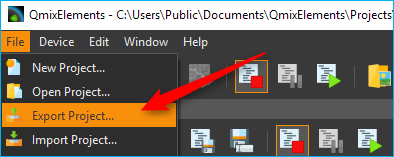

.. |Figure 1.40: Selection of project directories for export| image:: Pictures/1000020100000298000001FB7D3433258DF59F1D.png

.. |Figure 1.41: Status display project export| image:: Pictures/10000201000002E90000011C77337172831B2410.png

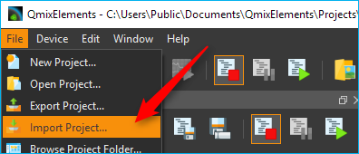

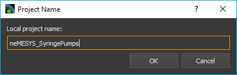

.. |Figure 1.44: Status display project import| image:: Pictures/10000201000002E90000011C77337172831B2410.png

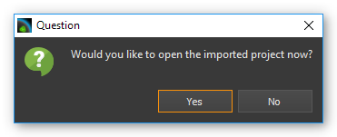

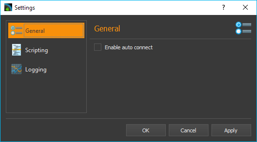

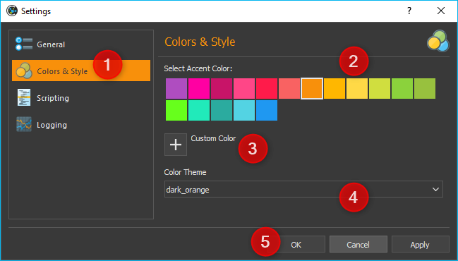

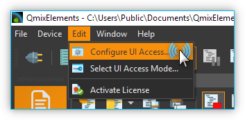

.. |Figure 1.47: Configuration dialog for UI access configuration| image:: Pictures/100002010000023700000105D086995A6867BEE3.png

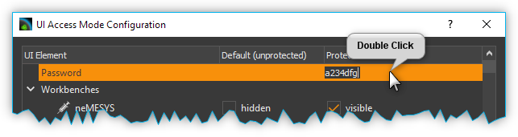

.. |Figure 1.49: Switching UI Access Mode| image:: Pictures/1000020100000156000000A7DF47A4FDADBD88ED.png

