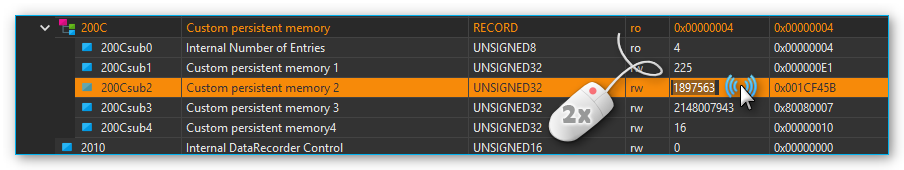

.. include:: ../include/colors.rst

CANopen Tools Plugin
====================

Introduction
------------

This plugin contains tools for accessing and configuring 
`CANopen <https://en.wikipedia.org/wiki/CANopen>`_
devices. CANopen is a standardized application for industrial automation
solutions, based on CAN. Originally, CANopen was developed to control
machine networks. Today, CANopen is used in many fields, including
medical equipment, vehicle production, shipping and public transport.

The `CANopen profile family <https://www.can-cia.org/can-knowledge/canopen/canopen-profiles/>`_ is based on a communication profile
(communication profile for industrial systems DS-301), which specifies
communication mechanisms and their description. The different device
types used in automation equipment, such as drives and controllers, are
described in device profiles. These device profiles determine the
functionality and parameters of standard devices of the respective
types. Such standardized profiles form the basis for uniform access to
CANopen devices using the `CAN bus <https://en.wikipedia.org/wiki/CAN_bus>`_. 
This makes it possible to be largely independent from particular manufacturers.

Opening CANopen Tools Project
------------------------------------

To open the CANopen Tools Workbench, load the CETONI Elements project 
:file:`canopentools`. To do this, click on the menu item 
:menuselection:`File --> Open Project` in the 
main menu of the application. Then select the project :file:`canopentools` in the 
project dialog.

.. image:: Pictures/open_canopentools_project.png

The application will restart and you should see the CANopen Tools Workbench:

.. image:: Pictures/10000201000003F10000027E5D603ADD6876B968.png

The :ref:`View <views>` of the *CANopen Tools* plugin can be displayed by 
pressing the :guilabel:`CANopen Tools` :guinum:`❶` button in the sidebar. 
The toolbar :guinum:`❷` contains important functions for accessing devices on 
the network.

The main part of the CANopen Tools Workbench is the `Object Dictionary
Editor`_ :guinum:`❸` for reading or
writing individual entries to or from the device object dictionary.

In addition, you can monitor the messages on the CAN bus in real time
with the `CAN Bus Trace Window`_ :guinum:`❹`.

Toolbar
-------

+-----------+---------------------------------------------------------+
| |image33| | Network scan – searches for connected devices           |
+-----------+---------------------------------------------------------+
| |image34| | Resets all devices                                      |
+-----------+---------------------------------------------------------+
| |image35| | Resets communication parameters of all devices          |
+-----------+---------------------------------------------------------+
| |image36| | Starts process data communication on all devices        |
+-----------+---------------------------------------------------------+
| |image37| | Sets all devices to pre-operational status              |
+-----------+---------------------------------------------------------+
| |image38| | Stops communication of all devices                      |
+-----------+---------------------------------------------------------+
| |image39| | Saves parameters of selected devices (nodes) to         |
|           | non-volatile device memory                              |
+-----------+---------------------------------------------------------+
| |image40| | Resets all parameters of selected device to factory     |
|           | values                                                  |
+-----------+---------------------------------------------------------+
| |image41| | Assigns EDS file (*Electronic Data Sheet*) to the       |
|           | selected device                                         |
+-----------+---------------------------------------------------------+
| |image42| | Export parameters of the selected CANopen node to a DCF |
|           | file                                                    |
+-----------+---------------------------------------------------------+
| |image43| | Import DCF file into the selected CANopen node          |
+-----------+---------------------------------------------------------+
| |image44| | Resets the selected device                              |
+-----------+---------------------------------------------------------+
| |image45| | Resets communication parameters on the selected device  |
+-----------+---------------------------------------------------------+
| |image46| | Starts process data communication on the selected       |
|           | device                                                  |
+-----------+---------------------------------------------------------+
| |image47| | Resets selected devices to pre-operational status       |
+-----------+---------------------------------------------------------+
| |image48| | Stops communication of the selected device              |
+-----------+---------------------------------------------------------+

Object Dictionary Editor
------------------------

What is a CANopen Object Dictionary
~~~~~~~~~~~~~~~~~~~~~~~~~~~~~~~~~~~~~~~~

The `object dictionary <https://www.can-cia.org/can-knowledge/canopen/device-architecture/>`_ 
forms the central element of the CANopen standard.
It describes the complete device functionality of a CANopen device. Each
CANopen node implements a local object dictionary. It is basically a
standardized and predefined grouping of objects that can be accessed
through the network.

Each object in the dictionary is accessed through a 16-bit index and an
8-bit sub index. The entries in the object dictionary make it possible
to access the “application objects” of a device, such as input and
output signals, device parameters, device functions or network
variables, through the network in a standardized fashion:

=========== ====================================================
Index       Object
=========== ====================================================
0000h       Reserved
0001h-009Fh Data Types
00A0h-0FFFh Reserved
1000h-1FFFh Range for communication profile DS-301
2000h-5FFFh Manufacturer-specific range
6000h-9FFFh Standardized range of the implemented device profile
A000h-FFFFh Reserved
=========== ====================================================

Simple variables can be accessed directly through the 16-bit index. In
case of data structures or arrays, the index addresses the entire data
structure. The additional 8-bit sub index allows access to individual
elements of a data structure or array.

===== ========= ========== =================
Index Sub Index Data Type  Name
===== ========= ========== =================
1000h 0         UNSIGNED32 Device type
1001h 0         UNSIGNED8  Error register
1018h           RECORD     Identity object
\     0         UNSIGNED8  Number of entries
\     1         UNSIGNED32 Vendor ID
\     2         UNSIGNED32 Product code
\     3         UNSIGNED32 Revision number
\     4         UNSIGNED32 Serial number
===== ========= ========== =================

The object dictionary is divided into two sections. The first section
contains information regarding the device, such as device
identification, manufacturer, etc. as well as communication parameters.
The second section describes the specific device functionality.

Overview of Object Dictionary Editor
~~~~~~~~~~~~~~~~~~~~~~~~~~~~~~~~~~~~~

The object dictionary editor gives you access to the object dictionaries
of all connected nodes.

.. image:: Pictures/10000201000003330000016EE2D15B95882D3316.png

The editor uses a tree-like
structure with 3 levels. Level :guinum:`❶` shows all devices detected during a
network scan. If you open a network node, you will see level :guinum:`❷` with the
complete object dictionary of that node and all its dictionary entries.
You can access simple variables in this level directly through the
index. Complex data structures or arrays have an additional level :guinum:`❸`.
Here you access individual elements of an array or data structure, using
the sub index. Entries of data structures with sub entries are
highlighted in color :guinum:`❷`.

The following overview shows you the structure once again:

.. rst-class:: inlineimg

- |image59| Devices on CAN  Bus (level 1)

   - |image60| Simple elements with direct index access (level 2) 
   - |image61| Array elements – expand to access the individual elements
   - |image62| Data structure – expand to access the individual elements

      - |image63| Individual elements of arrays or data structures

Assigning Device Names
~~~~~~~~~~~~~~~~~~~~~~

After a network scan, all devices are identified by their unique node
number (index column). In the name column you can also assign a
description of your choice in the name column to make identification
easier.

.. image:: Pictures/10000201000002430000008CAEB681CF8B2460C8.png

Using the left mouse key,
double-click on the node name field and enter a name of your choice.

Assigning an Electronic Data Sheet (EDS) 
~~~~~~~~~~~~~~~~~~~~~~~~~~~~~~~~~~~~~~~~

The object dictionaries of different nodes contain different entries.
After a network scan you will only be shown the standard entries, that
are specified according to the CANopen DS301 standard. Device profile
specific or manufacturer-specific entries are omitted. In order to
access those entries, you will need an 
`EDS-file <https://www.can-cia.org/can-knowledge/canopen/cia306/>`_ 
(electronic data sheet) for your device.

The symbol of the device in the *Index* column indicates whether a
device has already been assigned an EDS file.

========= ===============================
|image64| CAN node without EDS file
|image65| CAN node with EDS file assigned
========= ===============================

If you want to know which EDS file has been assigned to a node, simply
move the mouse over the node and wait until the help text appears. Here
you can see the complete file path of the assigned EDS file.

.. image:: Pictures/10000201000002460000009092C1BD824565BA70.png

To assign an EDS-file first select the device in the object dictionary
editor by clicking on it. Then click the Assign EDS File button in the
toolbar.

.. image:: Pictures/10000000000001DD0000004ABC7E3EDD2B1DE699.png

As an alternative, you can also open the context menu of the
object dictionary editor by doing a right mouse click and selecting
Assign EDS File from the menu.

.. image:: Pictures/1000000000000106000000E9BC693F7F2E63B9D1.png

After assigning the
EDS-file you will be able to access all device parameters.

.. admonition:: Important
   :class: note

   Configuration parameters like device     
   names or assigned EDS-files are saved automatically in  
   the project settings of the current project and are     
   restored upon relaunching the application or loading a  
   project.     

.. tip::
   Create different projects via main menu ::menuselection:`File --> Save Project`
   to be able to change quickly between  different network configurations.   

Reading/Writing Object Dictionary Entries 
~~~~~~~~~~~~~~~~~~~~~~~~~~~~~~~~~~~~~~~~~

When you click on an object dictionary entry the respective entry is
imported from the device and the values filled into the Data and Data
(hex) columns.

.. image:: Pictures/1000000000000346000000D6B28F92760EEC5015.png

To write device
parameters simply perform a double-click with your left mouse button on
the *Data* or *Data (hex)* column of the object dictionary entry you wish to
modify.

After double-clicking,
you can modify the values of the cell. When you press the enter key or
click on a different cell, the value is accepted and transferred to the
device.

.. tip::
   You can only write object dictionary entries   
   whose access type is set to read/write (**rw**) or write    
   only (**wo**). 

.. admonition:: Important
   :class: note

   Unless you saved the modified data to    
   the non-volatile device memory using the *Save           
   Parameters* function, any parameter modifications will   
   be lost when the device is turned off or reset.  

Permanently saving / restoring Device Parameters
~~~~~~~~~~~~~~~~~~~~~~~~~~~~~~~~~~~~~~~~~~~~~~~~

Any object dictionary entries you created will be lost when the device
is turned off or reset. In order to permanently save device parameters
to the non-volatile device memory, you have to click on :guilabel:`Node: Store Parameters` 
in the toolbar (see image below) after writing the entry.

.. image:: Pictures/10000000000001DD0000004A6E055D00F9054433.png

If you want to restore a device's default parameters (factory
settings), click on :guilabel:`Node: Restore Default Parameters` in the toolbar.

.. image:: Pictures/10000000000001DD0000004A09AD8BC5DCC8D0EF.png

All parameter modifications saved on the device will be lost
and replaced by the default parameters.

Exporting Device Parameters to DCF File
~~~~~~~~~~~~~~~~~~~~~~~~~~~~~~~~~~~~~~~

You can export the complete configuration of a CANopen node to a
standardized file format as a 
`DCF <https://www.can-cia.org/can-knowledge/canopen/cia306/>`_ 
(**D**\ evice **C**\ onfiguration **F**\ ile) file.

.. admonition:: Important
   :class: note

   A DCF file is an EDS file with the       
   current values of each object. This means that the DCF  
   export can only be performed for nodes with an assigned 
   EDS file.    

To start the parameter export, simply right-click on the node or on an
object directory entry of the node and select 
:menuselection:`Export DCF file` from the context menu.

.. image:: Pictures/1000020100000106000000C0C1223F79FCB7FCF2.png

Importing Device Parameters from DCF File
~~~~~~~~~~~~~~~~~~~~~~~~~~~~~~~~~~~~~~~~~

You can import the complete configuration of a CANopen node from a DCF
file.

.. admonition:: Important
   :class: note

   A DCF file is an EDS file with the       
   current values of each object. This means that the DCF  
   import can only be performed for nodes with an assigned 
   EDS file.    

To start the parameter import, simply click with the right mouse button
on the node or on an object directory entry of the node and then select
the menu item :menuselection:`Import DCF file` in the context menu.

.. image:: Pictures/1000020100000106000000C079F0109017C38F22.png

.. image:: Pictures/10001B6B000034EB000034EB8D4C652549A28ECB.svg
   :width: 60
   :align: left

After the import, the imported parameters are not yet permanently stored
in the non-volatile memory of the device. This means that you have to
save the parameters explicitly using the menu item 
:menuselection:`Node: Store Parameters`.

|

CAN Bus Trace Window
--------------------

You can use the *CAN Bus Trace* View to monitor and record messages on the
CAN bus in real time.

.. image:: Pictures/10000201000003370000015C27C8F8D8952F685B.png

The Trace View basically consists of the toolbar :guinum:`❶` and the list of
recorded messages :guinum:`❷`.

Toolbar
~~~~~~~

+-----------+---------------------------------------------------------+
| |image99| | Starts the recording of CAN messages                    |
+-----------+---------------------------------------------------------+
| |image100|| Stops the recording of CAN messages                     |
+-----------+---------------------------------------------------------+
| |image101|| Deletes all recorded messages from the trace list.      |
+-----------+---------------------------------------------------------+
| |image102|| Activates the recording of messages from all CAN nodes  |
+-----------+---------------------------------------------------------+
| |image103|| Only the messages of the currently selected node are    |
|           | recorded.                                               |
+-----------+---------------------------------------------------------+
| |image104|| Enables / disables automatic scrolling to the last      |
|           | recorded message                                        |
+-----------+---------------------------------------------------------+

The Trace-List
~~~~~~~~~~~~~~

In the trace list, all messages are displayed in chronological order, i.e. 
older messages are at the top of the list and more current messages
are at the bottom of the list. The last entry in the list is always the
last recorded message.

.. image:: Pictures/1000136300003505000035059A1E128BEDC9DA3F.svg
   :width: 60
   :align: left   

If automatic scrolling is activated, the display is always
scrolled to the last recorded message. If you want to view older
messages during recording, deactivate automatic scrolling.

|

The different types of CANopen messages are displayed differently
colored in the list to increase clarity. The following colors are used:

- **Not colored** -  PDO messages
- :blue-bg:`Blue` - Network management messages (NMT), Bootup messages   
  and messages for node monitoring (Heartbeat & Node Guarding)  
- :yellow-bg:`Yellow` – SDO messages  
- :red-bg:`Red` – Emergency messages 

You can toggle whether you want to record the messages of all nodes or
just the messages of a single node. If you activate recording for a
single node, only the messages of the node selected in the `Object
Dictionary Editor`_ are recorded.

To record messages from another node, you must select the other node in
the Object Directory Editor. Then activate the recording for all nodes
and then reactivate the recording of a single node.

CANopen Script Functions 
------------------------

The CANopen Tools Plugin provides functions for the Scripting System to
read and write object dictionary entries of connected CANopen devices.
The corresponding functions can be found in the :guilabel:`Device Functions`
category:

.. image:: Pictures/1000020100000158000000A89A88261993F414C4.png

Read Object Dictionary 
~~~~~~~~~~~~~~~~~~~~~~~~~~~~~~~~~~

.. image:: Pictures/1000194B000034EB000034EB7B47A75A95214109.svg
   :width: 60
   :align: left   

This function allows you to read an object dictionary entry
and save the read value in a script variable. Use :guilabel:`Mode` :guinum:`❶` 
to select whether you want to use the CANopen node ID (*Node ID*) to access the
device or whether you want to access the device via its device name.

.. image:: Pictures/100002010000021D000000FC3DE66CAEE52F71AE.png

If you have selected *Node ID* for :guilabel:`Mode`, enter the node
number of the CANopen device in the :guilabel:`Node ID` :guinum:`❷` field. 
For :guilabel:`Entry` :guinum:`❸`,
select the object dictionary entry to be read. This consists of
:guilabel:`Index` (hexadecimal) and :guilabel:`Sub Index` (decimal).
Then select the data type of the entry at :guinum:`❹`. Finally, enter the name 
of the variable in which
the read value is to be saved in the variable field :guinum:`❺`.

If you have selected the option *Device* :guinum:`❶` in :guilabel:`Mode` 
(figure below), click on the magnifying glass icon :guinum:`❷` to select a device:

.. image:: Pictures/10000201000001FB000000A207E3BD4716596321.png

Write Object Dictionary 
~~~~~~~~~~~~~~~~~~~~~~~~~~~~~~~~~~~

.. image:: Pictures/10001885000034EB000034EB8534DB3671A1C482.svg
   :width: 60
   :align: left  

By using this function you can write a value into an object
dictionary entry of a CANopen device. In the field :guilabel:`Data to be written`
:guinum:`❶` enter the value to be written into the object dictionary entry.
Alternatively, you can enter the name of a :ref:`script variable <variables>` 
to write its value into the object dictionary.

.. image:: Pictures/1000020100000207000001078D8A2AF6A68DB053.png

In the *Object Dictionary Entry* area, you specify the
object dictionary entry of a particular device to be written. Details on
this can be found in the documentation for the script function 
`Read Object Dictionary`_.

.. |image33| image:: Pictures/1000150E000035050000350594A875715FADE294.svg
   :width: 40
.. |image34| image:: Pictures/100012610000350500003505BCF7B72461155234.svg
   :width: 40

.. |image36| image:: Pictures/100010E600003505000035057D287A43AE7472D7.svg
   :width: 40
.. |image37| image:: Pictures/100010F00000350500003505F5CCF637DE7D15B4.svg
   :width: 40
.. |image38| image:: Pictures/100010E1000034EB000034EB9EBC95DF32459AF8.svg
   :width: 40
.. |image39| image:: Pictures/10001B6B000034EB000034EB8D4C652549A28ECB.svg
   :width: 40
.. |image40| image:: Pictures/10001A73000034EB000034EBA1DD23964A6739B9.svg
   :width: 40
.. |image41| image:: Pictures/10001990000035050000350519F690A013C6BEF6.svg
   :width: 40
.. |image42| image:: Pictures/10001EBA000034EB000034EB3A385D10D739FC42.svg
   :width: 40
.. |image43| image:: Pictures/10001F1B000034EB000034EBD79291B8EDC18AC9.svg
   :width: 40

.. |image45| image:: Pictures/10001851000034EB000034EB806EF7E8B025B249.svg
   :width: 40
.. |image46| image:: Pictures/100016D1000034EB000034EBEBCBF530A6A7D8A7.svg
   :width: 40

.. |image48| image:: Pictures/100016CC000034EB000034EB9E3ACB3C105CA82B.svg
   :width: 40

.. |image60| image:: Pictures/100009DD0000350500003505F40444FA1F9BD3DA.svg
   :width: 40

.. |image63| image:: Pictures/100009DD0000350500003505F40444FA1F9BD3DA.svg
   :width: 40

.. |image65| image:: Pictures/1000242F0000350500003505BEE3580982233F20.svg
   :width: 40
.. |image99| image:: Pictures/10000ABD00003505000035051DCB6F6FC06F28B1.svg
   :width: 40
.. |image100| image:: Pictures/100002670000350500003505E8226FE4263E52EA.svg
   :width: 40
.. |image101| image:: Pictures/1000037B000034EB000034EB530C0464875EEF84.svg
   :width: 40
.. |image102| image:: Pictures/10000D98000035050000350597A6ECFBA56F6C31.svg
   :width: 40
.. |image103| image:: Pictures/10000EF100003505000035058713F26C15E80080.svg
   :width: 40
.. |image104| image:: Pictures/1000136300003505000035059A1E128BEDC9DA3F.svg
   :width: 40
