Database Add-on
===================

The database Add-on adds SQL database support. It allows you to log process
data values into a SQL database via the SQL Data Logger and it provides support
for executing SQL queries.

SQL Database Logger
--------------------------------

The SQL database logger enables logging of process data into an SQL database.
The logger is not intended to record process data at very high sample rates but
to log important process data over a longer period of time to document
experiments or automated processes in the laboratory.

The SQL database logger supports various databases such as SQLite, MySQL or 
PostgreSQL. It has been tested with SQLite and MySQL databases.

SQL Logger Configuration Dialog
~~~~~~~~~~~~~~~~~~~~~~~~~~~~~~~~

   
When the data logging plug-in has
been loaded, the toolbar will display two additional buttons for the
configuration of the SQL database logger :guinum:`❶` and to start/stop the logging
process :guinum:`❷`.

.. image:: Pictures/sql_log_config.svg
   :width: 60
   :align: left

Click the :guilabel:`Configure SQL Logger` button to open the configuration dialog.
The following configuration dialog will be displayed:

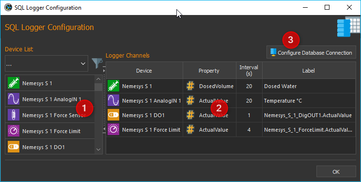

The configuration dialog contains the following elements:

.. rst-class:: guinums

#. **Device List** – displays all devices or modules that provided
   recordable data. The filter selector above is to limit the list to
   specific device types, e.g. valves.
#. **Logger Channels** – lists all channels that may be recorded by the
   logger.
#. **Configure Database Connection** – allows the user to configure the database
   settings such as database server and port.

The table :guilabel:`Logger Channels` shows the configuration of the logger. 

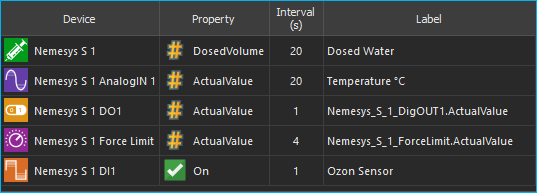

The table contains the following columns:

-  **Device** – contains the device name for which the data will be
   recorded and its device icon.
-  **Property** – this is the name of the device property/process data
   value that will be recorded. Its type (numeric or boolean) can be
   identified by the displayed icon.

   ============== ============================================
   |numeric_prop| Numeric value
   |boolean_prop| Boolean value
   |text_prop|    Text value
   ============== ============================================

-  **Interval (s)** - the sampling interval in seconds. The minimum sample time
   is 1 seconds.
-  **Label** – allows you to define a customized description for the
   selected channel.

Database Settings
~~~~~~~~~~~~~~~~~~~~~~~~~~~~~~~~

To configure the database settings, click the
:guilabel:`Configure Database Connection` button in the configuration dialog.

.. image:: Pictures/config_db_connection.png

Intially the database logger uses a SQLite database in the current project
folder for logging. The default SQLite database file is located in:

.. code-block:: bash

   C:/Users/Public/Documents/QmixElements/Projects/MyProject/Log/ProcessDataDbLog.sqlite

With the following steps you can easily find the database file

- from the application main menu select the menu item :menuselection:`File --> Browse Project Folder` 
- the project folder will be opened in Windows file explorer 
- now open the **Log** folder
- inside of the **Log** folder you should see the file :file:`ProcessDataDbLog.sqlite`

If you open the database configuration for the first time, you should see this
default configuration:

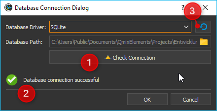

As soon as you click the :guilabel:`Check Connection` button :guinum:`❶` you should see 
the green checkmark :guinum:`❷`. Whenever you want to restore these default
settings, just click the :guilabel:`Restore default settings` button :guinum:`❸`.

If you use the **SQLite** database driver, you just need to select the database
filename. If you select any other database driver, you need to provide additional
database settings. The following picture shows the configurations settings for
a **MySQL** database:

.. image:: Pictures/mysql_db_settings.png

The following fields must be filled in:

- **Database Driver**: the database driver that matches your database
- **Server Hostname or IP**: the hostname or IP address of the server running the
  database. In this example the MySQL database runs locally and we use localhost
- **Port**: the server port number to connect to database. In this example whe
  use localhost as hostname and therefore the port does not matter
- **Database Name**: name of the database to use for data logging
- **User Name**: database user to use for database access
- **Password**: password to connect to database

As soon as you have properly entered all fields, the :guilabel:`Check Connection`
button will be enabled. Click this button, to check your database connection.
If this check succeeds, you can click :guilabel:`OK` to accept the
settings.

.. admonition:: Important
   :class: note

   The :guilabel:`Check Connection` will be enabled only, if you have entered
   values in all required fields. The :guilabel:`OK` button will be enabled
   as soon as you have successfully checked your database connection.

SQL Logger Configuration
~~~~~~~~~~~~~~~~~~~~~~~~~~~~~~~~

Step 1- Add Channels
^^^^^^^^^^^^^^^^^^^^^^^^^^^^^^^^

Drag-and-Drop the device for which you want to log the data from the
:guilabel:`Device List` :guinum:`❶` into the :guilabel:`Logger Channels` :guinum:`❷`
list. The new channel will be inserted into the list at the desired 
position (see figure below).

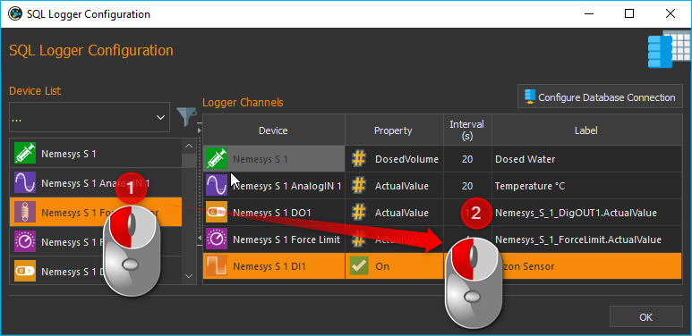

.. tip::
   To simplify the device selection, the device   
   list can be filtered according to device type. 

Step 2- Select Device Property
^^^^^^^^^^^^^^^^^^^^^^^^^^^^^^^^

In the :guilabel:`Logger Channels` list you now need to select the 
Property of the device that you want to record. For this, 
double-click into the respective field within the column :guilabel:`Property` 
and select the device property from the opening list (see figure below).

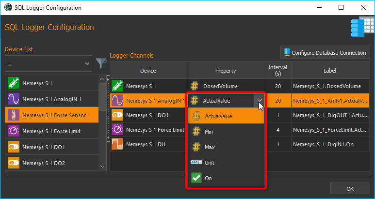

Step 3 – Configure Sample Interval
^^^^^^^^^^^^^^^^^^^^^^^^^^^^^^^^^^^^^^^^^^^^^^^^

You can set a different sample interval for each individual logger channel.
The minimum sample time is 1 second. To configure the log interval double-click
into the respective field within the column :guilabel:`Interval (s)` and enter
the interval time.

.. image:: Pictures/log_interval_config.png

.. admonition:: Important
   :class: note

   Choose a log interval that is as large   
   as possible and as small as necessary in order to       
   minimize the amount of data that needs to be recorded   
   and stored into the database.   

Step 4 – Set Channel Label
^^^^^^^^^^^^^^^^^^^^^^^^^^^^^^^^

In the column :guilabel:`Label` you can customize the description for each
channel. You can use this column to add additional information, a meaningful
name or a SI unit identifier.

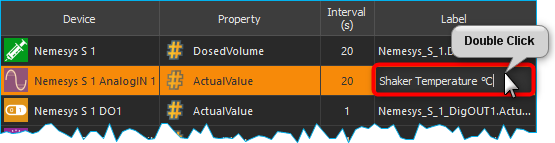

To do this, double-click
into the respective table cell within the column :guilabel:`Label` and enter
the label text.

.. admonition:: Important
   :class: note

   Upon choosing a new device property, a   
   new channel description will be assigned automatically. 
   That is, you should change the channel label only once  
   the correct device property has been selected. 

The device property and the label are separate columns in the SQL table

Deleting Channels
^^^^^^^^^^^^^^^^^^^^^^^^^^^^^^^^

Highlight the desired channels using the mouse to delete one or more
channels from the list, and then use either the :kbd:`Delete` key or the
:menuselection:`Delecte Selection` item of the right-click context menu:

|delete_key| |delete_menu|

To delete the entire channel list, use the context menu item 
:menuselection:`Clear Logger`.

Database Schema
~~~~~~~~~~~~~~~~~~~~~~~~ 

The SQL logger uses the following database schema to store its data:

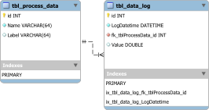

The schema consists of two tables. The first table is
the :code:`tbl_process_data` for storage of process data information. The
following code is used to create this table:

.. code-block:: sql

   CREATE TABLE IF NOT EXISTS `tbl_process_data` (
      `id` INTEGER NOT NULL PRIMARY KEY AUTO_INCREMENT,
      `Name` varchar(64) NOT NULL,
      `Label` varchar(64)
   );

The :code:`Name` column stores the process data identifiers that are build from the
device name and the selected property. The :code:`Label` column stores the value
entered in the Label column of the :guilabel:`Logger Channels` table. The
following picture shows the entered values in the *Logger Channels* table:

.. image:: Pictures/logger_channels_table_example.png

This configuration results in the following entries in the :code:`tbl_process_data`
table (screenshot from MySQL workbench):

.. image:: Pictures/mysql_tbl_process_data_example.png

Entries will never get removed from the :code:`tbl_process_data` table. If an
entry is missing, it will get added. Changing the label of a channel in the
:guilabel:`Logger Channels` table, may result in a new entry in the 
:code:`tbl_process_data`. The following example picture shows this:

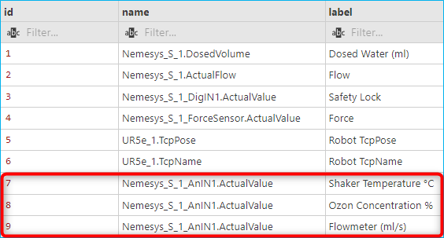

The analog input **Nemesys_S_1_AnIN1** property
**ActualValue** (process data identifier :code:`Nemesys_S_1_AnIN1.ActualValue`)
was used to log different physical quantities in various experiments: 

- the temperature of a shaker unit in °C
- the ozon concentration in %
- and the value of a flowmeter in ml/s

This shows, that a change of the :code:`Label` value results in different
database entries.

The second table is the :code:`tbl_data_log` which is used to store the actual
values read from the device properties. This table is created with the 
following SQL code:

.. code-block:: sql

   CREATE TABLE `tbl_data_log` (
      `id` INTEGER NOT NULL PRIMARY KEY AUTO_INCREMENT,
      `LogDatetime` DATETIME NOT NULL,
      `fk_tblProcessData_id` int NOT NULL,
      `Value` double NULL,
      FOREIGN KEY (fk_tblProcessData_id) REFERENCES `tbl_process_data` (`id`)
   );

   CREATE INDEX `ix_tbl_data_log_fk_tblProcessData_id` ON `tbl_data_log` (`fk_tblProcessData_id` ASC);

   CREATE INDEX `ix_tbl_data_log_LogDatetime` ON `tbl_data_log` (`LogDatetime` ASC);

The code creates the following table layout:

.. image:: Pictures/mysql_tbl_data_log.png

- **LogDatetime**: stores the date and time when the value was logged
- **fk_tblProcessDataId**: is a foreign key into the :code:`tbl_process_data`
  table to identify the process data that has been logged
- **Value**: the actual logged value

You can use SQL query language to get the logged data that you need. The 
following example SQL statement shows, how to get all logged values from the process
data labeled with **Flowmeter (ml/s)**:

.. code-block:: sql

   SELECT b.LogDatetime, a.Name, a.Label, b.Value 
   FROM tbl_data_log AS b 
   INNER JOIN tbl_process_data as a ON (b.fk_tblProcessData_id=a.id)  
   WHERE a.Label LIKE '%Flow%'

This is the resulting table from the given SQL statement:

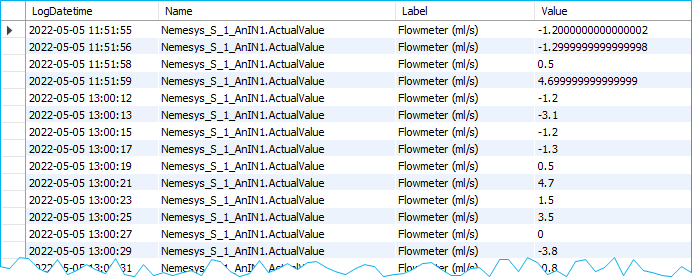

Script Functions
----------------

To automate the data logging or to synchronize data logging with
other processes, the SQL database logger can be started and stopped using
script functions. The corresponding functions can be found
in the :guilabel:`Logging` category in the list of the available script
functions.

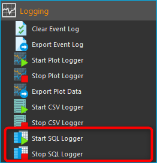

Start SQL Logger
~~~~~~~~~~~~~~~~~~~~~~~~~~~~~~~~~~~~~~~~~~~~~~~~~~~~~

This function is used to start the SQL logger with the
currently configured settings and channels.

|

Stop SQL Logger
~~~~~~~~~~~~~~~

.. image:: Pictures/sql_log_stop.svg
   :width: 60
   :align: left

This function stops logging into SQL database.

|

Trigger SQL Data Logging
~~~~~~~~~~~~~~~~~~~~~~~~~

.. image:: Pictures/sql_log_trigger.svg
   :width: 60
   :align: left

This function triggers the immediate logging of all channels of the SQL logger.
Normally the data will be logged with the configured :ref:`interval<Step 3 – Configure Sample Interval>`.
If you would like to force the immediate logging of all channels, for example
if you would like to capture the current state of all channels if a certain
event occurs, then you can use this function.

JavaScript Database Access
--------------------------------

The Database Add-on provides some functionality, to access SQL databases from
:ref:`JavaScript code <Using JavaScript>`. If you enter the :code:`help()` 
command in th JavaScript Console, you should see the database objects
such as `QSqlDatabase`_ or `QSqlQuery`_.

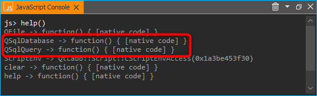

Example 1 - SQLite Database Query
~~~~~~~~~~~~~~~~~~~~~~~~~~~~~~~~~~~

The following example code shows, how to use the database objects in a 
JavaScript function to execute a SQL query for an SQLite database:

.. code-block:: javascript

   function main() {
      db = new QSqlDatabase();
      db.createConnection("QSQLITE", "JsScript");
      path = ScriptEnv.projectPath(ScriptEnv.LocationLog) + "/ProcessDataDbLog.sqlite";
      db.setDatabaseName(path);
      db.open();
      q = db.createQuery();
      result = q.exec("SELECT * FROM tbl_process_dat");
      if (!result) {
         throw new Error(q.lastError());
      }
      while (q.next()) {
         print(q.recordValues());
      }
   }

Example 2 - Create SQLite Database Schema
~~~~~~~~~~~~~~~~~~~~~~~~~~~~~~~~~~~~~~~~~~~

The following example shows, how to create the following database schema in 
an SQLite database using JavaScript code:

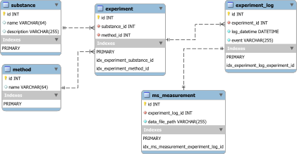

.. code-block:: javascript

   function createSchema() {
   db = new QSqlDatabase();  
   if (!db.createConnection("QSQLITE", "JsConsole")) {
      throw new Error(db.lastError);
   }
   db.setDatabaseName("C:/temp/test3.sqlite");
   if (!db.open()) {
      throw new Error(db.lastError());
   }
   q = db.createQuery();
   result = q.exec("CREATE TABLE IF NOT EXISTS substance ( " + 
      "id INTEGER NOT NULL PRIMARY KEY AUTOINCREMENT, " +
      "name TEXT, " + 
      "description TEXT)");
   if (!result) {
      throw new Error(q.lastError());
   }
   
   result = q.exec("CREATE TABLE IF NOT EXISTS method (" + 
      "id INTEGER NOT NULL PRIMARY KEY AUTOINCREMENT, " + 
      "name TEXT)");
   if (!result) {
      throw new Error(q.lastError());
   }
   
   result = q.exec("CREATE TABLE IF NOT EXISTS experiment (" + 
      "id INTEGER NOT NULL PRIMARY KEY AUTOINCREMENT, " +
      "substance_id INTEGER, " + 
      "method_id INTEGER, " +
      "FOREIGN KEY (substance_id) REFERENCES substance (id), " + 
      "FOREIGN KEY (method_id) REFERENCES method (id))");
   if (!result) {
      throw new Error(q.lastError());
   }
   
      result = q.exec("CREATE TABLE IF NOT EXISTS experiment_log (" + 
      "id INTEGER NOT NULL PRIMARY KEY AUTOINCREMENT, " + 
      "log_datatime TIMESTAMP, " + 
      "event TEXT, " + 
      "experiment_id INTEGER, " + 
      "FOREIGN KEY (experiment_id) REFERENCES experiment (id))");
   if (!result) {
      throw new Error(q.lastError());
   }
   
      result = q.exec("CREATE TABLE IF NOT EXISTS ms_measurement (" + 
      "id INTEGER NOT NULL PRIMARY KEY AUTOINCREMENT, " + 
      "data_file_path TEXT, " + 
      "FOREIGN KEY (id) REFERENCES experiment_log (id))");
   if (!result) {
      throw new Error(q.lastError());
   }
   
   return "";
   }

JavaScript API Reference
----------------------------------

QSqlDatabase
~~~~~~~~~~~~~~~~~~~~~~

.. doxygenclass:: DbPlugin::CScriptQSqlDatabase
    :project: python
    :path: ../doxygen/xml
    :members:
    :undoc-members:

QSqlQuery
~~~~~~~~~~~~~~~~~~~~~~

.. doxygenclass:: DbPlugin::CScriptQSqlQuery
    :project: python
    :path: ../doxygen/xml
    :members:
    :undoc-members:

.. |numeric_prop| image:: Pictures/numeric_property.svg
   :width: 40

.. |text_prop| image:: Pictures/text_property.svg
   :width: 40

.. |boolean_prop| image:: Pictures/boolean_property.svg
   :width: 40

.. |delete_key| image:: Pictures/delete_channel_key.png

.. |delete_menu| image:: Pictures/delete_channel_menu.png
