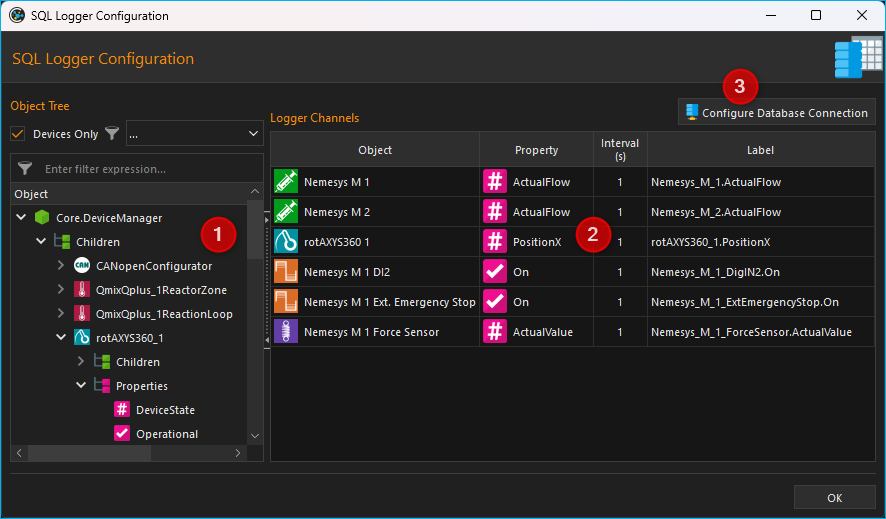
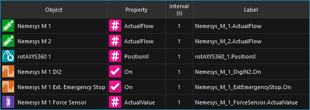
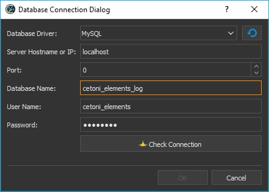
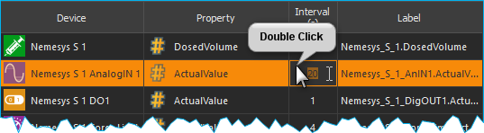
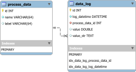
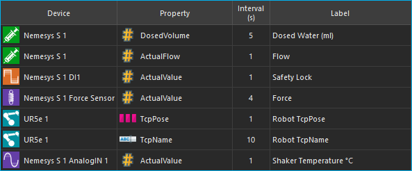

Database Add-on
===================

The database Add-on adds SQL database support. It allows you to log process
data values into a SQL database via the SQL Data Logger and it provides support
for executing SQL queries.

SQL Database Logger
--------------------------------

The SQL database logger enables logging of process data into an SQL database.
The logger is not intended to record process data at very high sample rates but
to log important process data over a longer period of time to document
experiments or automated processes in the laboratory.

The SQL database logger supports various databases such as SQLite, MySQL or 
PostgreSQL. It has been tested with SQLite and MySQL databases.

SQL Logger Configuration Dialog
~~~~~~~~~~~~~~~~~~~~~~~~~~~~~~~~

.. image:: Pictures/toolbar_sql_logger_buttons.png
   
When the data logging plug-in has
been loaded, the toolbar will display two additional buttons for the
configuration of the SQL database logger :guinum:`❶` and to start/stop the logging
process :guinum:`❷`.

Click the :guilabel:`Configure SQL Logger` button to open the configuration dialog.
The following configuration dialog will be displayed:

The configuration dialog contains the following elements:

.. rst-class:: guinums

#. **Object Tree** - The Object Tree contains a tree of all objects and their
   properties that are present in the application. You can use various filters
   to filter the object tree for specific objects. By default, only devices and
   device properties are displayed.
#. **Logger Channels** - lists all channels that may be recorded by the
   logger.
#. **Configure Database Connection** - allows the user to configure the database
   settings such as database server and port.

Object Tree
~~~~~~~~~~~~~~~~~~~~~~~~~~~~~~~~~

In the Object Tree you will find a hierarchical list of all objects
(e.g. devices) and their child objects (such as child devices):

.. image:: ../../img/datalogger/object_tree.png

.. rst-class:: guinums

1. **Object** - An object can be, for example, a device (here **Nemesys_M_1**) or 
   another application object. You will find the two elements **Children** and 
   **Properties** in each object after expanding it in the next level.

2. **Children** - The Children element groups all child objects of the parent
   object. In our example, these are all objects or devices that are
   subordinate to the device **Nemesys_M_1** or belong to this device.

3. **Properties** - The Properties element groups all properties of the parent
   object. In our example, these are all the properties of the **Nemesys_M_1**
   device that can be recorded in the logger.

4. **Child Object** - All child objects can be found in the **Children** group. 
   In the example **Nemesys_M_1**, these are, for example, the digital and
   analogue inputs and outputs of the device, such as **Nemesys_M_1_DigOUT1**. 
   These objects can in turn be expanded to display their child objects and
   properties.

5. **Property** - In the **Properties** group you will find all properties of
   the parent object. In the example of **Nemesys_M_1**, these are, for example, 
   the properties **SyringeFillLevel** or **ActualFlow**. You can simply
   drag and drop these properties into the channel list to record their values.

Filtering the Object Tree
~~~~~~~~~~~~~~~~~~~~~~~~~~~~~~~~~

Above the object tree you will find various filters with which you can filter 
the object tree according to certain criteria. The :guilabel:`Devices Only` :guinum:`❶`
checkbox is activated by default. This means that only devices that are managed
by the internal device manager (:guilabel:`Core.DeviceManager`) are displayed in
the object tree. If you deactivate this checkbox, other application objects are
displayed in the object tree.

If the :guilabel:`Devices Only`:guinum:`❶` checkbox is activated, a selection 
box :guinum:`❷` is displayed with which you can filter the device tree according
to a specific device type. In the illustration below, for example, the tree was 
filtered for syringe pumps:

.. image:: ../../img/datalogger/object_tree_filter.png

In addition, you will find an input field :guinum:`❸` directly above the object tree,
with which you can filter the object tree according to a specific term, e.g. a 
device name or a device property. In the image below, for example, a filter has
been set for the device property **ActualFlow**. This means that only objects
or devices with this property are displayed in the object tree:

.. image:: ../../img/datalogger/object_tree_filter_text.png

List of Logger Channels
~~~~~~~~~~~~~~~~~~~~~~~~~~~~~~

The table :guilabel:`Logger Channels` shows the configuration of the logger. 

The table contains the following columns:

-  **Object** - contains the name of the object from which the value of a
   certain property is to be recorded and the icon of the object.
-  **Property** - this is the name of the object property/process data
   value that will be recorded. Its type (numeric or boolean) can be
   identified by the displayed icon.

   ============== ============================================
   |icon-num|     Numeric value
   |icon-bool|    Boolean value
   |icon-text|    Text value
   |icon-array|   Data Array
   |icon-struct|  Data Structure
   |icon-obj|     Object
   ============== ============================================

-  **Interval (s)** - the sampling interval in seconds. The minimum sample time
   is 1 seconds.
-  **Label** - allows you to define a customized description for the
   selected channel.

Database Settings
~~~~~~~~~~~~~~~~~~~~~~~~~~~~~~~~

To configure the database settings, click the
:guilabel:`Configure Database Connection` button in the configuration dialog.

.. image:: Pictures/config_db_connection.png

Intially the database logger uses a SQLite database in the current project
folder for logging. The default SQLite database file is located in:

.. code-block:: bash

   C:/Users/Public/Documents/QmixElements/Projects/MyProject/Log/ProcessDataDbLog.sqlite

With the following steps you can easily find the database file

- from the application main menu select the menu item :menuselection:`File --> Browse Project Folder` 
- the project folder will be opened in Windows file explorer 
- now open the **Log** folder
- inside of the **Log** folder you should see the file :file:`ProcessDataDbLog.sqlite`

If you open the database configuration for the first time, you should see this
default configuration:

.. image:: Pictures/default_db_settings.png

As soon as you click the :guilabel:`Check Connection` button :guinum:`❶` you should see 
the green checkmark :guinum:`❷`. Whenever you want to restore these default
settings, just click the :guilabel:`Restore default settings` button :guinum:`❸`.

If you use the **SQLite** database driver, you just need to select the database
filename. If you select any other database driver, you need to provide additional
database settings. The following picture shows the configurations settings for
a **MySQL** database:

The following fields must be filled in:

- **Database Driver**: the database driver that matches your database
- **Server Hostname or IP**: the hostname or IP address of the server running the
  database. In this example the MySQL database runs locally and we use localhost
- **Port**: the server port number to connect to database. In this example whe
  use localhost as hostname and therefore the port does not matter
- **Database Name**: name of the database to use for data logging
- **User Name**: database user to use for database access
- **Password**: password to connect to database

As soon as you have properly entered all fields, the :guilabel:`Check Connection`
button will be enabled. Click this button, to check your database connection.
If this check succeeds, you can click :guilabel:`OK` to accept the
settings.

.. admonition:: Important
   :class: note

   The :guilabel:`Check Connection` will be enabled only, if you have entered
   values in all required fields. The :guilabel:`OK` button will be enabled
   as soon as you have successfully checked your database connection.

SQL Logger Configuration
~~~~~~~~~~~~~~~~~~~~~~~~~~~~~~~~

Step 1 - Add Channels
^^^^^^^^^^^^^^^^^^^^^^^^^^^^^^^^

Drag-and-Drop the object property you want to record from the
:guilabel:`Object Tree` into the :guilabel:`Logger Channels` list. 
The new channel is inserted in the line where you release the mouse button 
(see figure below).

.. image:: ../../img/datalogger/csv_logger_drag_and_drop.png

.. tip::
   To simplify the selection of an object property, you can filter the object
   tree according to various criteria.

Step 2 - Configure Sample Interval
^^^^^^^^^^^^^^^^^^^^^^^^^^^^^^^^^^^^^^^^^^^^^^^^

You can set a different sample interval for each individual logger channel.
The minimum sample time is 1 second. To configure the log interval double-click
into the respective field within the column :guilabel:`Interval (s)` and enter
the interval time.

.. admonition:: Important
   :class: note

   Choose a log interval that is as large   
   as possible and as small as necessary in order to       
   minimize the amount of data that needs to be recorded   
   and stored into the database.   

Step 3 - Set Channel Label
^^^^^^^^^^^^^^^^^^^^^^^^^^^^^^^^

In the column :guilabel:`Label` you can customize the description for each
channel. You can use this column to add additional information, a meaningful
name or a SI unit identifier.

.. image:: Pictures/log_label_config.png

To do this, double-click
into the respective table cell within the column :guilabel:`Label` and enter
the label text.

.. admonition:: Important
   :class: note

   Upon choosing a new device property, a   
   new channel description will be assigned automatically. 
   That is, you should change the channel label only once  
   the correct device property has been selected. 

The object property and the label are separate columns in the SQL table

Deleting Channels
^^^^^^^^^^^^^^^^^^^^^^^^^^^^^^^^

Highlight the desired channels using the mouse to delete one or more
channels from the list, and then use either the :kbd:`Delete` key or the
:menuselection:`Delecte Selection` item of the right-click context menu:

|delete_key| |delete_menu|

To delete the entire channel list, use the context menu item 
:menuselection:`Clear Logger`.

Database Schema
~~~~~~~~~~~~~~~~~~~~~~~~ 

The SQL logger uses the following database schema to store its data:

The schema consists of two tables. The first table is
the :code:`process_data` for storage of process data information. The
following code is used to create this table:

.. code-block:: sql

   CREATE TABLE IF NOT EXISTS `process_data` (
      `id` INTEGER NOT NULL PRIMARY KEY AUTO_INCREMENT,
      `name` varchar(64) NOT NULL,
      `label` varchar(64)
   );

The :code:`name` column stores the process data identifiers that are build from the
device name and the selected property. The :code:`label` column stores the value
entered in the Label column of the :guilabel:`Logger Channels` table. The
following picture shows the entered values in the *Logger Channels* table:

This configuration results in the following entries in the :code:`process_data`
table (screenshot from MySQL workbench):

.. image:: Pictures/mysql_tbl_process_data_example.png

Entries will never get removed from the :code:`process_data` table. If an
entry is missing, it will get added. Changing the label of a channel in the
:guilabel:`Logger Channels` table, may result in a new entry in the 
:code:`process_data`. The following example picture shows this:

.. image:: Pictures/mysql_tbl_process_data_labels.png

The analog input **Nemesys_S_1_AnIN1** property
**ActualValue** (process data identifier :code:`Nemesys_S_1_AnIN1.ActualValue`)
was used to log different physical quantities in various experiments: 

- the temperature of a shaker unit in °C
- the ozon concentration in %
- and the value of a flowmeter in ml/s

This shows, that a change of the :code:`Label` value results in different
database entries.

The second table is the :code:`data_log` which is used to store the actual
values read from the device properties. This table is created with the 
following SQL code:

.. code-block:: sql

   CREATE TABLE `data_log` (
      `id` INTEGER NOT NULL PRIMARY KEY AUTO_INCREMENT,
      `log_datetime` DATETIME NOT NULL,
      `process_data_id` int NOT NULL,
      `value` double NULL,
      `value_str` TEXT
      FOREIGN KEY (process_data_id) REFERENCES `process_data` (`id`)
   );

   CREATE INDEX `idx_data_log_process_data_id` ON `data_log` (`process_data_id` ASC);

   CREATE INDEX `idx_data_log_log_datetime` ON `data_log` (`log_datetime` ASC);

The code creates the following table layout:

.. image:: Pictures/mysql_tbl_data_log.png

- **log_datetime**: stores the date and time when the value was logged
- **process_data_id**: is a foreign key into the :code:`process_data`
  table to identify the process data that has been logged
- **value**: the actual logged value if it is a numeric or boolean value
  
   ============== ============================================
   |icon-num|     Numeric value
   |icon-bool|    Boolean value
   ============== ============================================

- **value_str**: a string of the logged value - this can be used to record 
  non-numeric values such as text, data arrays, data structures or any other 
  data types.

   ============== ============================================
   |icon-text|    Text value
   |icon-array|   Data Array
   |icon-struct|  Data Structure
   |icon-obj|     Object
   ============== ============================================

You can use SQL query language to get the logged data that you need. The 
following example SQL statement shows, how to get all logged values from the process
data labeled with **Flowmeter (ml/s)**:

.. code-block:: sql

   SELECT b.log_datetime, a.name, a.label, b.value 
   FROM data_log AS b 
   INNER JOIN process_data as a ON (b.process_data_id=a.id)  
   WHERE a.label LIKE '%Flowmeter%'

This is the resulting table from the given SQL statement:

.. image:: Pictures/mysql_tbl_log_data_query.png

Script Functions
----------------

To automate the data logging or to synchronize data logging with
other processes, the SQL database logger can be started and stopped using
script functions. The corresponding functions can be found
in the :guilabel:`Logging` category in the list of the available script
functions.

.. image:: Pictures/sql_logger_script_functions.png

Start SQL Logger
~~~~~~~~~~~~~~~~~~~~~~~~~~~~~~~~~~~~~~~~~~~~~~~~~~~~~

.. image:: Pictures/sql_log_start.svg
   :width: 60
   :align: left

This function is used to start the SQL logger with the
currently configured settings and channels.

|

Stop SQL Logger
~~~~~~~~~~~~~~~

.. image:: Pictures/sql_log_stop.svg
   :width: 60
   :align: left

This function stops logging into SQL database.

|

Trigger SQL Data Logging
~~~~~~~~~~~~~~~~~~~~~~~~~

.. image:: Pictures/sql_log_trigger.svg
   :width: 60
   :align: left

This function triggers the immediate logging of all channels of the SQL logger.
Normally the data will be logged with the configured :ref:`interval<Step 3 – Configure Sample Interval>`.
If you would like to force the immediate logging of all channels, for example
if you would like to capture the current state of all channels if a certain
event occurs, then you can use this function.

JavaScript Database Access
--------------------------------

The Database Add-on provides some functionality, to access SQL databases from
:ref:`JavaScript code <Using JavaScript>`. If you enter the :code:`help()` 
command in th JavaScript Console, you should see the database objects
such as `QSqlDatabase`_ or `QSqlQuery`_.

.. image:: Pictures/database_help.png

Example 1 - SQLite Database Query
~~~~~~~~~~~~~~~~~~~~~~~~~~~~~~~~~~~

The following example code shows, how to use the database objects in a 
JavaScript function to execute a SQL query for an SQLite database:

.. code-block:: javascript

   function main() {
      db = new QSqlDatabase();
      db.createConnection("QSQLITE", "JsScript");
      path = ScriptEnv.projectPath(ScriptEnv.LocationLog) + "/ProcessDataDbLog.sqlite";
      db.setDatabaseName(path);
      db.open();
      q = db.createQuery();
      result = q.exec("SELECT * FROM tbl_process_dat");
      if (!result) {
         throw new Error(q.lastError());
      }
      while (q.next()) {
         print(q.recordValues());
      }
   }

Example 2 - Create SQLite Database Schema
~~~~~~~~~~~~~~~~~~~~~~~~~~~~~~~~~~~~~~~~~~~

The following example shows, how to create the following database schema in 
an SQLite database using JavaScript code:

.. code-block:: javascript

   function createSchema() {
   db = new QSqlDatabase();  
   if (!db.createConnection("QSQLITE", "JsConsole")) {
      throw new Error(db.lastError);
   }
   db.setDatabaseName("C:/temp/test3.sqlite");
   if (!db.open()) {
      throw new Error(db.lastError());
   }
   q = db.createQuery();
   result = q.exec("CREATE TABLE IF NOT EXISTS substance ( " + 
      "id INTEGER NOT NULL PRIMARY KEY AUTOINCREMENT, " +
      "name TEXT, " + 
      "description TEXT)");
   if (!result) {
      throw new Error(q.lastError());
   }
   
   result = q.exec("CREATE TABLE IF NOT EXISTS method (" + 
      "id INTEGER NOT NULL PRIMARY KEY AUTOINCREMENT, " + 
      "name TEXT)");
   if (!result) {
      throw new Error(q.lastError());
   }
   
   result = q.exec("CREATE TABLE IF NOT EXISTS experiment (" + 
      "id INTEGER NOT NULL PRIMARY KEY AUTOINCREMENT, " +
      "substance_id INTEGER, " + 
      "method_id INTEGER, " +
      "FOREIGN KEY (substance_id) REFERENCES substance (id), " + 
      "FOREIGN KEY (method_id) REFERENCES method (id))");
   if (!result) {
      throw new Error(q.lastError());
   }
   
      result = q.exec("CREATE TABLE IF NOT EXISTS experiment_log (" + 
      "id INTEGER NOT NULL PRIMARY KEY AUTOINCREMENT, " + 
      "log_datatime TIMESTAMP, " + 
      "event TEXT, " + 
      "experiment_id INTEGER, " + 
      "FOREIGN KEY (experiment_id) REFERENCES experiment (id))");
   if (!result) {
      throw new Error(q.lastError());
   }
   
      result = q.exec("CREATE TABLE IF NOT EXISTS ms_measurement (" + 
      "id INTEGER NOT NULL PRIMARY KEY AUTOINCREMENT, " + 
      "data_file_path TEXT, " + 
      "FOREIGN KEY (id) REFERENCES experiment_log (id))");
   if (!result) {
      throw new Error(q.lastError());
   }
   
   return "";
   }

JavaScript API Reference
----------------------------------

QSqlDatabase
~~~~~~~~~~~~~~~~~~~~~~

.. doxygenclass:: DbPlugin::CScriptQSqlDatabase
    :project: python
    :path: ../doxygen/xml
    :members:
    :undoc-members:

QSqlQuery
~~~~~~~~~~~~~~~~~~~~~~

.. doxygenclass:: DbPlugin::CScriptQSqlQuery
    :project: python
    :path: ../doxygen/xml
    :members:
    :undoc-members:

.. |icon-num| image:: ../../img/datalogger/property_number.svg
   :width: 40
.. |icon-bool| image:: ../../img/datalogger/property_bool.svg
   :width: 40
.. |icon-text| image:: ../../img/datalogger/property_text.svg
   :width: 40

.. |delete_key| image:: Pictures/delete_channel_key.png

.. |delete_menu| image:: Pictures/delete_channel_menu.png
