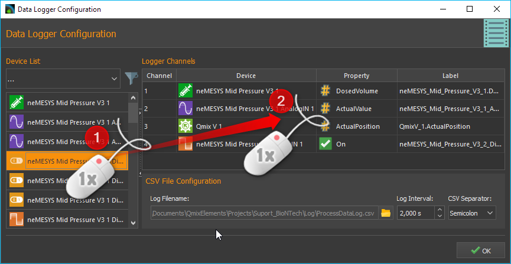
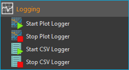

CSV Data Logger Plugin
======================

Introduction
------------

The data logger plug-in provides the user with a powerful tool to record
any of the data provided by connected devices in a user-defined time
interval. Data are written into a CSV file (CSV:
comma/character-separated values). This text file format is commonly
used to save and exchange simply-structured data.

.. tip::
   CSV files can be opened and worked with in     
   spreadsheet applications, such as Microsoft Excel if the 
   correct value-separating and decimal sign has been used.

Configuration Dialogue
----------------------

Open the Configuration Dialogue
~~~~~~~~~~~~~~~~~~~~~~~~~~~~~~~

|Figure 1: Toolbar for data logging.|

When the data logging plug-in has
been loaded, the toolbar will display two additional buttons for the
configuration of the logging of data :guinum:`❶` and to start/stop the logging
process :guinum:`❷`.

Overview Data Logger Plug-in
~~~~~~~~~~~~~~~~~~~~~~~~~~~~

Once the data logging configuration has been activated, the following
configuration dialogue will be displayed:

|image4|

The configuration dialogue contains the following elements:

.. rst-class:: guinums

1. **Device List** – displays all devices or modules that provided
   recordable data. The filter selector above is to limit the list to
   specific device types, e.g. valves.
2. **Logger Channels** – lists all channels that may be recorded by the
   logger.
3. **CSV File Configuration** – allows the user to set various settings
   for the data logging file.

Overview Table Logger-Channels
~~~~~~~~~~~~~~~~~~~~~~~~~~~~~~

.. image:: Pictures/100002010000028A00000098C8649B9656E2A140.png

The table :guilabel:`Logger Channels` shows the configuration of the process data
logger. Each row in that table corresponds to one column in the recorded
csv file. The following columns may be recorded:

-  **Channel** – shows the channel number of the corresponding channel.
-  **Device** – contains the device name for which the data will be
   recorded and its device icon.
-  **Property** – this is the name of the device property/process data
   value that will be recorded. Its type (numeric or boolean) can be
   identified by the displayed icon.

   ======== =============
   |image5| Numeric value
   |image6| Boolean value
   |image7| Text value
   ======== =============

-  **Label** – allows you to define a customized description for the
   selected channel. This description will be used as the column header
   in the csv file.

In order to add a channel to the data logging process, simply follow the
steps below.

Logger Configuration
------------------------------------

Step 1- Adding of Channels
~~~~~~~~~~~~~~~~~~~~~~~~~~

Drag-and-Drop the device for which you want to log the data from the
:guilabel:`Device List` into the :guilabel:`Logger Channels` list. 
The new channel will be inserted into the list at the desired 
position (see figure below).

.. tip::
   To simplify the device selection, the device   
   list can be filtered according to device type. 

Step 2- Select Device Property
~~~~~~~~~~~~~~~~~~~~~~~~~~~~~~

In the :guilabel:`Logger Channels` list you now need to select the 
Property of the device that you want to record. For this, 
double-click into the respective filed within the column :guilabel:`Property` 
and select the device property from the opening list (see figure below).

|Figure 4: Selecting the device property that is to be recorded.|

Step 3 – Channel Description
~~~~~~~~~~~~~~~~~~~~~~~~~~~~~

In the column :guilabel:`Label` you can customize the description for each
channel. This label will be used as the column header of the csv file
for the selected channel.

|Figure 5: Customizing the channel label.|

To do this, double-click
into the respective table cell that is to be changed and insert the new
description (see figure above).

.. admonition:: Important
   :class: note

   Upon choosing a new device property, a   
   new channel description will be assigned automatically. 
   That is, you should change the channel label only once  
   the correct device property has been selected. 

Deleting Channels
~~~~~~~~~~~~~~~~~

Highlight the desired channels using the mouse to delete one or more
channels from the list, and then use either the :kbd:`Delete` key or the
:menuselection:`Delecte Selection` item of the right-click context menu:

|image14| |image15|

To delete the entire channel list, use the context menu item 
:menuselection:`Clear Logger`.

Step 4 – Configuration of CSV Properties
~~~~~~~~~~~~~~~~~~~~~~~~~~~~~~~~~~~~~~~~

In the :guilabel:`CSV File Configuration` section you can set the global
properties of the CSV logger as well as the format of the recorded data
(see figure below).

|Figure 6: Configuration of global csv properties|

Select File Name and Folder
^^^^^^^^^^^^^^^^^^^^^^^^^^^^^

Set the file name and location of the log file via :guilabel:`Log Filename` 
:guinum:`❶`. For this, click on the folder symbol on the right, select the target
folder and give a file name.

|Figure 7: Setting file name and folder for the log file.|

Setting the Recording Interval
^^^^^^^^^^^^^^^^^^^^^^^^^^^^^^^^^

Set the time interval at which the data of all channels is to be
recorded via the field :guilabel:`Log Interval` :guinum:`❷`. The time unit for the interval
is seconds and you may set it in 0.1 second increments.

.. admonition:: Important
   :class: note

   Choose the recording interval as large   
   as possible and as small as necessary. This will        
   minimize amount of data that will be recorded.

Set the Separating Character
^^^^^^^^^^^^^^^^^^^^^^^^^^^^

The character that will be used to separate individual data (columns)
needs to be set via the selection field :guilabel:`CSV Separator` 
:guinum:`❸`. Depending on the software that is to be used for data 
evaluation, the character that needs to be used may change.

.. tip::
   To obtain a CSV file that can be imported     
   into Microsoft Excel, the semicolon (;) should be used.

.. admonition:: Important
   :class: note

   All configuration settings of the        
   process data logger will be saved upon closing the      
   configuration dialogue and are available when the       
   application will be restarted. 

Start/Stop of the Logging Process
---------------------------------

.. image:: Pictures/1000106B000034EB000034EBCD48AF0AC896EFC6.svg
   :width: 60
   :height: 60
   :align: left

Use the relevant toolbar button to start and stop the data
logging process.

A new data file will be created each time the logging process is
started. A time stamp with date and time will be added as a suffix to
file name :file:`_YYYYMMDD_hhmmss`. That means, if the file name
:file:`ProcessDataLog.csv` has been assigned by the user, starting the logging
process on November 05, 2012 at 10:32 am and 9 secondswill create a
logging file with the name :file:`ProcessDataLog_20121105_103209.csv.` 
This ensures, that a new logging file with a unique time stamp will be
created each time the logging process is started.

Log File Data Format
--------------------

The recorded CSV files have the following structure:

-  Each CSV file consists of multiple data sets organized in rows and
   separated by line breaks.
-  Each data set consists of a number of data fields (columns) that are
   separated by a specific character (e.g., semicolon).
-  The first column always contains the relative time point (in seconds)
   of the corresponding data set.
-  The first row shows the channel labels as configured by the user.

|Figure 8: CSV log file opened in Microsoft Excel.|

To obtain the
absolute time stamp for a data set, you may simply add an extra column
to the spreadsheet and calculate the time by adding the data set's
relative time to the absolute time given in the file names time stamp.

.. tip::
   The absolute time stamp at which logging      
   started is given in the file name of the log file. 

Script Functions
----------------

To automate the capture of data or to synchronize data capture with
other processes, the CSV data logger can be started and stopped using
script functions. The corresponding functions can be found
in the :guilabel:`Logging` category in the list of the available script
functions.

|Figure 9: Logger script functions|

Start CSV Logger
~~~~~~~~~~~~~~~~~~~~~~~~~~~~~~~~~~~~~~~~~~~~~~~~~~~~~

.. image:: Pictures/1000106B000034EB000034EBCD48AF0AC896EFC6.svg
   :width: 60
   :height: 60
   :align: left

This function is used to start the CSV logger with the
currently configured settings and channels. A new log file is created
with the current time stamp.

|

Stop CSV Logger
~~~~~~~~~~~~~~~

.. image:: Pictures/1000101A000034EB000034EB2614684FE9CC8E2D.svg
   :width: 60
   :height: 60
   :align: left

This function stops the current logging and closes the open
log file.

.. |Figure 1: Toolbar for data logging.| image:: Pictures/10000201000001B600000043E638CC3BBADD620A.png

.. |image4| image:: Pictures/100002010000038700000200BEF606624A304EEC.png

.. |image5| image:: Pictures/100004EA000035050000350581CFD983D12D425F.svg
   :width: 40

.. |image6| image:: Pictures/1000034B000035050000350585C9BEED447C4FB8.svg
   :width: 40

.. |image7| image:: Pictures/10000B740000350500003505221106A05ED7DC85.svg
   :width: 40

.. |Figure 4: Selecting the device property that is to be recorded.| image:: Pictures/1000020100000361000001A38444A253627EAD70.png

.. |Figure 5: Customizing the channel label.| image:: Pictures/10000201000002670000009030B373AFA6AF1077.png

.. |image15| image:: Pictures/10000000000001220000008F424E5926A933056B.png

.. |Figure 6: Configuration of global csv properties| image:: Pictures/10000201000002740000005D7814BAB01380FB40.png

.. |Figure 7: Setting file name and folder for the log file.| image:: Pictures/100000000000028F000001D742CE00F60CA536D2.png

.. |Figure 8: CSV log file opened in Microsoft Excel.| image:: Pictures/10000000000002EF000000E6889ECE76397F99EB.png

