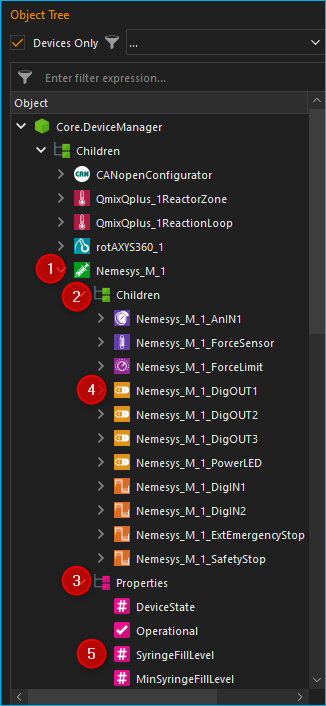
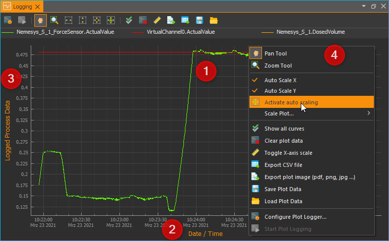
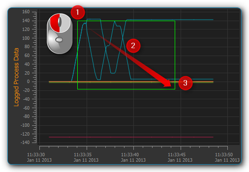
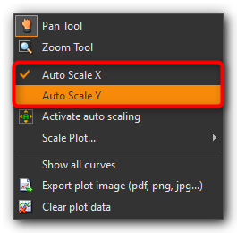
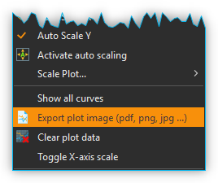
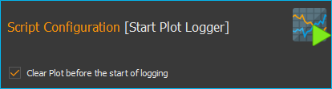
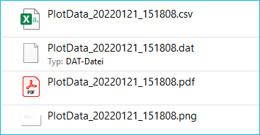

Graphical Data Logger
=======================

Introduction
------------

In addition to recording data in CSV files, you can use the Datalogger plug-in
to record process data in diagrams and thus graphically visualise the changes
in these process data over time in real time. Use the push button
:guilabel:`Logging` :guinum:`❶` (see figure below) in the sidebar to display 
the process data graphs or show the logging view via the main menu 
::menuselection:`Window --> ShowView --> Logging` :guinum:`❷`.

To display the process data diagrams, click on the :guilabel:`Logging` button
:guinum:`❶` in the sidebar (see figure below) or show the Logging View via the
main menu ::menuselection:`Window --> ShowView --> Logging` :guinum:`❷`.

|image1|

The main elements of the process data graph area are as
follows:

.. rst-class:: guinums

1. **Logging button** - Click this to show the process data graphs.
2. **View Menu**- this can also be used to show and hide the process data
   graph
3. **Graph canvas** - This displays the curves of all process data sets
   that are being recorded.
4. **Legend** - The legend lists all data sets that are displayed with
   their respective colors. Here you can toggle between whether or not a
   curve is being displayed.
5. **Toolbar** - Here you find buttons to configure the data logging, to
   start and stop the recording and to navigate the display.

Toolbar
-------

+-----------+---------------------------------------------------------+
| |image32| | Opens the configuration dialog of the graphic process   |
|           | data logger.                                            |
+-----------+---------------------------------------------------------+
| |image33| | Toggles the recording of process data.                  |
+-----------+---------------------------------------------------------+
| |image34| | Panning tool to move the currently displayed section of |
|           | the graph.                                              |
+-----------+---------------------------------------------------------+
| |image35| | Draws a zoom-in frame to enlarge a desired area of the  |
|           | graph.                                                  |
+-----------+---------------------------------------------------------+
| |image36| | Auto-scales the X axis to fit all process data on the   |
|           | screen.                                                 |
+-----------+---------------------------------------------------------+
| |image37| | Auto-scales the Y axis to fit all process data on the   |
|           | screen.                                                 |
+-----------+---------------------------------------------------------+
| |image38| | Auto-scales both X and Y axes to fit all process data   |
|           | on the screen.                                          |
+-----------+---------------------------------------------------------+
| |image39| | Activates auto-scaling: during a recording, both x- and |
|           | y-axes are continuously rescaled to fit all process     |
|           | data on the screen.                                     |
+-----------+---------------------------------------------------------+
| |image40| | Show all curves. If curves are hidden, they are         |
|           | displayed again.                                        |
+-----------+---------------------------------------------------------+
| |image41| | Clear plot data. Deletes all data from the diagram.     |
+-----------+---------------------------------------------------------+
| |image42| | Toggle X-axis scale. Skalierung umschalten. This        |
|           | switches the scaling of the X-axis between absolute     |
|           | date/time stamp and relative time in seconds and        |
|           | milliseconds since the start of recording.              |
+-----------+---------------------------------------------------------+
| |image43| | Export plot image. Exports an image of the currently    |
|           | displayed section.                                      |
+-----------+---------------------------------------------------------+
| |image44| | Export CSV-File. Exports all data of the plot as CSV    |
|           | file                                                    |
+-----------+---------------------------------------------------------+
| |image45| | Saves the plot data to a file that can later be         |
|           | reloaded into the plot                                  |
+-----------+---------------------------------------------------------+
| |image46| | Loads previously saved plot data                        |
+-----------+---------------------------------------------------------+

Configuration Dialog
--------------------

Overview
~~~~~~~~

.. image:: Pictures/10002F2F000034EB000034EBDBA40A7FF6EF8292.svg
   :width: 60
   :height: 60
   :align: left

Click on the button :guilabel:`Configure process data graph` in the
toolbar to open the configuration dialog. This opens
the *Plot Logger Configuration* dialog that contains the following main
sections:

.. image:: ../../img/datalogger/graph_logger_configuration_dialog.png

.. rst-class:: guinums

1. **Object Tree** - The Object Tree contains a tree of all objects and their
   properties that are present in the application. You can use various filters
   to filter the object tree for specific objects. By default, only devices and
   device properties are displayed.
   
2. **Logger Channels** - lists all channels that may be recorded by the
   logger.
   
3. **Logger Configuration** - in this section you find various settings
   to configure the data recording.

Object Tree
~~~~~~~~~~~~~~~~~~~~~~~~~~~~~~~~~

In the Object Tree you will find a hierarchical list of all objects
(e.g. devices) and their child objects (such as child devices):

.. rst-class:: guinums

1. **Object** - An object can be, for example, a device (here **Nemesys_M_1**) or 
   another application object. You will find the two elements **Children** and 
   **Properties** in each object after expanding it in the next level.

2. **Children** - The Children element groups all child objects of the parent
   object. In our example, these are all objects or devices that are
   subordinate to the device **Nemesys_M_1** or belong to this device.

3. **Properties** - The Properties element groups all properties of the parent
   object. In our example, these are all the properties of the **Nemesys_M_1**
   device that can be recorded in the logger.

4. **Child Object** - All child objects can be found in the **Children** group. 
   In the example **Nemesys_M_1**, these are, for example, the digital and
   analogue inputs and outputs of the device, such as **Nemesys_M_1_DigOUT1**. 
   These objects can in turn be expanded to display their child objects and
   properties.

5. **Property** - In the **Properties** group you will find all properties of
   the parent object. In the example of **Nemesys_M_1**, these are, for example, 
   the properties **SyringeFillLevel** or **ActualFlow**. You can simply
   drag and drop these properties into the channel list to record their values.

Filtering the Object Tree
~~~~~~~~~~~~~~~~~~~~~~~~~~~~~~~~~

Above the object tree you will find various filters with which you can filter 
the object tree according to certain criteria. The :guilabel:`Devices Only` :guinum:`❶`
checkbox is activated by default. This means that only devices that are managed
by the internal device manager (:guilabel:`Core.DeviceManager`) are displayed in
the object tree. If you deactivate this checkbox, other application objects are
displayed in the object tree.

If the :guilabel:`Devices Only`:guinum:`❶` checkbox is activated, a selection 
box :guinum:`❷` is displayed with which you can filter the device tree according
to a specific device type. In the illustration below, for example, the tree was 
filtered for syringe pumps:

.. image:: ../../img/datalogger/object_tree_filter.png

In addition, you will find an input field :guinum:`❸` directly above the object tree,
with which you can filter the object tree according to a specific term, e.g. a 
device name or a device property. In the image below, for example, a filter has
been set for the device property **ActualFlow**. This means that only objects
or devices with this property are displayed in the object tree:

.. image:: ../../img/datalogger/object_tree_filter_text.png

List of Logger Channels
~~~~~~~~~~~~~~~~~~~~~~~~~~~

.. image:: ../../img/datalogger/logger_channels_view.png

The channel :guilabel:`Logger Channels` list shows the configuration of the 
graphical logger in tabular form. Each line in the table corresponds to exactly
one curve in the diagram, i.e. one logger channel. The following columns are available:

-  **Object** - contains the name of the object from which the value of a
   certain property is to be recorded and the icon of the object.
-  **Property** - this is the name of the object property/process data
   value that will be recorded. Its type (numeric or boolean) can be
   identified by the displayed icon.

   ============ =================
   |icon-num|   Numeric value
   |icon-bool|  Boolean value
   |icon-text|  Text value
   ============ =================

-  **Label** - allows you to define a customized label for the
   selected channel. This label will also be used in the legend of the plotted
   graph.

In order to add a channel to the data logging process, simply follow the
steps below:

Logger Configuration
----------------------

Add Logger Channels
~~~~~~~~~~~~~~~~~~~~~~~~~~~~~~

:step:`Step 1- Adding of Channels`

.. image:: ../../img/datalogger/graph_logger_drag_and_drop.png

Drag-and-Drop the object property you want to record from the
:guilabel:`Object Tree` into the :guilabel:`Logger Channels` list. 
The new channel is inserted in the line where you release the mouse button 
(see figure below).

.. tip::
   To simplify the selection of an object property, you can filter the object
   tree according to various criteria.

:step:`Step 2 - Setting the Channel Label`

In the column :guilabel:`Label` you can customize the label for each
channel. This label will later be displayed in the legend of the graph as the
label of the curve.

.. image:: ../../img/datalogger/log_channel_label.png

To do this, double-click
into the respective table cell that is to be changed and insert the new
label text (see figure above).

.. admonition:: Important
   :class: note

   Upon choosing a new device property, a   
   new channel description will be assigned automatically. 
   That is, you should change the channel label only once  
   the correct device property has been selected. 

:step:`Step 3 - Defining the Recording Interval`

In the :guilabel:`Log Interval` field in the :guilabel:`Logger Configuration`
area, you can define the interval at which new measured values are to be recorded. 
You can set the interval with a resolution of 0.1 seconds.

.. admonition:: Important
   :class: note

   Choose a log interval that is as large   
   as possible and as small as necessary in order to       
   minimize the amount of data that needs to be recorded   
   and transmitted by the system.        

Deleting Channels
~~~~~~~~~~~~~~~~~

Highlight the desired channels using the mouse to delete one or more
channels from the list, and then use either the :kbd:`Delete` key or the
:menuselection:`Delecte Selection` item of the right-click context menu:

|image58| |image59|

To delete the entire channel list, use the context menu item 
:menuselection:`Clear Logger`.

Start/Stop Data Logging
-----------------------

.. image:: Pictures/10001A4C000034EB000034EBE789A979D3788852.svg
   :width: 60
   :height: 60
   :align: left

The data logging process may be started/stopped via the
relevant button in the toolbar.

|

Diagram Navigation & Use
------------------------

Diagram Navigation Overview
~~~~~~~~~~~~~~~~~~~~~~~~~~~~~~~

The processdata graphing plug-in offers a number of possibilities to
customize the way data are displayed. This includes resizing parts of a
curve and showing or hiding individual curves.

The diagram consists of a
plot area :guinum:`❶` plus both an X-axis (time) :guinum:`❸` and a Y-axis
(process data) :guinum:`❹`. The time axis shows date and time as absolute values.
The process-data
axis shows the respective measurement data; it is without units as it
potentially represents a variety of very different values and
measurement units.

A right mouse click within the plot area will open a context menu :guinum:`❷` 
with a number of additional functions.

Changing the Displayed Section
~~~~~~~~~~~~~~~~~~~~~~~~~~~~~~

.. image:: Pictures/100005C7000035050000350518807CBDF5FF2BAE.svg
   :width: 60
   :height: 60
   :align: left

The *Pan Tool* provides you with a simple way to move the
displayed section of the plot area. It may be activated via its toolbar
button and the displayed section may then be moved around using the
mouse whilst keeping the left button pressed.

.. admonition:: Important
   :class: note

   Panning of the displayed plot section    
   will deactivate the auto-scaling of the diagram axes. 

Display Curve Values
~~~~~~~~~~~~~~~~~~~~

When the *Pan Tool* is active, you can move the mouse pointer over a
curve to display the value at that specific position.

.. image:: Pictures/100002010000024C000000D8EF633321C7CB7321.png

Zooming via the Mouse Wheel
~~~~~~~~~~~~~~~~~~~~~~~~~~~~~~~~~~~~~~~~~~~~~~~~~~~~~~~~~~~

Turning the mouse wheel whilst the pointer is within the plot area will
allow you to adjust the displayed section of a graph by increasing
(zooming in) or decreasing (zooming out) its zoom level.

========= ===================================
|image68| Increase zoom level (zoom in)
|image69| Decrease zoom level (zoom out)
========= ===================================

Display Section
~~~~~~~~~~~~~~~~~~~~~~~~~~

.. image:: Pictures/1000100A000034EB000034EBFC7CEEC6D6B20A4B.svg
   :width: 60
   :height: 60
   :align: left

The *Zoom Tool* allows you to directly select a specific area
of the plot and increase its resolution. To do this, please proceed as
follows (see figure below):

|

.. rst-class:: guinums

#. Using the mouse, left-click-and-hold into the plot area to set the
   first corner of the zoom frame.
#. Move the mouse pointer to define the size of the frame as desired.
#. Releasing the mouse button will finalize the size of the frame. The
   selected area will be scaled to the current graph size (zoom in).

Auto-Fit & Auto-Scale
~~~~~~~~~~~~~~~~~~~~~

The toolbar and the context menu both contain a number of tools to
adjust what is displayed in the diagram, in particular to ensure that
all or specific data are visible.

The following possibilities exist:

+-----------+---------------------------------------------------------+
| |image79| | Rescales the X axis to display all current time data    |
|           | values for a given process data resolution.             |
+-----------+---------------------------------------------------------+
| |image80| | Rescales the Y axis to display all current process data |
|           | values within a given time period.                      |
+-----------+---------------------------------------------------------+
| |image81| | Rescales both X and Y axes to display all currently     |
|           | available data.                                         |
+-----------+---------------------------------------------------------+
| |image82| | (Re-)activates auto-scaling: as long as data are being  |
|           | recorded, both X and Y axes will be adjusted            |
|           | dynamically to ensure all data are being displayed.     |
+-----------+---------------------------------------------------------+

You may also activate auto-scaling for X and Y axes individually via the
context menu:

.. admonition:: Important
   :class: note

   Zooming or panning within the displayed  
   plot section will deactivate auto-scaling.  

Show/Hide Individual Curves
~~~~~~~~~~~~~~~~~~~~~~~~~~~

To improve scaling and visibility, you may show or hide individual
curves. To do this, right-click the desired item in the plot legend and
select the desired function to either hide the corresponding curve only
:menuselection:`Hide Curve` or all other but the corresponding curve
:menuselection:`Show only this curve` as indicated in the figure below.

.. image:: Pictures/10000000000001A40000005CD26CCB4A8D0DF1F9.png

To revert to displaying all
curves, activate the context menu from within the plot area and select
the menu item :menuselection:`Show all curves` (see figure below).

.. image:: Pictures/1000000000000109000001041C877E8A24D5AB94.png

Select Curve Color
~~~~~~~~~~~~~~~~~~

To choose a different curve color, right click an item in the plot
legend. From the context menu select the menu item :menuselection:`Select Color`
(see figure below).

.. image:: Pictures/10000000000002100000007CF77B5C49CD7E0D88.png

In the color
selection dialog which is now shown (figure below), you can choose any
color.

.. image:: Pictures/100002010000020A000001B855540FDC883B53CF.png

Exporting Plot Image
~~~~~~~~~~~~~~~~~~~~

.. image:: Pictures/10001855000034EB000034EBA6C6DA993124AA4C.svg
   :width: 60
   :height: 60
   :align: left

You may export a picture of the current diagram using the
right-click context menu and selecting :menuselection:`Export plot image`.

|

This will open a dialog box (see figure below) to define the location (folder)
where the image is to be saved:

.. image:: Pictures/1000000000000293000001D6F3848773F9BE9543.png

Please enter a name for the image file :guinum:`❶` and select the desired file
type :guinum:`❷`. The export function supports standard image file formats
:file:`png, jpg...` as well as scalable vector graphic formats :file:`pdf, svg...`.

To close the dialog and to start the image export, click :guilabel:`Save` :guinum:`❸`.

CSV Export
~~~~~~~~~~

.. image:: Pictures/10000FBE000034EB000034EB9506C15D6D175810.svg
   :width: 60
   :height: 60
   :align: left

You can export all diagram data to a CSV file using the
:menuselection:`Export CSV file` menu item.

|

Deleting of Diagram Data
~~~~~~~~~~~~~~~~~~~~~~~~

.. image:: Pictures/100019CB000035050000350509AD2B23340F765E.svg
   :width: 60
   :height: 60
   :align: left

You may clear the plot area and delete all data recorded
since the start of the present recording using the context menu item
:menuselection:`Clear plot data`. Recording will resume from this point.

.. image:: Pictures/100002010000010D000000D1835EC0ADB6A09475.png

Switching the scaling of the X-axis
~~~~~~~~~~~~~~~~~~~~~~~~~~~~~~~~~~~

.. image:: Pictures/100018130000350500003505CADD59D81E3150FD.svg
   :width: 60
   :height: 60
   :align: left

You can switch the scaling of the X-axis between two
different modes. By default, the X axis displays an absolute date/time
stamp.

|

.. image:: Pictures/100002010000022B0000006E35B772A9B9B293D2.png

You can switch the X-axis to display the relative time in seconds and
milliseconds. This means that the event **t0** marks the point in
time at which the recording was started.

.. image:: Pictures/100002010000022B000000660DDD07486701950A.png

To toggle the axis, right-click in the diagram and select
:menuselection:`Toggle X-axis scale` from the context menu.

.. image:: Pictures/100002010000010D000000C7FB8978837EA08B41.png

Saving plot data
~~~~~~~~~~~~~~~~

.. image:: Pictures/1000040D000035050000350542F550057A626C6D.svg
   :width: 60
   :height: 60
   :align: left

If you click the :guilabel:`Save Plot Data` button, all plot data will
be saved to a file :file:`*.dat` that can be loaded back into the plot
later.

|

Loading plot data
~~~~~~~~~~~~~~~~~

.. image:: Pictures/1000044C000035050000350571A7475A9B633EF8.svg
   :width: 60
   :height: 60
   :align: left

By clicking the :guilabel:`Load Plot Data` button, plot data that was
previously saved with :guilabel:`Save Plot Data` can be loaded back into the
plot. Only the curves that are present in the current configuration of
the logger are loaded. I.e. if you record data, save it with *Save Plot
Data* and load it again later, the logger configuration should be
identical when saving and loading. If you change the logger
configuration between saving and loading, e.g. remove channels, not all
curves may be loaded.

Script Functions
----------------

.. image:: Pictures/10000201000001330000006F1CA99CCDC5308AD8.png

To automate the capture of data or
to synchronize data capture with other processes, the graphical plot
logger can be started and stopped using script functions.
The corresponding functions can be found in the :guilabel:`Logging` category in
the list of the available script functions.

Start Plot Logger
~~~~~~~~~~~~~~~~~

.. image:: Pictures/10001A4C000034EB000034EBE789A979D3788852.svg
   :width: 60
   :height: 60
   :align: left

This function is used to start the graphical logger with the
currently configured settings and channels. The current content of the
plot is not deleted.

|

Check :guilabel:`Clear Plot before the start of logging` if you want to clear all
plot data before logging. Starts.

Stop Plot Logger
~~~~~~~~~~~~~~~~

.. image:: Pictures/100019EB000034EB000034EBA805BBEA9A6F9422.svg
   :width: 60
   :height: 60
   :align: left

This function stops the current logging of process data into
the process data plot.

|

Export Plot Data
~~~~~~~~~~~~~~~~

.. image:: Pictures/10001130000035050000350554D46258E4776750.svg
   :width: 60
   :height: 60
   :align: left

This function allows you to export the plot data to different
formats. In the configuration area you can choose the file name and the
saving location by clicking on the folder icon :guinum:`❶`. For the saving
location, you should keep the default location within the project
folder.

In the :guilabel:`Export Formats` :guinum:`❷` area, select all formats you want the plot data
to be exported in. The software saves the files with the selected file
name + timestamp + the file extension of the export format (see example
in figure below):

.. |image1| image:: Pictures/10000201000002AB000001ABF50BD6283D944D83.png

.. |image32| image:: Pictures/10002F2F000034EB000034EBDBA40A7FF6EF8292.svg
   :width: 40

.. |image33| image:: Pictures/10001A4C000034EB000034EBE789A979D3788852.svg
   :width: 40

.. |image34| image:: Pictures/100005C7000035050000350518807CBDF5FF2BAE.svg
   :width: 40

.. |image35| image:: Pictures/1000100A000034EB000034EBFC7CEEC6D6B20A4B.svg
   :width: 40

.. |image36| image:: Pictures/10000AAD0000350500003505B065E97D3266EBF3.svg
   :width: 40

.. |image37| image:: Pictures/10000AA70000350500003505B68BB28A6EC24106.svg
   :width: 40

.. |image38| image:: Pictures/10000D410000350500003505737D2F8FEABFA448.svg
   :width: 40

.. |image39| image:: Pictures/10001744000034EB000034EBD90F77816321BB6E.svg
   :width: 40

.. |image40| image:: Pictures/1000032600003505000035052A2D87EA9B64D7C0.svg
   :width: 40
   
.. |image41| image:: Pictures/100019CB000035050000350509AD2B23340F765E.svg
   :width: 40
   
.. |image42| image:: Pictures/100018130000350500003505CADD59D81E3150FD.svg
   :width: 40
   
.. |image43| image:: Pictures/10001855000034EB000034EBA6C6DA993124AA4C.svg
   :width: 40
   
.. |image44| image:: Pictures/10000FBE000034EB000034EB9506C15D6D175810.svg
   :width: 40
   
.. |image45| image:: Pictures/1000040D000035050000350542F550057A626C6D.svg
   :width: 40
   
.. |image46| image:: Pictures/1000044C000035050000350571A7475A9B633EF8.svg
   :width: 40

.. |image58| image:: Pictures/100000000000012100000091DA9FF37806721579.png

.. |image69| image:: Pictures/Mouse_Wheel_down.png
   :width: 80

.. |image79| image:: Pictures/10000AAD0000350500003505B065E97D3266EBF3.svg
   :width: 40

.. |image80| image:: Pictures/10000AA70000350500003505B68BB28A6EC24106.svg
   :width: 40

.. |image81| image:: Pictures/10000D410000350500003505737D2F8FEABFA448.svg
   :width: 40

.. |image82| image:: Pictures/10001744000034EB000034EBD90F77816321BB6E.svg
   :width: 40

.. |icon-num| image:: ../../img/datalogger/property_number.svg
   :width: 40
.. |icon-bool| image:: ../../img/datalogger/property_bool.svg
   :width: 40
.. |icon-text| image:: ../../img/datalogger/property_text.svg
   :width: 40