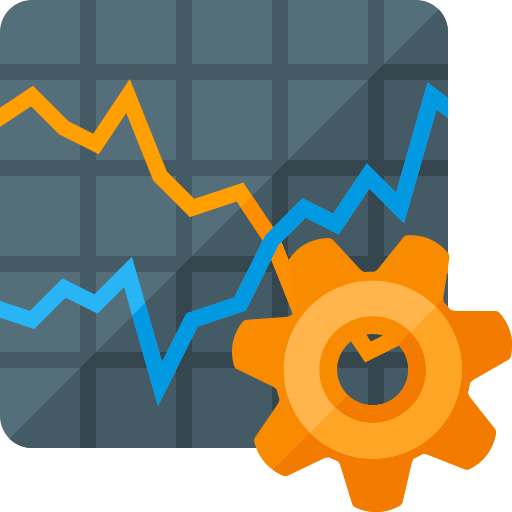
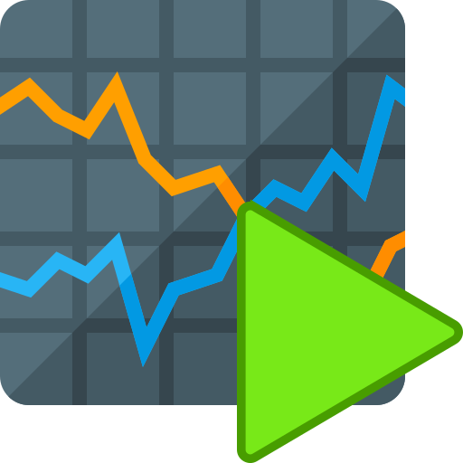
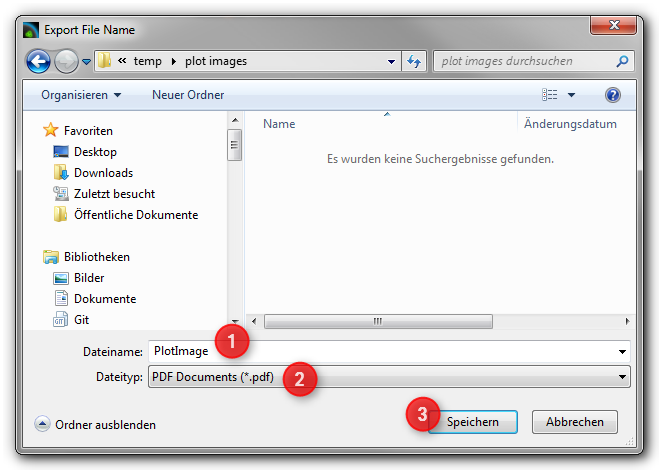
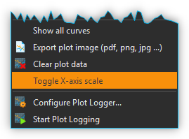
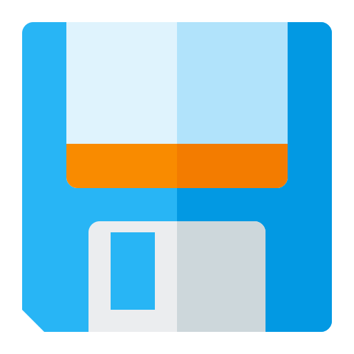
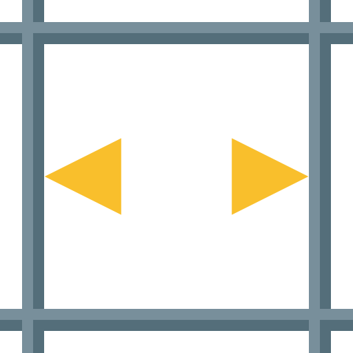

Process Data Graph
==================

Introduction
------------

In addition to the ability to record data in CSV files, the data logger
plug-in allows you to visualize process data. This allows for real-time
visualization of, e.g., process data changes. Use the push button
:guilabel:`Logging` :guinum:`❶` (see figure below) in the sidebar to display 
the process data graphs or show the logging view via the main menu 
::menuselection:`Window --> ShowView --> Logging` :guinum:`❷`.

|image1|

The main elements of the process data graph area are as
follows:

.. rst-class:: guinums

1. **Logging button** – Click this to show the process data graphs.
2. **View Menu**- this can also be used to show and hide the process data
   graph
3. **Graph canvas** – This displays the curves of all process data sets
   that are being recorded.
4. **Legend** – The legend lists all data sets that are displayed with
   their respective colors. Here you can toggle between whether or not a
   curve is being displayed.
5. **Toolbar** – Here you find buttons to configure the data logging, to
   start and stop the recording and to navigate the display.

Toolbar
-------

+-----------+---------------------------------------------------------+
| |image32| | Opens the configuration dialog of the graphic process   |
|           | data logger.                                            |
+-----------+---------------------------------------------------------+
| |image33| | Toggles the recording of process data.                  |
+-----------+---------------------------------------------------------+
| |image34| | Panning tool to move the currently displayed section of |
|           | the graph.                                              |
+-----------+---------------------------------------------------------+
| |image35| | Draws a zoom-in frame to enlarge a desired area of the  |
|           | graph.                                                  |
+-----------+---------------------------------------------------------+
| |image36| | Auto-scales the X axis to fit all process data on the   |
|           | screen.                                                 |
+-----------+---------------------------------------------------------+
| |image37| | Auto-scales the Y axis to fit all process data on the   |
|           | screen.                                                 |
+-----------+---------------------------------------------------------+
| |image38| | Auto-scales both X and Y axes to fit all process data   |
|           | on the screen.                                          |
+-----------+---------------------------------------------------------+
| |image39| | Activates auto-scaling: during a recording, both x- and |
|           | y-axes are continuously rescaled to fit all process     |
|           | data on the screen.                                     |
+-----------+---------------------------------------------------------+
| |image40| | Show all curves. If curves are hidden, they are         |
|           | displayed again.                                        |
+-----------+---------------------------------------------------------+
| |image41| | Clear plot data. Deletes all data from the diagram.     |
+-----------+---------------------------------------------------------+
| |image42| | Toggle X-axis scale. Skalierung umschalten. This        |
|           | switches the scaling of the X-axis between absolute     |
|           | date/time stamp and relative time in seconds and        |
|           | milliseconds since the start of recording.              |
+-----------+---------------------------------------------------------+
| |image43| | Export plot image. Exports an image of the currently    |
|           | displayed section.                                      |
+-----------+---------------------------------------------------------+
| |image44| | Export CSV-File. Exports all data of the plot as CSV    |
|           | file                                                    |
+-----------+---------------------------------------------------------+
| |image45| | Saves the plot data to a file that can later be         |
|           | reloaded into the plot                                  |
+-----------+---------------------------------------------------------+
| |image46| | Loads previously saved plot data                        |
+-----------+---------------------------------------------------------+

Configuration Dialog
--------------------

Overview
~~~~~~~~

Click on the button :guilabel:`Configure process data graph` in the
toolbar to open the configuration dialog. This opens
the *Plot Logger Configuration* dialog that contains the following main
sections:

|Figure 1: Configuration dialog of the graphic data logger|

.. rst-class:: guinums

1. **Device List** – shows all devices that return data that may be
   logged. The filter selection box allows to pre-select a specific
   device type (e.g., valves).
2. **Plot Curves**– lists all data series or curves that are being
   recorded and displayed in the diagram.
3. **Logger Configuration** – in this section you find various settings
   to configure the data recording.

Plot Curves Table
~~~~~~~~~~~~~~~~~~~~

|image48|

*Plot Curves* tabulates the selected configuration of the
graphic data logger. Each row represents exactly one curve in the
diagram. The following columns are shown:

-  **Channel** – returns the channel number.
-  **Device** – lists the device name for each respective channel
   including its icon.
-  **Property** – shows the property of the respective device that is to
   be recorded. The data type is identified via a data-type specific
   icon.

   ========= ===============
   |image49| Numerical value
   |image50| Boolean value
   |image51| Text value
   ========= ===============

-  **Label** – allows you to define a user-specific name for each channel.
   This label will also be used in the legend of the plotted graph.

To add and configure process data channels to the display logger, please
proceed as detailed in the following sections.

Configure data logging
----------------------

Step 1 – Adding Channels
~~~~~~~~~~~~~~~~~~~~~~~~

|Figure 2: Adding a channel to the channel list|

To add a channel you first have to add the relevant device to the *Device List*\ of the *Plot
Logger Configuration.* To do this, move the relevant item from the
device list to the :guilabel:`Plot Curves` table using Drag-&-Drop. The new
channel will be added at the position where you release the mouse button
(see figure below).

.. tip::
   To simplify the device selection process, the 
   device list may be filtered for a relevant device type. 

Step 2 – Selecting the Device Property
~~~~~~~~~~~~~~~~~~~~~~~~~~~~~~~~~~~~~~

Select the device property that you want to record by double clicking
into the :guilabel:`Property` field of the respective channel from
:guilabel:`Plot Curves` table. This will display a drop-down list with all available
device properties from which you may select the desired item (see figure
below).

|Figure 3: Selecting the device property to be recorded|

Step 3 – Changing the Channel Label
~~~~~~~~~~~~~~~~~~~~~~~~~~~~~~~~~~~~~~~~~

You may give a recorded property a customized name by changing the
description in the column :guilabel:`Label`. This label will also be used to
identify the respective curve in the diagram. To do this, double click
into the respective field (see figure below) and type the new
description.

.. image:: Pictures/1000020100000267000000901D707E009D7DE34A.png

.. admonition:: Important
   :class: note

   When a different device property is      
   being selected, a new channel label will be assigned    
   automatically. Therefore, the channel label should be   
   changed after the device property has been selected.   

Deleting Channels
~~~~~~~~~~~~~~~~~

In order to delete one or multiple channels from the :guilabel:`Plot Curves`
list, first you have to mark the respective channels using the
computer mouse. Now you may use either the keyboard's :kbd:`Delete` key or
select the relevant item :menuselection:`Delete Selection` from the right-click
context menu.

|image58| |image59|

You may also delete the entire list in a single step by using the
:menuselection:`Clear Logger` item of the context menu.

Step 4 – Defining the Recording Interval
~~~~~~~~~~~~~~~~~~~~~~~~~~~~~~~~~~~~~~~~

|Figure 5: Configuration of the data logger interval|

The :guilabel:`Log Interval` input box in the :guilabel:`Logger Configuration` 
section is to define the time interval at which data points for all channels are 
to be recorded. The minimum resolution is 0.1 seconds.

.. admonition:: Important
   :class: note

   Choose a log interval that is as large   
   as possible and as small as necessary in order to       
   minimize the amount of data that needs to be recorded   
   and transmitted by the system.        

The configuration will be saved and reloaded automatically upon exiting
the *Plot Logger Configuration* dialog.

Start/Stop Data Logging
-----------------------

The data logging process may be started/stopped via the
relevant button in the toolbar.

|

Diagram Navigation & Use
------------------------

Diagram Navigation Overview
~~~~~~~~~~~~~~~~~~~~~~~~~~~~~~~

The processdata graphing plug-in offers a number of possibilities to
customize the way data are displayed. This includes resizing parts of a
curve and showing or hiding individual curves.

|Figure 6: The process-data diagram section|

The diagram consists of a
plot area :guinum:`❶` plus both an X-axis (time) :guinum:`❸` and a Y-axis
(process data) :guinum:`❹`. The time axis shows date and time as absolute values.
The process-data
axis shows the respective measurement data; it is without units as it
potentially represents a variety of very different values and
measurement units.

A right mouse click within the plot area will open a context menu :guinum:`❷` 
with a number of additional functions.

Changing the Displayed Section
~~~~~~~~~~~~~~~~~~~~~~~~~~~~~~

The *Pan Tool* provides you with a simple way to move the
displayed section of the plot area. It may be activated via its toolbar
button and the displayed section may then be moved around using the
mouse whilst keeping the left button pressed.

.. admonition:: Important
   :class: note

   Panning of the displayed plot section    
   will deactivate the auto-scaling of the diagram axes. 

Display Curve Values
~~~~~~~~~~~~~~~~~~~~

When the *Pan Tool* is active, you can move the mouse pointer over a
curve to display the value at that specific position.

|Figure : Display Curve Values|

Zooming via the Mouse Wheel
~~~~~~~~~~~~~~~~~~~~~~~~~~~~~~~~~~~~~~~~~~~~~~~~~~~~~~~~~~~

Turning the mouse wheel whilst the pointer is within the plot area will
allow you to adjust the displayed section of a graph by increasing
(zooming in) or decreasing (zooming out) its zoom level.

========= ===================================
|image68| Increase zoom level (zoom in)
|image69| Decrease zoom level (zoom out)
========= ===================================

Display Section
~~~~~~~~~~~~~~~~~~~~~~~~~~

.. image:: Pictures/1000100A000034EB000034EBFC7CEEC6D6B20A4B.svg
   :width: 60
   :height: 60
   :align: left

The *Zoom Tool* allows you to directly select a specific area
of the plot and increase its resolution. To do this, please proceed as
follows (see figure below):

|

.. image:: Pictures/10000000000001FA0000015E46DAC1CBDA6E2854.png

.. rst-class:: guinums

#. Using the mouse, left-click-and-hold into the plot area to set the
   first corner of the zoom frame.
#. Move the mouse pointer to define the size of the frame as desired.
#. Releasing the mouse button will finalize the size of the frame. The
   selected area will be scaled to the current graph size (zoom in).

Auto-Fit & Auto-Scale
~~~~~~~~~~~~~~~~~~~~~

The toolbar and the context menu both contain a number of tools to
adjust what is displayed in the diagram, in particular to ensure that
all or specific data are visible.

The following possibilities exist:

+-----------+---------------------------------------------------------+
| |image79| | Rescales the X axis to display all current time data    |
|           | values for a given process data resolution.             |
+-----------+---------------------------------------------------------+
| |image80| | Rescales the Y axis to display all current process data |
|           | values within a given time period.                      |
+-----------+---------------------------------------------------------+
| |image81| | Rescales both X and Y axes to display all currently     |
|           | available data.                                         |
+-----------+---------------------------------------------------------+
| |image82| | (Re-)activates auto-scaling: as long as data are being  |
|           | recorded, both X and Y axes will be adjusted            |
|           | dynamically to ensure all data are being displayed.     |
+-----------+---------------------------------------------------------+

You may also activate auto-scaling for X and Y axes individually via the
context menu:

.. image:: Pictures/1000000000000109000001040CF9729CD97C9A4D.png

.. admonition:: Important
   :class: note

   Zooming or panning within the displayed  
   plot section will deactivate auto-scaling.  

Show/Hide Individual Curves
~~~~~~~~~~~~~~~~~~~~~~~~~~~

To improve scaling and visibility, you may show or hide individual
curves. To do this, right-click the desired item in the plot legend and
select the desired function to either hide the corresponding curve only
:menuselection:`Hide Curve` or all other but the corresponding curve
:menuselection:`Show only this curve` as indicated in the figure below.

|Figure 9: Context menu legend item|

To revert to displaying all
curves, activate the context menu from within the plot area and select
the menu item :menuselection:`Show all curves` (see figure below).

.. image:: Pictures/1000000000000109000001041C877E8A24D5AB94.png

Select Curve Color
~~~~~~~~~~~~~~~~~~

To choose a different curve color, right click an item in the plot
legend. From the context menu select the menu item :menuselection:`Select Color`
(see figure below).

|Figure 10: Context menu legend item – Color Selection|

In the color
selection dialog which is now shown (figure below), you can choose any
color.

Exporting Plot Image
~~~~~~~~~~~~~~~~~~~~

.. image:: Pictures/10001855000034EB000034EBA6C6DA993124AA4C.svg
   :width: 60
   :height: 60
   :align: left

You may export a picture of the current diagram using the
right-click context menu and selecting :menuselection:`Export plot image`.

|

|Figure 12: Diagram image export|

This will open a dialog box (see figure below) to define the location (folder)
where the image is to be saved:

Please enter a name for the image file :guinum:`❶` and select the desired file
type :guinum:`❷`. The export function supports standard image file formats
:file:`png, jpg...` as well as scalable vector graphic formats :file:`pdf, svg...`.

To close the dialog and to start the image export, click :guilabel:`Save` :guinum:`❸`.

CSV Export
~~~~~~~~~~

.. image:: Pictures/10000FBE000034EB000034EB9506C15D6D175810.svg
   :width: 60
   :height: 60
   :align: left

You can export all diagram data to a CSV file using the
:menuselection:`Export CSV file` menu item.

|

Deleting of Diagram Data
~~~~~~~~~~~~~~~~~~~~~~~~

.. image:: Pictures/100019CB000035050000350509AD2B23340F765E.svg
   :width: 60
   :height: 60
   :align: left

You may clear the plot area and delete all data recorded
since the start of the present recording using the context menu item
:menuselection:`Clear plot data`. Recording will resume from this point.

.. image:: Pictures/100002010000010D000000D1835EC0ADB6A09475.png

Switching the scaling of the X-axis
~~~~~~~~~~~~~~~~~~~~~~~~~~~~~~~~~~~

.. image:: Pictures/100018130000350500003505CADD59D81E3150FD.svg
   :width: 60
   :height: 60
   :align: left

You can switch the scaling of the X-axis between two
different modes. By default, the X axis displays an absolute date/time
stamp.

|

You can switch the X-axis to display the relative time in seconds and
milliseconds. This means that the event **t0** marks the point in
time at which the recording was started.

To toggle the axis, right-click in the diagram and select
:menuselection:`Toggle X-axis scale` from the context menu.

Saving plot data
~~~~~~~~~~~~~~~~

If you click the :guilabel:`Save Plot Data` button, all plot data will
be saved to a file :file:`*.dat` that can be loaded back into the plot
later.

|

Loading plot data
~~~~~~~~~~~~~~~~~

By clicking the :guilabel:`Load Plot Data` button, plot data that was
previously saved with :guilabel:`Save Plot Data` can be loaded back into the
plot. Only the curves that are present in the current configuration of
the logger are loaded. I.e. if you record data, save it with *Save Plot
Data* and load it again later, the logger configuration should be
identical when saving and loading. If you change the logger
configuration between saving and loading, e.g. remove channels, not all
curves may be loaded.

Script Functions
----------------

|Figure 13: Logger script functions|

To automate the capture of data or
to synchronize data capture with other processes, the graphical plot
logger can be started and stopped using script functions.
The corresponding functions can be found in the :guilabel:`Logging` category in
the list of the available script functions.

Start Plot Logger
~~~~~~~~~~~~~~~~~

This function is used to start the graphical logger with the
currently configured settings and channels. The current content of the
plot is not deleted.

|

.. image:: Pictures/100002010000019E00000070391F13307E263DEB.png

Check :guilabel:`Clear Plot before the start of logging` if you want to clear all
plot data before logging. Starts.

Stop Plot Logger
~~~~~~~~~~~~~~~~

.. image:: Pictures/100019EB000034EB000034EBA805BBEA9A6F9422.svg
   :width: 60
   :height: 60
   :align: left

This function stops the current logging of process data into
the process data plot.

|

Export Plot Data
~~~~~~~~~~~~~~~~

.. image:: Pictures/10001130000035050000350554D46258E4776750.svg
   :width: 60
   :height: 60
   :align: left

This function allows you to export the plot data to different
formats. In the configuration area you can choose the file name and the
saving location by clicking on the folder icon :guinum:`❶`. For the saving
location, you should keep the default location within the project
folder.

.. image:: Pictures/10000201000001C9000000DDA39DA50FAC824913.png

In the :guilabel:`Export Formats` :guinum:`❷` area, select all formats you want the plot data
to be exported in. The software saves the files with the selected file
name + timestamp + the file extension of the export format (see example
in figure below):

.. image:: Pictures/100002010000016F000000BF0B98C28E08049AED.png

.. |image1| image:: Pictures/10000201000002AB000001ABF50BD6283D944D83.png

.. |image35| image:: Pictures/1000100A000034EB000034EBFC7CEEC6D6B20A4B.svg
   :width: 40

.. |image37| image:: Pictures/10000AA70000350500003505B68BB28A6EC24106.svg
   :width: 40

.. |image38| image:: Pictures/10000D410000350500003505737D2F8FEABFA448.svg
   :width: 40

.. |image40| image:: Pictures/1000032600003505000035052A2D87EA9B64D7C0.svg
   :width: 40
   
.. |image41| image:: Pictures/100019CB000035050000350509AD2B23340F765E.svg
   :width: 40
   
.. |image42| image:: Pictures/100018130000350500003505CADD59D81E3150FD.svg
   :width: 40
   
.. |image43| image:: Pictures/10001855000034EB000034EBA6C6DA993124AA4C.svg
   :width: 40
   
.. |image44| image:: Pictures/10000FBE000034EB000034EB9506C15D6D175810.svg
   :width: 40
   

   

   
.. |Figure 1: Configuration dialog of the graphic data logger| image:: Pictures/10000201000002CE00000188B83774EAD7E16B4A.png

.. |image48| image:: Pictures/100002010000028A000000981427A41273C77599.png

.. |image49| image:: Pictures/100004EA000035050000350581CFD983D12D425F.svg
   :width: 40
   
.. |image50| image:: Pictures/1000034B000035050000350585C9BEED447C4FB8.svg
   :width: 40
   
.. |image51| image:: Pictures/10000B740000350500003505221106A05ED7DC85.svg
   :width: 40
   
.. |Figure 2: Adding a channel to the channel list| image:: Pictures/1000020100000361000001BF969DF3B35F4C3EBA.png

.. |Figure 3: Selecting the device property to be recorded| image:: Pictures/1000020100000361000001A36B73334ECCAE6878.png

.. |image58| image:: Pictures/100000000000012100000091DA9FF37806721579.png

.. |image59| image:: Pictures/10000000000001220000008F22C1F8D0316FE153.png

.. |Figure 5: Configuration of the data logger interval| image:: Pictures/100000000000016D00000079FAA9B0F9A29F6352.png

.. |Figure 6: The process-data diagram section| image:: Pictures/1000020100000304000001DECD37A2D16344540B.png

.. |Figure : Display Curve Values| image:: Pictures/100002010000024C000000D8EF633321C7CB7321.png

.. |image68| image:: Pictures/Mouse_Wheel_up.png
   :width: 80

.. |image69| image:: Pictures/Mouse_Wheel_down.png
   :width: 80

.. |image80| image:: Pictures/10000AA70000350500003505B68BB28A6EC24106.svg
   :width: 40

.. |image81| image:: Pictures/10000D410000350500003505737D2F8FEABFA448.svg
   :width: 40

.. |Figure 9: Context menu legend item| image:: Pictures/10000000000001A40000005CD26CCB4A8D0DF1F9.png

.. |Figure 10: Context menu legend item – Color Selection| image:: Pictures/10000000000002100000007CF77B5C49CD7E0D88.png

.. |Figure 12: Diagram image export| image:: Pictures/100002010000010C000000E1260A96B6F1A86108.png

.. |Figure 13: Logger script functions| image:: Pictures/10000201000001330000006F1CA99CCDC5308AD8.png

