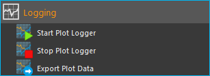
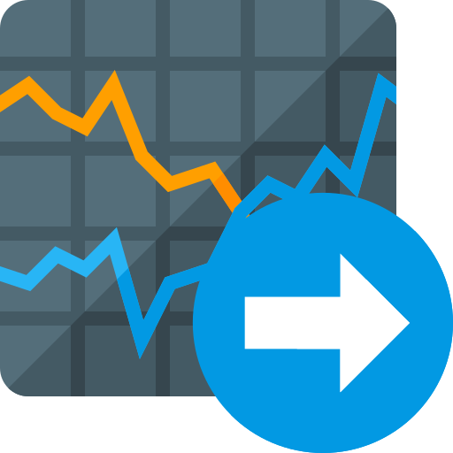

.. include:: graphlogger_EN.rst

Script Functions
----------------

To automate the capture of data or
to synchronize data capture with other processes, the graphical plot
logger can be started and stopped using script functions.
The corresponding functions can be found in the :guilabel:`Logging` category in
the list of the available script functions.

Start Plot Logger
~~~~~~~~~~~~~~~~~

.. image:: Pictures/10001A4C000034EB000034EBE789A979D3788852.svg
   :width: 60
   :height: 60
   :align: left

This function is used to start the graphical logger with the
currently configured settings and channels. The current content of the
plot is not deleted.

|

.. image:: Pictures/100002010000019E00000070391F13307E263DEB.png

Check :guilabel:`Clear Plot before the start of logging` if you want to clear all
plot data before logging. Starts.

Stop Plot Logger
~~~~~~~~~~~~~~~~

.. image:: Pictures/100019EB000034EB000034EBA805BBEA9A6F9422.svg
   :width: 60
   :height: 60
   :align: left

This function stops the current logging of process data into
the process data plot.

|

Export Plot Data
~~~~~~~~~~~~~~~~

This function allows you to export the plot data to different
formats. In the configuration area you can choose the file name and the
saving location by clicking on the folder icon :guinum:`❶`. For the saving
location, you should keep the default location within the project
folder.

.. image:: Pictures/10000201000001C9000000DDA39DA50FAC824913.png

In the :guilabel:`Export Formats` :guinum:`❷` area, select all formats you want the plot data
to be exported in. The software saves the files with the selected file
name + timestamp + the file extension of the export format (see example
in figure below):

.. image:: Pictures/100002010000016F000000BF0B98C28E08049AED.png
