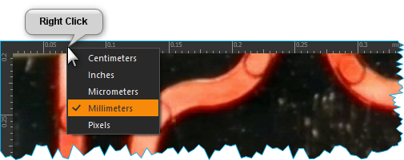
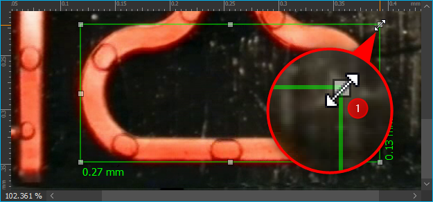
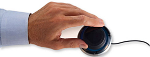
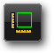

Image Analysis Plugin
=====================

Introduction
-------------

This plug-in allows you to view, edit, and save images using the most
common image file formats (PNG, JPG). In addition you can use it to:

-  zoom in and out of images,
-  easily navigate within an image,
-  measure the dimensions of details of an image.

.. image:: ./Pictures/100002010000025A000001644CA06F4F.png

You can show the Image Analysis :ref:`View <views>` via the main menu iteme
:menuselection:`Window --> Show View --> Image Analysis`. The user interface 
of the Image Analysis View consists of two main elements: the `Toolbar`_ :guinum:`❶` and 
the `Image Viewer` :guinum:`❷`.

Toolbar
-------

+-----------+---------------------------------------------------------+
| |image19| | Open image file.                                        |
+-----------+---------------------------------------------------------+
| |image20| | Save current image.                                     |
+-----------+---------------------------------------------------------+
| |image21| | Adjust display size of image to completely fill image   |
|           | viewer area.                                            |
+-----------+---------------------------------------------------------+
| |image22| | Resize image to match original pixel size.              |
+-----------+---------------------------------------------------------+
| |image23| | Zoom in to image.                                       |
+-----------+---------------------------------------------------------+
| |image24| | Zoom out of image.                                      |
+-----------+---------------------------------------------------------+
| |image25| | Pan tool to move the currently displayed image section. |
+-----------+---------------------------------------------------------+
| |image26| | Draw rectangular measuring box.                         |
+-----------+---------------------------------------------------------+
| |image27| | Remove all measurement overlays.                        |
+-----------+---------------------------------------------------------+

.. tip::
   You can also open image files easily via drag 
   & drop. Simply drag an image file from your file system 
   over the image analysis workbench and drop it there. 

Image Viewer
------------

Overview
~~~~~~~~

The image viewer contains the following elements:

.. image:: ./Pictures/10000201000001ED000000E091038262.png

.. rst-class:: guinums

1. Tabbed list of available images.
2. Ruler with customizable dimensions.
3. Display area.
4. Zoom level status bar.
5. Scroll bars.

A new tab displaying the file name will be added for each opened image,
e.g., when you open an image file or take a screen shot using the
camera. The active tab is highlighted. To close a tab, left-click on the 
cross icon that is displayed on the right hand side of every tab 
(see figure below).

.. image:: ./Pictures/10000201000001220000005C1545D1D1.png

To easily access the most frequently used functions, use the mouse and
right-click within the image viewing area. This will open a context menu
with most of the same buttons that are shown in the toolbar.

.. image:: ./Pictures/100002010000020F0000010C65D000F9.png

Select Scale Unit
~~~~~~~~~~~~~~~~~~~~~~~~~~~~~~~~~~~~~~~~~~~~~~~~~~~~~~~~~~~~~~~~

You can select between different scale units for the ruler to measure
objects displayed in the image viewer window. To change the scale unit
right-click anywhere within the ruler. This will open a context menu
with the list of available scale units (see figure below).

Select Zoom Level
~~~~~~~~~~~~~~~~~~~~~~~~~~~~~~~~~~~~~~~~~~~~~~~~~~~~

Use the *Zoom In* or *Zoom Out* buttons in the toolbar to adjust the
zoom level. Alternatively, simply place the cursor into the image viewer
area and use the mouse wheel to re-scale the panoramic image.

========= ========= ====================
|image32| |image23| Increase zoom level.
|image33| |image24| Decrease zoom level.
========= ========= ====================

Image Navigation
----------------

Navigation via Scrollbars
~~~~~~~~~~~~~~~~~~~~~~~~~

If the image is larger than the viewing area (e.g., due to a large zoom
level), scrollbars will be displayed below and to the right of the image
viewer. Use these scrollbars to adjust the displayed section of the
image.

Navigation via the Pan Tool
~~~~~~~~~~~~~~~~~~~~~~~~~~~

.. image:: Pictures/pan_hand.svg
   :width: 60
   :align: left

Activate the Pan Tool in the tool bar to move the displayed
image section manually. Click-and-drag into the image viewer to move the
image in the viewing area.

|

Navigation via Mouse
~~~~~~~~~~~~~~~~~~~~

You may also use the mouse to interact with the panoramic view of an
image:

.. rst-class:: steps

#. Middle-click into the image.

    .. image:: ./Pictures/10000000000001EC000002E9F2BF7149.png
       :width: 80

#. This will activate a navigation cross, which indicates
   that mouse panning is activated.

   .. image:: ./Pictures/1000020100000189000000B918EE2BA8.png

#. By moving the cursor away from the navigation cross, the
   image will move into the same relative direction. The speed of the
   movement depends on the distance between the cross and the cursor –
   the greater the distance, the faster the adjustment.

   .. image:: ./Pictures/10000000000002BB000003B0D14AEFFC.png
      :width: 100
   
#. Mouse panning can be deactivated by another middle-click or a
   left-click into the image.

Navigation via the Space Mouse
~~~~~~~~~~~~~~~~~~~~~~~~~~~~~~~~~~~~~~~~~~~~~

When the *Space Mouse* is installed, loading the relevant
plug-in allows for yet another way for image manipulation.

.. image:: ./Pictures/10000000000001BC000001A5A8497856.png

The `SpaceMouse <https://3dconnexion.com/us/product/spacemouse-compact/>`_
is an intuitive input device which allows you to control all axes 
(rotation, radius and vertical axis) simultaneously. To use the SpaceMouse, 
connect it to an available USB port on your PC. Latest drivers can be found
on our internet page:

http://www.cetoni.de/englisch/service/downloads_software.html

or on disk (CD or USB stick) you received when you purchased the
software. Install the driver to use the SpaceMouse. Position the SpaceMouse device, so that the cable leads away from
you and that the **3D Connexion** label is readable from your position.

.. image:: Pictures/1000000000000500000002D03030564E.png

To adjust the digital zoom
of the currently active image, press down or pull up the navigation knob
of the Space Mouse (figure below).

..  image:: ./Pictures/1000000000000117000001F4986AD712.png

To adjust
the section of the image displayed in the image viewing area, pivot the
navigation knob of the Space Mouse into the desired direction.

.. image:: ./Pictures/10000000000002240000017430F55526.png

The speed with
which the adjustment is carried out can be regulated by adjusting the
degree of pivoting – the stronger the navigation knob is pushed or
pulled, the faster the image will move.

========= ================================
|image39| Move image section left & right.
|image40| Move image section up & down.
|image41| Zoom in/out.
========= ================================

Measurement of Objects
----------------------

Draw a Measuring Box
~~~~~~~~~~~~~~~~~~~~

.. tip::
   Before drawing a measuring box, select the desired scale unit.

You can draw and adjust a measuring box using the following steps:

.. rst-class:: steps

#. Click the toolbar button *Measure Rectangle* to activate
   the measuring box tool.

   .. image:: Pictures/measure_rect.svg
      :width: 60

#. Left-click into the image viewing area to define the upper left-hand
   corner of the measuring box :guinum:`❶`.

   .. image:: ./Pictures/100002010000020E000000CCEAC7AB0F.png

#. While holding the left mouse button, drag the cursor to size the box
   as required :guinum:`❷`.

Moving the Measuring Box
~~~~~~~~~~~~~~~~~~~~~~~~

To move an entire box to a new location within the viewing area, first
place the cursor within the box so that it changes into a crossed arrow
:guinum:`❶`. Left-klick to drag the measuring box to its new position :guinum:`❷`.

.. image:: ./Pictures/100002010000020C000000CAA5EBAD7D.png

Adjusting the Size of a Measuring Box
~~~~~~~~~~~~~~~~~~~~~~~~~~~~~~~~~~~~~~~~~~~~~~~~~~~~~~~~~~~~~~~~~~~~~~~~~~

To change the size
of a measuring box, move the cursor to one of the 8 square drag handles at the
corners or the sides of the box (figure below). The cursor will change
to a double-sided arrow :guinum:`❶`, which indicates that you can now resizing the
box by dragging the respective mark to a new position.

Deleting a Measuring Box
~~~~~~~~~~~~~~~~~~~~~~~~

You can delete individual measuring boxes. First click into the
respective box to activate it – the activated box can be identified by
the presence of the check marks. Press the Delete button of your
keyboard to remove the box.

.. image:: Pictures/measure_items_clear.svg
   :width: 60
   :align: left

Delete all measuring boxes within an image by clicking the
button *Delete measuring lines* button in the toolbar or via the context menu.

.. |image19| image:: Pictures/open_image2.svg
   :width: 60

.. |image21| image:: Pictures/fit_to_size.svg
   :width: 60
.. |image22| image:: Pictures/view_1_1.svg
   :width: 60
.. |image23| image:: Pictures/zoom_in.svg
   :width: 60
.. |image24| image:: Pictures/zoom_out.svg
   :width: 60
.. |image25| image:: Pictures/pan_hand.svg
   :width: 60
.. |image26| image:: Pictures/measure_rect.svg
   :width: 60
.. |image27| image:: Pictures/measure_items_clear.svg
   :width: 60

.. |image32| image:: ./Pictures/10000000000001EC000002E98AB54170.png
   :width: 80
.. |image33| image:: ./Pictures/10000000000001EC000002E9389967B0.png
   :width: 80

.. |image39| image:: ./Pictures/10000000000000C40000008BD9BAE182.png
   :width: 80
.. |image40| image:: ./Pictures/1000000000000116000000E97F22C917.png
   :width: 80
.. |image41| image:: ./Pictures/100000000000009D000000DF60858E32.png
   :width: 60

