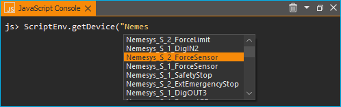
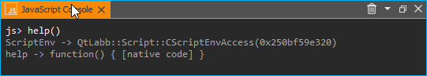
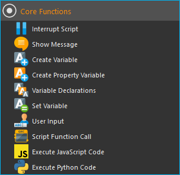

Using JavaScript
==================================================

JavaScript Support in CETONI Elements
-----------------------------------------------------

.. admonition:: Attention
   :class: caution

   The CETONI Elements Script System Add-on allows you to control and automate processes
   using JavaScript language. 
   Check the created scripts/programs as well as parameter entries before you 
   execute them for the first time! CETONI assumes no liability for direct and/or
   indirect damage to your system or external hardware and software components
   caused by the scripts/programs you have created or by the use of parameters
   that are not suitable or unfavorable for your specific application.

The CETONI Elements software comes with an integrated JavaScript Engine.
This engine provides an environment for evaluating JavaScript code.
This allows you to execute JavaScript code in 
CETONI Elements scripts via a corresponding script function and provides an
easy way to include the JavaScript scripting language in your CETONI Elements
scripts.

This gives you an additional way to implement logic in the :ref:`Script System` and
may simplify the implementation of complex calculations.

JavaScript Console
------------------

Overview of JavaScript Console
~~~~~~~~~~~~~~~~~~~~~~~~~~~~~~~

The script system provides a JavaScript console that allows you to interactively
enter and execute JavaScript code similar to the Python console.
You can show the JavaScript console from the main menu 
(:menuselection:`Window --> Show View --> Scripting --> JavaScript Console`):

.. image:: Pictures/javascript_console.png

In the JavaScript console, you can try out commands, test access
to objects, and it helps you debug problems. If function calls work in
the console, you can use them in your script.

The context menu of the JavaScript console contains the usual commands for
text editing:

.. image:: Pictures/javascript_console_context_menu.png

You have three options to delete the content of the JavaScript console:

- select :menuselection:`Clear` :guinum:`❶` in the context menu
- click the trash can icon :guinum:`❷` in the title bar
- enter the :code:`clear()` command in the console

.. admonition:: Attention
   :class: caution

   Risk of malfunction or data loss !       
   Do not use the JavaScript Console in a running experiment,  
   process or during normal operation or productive use.   
   Incorrect input or access to resources can possibly     
   lead to a crash of the software.  

Code completion
~~~~~~~~~~~~~~~

The JavaScript console supports you during typing with a simple code
completion.

In the example above the code completion shows a selection of devices starting
with :code:`Nemes`. 

Error messages
~~~~~~~~~~~~~~

Errors that occur when executing code in the JavaScript console are displayed to 
you as red text:

.. image:: Pictures/js_console_error.png

Getting Help
~~~~~~~~~~~~~

You can use the global :code:`help()` command, to find out more about the available
objects and functions. If you use the :code:`help()` command without any
parameters, you will get a list of available functions and objects:

If you pass the global object via :code:`help(this)`, then you will get
a list of all :ref:`built-in objects<Standard built-in objects>` in the global scope:

.. image:: Pictures/js_console_help_built_in.png

If you pass an object or function name as parameter to the help function,
like :code:`help(ScriptEnv)`, you will get detailed information about the given
object such as type :guinum:`❶`, properties :guinum:`❷`, methods :guinum:`❸` and 
signals :guinum:`❹`:

.. image:: Pictures/js_console_help.png

.. tip::
   Use the :code:`help(object)` function to get an overview of the methods and         
   properties of a given object. 

Accessing application objects
----------------------------------------

The **ScriptEnv** object is the central object for accessing 
available devices and application objects. Use :code:`help(ScriptEnv)` command
to get a list of available methods and properties of this object.

Using device objects
~~~~~~~~~~~~~~~~~~~~

You can access device objects using the :code:`ScriptEnv.getDevice()`
function. To get an overview of available device names you can call the
:code:`ScriptEnv.getDeviceNames()` function.

.. image:: Pictures/js_console_device_names.png

The code completion helps you to enter a device name by
showing you a list of matching names (see figure above). If you call the
:code:`getDevice()` function without an assignment to a variable, then you can
see in the console if the call was successful:

.. code-block:: shell

   js> ScriptEnv.getDevice("Nemesys_S_1")
   QtLabb::CNemesys4Pump(0x1e2136485a0, "Nemesys_S_1")

To access a device, assign the result of the call to :code:`getDevice()` to a
variable. In the following example, we assign the device object for the
first Nemesys S pump to the variable :code:`pump`:

.. code-block:: shell

   js> pump = ScriptEnv.getDevice("Nemesys_S_1")
   QtLabb::CNemesys4Pump(0x1e2136485a0, "Nemesys_S_1")

Now you can use the :code:`help(pump)` function to get an
overview of the available methods and functions of the pump object.

.. tip::
   Use the :code:`help(object)` function to get an overview of the methods and         
   properties of device objects.

.. admonition:: Important
   :class: note

   For many devices, accessing device     
   properties and methods is only possible if the application is 
   connected to the devices. 

.. admonition:: Attention
   :class: caution
   
   **Risk of malfunction / data loss !**
   Via device functions you may have access to functions   
   that are not available in the graphical user interface. 
   Always test functions outside running processes and not 
   during productive use. Incorrect input or access to     
   resources, methods or properties can lead to            
   malfunctions or a crash of the software.   

When you are connected to the device, you can now access the device
functionality via the device object functions. For example, you can
trigger a refill process for the pump:

.. code-block:: shell

   js> pump.refillSyringe()

or stop the pumping operation:

.. code-block:: shell

   js> pump.stopPumping()

The following code shows how to get the device object for the Nemesys S pump via 
the :code:`ScriptEnv` object, and then start an emptying process of the syringe:

.. code-block:: shell

   js> pump = ScriptEnv.getDevice("Nemesys_S_1")
   QtLabb::CNemesys4Pump(0x1e2136485a0, "Nemesys_S_1")
   
   js> pump.emptySyringe()

Using application objects
~~~~~~~~~~~~~~~~~~~~~~~~~

Similar to device objects, you can also access application objects that
are no devices. Use the two functions :code:`ScriptEnv.getObject()` and
:code:`ScriptEnv.getObjectNames()` for this

The following code shows how to get the application object of the graphical
logger via the :code:`ScriptEnv` object and then start logging:

.. code-block:: shell

   js> plot = ScriptEnv.getObject("ProcessDataGraph")
   QtLabb::CQCustomPlotDataLogger(0x1e2112dc280, "ProcessDataGraph")
   
   js> plot.startLogging()

.. tip::
   Use the :code:`help(object)` function to get an overview of the methods and         
   properties of application objects.          

.. admonition:: Attention
   :class: caution

   **Risk of malfunction / data loss !**                                                           
   The functions of the application objects may give you   
   access to functions that are not available in the       
   graphical user interface. Always test functions outside 
   running processes and not during productive use.        
   Incorrect input or access to resources, methods or      
   properties can lead to malfunctions or a crash of the   
   software. 

.. _javascript_script_function:

JavaScript Script Function
---------------------------

JavaScript Script Function Overview
~~~~~~~~~~~~~~~~~~~~~~~~~~~~~~~~~~~~~

.. image:: Pictures/javascript_logo.svg
   :align: left
   :width: 60px

The :code:`Execute JavaScript Code` script function is available in the
:guilabel:`Core Functions` category of the :guilabel:`Script Pool`:

   
This function allows you to execute JavaScript code in the script
system of the application. When you insert the function into your
script, you will see the initial JavaScript code in the configuration
area.

.. code-block:: javascript

   // Implement your script logic in this function
   // Avoid blocking function calls
   function main() {
      return ScriptEnv.FINISH;
   }

When the script is executed, it is loaded by the JavaScript engine and then
the :code:`main()` function is called. I.e. this function is the main
function of the script and the logic should be implemented there.

.. tip::
   All options you have in the `JavaScript Console`_  
   to access :ref:`device objects<Using device objects>` and
   :ref:`application objects<Using application objects>` are    
   also available in the script function.     

Each script function uses its own JavaScript engine instance. This enables the
use of JavaScript functions in parallel sequences.

JavaScript Editor
~~~~~~~~~~~~~~~~~~~~

The JavaScript Script function has a JavaScript code editor to assist you in
writing JavaScript code.

The editor has the following features

-  Syntax highlighting for JavaScript code :guinum:`❶`
-  a simple code completion
-  Code Folding :guinum:`❷`
-  Line numbers :guinum:`❸`
-  Undo / Redo functionality :guinum:`❹`

Some functions of the editor are available via the context menu, other
functions are available via keyboard shortcuts. Here are some of the
functions:

.. list-table::
   :widths: 50 50
   :header-rows: 1

   * - Action
     - Keyboard Shortcut
   * - Increase font size
     - :kbd:`Ctrl` + :kbd:`+`
   * - Decrease font size
     - :kbd:`Ctrl` + :kbd:`-`
   * - Reset font size to default
     - :kbd:`Ctrl` + :kbd:`0`
   * - Indent selected code block
     - :kbd:`Tab`
   * - Unindent selected code block
     - :kbd:`Shift` + :kbd:`Tab`
   * - Undo
     - :kbd:`Ctrl` + :kbd:`Z` or context menu
   * - Redo
     - :kbd:`Ctrl` + :kbd:`Y` or context menu

.. admonition:: Important
   :class: note

   Editing the JavaScript source code is only 
   possible when the script is not running. Once the       
   script has been started, editing of the source code is  
   disabled. In case of an error you have to terminate the 
   script via the :guilabel:`Terminate Script` button before you    
   can edit the JavaScript code.  

Implementation of the function logic in main()
~~~~~~~~~~~~~~~~~~~~~~~~~~~~~~~~~~~~~~~~~~~~~~~~~~~~~

When implementing the script in :code:`main()` you should be careful
not to use blocking functions or blocking waits. Normally the JavaScript engine
runs the JavaScript code in the main UI thread and using blocking function
calls may block any UI updates and the main event loop.

.. admonition:: Important
   :class: note

   Do not use blocking function calls to avoid blocking the main UI thread.

If you want to implement complex logic or state machines in JavaScript, then
you should consider using concurrent execution in a worker thread. To activate
concurrent execution, you can turn on the toggle switch 
:guilabel:`Concurrent Execution`. Read more about this feature in section
`Concurrent Execution`_.

.. image:: Pictures/concurrent_execution.png

Unlike with the :ref:`Set Variable` or :ref:`Create Variable` functions, it is not 
allowed here to use variable identifiers (such as :code:`$Flow`) or device properties 
(such as :code:`$$Nemesys_S_1.ActualFlow`) directly in the JavaScript source code. 
That means, the following code is **wrong** and **invalid** code:

.. code-block:: javascript

   function calculateFlow()
   {
      // Wrong - $Flow and $$Nemesys_S_1.ActualFlow are not defined
      return $Flow + $$Nemesys_S_1.ActualFlow
   }

To access variables the functions :code:`ScriptEnv.setVar()` and :code:`ScriptEnv.getVar()`
must be used. Access to device functions is possible via :code:`ScriptEnv.getDevice()`.
The right way, to implement the function above, is this one:

.. code-block:: javascript

   function calculateFlow()
   {
      Flow = ScriptEnv.getVar("$Flow");
      pump = ScriptEnv.getDevice("Nemesys_S_1");
      return Flow + pump.ActualFlow;
   }

.. admonition:: Attention
   :class: caution

   It is not allowed to use variable identifiers such as :code:`$Flow` or 
   device properties such as :code:`$$Nemesys_S_1.ActualFlow` directly in the
   JavaScript source code.

Script execution errors
~~~~~~~~~~~~~~~~~~~~~~~

If errors occur during the execution of a script, you will see them in
the :guilabel:`Event Log`. If you hover over the error message in the event log,
you will see a hint window with details:

In the error message you will also get the information in
which line of the script an error occurred. This will help you to find
and fix the error in the script editor.

.. admonition:: Important
   :class: note

   Editing the JavaScript source code is only  
   possible when the script is not running. Once the       
   script has been started, editing of the source code is  
   disabled. In case of an error you have to terminate the 
   script via the :guilabel:`Terminate Script` button before you can 
   edit the JavaScript source code.  

Debugging JavaScript Code
---------------------------

When you develop a script function with JavaScript, there are many ways to 
debug possible issues that you may face. The sections below describe, how to use
the JavaScript console API to debug your JavaScript code.

=========== =========================
Feature     Description
=========== =========================
print       Use :code:`print` to print to the console and event log

            For example:

            .. code-block:: javascript

               function f(a, b) {
                  print("a is ", a, "b is ", b);
               }

Log         Use :code:`console.log`, :code:`console.debug`, :code:`console.info`, 
            :code:`console.warn`, or :code:`console.error` to print debugging 
            information to the console.
            
            For example:

            .. code-block:: javascript

               function f(a, b) {
                  console.log("a is ", a, "b is ", b);
               }

Assert      :code:`console.assert` tests that an expression is true. If not, 
            it writes an  optional message to the console and prints the stack
            trace.
            
            For example:

            .. code-block:: javascript

               function f() {
                  var x = 12
                  console.assert(x == 12, "This will pass");
                  console.assert(x > 12, "This will fail");
               }

Timer       :code:`console.time` and :code:`console.timeEnd` log the time 
            (in milliseconds) that was spent between the calls. Both take a 
            string argument that identifies the measurement.

            For example:

            .. code-block:: javascript

               function f() {
                  console.time("wholeFunction");
                  console.time("firstPart");
                  // first part
                  console.timeEnd("firstPart");
                  // second part
                  console.timeEnd("wholeFunction");
               }

Trace       :code:`console.trace` prints the stack trace of the JavaScript execution at 
            the point where it was called. This stack trace information contains 
            the function name, file name, line number, and column number. 
            The stack trace is limited to last 10 stack frames.

Count       :code:`console.count` prints the current number of times a particular piece of 
            code has run, along with a message.
            
            For example:

            .. code-block:: javascript

               function f() {
                  console.count("f called");
               }

Exception   :code:`console.exception` prints an error message together with the stack 
            trace of JavaScript execution at the point where it is called.
=========== =========================

Standard built-in objects
---------------------------

The JavaScript engine has a number of standard buil-in objects in the global
scope. One of these objects is the **global object** that can be accessed using the
:code:`this` operator. To list all built-in objects, you just need to call the
:ref:`help function<Getting Help>` with the global object like this: :code:`help(this)`.

.. image:: Pictures/js_console_help_built_in.png

If you would like to see the properties and functions of a specific built-in
object, such as :code:`Math`, you just need to call help passing this object:
:code:`help(Math)`.

For a detailed list of built-in objects supported by the embedded JavaScript engine,
please refer to the Qt documentation:

https://doc.qt.io/qt-5/qtqml-javascript-functionlist.html

For a detailed documentation of the build-in objects, please refer to the JavaScript
reference documentation:

https://developer.mozilla.org/en-US/docs/Web/JavaScript/Reference/Global_Objects

Concurrent Execution
---------------------------

Normally the JavaScript code is executed in the main UI thread. If you would
like to implement long running JavaScript code with blocking function calls
or longer delays, you should consider concurrent execution in a dedicated
worker thread, to avoid blocking the main UI thread. To activate
concurrent execution, you can turn on the toggle switch 
:guilabel:`Concurrent Execution`.

.. image:: Pictures/concurrent_execution.png

If the JavaScript code runs concurrently, then it is possible to interrupt
the JavaScript script function when the script execution is stopped. The 
disadvantage of the concurrent execution is, that it is not safe to access
methods and properties of UI objects that you have obtained via 
:code:`ScriptEnv.getObject()`.

.. admonition:: Attention
   :class: caution

   It is not safe to use properties and methods of UI application objects
   if the JavaScript code is executed concurrently. In this case, accessing
   UI objects may crash the application.

To call UI object methods, you need to use the :code:`ScriptEnv.invoke()`
function. This ensures, that the invoked method is called in the main UI
thread. The following example shows how to invoke a function of the graphical
logger and of a pump using :code:`ScriptEnv.invoke()`

.. code-block:: javascript

   function main()
   {
      pump = ScriptEnv.getDevice("Nemesys_S_1");
      ScriptEnv.invoke(pump.generateFlow, [-0.01]);
      graph = ScriptEnv.getObject("ProcessDataGraph");
      ScriptEnv.invoke(graph.startLogging, []);
   }

The following table shows the advantages / disadvantages of the two execution
modes to help you to decide which one to use:

.. list-table::
   :header-rows: 1
   :stub-columns: 1
   :align: center

   * - 
     - Execution in UI thread
     - Concurrent Execution
   * - UI object access
     - yes
     - only via :code:`ScriptEnv.invoke()`
   * - Blocking function calls
     - no - blocks UI thread
     - yes
   * - Interruptible
     - no
     - yes
   * - Suitable for
     - short scripts or calculations
     - complex scripts with blocking function calls and delays

Accessing signals and slots in scripts
--------------------------------------

The embedded JavaScript engine offers the capability to use signals and slots.
Signals are emitted by an object when its internal state has changed in some way.
A slot is called when a signal connected to it is emitted. Slots are normal 
functions and can be called normally; their only special feature is that signals 
can be connected to them. If you connect to a signal, the receiver can be a 
regular slot of another object or a JavaScript function. The most
common case is when you connect the signal to an anonymous function:

.. code-block:: javascript

   pump.dosageFinished.connect(function() {
       console.log('dosage finished!');
   });

If you need to undo the connection, you will need to store the function in a variable:

.. code-block:: javascript

   function dosageFinished() {
      console.log('dosage finished!')
   }

   pump.dosageFinished.connect(dosageFinished);
   //...
   pump.dosageFinished.disconnect(dosageFinished);

You can also connect the signal to a signal or slot of another exposed object. 
In the following example we connect the :code:`dosageFinished` signal of *pump2* 
to the :code:`stopPumping` slot of *pump1*. This will automatically stop *pump1*
if *pump2* stops:

.. code-block:: javascript

   pump1 = ScriptEnv.getDevice("peRISYS_S_1");
   pump2 = ScriptEnv.getDevice("peRISYS_S_2");
   pump2.dosageFinished.connect(pump1.stopPumping)

The following example is a little bit more complex and shows, how to use
concurrent execution together with a signal connection.

.. code-block:: javascript
   :linenos:

   function onDosageFinished() {
      print("onDosageFinished");
      ScriptEnv.leave();
   }

   // Implement your script logic in this function
   // Avoid blocking function calls
   function main() {
      pump = ScriptEnv.getDevice("Nemesys_S_1");
      if (typeof ScriptEnv.Initialized == "undefined") {
         ScriptEnv.Initialized = true;
         print("Connecting signal")
         pump.dosageFinished.connect(onDosageFinished);
      }  
      pump.aspirate(0.01, 0.01);
      return ScriptEnv.KEEP_RUNNING;
   }

The code in line 10 to 14 connects the :code:`dosageFinished` signal of the pump
to the JavaScript function :code:`onDosageFinished`. 

.. code-block:: javascript

   if (typeof ScriptEnv.Initialized == "undefined") {
      ScriptEnv.Initialized = true;
      print("Connecting signal")
      pump.dosageFinished.connect(onDosageFinished);
   }  

The surrounding check
:code:`if (typeof ScriptEnv.Initialized == "undefined")` ensures, that there
will be only one connection if the function is called multiple times. If we do
not use this check, then a new connection is created each time the function
is called. 

In the next two lines, the pump aspiration is started and the :code:`main()` 
script function returns :code:`ScriptEnv.KEEP_RUNNING` to indicated, that script
execution should not stop if main function is finished.

.. code-block:: javascript

   pump.aspirate(0.01, 0.01);
   return ScriptEnv.KEEP_RUNNING;

The scripting system will stay in this script function, until the pump finished
dosage. In this case, the JavaScript function :code:`onDosageFinished()` will
be called. 

.. code-block:: javascript

   function onDosageFinished() {
      print("onDosageFinished");
      ScriptEnv.leave();
   }

The function prints a message to the console and calls 
:code:`ScriptEnv.leave()` to signal the script function, that the function has
finished and that the next script function can be executed. This example shows,
how to execute a longer running task and end the script function when the task
has finished.

API Reference
--------------

ScriptEnv
~~~~~~~~~~~~~~~~~~~~~~~~~~~~~~~~

The :code:`ScriptEnv` object is the central object for accessing available 
devices and application objects.

.. doxygenclass:: QtLabb::Script::CScriptEnvAccess
    :project: python
    :path: ../doxygen/xml
    :members:
    :members-only:
    :membergroups: scripting

QFile
~~~~~~~~

The :code:`QFile` class provides an interface for reading from and writing to 
files. It is a wrapper for the `QFile <https://doc.qt.io/qt-5/qfile.html>`_ class
from the Qt framework.

.. doxygenclass:: QtLabb::Script::CScriptQFile
    :project: python
    :path: ../doxygen/xml
    :members:
