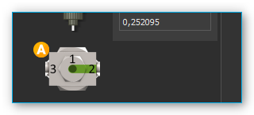
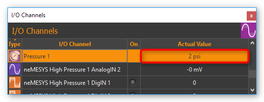
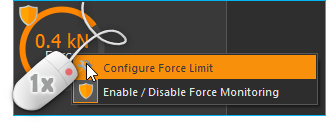
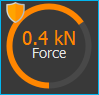
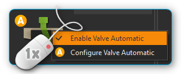
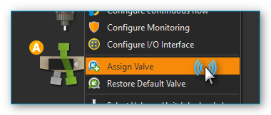
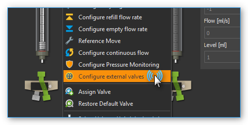

Nemesys Plugin
==============

Introduction
------------

The Nemesys Plugin is for controlling the CETONI Nemesys syringe pumps.
In the Nemesys View (figure below), operating panels are displayed for all
existing and configured syringe pumps.

|Figure 1: Nemesys workspace|

If the Nemesys View is not visible, then select
:menuselection:`Window --> Show View --> Nemesys` from the main menu or click
the :guilabel:`Nemesys` button in the sidebar.

Pump Operating Panel
---------------------

Overview
~~~~~~~~

Each operating panel is used to control, configure and visualize a
Nemesys dosing module. It contains all the control elements for
configuring and controlling the pump parameters and for visualizing the
current status.

|image1|

The panel consists of

.. rst-class:: guinums

#. Caption of the syringe pump
#. Level indicator
#. Control elements (depending on operating mode)
#. Valve switching and status
#. Display of the internal force sensor if supported by the device

The force sensor display is hidden by default. To show the display, select
:menuselection:`Show Force Indicator` from the context menu.

.. image:: Pictures/show_force_sensor.png

Changing module names
~~~~~~~~~~~~~~~~~~~~~

You can assign a unique name to each
dosing unit. For example, you can indicate which liquid a dosing unit
doses or what it is used for. To assign a new name, simply make a left
mouse click on the name of the dosing unit. You can then enter a new
name, and confirm the entry with :kbd:`Return` (Figure below).

|Figure 2: Changing module name|

Syringe level indicator
~~~~~~~~~~~~~~~~~~~~~~~

The fill level indicator of the syringe always shows the current
position of the drive unit, and thus the current fill level of the
syringe used. The colour of the syringe also indicates the current
motion of the dosing unit, so you can immediately see the direction of
motion of the syringe even with a very low flow rate. The following
colours are possible:

+-----------+----------------------------------------------------------+
| |image8|  | **Grey** - The drive unit is currently inactive.         |
+-----------+----------------------------------------------------------+
| |image9|  | **Blue** - The syringe piston is moving in the direction |
|           | of the syringe clamp (Dispensing).                       |
+-----------+----------------------------------------------------------+
| |image10| | **Orange** - The syringe piston is moving away from the  |
|           | syringe clamp (Aspirating).                              |
+-----------+----------------------------------------------------------+

This color coding of the direction of motion is also used in all other
parts of the Nemesys plugin.

.. tip::
   The colours of the syringes help you identify
   the direction of motion quickly, especially with very
   low flow rates, because it is almost impossible to see
   the position of the syringe piston changing.

The thickness of the syringe in the display indicates the approximate
size of the currently clamped syringe. You should be very cautious with
the use of higher flow rates, especially with very large syringes,
because very high pressures can develop very quickly, which could damage
the device (valve) or your application.

.. admonition:: Attention
   :class: caution

   Risk of high pressures damaging the
   connectors in the liquid path. To avoid high pressures
   causing damage, never make a reference move with a
   high-pressure syringe clamped.

Software limits
~~~~~~~~~~~~~~~~~~~~~~~~

The travel path of a syringe is limited in the software by a minimum and
a maximum value in order to prevent irreparable damage to the syringe or
the piston being pulled out of the body of the syringe. These values are
indicated by two red marks in the fill level indicator (Figure below),
and they have to be defined for each syringe in the
:ref:`syringe configuration`.

.. image:: Pictures/syringe_software_limits.png

Force Monitoring
----------------

Introduction to Force Monitoring
~~~~~~~~~~~~~~~~~~~~~~~~~~~~~~~~~~~

The latest pumps in the Nemesys range (Nemesys M and Nemesys S) have an
internal force sensor to monitor the force with which the syringe
plunger is pressed into the syringe. This serves to minimize the risk of
damage to the device, the syringes and the application.

Each pump has a fixed maximum force value at which dosing stops:

============= ========
**Nemesys S** 0.48 kN
**Nemesys M** 1.3 kN
============= ========

In addition, the maximum force can be further limited by a user
adjustable force limit.

Operating Controls
~~~~~~~~~~~~~~~~~~

In the operating panel of the pump you will find the display of the
force monitoring :guinum:`❶` below the syringe display: If the display is hidden,
you can show the display again via the context menu of the pump. In the
context menu, select the menu item :menuselection:`Show Force Indicator`:

.. image:: Pictures/show_force_sensor.png

The protective shield symbol :guinum:`❷` (see figure below) in the upper left
corner of the force display indicates whether the force monitoring is
active or inactive (symbol greyed out).

|image17|

Dosage is only possible when force monitoring is activated.
If you move the mouse arrow over the force indicator, additional
information is displayed in a small window :guinum:`❸`:

- **Name** of the force sensor channel (e.g. to query the sensor in the
  script or to use it in the logger).
- **Force range** - the adjustable range of force monitoring
- **Force limit** - the currently set maximum permissible force
- **Monitoring** - indicates whether the force monitoring is active.

To limit the maximum force, right-click in the force display and select
the menu item :menuselection:`Configure Force Limit`:

|image18|

Then enter the desired maximum force and click :guilabel:`OK`:

.. image:: Pictures/100002010000010000000070D53D2787371955AA.png

What to do after a force overload stop
~~~~~~~~~~~~~~~~~~~~~~~~~~~~~~~~~~~~~~

If the maximum set force is exceeded while the pump is in use, the pump
is stopped immediately and set to a fault state. This is shown in the
figure below. The value of the force sensor (green curve) has exceeded
the set force limit (red line) :guinum:`❶`.

|image19|

The error status of the pump is indicated by the red flashing
LED :guinum:`❷`. The current measured value of the force sensor can be seen in the
force display :guinum:`❸`. In addition, the reason for the error is shown in the
event log.

|image20|

To reset the pump from this "overload" state to normal
operating mode, proceed as follows:

.. rst-class:: steps

#. **Disable force monitoring**. Click with the right mouse button in
   the force display and select the menu item *Enable / Disable Force
   Monitoring*. The protective shield symbol should then be greyed out.

   |image21|

   The event log informs you that the safety stop has now been
   reset and that only aspiration is possible:

   .. image:: Pictures/100002010000028C00000056870799632F9FDD06.png

#. **Enable pump**. To activate the pump, right-click on the red status
   LED of the pump and select the menu item *Enable Pump Drive* from
   the context menu. The status LED of the pump must then light up
   green.

   .. image:: Pictures/10000201000000F30000006A80846DAA366E3158.png

#. **Reduce force**. You can now reduce the force by drawing up the
   syringe or starting a dosage with a negative flow rate. You should
   now see the value in the force display decrease. As soon as the
   force value falls below a threshold, the pump will stop and return
   to an error state. You should then see a corresponding message in
   the event log:

   .. image:: Pictures/10000201000002C70000005EE9E5349F4ACFEEAF.png

#. **Activate force monitoring**. Now click with the right mouse button
   in the force display again and select the menu item *Enable /
   Disable Force Monitoring*. The force monitoring should then be
   active again and the shield symbol should be coloured:

   |image22|

   In the event log you should now see the information that the
   force monitoring is active again and that the safety stop has been
   reset.

   .. image:: Pictures/10000201000001AA00000056EACFFD3C7DD5C0F4.png

#. **Activate pump.** To activate the pump, right-click on the red
   status LED of the pump again and select the menu item Enable Pump
   Drive from the context menu. The status LED of the pump must then
   light up green.

   .. image:: Pictures/10000201000000F30000006A80846DAA366E3158.png

Now the pump is ready for operation and can be used as usual.

Reference Move
---------------------------

.. tip::
   With the current *Nemesys M* and *Nemesys S*
   pumps, a reference move is no longer necessary and you
   can skip this chapter.

The drives of the dosing units are monitored and controlled by a digital
positioning unit. You can make a reference move of the dosing unit to
calibrate this positioning unit. A suitable time for this is, for
example, when a syringe is changed, because the syringe has to be
removed from the dosing unit in order to make a reference move. During
the reference move, the dosing unit travels to its lower limit position,
and calibrates your zero position when it reaches the limit position.

.. admonition:: Important
   :class: note

   Always make a reference move if you
   operate the pumps from another PC, because the
   calibration data are stored on the PC and not in the
   dosing units.

.. image:: Pictures/start_reference_move.png

To start a reference move, make a
right mouse click in the operating panel of the dosing unit that is to
be calibrated. Select the :menuselection:`Reference Move` menu item in the context menu
that will open now.

.. admonition:: Attention
   :class: caution

   Danger of damaging syringes! The system
   may only be calibrated when a syringe is not installed
   in the dosing unit.

.. admonition:: Attention
   :class: caution

   Risk of high pressures damaging the
   connectors in the liquid path. To avoid high pressures
   causing damage, never make a reference move with a
   high-pressure syringe clamped.

Valve
-----

.. image:: Pictures/ventil.png

If your dosing unit has a valve, you can switch the valve or
configure the automatic valve switching in this part of the operating
panel. The current switching status of the valve is indicated by the
valve control element.

.. tip::
   Move the mouse cursor over the valve to get
   additional information about the valve.

Manual valve switching
~~~~~~~~~~~~~~~~~~~~~~

To switch the valve, simply make a left mouse click on the valve icon
(figure below). You should hear a soft click, and the valve image should
switch to the other switching status.

|Figure 5: Manual valve switching|

If you have a valve with more than
two valve positions, you can cycle through all positions by clicking
with the left mouse button on the valve image. If you hold down the
:kbd:`Shift` key when you click on the valve, you can cycle through the valve
positions in the opposite direction:

|Figure 6: Inverted manual valve switching|

Alternatively, you can
select the desired valve position directly. Click with the right mouse
button on the valve, and then select the context menu item
:menuselection:`Switch Valve`.

|Figure 7: Showing valve context menu|

A small dialog window comes up,
where you can choose the desired valve switching position from a valve
selection box. Once you select a position, the valve is switched
immediately. You can finish the selection of a valve switching position
by clicking the green check mark (see figure below).

|Figure 8: Selection of valve switching position|

Automatic valve switching
~~~~~~~~~~~~~~~~~~~~~~~~~~~~~~~~~~~~~~~~~~~~~~~~~~~~~~~~~~~~~~~~~~~~~~~~~~~~

Each pump has a valve automatic, which automatically switches the
associated valve when the pump state changes. The small orange
**A**-icon overlay shows you whether the valve automatic mode is active.

|Figure 9: Valve automatic mode active|

To toggle the valve automatic,
just click with the right mouse button on a valve and then select the
menu item :menuselection:`Enable Valve Automatic`.

|Figure 10: Enable / disable valve automatic|

To configure the
automatic valve mode, click with the right mouse button on a valve and
select the menu item :menuselection:`Configure Valve Automatic`.
The valve automatic configuration dialog will then appear.

|Figure 11: Valve automatic configuration dialog|

You can configure the
target valve position for each pump state (*Aspiration, Stopped and
Dispensing*) separately. To activate valve switching for a certain
state, check the check box :guinum:`❶`. It is then displayed a selection box
:guinum:`❷` for selection of the valve position. If you want to disable valve
switching for a certain state, simply uncheck the check box :guinum:`❸`.
Finish the configuration by clicking the :guilabel:`OK` :guinum:`❹` button.

.. admonition:: Important
   :class: note

   In certain dosing modes, such as during
   continuous dosing with two pumps, the valve automatic
   is temporarily disabled because the valves are switched
   by the logic of the respective operating mode.

Assigning a Valve
~~~~~~~~~~~~~~~~~

You can assign a valve to each syringe pump, regardless of whether the
pump has its own valve or not. This valve can be e.g. a Qmix V module,
an external ball valve or the valve of another syringe pump. You can do
this via drag & drop. Simply drag the corresponding valve out of the
valve list :guinum:`❶` onto the front panel :guinum:`❷` of the corresponding pump.

.. image:: Pictures/1000020100000469000002A783AE238E93742740.png

To assign a valve, select the menu item :menuselection:`Assign Valve` from the context
menu of a pump.

|Figure 13: Valve Assignment|

Then select the valve from the valve
list, which you want to assign.

|Figure 14: Valve selection dialog|

The new valve is then displayed
below the syringe. When you configure and activate the valve automatic
for this valve, the valve is automatically switched when aspirating and
dispensing liquid and when stopping the pump.

.. admonition:: Important
   :class: note

   You can only assign one single valve to a certain pump.

If you want to restore the original valve configuration later, select
the context menu item :menuselection:`Restore Default Valve`.

.. image:: Pictures/100000000000017600000098413180ED58246500.png

.. tip::
   In section :ref:`Connect external valves to I/O
   interface` you will find a detailed
   guide how to integrate external valve modules connected
   to the I/O interface (such as external ball valves) in
   the software.

I/O Interface
-------------

I/O Interface Overview
~~~~~~~~~~~~~~~~~~~~~~~~

|Figure 17: I/O interface Nemesys mid pressure pump V3|

Various Nemesys
pumps offer an I/O interface for connecting external sensors and
signals, or for outputting trigger signals (example shown below).

Depending on the device configuration the I/O interface features digital
inputs and outputs and/or analog inputs. All I/O channels can be found
in the software window *I/O Channels*. If this window is not visible,
you can show it by clicking the menu item :menuselection:`Window --> Show View --> I/O Channels`
in the main menu (see figure below). The channels of a pump are grouped below the
corresponding pump node.

|Figure 18: Showing I/O channel window|

Each I/O channel has a unique
name (e.g. *Nemesys 1 Analog In 1*), which is composed of the pump name
(e.g. *Nemesys 1*) and the name of the channel (e.g. *Analog In 1*) like
in the figure below.

|Figure 19: Nemesys I/O channels|

Scaling of the analog inputs
~~~~~~~~~~~~~~~~~~~~~~~~~~~~~~~~~~~~~~~~~~~~~~~~~~~~~~~~~~~~~~~

The analog inputs of the modules measure the input voltage in the range
of 0 - 5000 mV. For each channel, you can specify a separate scaling.
This allows you for example to scale the voltage value of 0 - 5000 mV
into a pressure value of 0 – 20 bar, if you have connected a pressure
sensor. For details on configuring the channels or on scaling, read the
section :ref:`Configure Sensor Scaling` in the I/O Plugin documentation.

In the following example, we will show you, how to connect a pressure
sensor with the measuring range: 0.5 V - 4.5 V corresponds to 0 - 20
bar. The sensor is connected to analog input 1. We will now define a
scaling for this pressure sensor. To do this, click with the right mouse
button in the channel row if of the I/O channel view and select the menu
item :menuselection:`Configure channel`. The following configuration dialog is
then displayed.

|Figure 20: Example: input scaling for pressure sensor|

In this dialog, we configure the following values:

.. rst-class:: guinums

#. as sensor type we choose *Pressure*
#. the basic unit bar corresponds to the unit in the data sheet of our
   sensor
#. in the line :guilabel:`Device value`, enter the measuring range of the analog
   input: 500 mV to 4500 mV. In the :guilabel:`Scaled value` line, enter the
   measuring range of the sensor 0 - 20 bar.
#. we select a meaningful name for the channel: *Presssure 1*
#. As the display unit, we select the pressure unit *psi* in the
   :guilabel:`Measuring unit` input field.
#. by clicking :guilabel:`OK` we complete the configuration

The measured pressure of the sensor is now displayed in the I/O Channel
window in bar (see figure below).

.. tip::
   For a detailed description of I/O channels,
   configuration and scaling, see the :ref:`I/O Plugin` documentation.

Connect external valves to I/O interface
~~~~~~~~~~~~~~~~~~~~~~~~~~~~~~~~~~~~~~~~

You can connect various external valves to the Nemesys I/O interface connector.
To configure an external valve choose the context menu item
:menuselection:`Configure external valves`.

|Figure 22: External valve configuration|

From the list of external valves, you can now select a device you want to
connect to the I/O interface. The list of :guilabel:`Available Valves` :guinum:`❶` shows
all valve devices that you can select. In the :guilabel:`Valve Parameters`
:guinum:`❷` section, you will see detailed information abpout the selected valve type.

|Figure 23: Selection dialog for external I/O devices|

For some valves, you may need to provide additional parameters :guinum:`❸`.
If you are finished, confirm your selection with :guilabel:`OK`.

After selecting a valve, a dialog may appear where you need to configure
whether the valve is to be a primary valve or secondary valve.

|Figure 24: Primary / Secondary valve selection|

The *primary valve* can be connected directly to the I/O interface. If you want to connect a
second additional valve, you need a Y-cable or a distribution box. Since
the second valve is connected to a different digital output, you need to
choose :guinum:`❷` *Second Valve*.

If you added a valve, the new valve will appear at the end of the valve
list (see figure below). Now you can switch the valve positions or
:ref:`assign it to a pump <Assigning a Valve>`.

|Figure 25: Valve list with external valve as last list entry|

Later,
if you no longer need a certain valve, you can delete it in the valve
list. Click with the right mouse button on the valve list entry to open
the context menu and select the menu item :menuselection:`Delete Valve`.

|Figure 26: Deleting external valve|

The valve is then removed from the
list and if you have assigned it to a pump, then it will be removed from
the control panel of the pump.

.. |Figure 1: Nemesys workspace| image:: Pictures/100000000000045E000002BE838E4D417C3553CE.png

.. |image1| image:: Pictures/10000201000000DA0000027D087AA389826F3C49.png

.. |Figure 2: Changing module name| image:: Pictures/1000020100000153000000865EA46C8D528E4051.png

.. |image8| image:: Pictures/100000000000004600000055B5BD133DBED7017F.png
   :width: 60
.. |image9| image:: Pictures/10000000000000460000005571CC2832E2E47223.png
   :width: 60
.. |image10| image:: Pictures/1000000000000046000000555AB1B48CFF3950BB.png
   :width: 60

.. |image17| image:: Pictures/100002010000011500000099B1E7B77D37E1332E.png

.. |image19| image:: Pictures/100002010000041C0000027F06C58E855A268253.png

.. |image20| image:: Pictures/10000201000002EA0000005B00458FB9B9C5043B.png

.. |image21| image:: Pictures/1000020100000205000000628984EFCAD3138B6D.png

.. |Figure 5: Manual valve switching| image:: Pictures/1000000000000195000000ADA27EB388AC14806E.png

.. |Figure 6: Inverted manual valve switching| image:: Pictures/10000000000001B10000009674312B473919102F.png

.. |Figure 7: Showing valve context menu| image:: Pictures/100000000000016E000000B3905F4EAA693DD621.png

.. |Figure 8: Selection of valve switching position| image:: Pictures/100000000000017C000000FBB8D53C0B60FC4150.png

.. |Figure 9: Valve automatic mode active| image:: Pictures/10000000000002230000009D317412D5E296952F.png

.. |Figure 11: Valve automatic configuration dialog| image:: Pictures/100000000000024E0000027078F3574498FE2E0F.png

.. |Figure 14: Valve selection dialog| image:: Pictures/10000000000001790000011DC571F9CE1064E587.png

.. |Figure 17: I/O interface Nemesys mid pressure pump V3| image:: Pictures/10000000000003880000025CBC968CAE13909DEE.png
   :width: 400

.. |Figure 18: Showing I/O channel window| image:: Pictures/100002010000013E000000B74AE0265CA479D65B.png

.. |Figure 19: Nemesys I/O channels| image:: Pictures/100002010000021D0000011FD08A581F4A0DB149.png

.. |Figure 20: Example: input scaling for pressure sensor| image:: Pictures/100002010000029C00000278588D110A32DA5302.png

.. |Figure 23: Selection dialog for external I/O devices| image:: Pictures/10000201000001AE00000171BFE2001F1F2DF986.png

.. |Figure 24: Primary / Secondary valve selection| image:: Pictures/1000000000000214000000A6D5C37AA1BE5C3A54.png

.. |Figure 25: Valve list with external valve as last list entry| image:: Pictures/10000000000001AC000000FE4D17491FB27B7A90.png

.. |Figure 26: Deleting external valve| image:: Pictures/10000000000001AC00000091DBC619732FF93701.png
