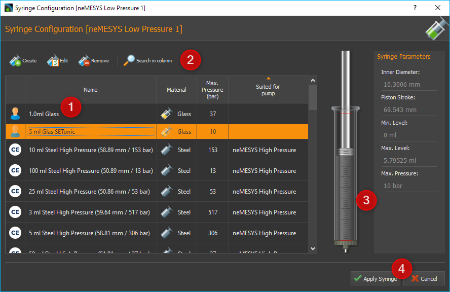
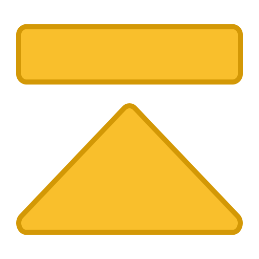
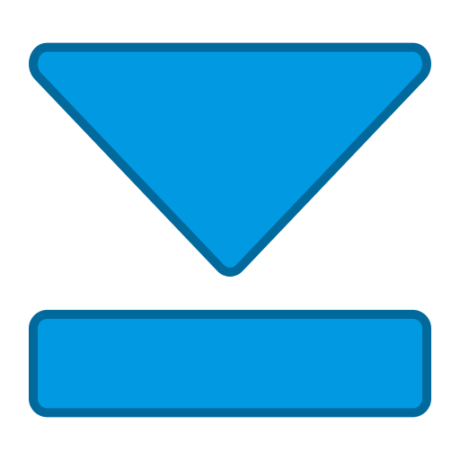

Pressure Monitoring
-------------------

.. admonition:: Caution
   :class: error
  
   Dosing with Nemesys pumps can create high pressure levels, which may
   cause damage to syringes, the fluidic system or the application. To
   prevent this from happening, you should monitor the pressure in your
   system, manually or automatically, using pressure sensors.

Assigning Pressure Sensors
~~~~~~~~~~~~~~~~~~~~~~~~~~

You can assign a pressure sensor to each pump. This sensor will then be
displayed on the pump's front panel and can be used for automatic
pressure monitoring. The pressure sensor does not have to be
electrically connected to the pump. You can use any sensor displayed in
the I/O channel list (see image below).

.. figure:: Pictures/1000020100000190000000FC6D10B51DF557A864.png

.. tip::
   To use any analog input as a pressure measuring 
   input, you have to set it up beforehand. Please refer to 
   the Qmix I/O plugin section :ref:`Configure Sensor Scaling` for    
   more on the configuration of I/O channels. 

To assign a pressure sensor to a pump, drag the pressure sensor from the
I/O channel list and drop it on the pump's front panel.

.. image:: Pictures/100002010000045D000002A7CFEF571ED65786B1.png

When you
release the mouse button, the pressure sensor is added to the pump's
operating panel. The pressure sensor is now displayed in the form of a
digital manometer below the syringe, or below the valve, if a valve is
present (see figure below).

.. image:: Pictures/1000020100000235000001256D259A8883FF0BAA.png

The display changes
color depending on the pressure being measured. This gives you a quick
indication of how close the pressure level is to the pressure limit.

.. admonition:: Important
   :class: note

   You can only assign one pressure sensor per pump.

If you want to restore the original sensor of a pump, select 
:menuselection:`Restore Default Pressure Sensor` from the context menu on the 
pressure display.

.. image:: Pictures/1000020100000139000000B4CE10195A7B1DFEB5.png

Configuring the Pressure Monitoring Function
~~~~~~~~~~~~~~~~~~~~~~~~~~~~~~~~~~~~~~~~~~~~~~

Once you've assigned a pressure sensor to a pump, you can set up the
pressure monitoring function for that pump. When the function is active,
it will continuously monitor the current system pressure and trigger
certain responses, if the pressure falls below or rises above certain
limits. This could include a pump stop, for example.

Please follow these steps to set up the pressure monitoring function:

.. rst-class:: steps

#. Perform a right mouse click on the pressure display and select
   :menuselection:`Configure Pressure Monitoring` from the context menu
   (see image below).

   |Figure 6: Selecting the Pressure Monitoring Configuration|

#. The dialog window for pressure sensor configuration will be displayed
   (see image below).

   .. image:: Pictures/100002010000018000000216A8684657BB7011FA.png

#. Define a safe range by entering a lower limit and an upper limit :guinum:`❷`.
   The upper limit is limited by the maximum permissible system
   pressure. This maximum pressure level is dictated by the maximum
   rated pressure of the syringe, the valve, the pressure sensor and
   the maximum force provided by the drive unit.

#. By selecting the respective button, you can determine what you want
   to happen when the lower threshold is underrun (:guilabel:`Underrun Action`)
   :guinum:`❸` or the upper threshold is exceeded (:guilabel:`Overrun Action`).

#. Please select the pumping direction you want the monitoring function
   to apply to. You can monitor filling, dosing or both. The
   recommended standard setting is dosing. In this setting the pump
   gets stopped in case of excessive pressure, while letting you ease
   the pressure by switching to filling.

#. Make sure the :guilabel:`Monitoring enabled` :guinum:`❶` checkbox is checked.
   Otherwise the pressure monitoring function will not be active.

#. Accept the configuration by pressing :guilabel:`OK` :guinum:`❺`.

In the *Overrun* and *Underrun Action* :guinum:`❸` panel, you have the following
options:

-  **Do Nothing** – safe range departure is ignored. The neMESYS module
   continues dosing. There is no information or warning of any kind.
-  **Warn Only** – a warning message is displayed upon safe range
   departure. The neMESYS module continues dosing.
-  **Stop Pump Drive** – dosing is stopped upon safe range departure. In
   addition, a warning message is displayed.
-  **Disable Voltage** – the dosing module is stopped by cutting off the
   motor's electrical power. In this case the syringe piston may be
   moved by the pressure in the system. In addition, a warning message
   is displayed. The pump must be reactivated to be able to use it again
   (see section `Enabling a disabled pump`_).

Using the Pressure Monitoring Function
~~~~~~~~~~~~~~~~~~~~~~~~~~~~~~~~~~~~~~

High pressures can quickly occur during dosing, which can damage the
valve or the pressure sensor. For this reason, it is particularly
important to monitor the overpressure in the dosing direction. Whether
the pressure monitoring is active is indicated by the small shield
symbol which is shown in the pressure display when pressure monitoring
is activated (see figures below). Only if an action has been configured
for the overpressure that causes the pump to stop, the shield symbol is
shown in orange. If an action has been selected for overpressure
monitoring that only issues a warning, the label is grayed out.

+----------------------+----------------------+----------------------+
| |monitoring1|        | |monitoring2|        | |monitoring3|        |
+----------------------+----------------------+----------------------+
| Pressure monitoring  | Pressure monitoring  | Pressure monitoring  |
| disabled             | enabled - Pump is    | enabled - Pump is    |
|                      | not stopped in case  | stopped in case of   |
|                      | of overpressure      | overpressure         |
+----------------------+----------------------+----------------------+

The arrows in the label indicate the pump direction for which pressure
monitoring is active:

============== ==============================
|mon_filling|  Filling monitoring
|mon_dosing|   Dosing monitoring
|mon_always|   Filling and dosing monitoring
============== ==============================

.. tip::
   Once the pressure monitoring function has been 
   configured, you can activate it or deactivate it an any 
   time using the context menu of the pressure display     
   (see image below). 

.. admonition:: Important
   :class: note

   If you remove an assigned pressure       
   sensor, for example by restoring a default pressure     
   sensor, the pressure monitoring function will be        
   deactivated automatically.   

If you move the mouse pointer on top of the pressure display, you will
get additional information regarding the pressure monitoring function as
well as the maximum pressure of the sensor and the system:

Enabling a disabled pump
------------------------------------------

If a Nemesys module has been disabled by a monitoring function, the
color of the LED in the pump's control panel will change from green :guinum:`❶` to
red :guinum:`❷`.

|Figure 8: Pump Status Display|

To be able to use the pump again, you
have to reenable it. Perform a right mouse click on the pump's
operating panel and select :menuselection:`Enable Pump Drive` from the context menu
(see image below).

.. image:: Pictures/1000020100000226000000B397F3BA342CB9289C.png

Syringe configuration
---------------------

Introduction to Syringe configuration
~~~~~~~~~~~~~~~~~~~~~~~~~~~~~~~~~~~~~~~~~~~~

The software provides user-friendly ways of configuring and managing
your own syringes. The configuration and use of specific syringes in the
software thus fulfil two requirements:

#. The software calculates all flow rates and volumes on the basis of
   the configured syringe.
#. The motion of the piston is limited by the configured syringe length
   and the set limits.

Opening the configuration dialog
~~~~~~~~~~~~~~~~~~~~~~~~~~~~~~~~

The software constantly shows the current flow rate for each dosing
unit. The program needs the parameters for each syringe in order to
calculate the flow rates. You should configure these values properly
each time a syringe is changed.

To do this, make a right mouse click on the axis of the image of the
syringe you want to configure. Select the :menuselection:`Configure Syringe`
menu item in the appearing context menu. Then select the syringe you 
want to configure, as shown in Figure below. The *Configure syringe* 
dialog then opens.

.. figure:: Pictures/100000000000017F000000C72D5302EF6D73D652.png

.. admonition:: Important
   :class: note

   Please note that when a syringe is       
   changed, the fill flow rate and empty flow rate of this 
   dosing unit are reset to 0. This means that you have to 
   reconfigure these values after each syringe change.     

Syringe selection dialog
~~~~~~~~~~~~~~~~~~~~~~~~

In this dialog, you can also select the desired syringe from a list of
available syringes. The following options are available here:

|Figure 2: Syringe selection dialog|

The list view :guinum:`❶` displays all the
syringes that you have previously created. If the list contains a
suitable syringe, you can select it, and close the dialog by clicking
:guilabel:`Apply Syringe`. Alternatively, you can simply select a syringe by
double clicking the syringe.

If the list does not contain a suitable syringe, a new syringe can be
created by clicking the :guilabel:`Create` :guinum:`❷` button. Clicking 
the :guilabel:`Edit` button opens a window to edit the syringe parameters of the currently marked
syringe. You can remove a syringe from the list by clicking the :guilabel:`Delete`
button. A syringe can also be removed by pressing the :kbd:`Delete` key.

On the right you will see a preview image :guinum:`❸` of the currently selected
syringe and all syringe parameters

The selection can be completed at any time by clicking :guilabel:`Apply Syringe` 
:guinum:`❹` or cancelled by clicking :guilabel:`Cancel`.

List of available syringes
~~~~~~~~~~~~~~~~~~~~~~~~~~

The list of available syringes shows all available syringes in tabular
form. It contains both the standard syringes defined by CETONI and the
syringes created by the user. The icon in the first column indicates
whether the syringe is a standard syringe or a user-specific syringe:

========== =======================================
|syringe1| Predefined standard syringe from CETONI
|syringe2| Syringe created by user
========== =======================================

.. admonition:: Important
   :class: note

   Predefined syringes can not be edited or 
   deleted.      

You will find the following columns in the syringe list:

- **Name** - Unique syringe name. Syringes with the same name are not allowed.                

- **Material** - Steel or glass – the syringe display is adjusted accordingly                      

- **Max. Pressure (bar)** - Maximum syringe pressure – important for  
  pressure monitoring                       

- **Suited for pump**- Shows for which pump a syringe is suited. 
  If this field is empty, it is a syringe that was created by the user.   

.. tip::
   If you click in the header of a column, the   
   syringe list is sorted according to this column. This   
   is indicated by a small arrow above the column title.   
   By clicking again in the same column header, you can    
   reverse the sorting.    

.. image:: Pictures/10000201000002230000022371E273E087477440.png
   :width: 60
   :align: left

To search for a specific syringe in the list, simply
right-click on a cell in the column you want to search. Usually this
will be the *Name* column. From the context menu that is then displayed,
choose :menuselection:`Search in column`.

A search field is displayed in which you can enter your search text :guinum:`❶`.

.. image:: Pictures/100002010000015D000000EFB70D100D1CA3DEDA.png

While typing, a list of possible
hits is displayed :guinum:`❷`. As soon as there is a matching entry, select it
with the cursor keys or click on the entry with the mouse. The search
dialog will be closed and in the list of syringes the found syringe will
be highlighted in color.

Configuring the syringe parameters
~~~~~~~~~~~~~~~~~~~~~~~~~~~~~~~~~~

If you click the :guilabel:`Create` or :guilabel:`Edit` button, the *Syringe
Configuration Wizard* for configuring the syringe parameters opens.

.. image:: Pictures/100002010000019A0000002FF7133A8CD9E5221A.png

Please configure a syringe with the following steps:

.. rst-class:: steps

#. First assign a unique name to the syringe in the field
   :guilabel:`Unique syringe name` :guinum:`❶` (Figure below). If you have
   selected a syringe for editing and only change its name, you can generate a 
   copy of the selected syringe. Then select the syringe material :guinum:`❷`. 
   Click :guilabel:`Next` to go to the next step.

    .. image:: Pictures/1000020100000288000001A4EEE8573B18AE8967.png

#. You should
   now configure the inner diameter of the syringe. The inner diameter
   of the syringe is required in order to calculate flow rates and dose
   quantities. If you do not know the inner diameter, you can
   alternatively define the inner diameter via the :guilabel:`Scale length` in
   mm, and the volume it contains via :guilabel:`Scale volume` in μl. The
   software then uses these values to calculate the inner diameter of
   the syringe. In this step, select how you want to configure the
   inner diameter of the syringe. (Figure below). Depending on the
   selection, you continue the configuration with point **(3)** or
   **(4)**. Click :guilabel:`Next` to go to the next step.

   .. image:: Pictures/100002010000028800000185AF36898A33DA145C.png

#. You configure the inner diameter of the syringe by entering the
   scale length and volume within this scale length. (Figure below). To
   do this, measure, the scale with a suitable measuring instrument
   (calliper gauge), and read the volume shown on the inscription on
   the scale. Then click :guilabel:`Next` to go to the next step, and read
   further at point **(5)**.

#. You configure the inner diameter of the syringe by measuring it with
   a calliper gauge. Then enter the value in the :guilabel:`Inner Syringe Diameter`
   field, and click :guilabel:`Next` to go to the next step.

   .. image:: Pictures/100002010000028800000162E28D58A7BA62F4FD.png
    
#. Now configure the piston stroke :guilabel:`Piston Stroke` of the
   syringe (Figure below). The piston stroke is the maximum length
   through which the piston can be moved in the syringe without it
   leaking and liquid emerging. It is advisable to use the length of
   the scale on the syringe as the maximum piston stroke.

   |Figure 6: Syringe configuration step 2 – Piston stroke|

   If syringes of
   different lengths are used in a multi-syringe holder, the syringe with
   the shortest piston stroke limits the range of travel of the drive. When
   you have entered the piston stroke, the software uses this and the inner
   diameter to calculate the maximum dosable volume.

#. In this step you can define the limits for the maximum and minimum
   syringe fill levels. (Figure below). In this way, you can limit the
   range of travel of the piston by two additional software limits. You
   can enter these parameters optionally in microlitres or millimetres.
   You should use these values to limit the range of travel, for
   example when using a syringe stirrer. If you enter the value in one
   unit (e.g. millimetres), the value in the other unit (e.g.
   microlitres) is calculated by the software.

   |Figure 7: Syringe configuration step 6 - Limits|

   The syringe preview
   on the left-hand side always shows you the current configuration of the
   syringe. The width of the syringe changes when the inner diameter
   changes. The length of the syringe changes when the maximum piston
   stroke is changed, and the two red marks on the syringe indicate the two
   additional limits. The syringe is subsequently also shown corresponding
   to this preview in the software.

#. Finally enter the maximum pressure the syringe can be used with.
    This value is the maximum value you can use for pressure monitoring.
    (see section `Pressure Monitoring`_).

   .. image:: Pictures/100002010000028800000162A0AA05D585AC109D.png

#. Close
   the configuration of the syringe parameters by clicking the *Finish*
   button. You can cancel the configuration at any time by pressing the
   *Cancel* button. You can always return to the previous configuration
   step with the *Back* button.

Configuration of SI units
-------------------------

When dosing liquid flows, the main parameters are the flow rates used
and the quantities of liquid to be dosed or already dosed. For optimal
adaptation to the particular application, the user can configure the SI
units individually for displaying the flow rates and volumes for each
individual dosing unit. To show the SI-dialog, click with the right
mouse button in the control panel of the pump to display the context
menu.

|Figure 9: Pump context menu|

Then click the menu item :menuselection:`Select Volume Unit` to configure the
SI unit of volume or click the menu item :menuselection:`Select Flow Unit`, 
to configure the SI unit of flow rates. A SI-unit selection dialog window appears.

|Figure 10: SI-unit selection dialog|

Set the desired SI unit, and close the dialog by clicking :guilabel:`OK`.

Direct Control
--------------

Direct Control Overview
~~~~~~~~~~~~~~~~~~~~~~~~~~

.. image:: Pictures/100002010000009E000001A84E67845F7A6B164B.png

Use the direct control for interactive control of the dosing
units. In this way, you dose precisely defined quantities of liquid with
defined flow rates or generate constant liquid flows.

The direct control also displays the current flow rate, the dosed volume
and the fill level of the syringe. If you use a high-pressure module,
the current pressure measured by the pressure sensor is also displayed.

Following controls and indicators are available:

.. rst-class:: guinums

1. Toolbar
2. Target values of the dosing module
3. Actual values of the dosing module

Toolbar
~~~~~~~

The toolbar includes buttons for starting dosing processes. The
following buttons are available:

========== =======================================================
|toolbar1| Start the dosing with set target values
|toolbar2| Stop dosing
|toolbar3| Aspirate reagent - Move dosing unit to maximum position
|toolbar4| Empty syringe - Move dosing unit to minimum position
|toolbar5| Configure the continuous flow
========== =======================================================

.. admonition:: Attention
   :class: caution

   Danger of damaging the syringe during    
   emptying! When the syringe is emptied, according to the 
   configuration, the dosing unit is moved toward the      
   lower limit position at high speed.  

Target value
~~~~~~~~~~~~

Selecting dosing mode
^^^^^^^^^^^^^^^^^^^^^

You define the type of dosing with the
selection buttons on the on the left-hand side.

The following options are available:

-  **Volume** - Select this mode to dose a specific volume at a defined
   flow rate
-  **Flow** - In this mode, you generate a constant flow of liquid. The
   dosing continues until a limit position is reached or until you stop
   the dosing process.
-  **Syringe Level** - In this mode, you can define a specific fill level
   for the syringe which is to be reached at a defined flow rate.

Setting flow rate and volume
^^^^^^^^^^^^^^^^^^^^^^^^^^^^

Use the :guilabel:`Volume`, :guilabel:`Flow` and :guilabel:`Syringe Level` 
input fields in order to enter the flow rate, the flow volume or the syringe 
level. Setting the set-points does not start the drives or change the current 
flow rate. The new values are not transferred to the dosing unit until a dosing
process is started by pressing the :guilabel:`Start` button in the toolbar.

Volume dosing
^^^^^^^^^^^^^

If you want to dose a specific volume, you have to enter the volume to
be dosed and the flow rate. The volume is entered relative to the
current position of the syringe piston. This means that you enter a
negative volume to aspirate reagent and a positive volume to dispense
reagent. In this operating mode, the flow rate is always a positive
value, and defines the flow rate of the aspiration/dispensing of
reagent.

Constant flow rate
^^^^^^^^^^^^^^^^^^

In order to generate a constant flow of liquid, only the flow rate has
to be defined, and the volume input field is disabled for entries. In
this operating mode, the flow rate can be either positive or negative. A
negative value indicates reagent aspiration, and a positive value
reagent dispensing.

Setting syringe level
^^^^^^^^^^^^^^^^^^^^^

You can achieve a precisely defined syringe fill level by entering the
values for the syringe fill level and the flow rate. The syringe fill
level must be a positive value lying between the minimum and maximum
values of the syringe fill level. (see section `Syringe configuration`_). 
In this operating mode, the flow
rate is always a positive value, and defines the flow rate of the
aspiration/dispensing of reagent.

.. admonition:: Attention
   :class: caution

   Danger of damaging the valve or          
   connections in the liquid path High flow rates can      
   cause high pressures to develop very quickly, which can 
   damage the valve, connections in the liquid path or     
   your application.     

.. admonition:: Important
   :class: note

   For dosing very low flow rates, select   
   syringes with small inner diameters in order to ensure  
   pulsation-free dosing.      

Actual Values
-------------

The current values reported by the device are shown in the 
:guilabel:`Actual Values` area.

.. image:: Pictures/10000201000000A3000000D936035CE9D70E6F8F.png

The :guilabel:`Flow` field shows the current flow rate
in the dosing unit. The :guilabel:`Volume` field shows the volume that has been
pumped since the last time the dosing unit was started. If the drive is
stopped and restarted, the actual value of the pumped volume is reset to 0. 
The :guilabel:`Syringe Level` field shows the current fill level of the dosing
unit in the configured SI volume unit.

Synchronous pump start / stop
-----------------------------

In the main toolbar, you will find two buttons for simultaneously start
/ stop multiple pump modules.

.. image:: Pictures/10000000000002100000004E2CFFC454D39AB8D9.png

.. image:: Pictures/sync_start.svg
   :width: 60
   :align: left

When you click the :guilabel:`Sync Start`
button :guinum:`❶`, a selection dialog appears in which you select the pumps that
you want to start at the same time (see figure below).

.. image:: Pictures/100002010000013A0000011B729AF6870BDA3CDF.png

Set a checkmark for
each pump you want to start. Dosage starts as soon as you klick the 
:guilabel:`OK` button.

.. admonition:: Important
   :class: note

   Before starting, you need to configure   
   the dosing parameters (volume, flow) of all selected    
   pumps in the control panel of each pump.  

Before the software starts the dosage, it checks the configured
parameters of all selected pumps. If the software found invalid
parameters (eg flow or volume values of 0), the synchronous start is not
performed. In the application *Event Log* you will get information
about the problems encountered.

.. image:: Pictures/10000201000002810000008B3DC15D90BE641006.png

When you click the :guilabel:`Stop All` button :guinum:`❷`, all pumps are stopped immediately.

|
|

.. |Figure 6: Selecting the Pressure Monitoring Configuration| image:: Pictures/1000020100000144000000B30A56CA320F030E21.png

.. |monitoring1| image:: Pictures/100002010000006B0000006B365777AF0E6D78EE.png
.. |monitoring2| image:: Pictures/100002010000006B0000006B74DCFA441C7082B3.png

.. |mon_filling| image:: Pictures/10003607000035050000350533EA6BA84CD29399.svg
   :width: 60
.. |mon_dosing| image:: Pictures/10003605000035050000350547D40E228AE1ECA1.svg
   :width: 60

.. |Figure 8: Pump Status Display| image:: Pictures/1000000000000205000000E324C478DCDA68618B.png

.. |syringe1| image:: Pictures/1005A3140000109100001091CCFB5CA93067BCC0.svg
   :width: 60

.. |Figure 6: Syringe configuration step 2 – Piston stroke| image:: Pictures/1000020100000288000001628DA24CB3EDC0A2EF.png

.. |Figure 7: Syringe configuration step 6 - Limits| image:: Pictures/100002010000028800000162919C8B52DB5AA3E1.png

.. |Figure 9: Pump context menu| image:: Pictures/100000000000022E000000C19B0C9EFBDA77502B.png

.. |toolbar2| image:: Pictures/100009170000388C0000388C5FBCE4289669598A.svg
   :width: 40

.. |toolbar5| image:: Pictures/10006B24000034EB000034EB2B72B9A4AEDF2E9A.svg
   :width: 40

