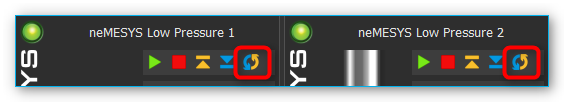
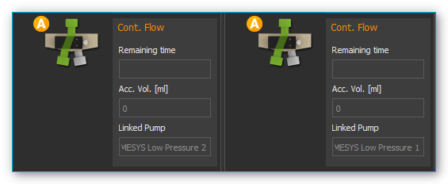
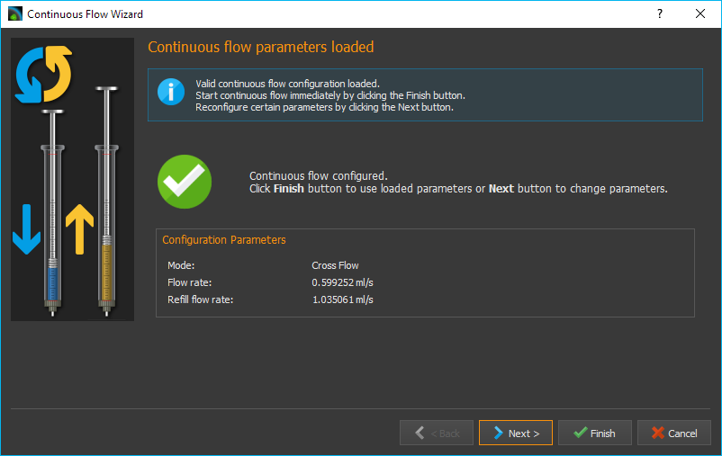
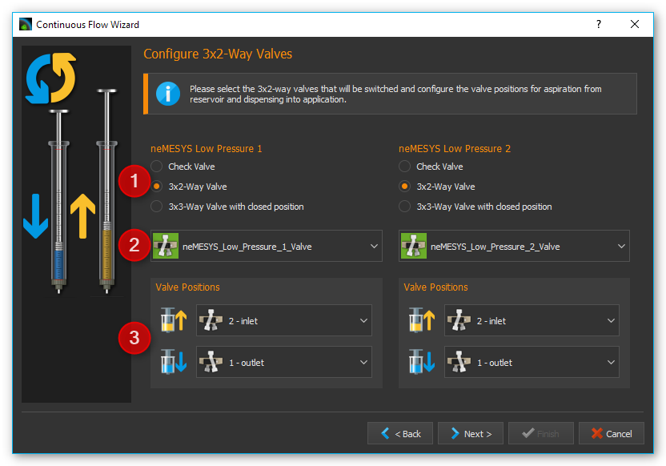
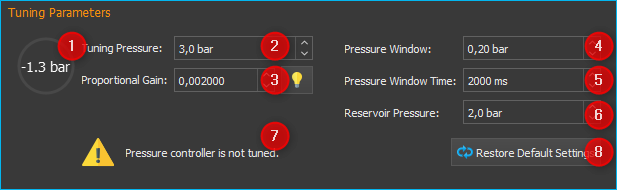
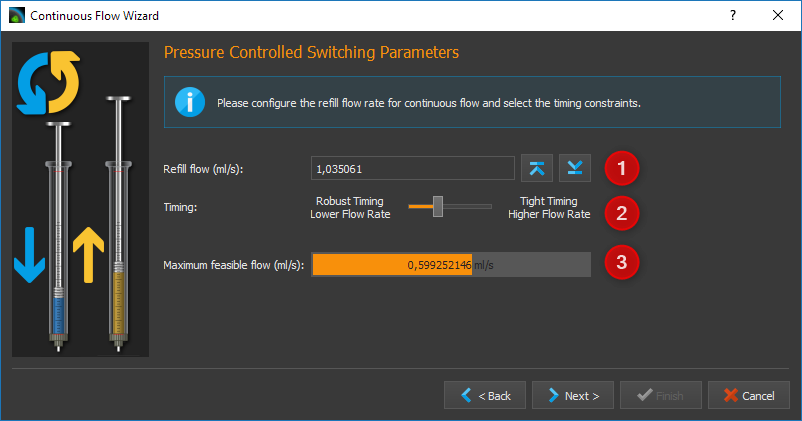

Continuous Flow
---------------

Introduction to Continuous Flow
~~~~~~~~~~~~~~~~~~~~~~~~~~~~~~~~~~~~

In continuous flow mode you can pair two pumps together using the
software, in order to create a continuous flow over a long period of
time through alternating fluid take-up and discharge. In this case one
of the pumps doses at a particular flow rate, while the other pump takes
up reagent from the reservoir. Once the dosing pump has emptied the
syringe, the software automatically switches to the second dosing unit
with a full syringe and continues dosing with that pump. This creates a
continuous, uninterrupted flow, which lets you dose at a constant flow
rate for a nearly unlimited period of time.

Operating and Display Elements
~~~~~~~~~~~~~~~~~~~~~~~~~~~~~~

You can recognize a dosing unit that was configured for continuous flow
by the activated continuous flow icon in the direct control window (see
image).

The continuous flow mode
is terminated automatically, as soon as you change the syringe
configuration of one of the connected dosing units. In this case you
have to reconfigure all parameters. If continuous flow has been
activated for one of the dosing units, the operating panel will indicate
“continuous flow” in its status display (see image below).

The following display elements will then be visible:

-  **Remaining time** – shows the remaining time for continuous dosing.
   When this display reaches zero, continuous flow is stopped
   automatically.
-  **Accumulated volume [ml]** – the accumulated discharged volume shows
   the total volume discharged by both pumps into the application.
-  **Linked pump** – the linked pump is the second pump paired to this
   pump for the purpose of achieving continuous flow.

Configuring Continuous Flow
~~~~~~~~~~~~~~~~~~~~~~~~~~~

You will need at least two Nemesys dosing units to achieve continuous
flow. Both units should have a valve. To configure continuous flow
perform a right mouse click on the operating panel of the direct
controller and select :menuselection:`Configure continuous flow` 
from the context menu (see image below).

.. image:: Pictures/1000000000000231000000BAD54DEB42C3F65FB7.png

A configuration dialog
will appear. The dosing unit you click on for configuring continuous
flow is the first of the dosing units to be paired. If continuous flow
has not been configured for this dosing unit, you can also open the
configuration dialog by pressing the :guilabel:`Continuous Flow` button in the
direct control window (see image below).

.. image:: Pictures/10000000000000AC00000042C7E1513050994EA1.png

If you see the following configuration page after calling up
the dialog (see image below), the previously set configuration was
loaded successfully and all you have to do is click the Finish button to
accept the configuration.

If you want to change certain parameters of the loaded
configuration, click on the Next button to browse the individual pages
of the configuration assistant.

Selecting the second Dosing Unit
~~~~~~~~~~~~~~~~~~~~~~~~~~~~~~~~

On this page of the
configuration dialog you can select the second continuous flow unit from
a list of available dosing units. If no configuration has been loaded,
this will be the first page of the configuration assistant. Select the
dosing unit of your choice by clicking the relevant name in the list.
Then click on Next to continue the configuration.

.. admonition:: Important
   :class: note

   For continuous flow you should always     
   select two dosing units that are immediately connected   
   and displayed next to each other in the software.   

Selecting a Continuous Flow Mode
~~~~~~~~~~~~~~~~~~~~~~~~~~~~~~~~

.. image:: Pictures/1000020100000322000001A51A93BAD0DAE927D5.png

You can choose from the following continuous flow modes:

-  **Pressure Controlled Switching** - yields the best results without
   changing pressure or flow rate when switching units. However, you
   will need a pressure sensor on each pump.
-  **Cross-Flow**- provides a soft transition and a constant flow rate
   when switching from one dosing unit to the other. This mode is most
   suitable if your application uses a low system pressure and you don’t
   have pressure sensors.

The individual modes will be explained in detail in the following
subsections. Perform a left mouse click on the mode you wish to
configure and then click on Next to continue.

Configuring 3x2-way Valves
~~~~~~~~~~~~~~~~~~~~~~~~~~

During continuous flow operation the respective valves get switched for
both pumps. In the *Configure 3x2-way Valves* window (see image below)
you can configure the valves and valve positions for your 3x2-way
valves.

.. tip::
   If you have already assigned valves to your    
   pumps, these valves are automatically selected here.

First, select the valve type you wish to use :guinum:`❶`. If you use
3x2-way valves and have selected
:guilabel:`Pressure-Controlled Switching`, you will need additional
shut-off valves. If you use 3x3-way valves with an additional closed
position, you will not require additional shut-off valves for
pressure-controlled switching.

Use the selection box :guinum:`❷` to select the valve you want to switch. Using
the two selection boxes below :guinum:`❸`, select the positions you want the valve
to switch to when filling and dosing. If you have a 3x3-way valve with
an additional closed position, you also need to configure the closed
position.

.. image:: Pictures/100000000000027400000050FC75667E716B4EBE.png

Configuring Shut-off Valves 
~~~~~~~~~~~~~~~~~~~~~~~~~~~~~~~~~~

If you have selected pressure-controlled switching and your 3x2-way
valves do not have a closed position, you will need to configure your
shut-off valves in this next step. As in the valve dialog above, please
select the valves and configure the closed :guinum:`❶` and open :guinum:`❷` valve position.

.. image:: Pictures/10000000000003400000022D3939253C9F4C9986.png

Configuring Pressure Sensors
~~~~~~~~~~~~~~~~~~~~~~~~~~~~~~~~~~~~~~~~~~~~

If you have selected pressure-controlled switching, you need to
configure the pressure sensors for both pumps in this next step (see
image below).

.. image:: Pictures/1000000000000340000001E2129FDD2D9C04C10E.png

.. tip::
   If you have already assigned pressure sensors  
   image10  to your pumps that are displayed on the front panel,     
   these sensors are automatically selected here, and you   
   can proceed immediately by clicking ::guilabel:`Next >`.

Pressure-controlled Switching
~~~~~~~~~~~~~~~~~~~~~~~~~~~~~~~~~~~~~~~~~~~~~~~~~~~~~~~~~~~~~~~~~~~~~~~~~~~~~~~~~~~~~~~~~~~~~~~~~~~~~~~~~~~~~~~~~~

Introduction to pressure-controlled switching
^^^^^^^^^^^^^^^^^^^^^^^^^^^^^^^^^^^^^^^^^^^^^

In pressure-controlled switching the pressure of the filling pump is
adapted to the pressure of the dosing pump prior to switching, through
the use of valves and pressure sensors. In addition, during the
switching process the flow of both pumps is cross-faded (cross-flow).
This prevents the occurrence of a switching impulse, while pressure and
flow rate stay nearly constant.

Since a certain period of time is needed to fill and cross-fade the
pump, in order to build and reduce pressure and to switch the valves,
the achievable flow rate in continuous mode is lower than the maximum
flow rate of each of the individual pumps involved.

In the configuration window for pressure-controlled switching you can
set all parameters and you can adjust the pressure controller of each
pump for the current configuration and the desired application pressure.

.. image:: Pictures/10000201000003220000022A91AAB220A4857814.png

In the
upper part of the window :guinum:`❶` you find the tuning parameters. In the lower
part of the window :guinum:`❷` you will find a diagram, which shows the
controller's target value (white) and the measured pressure value (in
color) during adjustment. Using this graphic representation you can get
an idea of the pressure controller's operational status and detect
issues like excessive oscillation.

.. admonition:: Caution
   :class: error
  
   Very high pressure may occur during        
   tuning. If necessary, you should activate :ref:`pressure  
   monitoring <Pressure Monitoring>`, in order to stop the pump when certain         
   pressure values are exceeded.

Tuning Parameter Overview
^^^^^^^^^^^^^^^^^^^^^^^^^

The continuous mode uses a dedicated pressure controller for each pump
to regulate the target pressure in the filling pump before switching to
the application. The proportional gain of the controller depends on many
factors, such as pressure, tightness, tube length and the fluid being
used. This value must be re-calibrated or retuned for each setup. The
tuning section uses the following operating elements:

.. rst-class:: guinums

1. **Pressure Display** – depending on the dosing direction
   (filling/discharge) the pressure display is colored in orange or
   blue.
2. **Tuning Pressure** – this is where you set the pressure to which
   the pressure controller will be tuned. Set the anticipated
   application pressure you will use for dosing into your application.
3. **Proportional Gain** – this field shows you the proportional gain
   of the pressure controller. If you click the button with the lamp
   symbol, the system will suggest a proportional gain for the target
   pressure you set. This value can be used as a starting point for
   tuning.
4. **Pressure Window** – Defines a symmetrical range of accepted
   pressure values relative to the target pressure. This means that only
   if the pressure is within this window for the duration of the
   *Pressure Window Time* it will be considered stable. A value that is
   too high may cause the controller to overshoot, a value that is too
   low may cause long times for the target pressure to settle, or may
   cause the target pressure never to be reached. The value that should
   be set depends on the target pressure and the quality of the pressure
   sensors used. The pressure window must always be greater than the
   fluctuations of the pressure sensor, otherwise the pressure will
   never be considered stable.
5. **Pressure Window Time**– The time the pressure must be within the
   *Pressure Window* for it to be considered stable by the software.
6. **Reservoir Pressure** – Set the pressure that exists in the
   reservoir from which the syringe is filled. The pressure is lowered
   to this pressure before the valve to the reservoir is opened to fill
   the syringe.
7. **Status Display** – the status display gives you information
   regarding the current status of the pressure controller or the
   calibration. You should only go to the next step if you see a green
   checkmark here or if a previous tuning has been loaded.
8. **Restore Default Settings** – pushing this button restores the
   standard tuning parameters.

Tuning the Pressure Controller
^^^^^^^^^^^^^^^^^^^^^^^^^^^^^^

A pump's pressure controller should be tuned at the approximate piston
position at which the switching to the other pump takes place. If you
use two identical pumps, this usually happens when the syringe is almost
completely filled. To make sure that the syringe can still be filled
further for pressure building, the piston should not be in the rearmost
position. As a rule of thumb the syringe should be filled to about 90%.

Please follow the steps below to tune the pressure controller.

.. rst-class:: steps

#. First, enter the desired tuning pressure :guinum:`❷`. This should be
   approximately equal to the application pressure at the desired flow
   rate. You can determine the tuning pressure ahead of time by dosing
   into your application at the desired flow rate.
#. Now select the starting value for the proportional gain :guinum:`❹` of the
   controller. If you click on the button with the lamp symbol, the
   system will suggest a starting value for the selected pressure.
#. Start the tuning process by clicking the :guilabel:`Start Tuning` button. The
   software will now start tuning the controller automatically. For
   safety reasons tuning will begin at 50% tuning pressure, to avoid
   damage due to pressure overshooting. The system tunes the controller
   in such way as to arrive at the target pressure quickly with a
   minimum of overshoot.

.. image:: Pictures/100000000000029B000000D0324E5253118A97DF.png

If achieving the target pressure takes a long time (10
seconds or more – see image below), you can interrupt the tuning process
and increase the proportional gain manually (by doubling it, for
example).

If the controller overshoots a lot, you can interrupt the tuning process
and decrease the proportional gain manually (by halving it, for
example). Restart the tuning process with the new values.

.. tip::
   After a successful tuning, change the value    
   for the target window (Pressure Window) and start       
   another tuning run. You will get a feeling for how      
   Pressure Window value affects controller tuning.  

During tuning the controller's proportional gain is adjusted
automatically. If you just want to manually test the current control
parameters without the automatic adjustment, simply start a parameter
test by clicking on :guilabel:`Test Parameters`.

.. image:: Pictures/100000000000029B000000D07CB8BD8EA57530D0.png

During the parameter test the pump cycles between a
non-pressurized state of 0 bar and the set tuning pressure. This lets
you visually check and evaluate the current control parameters using the
diagram.

Perform a right mouse-click on the diagram to open the context menu with
additional diagram functions.

.. image:: Pictures/100000000000029000000120B3361EA8175F41D4.png

Setting Parameters
^^^^^^^^^^^^^^^^^^

After tuning both pumps, go to the next page to set further parameters
for pressure controlled switching.

In the :guilabel:`Refill Flow` field :guinum:`❶`, set the flow rate used to
fill the syringe. The larger you select this value, the higher the
maximum flow rate that can be realized for continuous dosing. This means
that you should always select the filling flow rate as high as possible
or as high as your application allows. If the filling flow rate is too
high, air bubbles may form.

The :guilabel:`Timing` slider :guinum:`❷` lets you control the timing of continuous flow
operation. During tuning, the volume and time periods needed for
pressurizing the filling pump are determined. These time values are
multiplied by a certain factor to create a safety margin. This buffer is
used to compensate for delays during pressure building, which can be
caused by issues or variations in the system. You can use the slider to
select a higher margin (*Robust Timing*) or a lower margin (*Tight
Timing*).

|image03_19|

Using a larger buffer decreases the flow rates that can be
achieved in comparison to a smaller buffer. In the same way, a smaller
buffer increases the risk of disrupting the continuous flow timing in
case of system issues or variations, possibly leading to flow
instabilities. Double-clicking on the slider sets the standard value we
recommend, unless you absolutely need a higher or lower flow rate.

.. admonition:: Important
   :class: note

   A small safety buffer for the timing     
   increases the risk that the timing of the continuous    
   flow is disturbed and the continuous flow is            
   interrupted if the application pressure fluctuates or   
   if other disturbances occur.

In the field :guilabel:`Maximum feasible flow (ml/s)` :guinum:`❸` you can see the maximum
flow rate that can be achieved with the set parameters. The coloured bar
shows how far away this flow rate is from the maximum flow rate that you
can achieve in normal pump operation mode. This allows you to quickly
see how the refill flow rate and timing affect the realizable flow rate.

Once you have set all parameters, continue the configuration with
section `Set flow rate and duration of continuous flow`_.

Configuring Cross-Flow
~~~~~~~~~~~~~~~~~~~~~~

.. image:: Pictures/1000020100000322000001A6B9F155797B5B91F9.png

In the :guilabel:`Refill Flow` field :guinum:`❶`, set the flow rate used to
fill the syringe. By pressing the :guilabel:`Min` and :guilabel:`Max` 
buttons. The larger
you select this value, the higher the maximum flow rate that can be
realized for continuous dosing. This means that you should always select
the filling flow rate as high as possible or as high as your application
allows. If the filling flow rate is too high, air bubbles may form. This
flow rate is always slightly higher than the rate indicated in the
:guilabel:`Maximum feasible flow (ml/s)` field :guinum:`❹`, since the syringes must be
filled more quickly in order to be ready for the next dosing run when
the syringes are switched.

Cross-flow makes it possible to cross-fade the flows of the dosing
modules. This is done by configuring the :guilabel:`Cross-flow Duration`
:guinum:`❷`.

In the field :guilabel:`Maximum feasible flow (ml/s)` :guinum:`❹` you can 
see the maximum
flow rate that can be achieved with the set parameters. The coloured bar
shows how far away this flow rate is from the maximum flow rate that you
can achieve in normal pump operation mode. This allows you to quickly
see how the refill flow rate and timing affect the realizable flow
rate.

The following image shows the cross-fading of flows from two individual
pumps.

.. image:: Pictures/100002010000034B000002BF708D26F0E1102F63.png

The Cross-Flow-Duration t\ :sub:`cross` expresses the period of time needed for cross-fading one
dosing module to the other. The smaller this value, the steeper the flow
rate curve and the less time is required for the cross-flow operation to
be completed.

.. image:: Pictures/1000020100000320000002A28DB2B4CFC4D85EB4.png

Cross-flow offers you a simple way of
compensating for pressure drops during switching. The *Overlap Time* t\ :sub:`ov`
:guinum:`❸` governs the period of time by which the flow curves of both
dosing modules overlap. The larger the tov value, the longer both dosing
modules keep dosing simultaneously (see image above).

Set flow rate and duration of continuous flow
~~~~~~~~~~~~~~~~~~~~~~~~~~~~~~~~~~~~~~~~~~~~~

In this window (figure below) you set the flow rate at which the
continuous flow is started :guinum:`❶` and the duration of dosing :guinum:`❷`. If you don’t
want to limit the duration, simply leave the setting at *Dose
unlimited*. With this setting continuous flow is maintained until you
stop the dosing process manually.

.. image:: Pictures/1000020100000322000001A5B79EDE9CBF839695.png

The software offers you three ways of limiting the duration of
continuous flow:

-  **Dose volume** – continuous flow is stopped as soon as a defined
   dosing volume has been reached.
-  **Dose for –** continuous flow ends after a predetermined duration of
   time.
-  **Dose until** – continuous flow ends at a specific time in the future.

Starting/Stopping Continuous Flow
~~~~~~~~~~~~~~~~~~~~~~~~~~~~~~~~~

After the configuration you can start continuous flow
operation by a left mouse-click on the :guilabel:`Start Dosing` button in the direct
controller window.

|image03_23|

You can interrupt continuous flow operation at any time by
clicking the :guilabel:`Stop Dosing` button.

|image03_24|

If you stop a dosing unit involved in continuous flow operation, you
also stop the other dosing unit tied into the system. If you have
configured a particular duration for continuous flow operation, stopping
a dosing unit will also interrupt the preset duration, meaning that when
you restart the dosing unit, continuous flow operation will resume for
the time remaining at the point of interruption. If you configured a
target volume for continuous flow operation, the system will resume
dosing the remaining volume at the time of interruption, upon restart.

Cancel/Restart Continuous Flow
~~~~~~~~~~~~~~~~~~~~~~~~~~~~~~

Once the preset time for continuous flow operation has elapsed or the
target volume has been reached, continuous flow operation is terminated
and both dosing units are stopped. Performing a left click on the
:guilabel:`Start` :guinum:`❶` button lets you restart continuous flow operation. In this
case the duration or target volume will be reset to their starting
values. Left clicking on the :guilabel:`Continuous Flow` :guinum:`❷` button terminates
continuous flow mode and stops the continuous flow operation in
progress. In this case re-starting will not be possible (see image
below).

.. image:: Pictures/10000201000000AF00000041D5654AE6FF1B3C7A.png

Change flow rate in continuous flow
~~~~~~~~~~~~~~~~~~~~~~~~~~~~~~~~~~~~~~~

You can change the flow rate during a dosing run in all operating modes.
To achieve this enter the desired flow rate into the :guilabel:`Flow` field :guinum:`❶` 
and confirm by clicking on :guilabel:`Start` :guinum:`❷` with the left mouse button (see image
below).

.. image:: Pictures/1000020100000226000000C881350B3A934EF760.png

The dosing module accepts the
change in flow rate, while retaining all other dosing parameters, such
as volume or continuous flow parameters. When you configure continuous
flow operation you will be shown the maximum dosing flow rate achievable
with the currently set refill rate and the other continuous flow
parameters, for guidance (see image below).

.. |image03_23| image:: Pictures/10000201000000DC0000004C9FC9EE927968E354.png
.. |image03_24| image:: Pictures/10000201000000DC0000004C5F506061A78F169E.png
