Python Add-on
=============

.. image:: Pictures/python_header.svg

Introduction to Python Add-on
------------------------------

.. admonition:: Attention
   :class: caution

   The CETONI Elements Python Add-on allows you to control and automate processes
   using Python scripting language. 
   Check the created scripts/programs as well as parameter entries before you 
   execute them for the first time! CETONI assumes no liability for direct and/or
   indirect damage to your system or external hardware and software components
   caused by the scripts/programs you have created or by the use of parameters
   that are not suitable or unfavorable for your specific application.

The Python add-on allows you to execute Python code in CETONI Elements
scripts via a corresponding script function. It thus provides an easy
way to include the Python scripting language in your CETONI Elements
scripts.

The embedded Python interpreter offers the same functionality as an
execution of Python scripts via :command:`python` command. I.e. if you install
libraries via :command:`pip` for the Python version used by the add-on, the
functions of these Python libraries are also available in CETONI
Elements.

This gives you many additional possibilities such as accessing and
parsing files, accessing databases, TCP/IP network communication via
Python sockets or using complex analysis functions implemented in
Python.

.. _python-installation:

Installation
------------

The Python add-on is not included in the standard installation package,
but must be installed additionally as an add-on. The versions of the
Python add-on and the installed CETONI Elements software should match.
For example, if you want to install the Python add-on with version
number **20220126**, the CETONI Elements software **20220126** should be
installed.

.. admonition:: Important
   :class: note

   The version number of the CETONI Elements 
   software and the Python add-on should match. The version 
   number of the Python add-on must never be greater than   
   that of the CETONI Elements software. The greater the    
   difference between the version numbers, the greater the  
   risk of problems and errors.      

For installation, run the file :file:`CETONI_Elements_Python_64bit_Setup.exe`.
The installation wizard will then guide you through the installation of
the software.

|image4|

To use the Python add-on, a suitable Python 64-bit version
must be installed on your computer. In the installation step *Choose
Components* you can see the required version (here e.g. Python 3.8) and
select it for installation if it is not yet available on your computer.

.. image:: Pictures/10000201000001F300000184EEFA5602FDC005BD.png

.. admonition:: Important
   :class: note

   On Windows, you must be logged in with  
   administrator privileges to install the add-on, as it is 
   installed for all users. 

.. admonition:: Important
   :class: note

   The installed Python version **must**   
   match the version specified in the installer. The plugin 
   will not work correctly with other versions. 

Python Console
--------------

Overview of Python Console
~~~~~~~~~~~~~~~~~~~~~~~~~~~~~~~

The Python add-on has a Python console that allows you to interactively
enter and execute Python code similar to the standard Python console.
You can show the Python console from the main menu 
(:menuselection:`Window --> Show View --> Scripting --> Python Console`):

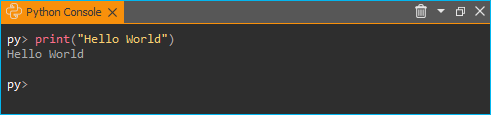

In the Python console, you can try out commands, test access
to objects, and it helps you debug problems. If function calls work in
the console, you can use them in your script.

Context Menu of Python Console
~~~~~~~~~~~~~~~~~~~~~~~~~~~~~~~~

The context menu of the Python console contains the usual commands for
text editing:

|image12|

To delete the contents of the console, select :guilabel:`Clear` :guinum:`❶` in
the context menu or click the trash can icon :guinum:`❷` in the title bar.

.. admonition:: Attention
   :class: caution

   Risk of malfunction or data loss !       
   Do not use the Python Console in a running experiment,  
   process or during normal operation or productive use.   
   Incorrect input or access to resources can possibly     
   lead to a crash of the software.  

Code completion
~~~~~~~~~~~~~~~

The Python console supports you during the typing with a simple code
completion. I.e., if you have imported modules, then the code completion
supports you with the source code editing by suitable suggestions, like
you are used to it from other code editors.

|image16|

In the example above all functions from the *cetoni_elements*
module were imported. After entering :code:`ScriptEnv.get`, matching functions
for the :code:`ScriptEnv` object are displayed that start with :code:`get`.

Error messages
~~~~~~~~~~~~~~

Errors that occur when executing code in the Python console, as well as
errors that occur when executing Python code in the Python script
function, are displayed to you as red text in the Python console.

|image17|

Python Modules
-------------------------

Import standard modules
~~~~~~~~~~~~~~~~~~~~~~~

The plugin uses a standard Python installation and thus has access to
all standard Python modules or to other modules installed via :file:`pip`. You
can import a module as usual using the :code:`import` statement. In the
following example the :file:`time` module is imported and used:

|image18|

Import custom modules
~~~~~~~~~~~~~~~~~~~~~~~~~~~~~~~~

If you use your custom modules that you want to distribute or ship with
your project, you can store them in the :file:`Scripts/Python` subfolder of
your current project. This directory is added by the software to the
:code:`sys.path` of the Python interpreter. For example, if you are working
in the *PythonDev* project, then the absolute path to this directory
would be:

.. centered::
   :file:`C:/Users/Public/Documents/QmixElements/Projects/PythonDev/Scripts/Python`

If you import the module :code:`sys` in the Python console, then you can see
via :code:`sys.path` that the above directory is in the import path.

|image19|

To test the import functionality, create the :file:`hello.py` file
in the above folder with the following content:

.. code-block:: python

   def helloworld():
      print("hello world")

You can now import this module and use the :code:`helloworld` function:

|image20|

Accessing application objects
----------------------------------------

The cetoni_elements module
~~~~~~~~~~~~~~~~~~~~~~~~~~

The software adds a module :code:`cetoni_elements` to the Python interpreter,
which can be used to access application objects. After importing the
module via :code:`from cetoni_elements import *` you can access these
objects. The `ScriptEnv`_ object is the central object for accessing 
available devices and application objects.

.. note::
   See :ref:`python-api` for a detailed description of the ScriptEnv object.

The following image shows how to import the :code:`cetoni_elements` module
and then call the :code:`help()` function of the `ScriptEnv`_ object:

|image21|

Display properties and methods of objects
~~~~~~~~~~~~~~~~~~~~~~~~~~~~~~~~~~~~~~~~~~~~~~~~~~~~

Using the Python function :code:`dir(object)` you can display all methods and
properties of application objects. For example, you can use it to
display all the functions and properties of the :code:`ScriptEnv` object.

|image22|

Alternatively, all application objects also have a :code:`help()`
function that provides a clearer display of an object's properties and
methods. In the figure below you can see the call of :code:`ScriptEnv.help()`.
The console shows the :code:`Properties` :guinum:`❶` and methods (:code:`Slots` :guinum:`❷`) of the
:code:`ScriptEnv` object:

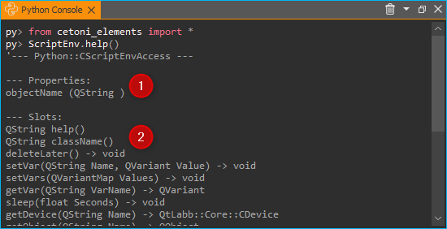

.. tip::
   Use the :code:`dir(object)` and :code:`Object.help()`   
   functions to get an overview of the methods and         
   properties of a given object. 

Using device objects
~~~~~~~~~~~~~~~~~~~~

You can access device objects using the :code:`ScriptEnv.getDevice()`
function. To get an overview of available device names you can call the
:code:`ScriptEnv.getDeviceNames()` function.

|image26|

The code completion helps you to enter a device name by
showing you a list of matching names (see figure above). If you call the
:code:`getDevice()` function without an assignment to a variable, then you can
see in the console if the call was successful:

.. code-block:: shell

   py> ScriptEnv.getDevice("Nemesys_S_1")
   CNemesys4Pump (QtLabb::CNemesys4Pump at: 0x000002402DDCBF20)

To access a device, assign the result of the call to :code:`getDevice()` to a
variable. In the following example, we assign the device object for the
first Nemesys S pump to the variable :code:`pump`:

.. code-block:: shell

   py> pump = ScriptEnv.getDevice("Nemesys_S_1")

Now you can use the :code:`dir(pump)` and :code:`pump.help()` functions to get an
overview of the available methods and functions of the pump object.

.. tip::
   Use the :code:`dir(object)` and :code:`Object.help()`   
   functions to get an overview of the methods and         
   properties of device objects.

.. admonition:: Important
   :class: note

   For many devices, accessing device     
   properties and methods or displaying help via           
   :code:`Object.help()` is only possible if the application is 
   connected to the devices. 

.. admonition:: Attention
   :class: caution
   
   **Risk of malfunction / data loss !**
   Via device functions you may have access to functions   
   that are not available in the graphical user interface. 
   Always test functions outside running processes and not 
   during productive use. Incorrect input or access to     
   resources, methods or properties can lead to            
   malfunctions or a crash of the software.   

When you are connected to the device, you can now access the device
functionality via the device object functions. For example, you can
trigger a refill process for the pump:

.. code-block:: shell

   py> pump.refillSyringe()

or stop the pumping operation:

.. code-block:: shell

   py> pump.stopPumping()

The following code shows how to import the :code:`cetoni_elements` module, get
the device object for the Nemesys S pump via the :code:`ScriptEnv` object, and
then start an emptying process of the syringe:

.. code-block:: shell

   py> from cetoni_elements import
   py> pump = ScriptEnv.getDevice("Nemesys_S_1")
   py> pump.emptySyringe()

Using application objects
~~~~~~~~~~~~~~~~~~~~~~~~~

Similar to device objects, you can also access application objects that
are no devices. Use the two functions :code:`ScriptEnv.getObject()` and
:code:`criptEnv.getObjectNames()` for this

The following code shows how to import the :code:`cetoni_elements` module, get
the application object of the graphical logger via the :code:`ScriptEnv`
object and then start logging:

.. code-block:: shell

   py> from cetoni_elements import *
   py> plot = ScriptEnv.getObject("ProcessDataGraph")
   py> plot.startLogging()

.. tip::
   Use the :code:`dir(object)` and :code:`Object.help()`   
   functions to get an overview of the methods and         
   properties of application objects.          

.. admonition:: Attention
   :class: caution

   **Risk of malfunction / data loss !**                                                           
   The functions of the application objects may give you   
   access to functions that are not available in the       
   graphical user interface. Always test functions outside 
   running processes and not during productive use.        
   Incorrect input or access to resources, methods or      
   properties can lead to malfunctions or a crash of the   
   software. 

Python Script Function - Execute Python Code
--------------------------------------------

Python Script Functions Overview
~~~~~~~~~~~~~~~~~~~~~~~~~~~~~~~~~


The Python plugin adds the :code:`Execute Python Code` script
function to the :guilabel:`Core Functions` category of the :guilabel:`Script Pool`:

.. image:: Pictures/1000020100000109000001120A8A8A9BB7B494E7.png
   
This function allows you to execute Python code in the script
system of the application. When you insert the function into your
script, you will see the initial Python script in the configuration
area. This script contains the two functions :code:`script_exec()` and
:code:`script_abort()`:

.. code-block:: python

   # Implement your script logic in this function
   # Avoid blocking function calls
   def script_exec():
      return

   # Implement your clean up code here in case of script stop
   # Stop pending actions, clean up resources
   # Keep execution time of this function short and do not use
   # any blocking function calls
   def script_abort():
      return

When the script is executed, it is loaded by the Python
interpreter as a separate module and then the :code:`script_exec()` function
is called. I.e. this function is the main function of the script and the
logic should be implemented there.

.. tip::
   All options you have in the Python console  
   to access device objects and application objects are    
   also available in the script function.     

The Python interpreter can only execute one Python script at a time.
Parallel execution is not possible. If you use Python scripts in
parallel sequences, then the scripts are executed one after the other,
i.e. a parallel execution branch blocks until the execution of a script
in another branch is completed. This is another reason why you should
keep the execution time of scripts as short as possible. If you use
non-blocking Python scripts with short execution times,
"almost-parallel" execution in parallel sequences is possible.

.. admonition:: Important
   :class: note

   Parallel execution of multiple Python  
   functions is not possible. If Python scripts are used   
   in parallel sequences, they are executed one after the  
   other. 

Python Script Editor
~~~~~~~~~~~~~~~~~~~~

The Python Script function has a Python code editor to assist you in
writing Python code.

.. image:: Pictures/10000201000002220000012B6A5FF31AA3060F79.png

The editor has the following features

-  Syntax highlighting for Python code :guinum:`❶`
-  a simple code completion
-  Code Folding :guinum:`❷`
-  Line numbers :guinum:`❸`
-  Undo / Redo functionality :guinum:`❹`

Some functions of the editor are available via the context menu, other
functions are available via keyboard shortcuts. Here are some of the
functions:

.. list-table::
   :widths: 50 50
   :header-rows: 1

   * - Action
     - Keyboard Shortcut
   * - Increase font size
     - :kbd:`Ctrl` + :kbd:`+`
   * - Decrease font size
     - :kbd:`Ctrl` + :kbd:`-`
   * - Reset font size to default
     - :kbd:`Ctrl` + :kbd:`0`
   * - Indent selected code block
     - :kbd:`Tab`
   * - Unindent selected code block
     - :kbd:`Shift` + :kbd:`Tab`
   * - Undo
     - :kbd:`Ctrl` + :kbd:`Z` or context menu
   * - Redo
     - :kbd:`Ctrl` + :kbd:`Y` or contexte menu

.. admonition:: Important
   :class: note

   Editing the Python source code is only 
   possible when the script is not running. Once the       
   script has been started, editing of the source code is  
   disabled. In case of an error you have to terminate the 
   script via the :guilabel:`Terminate Script` button before you    
   can edit the Python code.  

Handle script termination - script_abort()
~~~~~~~~~~~~~~~~~~~~~~~~~~~~~~~~~~~~~~~~~~

If the running script is terminated via the :guilabel:`Terminate Script` button of
the Script Editor (see figure below), then the execution of
:code:`script_exec()` is interrupted and the :code:`script_abort()` function is
executed:

|image54| 

In case of such an abort, you will see a corresponding error
message in the Python console:

|image55|

If you want to act on the abort of the script, e.g. to
release resources or to inform the user, you can do this in the
:code:`script_abort()` function. If you want to access data or objects (e.g.
file handles, sockets or similar) in the :code:`script_abort()` function
which you have used before in the :code:`script_exec()` function, you can do
this via global variables. The following script shows a corresponding
example. The :code:`script_abort()` function outputs the number of loop cycles
that were executed before the script was aborted. Both functions access
the global variable :code:`counter`:

.. code-block:: python

   import time

   counter = None

   def script_exec():
      global counter
      for i in range(1000):
         counter = i
         print(i)
         time.sleep(1)
      return

   def script_abort():
      global counter
      print("script_abort() after ", counter, " loops")
      return

Implementation of the function logic in script_exec()
~~~~~~~~~~~~~~~~~~~~~~~~~~~~~~~~~~~~~~~~~~~~~~~~~~~~~

When implementing the script in :code:`script_exec()` you should be careful
not to use blocking functions or blocking waits. The Python interpreter
can be interrupted via the :guilabel:`Terminate Script` button only after the
execution of the current Python statement. If the current statement is a
blocking function call, e.g. :code:`time.wait(10)`, the interpreter can only
be interrupted after 10 seconds when the wait call has finished.
Therefore, always add a timeout to blocking function calls.

.. admonition:: Important
   :class: note

   Do not use blocking function calls to  
   avoid blocking termination of script execution. Always  
   add a timeout to blocking function calls.  

In the following example, the call to :code:`socket.recv()` in line 8 is
blocking. I.e. the call returns only when data has been received. As
long as no data is received, the function blocks and the script cannot
be aborted cleanly:

.. code-block:: python

   import socket

   def script_exec():
      HOST = '127.0.0.1'  # The server's hostname or IP address
      PORT = 65432        # The port used by the server
      with socket.socket(socket.AF_INET, socket.SOCK_STREAM) as s:
         s.connect((HOST, PORT))
         data = s.recv(2048)
      return

To fix this problem the call to :code:`socket.recv()` should have a timeout.
This has been implemented in the following example using the
:code:`socket.settimeout()` function:

.. code-block:: python

   import socket

   def script_exec():
      HOST = '127.0.0.1'  # The server's hostname or IP address
      PORT = 65432        # The port used by the server
      with socket.socket(socket.AF_INET, socket.SOCK_STREAM) as s:
         s.connect((HOST, PORT))
         s.settimeout(0.5)
         try:
            data = s.recv(2048)
         except socket.timeout as err:
            print(err)
      return

Script execution errors
~~~~~~~~~~~~~~~~~~~~~~~

If errors occur during the execution of a script, you will see them in
the :guilabel:`Event Log` and in the :guilabel:`Python console`. 
If you hover over the error message in the event log, you will see a hint 
window with details:

|image59|

In the Python console, the error message is displayed to you
as red error text:

|image60|

In the error message you will also get the information in
which line of the script an error occurred. This will help you to find
and fix the error in the script editor.

.. admonition:: Important
   :class: note

   Editing the Python source code is only  
   possible when the script is not running. Once the       
   script has been started, editing of the source code is  
   disabled. In case of an error you have to terminate the 
   script via the :guilabel:`Terminate Script` button before you can 
   edit the Python code.  

Using custom modules
~~~~~~~~~~~~~~~~~~~~

If your script contains very complex and extensive logic, you may want
to offload the code to an external module and include it using the
import functionality (see section `Import custom modules`_). You can then call
the functions of the imported module from within :code:`script_exec()`.

In the following example we import our own module :file:`hello` and call its
function :code:`helloworld()`.

.. code-block:: python

   import hello

   def script_exec():
      hello.helloworld()
      return

The output of the script appears both in the event log:

|image64|

and in the Python console:

|image65|

If you make changes to the external module after the module
has already been imported, then these changes will not be available in
your Python script in the application. This is the normal way the Python
interpreter works - once a module has been imported, it will not be
imported again. As a test, add the :code:`hellouniverse()` function to your
own :file:`hello` module:

.. code-block:: python

   def hellouniverse():
      print("hello universe")

Now call the new function from your application script. When running,
you will receive the information that the :code:`hellouniverse` function is
not available.

To avoid restarting the application after changing the external module,
you can explicitly request a reload in your script using the :code:`reload()`
function from the :file:`importlib` module. To do this, modify your Python
script in the application as follows:

.. code-block:: python

   import hello
   from importlib import reload

   def script_exec():
      reload(hello) # trigger explicit reload of hello module
      hello.helloworld()
      hello.hellouniverse()
      return

The script is now executed without errors.

.. tip::
   Use the :code:`importlib.reload()` function    
   when making changes to external modules after you have  
   already imported them via import into your Python       
   script in the application.  

Accessing script variables
~~~~~~~~~~~~~~~~~~~~~~~~~~

To be able to pass the results of calculations in Python code to the
running script or to react to values from the script, it is necessary to
access script variables. To do this, import the :file:`cetoni_elements` module
(see section `The cetoni_elements module`_).

Once you have imported the module, you can access script variables using
the :code:`ScriptEnv.getVar()`, :code:`ScriptEnv.setVar()` and
:code:`ScriptEnv.setVars()` functions. The following example shows how to read
the script variable :code:`$Flow`, increment it by 2 and then store the
calculated value back into the script variable:

.. code-block:: python

   from cetoni_elements import *

   def script_exec():
      flow = ScriptEnv.getVar("$Flow")
      print(flow)
      flow = flow + 2;
      ScriptEnv.setVar("$Flow", flow)
      print(flow)
      return

.. admonition:: Important
   :class: note

   Remember that script variables in  
   Python script always start with a dollar sign - :code:`$VarName`.        

Script variables can also be used to access devices. Script variables
can store device references. By reading the device reference and
assigning it to a Python variable, the device object can be accessed. In
the following example, the :code:`$Pump1` script variable contains a device
reference of the *Nemesys_S_1* pump that was assigned to the variable in
the *Create Variable* function. The device reference is read from the
variable and assigned to the Python variable :code:`pump`. Now device
functions can be accessed via the :code:`pump` variable. In this example, the
syringe is emptied via :code:`pump.emptySyringe()`:

.. code-block:: python

   from cetoni_elements import *

   def script_exec():
      pump = ScriptEnv.getVar("$Pump1")
      print(pump)
      pump.emptySyringe()
      return

It is also possible to create lists in Python and to store them in a
script variable. The following example creates a list of 4 values and
stores them in the script variable :code:`$Positions`:

.. code-block:: python

   from cetoni_elements import *

   def script_exec():
      ScriptEnv.setVar("$Positions", [0, 3.5, 12, 7])
      return

Instead of simple values, it is possible to create lists of devices and
store them in variables. In the following example a list is created
which contains the two digital inputs of the first *Nemesys S* pump.
This list is stored in the script variable :code:`$DigitalInputs`.

.. code-block:: python

   from cetoni_elements import *

   def script_exec():
      di1 = ScriptEnv.getDevice("Nemesys_S_1_DigIN1")
      di2 = ScriptEnv.getDevice("Nemesys_S_1_DigIN2")
      ScriptEnv.setVar("$DigitalInputs", [di1, di2])
      return

Example scripts
---------------

Barcode Scanner
~~~~~~~~~~~~~~~

The following example script shows how the camera support of CETONI
Elements can be used to implement a barcode scanner using the
`pyzbar <https://pypi.org/project/pyzbar/>`__ module:

.. code-block:: python
   :linenos:

   from pyzbar import pyzbar
   import time
   import qimage2ndarray
   from cetoni_elements import *

   # Main script function
   def script_exec():
      barcode = None
      camera = ScriptEnv.getObject('Qmix_CAM_1')
      qimage = camera.capturedPreviewImage()
      frame = qimage2ndarray.rgb_view(qimage)
      barcodes = pyzbar.decode(frame)
      for b in barcodes:
         barcode = b.data.decode('utf-8')
         break

      # output
      if barcode is not None:
         ScriptEnv.setVar('$Barcode', barcode)
      else:
         ScriptEnv.setVar('$Barcode', 0)
      return

By importing the :file:`cetoni_elements` module, the CETONI Elements camera
can be accessed and an image can be captured:

.. code-block:: python

   camera = ScriptEnv.getObject('Qmix_CAM_1')
   qimage = camera.capturedPreviewImage()

The `qimage2ndarrays <https://pypi.org/project/qimage2ndarray/>`__
module helps us to convert the captured image in :code:`QImage` format into a
:code:`numpy.ndarray`, which is required by the
`pyzbar <https://pypi.org/project/pyzbar/>`__ module.

.. code-block:: python

   frame = qimage2ndarray.rgb_view(qimage)

Now we can use the `pyzbar <https://pypi.org/project/pyzbar/>`__ module
to decode the barcode:

.. code-block:: python

   barcodes = pyzbar.decode(frame)
   for b in barcodes:
      barcode = b.data.decode('utf-8')
      break

In the last step the barcode is stored in the script variable :code:`$Barcode`
with the function :code:`ScriptEnv.setVar()` so that it is available in the
script and can be evaluated further.

.. code-block:: python

   if barcode is not None:
      ScriptEnv.setVar('$Barcode', barcode)
   else:
      ScriptEnv.setVar('$Barcode', 0)
   return

.. _python-api:

API Reference
--------------

ScriptEnv
~~~~~~~~~~~~~~~~~~~~~~~~~~~~~~~~

The :code:`ScriptEnv` object is the central object for accessing available 
devices and application objects.

.. doxygenclass:: Python::CScriptEnvAccess
    :project: python
    :path: ../doxygen/xml
    :members:
    :members-only:
    :membergroups: scripting

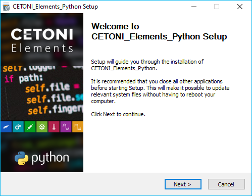

.. |image12| image:: Pictures/10000201000001F7000000E586F7E58BD20D8C3D.png

.. |image16| image:: Pictures/10000201000001F80000008CC938D11BE28032EE.png

.. |image17| image:: Pictures/10000201000001EF00000062B50A9A0A013ADF8C.png

.. |image18| image:: Pictures/10000201000001F80000008C5125B8F7F53F8BDD.png

.. |image19| image:: Pictures/100002010000025D00000083173EACC09611440F.png

.. |image20| image:: Pictures/100002010000021E0000007B7A4EF3D62F1DF696.png

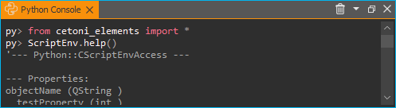

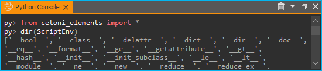

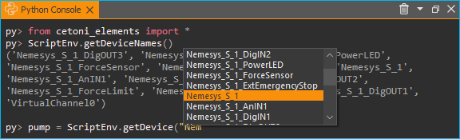

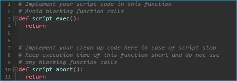

.. |image54| image:: Pictures/10000201000001950000009E1928E5F4B3BBCE66.png

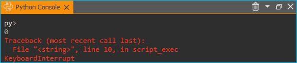

.. |image59| image:: Pictures/1000020100000299000000B54BF487EBAF7E8E66.png

.. |image60| image:: Pictures/10000201000001D000000061F880AB480C04AA56.png

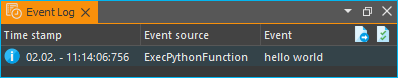

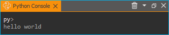

