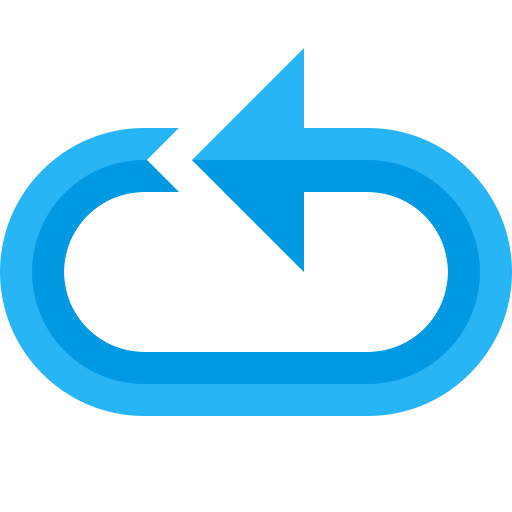
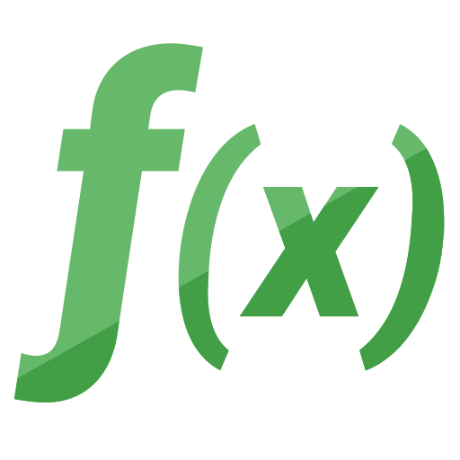
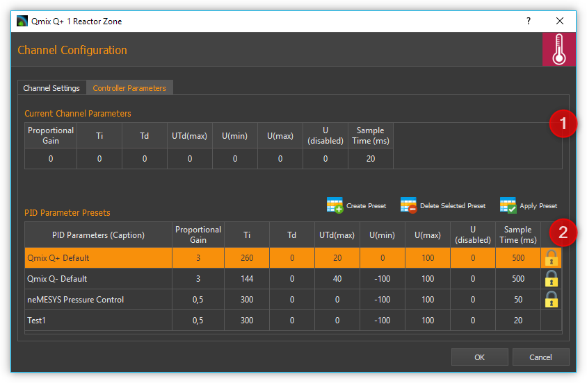
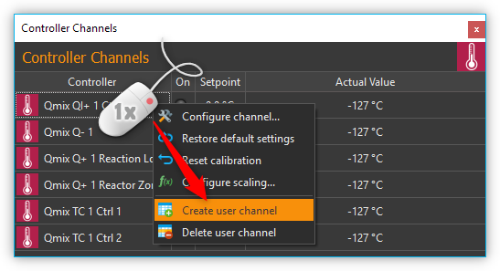
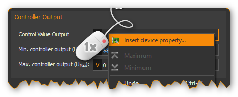

Controller Plugin
======================

Introduction
------------

The Controller plugin is used to integrate the CETONI controller
modules into the CETONI Elements software and to allow the creation of dynamic
user defined control channels. The following hardware modules are
supported:

.. image:: Pictures/controller_devices.png

.. rst-class:: guinums

#. **Qmix Q-** - thermoelectric cooling module
#. **Qmix Q+** - two-channel heating module
#. **Qmix TC** - two channel controller module for external
   heating-cooling-systems (i.e. for connecting syringe heating mounted on Nemesys
   syringe pumps)

Controller Channel List
------------------------------------------------------------

All controller channels are shown in the :guilabel:`Controller Channels` list.

|Figure 1: Controller Channel list|

You can identify the different types of channels (cooling module Q-,
heating module Q+...) by the different signs in front of the module
names (see Figure above). The list of controller channels is a
:ref:`View<Views>`, 
that you can move freely at any time to another position in the
graphic interface by dragging and dropping the title bar, or you can
move it out of the interface to become a separate window.

The channel list shows all the available controller channels in
tabular form. The following columns are present:

-  **Controller** - shows the name of the controller module and indicates
   its type by a sign.
-  **On** - indicates by a green LED whether the controller is switched on
   or off. Click the LED to switch the control loop on / off.
-  **Setpoint** -contains the set setpoint of the controller channel
-  **Actual Value** - shows the actual value

Channel types
~~~~~~~~~~~~~

The following types of channels are currently supported:

======== ======================================
|image1| Qmix Q- cooling modules
|image2| Qmix Q+ heating modules
|image3| dynamically generated, custom channels
======== ======================================

Changing channel names
~~~~~~~~~~~~~~~~~~~~~~

You can change the name of a channel at any time and, for example,
assign a name suitable for your particular application.

|Figure 2: Changing channel names|

You change a name by the following steps:

1. Double-click the table cell containing the name you want to change.
2. Enter the new name in the Editing window which now appears (Figure
   above).
3. Complete your entry by pressing the :kbd:`Return` key.

Switching control devices on / off
~~~~~~~~~~~~~~~~~~~~~~~~~~~~~~~~~~

|Figure 3: Switching control devices on/off|

To switch the controller on or off, simply click the LED of the channel you
want to switch.

Entering setpoint
~~~~~~~~~~~~~~~~~

To input a setpoint, double-click in the :guilabel:`Setpoint` column of the channel
with the setpoint you want to change. Now enter the setpoint in the
editing window that opens (Figure below) or use the arrow buttons to
raise or lower the setpoint incrementally.

|Figure 4: Changing setpoint|

Context menu for control channels
----------------------------------------------------------------

By right-click into the control channel list you can display a context
menu with additional functions.

.. image:: Pictures/100002010000022300000129ACB2B97D.png

The context menu contains the following menu items:

+-----------+---------------------------------------------------------+
| |image18| | **Configure Channel...**                                |
|           |                                                         |
|           | Opens the configuration dialog of the channel for       |
|           | configuring all channel parameters.                     |
+-----------+---------------------------------------------------------+
| |image19| | **Restore Default Settings**                            |
|           |                                                         |
|           | Restores the default settings of the channel.           |
+-----------+---------------------------------------------------------+
| |image20| | **Reset Calibration**                                   |
|           |                                                         |
|           | Resets the two-point scaling to scale factor 1 and      |
|           | offset 0                                                |
+-----------+---------------------------------------------------------+
| |image21| | **Configure scaling...**                                |
|           |                                                         |
|           | Opens the configuration dialog displaying the page for  |
|           | configuration of the controller scaling.                |
+-----------+---------------------------------------------------------+
| |image22| | **Select PID parameters...**                            |
|           |                                                         |
|           | Opens the configuration dialog displaying the page for  |
|           | configuration of the PID control parameters.            |
+-----------+---------------------------------------------------------+
| |image23| | **Delete user channel**                                 |
|           |                                                         |
|           | If the selected channel is a user-specified channel, it |
|           | is deleted by selecting this menu item. For other       |
|           | channels this menu item is disabled.                    |
+-----------+---------------------------------------------------------+
| |image24| | **Create user channel**                                 |
|           |                                                         |
|           | Opens up the wizard for creating user-specified control |
|           | channels.                                               |
+-----------+---------------------------------------------------------+

Configure Channel Settings
--------------------------

For opening the scaling configuration dialog select :menuselection:`Configure channel`
in the context menu of the control channel.

|Figure 6: Configure scaling|

The configuration of the general channel
settings and the calibration of the controller channels are identical to
the configuration of the I/O channels of the :ref:`I/O Plugin`. For a
detailed description read the section :ref:`I/O Channel Configuration`.

Selection and configuration of controller parameters
----------------------------------------------------

Overview
~~~~~~~~

To set the optimal control behavior, you can adjust the controller
parameters of each single channel. For this you can either choose from a
list of predefined PID parameter sets or create new parameter sets.

To access the controller parameters selection, choose
:menuselection:`Select PID parameters` from the controller channel context
menu.

|Figure 7: Selecting a control parameter set|

The upper area shows the current parameters of the device :guinum:`❶`
:guilabel:`Current Channel Parameters`. In the lower area you will find a list
of :guilabel:`PID Parameter Presets` :guinum:`❷`.

Changing controller parameters
~~~~~~~~~~~~~~~~~~~~~~~~~~~~~~

To edit the current controller parameters, double-click with the mouse
in the :guilabel:`Current Channel Parameters` area in the field you want to change
and enter the new value:

|Figure 8: Changing controller parameters|

Selecting a PID Parameter Preset
~~~~~~~~~~~~~~~~~~~~~~~~~~~~~~~~~

|Figure 9: Selecting a PID Parameter Preset|

Select a PID Preset from
the table of available presets by left-clicking on it :guinum:`❶` and then click
on the :guilabel:`Apply Preset` :guinum:`❷` button to apply the control parameters. The
values in the :guilabel:`Current Channel Parameters` :guinum:`❸` area are updated with the
new values from the preset. Complete the configuration by clicking the
:guilabel:`Ok` :guinum:`❹` button.

The PID parameter presets already contain default controller parameter
sets for different devices like Qmix Q+, Qmix Q- or Qmix TC or
certain accessories, i.e. syringe heating or tube heating.

.. tip::
   For optimum adaptation to the controlled      
   systems in your application, you can create your own    
   parameter sets with controller parameters. 

Creating a PID Parameter Preset
~~~~~~~~~~~~~~~~~~~~~~~~~~~~~~~

By selecting the :guilabel:`Create Preset` button :guinum:`❶` you create a new set of
controller parameters :guinum:`❷`. (see figure below) You can then edit the
individual values of the parameter set by double-clicking in a field :guinum:`❸` 
and entering a new value.

|Figure 10: Creating a PID Parameter Preset|

Enter a meaningful, unique
name for each parameter set and adapt the controller parameters to the
controlled system in your application. For finding adequate controller
parameters proceed as described in section :ref:`How to set controller parameters`.

Deleting PID Parameter Presets
~~~~~~~~~~~~~~~~~~~~~~~~~~~~~~

Select a set of controller parameters from the table :guinum:`❶` and left-click
the :guilabel:`Delete Selected Preset` button :guinum:`❷` for deleting it. (see figure
below).

.. image:: Pictures/1000020100000333000000D15C7BAB96.png

.. admonition:: Important
   :class: note

   Predefined controller parameters are     
   locked and can not be deleted. Locked parameters can be 
   recognized in the table by the lock symbol.   

User defined control channels
-----------------------------

.. _user-defined-control-channels-introduction:

Introduction
~~~~~~~~~~~~

You can create customized control channels using arbitrary device
properties for control loop input and output. Thus using i.e. a pressure
measurement channel of a QmixP device and a Nemesys syringe pump you
can build up a pressure control.

Creating control channels
~~~~~~~~~~~~~~~~~~~~~~~~~

By right-clicking the control channel list and selecting the menu item
:menuselection:`Create user channel` in the context menu, you open the dialog
for creating custom control channels.

|Figure 12: Open controller channel creation dialog|

In the configuration wizard that is displayed now, proceed as follows:

|Figure 13: Selecting input and output values of the controller channel|

1. Select the device that provides the measurement value of the controller:
   :guilabel:`Controller Input`
2. Select the device property that is used as measurement value.
3. Select the device that provides the control value of the controller:
   :guilabel:`Controller Output`
4. Select the device property that is used as control value.
5. Click :guilabel:`Next` in order to proceed.

The final page of the wizard allows configuration of controller channel
parameters as described in section :ref:`Selection and configuration of
controller parameters`. You complete the control channel creation by clicking
the :guilabel:`Finish` button.

.. tip::
   You can change the controller parameters at   
   any later time and adapt them perfectly to your         
   controlled system.     

Changing the output value scaling or unit
~~~~~~~~~~~~~~~~~~~~~~~~~~~~~~~~~~~~~~~~~

The output value is determined by the PID control algorithm and written
to the output device without any scaling information. This means that
you need to adjust the controller parameters, in particular the control
value limits, each time you change the scaling or the unit of the
appropriate device. With a Nemesys dosing module this is also true if
you change the syringe size.

.. admonition:: Important
   :class: note

   If you change the scaling or unit of a   
   device beeing part of a control loop you must check the 
   control parameters and adjust them if necessary. With a 
   neMESYS dosing module this also applies if you change   
   the syringe.      

Controller Script Functions
---------------------------

.. _introduction-controller-script-functions:

Introduction
~~~~~~~~~~~~

The controller plugin contains script functions for changing the
controller parameters from a script. This makes it possible to achieve,
for example, time controlled temperature curves.

|Figure 14: Qmix controller script functions|

Set Controller Param
~~~~~~~~~~~~~~~~~~~~~~

.. image:: Pictures/1000067B0000388E0000388E578BCCCA.svg
   :width: 60
   :align: left

With this function, you can transfer a new setpoint to the
controller channel or switch the control loop on or off. To switch it on
and off, simply click the :guilabel:`Control loop on / off` LED in the
configuration area (see figure below).

|

.. image:: Pictures/10000000000001A7000000C4FD6D097D.png

PID Control Function
~~~~~~~~~~~~~~~~~~~~

.. _introduction-pid-control-function:

Introduction
^^^^^^^^^^^^

This function implements a PID controller using a PID
algorithm for applications that require an efficient algorithm. The PID
algorithm features control output range limiting with integrator
anti-windup.

Currently, the Proportional-Integral-Derivative (PID) algorithm is the
most common control algorithm used in industry. Often, people use PID to
control processes that include heating and cooling systems, fluid level
monitoring, flow control, and pressure control. In PID control, you must
specify a process variable and a setpoint. The process variable is the
system parameter you want to control, such as temperature, pressure, or
flow rate, and the setpoint is the desired value for the parameter you
are controlling. A PID controller determines a controller output value,
such as the heater power or valve position. The controller applies the
controller output value to the system, which in turn drives the process
variable toward the setpoint value.

Configuration
^^^^^^^^^^^^^^^

In the configuration area of this function you can configure all
parameters required for proper PID control.

You need to configure the following parameters:

.. rst-class:: guinums

1. **Actual Value Input** – this parameter specifies the measured value
   of the process variable being controlled. This value is equal to the
   feedback value of the feedback control loop. Enter a variable name
   here, or enter a :ref:`Device Property Identifier <Device Property Identifiers>`
   in order to directly read specific process data of a certain device.
2. **Setpoint** – specifies the setpoint value, or desired value, of
   the process variable being controlled. You can enter a fixed value
   (like 50°C) or you can pass the value in a variable.
3. **Control Loop Parameters** – specify the proportional
   gain (K), integral time (T\ :sub:`I`\) , and
   derivative time (T\ :sub:`D`\) parameters of the controller and
   thus directly affect the control characteristic of the controller.

   .. image:: Pictures/10000201000001F400000208F1F44DB1.png

4. **Controller Output** – This section groups all settings for the
   controller output. *Control Value Output* returns the control output
   of the PID algorithm that is applied to the controlled process. I.e.
   if you implemented a temperature control loop, the *Control Value
   Output* would be the heating power that must be generated from the
   heater. Enter a variable name of a variable that can store the output
   value or use a :ref:`Device Property Identifier <Device Property Identifiers>`
   to write the value directly into a device property of a certain device.

   |Figure : Enter process data identifier via context menu|

   With the parameters U\ :sub:`max` and U\ :sub:`min` you limit the
   range of the controller output. If you e.g. control the heating power
   via a 0 – 5 V analog output, then enter 0 for U\ :sub:`min` and 5
   for U\ :sub:`max`. If the control algorithm generates values that are
   outside of this range, they will be limited to the range
   automatically.

.. tip::
   You can use the PID control function to       
   implement a P, PI or PD controller by simply setting    
   the unneeded PID gains to 0.

PID control parameters
^^^^^^^^^^^^^^^^^^^^^^^^

A set of PID control parameters contains a proportional, an integral
and a derivative part.

Proportional part
'''''''''''''''''''

The proportional part computes the control deviation from the setpoint
(W) and the actual value (X)

and multiplied with the proportional gain, gives it as control value
(Y) to the controlled system. The following equation shows the
proportional part.

Integral part
'''''''''''''''

Mathematics forms the integral part the area enclosed by control
deviation and timeline. If there is a contant control error, the
integral part grows ramp shape.

For a constant control deviation the equation is:

.. image:: Pictures/math_03.png
   :scale: 20%

- Y\ :sub:`t0`: Control value at th./Pictures/e beginning of the observation
- T\ :sub:`i`: Integration time

If the actual value equals the setpoint the control value does not
change. The control value built up by the integral part remains and will
not decrease until the actual value exceeds the setpoint value. With
controlled systems containing a delay line the integral part eliminates
the steady-state error which a proportional controller is not capable
of. In general the following equation holds for the integral part.

.. image:: Pictures/math_04.png
   :scale: 20%

With the integration time the speed of the controller can be changed.
The smaller T*\ :sub:`I` the faster the integral part builts up a
control value. The given equation states that the proportional gain K,
too, impacts the integral part. In CETONI Elements the integral part can
only be configured in conjunction with the proportional part. Thus the
following equation applies:

.. image:: Pictures/math_05.png
   :scale: 20%

.. admonition:: Important
   :class: note

   The integral part compensates the        
   steady-state control error.

Derivative Part
'''''''''''''''''

The derivative part counteracts changes in the actual value. Two
scenarios can be considered with respect to the effect of derivative
part.

-  After the actual value has reached a stable final value, it is
   decreasing because of a disturbance suddenly occurred. The derivative
   part gives an additional control value that helps increasing the
   actual value.
-  If the setpoint value is increased, the actual value increases too.
   The derivative part recognizes the increasing actual value and slows
   down by an additional negative control value starting up to the
   target value.

In practical use the derivative part occurs only in combination with a
proportional part. The controller equation is:

.. image:: Pictures/math_06.png
   :scale: 20%

The bigger the proportional gain K and the derivative time T\ :sub:`D`
the bigger the effect of the derivative part and the stronger the change
of the actual value is counteracted.

Summary
'''''''

The following table summarizes the effect of the different control
parameters.

+---------------+-------------------------+-------------------------+
| PID parameter | Regulating on a         | Start-up of the         |
|               | disturbance of the      | setpoint                |
|               | controlled system       |                         |
+===============+=========================+=========================+
| K higher      | stronger repsonse       | faster start-up         |
|               | (reduced damping)       |                         |
+---------------+-------------------------+-------------------------+
| K smaller     | weaker response         | slower start-up         |
|               | (increased damping)     |                         |
+---------------+-------------------------+-------------------------+
| TI higher     | weaker repsonse,        | Slower start-up and     |
|               | particularly on         | compensation of the     |
|               | short-term              | steady-state error      |
|               | disturbances, the       |                         |
|               | controller has only a   |                         |
|               | weak response           |                         |
+---------------+-------------------------+-------------------------+
| TI smaller    | stronger repsonse,      | faster start-up and     |
|               | particularly on         | compensation of the     |
|               | short-term              | steady-state error      |
|               | disturbances, the       | (Overshooting if        |
|               | controller has only a   | T\ :sub:`I` is too      |
|               | weak response           | small)                  |
+---------------+-------------------------+-------------------------+
| TD higher     | stronger repsonse       | slower start-up         |
|               |                         | (stronger reaction      |
|               |                         | against changes in      |
|               |                         | actual value)           |
+---------------+-------------------------+-------------------------+
| TD smaller    | weaker response         | faster start-up (weaker |
|               |                         | reaction against        |
|               |                         | changes in actual       |
|               |                         | value)                  |
+---------------+-------------------------+-------------------------+

Programming the control loop
^^^^^^^^^^^^^^^^^^^^^^^^^^^^^^

This section shows you how to realize a complete PID control loop in a
script program by using the PID control function.

|Figure : PID controller example scripts|

To implement a control loop, proceed as follows:

.. rst-class:: guinums

1. The controller must be called cyclically in a fixed time
   interval. For this, you should use a loop. In this case, use a
   conditional loop :ref:`Conditional Loop` with the loop condition
   1. The condition 1 is always true and the loop runs forever and never
   stops, except the user stops program execution manually.
2. Now create a :ref:`PID Control Function` within the loop and configure
   all parameters.
3. Inside the loop you need to place a :ref:`Delay` to insert a defined delay time
   200 milliseconds. This time determines the frequency, with which the
   control algorithm is called and hence the *dt* that is used in the
   algorithm for the calculation of the control parameters.

Now you have built a control loop that reads the current temperature via
an analog input, computes an output value in the PID control function,
which is then used with an analog output for adjusting the heating
power.

.. tip::
   According to control theory, a control system 
   must sample a physical process at a rate about 10 times 
   faster than the fastest time constant in the physical   
   process. For example, a time constant of 60 s is        
   typical for a temperature control loop in a small       
   system. In this case, a cycle time of about 6 s is      
   sufficient. Faster cycling offers no improvement in     
   performance           

How to set controller parameters
--------------------------------

Closed control loop and PID controller equation
~~~~~~~~~~~~~~~~~~~~~~~~~~~~~~~~~~~~~~~~~~~~~~~

The controller (e.g. PID controller) and the controlled system (e.g.
temperature-controlled system) together make up a feedback system, the
closed control loop. (see figure below)

|Figure 19: Closed control loop|

A PID-controller determines thh control value *u* at the time t\ :sub:`1` 
using the following equation:

.. image:: Pictures/math_08.png
   :scale: 20%

The control value contains 3 shares.

+----------+----------------------------------+
| |math09| | The proportional share (P) forms |
|          | by means of the factor           |
|          | K\ :sub:`p` the direct effect of |
|          | the control error on the control |
|          | value.                           |
+----------+----------------------------------+
| |math10| | The integral share (I) computes  |
|          | the sum of the error over the    |
|          | time and by means of K\ :sub:`p` |
|          | and the time constant            |
|          | T\ :sub:`i`\ maps it to the      |
|          | control value. The bigger        |
|          | K\ :sub:`p`\ and the smaller     |
|          | T\ :sub:`i`\ the bigger the      |
|          | integral share of the control    |
|          | value.                           |
+----------+----------------------------------+
| |math11| | The differential share depends   |
|          | on the temporal change of the    |
|          | actual value that is mapped to   |
|          | the control value by             |
|          | K\ :sub:`p`\ and T\ :sub:`d`.    |
+----------+----------------------------------+

Preparations for setting controller parameters
~~~~~~~~~~~~~~~~~~~~~~~~~~~~~~~~~~~~~~~~~~~~~~~

Initially make the plot of the datalogger plugin show the measurement
value and the control value to you. (refer to section :ref:`Process Data
Graph`) :guinum:`❶` It is recommended to do the
same with the setpoint value. It is not necessary but facilitates
orientation within the plot. (see figure below)

|Figure 20: Configuration of the graphical logger for setting controller parameters|

The setting for :guilabel:`Log Interval` :guinum:`❷` depends on the change
frequency of the actual value. You should get a useful graph if you set
*Log Interval* to the sample time used by your control channel (see next
section).

Choosing the sample time
~~~~~~~~~~~~~~~~~~~~~~~~

The time between 2 computations of the control value is defined as
sample time. The smaller the sample time the more often the control
value is calculated. As a rule of thumb you can keep in mind that the
sample time should not be higher than one tenth of the smallest time
constant in the closed control loop. Experiences have shown that the
following values achieved useful results (stable control) with the
appropriate devices.

========================================= ================
Application                               Sample Time (ms)
========================================= ================
Qmix Q+                                   500
Pressure control using Nemesys and Qmix P 50
========================================= ================

.. tip::
   For the sample time choose values that are    
   less than or equal to 1/10 of the smallest time         
   constant occurring in the control loop. 

Setting the control value limits
~~~~~~~~~~~~~~~~~~~~~~~~~~~~~~~~

You can limit the minimum (U\ :sub:`min`) and the maximum
(U\ :sub:`max`) control value of the controllers. The
control value should have a sufficient stroke in order to reach the
desired setpoint values. But you should also take care not to damage the
controlled system by choosing to large control value limits. (e.g. too
high flow rate of a neMESYS dosing module in a pressure controlled
system leads to damage of the fluidic system) You should test the
control value limits by temporarily acting with them on your controlled
system. (e.g. dose with a Nemesys pump using a flowrate equal
to the control value limit) Futhermore you have to choose a value
assumed by the controller if the control channel is disabled
(U\ :sub:`disabled`) which is usually zero.

.. admonition:: Attention
   :class: caution

   Insufficient limitation of the control   
   value can lead to damage of the controlled system. 

Determination of PI parameters
~~~~~~~~~~~~~~~~~~~~~~~~~~~~~~~

A temperature control system usually makes up a delay line containing
one or more delay time constants. It can often be approximated by a
first-order delay line. The appropriate step response function is:

.. image:: Pictures/math_12.png
   :scale: 20%

Setting the controller parameters targets the compensation of the delay
time constant T\ :sub:`1`\ and adapting the controller gain K\ :sub:`p`
in order to reach an efficient control behaviour. In practice
T\ :sub:`1`\ is often unknown, but you can gradually approach to a
useful result using the following procedure.

.. image:: Pictures/graph01.png

(1) Choose the values for Sample Time, U\ :sub:`min`,
    U\ :sub:`max` und U\ :sub:`disabled` according to the
    recommendations in the previous sections. Disable the differential and 
    integral share by setting the controller time constants to 0. This leads to a
    simplified controller equation.

    .. math:: U = {K_{p} \cdot e}
   
    Set a moderate value for the proportional gain. Keep in mind that by
    means of K\ :sub:`p` the control error immediately impacts the
    control value. Choosing a too big value for K\ :sub:`p`\ can drive
    the controller into saturation.

(2) Give a setpoint step to your control loop, i.e. by changing the
    setpoint temperature from room temperature to 50°C and activating
    the control channel. (see section :ref:`Entering setpoint` and
    :ref:`Switching control devices on / off`)

(3) Providing a first-order delay line the actual value will behave
    according to the following figure.

    .. image:: Pictures/graph02.png
    
    Depending on chosen controller proportional gain
    K\ :sub:`p` the actual value will vary quickly settle near the
    setpoint value. Due to the fact that a proportional controller is
    not able to fully compensate a delay line, a steady-state error
    establishes. If K\ :sub:`p` is set too low, the actual value
    approaches only very slowly the target value. (see curve for
    K\ :sub:`p` = 1 in figure above) If K\ :sub:`p` is set to high, the
    actual value overshoots, optionally oscillates about the setpoint.
    (see curve for Kp = 50 in figure above) In the provided example the
    actual value reaches a steady-state quickly without overshooting
    using K\ :sub:`p`\ =3. This is why we use that value for further
    optimizations.

(4) In the next step set T\ :sub:`i`\ in a way that the steady-state
    error is compensated. You should begin using a large time constant
    T\ :sub:`i` which means a small integral share.

(5) Give a setpoint step to your control loop, i.e. by changing the
    setpoint temperature from room temperature to 50°C and activating
    the control channel.  (see section :ref:`Entering setpoint` and
    :ref:`Switching control devices on / off`)

(6) Lower the time constant T\ :sub:`i` if you want to reduce time for
    permanently reaching the setpoint value. Please notify that a time
    constant T\ :sub:`i` set to small (large integral share) can lead to
    the control loop oscillating. In the provided figure you can see
    that T\ :sub:`i`\ =260s leads to a good result. The actual value
    matches the setpoint value and the system does not oscillate. Using
    T\ :sub:`i`\ =1000s the setpoint is not reached within the
    illustrated time range and T\ :sub:`i`\ =20s leads to the system
    overshooting heavily. (see figure below)

    .. image:: Pictures/10000000000001A7000000C4FD6D097D.png

(7) In many cases (i.e. temperature control) a PI controller is sufficient.
    There is no steady-state error and the dynamic behaviour is
    satisfactory. If the controller shall be robust with respect to
    sudden disturbances, it might be useful to include a differential
    component. A detailed consideration of control stability, control
    behaviour with respect to setpoint changes and disturbances is
    beyond the scope of this practical introduction. Reference is
    therefore made at this point on the control engineering literature.

   .. image:: Pictures/graph03.png

(8) Now create a PID parameter preset with the values you have
    determined and assign a unique name.

.. |Figure 1: Controller Channel list| image:: Pictures/10000000000001D5000000F75FCDB73E.png

.. |image1| image:: Pictures/10004AA90000387200003872C4D36C50.svg
   :width: 40

.. |image2| image:: Pictures/100051AC0000387200003872CA0648E8.svg
   :width: 40

.. |image3| image:: Pictures/100046F500003872000038724548056A.svg
   :width: 40

.. |Figure 2: Changing channel names| image:: Pictures/10000000000001D5000000F7561B0C23.png

.. |Figure 3: Switching control devices on/off| image:: Pictures/10000000000001D5000000D144CCA89A.png

.. |Figure 4: Changing setpoint| image:: Pictures/10000000000001D5000000F728D7F291.png

.. |image18| image:: Pictures/10000BB30000388E0000388E998532D4.svg
   :width: 40

.. |image19| image:: Pictures/1000046A0000388E0000388EB24BAE1A.svg
   :width: 40
   
.. |image20| image:: Pictures/100002C10000388E0000388E08119BA0.svg
   :width: 40
   

   
.. |image22| image:: Pictures/10000AC700003872000038724DFCC517.svg
   :width: 40
   
.. |image23| image:: Pictures/100015FC00003872000038727653FE88.svg
   :width: 40
   
.. |image24| image:: Pictures/100015DE0000387200003872946736F7.svg
   :width: 40
   
.. |Figure 6: Configure scaling| image:: Pictures/100002010000034C000001C3C2B07A89.png

.. |Figure 8: Changing controller parameters| image:: Pictures/100002010000025A0000008921C42A7E.png

.. |Figure 9: Selecting a PID Parameter Preset| image:: Pictures/100002010000034C00000228CAC67298.png

.. |Figure 10: Creating a PID Parameter Preset| image:: Pictures/1000020100000335000000F62671DF1C.png

.. |Figure 13: Selecting input and output values of the controller channel| image:: Pictures/1000020100000340000001A6ED2C69A6.png

.. |Figure 14: Qmix controller script functions| image:: Pictures/10000201000001240000007754114FA5.png

.. |Figure : PID controller example scripts| image:: Pictures/10000201000001A3000000BAB53FB1F8.png

.. |Figure 19: Closed control loop| image:: Pictures/1000020100000345000000BBD9E22878.png

.. |Figure 20: Configuration of the graphical logger for setting controller parameters| image:: Pictures/100002010000033E000001B1025EE03C.png

.. |math09| image:: Pictures/math_09.png
   :scale: 20%

.. |math10| image:: Pictures/math_10.png
   :scale: 20%

.. |math11| image:: Pictures/math_11.png
   :scale: 20%