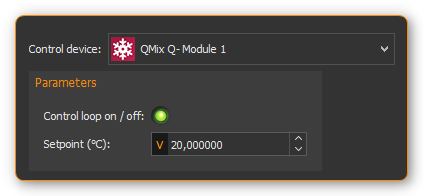

Controller Plugin
======================

Introduction
------------

The Controller plugin is used to integrate the CETONI controller
modules into the CETONI Elements software and to allow the creation of dynamic
user defined control channels. The following hardware modules are
supported:

.. rst-class:: guinums

#. **Qmix Q-** - thermoelectric cooling module
#. **Qmix Q+** - two-channel heating module
#. **Qmix TC** - two channel controller module for external
   heating-cooling-systems (i.e. for connecting syringe heating mounted on Nemesys
   syringe pumps)

.. include:: qmixcontroller_common_EN.inc.rst

Controller Script Functions
---------------------------

.. _introduction-controller-script-functions:

Introduction
~~~~~~~~~~~~

The controller plugin contains script functions for changing the
controller parameters from a script. This makes it possible to achieve,
for example, time controlled temperature curves.

|Figure 14: Qmix controller script functions|

Set Controller Param
~~~~~~~~~~~~~~~~~~~~~~

.. image:: Pictures/1000067B0000388E0000388E578BCCCA.svg
   :width: 60
   :align: left

With this function, you can transfer a new setpoint to the
controller channel or switch the control loop on or off. To switch it on
and off, simply click the :guilabel:`Control loop on / off` LED in the
configuration area (see figure below).

|

PID Control Function
~~~~~~~~~~~~~~~~~~~~

.. _introduction-pid-control-function:

Introduction
^^^^^^^^^^^^

.. image:: Pictures/10000B740000388E0000388E0BB445FF.svg
   :width: 60
   :align: left

This function implements a PID controller using a PID
algorithm for applications that require an efficient algorithm. The PID
algorithm features control output range limiting with integrator
anti-windup.

Currently, the Proportional-Integral-Derivative (PID) algorithm is the
most common control algorithm used in industry. Often, people use PID to
control processes that include heating and cooling systems, fluid level
monitoring, flow control, and pressure control. In PID control, you must
specify a process variable and a setpoint. The process variable is the
system parameter you want to control, such as temperature, pressure, or
flow rate, and the setpoint is the desired value for the parameter you
are controlling. A PID controller determines a controller output value,
such as the heater power or valve position. The controller applies the
controller output value to the system, which in turn drives the process
variable toward the setpoint value.

Configuration
^^^^^^^^^^^^^^^

In the configuration area of this function you can configure all
parameters required for proper PID control.

You need to configure the following parameters:

.. rst-class:: guinums

1. **Actual Value Input** – this parameter specifies the measured value
   of the process variable being controlled. This value is equal to the
   feedback value of the feedback control loop. Enter a variable name
   here, or enter a :ref:`Device Property Identifier <Device Property Identifiers>`
   in order to directly read specific process data of a certain device.
2. **Setpoint** – specifies the setpoint value, or desired value, of
   the process variable being controlled. You can enter a fixed value
   (like 50°C) or you can pass the value in a variable.
3. **Control Loop Parameters** – specify the proportional
   gain (K), integral time (T\ :sub:`I`\) , and
   derivative time (T\ :sub:`D`\) parameters of the controller and
   thus directly affect the control characteristic of the controller.

   .. image:: Pictures/10000201000001F400000208F1F44DB1.png

4. **Controller Output** – This section groups all settings for the
   controller output. *Control Value Output* returns the control output
   of the PID algorithm that is applied to the controlled process. I.e.
   if you implemented a temperature control loop, the *Control Value
   Output* would be the heating power that must be generated from the
   heater. Enter a variable name of a variable that can store the output
   value or use a :ref:`Device Property Identifier <Device Property Identifiers>`
   to write the value directly into a device property of a certain device.

   |Figure : Enter process data identifier via context menu|

   With the parameters U\ :sub:`max` and U\ :sub:`min` you limit the
   range of the controller output. If you e.g. control the heating power
   via a 0 – 5 V analog output, then enter 0 for U\ :sub:`min` and 5
   for U\ :sub:`max`. If the control algorithm generates values that are
   outside of this range, they will be limited to the range
   automatically.

.. tip::
   You can use the PID control function to
   implement a P, PI or PD controller by simply setting
   the unneeded PID gains to 0.

PID control parameters
^^^^^^^^^^^^^^^^^^^^^^^^

A set of PID control parameters contains a proportional, an integral
and a derivative part.

Proportional part
'''''''''''''''''''

The proportional part computes the control deviation from the setpoint
(W) and the actual value (X)

.. image:: Pictures/math_01.png
   :scale: 20%

and multiplied with the proportional gain, gives it as control value
(Y) to the controlled system. The following equation shows the
proportional part.

.. image:: Pictures/math_02.png
   :scale: 20%

Integral part
'''''''''''''''

Mathematics forms the integral part the area enclosed by control
deviation and timeline. If there is a contant control error, the
integral part grows ramp shape.

For a constant control deviation the equation is:

.. image:: Pictures/math_03.png
   :scale: 20%

- Y\ :sub:`t0`: Control value at th./Pictures/e beginning of the observation
- T\ :sub:`i`: Integration time

If the actual value equals the setpoint the control value does not
change. The control value built up by the integral part remains and will
not decrease until the actual value exceeds the setpoint value. With
controlled systems containing a delay line the integral part eliminates
the steady-state error which a proportional controller is not capable
of. In general the following equation holds for the integral part.

.. image:: Pictures/math_04.png
   :scale: 20%

With the integration time the speed of the controller can be changed.
The smaller T*\ :sub:`I` the faster the integral part builts up a
control value. The given equation states that the proportional gain K,
too, impacts the integral part. In CETONI Elements the integral part can
only be configured in conjunction with the proportional part. Thus the
following equation applies:

.. admonition:: Important
   :class: note

   The integral part compensates the
   steady-state control error.

Derivative Part
'''''''''''''''''

The derivative part counteracts changes in the actual value. Two
scenarios can be considered with respect to the effect of derivative
part.

-  After the actual value has reached a stable final value, it is
   decreasing because of a disturbance suddenly occurred. The derivative
   part gives an additional control value that helps increasing the
   actual value.
-  If the setpoint value is increased, the actual value increases too.
   The derivative part recognizes the increasing actual value and slows
   down by an additional negative control value starting up to the
   target value.

In practical use the derivative part occurs only in combination with a
proportional part. The controller equation is:

.. image:: Pictures/math_06.png
   :scale: 20%

The bigger the proportional gain K and the derivative time T\ :sub:`D`
the bigger the effect of the derivative part and the stronger the change
of the actual value is counteracted.

Summary
'''''''

The following table summarizes the effect of the different control
parameters.

+---------------+-------------------------+-------------------------+
| PID parameter | Regulating on a         | Start-up of the         |
|               | disturbance of the      | setpoint                |
|               | controlled system       |                         |
+===============+=========================+=========================+
| K higher      | stronger repsonse       | faster start-up         |
|               | (reduced damping)       |                         |
+---------------+-------------------------+-------------------------+
| K smaller     | weaker response         | slower start-up         |
|               | (increased damping)     |                         |
+---------------+-------------------------+-------------------------+
| TI higher     | weaker repsonse,        | Slower start-up and     |
|               | particularly on         | compensation of the     |
|               | short-term              | steady-state error      |
|               | disturbances, the       |                         |
|               | controller has only a   |                         |
|               | weak response           |                         |
+---------------+-------------------------+-------------------------+
| TI smaller    | stronger repsonse,      | faster start-up and     |
|               | particularly on         | compensation of the     |
|               | short-term              | steady-state error      |
|               | disturbances, the       | (Overshooting if        |
|               | controller has only a   | T\ :sub:`I` is too      |
|               | weak response           | small)                  |
+---------------+-------------------------+-------------------------+
| TD higher     | stronger repsonse       | slower start-up         |
|               |                         | (stronger reaction      |
|               |                         | against changes in      |
|               |                         | actual value)           |
+---------------+-------------------------+-------------------------+
| TD smaller    | weaker response         | faster start-up (weaker |
|               |                         | reaction against        |
|               |                         | changes in actual       |
|               |                         | value)                  |
+---------------+-------------------------+-------------------------+

Programming the control loop
^^^^^^^^^^^^^^^^^^^^^^^^^^^^^^

This section shows you how to realize a complete PID control loop in a
script program by using the PID control function.

|Figure : PID controller example scripts|

To implement a control loop, proceed as follows:

.. rst-class:: guinums

1. The controller must be called cyclically in a fixed time
   interval. For this, you should use a loop. In this case, use a
   conditional loop :ref:`Conditional Loop` with the loop condition
   1. The condition 1 is always true and the loop runs forever and never
   stops, except the user stops program execution manually.
2. Now create a :ref:`PID Control Function` within the loop and configure
   all parameters.
3. Inside the loop you need to place a :ref:`Delay` to insert a defined delay time
   200 milliseconds. This time determines the frequency, with which the
   control algorithm is called and hence the *dt* that is used in the
   algorithm for the calculation of the control parameters.

Now you have built a control loop that reads the current temperature via
an analog input, computes an output value in the PID control function,
which is then used with an analog output for adjusting the heating
power.

.. tip::
   According to control theory, a control system
   must sample a physical process at a rate about 10 times
   faster than the fastest time constant in the physical
   process. For example, a time constant of 60 s is
   typical for a temperature control loop in a small
   system. In this case, a cycle time of about 6 s is
   sufficient. Faster cycling offers no improvement in
   performance

.. |Figure 14: Qmix controller script functions| image:: Pictures/10000201000001240000007754114FA5.png

.. |Figure : Enter process data identifier via context menu| image:: Pictures/10000000000001D7000000C159F1FF85.png

.. |Figure : PID controller example scripts| image:: Pictures/10000201000001A3000000BAB53FB1F8.png

.. include:: qmixcontroller_pid_EN.inc.rst
