Creating Device Configurations
==============================

Introduction
------------

In order to combine single devices according to your requirements and
use them in CETONI Elements, you have to create a device configuration.
Creating device configurations can be done using the *Device
Configurator* which is integrated in the CETONI Elements software. The
Device Configurator features the *Device Configuration Wizard* that
guides you through the integration of your devices into your device
configuration.

Starting the Device Configurator
--------------------------------

You can start the *Device Configurator* by selecting the menu item
:menuselection:`Device --> Create Configuration` from the main menu.

.. image:: Pictures/1000020100000142000000E460C63C6ECF459963.png

To use the Device Configurator to configure your devices, a valid license must 
be installed. If you only have a demo license, then only device configurations 
with simulated devices can be created and it is not possible to configure your 
devices with it.

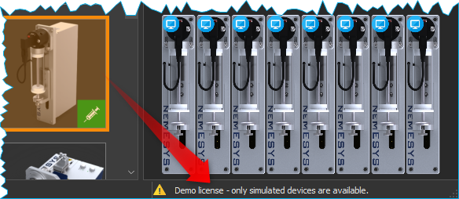

.. admonition:: Important
   :class: note

   :ref:`Activate your License<Activate License>` before you start the 
   *Device Configurator* if you want to configure your real devices.

Import a device database
------------------------

The device configurator and the configuration wizard use a device
database :file:`devices.db`` to read device-specifc parameters and settings
for configuration of the devices.

During the installation of the CETONI Elements software this database is
already installed. If you use devices that are not yet listed in the
device database (e.g. if your devices are newer than the latest CETONI
Elements software version), you may need to import an updated version of
the device database. This database can be found either on your
installation media or your get it directly from CETONI.

When you start the device configurator, you will be asked if you want to
import a new device database. If your installation media contains the
file :file:`devices.db`, you should import it now.

.. tip::
   If your installation media does not contain a  
   device database, your devices are already supported by   
   the CETONI Elements software and you can skip the device 
   database import.

#. Confirm the query by left-clicking the :guilabel:`Yes` button.

   |Figure 2: Query for device database import|

#. A file selection dialog opens. Select the database file :file:`devices.db` located in the
   root directory of the CETONI Elements CD (see figure below).
   
   |Figure 3: Device database import dialog|
   
#. The device configurator now has an actual device database available.

.. admonition:: Important
   :class: note

   The device database contains important    
   configuration information about your devices. You always 
   have to import an actual device database if you purchase 
   new devices from the CETONI GmbH.  

As long as you don't purchase new devices you needn't import a device
database on start of the device configurator. If you don't want CETONI
Elements to further ask for database import just check 
:guilabel:`Do not ask me again` and confirm by left-clicking :guilabel:`No` 
(see figure below).

|Figure 4: Deselect device database import|

If you want to import a device database in the
future you can reach the import dialog by selecting 
:menuselection:`Device → Import Device Database` from the main menu (see figure below).

|Figure 5: Import device database menu item|

.. tip::
   You don't have to import a device database on  
   each start of the device configurator. As long as you    
   don't purchase any new devices, you don't need to import 
   a new device database.    

Overview
--------

|Figure 7: Device Configurator overview|

The Device Configurator is divided into the following three parts:

.. rst-class:: guinums

1. **Toolbar** – Functions for creating, loading and saving device
   configurations, as well as starting the Device Configuration Wizard. 
2. **Device List** – Selection of available devices.
3. **Device configuration** created by user.

Toolbar
-------

The toolbar contains the following functions:

+-----------+---------------------------------------------------------+
| |image26| | Creates a new, empty device configuration.              |
+-----------+---------------------------------------------------------+
| |image27| | Loads an existing device configuration.                 |
+-----------+---------------------------------------------------------+
| |image28| | Saves the created device configuration.                 |
+-----------+---------------------------------------------------------+
| |image29| | Saves the created device configuration using a new      |
|           | name.                                                   |
+-----------+---------------------------------------------------------+
| |image30| | Sets all devices of the created device configuration to |
|           | simulated.                                              |
+-----------+---------------------------------------------------------+
| |image31| | Starts the add-on plugins selection dialog. These are   |
|           | optional software extensions that CETONI has developed  |
|           | customer-specific, possibly on your behalf.             |
+-----------+---------------------------------------------------------+
| |image32| | Starts the Device Configuration Wizard.                 |
+-----------+---------------------------------------------------------+
| |image33| | Restarts the software with the device configuration     |
|           | from the device configurator                            |
+-----------+---------------------------------------------------------+

Device Configuration Wizard
---------------------------

|Figure 8: The Device Configuration Wizard|

The *Device Configuration Wizard* guides you through the integration of your
devices into your device configuration. You **must** execute the 
Device Configuration Wizard after:

-  creating a new device configuration or changing an existing one.
-  swapping devices or integrating a new device into an existing device
   configuration.
-  an update of the CETONI Elements software

.. admonition:: Important
   :class: note

   Device configurations and devices belong 
   together. Always execute the Device Configuration Wizard if you want to
   change a device configuration or integrate a new device into an existing
   device configuration.        

Your device configuration should always be created with the software
version with which you want to use the configuration, otherwise errors
may occur. If the device configuration was created with another software
version, you will receive a warning message when the application is
started.

.. image:: Pictures/outdated_device_config.png

If you see this warning, you should open the device
configuration in the *Device Configurator*, save it and then configure
all devices using the *Configuration Wizard*.

Creating a sample device configuration
--------------------------------------

The following example describes the creation of a device configuration
containing a Nemesys S dosing module and a Qmix Q+ module.

.. rst-class:: steps

#. :ref:`Start the Device Configurator<Starting the Device Configurator>`
#. Left-click on the Nemesys S dosing module listed in the device list
   :guinum:`❶` and hold down the mouse button.
#. Drag the Nemesys dosing module into the device configuration :guinum:`❷`
   holding the mouse button down. As soon as you release the mouse
   button the Nemesys dosing module is added to the device
   configuration. Alternatively, you can add a device by
   double-clicking on it in the device list.

   .. tip::
      You can add devices via drag & drop or by a double click.  

   .. image:: Pictures/1000020100000315000001F95769560860DF416C.png

   .. tip::
      You can remove devices from the device        
      configuration by selecting the device by clicking it    
      and then pressing the Delete key.   

#. Proceed in the same way with the Qmix Q+ module.
#. Save your configuration under a meaningful name by clicking on the
   :guilabel:`Save` button :guinum:`❸`
#. Start the Device Configuration Wizard by left-clicking :guilabel:`Configure`
   :guinum:`❹`

   .. admonition:: Attention
      :class: caution

      Make sure that the mains voltage on your 
      Base module or on your power supply is switched off     
      before connecting or disconnecting modules to your      
      system. Not doing so may result in damage or            
      malfunction.  

#. The Device Configuration Wizard advices you to follow these
   instructions:

   -  Ensure that the Nemesys S module which is to be configured is
      connected to your Base module. Turn the Nemesys S power switch ON.
      The blue Power LED should now light up
   -  Switch off all other modules that have a power switch
   -  Remove all other modules from the setup, that do not have a power
      switch – in this case, that would be the Qmix Q+ module (Attention:
      Switch of the mains voltage at the Base module before removing or
      adding modules)
   -  Ensure that the terminator is plugged into the last module of your
      setup – the Nemesys S in this case
   -  Switch on the mains power switch on your Base module or on your power
      supply unit.
   -  Check that the Nemesys S module is really the only device that is
      powered on now. The blue power LED of all other modules must be off

   .. image:: Pictures/10000201000003860000027872DE1FBA980DE172.png

   .. admonition:: Important
      :class: note

      During the configuration of a device, no 
      other switched-on devices may be connected to the Base  
      module, as otherwise errors may occur during the        
      configuration or subsequent malfunctions.   

   -  Click :guilabel:`Next` to start device configuration

#. The Nemesys S pump is being configured. This may take a few seconds.

   .. image:: Pictures/1000020100000386000002783B7DFF9EE7B610D1.png

#. The Device Configuration Wizard displays the Nemesys S dosing module
   configured successfully. Left-click :guilabel:`Next` to proceed.
   
   |Figure 12: Device configuration successful|

#. The Device Configuration Wizard advices you to follow these instructions (see
   image below):

   -  Ensure that the Qmix Q+ module is connected to your base module
   -  Switch off all other devices that have a power switch – in this case
      switch off the Nemesys S module. Alternatively, you can remove the
      Nemesys S pump from the base module and connect only the Qmix Q+
      module.
   -  Remove all other modules from the setup, that do not have a power
      switch
   -  Ensure that the terminator is plugged into the last module of your
      setup
   -  Switch on the mains power switch on your Base module or on your power
      supply unit.
   -  Check that the Qmix Q+ module is really the only device that is
      powered on now. The blue power LED of all other modules must be off

   |Figure 13: Unplug configured device|

#. Click :guilabel:`Next` to configure the QmixQ+ module.
#. On the next page check *Import and activate new device configuration
   into CETONI Elements now*. Doing so CETONI Elements activates the
   new device configuration and restarts after finishing the Device
   Configuration Wizard.

   |Figure 14: Activating device configuration|

#. Prepare the restart of CETONI Elements with the created device configuration:

   -  Switch off the Base module.
   -  Plug the Nemesys dosing module and the Qmix Q+ module to the base
      module.
   -  Plug the terminator.
   -  Switch on the base module again.
   -  Turn on the power switch of the Nemesys S pump
   -  Finish the Device Configuration Wizard by left-clicking :guilabel:`Finish`

   |Figure 15: Finishing the Device Configuration Wizard|

#. Confirm the software restart with the new device configuration.

   |Figure 16: Confirming restart of CETONI Elements|

#. CETONI Elements now offers the functions of the Nemesys S dosing module and 
   the Qmix Q+ module.

Extending an existing device configuration
------------------------------------------

The following example shows how you can add another device to the
configuration created in the previous section.

.. rst-class:: steps

#. :ref:`Start the Device Configurator<Starting the Device Configurator>`
#. After start of the Device Configurator the device configuration
   currently loaded by the CETONI Elements software is shown. The green
   checks displayed on top of the devices indicate that these devices
   have already been configured.
   
   |Figure 17: Displaying the currently loaded device configuration|
    
#. If you want to change another device configuration
   as the one currently loaded by CETONI Elements, you have to load the
   desired device configuration using the :guilabel:`Open` button.
   
   |Figure 18: Loading a device configuration|

#. Add a further device
   via Drag & Drop as described in the previous section. The
   exclamation mark above the device points out that it has not been
   configured yet. The configuration can't be used in this state.

   .. image:: Pictures/1000020100000495000002DBE574762DF8C08052.png

   .. admonition:: Important
      :class: note

      If a device configuration contains not   
      configured devices, it is invalid and can't be used     
      yet.  

#. Save the configuration and start the *Device Configuration Wizard* by 
   clicking the :guilabel:`Configure` button.
   
   |Figure 20: Starting the Device Configuration Wizard|

#. If the software has already been connected to the plugged devices, the
   device configuration process can't be continued. In this case the
   Device Configuration Wizard proposes to automatically restart the
   software and the Device Configurator. Click the :guilabel:`Yes` button if you
   agree.

   |Figure 21: Restart the Device Configurator|
   
#. The device configuration process known from the previous section starts. But
   this time the wizard proposes on the second page to exclude devices
   from the device configuration process that have already been
   configured. Just check :guilabel:`Skip configured devices`.

   |Figure 22: Skip configured devices|

#. The Device Configuration
   Wizard directly continues with the configuration of the newly added
   device (Qmix P in this example).

   |Figure 23: Configuration of the newly added device|
   
#. Just finish the *Device Configuration Wizard* the same way you would have done
   if you had created a device configuration from scratch.
#. After restart the functionality of the new device is available to
   you.

Configuration of a single device
--------------------------------

You can configure a single device from your configuration in the Device
Configurator at any time - e. g. if you have exchanged a defective
device for a new one. Simply right-click on the device to be configured
and select the menu item :menuselection:`Configure`.

|Figure 24: Configuring a single device|

The configuration wizard now guides you through the configuration of the individual device.

Simulated devices
-----------------

You can set single devices or a whole device configuration to simulated.
This is useful if you want create CETONI Elements
scripts using devices not available at the moment. The CETONI Elements
demo configuration for example completely consists of simulated devices.
Proceed as follows in order to simulate a single device:

#. In the device configuration right-click the device you want to
   simulate.
#. Left-click the button :guilabel:`Simulate`

   |Figure 25: Simulating a single device|
   
#. The device is marked as
   simulated. Save the device configuration. The next time you load
   this device configuration in CETONI Elements the simulated device
   will be available to you.

   |Figure 26: Simulated device|

You can simulate a whole device configuration by left-clicking 
:guilabel:`Simulate All` in the main toolbar.

|Figure 27: Simulating a whole device configuration|

Optional Add-On Plugins
-----------------------

There are optional extensions of the software, which CETONI has
developed, possibly on your behalf, according to customer
specifications. However, certain plugins may not be required for a
certain device configuration, or may not be suitable for this purpose.
When creating and editing a device configuration, you can freely
configure which optional plugins should be loaded with your device
configuration.

.. tip::
   The CETONI Elements software can be extended  
   with customer-specific plugins. Please contact us if    
   you need a specific adaptation of the software          
   functionality.

If you only have a standard version of CETONI Elements installed, no
optional add-on plugins will be available. Accordingly, the function for
configuring optional add-on plugins is disabled (see figure below).

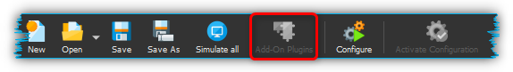

If you have installed a CETONI Elements add-on that contains optional plugins,
this function is available (see figure below).

.. image:: Pictures/100002010000025100000053D81EEF100715C18F.png

.. admonition:: Important
   :class: note

   Not every CETONI Elements add-on       
   contains optional plugins. Many add-ons (e.g.           
   Spectroscopy Add-On) contain only mandatory plugins     
   that must be loaded to provide device functionality.    
   Mandatory plugins cannot be selected using this         
   function. These are always loaded automatically if the  
   respective device (e.g. Qmix λ) has been configured. 

If you click with the left mouse button on the :guilabel:`Add-On Plugins`
function, the Add-On Plugins Selection Dialog appears. In the lower half
of the dialog, there is a table that displays all available optional
add-on plugins (see figure below).

.. image:: Pictures/10000201000001F1000001F405E5F7AACBD5FB5C.png

You can display information about the Add-On plugin by moving the mouse
over the respective table entry (see figure below).

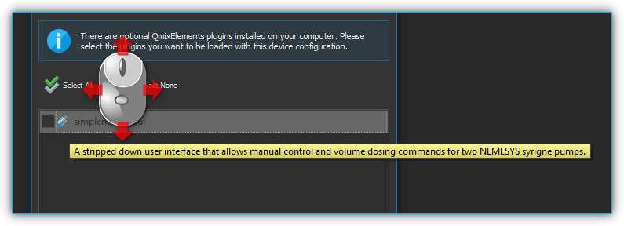

To add an optional add-on plugin to your device configuration, check the
box next to the plugin :guinum:`❶` and then click :guilabel:`Ok` :guinum:`❷`.
Finally, you must save the configuration :guinum:`❸` to permanently apply the
changes (see figure below).

.. image:: Pictures/1000020100000394000002698426A6B470626331.png

.. |Figure 2: Query for device database import| image:: Pictures/100002010000021400000104F1C5A4A3FB36B583.png

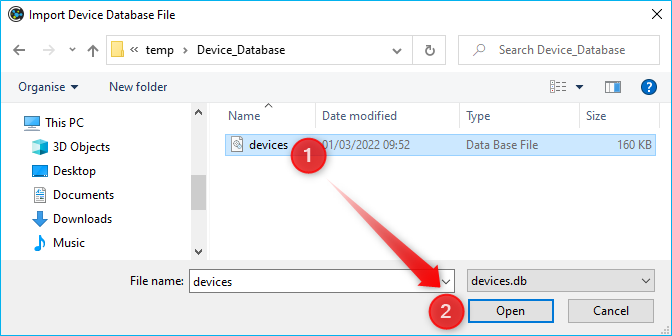

.. |Figure 4: Deselect device database import| image:: Pictures/10000201000002140000010401848AB92A244C42.png

.. |Figure 5: Import device database menu item| image:: Pictures/100002010000012C000000D9432772F445244F1B.png

.. |Figure 7: Device Configurator overview| image:: Pictures/10000201000003A8000002551C97F93586909741.png

.. |image26| image:: Pictures/100016B7000034EB000034EBF007ABD978022879.svg
   :width: 40

.. |image28| image:: Pictures/10000CE50000350500003505303BFDEECD65BB70.svg
   :width: 40
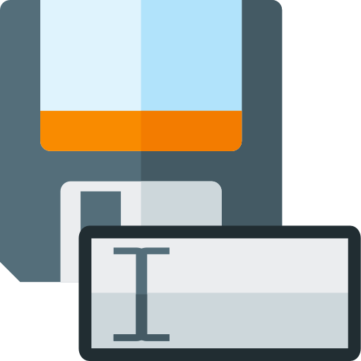
.. |image30| image:: Pictures/100011C0000034EB000034EBDA043906CEBA5F5A.svg
   :width: 40
.. |image31| image:: Pictures/10000AD00000350500003505C47905C00A889D90.svg
   :width: 40
.. |image32| image:: Pictures/10002680000034EB000034EBD15B809B1EA625C8.svg
   :width: 40
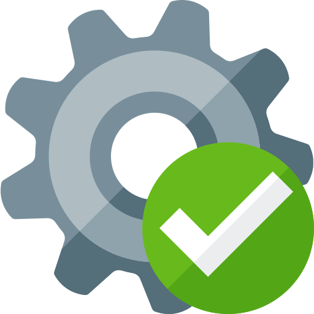
.. |Figure 8: The Device Configuration Wizard| image:: Pictures/1000020100000386000002786DDB775867DDCAEB.png

.. |Figure 12: Device configuration successful| image:: Pictures/1000020100000386000002780368D5E4C23E8331.png

.. |Figure 13: Unplug configured device| image:: Pictures/100002010000038600000278BB49B91B78BAF742.png

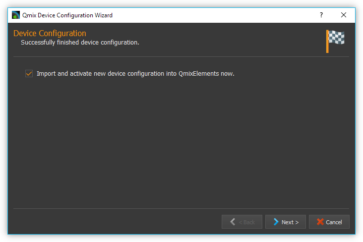

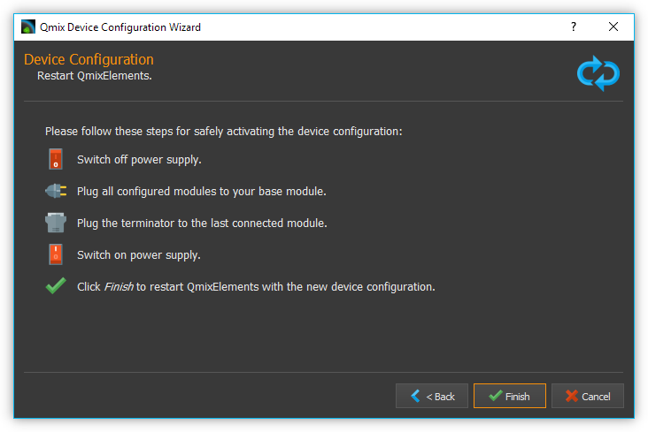

.. |Figure 16: Confirming restart of CETONI Elements| image:: Pictures/1000020100000209000000973518A94FC04F6523.png

.. |Figure 17: Displaying the currently loaded device configuration| image:: Pictures/1000020100000495000002DBC4E00C234E4AF418.png

.. |Figure 18: Loading a device configuration| image:: Pictures/100002010000025F000000564EB0B2BD3EA73911.png

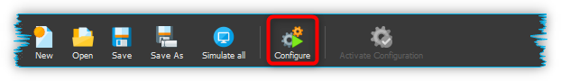

.. |Figure 21: Restart the Device Configurator| image:: Pictures/1000020100000214000000B9F911FCCD726CA849.png

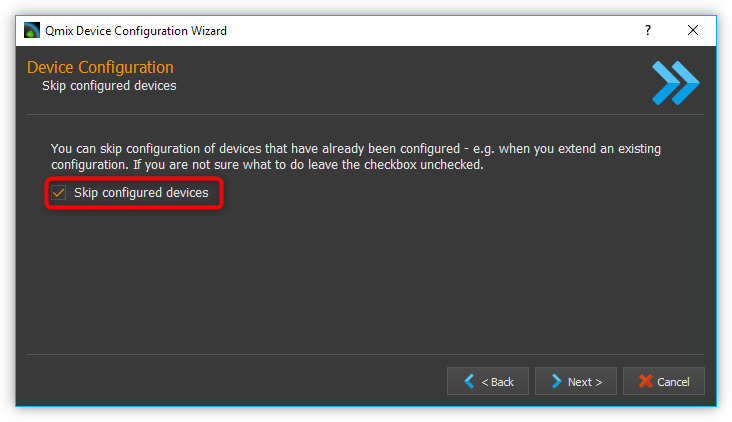

.. |Figure 23: Configuration of the newly added device| image:: Pictures/10000201000002DC000001C34265519F69AC6D55.png

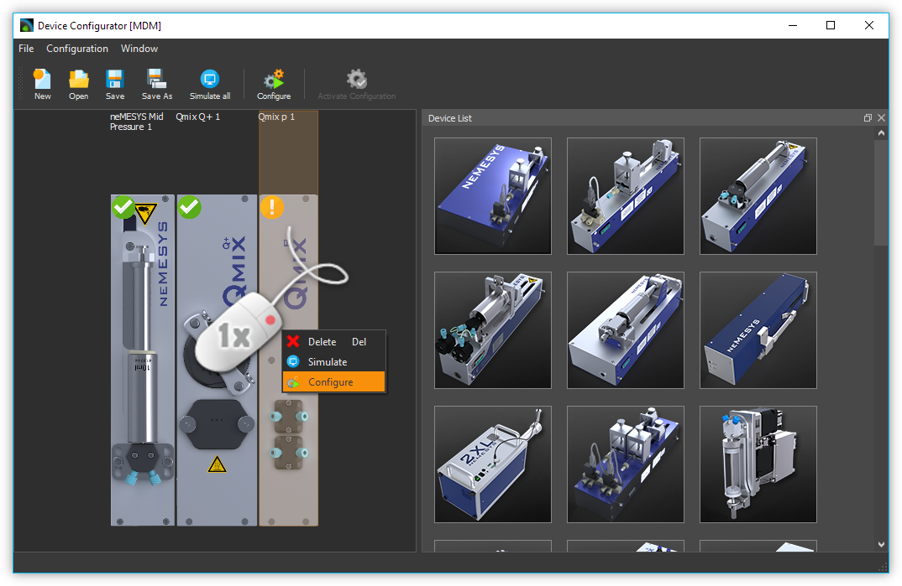

.. |Figure 25: Simulating a single device| image:: Pictures/100002010000024900000114FAB67531E84DD8FF.png

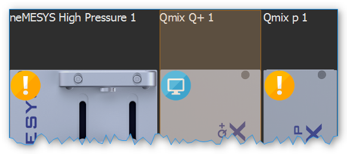

.. |Figure 27: Simulating a whole device configuration| image:: Pictures/10000201000003A4000001AB6990B251D2B11E55.png
